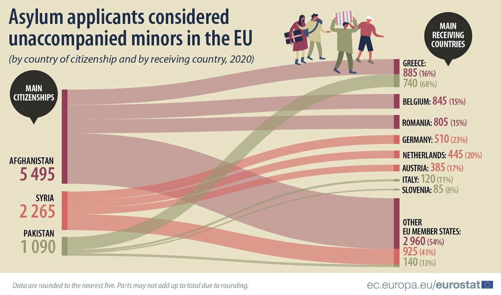

### AYS Weekend Digest 24–25/04/21: A Deadly Weekend in the Mediterranean

_Closure of municipality\-run camp in Lesvos — Arrivals in the Canary Islands — Bodies found off Ceuta — 45,000\+ people returned from France at Italian and Spanish borders\._

 : “Happy 25th April\! Today, as well as every day, we at Sea Watch are raising the flag of Anti\-Fascist Action, to remind us that the struggle never stops\. Let‘s not forget what fascism is, let’s carry on our fight for a fairer, more responsible and more humane Europe\.](assets/b24d7e87c294/1*XrMoEWgVBLJfTqs_r2kNVQ.jpeg)

On Sunday, Italy celebrated _Liberation Day,_ commemorating the end of the fascist regime and of the occupation by Nazi Germany during World War II and the victory of the the Resistance movement\. This is a message from [Sea\-Watch Italy](https://twitter.com/SeaWatchItaly/status/1386238477818384384) : “Happy 25th April\! Today, as well as every day, we at Sea Watch are raising the flag of Anti\-Fascist Action, to remind us that the struggle never stops\. Let‘s not forget what fascism is, let’s carry on our fight for a fairer, more responsible and more humane Europe\.
#### FEATURED: A deadly weekend in the Mediterranean

Last week at least three boats set off from Libyan shores\. One carried 130 people, they all drowned in bad weather\. The other carried approximately 100 people, a woman and a baby both lost their lives\. The last held 42 people who are now believed to be in Tunisia\.

[According to local media](https://www.lavozdelsur.es/ediciones/provincia-cadiz/buque-mercante-algeciras-podria-haber-evitado-naufragio-libia-autoridades-estaban-alertadas_259018_102.html?fbclid=IwAR0FULYwuX6tIDTS_fFzpDbumFn8_dbxpzuggs-O8UrjskZt4e_k8bOARPU) , on the morning of April 21, Alarm Phone was alerted by local fishermen to an overburdened vessel with approximately 120 \(other reports state 130\) people onboard off the Libyan coast, who had left **Al\-Khoms** the night before\. They had left along with a second boat, with about 100 people\. At 09\.51 Alarm Phone alerted MRCC Italia, RCC Malta, the Libyan coastguard, UNHCR, and rescue NGOs by email and telephone\.

> Our condolences to the relatives, partners & friends of the missing and dead\. We hope we will find out who they were\. The racist violence of the European border regime inflicts pain & trauma on peoples & communities around the world\. We promise we will keep fighting to abolish it\. Europe’s border regime will keep killing if not stopped\. State actors & Frontex only seek to protect borders rather than people\. They need to be abolished & replaced by a Civil Rescue Coordination Centre that has the objective of rescuing people rather than killing them — [_Alarm Phone_](https://twitter.com/alarm_phone/status/1385871708347932672) 

At around 12\.00, Alarm Phone updated MRCC Italia about the merchant ship _Bruna,_ which was nearby and also contacted the merchant ship directly\. Unfortunately, _Bruna_ had previously rescued a boat in danger, and been fined 25,000 euros by Italy\. They did not provide rescue on this occasion\. Libyan authorities also did not help, stating bad weather conditions\.

However, Libyan authorities had intercepted the boat carrying 100 people on which they found the bodies of a woman and her baby\.

At 22\.55 hours Alarm Phone informed Italian MRCC that the Libyan coast guard had stated that they would not carry out any search operations\. The following day, a further 42 people in a third boat contacted Alarm Phone\.

At 17\.00 hours on April 22, Alarm Phone received an email from Ocean Viking stating that they had found the remains of a shipwreck and various bodies, with no sign of survivors\. It sank [43 miles north of Garabulli](http://nuovidesaparecidos.net/?p=4528&fbclid=IwAR1gJODBzOXC-rCunNrReAcRpczw_Mn3rhfP31ab5ZgA1t1RobNC3OR-MHI) \.

Alarm Phone report that Frontex’s Osprey surveillance aircraft was at the site of the events\. 32 hours passed since all competent authorities were alerted and the bodies found by Ocean Viking\.

As Italian journalist Sergio Scandura [points out](https://twitter.com/scandura/status/1386260033973915653/photo/1) , planes’ tracks now draw a clear result in the Mediterranean: “Italian, Maltese and Frontex planes observe from above not so much to save but to verify that — either rejected alive in the Libyan hell, or dead by drowning — they are unable to reach our shores\.”

[In an interview with British Press](https://www.theguardian.com/global-development/2021/apr/25/a-mayday-call-a-dash-across-the-ocean-and-130-souls-lost-at-sea?utm_term=Autofeed&CMP=twt_gu&utm_medium&utm_source=Twitter&fbclid=IwAR1z-9JJOvuS-6Tgduuh8TSDxdJd42JVJI7_IMJdSpCg4DtjElrVUx1SHWM#Echobox=1619331235) , Ocean Viking sailor, Albera, described how the final shipwreck was in the Libyan SAR Zone and thus it was their responsibility to collect the bodies\. The Ocean Viking waited a full day next to shipwreck and the men, women and children who floated next to it, but in the end they had to leave\.

> We have to continue our mission, as this way there is a chance that we can prevent others from meeting the same fate \[…\] But the decision to leave is something that all of us onboard will have to live with for ever\. 

Yet for other people in distress at sea, a different story:

■■■■■■■■■■■■■■ 
> **[Mediterranea Saving Humans USA](https://twitter.com/SavingHumansUSA) @ Twitter Says:** 

> > For a white US citizen “all vessels in area are to proceed” in rescue, per @[Armed_Forces_MT](https://twitter.com/Armed_Forces_MT). Hours hours later @[alarm_phone](https://twitter.com/alarm_phone) reported a rubber boat adrift. They were black. They’re now all dead, 130 or more. Shame on #EU. Shame on all of us.
#ALLBlackLivesMatter 
@[RescueMed](https://twitter.com/RescueMed) https://t.co/g8DK5GbPzv 

> **Tweeted at [2021-04-24 16:23:55](https://twitter.com/savinghumansusa/status/1385992911632875521).** 

■■■■■■■■■■■■■■ 

Hopefully a bit of good news: the 42 people who had been at sea since Wednesday with engine trouble and high waves are thought to have [made it to Tunisia yesterday](https://twitter.com/alarm_phone/status/1386372261570129921) \. We desperately hope this is true, but they would never have had to risk their lives in this way were it not for mobility inequality purposefully created by EU policy and [paid for with millions in EU money](https://www.avvenire.it/attualita/pagine/quei-guardiacoste-libici-a-caccia-di-motori?fbclid=IwAR30ZaYOWH3kQhebltPLt2L-yD8S2rsfh9PzYr35eCxKJ6kQE6t3M0_aPdo) \.

Meanwhile SAR crews and their vessels still face constant criminalisation and obstructions\. The Open Arms, [**Sea\-Watch 3**](http://www.ilmanifesto.it/punita-la-sea-watch-3-tutti-contro-le-ong/) and Alan Kurdi are all in [administrative detention in Pozzallo, Augusta and Olbia respectively](https://ilmanifesto.it/come-hanno-fermato-le-navi-delle-ong/?fbclid=IwAR2Pdr7LY3aUpTuSAvULBFsGSZC4GAn0rCqjF7SiFca0yfCnlTky0HRFFpg) \.

GREECE
#### Evicted to Moria 2\.0

[At 5am on Saturday](https://twitter.com/MSF_Sea/status/1385865578053869568) the first group of 50 people were moved from the original municipality run Kara Tepe camp, largely a camp for people with vulnerabilities, into tents in Moria 2\.0\.

 \)](assets/b24d7e87c294/1*vPyIvR9zJRpDIh1ov98F_g.jpeg)

\(Photo Credit: [MSF](https://twitter.com/MSF_Sea/status/1385865586262122499) \)

> I was informed last night that Kara Tepe 1 will be closed\. Everyone will go to the new camp\. I could not sleep\. I remember the morning when Pikpa closed, everyone was so stressed\. Europe has become a nightmare for asylum seekers — [_message of an ex\-resident of Pikpa camp_](https://twitter.com/MSF_Sea/status/1385865582168444929) 

■■■■■■■■■■■■■■ 
> **[Franziska Grillmeier](https://twitter.com/f_grillmeier) @ Twitter Says:** 

> > This is how a place looks, where people just got pulled out of bed at 5am in the morning to be brought into a fenced off camp next door. #KaraTepe https://t.co/jVG6IhjxQU 

> **Tweeted at [2021-04-24 09:47:56](https://twitter.com/f_grillmeier/status/1385893258262466560).** 

■■■■■■■■■■■■■■ 

It is expected that everyone will be evicted by the end of April, with all ESTIA accommodation \(flats for people with vulnerabilities\) being closed by the end of the year, [according to RSA](https://rsaegean.org/en/another-dignified-reception-facility-shut-down/?fbclid=IwAR3nyJOuHOA4OUY5glB4tzLFY9RjsAR5-bgzV74v1Lo8BmejTp1ZKKb-pew) \. Kara Tepe has been run by the municipality since 2015 and people housed there — including recognised refugees and people evicted last year from PIKPA — live in containers with beds, heating, water and electricity, meaning conditions guaranteeing basic dignified living, something not possible in Moria 2\.0\.

■■■■■■■■■■■■■■ 
> **[MSF Sea](https://twitter.com/MSF_Sea) @ Twitter Says:** 

> > “April 24, 5am, in the rain. We are kicked out again. We don’t understand what we have to do! We came from Afghanistan to Europe for our children &amp; they keep traumatizing us. What should we do? What is happening?” says a man who used to live in #Pikpacamp, now evicted again. https://t.co/GveHgCw8xo 

> **Tweeted at [2021-04-24 11:54:26](https://twitter.com/msf_sea/status/1385925095462473728).** 

■■■■■■■■■■■■■■ 

> In the coming days more people will be moved to undignified conditions in the new camp as the Greek authorities are closing down one of the few safe places on [\#Lesbos](https://twitter.com/hashtag/Lesbos?src=hashtag_click) \. This is just cruel & irrational\! Instead of moving people to safety, the EU & Greece just do the opposite\! — [_MSF_](https://twitter.com/MSF_Sea/status/1385865586262122499) 

■■■■■■■■■■■■■■ 
> **[MSF Sea](https://twitter.com/MSF_Sea) @ Twitter Says:** 

> > A woman among those forced to the new camp of #Lesbos: “24 April, 5am, Kara Tepe 1 camp. They are taking everybody to the new camp. We are worried. We have a 10 days old baby, we have a sick person in our family. In the dark… police vehicles have come to take us”. https://t.co/vhEE7sBfum 

> **Tweeted at [2021-04-24 10:42:15](https://twitter.com/msf_sea/status/1385906927964676096).** 

■■■■■■■■■■■■■■ 

In Moria 2\.0 there are reports that the [sanitation system is not working properly](https://twitter.com/f_grillmeier/status/1385924922313265152) and insects are causing skin infections\.

■■■■■■■■■■■■■■ 
> **[Franziska Grillmeier](https://twitter.com/f_grillmeier) @ Twitter Says:** 

> > Families who arrived from #KaraTepe in #Mavrovouni send pictures of new tents. 

“This is one tent for 8 people in corona times. How can a family with disabled family members live in here?” /4 https://t.co/1kTidattqw 

> **Tweeted at [2021-04-24 12:12:39](https://twitter.com/f_grillmeier/status/1385929680214188041).** 

■■■■■■■■■■■■■■ 

We would ask why the government would do such a thing, but we already know the answer — to force people out, to prevent people from coming in the first place — but people fleeing war and oppression don’t have the luxury to make this choice and so they will come anyway and face the trauma of this life purposefully designed by the Greek state and the EU to be intolerable\.
#### Highest Number of Unaccompanied Children in Europe

](assets/b24d7e87c294/1*ZMMDD9GuctF8xB0q3fb6Yw.jpeg)

Source: [Eurostat](https://ec.europa.eu/eurostat/en/web/products-eurostat-news/-/ddn-20210423-1)

According to recently published Eurostat [data](https://ec.europa.eu/eurostat/en/web/products-eurostat-news/-/ddn-20210423-1) , 13,600 unaccompanied minors sought asylum in the EU in 2020\. With 2,800 applications registered in 2020, Greece accounted for over 20% of all asylum applicants considered to be unaccompanied minors in the EU\. It was followed by Germany \(2,200, or 16%\), Austria \(1,400, or 10%\) and Belgium \(1,200, or 9%\), the Netherlands and Romania \(1,000, or 7% each\) \. These six countries together accounted for over 70% of asylum applications from unaccompanied minors in the EU\.
#### **Good News Story — Parwana’s Library**

■■■■■■■■■■■■■■ 
> **[Parwana Amiri پروانه اميري](https://twitter.com/parwana_amiri) @ Twitter Says:** 

> > Happy #WorldBookDay 
I welcome you to my small library, constructed in my self constructed class where I and some other teachers teach to residents of the camp.
Thanks dear Sonia and people in Poland for your nice donation to our school.
#ritsonacamp #book https://t.co/HAUUgxMy0z 

> **Tweeted at [2021-04-24 14:01:11](https://twitter.com/parwana_amiri/status/1385956991793778693).** 

■■■■■■■■■■■■■■ 

SPAIN
#### Arrivals to the Canary Islands

[On Friday and Saturday,](https://twitter.com/CanaryBorders/status/1385927813493104640) around 100 people reached the coasts of the Canary Islands\. 51 people made it to Los Cristianos in [Tenerife](https://twitter.com/hashtag/Tenerife?src=hashtag_click) on Friday and 48 people were rescued by Salvamento Maritimo 10 miles off the shore of Fuerteventura on Saturday \(although other reports [state 50 people](https://www.diariodefuerteventura.com/noticia/un-total-de-14-menores-viajaba-entre-los-inmigrantes-llegados-fuerteventura?fbclid=IwAR3Fl387-inW3whlzYr0KvEKlP-HgRW13Tzo0GFM4fv3Gl6oL2O7oI5BHjw) , 14 children, 6 women and 30 men\)

In 2020, the Canary Islands [registered the highest fatality rate of people on the move in two decades](https://twitter.com/Avivir/status/1385873193894809600) \. IOM documented 609 deaths, while other NGOs state it’s likely to be more than 2,000\. Koldobi Velasco, member of [Redesscan](https://twitter.com/Redesscan) stated: “In the Canary Islands, a prison is being created without a roof\.”
#### Two bodies found

On Saturday, in the middle of the storm, three people managed to swim to Tarajal, Ceuta, according to [No Name Kitchen](https://twitter.com/NoNameKitchen1/status/1386006177214083072) \. Of the three unaccompanied children, [one is in a very serious condition](https://elforodeceuta.es/la-guardia-civil-rescata-a-tres-migrantes-en-el-mar-uno-de-ellas-en-estado-grave/?fbclid=IwAR0RPNPqbLMdZUz32cdF-1pnvQG3VITpTrWkVbcdd83XfP1CDzMgvNEbHeI) and was transferred to the University Hospital\. The other two young people will be transferred to [the Tarajal Ship](http://elforodeceuta.se/?s=nave+del+tarajal) for quarantine\. At the same time, the body of two swimmers were found in Castillejos and [Beliones **,**](https://elforodeceuta.es/drama-en-la-frontera-sur-rescates-desapariciones-y-muertes/?fbclid=IwAR07lHmIR0rupgOMDqTud5YGNeik0V1JZa-iJTnqtLDLFonnqWYGPALiD_I) Morocco\. One young person is still missing\.

 \)](assets/b24d7e87c294/1*vV0IPFkDQecUkYRzSfBHyw.jpeg)

“Migratory drama in the FronteraSur\. A minor from Morocco prays when he reaches the shore of Tarajal beach in Ceuta, after having swam across from the neighboring city of Castillejos\. \(Photo and Text by [Antonio Sempere](https://twitter.com/ASemperr/status/1386112501251657730) \)

[76 people have arrived](https://elforodeceuta.es/drama-en-la-frontera-sur-rescates-desapariciones-y-muertes/?fbclid=IwAR07lHmIR0rupgOMDqTud5YGNeik0V1JZa-iJTnqtLDLFonnqWYGPALiD_I) in Ceuta so far this year by swimming around the border\. [A total of **1,717** people](https://elforodeceuta.es/informe-apha-derechos-humanos-frontera-sur-2021/) have lost their lives trying to reach Spain over the past year, of which only 637 bodies have been rescued, the highest number since records began\.

VATICAN
#### Is praying enough?

After 130 people died in the Central Mediterranean, the Pope has [lamented](https://twitter.com/SEENOTRETTUNG/status/1386297182786052101) the lack of help for migrants in distress\. He said that now it is “time to be ashamed”, and also called out to pray “for all those who can help, but prefer to look away”\.

Speaking about “those who can help, but prefer to look away”, Mission Lifeline [points out](https://www.facebook.com/groups/1652972374920129/) that, when searching for a state to register their ships, they approached the Vatican, which refused because “the ship has no real relationship with the Vatican State\.”

FRANCE
#### Report on State Violence and the French/British border

■■■■■■■■■■■■■■ 
> **[Human Rights Observers](https://twitter.com/HumanRightsObs) @ Twitter Says:** 

> > 📣SORTIE DU RAPPORT ANNUEL 2020: Observations des violences d'État à la frontière franco-britannique
Dénoncées depuis des années, ces violences n'ont toujours pas cessé

Lisez ici le rapport : [laubergedesmigrants.fr/wp-content/upl…](http://www.laubergedesmigrants.fr/wp-content/uploads/2021/04/Rapport-annuel-2020-Human-Rights-Observers.pdf?fbclid=IwAR3phgodfHeWY0EgydZW5hwZN_Lg8LBXiVWjUW6hfbIK7TcJcgMsbRDbYyo)

Lisez ici son résumé : [laubergedesmigrants.fr/wp-content/upl…](http://www.laubergedesmigrants.fr/wp-content/uploads/2021/04/Synthese-rapport-2020-HRO.pdf?fbclid=IwAR2rRCANgNRkCvU-oFr0yJzn9LzKoFIJIdOX0AbgWHBrNUGBifgiPgru0WA) https://t.co/48cJPMQLno 

> **Tweeted at [2021-04-25 11:11:55](https://twitter.com/humanrightsobs/status/1386276784090619906).** 

■■■■■■■■■■■■■■ 

#### 45,000\+ people returned from France to Spain and Italy in 5 months

Media [report](https://www.lefigaro.fr/actualite-france/clandestins-les-frontieres-ont-ete-verrouillees-avec-l-italie-et-l-espagne-20210418) that French authorities have stepped up their border operations since November\. At border posts with Italy and Spain, French authorities have denied entry and returned more than 45,000 people since November: 12,288 people were stopped at the Spanish/French border; 3,469 were intercepted on French territory, particularly in the Eastern Pyrenees department \(a 25% increase\); 23,537 people have been denied entry or returned on the Italian French Alpine border \(100% increase\) \. At the controls on the Spanish border, French authorities have detained 108 people for facilitating the crossing of migrants across the border\.

DENMARK
#### Update on Danish government plan to deport Syrians

■■■■■■■■■■■■■■ 
> **[Andrew Stroehlein](https://twitter.com/astroehlein) @ Twitter Says:** 

> > Very good letter from MEPs blasting the Danish government's absurd &amp; dangerous move to expel Syrian refugees to Syria - where everyone knows they will face forced disappearances, torture &amp; murder. 

Get a grip, Denmark. 

#SyriaIsNotSafe 

> **Tweeted at [2021-04-25 18:18:00](https://twitter.com/astroehlein/status/1386384010306281473).** 

■■■■■■■■■■■■■■ 

UK

 \)](assets/b24d7e87c294/1*HWFPz3Txbl5ZfnITtdkhXQ.jpeg)

“TUI is STILL the Home Office’s \#1 deportation airline\. Here’s our updated graphic on TUI’s mass deportation flights” \#dropdeportations \#BoycottTUI \(Credit: [Corporate Watch](https://twitter.com/CorpWatchUK/status/1385974092696784896/photo/1) \)
#### EU countries rule out bilateral agreements on returns

Media [report](https://www.independent.co.uk/news/uk/home-news/asylum-eu-deportation-home-office-b1836598.html) that, in another blow to the Brexit narrative, France, Belgium and Germany do not intend to make bilateral deals with Britain to facilitate the returns of people on the move\. This would pose a serious obstacle to the Home Office proposed plan to forcibly remove people arriving to Britain via unauthorised routes\.

WORTH READING
- [**In Poland, an LGBTQ migration as homophobia deepens**](https://www.nytimes.com/2021/04/24/world/europe/poland-lgbtq-gay-migration.html) **\.** _According to a 2020 survey by ILGA\-Europe, an international gay rights organization, Poland now ranks as the most homophobic country in the European Union … It is hard to know how many gay people there are in Poland, or how many are leaving\. There is no polling on their views or preferences\. And since they are unable to form civil unions, gay couples are practically invisible in official terms\. The law does not recognize sexual orientation or gender as motivations for hate crimes, either\._
- [**When rights are violated at the border of Europe\.**](https://diariodeavisos.elespanol.com/2021/04/cuando-los-derechos-se-vulneran-en-la-frontera-de-europa/) _The EU and Greece have established a migration control system in the Aegean islands that embodies a dystopia of disregard for human rights and resonates in the current situation in the Canary Islands_ \(in Spanish\) _\._
- [**Algerian desert: The ‘point zero’ where migrants are abandoned**](https://www.infomigrants.net/en/post/31728/algerian-desert-the-point-zero-where-migrants-are-abandoned) , by Infomigrants\. _Since the beginning of the year, more than 4,000 people have been taken by the Algerian police to the border with Niger, to a place in the middle of the desert nicknamed ‘point zero’\._

**Find daily updates and special reports on our [Medium page](https://medium.com/are-you-syrious) \.**

**If you wish to contribute, either by writing a report or a story, or by joining the info gathering team, please let us know\.**

**We strive to echo correct news from the ground through collaboration and fairness\. Every effort has been made to credit organisations and individuals with regard to the supply of information, video, and photo material \(in cases where the source wanted to be accredited\) \. Please notify us regarding corrections\.**

**If there’s anything you want to share or comment, contact us through Facebook, Twitter or write to: areyousyrious@gmail\.com**

_Converted [Medium Post](https://medium.com/are-you-syrious/ays-weekend-digest-24-25-04-21-a-deadly-weekend-in-the-mediterranean-b24d7e87c294) by [ZMediumToMarkdown](https://github.com/ZhgChgLi/ZMediumToMarkdown)._
