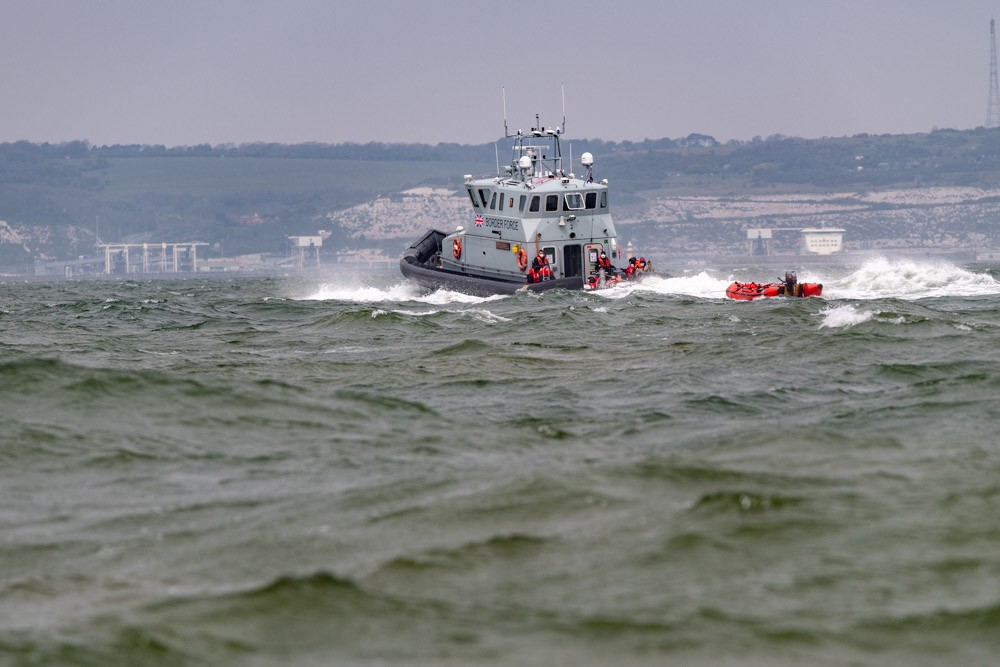

### AYS Daily Digest 29/4/2021 — Libyan Coast Guard: The EU interception force

24 bodies found in the Atlantic Ocean\. Kara Tepe municipal camp finally evicted\. Limited access to healthcare in Montenegro\. 200\+ people reach the UK in one night\.

![Patras, Greece 29 April 2021\. ‘Refugees and migrants wait for their chance at a better life, in Patras\. They sleep in abandoned buildings/factories\. Patras is home to about 150 refugees and migrants\. Most of them are from Afghanistan, Pakistan and Iran although there are also some from Nigeria and Sudan\. They stop in Patras to try and find passage to various European destinations by hiding in ships, containers and trucks parked in the port\.’ \(Photo and text by Chrysoula Patsou / via [Art Against](https://www.facebook.com/artagainstproject/posts/3899237926792279) \)](assets/31e188333109/1*977oMJbYSXIa6pzryZSsBg.jpeg)

Patras, Greece 29 April 2021\. ‘Refugees and migrants wait for their chance at a better life, in Patras\. They sleep in abandoned buildings/factories\. Patras is home to about 150 refugees and migrants\. Most of them are from Afghanistan, Pakistan and Iran although there are also some from Nigeria and Sudan\. They stop in Patras to try and find passage to various European destinations by hiding in ships, containers and trucks parked in the port\.’ \(Photo and text by Chrysoula Patsou / via [Art Against](https://www.facebook.com/artagainstproject/posts/3899237926792279) \)
#### Featured — Libyan Coast Guard: The EU interception force and the role of Frontex in the Central Mediterranean

Lighthouse Reports [authored](https://www.lighthousereports.nl/investigation/frontex-in-the-central-mediterranean/) a series of investigations that show the level of investment and engagement of the EU border agency in supporting the Libyan coast guard, which is acting as Europe’s interception force\. Check out their page to find where their investigations have been published \(in German, French and Italian\) \.

> Europe stands accused of creating a proxy force in the waters off Libya to do what its own member states and agencies cannot do themselves without openly violating international laws: intercept unwanted migrants and return them to Libya\. The EU and its border agency Frontex have long denied this accusation even as resources are channeled to the Libyan coast guard which has intercepted tens of thousands of people trying to reach Europe across the Central Mediterranean\. 

■■■■■■■■■■■■■■ 
> **[Daniel Howden](https://twitter.com/daniel_howden) @ Twitter Says:** 

> > @[LHreports](https://twitter.com/LHreports) @[Frontex](https://twitter.com/Frontex) @[EU_Commission](https://twitter.com/EU_Commission) responds to us w/unintended truth: "Search &amp; rescue is not an EU competence." Then promises more boats &amp; resources for the same Libyan coast guard it denies commanding 

> **Tweeted at [2021-04-29 16:12:48](https://twitter.com/daniel_howden/status/1387802053574107139).** 

■■■■■■■■■■■■■■ 

We constantly report on the daily tragedies in the stretch of sea between Libya and Tunisia on one side and Italy and Malta on the other\. Thousands of lost lives are the direct result of a European policies, spearheaded by Italian authorities \(of all political colours\) and by Frontex\. The silver lining of ‘capacity\-building investments’ is nothing more than “a thin layer of deniability over Frontex and Italian command and control over a Libyan interception force … the withdrawal of European vessels and the investment in aerial surveillance is about directing the interception operations\.”

Meanwhile, Frontex carries on with its oblivious communications strategy, attempting to present itself in positive light in the midst of increasing proof of its complicity in border violence and the violation of people’s rights\. [The latest attempt regards the role of the agency in detecting environmental crimes](https://twitter.com/lk2015r/status/1387834259956813826) …

■■■■■■■■■■■■■■ 
> **[Lena K.](https://twitter.com/lk2015r) @ Twitter Says:** 

> > @[chuttttttt](https://twitter.com/chuttttttt) off the top of my head, so far we had:
- gender equality Frontex (the women border guards)
- charitable Frontex (food donations in 🇦🇱)
- humanitarian Frontex (they help rescue people!)
- Erasmus Frontex (the border guards get to know different cultures!)
Why not Green Frontex... 

> **Tweeted at [2021-04-29 18:32:53](https://twitter.com/lk2015r/status/1387837306929811456).** 

■■■■■■■■■■■■■■ 

SEA
#### 24 bodies and 3 survivors on the Canary islands route

A Spanish army helicopter spotted a boat in the Atlantic Ocean some 260 miles off El Hierro island on Monday morning\. The three survivors were airlifted to land and the boat was taken to Tenerife last night\. Survivors reported having been at sea for 22 days, since April 5\.
#### Rescues and returns

86 people were [rescued](https://diariodeavisos.elespanol.com/2021/04/547667/) from three boats by Salvamento Maritimo\.

Sea\-Watch 4 [rescued](https://www.facebook.com/seawatchprojekt/posts/2813498488868214) 44 people after less than 24 hours back in the search and rescue zone\.

SOS Mediterranee’s Ocean Viking is [waiting](https://www.facebook.com/SOSMEDITERRANEE/) for a Place of Safety to disembark 236 people rescued Tuesday\.

> Many survivors — including minors — told our medical team that they were beaten while boarding the flimsy rubber boats as they were hesitant, frightened by the rough sea condition & high waves\. 

More than 200 people have been intercepted and returned to Libya by the LCG: 108 on Wednesday, and 98 on Thursday, [according](https://twitter.com/UNHCRLibya/status/1387809257186381824) to UNHCR Libya\.
The Civil Fleet also wrote an article on Wednesday interceptions\. Read it [HERE](https://thecivilfleet.wordpress.com/2021/04/28/refugees-and-rescuers-witness-the-libyan-coastguard-abducting-over-100-people/) \.
#### GREECE
#### More walls and fences to seal camps off

Refugee Aegean Support published an [update](https://twitter.com/rspaegean/status/1387777655177613315) on the work being done to build cement walls and fences around mainland camps:

■■■■■■■■■■■■■■ 
> **[RSA](https://twitter.com/rspaegean) @ Twitter Says:** 

> > 2/5 A resident from Nea Kavala camp says: "These walls + fences are constructed to block us away. We see the walls growing. No one informs us what they are for. Only a warning message was send to us asking not to let our children go near the construction because there are holes" https://t.co/O5elyv9egi 

> **Tweeted at [2021-04-29 14:35:52](https://twitter.com/rspaegean/status/1387777661494337544).** 

■■■■■■■■■■■■■■ 

IOM published a tender in January concerning construction works around the camps in Malakasa, Ritsona, Diavata and Nea Kavala\. In late March, the Ministry for Migration and Asylum published another tender \(nearly €18\.5m\) for security and fencing works in the mainland accommodation facilities, including outer fencing, gate control centres and security entry/exit gates co\-funded by the EU, through the Asylum, Migration and Integration Fund\(AMIF\) \.
#### Kara Tepe municipal camp shut down

On Thursday, the remaining residents \(~100\) of the municipal camp in Kara Tepe were [transferred](https://www.stonisi.gr/post/16721/ekkenwthhke-o-dhmotikos-kataylismos-toy-kara-tepe) to to the largest Mavrovouni/Moria 2\.0 camp \(in total 540 people of the 620 residents\) and to other facilities \(80 people\) \.

As with the previous transfer, it [happened](https://twitter.com/f_grillmeier/status/1387595963473309696) at night, at 5am, while Lesvos is under night curfew\. The few journalists present were not allowed on site\. The buses were escorted by army trucks and police patrols\. One man, in an automated wheelchair, could not load the bus, which was not equipped for it and had to reach the new camp by himself\. Now he has to live in a tent, in a camp \(in\)famous for its undignified living conditions, which has [no accessible toilets](https://www.facebook.com/100044736951768/videos/890604208186696) \.

The Hope Project wrote a comment on the closure of the camp, read it [HERE](https://www.facebook.com/HopeProjectGreece/posts/2959187764362336) :

> The abuses of refugees just keep growing\. 

> The basic rights they are entitled to under international law and EU law have been stripped away\. 

> Make them suffer and they will stop coming is the policy of the world we live in\! We should be ashamed\! 

As Moria White Helmets [point out](https://www.facebook.com/MoriaWhiteHelmets/posts/312017370441329) , “Most of them are vulnerable and had much better conditions there\. We really don’t understand why they close this camp\.” MWH have [helped](https://www.facebook.com/MoriaWhiteHelmets/posts/312233413753058) the new arrivals to build their tents and get a space in the camp\. According to the migration ministry, the municipal site where Kara Tepe was built will officially ‘ [return](https://www.keeptalkinggreece.com/2021/04/29/kara-tepe-lesvos-empty-asylum-seekers/) ’ to the municipality on May 6\.

MONTENEGRO
#### Access to healthcare and the Health on the Move project

From an update from [No Name Kitchen](https://www.facebook.com/NoNameKitchenBelgrade/posts/1227693064295642) :

> Although Montenegro is not a major hotspot on this route, there are still hundreds of people on the move crossing the country every year, who suffer violent pushbacks and have extremely limited access to healthcare\. 

> … For those who live in the refugee camp, there is only one doctor who is supposed to take care of everyone’s problems on Mondays between 2pm and 3pm\. By this time, long queues have usually formed in the back of the doctor’s office\. However, patients are no longer visited after 3pm, and some are forced to wait until the following week\. 

> If the doctor decides the patient requires a specialist, he refers them to the Red Cross\. If the patient has an illness that can be treated by one of the doctors working for the Red Cross, their problem will be taken care of\. However, our health programme manager — who has been living in Montenegro for many years, in close contact with people on the move — has met many patients with more complicated issues, whose treatment was continually postponed until they managed to leave the country on their own, or pay for a private doctor\. 

> Another major issue, on the topic of healthcare in Montenegro, is that we notice patients are transported from the refugee camp to the hospital in groups\. Although people may be in a lot of pain, this means they are often forced to wait for the day when the camp staff decide to take them to a specialist\. In the meantime, they have no access to pain relief, since staff tell them this cannot be handed out with a specialist’s prescription\. Camp workers claim they are understaffed to manage this volume of work\. 

> “One day, my wife felt a lot of pain in her chest\. We lived in the refugee camp, and it was a holiday\. The woman in charge of the camp would not take us to the doctor at night, and said I should take my wife to the doctor myself\. I asked the camp workers to call me a taxi, but they said they had no money on their phones and couldn’t\. I left the refugee camp to find a taxi at one o’clock in the morning\. We managed to get to the hospital\. My wife was very unwell: she was hospitalised, but she wasn’t looked after\.” 

Since 2019, No Name Kitchen has been working in Podgorica with healthcare initiative Health on the Move\. Support them [HERE](https://donorbox.org/no-name-kitchen) \. When you make your contribution, specify that your donation should go to the health project\.

UK
#### More than 200 people reach the UK in one night

During the night from Wednesday to Thursday, 209 people crossed the Channel aboard nine boats and reached the English coast, InfoMigrants [report](https://www.infomigrants.net/fr/post/31875/plus-de-200-migrants-arrivent-en-angleterre-par-la-manche-en-une-journee-un-record) \.

Channel Rescue has been back out [monitoring](https://www.facebook.com/channel.rescue/posts/246648457207789) Border Force operations in the channel this week to ensure authorities are complying with their human rights obligations\. Check out their [page](https://www.facebook.com/channel.rescue/) if you can support them with donation or join their team\.

 ” \(Credit: [Channel Rescue](https://www.facebook.com/channel.rescue/posts/246648457207789) \)](assets/31e188333109/1*BNWxVMIbEAfQJYUFxoKSaQ.jpeg)

“On one of the busiest days for small boat crossings so far this year, we witnessed the heartbreaking sight of families with small children being disembarked at Dover having risked the voyage\. No one should be forced to make this dangerous journey\! [\#SafePassage](https://www.facebook.com/hashtag/safepassage?__eep__=6&__cft__[0]=AZW5h9DEexjVnSnyMC3lT74DkPsBKZlmP2o4S9xY6boDaBqh4UmlvrbqiTKeJ97RDZmy4m9gwT-ytkOj3ooWd8EAiEyz2Y109Xd7Z2z2NbKziHMFGvc9BQGGRHUJoxoIITH149tZTsN935LJU365nuuq&__tn__=*NK-R) ” \(Credit: [Channel Rescue](https://www.facebook.com/channel.rescue/posts/246648457207789) \)
#### Reject the Plan

■■■■■■■■■■■■■■ 
> **[Leeds Anti Raids Action](https://twitter.com/antiraidsleeds) @ Twitter Says:** 

> > NEXT TUESDAY 4TH OF MAY: Join us in rejecting the proposed immigration plans by completing the government consultation together with @[migrantsorg](https://twitter.com/migrantsorg) and @[AsylumMatters](https://twitter.com/AsylumMatters). Register here: [us02web.zoom.us/meeting/regist…](https://us02web.zoom.us/meeting/register/tZMtd-uqqT0oGt0fiz6Kiiu2-FsjCEq03YrM?fbclid=IwAR3kwMrtTwmx9EFmSDp8j4HQXpPN_ZgWh6NHDLB67IIvzHFxB9Mv06_-z7o) https://t.co/BS8AySdMSc 

> **Tweeted at [2021-04-28 08:24:25](https://twitter.com/antiraidsleeds/status/1387321792960860163).** 

■■■■■■■■■■■■■■ 

Read more on the proposed immigration plan in [this article](https://www.unhcr.org/uk/uk-immigration-and-asylum-plans-some-questions-answered-by-unhcr.html) by UNHCR UK\.
#### ‘Sanctuary Scholarship’ at Reading University

The Sanctuary Scholarships Scheme has been introduced for sanctuary seekers \(people with refugee, humanitarian protection or asylum seeker status\) in recognition of the disruption to education that displaced people experience\. The Sanctuary Scholarships Scheme will offer up to 12 awards each year, providing opportunities for those taking pre\-sessional, undergraduate and postgraduate courses\. Read More [HERE](https://planetradio.co.uk/greatest-hits/berkshire-north-hampshire/news/university-of-reading-offers-help-to-sanctuary-seekers/) \.

WORTH READING
- [**Unaccompanied asylum\-seeking youth in the UK\. Inequalities in access to education**](https://www.wider.unu.edu/publication/unaccompanied-asylum-seeking-youth-uk-%E2%80%93-interview-expert) _— an interview with Catherine Gladwell of Refugee Education UK, by WiderAngle\._
- [**The politics of exhaustion and juxtaposed controls: harmful migration governance at the Franco\-British border without end in sight**](https://guitinews.fr/around-the-world/2021/04/28/harmful-migration-governance-uk-france-border/amp/) , by Marta Welander \(Refugee Rights Europe\) for GuitiNews\.

WORTH ATTENDING
- April 30: [**Migration Control & Humanitarian/Development Aid\. Externalising EU borders to Libya and North Africa\.**](https://www.facebook.com/events/193666629113930/) Online seminar organised by researchers Paolo Cuttitta and Giacomo Zandonini
- May 2: [**Situation of Afghan refugees in Europe & “Afghans who have been forcibly returned’\.**](https://www.facebook.com/events/316761753118143/) Online seminar organised by Afghanistan migrants advice and support organisation\.

**Find daily updates and special reports on our Medium page\.** 
**If you wish to contribute, either by writing a report or a story, or by joining the info gathering team, please let us know\.**

**We strive to echo correct news from the ground through collaboration and fairness\. Every effort has been made to credit organisations and individuals with regard to the supply of information, video, and photo material \(in cases where the source wanted to be accredited\) \. Please notify us regarding corrections\.** 
**If there’s anything you want to share or comment, contact us through Facebook, Twitter or write to: [areyousyrious@gmail\.com](mailto:areyousyrious@gmail.com)**

_Converted [Medium Post](https://medium.com/are-you-syrious/ays-daily-digest-29-4-2021-libyan-coast-guard-the-eu-interception-force-31e188333109) by [ZMediumToMarkdown](https://github.com/ZhgChgLi/ZMediumToMarkdown)._
