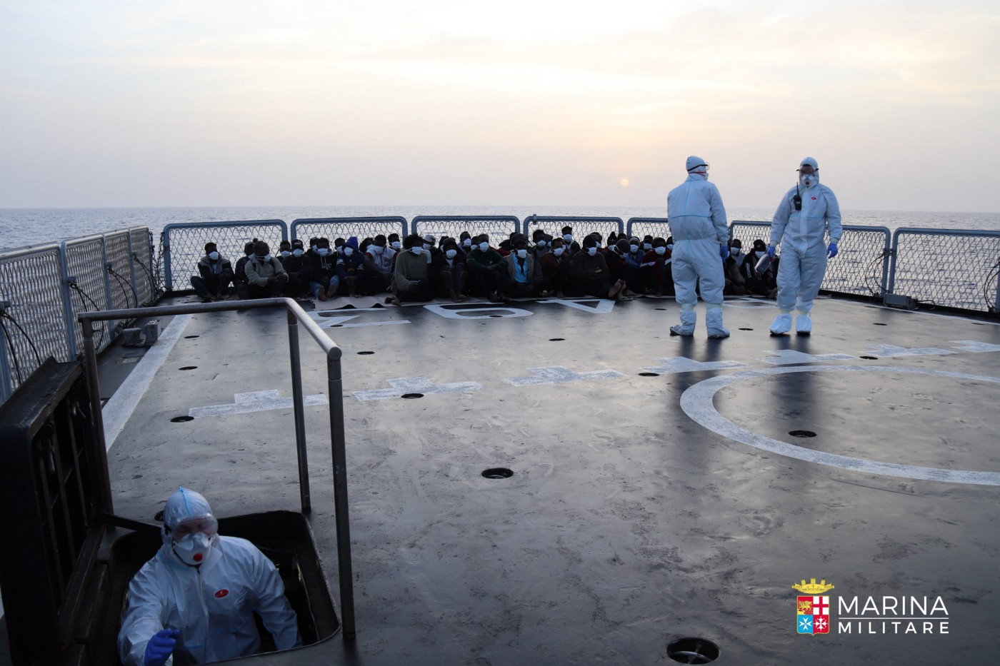

### AYS Daily Digest 30/04/21: Italian Navy Rescues People at Sea—Finally
#### Libyan Coastguard caught on video // Rescues & returns at sea // Woman gives birth in boat off Canaries // Evictions in NW Bosnia // Data protection threatened in Germany // Channel Rescue in the spotlight
### FEATURE—For first time in years, Italian authorities bring people in distress aboard

Photo: Marina Militare

[In the words of one Italian journalist](https://www.facebook.com/angela.caponnetto.54/posts/10223164231606650) , “Something must have happened” if, for the first time in years, the Italian Navy actually rescued people in distress in the Central Mediterranean\. But the news is true: 49 people were rescued on the morning of April 30 and are now on board the Navy patrol boat Commander Foscari\. The people were adrift in international waters 75 nautical miles north of Tripoli, and all are in good health, according to a [Navy press release](https://www.marina.difesa.it/media-cultura/press-room/comunicati/Pagine/2021_NS_Il_pattugliatore_Comandante_Foscari_salva_49_naufraghi_nel_mediterraneo.aspx) \.

While several years ago the Italian Navy [was leading rescue missions in the Central Med](https://www.dw.com/en/italian-navy-leads-mediterranean-rescue-of-1800-migrants/a-19240713) , helping to save thousands of lives, more recently the Navy is known for its inaction and its complicity in either leaving people to drown, or sending them back to Libya\.

■■■■■■■■■■■■■■ 
> **[Marina Militare](https://twitter.com/ItalianNavy) @ Twitter Says:** 

> > Il pattugliatore Comandante Foscari salva 49 naufraghi nel mediterraneo.
Nota stampa del 30/04/2021 👉 [bit.ly/2PzR48i](https://bit.ly/2PzR48i)
#MarinaMilitare #NoiSiamolaMarina https://t.co/hFctuVXqx2 

> **Tweeted at [2021-04-30 12:27:40](https://twitter.com/italiannavy/status/1388107786052116482).** 

■■■■■■■■■■■■■■ 

It has been a busy past few days in the Central Mediterranean\. Sea Watch 4 completed three rescues in under 48 hours, bringing 214 people on board\.

SOS Mediterranée’s Ocean Viking is now home to 236 survivors, and will soon disembark in Augusta, Sicily\. \( [This article](https://www.dw.com/en/over-100-migrants-saved-in-the-mediterranean/a-57392273) gives a good overview of what has been going on in the Mediterranean over the past few days\. \)

At this point we can only speculate what that “something” is—why Italian authorities would engage in a rescue mission when they usually do not\. We would like to say—tentatively—that perhaps the winds have shifted\.

In the comments section of the Italian journalist’s Facebook post, readers expressed similar hope\.

“I hope this is not destined to remain an isolated case\. I hope the latest victims have ignited a glimmer of humanity in the chains of command,” one wrote\.
### SEA
#### Libyans caught on tape

Today’s news from the Mediterranean is not all good\. The crew of Sea Watch 4 caught on video the Libyan Coastguard beating people in a rubber dinghy\. The people were violently pulled back to the hell of Libya\.

#### Returns to Libya

Meanwhile, the Libyans returned 340 people, including women and children, who disembarked in Tripoli yesterday\.

■■■■■■■■■■■■■■ 
> **[UNHCR Libya](https://twitter.com/UNHCRLibya) @ Twitter Says:** 

> > 🚨 Some 340 refugees and migrants have been returned today to Tripoli by Libyan Coast Guard.

UNHCR &amp; IRC provided urgent medical and humanitarian assistance to all survivors before being taken to detention.

Over 5,500 persons were returned to Libya since January 2021. https://t.co/kWZbysryeL 

> **Tweeted at [2021-04-30 19:58:19](https://twitter.com/unhcrlibya/status/1388221194814504963).** 

■■■■■■■■■■■■■■ 

A UN spokesperson wrote on Twitter about 450 people being returned to Libya yesterday\.

■■■■■■■■■■■■■■ 
> **[Safa Msehli](https://twitter.com/msehlisafa) @ Twitter Says:** 

> > Some 450 migrants were intercepted and returned to #Libya today. 

Desperate, barefoot, tired and abused, they were led off to arbitrary detention where they face more risks. https://t.co/TspogDdIHr 

> **Tweeted at [2021-04-30 21:06:27](https://twitter.com/msehlisafa/status/1388238342865702917).** 

■■■■■■■■■■■■■■ 

#### Unaccompanied minors in the Med

Amid all the returns, UNICEF is sounding an alarm about an uptick in unaccompanied minors braving the Mediterranean crossing\. As many as 114 ‘lone children’ were returned by Libyan authorities in one day this week\.

“The number is incredibly alarming — it is the most that have been picked up in a single day this year and certainly one of the highest we have ever recorded,” Juliette Touma, UNICEF’s regional chief of communications, told [media](https://www.theguardian.com/global-development/2021/apr/30/more-than-100-lone-children-rescued-trying-to-cross-mediterranean?fbclid=IwAR0Sv-yDvPDPcbx1EvOeRPdvK2Hpw1e4FPZLi03YoEutOVjiQyLFxNkeKPU) \.

“We are especially concerned that in the coming months as temperatures rise and the weather improves we will see increasing numbers of people including unaccompanied minors trying to reach the safety of Europe for a better life\.”
### SPAIN
#### Woman gives birth on boat off Canaries

A woman has done what no one should have to do: give birth while fleeing in a boat\. The woman and her hours\-old daughter were among several dozen people rescued by the Spanish Coast Guard late last week, [media reported](https://www.spiegel.de/politik/ausland/seenotrettung-frau-bringt-baby-auf-fluechtlingsboot-vor-den-kanaren-zur-welt-a-c74db443-a4ac-43df-9d66-872cef12422d?fbclid=IwAR1DAxNHa0DfSzihwqFspvXE42t-8dHkzaC80-l5AS7mj4WM_Vm0ky7y4lY) \.

The boat was towed to the port of Arguineguin on Gran Canaria and the pair were taken to hospital for examinations\. [Here is a video](https://www.efe.com/efe/canarias/portada/de-remolcar-el-cayuco-la-tragedia-a-llevar-un-recien-nacido-tierra/50001319-4525241?fbclid=IwAR3He-A8lvZFItWVgy6pPJulrPSxv4OdHB8Sx-J9-ExdSzP0LDCqtdY5Qh0) of the baby’s first moments on land\.
#### Spanish rescue teams

Check out the important SAR work of Spanish rescue teams:

■■■■■■■■■■■■■■ 
> **[Alarm Phone](https://twitter.com/alarm_phone) @ Twitter Says:** 

> > Spanish rescue teams are putting real efforts into saving people in the middle of the Atlantic. We would like to see their Italian and Maltese counterparts showing as much commitment to saving lives and fulfilling their duties as coastguards, instead of leaving people to drown! 

> **Tweeted at [2021-04-30 19:03:03](https://twitter.com/alarm_phone/status/1388207285730742277).** 

■■■■■■■■■■■■■■ 

#### Ministry of Migration announces proposal to aid unaccompanied minors

The Spanish Ministry of Migration has said it wants to lower the requirements for unaccompanied minors and ‘ex\-ward youth’ to obtain a residence card, [media reported](https://www.eldiario.es/desalambre/reforma-reglamento-extranjeria-pretende-regularizar-15-000-menores-migrantes-jovenes-extutelados_1_7888330.html?fbclid=IwAR1DAxNHa0DfSzihwqFspvXE42t-8dHkzaC80-l5AS7mj4WM_Vm0ky7y4lY) \. The proposal will reduce the time limits for getting residency, reduce the economic requirements, assist minors in finding jobs and lengthen the validity of their residence permits\.

“The lack of documentation of these minors poses, in practice, significant difficulties not only while they maintain this condition but, especially, at the time they turn 18 and come of age\. These difficulties have a negative impact on their inclusion and integration into society,” the draft of the reform reads\.

In the short term, the Ministry calculates that 8,000 unaccompanied minors and around 7,000 ‘ex\-ward’ young people will benefit from the change in regulations\.
### BOSNIA AND HERZEGOVINA
#### No Name Kitchen: Update from Velika Kladuša

Read this great update from the field in northwest Bosnia by volunteers of No Name Kitchen\. Good\-quality information here on recent evictions of family squats in and around Velika Kladuša—an important topic we all need to keep an eye on\.
### GERMANY
#### Data protection for asylum\-seekers in Germany threatened

The federal government in Germany is seeking to introduce a law that provides for the central storage of personal documents of refugees, a move which violates people’s fundamental rights and can have potentially life\-threatening consequences for people fleeing violent conflict and authoritarian regimes, [media reported](https://www.proasyl.de/news/asylakte-ins-auslaenderzentralregister-fuer-gefluechtete-gilt-der-datenschutz-nicht/?fbclid=IwAR2y_4w98r7OcM64maVuD7HTw4KpDCRzY_QDosp1rMeSGotSpNh0QHNyjbk) \.

Germany is famous for its data protection laws, but apparently the same consideration is not given to asylum\-seekers whose information is stored in government files\. [A new proposal](http://dipbt.bundestag.de/dip21/btd/19/281/1928170.pdf) will store more of people’s sensitive data in a centralized database: asylum decisions, asylum and residency court decisions, information on people’s family, sexual orientation, religion, political views, and importantly, people’s personal identity number from their country of origin\.

Under this proposal, many different wings of government will have access to people’s data: all 600 local immigration authorities, state reception facilities, the Federal Employment Agency, social welfare offices and job centres, the federal police, public prosecutors, etc\. etc\.

The law aims to improve administrative processes, but as media put it, “The rights of those affected, especially to data protection and informational self\-determination, are irrelevant\.”
### UNITED KINGDOM
#### Channel Rescue’s work highlighted

The group Channel Rescue spoke to Al Jazeera English about their important work keeping an eye on the Channel waters\.

■■■■■■■■■■■■■■ 
> **[Channel Rescue](https://twitter.com/ChannelRescue) @ Twitter Says:** 

> > 👀CR volunteers on @[AJEnglish](https://twitter.com/AJEnglish) talking about @[ukhomeoffice](https://twitter.com/ukhomeoffice)'s ever-increasing hostile approach towards refugees - one that forces so many people desperately looking for a safe place to seek asylum to make the dangerous journey across the channel #safepassage [youtu.be/z2mlYYQMy6M](https://youtu.be/z2mlYYQMy6M) 

> **Tweeted at [2021-04-30 20:39:56](https://twitter.com/channelrescue/status/1388231666955599879).** 

■■■■■■■■■■■■■■ 

#### Report: Regularization of undocumented people in the UK

The Joint Council for the Welfare of Immigrants released a report called [‘We Are Here: Routes to regularisation for the UK’s undocumented population\.’](https://www.jcwi.org.uk/we-are-here-routes-to-regularisation-for-the-uks-undocumented-population?fbclid=IwAR3ONfR2LeBCHr-3kQueCNPIzFZlV92Lqfo-uu_iSIYa7f1ij-0r7oWngn4)

> We Are Here is a report based on research carried out by JCWI to better understand the reality of life for undocumented migrants in the UK today\. It explores how people become undocumented, and how vulnerability is produced through the structures of the system itself\. It reveals the systemic weaknesses of our immigration system that lead to so many people becoming undocumented and how a small error, or a short period of illness can change the course of a life\. 

### EU/FRONTEX
#### European Parliament on Frontex budget

The European Parliament has made a decision on the budget of Frontex \( [full text here](https://www.europarl.europa.eu/doceo/document/TA-9-2021-0191_EN.pdf?fbclid=IwAR3XuIX5L4Cjx78mh7UzonA3AVrhru6PoLzfvGVrLmVGlVKXB_KyuulghKM) \) \. Interestingly, the decision took into account the work of journalists in exposing Frontex’s mismanagement\.

For example: “\[The European Parliament\] is seriously concerned over media reports that the executive director had repeatedly ignored reports and advice coming from the fundamental rights officer, concerning its operations in several Member States\.”
#### EU Commission to focus on sea rescue at Frontex meetings

Following the publication of Spiegel’s explosive story, [‘How Frontex Helps Haul Migrants Back To Libyan Torture Camps,’](https://www.spiegel.de/international/europe/libya-how-frontex-helps-haul-migrants-back-to-libyan-torture-camps-a-d62c3960-ece2-499b-8a3f-1ede2eaefb83) an EU Commission spokesperson told [media](https://www.rnd.de/politik/eu-kommission-macht-seenotrettung-zum-thema-bei-frontex-treffen-5T42BANBKZDOJOKKBG4R6L2HHM.html?fbclid=IwAR3iGqVZJ53vWEuQzPOzSzl_t-HKNTbegGZRHLgznwnv5H0SgLPWEKFNsbE) that Mediterranean sea rescue operations and Frontex’s cooperation with the Libyan authorities would be a top priority in the upcoming Frontex meetings\. Efforts will be made to ensure that “there is complete clarity on the matter\.”
#### Frontex photo competition\!

Frontex is holding a photo competition to celebrate Europe Day on May 9\. The agency is soliciting photos for these categories: Cooperation with national authorities; Frontier landscapes; A helping hand at the border\.

Submit your best, ironic photos [here](https://frontex.europa.eu/media-centre/news/news-release/frontex-photo-competition-europe-day-PxeK4e?fbclid=IwAR2741J99SbNkJBKUo5L1xJbxt3ANQLOKsjs1vDBcCFGbF08wp63fZGtF6s) and you could win travel luggage \(enjoy your freedom of movement, Europeans, because people\-on\-the\-move surely don’t have that\! \) and “a set of Frontex gifts” \(whatever could that be?\! \) \.
### GENERAL
#### ECRE Weekly Bulletin

Info on the Med, Greece, the Atlantic Route, the European Commission, Ireland, and the UK\. Access it [here](https://mailchi.mp/ecre/ecre-weekly-bulletin-30042021?e=1fd2db1ebf&fbclid=IwAR1ZLwqrInLa-3OE7rMrfdfSPRlGh3f0xv8qhuulJ7aWcGVxIK6HL9meGeU) \.
#### ELENA Weekly Bulletin

Info on the European Court of Human Rights, EASO, Deportation to Afghanistan, Croatia, Netherlands\. Access it [here](https://mailchi.mp/ecre/elena-weekly-legal-update-30-april-2021?e=1fd2db1ebf&fbclid=IwAR2zrRp4_GBsYfJnBAZLI3YjA-p-__-qkE4e-ajZ7RScUA0BEZ8pF3gj-oI) \.
### WORTH READING

**Find daily updates and special reports on our Medium page\.** 
**If you wish to contribute, either by writing a report or a story, or by joining the info gathering team, please let us know\.**

**We strive to echo correct news from the ground through collaboration and fairness\. Every effort has been made to credit organisations and individuals with regard to the supply of information, video, and photo material \(in cases where the source wanted to be accredited\) \. Please notify us regarding corrections\.** 
**If there’s anything you want to share or comment, contact us through Facebook, Twitter or write to: [areyousyrious@gmail\.com](mailto:areyousyrious@gmail.com)**

_Converted [Medium Post](https://medium.com/are-you-syrious/ays-daily-digest-30-04-21-italian-navy-rescues-people-at-sea-finally-b6ed9ea99453) by [ZMediumToMarkdown](https://github.com/ZhgChgLi/ZMediumToMarkdown)._
