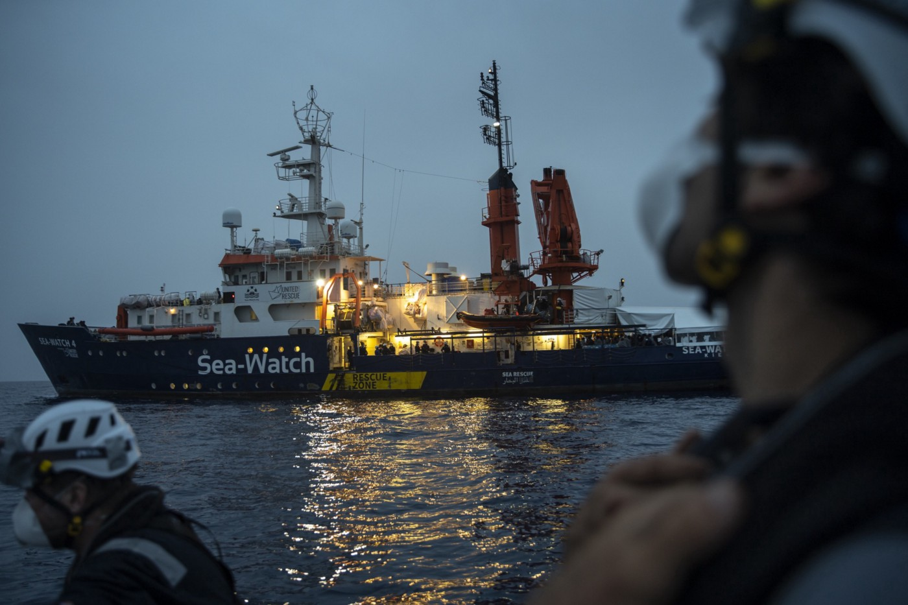

### AYS Weekend Digest 01–02/05/21: More than 800 rescues at sea
#### Busy days for SAR teams // Alarm Phone reports several distress calls without reactions // Corruption on food catering in Moria 2? // New testimonies of police violence at Hungarian border // Pressure on UK Home Office

### Greece

Mare Liberum highlights the problem of the food quality in Moria 2\. Even though the catering company receives supposedly five Euros per meal, food poisoning occurs frequently\. The team further refers to a report by [Stonisi](https://www.stonisi.gr/post/16315/paidia-mas-vlepoyn-pente-eyrw-th-mera-gia-na-menoyn-nhstikoi-pics?fbclid=IwAR3YLfM_EaP-bUdBKoUsCUOBPw7gWkgw29TvEuvhApnHtMo5ju6CAyy9wBg) , revealing family connections between the catering company and the Greek government\. “The contract was given without an open call for tender\. The company is also receiving gov funding for fabricated costs for rent and other expenses”, it is quoted\.

The German publication Verdi has documented how journalists are prevented from doing their jobs in camps on the Aegean islands — and how authorities restrict press freedom\. It also announced, that there will be a new Signal group to support exchange among journalists, warn from dangerous situations and help each other\.
### [Lesbos: Die Simulation von Pressefreiheit](https://mmm.verdi.de/internationales/lesbos-die-simulation-von-pressefreiheit-73205?fbclid=IwAR1m2JwTp1i9tPU_r4H1JfNxIj63DmdEhsBuFTYOPxzySTOuU_v-umTC0Ck)
### [Wenn hoher Besuch auf die griechischen Inseln zu den Camps voller Geflüchteter kommt, dann „wird eine Simulation von…](https://mmm.verdi.de/internationales/lesbos-die-simulation-von-pressefreiheit-73205?fbclid=IwAR1m2JwTp1i9tPU_r4H1JfNxIj63DmdEhsBuFTYOPxzySTOuU_v-umTC0Ck)

[mmm\.verdi\.de](https://mmm.verdi.de/internationales/lesbos-die-simulation-von-pressefreiheit-73205?fbclid=IwAR1m2JwTp1i9tPU_r4H1JfNxIj63DmdEhsBuFTYOPxzySTOuU_v-umTC0Ck)

Further reading:
- [Human rights activist Parwana Amiri reports on the situation in Ritsona camp](https://twitter.com/parwana_amiri/status/1388483680411308035?fbclid=IwAR3ScNxpFB-b5jGlitixpIQlvhxlksf6sYRji8kOKGf7AWkKr7g6B8kiI4I)
- [ASYLUM FACT SERIES PART 3: SKYPE IS A SCAM\!](https://www.facebook.com/KhoraAthens/posts/1746281332211134) by Khora

### Sea

The bodies of eleven people were washed ashore in Libya on Sunday, after a boat capsized off the coast of Zawya\. Twelve survivors were pulled back by the so\-called Libyan Coast Guard, according to UN spokesperson [Safa Msehli](https://twitter.com/msehlisafa/status/1388883283711348744?fbclid=IwAR1tkHfxoeXJdcrAaf7-Kn3Yt0jI3iMj66wLmXPhIodsDYrIdKCPZ_T1_n0) \.

In another incident, Alarm Phone warned of 95 people in distress in international waters\. Apparently, no one took care of the situation for twelve hours\. “They are panicking and crying on the phone”, Alarm Phone warned in their last update for now\. It is feared that a merchant vessel wanted to [participate](https://twitter.com/seawatchcrew/status/1388947236994826243?fbclid=IwAR1tkHfxoeXJdcrAaf7-Kn3Yt0jI3iMj66wLmXPhIodsDYrIdKCPZ_T1_n0) in a pullback\. On Saturday the team had already lost contact with 125 people in [distress](https://twitter.com/alarm_phone/status/1388544142830100483?fbclid=IwAR3HUE7Xi8u1N4CN6FLlsadoSZRVtnBbppcwPeFkejgqm7qAD6haovxanSw) \. A vessel drifting between Italy and Greece [was about](https://twitter.com/alarm_phone/status/1388794883998158850?fbclid=IwAR3MSpq-x_Xb2IOJXUMhWB07ZN1GtkguJ-AU_yybskziEZK0w7Q8vPsB4zI) to be rescued and brought to Kalamata\.

Sea\-Watch rescued 51 people on Saturday in its sixth rescue\. Overall, they had 455 people on board\. In a few days, NGOs rescued some [800 people](https://apnews.com/article/italy-europe-africa-migration-government-and-politics-aabf73289ca35089d3997a0fc1125777?fbclid=IwAR0djCNab-xeQ5x2aDjA6QKb_zbFBPVaCULnFTAJjrbCUGB1aOuP2cbCmV0) \.

While there are many reports of pullbacks to Libya, SOS Mediterranee now raises awareness on rescued people, saying they were forced to go into the boats to depart from Libya\. “Some passengers told rescuers they were beaten by smugglers based in Libya and forced to embark on the unseaworthy dinghies despite high waves”, The Arab Weekly [quotes](https://thearabweekly.com/traffickers-libya-push-hundreds-migrants-sea?fbclid=IwAR1qAKZRiaDpF98d2htxakJK--5JfpdXz4mMNsf9MD2IdQAq-ePVO21nUjc) \.

**Worth listening to:**

Mare Liberum activist Marie speaks about: the systematic abuse of refugees crossing the Aegean and trapped inside Greece’s camps; how Germany prevented the ship from sailing; and how fascists tried to burn down the ship while she was on it\.
### Serbia

[Azil u Srbiji Asylum Protection in Serbia](https://twitter.com/APC_CZA) documented several cases of police violence at the Hungarian border\. Victims reported about dogs used to bite them, one testified being locked up in a car for four hours and then abandoned in the cold\.
### Italy

With the title “Friends of the Traffickers”, The Intercept published a long\-read on Italy’s Anti\-Mafia Directorate and the “Dirty Campaign” to Criminalize Migration\.
### [Italy’s Anti\-Mafia Directorate and the “Dirty Campaign” to Criminalize Migration](https://theintercept.com/2021/04/30/italy-anti-mafia-migrant-rescue-smuggling/)
### [Afana Dieudonne often says that he is not a superhero\. That’s Dieudonne’s way of saying he’s done things he’s not proud…](https://theintercept.com/2021/04/30/italy-anti-mafia-migrant-rescue-smuggling/)

[theintercept\.com](https://theintercept.com/2021/04/30/italy-anti-mafia-migrant-rescue-smuggling/)
### UK

The government has stopped plans for an accomodation centre for 500 people in Hampshire\. More than 3000 locals have signed a petition against it, supported by the local council and the local Conservative MP, the BBC [reports](https://www.bbc.com/news/uk-england-hampshire-56949815) \.

In an open letter, 4refugeewomen criticizes the immigration plans of home secretary Priti Patel\. Detention Action [posted](https://twitter.com/DetentionAction/status/1388434663128055808?fbclid=IwAR1pezBmDVbJn7Oz38WrpTfBz2cIdbnQ0cwBXEJl7sVQpYsy5d_LkJogN6o) some highlights in a Twitter thread and announced its support: “We have to raise our voices against these cruel & draconian plans, that will cause so much harm to so many\.” More than 200 groups joined the critics, according to [The Guardian](https://www.theguardian.com/world/2021/apr/30/sham-200-groups-criticise-uk-government-consultation-on-refugee-policy?fbclid=IwAR0fsaKkWc5SabjT-D3qC3W2gASHnC0JClXB7fqQwwqrJF9G6-z0b-rWFBk) \.

**Worth watching:**
- “Am I British” by [BBC](https://www.bbc.co.uk/programmes/m000vsrz?fbclid=IwAR3cpPGKBVMjWHi8f1orPKUWvpwuaFedab5AOJi_-7ieA81O1q1DOrlg7pc)

### EU

Following several reports of Frontex staff being involved in illegal pushbacks and the agency’s collaboration with the so\-called Libyan Coast Guard, several MEPs demand head Fabrice Leggeri to leave his position\. “The Frontex director should stop fooling us\. It’s time for the EU commission to react and demand his dismissal,” Spanish MEP Sira Rego said\.
### [Frontex\-Skandal: Europapolitiker fordern Rücktritt von Fabrice Leggeri](https://www.spiegel.de/politik/ausland/frontex-skandal-europapolitiker-fordern-ruecktritt-von-fabrice-leggeri-a-c8c447f3-1982-4d07-80ee-cf2592736254?fbclid=IwAR3sRKQkgGji8DS6RLsAv7lsR_DBcra1GT0_KPrpmFM_7ebjkF90kUbhxF4)
### [Nachdem der SPIEGEL die enge Zusammenarbeit der Europäischen Grenzschutzagentur mit der libyschen Küstenwache enthüllt…](https://www.spiegel.de/politik/ausland/frontex-skandal-europapolitiker-fordern-ruecktritt-von-fabrice-leggeri-a-c8c447f3-1982-4d07-80ee-cf2592736254?fbclid=IwAR3sRKQkgGji8DS6RLsAv7lsR_DBcra1GT0_KPrpmFM_7ebjkF90kUbhxF4)

[www\.spiegel\.de](https://www.spiegel.de/politik/ausland/frontex-skandal-europapolitiker-fordern-ruecktritt-von-fabrice-leggeri-a-c8c447f3-1982-4d07-80ee-cf2592736254?fbclid=IwAR3sRKQkgGji8DS6RLsAv7lsR_DBcra1GT0_KPrpmFM_7ebjkF90kUbhxF4)

**Worth attending:**

Border Criminologies is hosting a three\-day online conference about “the limited body of evidence about immigration detention in Europe” from 24th to 26th May\.
### [Landscapes of Border Control and Immigration Detention in Europe](https://www.eventbrite.co.uk/e/landscapes-of-border-control-and-immigration-detention-in-europe-tickets-151045237371?fbclid=IwAR12_EX_Fsw1z18uMHiKPwSF7Izm01l2gResiWK3EVGE4T64oNczoAHzFQA)
### [Eventbrite — Border Criminologies presents Landscapes of Border Control and Immigration Detention in Europe — Monday…](https://www.eventbrite.co.uk/e/landscapes-of-border-control-and-immigration-detention-in-europe-tickets-151045237371?fbclid=IwAR12_EX_Fsw1z18uMHiKPwSF7Izm01l2gResiWK3EVGE4T64oNczoAHzFQA)

[www\.eventbrite\.co\.uk](https://www.eventbrite.co.uk/e/landscapes-of-border-control-and-immigration-detention-in-europe-tickets-151045237371?fbclid=IwAR12_EX_Fsw1z18uMHiKPwSF7Izm01l2gResiWK3EVGE4T64oNczoAHzFQA)

**Find daily updates and special reports on our [Medium page](https://medium.com/are-you-syrious) \.**

**If you wish to contribute, either by writing a report or a story, or by joining the info gathering team, please let us know\.**

**We strive to echo correct news from the ground through collaboration and fairness\. Every effort has been made to credit organisations and individuals with regard to the supply of information, video, and photo material \(in cases where the source wanted to be accredited\) \. Please notify us regarding corrections\.**

**If there’s anything you want to share or comment, contact us through Facebook, Twitter or write to: areyousyrious@gmail\.com**

Daily news digests from the field, for volunteers, people on the move, journalists, and the general public\.

_Converted [Medium Post](https://medium.com/are-you-syrious/ays-weekend-digest-01-02-05-21-more-than-800-rescues-at-sea-e183578436db) by [ZMediumToMarkdown](https://github.com/ZhgChgLi/ZMediumToMarkdown)._
