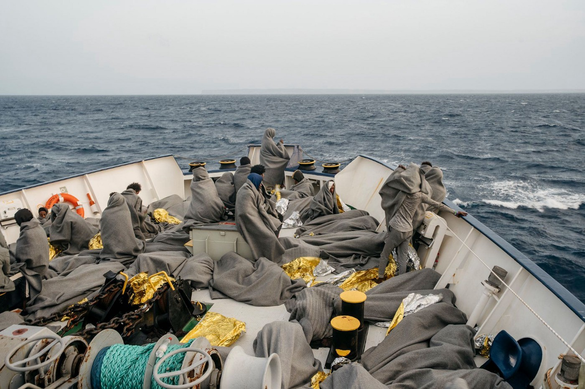
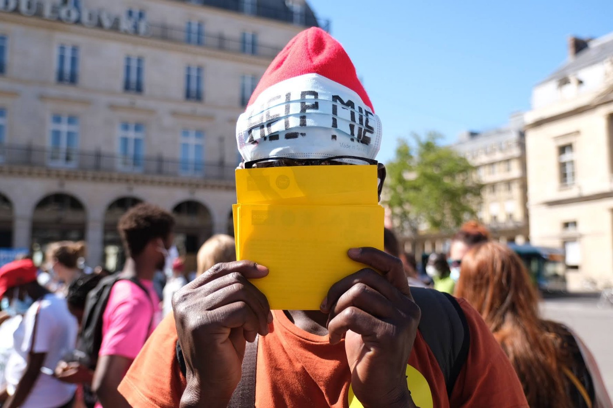

### AYS Daily Digest 03/05/21 ~ 50 people drown off Libyan coast

_Is Denmark going to send asylum seekers to Rwanda? // Homelessness for UK refugees // 182 people arrive in Greece // Fence in Ritsona // and more…_
### FEATURE: 50 people drown off Libyan coast

Continuing AYS’s coverage from our [Weekend Digest](ays-weekend-digest-01-02-05-21-more-than-800-rescues-at-sea-1cfd8b77df43) on distress calls from the sea, [Stol\.it](https://www.stol.it/artikel/politik/suche-nach-50-menschen-nach-schiffsbruch-vor-libyen?fbclid=IwAR2F7Kpz5mtjJJ8RbW0N2s0FDybujUqnHmJXCYOGnL7t32KRjuXvEIW5daw) news reports:

> “Libya’s Red Crescent announced in a press release on Monday that at least 50 migrants, including some Egyptians, had died in a shipwreck off the coast of the Libyan city of Al\-Zawiya\. This was reported by Italian media referring to a Libyan source\. This search for survivors is ongoing\.” 

> “Before that, the International Organization for Migration \(IOM\) reported that 11 people had died after a rubber dinghy sank\. There were 24 migrants on board heading for Europe\. The Libyan Coast Guard rescued 12 people\. 

> Over 700 migrants have been picked up by the Libyan coast guard in the Mediterranean in the past few days and brought back to Libya\. They also included small children and vulnerable people, reported the spokeswoman for the UNHCR refugee agency, Carlotta Sami\. ‘Libya is not a safe haven,’ said Sami\. 

> After another rescue operation in the central Mediterranean Sea, the organization Sea\-Watch is waiting to be assigned a port by the authorities\. The Berlin\-based organization announced on social media that there are now 455 rescued boat migrants on board the ‘Sea\-Watch 4\.’ On Saturday evening, the volunteers had rescued around 50 people from distress during a 6th mission\.” 

This drowning comes in a wave of recent deaths at sea\. In an interview by Junge Welt, they talk to Verena Papke, managing director of SOS Méditerranée Germany, about the other recent drowning where 130 people died:

> “ **Up to 130 people recently drowned in the Mediterranean Sea off Libya\. The crew of your ship ‘Ocean Viking’ has drawn up a log of the events, which shows the lack of communication and coordination during the rescue operation\. What were the main deficits for you?** 

> Although the presence of the SOS Méditerranée rescue ship, the ‘Ocean Viking,’ was known in the rescue zone, we received no information or support in the search from the ‘Libyan Coast Guard’ or from European authorities\. Only the private emergency hotline ‘Alarm Phone’ informed us about the distress at sea\. In a race against time, we spent many hours looking for the rubber dinghy that had made the emergency call in very bad weather\. When the ‘Ocean Viking’ finally found the wreck, it was too late — only corpses were floating in the water\. 

> **Do you think people could have been saved if more determined action had been taken?** 

> We have to assume that\. The authorities did not involve the ‘Ocean Viking’ in the search for the distress at sea, although she is optimally equipped for such a rescue operation\. At the same time, the ‘Libyan Coast Guard,’ which is responsible for coordination in this area, has not, to our knowledge, sent a boat to the rescue\.” 

Read the interview in full [here](https://www.jungewelt.de/artikel/401735.seenotrettung-im-mittelmeer-eu-schaut-zu-wie-menschen-ertrinken.html?fbclid=IwAR1VxSmDSpcAEs_Wka4gS_4PaAi8SMqFK0gvalziBnp6PqKBNyVX1AtDHms) \.
### 95 people intercepted by Libyan Coast Guard

■■■■■■■■■■■■■■ 
> **[UNHCR Libya](https://twitter.com/UNHCRLibya) @ Twitter Says:** 

> > 🚨 Some 95 persons have been intercepted/rescued at sea, and returned to Tripoli by the Libyan Coast Guard tonight.

UNHCR and IRC are currently providing them with blankets, water, and medical assistance. https://t.co/flp6SzzfkI 

> **Tweeted at [2021-05-02 23:42:52](https://twitter.com/unhcrlibya/status/1389002479627550721).** 

■■■■■■■■■■■■■■ 

Alarm Phone and Mediterranea Saving Humans released a joint statement with a timeline of this interception: \(read in full [here](https://mediterranearescue.org/en/news-en/95-people-captured-at-sea-and-pushed-back-to-libya-the-case-from-may-2/) \)

> “Yesterday, on 2 May 2021, at 05:32h CEST, a group of 95 people on a wooden boat called Alarm Phone\. Trying to escape from Libya, they were in urgent distress in international waters, drifting a few nautical miles south of the Maltese Search and Rescue zone \(34°14, E12°11 at 05:32h\) \. Their engine was not working anymore and the weather was worsening\. The Italian authorities, after the so\-called Libyan coastguard had requested their assistance, ordered two merchant vessels, the VOS APHRODITE and the OLYMPIYSKY PROSPECT, to approach the boat in distress and remain on standby, waiting for the arrival of the so\-called Libyan coastguard\. When the people in distress realised they were going to be returned to Libya, rather than rescued to Italy, the situation on board deteriorated, resulting with several people falling or jumping into the water to prevent capture\. Merchant vessels were then asked to rescue the people and to hand them over to the so\-called Libyan coastguard, who forcibly returned them to Libya\.” 

> “It is time for the creation of a Search and Rescue \(SAR\) coordination centre that intends to prevent illegal pushbacks and death at sea instead of facilitating them\. This coordination centre should be organised by civil society: a Civil Maritime Rescue Coordination Centre \(or CMRCC\), capable and willing to collect distress calls, to coordinate search and rescue operations to a Place Of Safety \(POS\), and to work towards the abolition of the EU border regime and its racist violence\.” 

![“Onboard the Sea\-Watch 4 our guests and crew are exhausted\. It is very windy and our guests have been bearing the weather on the open decks for several days now\. Nevertheless, the mood is positive and everyone is doing the best to make the situation on board as good as it can be for everyone\.
We are impressed by the strength and perseverance of these people\! Because although they have experienced terrible things, they sing and dance, and support the crew on board wherever they can\.”
[**UPDATE**](https://www.facebook.com/seawatchprojekt/posts/2816036961947700) **A COUPLE HOURS LATER:** “We have a Port of Safety\! The Italian authorities assigned Trapani, Sicily, to us where the Sea\-Watch 4 is now heading\.
Our guests are very relieved and incredibly happy that they will be allowed to disembark on safe land soon\!”
Photos by [Fabian Melber](https://www.facebook.com/seawatchprojekt/posts/2815961161955280)](assets/eecf017f8ccd/1*laxXKJnXsU94Jhy6UOkmAg.jpeg)

“Onboard the Sea\-Watch 4 our guests and crew are exhausted\. It is very windy and our guests have been bearing the weather on the open decks for several days now\. Nevertheless, the mood is positive and everyone is doing the best to make the situation on board as good as it can be for everyone\.
We are impressed by the strength and perseverance of these people\! Because although they have experienced terrible things, they sing and dance, and support the crew on board wherever they can\.”
[**UPDATE**](https://www.facebook.com/seawatchprojekt/posts/2816036961947700) **A COUPLE HOURS LATER:** “We have a Port of Safety\! The Italian authorities assigned Trapani, Sicily, to us where the Sea\-Watch 4 is now heading\.
Our guests are very relieved and incredibly happy that they will be allowed to disembark on safe land soon\!”
Photos by [Fabian Melber](https://www.facebook.com/seawatchprojekt/posts/2815961161955280)
#### GREECE

](assets/eecf017f8ccd/0*gtXg7tqh6ikp1y1y.jpg)

Photo by Eleftheria Online\.gr find more photos of the port arrival [here\.](https://eleftheriaonline.gr/local/koinonia/item/242641-efthase-stin-kalamata-to-skafos-me-tous-170-prosfyges-kai-metanastes?fbclid=IwAR0v9-seJP3P-ymBC-xMy-gXpLGEMPCffFYnARxwy0GsHpcntsrUYexQYZI)
### On Monday 182 people arrived in the port of Kalamata

The AP reported that _“Greece’s coast guard says it has towed a yacht carrying \(over\) 170 migrants to a port on the country’s southern mainland after the vessel sent out a distress signal while sailing off the southern coast of Greece\. The yacht arrived in the port of Kalamata on Monday, the coast guard said\. It did not have any further details on where it had set sail from, what its intended destination had been or what the nationalities of those on board were\. Authorities said a passing cargo ship initially began towing the yacht on Sunday after it lost steering more than 50 nautical miles \(57 miles\) southwest of Cape Tenaro, also known as Cape Matapan, the southernmost tip of mainland Greece\.”_ More [here](https://apnews.com/article/middle-east-europe-migration-1db2e3f3e977c805777cec187127fae6?fbclid=IwAR0CXao6A3cORFwmjz9srp_yGy0R6g1H4sZNYvyviD6V09RiOiSjBAcVfeE) \.

**Other new arrivals** : Aegean Boat Report said that “ _The people from the boat that landed south of Palios yesterday afternoon were finally found and taken to quarantine camp\. After spending the night outside, 36 people were found in Mantamados by police at 09\.00 this morning\. They have all been taken to the quarantine camp in Megala Therma, Lesvos north\._ ” More [here\.](https://www.facebook.com/AegeanBoatReport/posts/1076978592825244)
### Fences going up in Ritsona

■■■■■■■■■■■■■■ 
> **[Parwana Amiri پروانه اميري](https://twitter.com/parwana_amiri) @ Twitter Says:** 

> > Instead of giving us the chance to integrate,you’re separating us.
Instead of giving us the chance to live freely,you’re imprisoning us.
Instead of building bridges, you’re building walls.

We need your solidarity more than ever to stop it. 
#Ritsona #Malakasa #NeaKavala #Diavata https://t.co/2uNpWiQu2T 

> **Tweeted at [2021-05-03 08:13:03](https://twitter.com/parwana_amiri/status/1389130872247529474).** 

■■■■■■■■■■■■■■ 

Journalist Lena K\. is also reporting that “the Greek government is planning to turn ALL camps \(i\.e\. ‘hospitality structures’\) in the mainland into closed facilities with fences, surveillance systems and drones, not just those on the islands\. Funded by the EU Internal Security Fund\.” More [here](https://twitter.com/lk2015r/status/1389260753593581569) \.

■■■■■■■■■■■■■■ 
> **[Lena K.](https://twitter.com/lk2015r) @ Twitter Says:** 

> > The body of a dead man was found today on the bank of the river #Evros, in advanced decomposition, near the location of Petalo, where the new wall has been built. 
#refugeesgr #borderskill 

> **Tweeted at [2021-05-03 14:22:48](https://twitter.com/lk2015r/status/1389223923536039947).** 

■■■■■■■■■■■■■■ 

#### SPAIN
### 42 people rescued and brought to Arguineguín

[Europa Press](https://www.europapress.es/islas-canarias/noticia-rescatan-patera-42-personas-ellos-tres-menores-30-millas-gran-canaria-20210503164635.html?fbclid=IwAR1cOuJi3HFjLAYfpVBa34D27Ql03iD6UlYA0XZS8KR4ciG9wv78o3rvLqM) reports: _“Salvamento Marítimo rescued at noon this Monday a second dinghy with 42 people on board, including three minors, when they were about 30 miles from Gran Canaria\. Specifically, and as reported by Salvamento Marítimo, at 1:20 p\.m\. the Sasemar 103 plane sighted a cayuco that was sailing about 30 miles southwest of Gran Canaria, at which point the guard Talia was activated and headed to the area to the rescue of the migrants, while the plane remained watching to update the position of the boat at all times\. Around 3:20 p\.m\. the 42 immigrants were rescued, of whom 20 are men, 19 women and three minors, all of sub\-Saharan origin and in apparent good health, being transferred to the Arguineguín dock\. in Mogán, where they are expected to arrive around 5:15 p\.m\.”_
#### DENMARK

■■■■■■■■■■■■■■ 
> **[Niklas Stoerup Agerup](https://twitter.com/NSAgerup) @ Twitter Says:** 

> > Drawing of Syrian refugees in #Denmark by major Danish newspaper. 

This is the illustrated version of how Danish politicians portray asylum-seekers, refugees and people from the Middle-East in general.

I have no words to express the shame I feel

  [jp.dk/d?id=12940116](https://jp.dk/d?id=12940116) 

> **Tweeted at [2021-05-03 08:59:51](https://twitter.com/niklas_agerup/status/1389142650461294592).** 

■■■■■■■■■■■■■■ 

### Will Denmark start sending asylum seekers to Rwanda?

The Danish government is conducting talks with “several” countries on establishing an offshore asylum processing centre\. Two Danish ministers were in Rwanda last week to discuss the possibility of establishing the centre in the country\. Mattias Tesfaye, the Immigration Minister, said:

> “It’s correct that it’s the government’s wish to establish a new asylum system where the processing of asylum claims is moved out of Denmark\. We are in dialogue with a number of countries about that\.” 

[African Policy](https://www.africanpolicy.com/magazine/is-denmark-planning-to-send-asylum-seekers-to-rwanda/?fbclid=IwAR1cOuJi3HFjLAYfpVBa34D27Ql03iD6UlYA0XZS8KR4ciG9wv78o3rvLqM) reports that while Tesfaye did not specifically mention Rwanda:

> “Rwandan media on the other hand reported that Denmark has signed two agreements in the country that promote cooperation on political and migration issues\.” 

[Free West Media](https://freewestmedia.com/2021/04/20/asylum-seekers-in-denmark-can-be-sent-700km-away-to-rwanda/?fbclid=IwAR0Ao4gaomrN84wfebJtnqjCD_rrb443WpHFA3E3VaZDeECzqXgvCfBzKsA) reports that:

> “According to the Danish daily, Rwanda’s president Paul Kagame could be ‘the man who fulfils the Social Democrats’ asylum dreams\.’ The news came on April 1, but in Denmark there were few people who thought it was an April Fool’s joke\. The Danish Social Democratic government has for several years had a very restrictive line on immigration and has also initiated an active return policy of Syrians\. The government has been open about wanting to sign a bilateral agreement with another country, to receive Danish asylum seekers /…/ removing them from Danish society while their asylum status is being investigated\. 

> The government is currently said to be negotiating with several different countries on the issue\. Jyllands\-Posten, which is Denmark’s largest daily newspaper, seems to be at the forefront of advocating that Arab and African asylum seekers be sent out of the country\. In the article, the newspaper writes that they themselves have contacted several countries requesting a piece of land to be able to build an asylum centre where asylum seekers are deported pending investigation\.” 

To give you some updated insight on the situation in Rwanda, [Human Rights Watch](https://www.hrw.org/news/2021/05/03/what-press-freedom-looks-rwanda?fbclid=IwAR0aeDYAeCAye5nGzZWC0tCL7Bbi2g85lYWM-YgB5rPiGpN60mUJJxyoHPM) published an report on Monday entitled **“What Press Freedom Looks Like in Rwanda: Journalists and Online Commentators Face Persecution for Critical Reporting\.”** Here is some background on the president who will “fulfil the Social Democrats’ asylum dreams:”

> “Celebrating World Press Freedom Day in Rwanda may well require journalists, activists, and diplomats to toe the line of the government’s ever\-growing list of forbidden topics\. In a country **where the president coolly gives speeches gloating about the assassination of political opponents** , his 2019 warning to online critics that ‘they are close to the fire’ and that one day ‘the fire will burn them,’ will likely be taken very seriously\. 

> It is not unusual for Rwandan journalists to go missing, or end up dead in mysterious circumstances\. Having effectively muzzled traditional media, the Rwandan authorities have turned their attention to the new medium used to broadcast information: YouTube\. Judging by the crackdown documented by Human Rights Watch over the past year, the authorities have gotten very efficient at online censorship\.” 

Who is to say that a new Danish asylum processing centre will not become a new topic which the press would be punished for reporting on? AYS will of course continue to report on this if any new developments surface\.
#### FRANCE

![**UTOPIA 56 UPDATE** : “Alongside other associations, we are referring to the UN Committee on Children’s Rights to ask for an investigation into the violations of the rights of Non Accompanied Minors in France\. Associations ask CRC to:
\- Initiate an investigation into violations committed by France, signatory State to the International Convention on the Rights of the Child, with regard to the rights set forth in this convention in the context of the reception and care of the MNA present in the national territory;
\- Make observations and recommendations necessary for the protection of the rights of these children;
The referral attributes the violations reported to two main factors: the denial of minority to which these children are victims and which deprives them of the national child protection system, and the inequalities of treatment of these children in the French territory\.
Currently, thousands of unaccompanied minors can only rely on the help of engaged citizen s’ associations and collective, while every one should be covered, like any minor present on the territory, from child protection to child protection the charge of the French public authorities\.” Read online statement in full [here](http://www.utopia56.com/fr/actualite/nous-demandons-enquete-lonu-sur-violations-droits-mna-france?fbclid=IwAR1w1YwGyRn0ygbFrMs-05yuzFXUoizt_wohG2A6rxgw5eDjHuo4hri_4KE) \. Photos by [UTOPIA 56\.](https://www.facebook.com/asso.utopia56/posts/4215794891785604)](assets/eecf017f8ccd/1*Pg_Ypq0JCQhqcSNRIXZ6OA.jpeg)

**UTOPIA 56 UPDATE** : “Alongside other associations, we are referring to the UN Committee on Children’s Rights to ask for an investigation into the violations of the rights of Non Accompanied Minors in France\. Associations ask CRC to:
\- Initiate an investigation into violations committed by France, signatory State to the International Convention on the Rights of the Child, with regard to the rights set forth in this convention in the context of the reception and care of the MNA present in the national territory;
\- Make observations and recommendations necessary for the protection of the rights of these children;
The referral attributes the violations reported to two main factors: the denial of minority to which these children are victims and which deprives them of the national child protection system, and the inequalities of treatment of these children in the French territory\.
Currently, thousands of unaccompanied minors can only rely on the help of engaged citizen s’ associations and collective, while every one should be covered, like any minor present on the territory, from child protection to child protection the charge of the French public authorities\.” Read online statement in full [here](http://www.utopia56.com/fr/actualite/nous-demandons-enquete-lonu-sur-violations-droits-mna-france?fbclid=IwAR1w1YwGyRn0ygbFrMs-05yuzFXUoizt_wohG2A6rxgw5eDjHuo4hri_4KE) \. Photos by [UTOPIA 56\.](https://www.facebook.com/asso.utopia56/posts/4215794891785604)
#### UK
### Right to stay = right to be homeless?

The Evening Standard reports: “ _Private landlords are turning away refugees who find themselves facing homelessness just days after they receive the right to remain in the UK, a report by the Refugee Council has found\. The charity runs a scheme which helps secure loans and grants for refugees to help them pay deposits and costs associated with moving\. A report by the charity found almost all \(98 per cent\) refugees referred to its scheme were completely homeless\. Less than half \(48 per cent\) of the 160 refugees polled were able to access a private tenancy through the scheme, even with specialist support that it provides, between November 2018 and October 2020_ \.” [More here\.](https://www.standard.co.uk/news/london/refugees-homeless-private-landlords-housing-report-b932450.html?fbclid=IwAR1cOuJi3HFjLAYfpVBa34D27Ql03iD6UlYA0XZS8KR4ciG9wv78o3rvLqM)
#### WORTH READING
- Africa News’ article [**‘Europe or death’: African migrants make crossing from Tunisia**](https://www.africanews.com/2021/05/03/europe-or-death-african-migrants-make-crossing-from-tunisia/?fbclid=IwAR3_TyqGrNoLFi1gFDew3EtuAUNtsI54CsO6sbCoWOsz5zI208PnQKAhVT4) **\.**

**Find daily updates and special reports on our [Medium page](https://medium.com/are-you-syrious) \.**

**If you wish to contribute, either by writing a report or a story, or by joining the info gathering team, please let us know\.**

**We strive to echo correct news from the ground through collaboration and fairness\. Every effort has been made to credit organisations and individuals with regard to the supply of information, video, and photo material \(in cases where the source wanted to be accredited\) \. Please notify us regarding corrections\.**

**If there’s anything you want to share or comment, contact us through Facebook, Twitter or write to: areyousyrious@gmail\.com**

_Converted [Medium Post](https://medium.com/are-you-syrious/ays-daily-digest-03-05-21-50-people-drown-off-libyan-coast-eecf017f8ccd) by [ZMediumToMarkdown](https://github.com/ZhgChgLi/ZMediumToMarkdown)._
