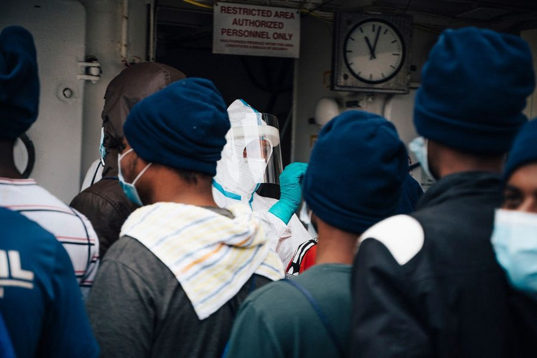

### AYS Daily Digest 05/05/2021: Denmark is negotiating about offshore asylum procedures
#### More on Denmark’s plans for offshore asylum procedures // Evictions in Bosnia // Disembarkation of 455 people rescued by Sea\-Watch // New lies from Frontex // Guardian publishes investigation on border deaths //

Testing for covid before disembarkation\. Copyright: Sea\-Watch
### FEATURE: News on Denmarks attempts to install offshore asylum procedures

In [Monday’s digest](ays-daily-digest-03-05-21-50-people-drown-off-libyan-coast-eecf017f8ccd) we reported about the government of Denmark’s plans on negotiating a deal with several countries about building reception centres in order to conduct offshore asylum procedures of people how arrived to Denmark\. News now spread that Danish authorities have signed an agreement with Rwanda to enhance cooperation regarding migration and asylum, potentially leading to offshore asylum procedures in Rwanda\. 
[Amnesty International now commented on the issue:](https://www.amnesty.org/en/latest/news/2021/05/denmark-plans-to-send-asylum-seekers-to-rwanda-unconscionable-and-potentially-unlawful/?fbclid=IwAR1WI0jNwTQshEF7pDKREy5XrMn6ovfTq_Mb18HYwCTlLfbRTS33DZcwVqc)

> “Any attempt to transfer asylum\-seekers arriving in Denmark to Rwanda for their asylum claims to be processed would be not only unconscionable, but potentially unlawful\. Denmark cannot deny the right of those arriving in Denmark to seek asylum and transfer them to a third country without the required guarantees\. These proposals take responsibility\-shifting of refugee protection by EU governments to a new low, and would set a dangerous precedent in Europe and globally\. The idea that rich countries can pay their way out of their international obligations, stripping asylum\-seekers of their right to even have their claims considered in Denmark, is deeply worrying\.” 

[According to newspapers](https://www.kristeligt-dagblad.dk/danmark/regeringen-taler-med-etiopien-og-tunesien-om-modtagecentre?fbclid=IwAR3-oex4ppM75WOLtZkVzNlteWsSj792k0Gkdlmx3GlbYuHEk11OpYloifU) , the Danish government has further secretly been in dialogue with Ethiopia, Tunisia and a third country about reception centers for asylum seekers to be flown from Denmark to a country outside Europe’s borders\.

Meanwhile, no news about a change in policy in Denmark concerning the revoking of asylum claims of Syrian nationals from the Damascus region\. 
About 500 people are affected\. Since Denmark does not have official relations with Assad’s Syria, the people will not be deported by force but instead will be forced to live in departure centres or leave voluntarily\. 
For more information, see these two stories about two women affected by the new policy:

### GREECE
#### No priority in vaccination for people living in Moria 2\.0

Despite living in overcrowding in the camps, refugees will not belong to a priority class when it comes to COVID\-19 vaccinations\. Apparently, the vaccination campaign in Moria 2\.0 will start as of mid\-May\. In the recent days, there have again been high numbers of positive cases as well as high risk contacts\. 
In the camp, seven people share one tent; people have to wait in lines to receive food; they share chemical toilets and have little access to medical care\. These conditions obviously provide a perfect field for the virus to spread in\. 
For more see \(Italian\):

Meanwhile, people are hardly able to leave Moria 2\.0:

■■■■■■■■■■■■■■ 
> **[Franziska Grillmeier](https://twitter.com/f_grillmeier) @ Twitter Says:** 

> > “The gates of the camp opened again. However, the police only allowed a handful of people to get outside today. 

My next appointment to leave the camp is Monday - in 5 days. This means my nearly two weeks locked inside #Moria2 with my family,” writes man from #Syria. https://t.co/gcWgpleVrg 

> **Tweeted at [2021-05-05 13:20:19](https://twitter.com/f_grillmeier/status/1389932972967669761).** 

■■■■■■■■■■■■■■ 

Also, more news about the new closed facilities that are to be built on the Greek Islands:

■■■■■■■■■■■■■■ 
> **[Dr. Apostolos Veizis](https://twitter.com/AVeizis) @ Twitter Says:** 

> > 269.230.663,55 💶 will be spend by Europe and Greece to set up closed centers on the 5 [islands.Delivery](http://islands.Delivery) expected 31/03/2022
[stonisi.gr/post/16832/sth…](https://www.stonisi.gr/post/16832/sthn-telikh-eytheia-gia-th-nea-domh-sth-vastria#.YJLVEx10hKE.twitter) 

> **Tweeted at [2021-05-05 17:28:22](https://twitter.com/aveizis/status/1389995397976842251).** 

■■■■■■■■■■■■■■ 

### BOSNIA and HERZEVOGINA

No Name Kitchen published an update on the situation in Bosnia\. According to them, evictions of squats started and will most likely continue\. Early in the morning, police came to a big squat with about 50–70 people in Bihać\. They destroyed the belongings of the people living there and forced the people into a bus to Lipa camp\. Only some youngsters managed to avoid being taken to the camp\. Food and hygiene conditions are very bad at the camp\. There is no hot water and many people don’t dare to eat the only food available as it upsets their stomachs\.
### ITALY

The 455 people rescued by Sea Watch since Thursday disembarked in Trapani on Tuesday morning\. All of them as well as all crew members tested negative before disembarkation\.

■■■■■■■■■■■■■■ 
> **[Sea-Watch](https://twitter.com/seawatchcrew) @ Twitter Says:** 

> > Nachdem gestern Nacht unsere Gäste vollständig und sicher an Land gehen konnten, gibt es weitere gute Nachrichten: Alle 455 Geretteten und die 29 Crew-Mitglieder der #SeaWatch4 wurden negativ auf COVID-19 getestet. https://t.co/Qk3OXoX1Im 

> **Tweeted at [2021-05-05 07:27:54](https://twitter.com/seawatchcrew/status/1389844288067063808).** 

■■■■■■■■■■■■■■ 

During 2021, 10,000 people have arrived so far in Italy, of which 1,500 since the beginning of May\. This number is three times higher than it was at the same time last year\.

### SEA

In March 2021, Sea\-Watch aircrafts Moonbird and Seabird flew 9 missions in order to monitor the situation in the Mediterranean Sea\. They witnessed four pullbacks by the Libyan Coast Guard, one even within the Maltese SAR zone\.

The Alan Kurdi ship from Sea\-Eye is currently on its way to Spain, after having been blocked from leaving port by the Italian Coast Guard for seven months\.

■■■■■■■■■■■■■■ 
> **[Gorden Isler](https://twitter.com/gorden_isler) @ Twitter Says:** 

> > Nach 7 Monaten ist die #ALANKURDI wieder auf dem Meer. Ihr Kurs führt nach Spanien in die Werft. Dass wir sie gegen @[guardiacostiera](https://twitter.com/guardiacostiera) frei klagen mussten, ist ein Skandal, der in 2021 schon über 500 Menschenleben forderte. Möglicherweise hätten wir einige von ihnen retten können. https://t.co/7hS8xu5ZA2 

> **Tweeted at [2021-05-05 15:37:02](https://twitter.com/gorden_isler/status/1389967379380178946).** 

■■■■■■■■■■■■■■ 

### FRANCE
#### Investigation of UN Committee on the Rights of the Child

French NGOs concerned with child protection turned to the UN Committee on the Rights of the Child to call for an investigation into the treatment of foreign unaccompanied minors in the country\. They say the rights of unaccompanied minors are systematically violated\. The proposal was declared admissible, which opens the way for an investigation\. France is a signatory of the International Convention on the Rights of the Child\. The data provided by the NGOs claims to provide proof of serious violations of the convention\. 
For more see:

#### State Council failed to close down illegal detention centres

At the Police Stations in Menton \(Alpes\-Maritimes\) and Montgenèvre \(Hautes\-Alpes\), people who tried to cross into France from Italy are held outside any legal framework\. The State Council has now acknowledged that there is no legal framework for the detention, but never the less has refused to close them down\.
According to NGOs, the boxes people are held in for several hours, sometimes overnight, are uninsulated structures of a few square metres, there is a lack of blankets, no possibility to lie down, a lack of or very scant food and water, deplorable hygienic conditions, and great promiscuity among all the people held \(families, adults, children, men and women\) \. 
For the press release of the NGOs involved, see:

### GERMANY
#### Criminalisation of people who fight against deportations

In Germany, people who try to support those who face a deportation often face legal charges\. At the moment, this is happening to Hagen Kopp, an activist who is charged with ‘public incitement to commit crimes’, because he runs a webpage on which people are informed about how they can help those who face deportation\. In this interview, he provides insights into his work, his situation and his motivations\. When asked why he is doing this work, he answered:

> “Because for 30 years I’ve seen people get scared and often don’t know how to sleep\. There was an earlier initiative in Hanau where we asked Kurds threatened with deportation what we should call the project\. Her idea was: “For a good night’s sleep”\. At first we paused — it was about her fear of being woken up at four o’clock at night and being taken to the airport with children and luggage\.” 

If you need to restore your faith in humanity, we recommend reading this interview \(in German\):

> “Migration is a human right for me\. I would reverse Horst Seehofer’s saying “Migration is the mother of all problems”: Migration is the mother of all societies\. It has always been that way in history\. To exclude people who are looking for a better life for themselves and their families is a racist injustice for me, I will never come to terms with that\. “ 

### SWEDEN

In Sweden a broad alliance of centre right to far right parties published a joint proposal for new migration policies\. The new proposals mean, among other things, that the basis for residence permits will be limited for humanitarian reasons\. It also means that language requirements are tightened, at the same time as relative immigration is sharply limited\.

[This article gives](https://www.infomigrants.net/en/post/32016/sweden-young-afghans-in-a-race-against-time?fbclid=IwAR1Piows6yexwddYJJi7HINiPkNNFB3zRe007xnpKZ4Zu8enMHP51L5PDiM) a good insight into the situation of young Afghans who, after finishing school, face deportation to Afghanistan unless they can find a permanent job within six months\.
### GENERAL

The Guardian published an investigation which revealed that 2,000 deaths can be linked to illegal EU pushbacks\. For the investigation, the Guardian used data collected from NGOs and monitoring groups like BVMN, the Danish Refugee Council and others\. The article provides a useful overview over the state of the art of tactics of the European border regime\.

Researcher Lena Karamanidou commented on the article on twitter, criticising that some of the results are not properly embedded\. For example it is not clear whether pushback practices actually are such a new phenomenon or if they are just better documented by NGOs and people on the move themselves\. She further raises the valid fear that

> “pushbacks are now being seen as ‘human rights violations’, an aberration to a ‘proper’ border control system that can be fixed with better training/monitoring/reforming Frontex, rather than a routine practice produced by violent border regimes\.” 

She reiterates that:

■■■■■■■■■■■■■■ 
> **[Lena K.](https://twitter.com/lk2015r) @ Twitter Says:** 

> > 13/ Last point 1: ALL borders are violent, ALL border controls are violent. People don't die only during pushbacks; pushbacks are not the only form of violence people on the move are subjected to. Border violence takes many forms, and doesn't only happen at the external borders. 

> **Tweeted at [2021-05-05 10:17:18](https://twitter.com/lk2015r/status/1389886915516719104).** 

■■■■■■■■■■■■■■ 

#### Latest fairy tales from Frontex’s head story teller Leggeri

■■■■■■■■■■■■■■ 
> **[Frontex](https://twitter.com/Frontex) @ Twitter Says:** 

> > Frontex Director Leggeri: Frontex does not cooperate with Libya. Our surveillance planes in the Central Mediterranean support search and rescue operations. They inform national rescue centres in Italy, Malta, Libya and Tunisia. Saving lives is our priority. 

> **Tweeted at [2021-05-05 08:43:02](https://twitter.com/frontex/status/1389863194135568385).** 

■■■■■■■■■■■■■■ 

Journalists and NGOs have shown proof of cooperation between Frontex and the so\-called Libyan Coast Guard\. In addition to that, in the original German tweet Leggeri says: There are no agreements between Libya and Frontex\. While this does not exclude any cooperation, the Frontex tweet states exactly that: Frontex does not cooperate with Libya\.

This documentary is about the allegedly non\-existing cooperation between Frontex and Libya \(German\):

**Find daily updates and special reports on our [Medium page](https://medium.com/are-you-syrious) \.**

**If you wish to contribute, either by writing a report or a story, or by joining the info gathering team, please let us know\.**

**We strive to echo correct news from the ground through collaboration and fairness\. Every effort has been made to credit organisations and individuals with regard to the supply of information, video, and photo material \(in cases where the source wanted to be accredited\) \. Please notify us regarding corrections\.**

**If there’s anything you want to share or comment, contact us through Facebook, Twitter or write to: areyousyrious@gmail\.com**

_Converted [Medium Post](https://medium.com/are-you-syrious/ays-daily-digest-05-05-2021-denmark-is-negotiating-about-offshore-asylum-procedures-bb87ef4611a7) by [ZMediumToMarkdown](https://github.com/ZhgChgLi/ZMediumToMarkdown)._
