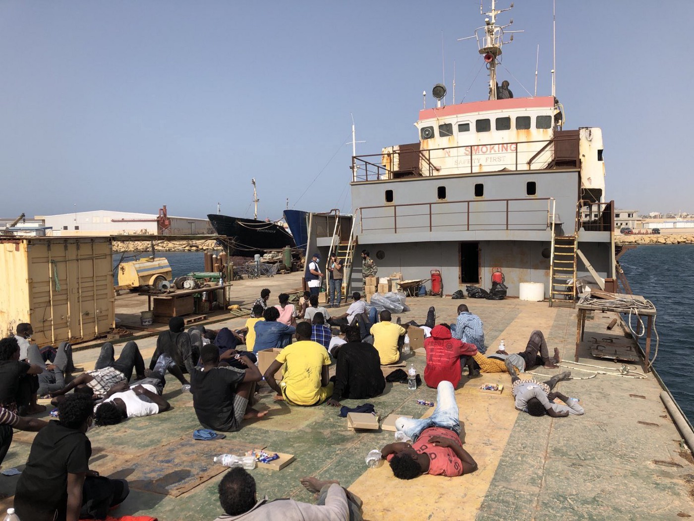
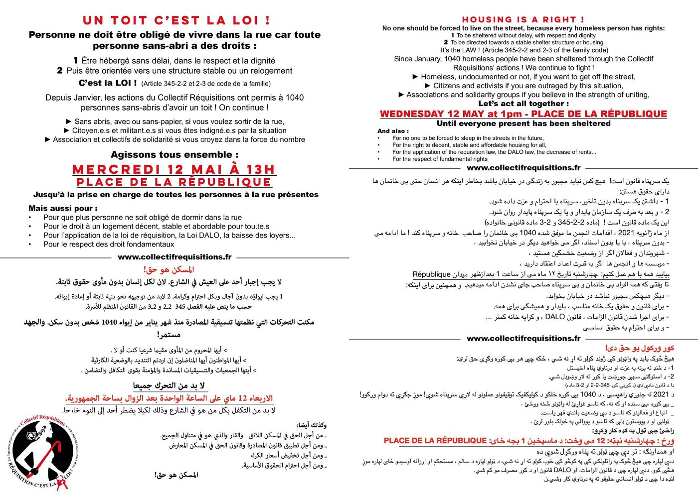

### AYS Daily Digest 10/05/21–700 people back to Libyan detention

[Are You Syrious?](?source=post_page-----3391b69dfb6d--------------------------------)

[May 11](ays-daily-digest-10-05-21-700-people-back-to-libyan-detention-3391b69dfb6d?source=post_page-----3391b69dfb6d--------------------------------) · 7 min read

_Man detained illegally for 4 years in UK // UNHCR condemns UK’s new asylum plan // evictions in Calais // and more…_

Photo by [UNHCR Libya](https://twitter.com/UNHCRLibya/status/1391763343162200064?fbclid=IwAR36ekTQRaeO6Ag9PD7FIdqA1ehTWZ6zZtvru8F0NITQB7cgUaMLeJ6ke2Y)
### FEATURE: Shipwrecks, distress calls, deaths, rescues, arrivals, and 700 people back to Libyan detention, all below
### At least five feared dead after shipwreck off Libya

On Sunday, a shipwreck cost [at least five lives](https://thecivilfleet.wordpress.com/2021/05/10/european-states-urged-to-stop-ignoring-refugee-deaths-after-at-least-six-drown-and-700-others-are-returned-to-libya/?fbclid=IwAR3iP3NCIFHr-JF-63oJAXTEa-9fYHExKIVg15MBi5L-_1uirDtUE9P8AM0) , including one of a child\. Survivors were brought back to Libya by fishermen\.
### Sixty\-six people called in distress, only 42 survived

[Alarm Phone](https://twitter.com/alarm_phone/status/1391783458289164291) reported “ _More deaths at EU borders\. Of the boat with 66 people who called us this morning only 42 people survived, one person was found dead & 23 people are missing\. We lost contact at 08\.12am\. We are out of words to denounce the continuous killing of the border regime \#AbolishBorders_ ” UNHCR also reports:
### 75 people missing in distress

A few hours later “UPDATE: We lost contact to the ~75 people in the black rubber boat since 2am\. The vessel \#AmandaF was ordered to monitor\. We cannot reach RCC \#Malta and don’t know if and when people get rescued\.”

[Alarm Phone](https://twitter.com/alarm_phone/status/1391714186531590148) also reported that overall “ _in the past 27h, 6 boats in distress in central Med have contacted us\. We have lost contact\. The authorities do not confirm but we believe that 2 boats are in Lampedusa, 1 in the Maltese SAR, and 1 near Libya\. We don’t know what happened to the other 2\._ ”
### Over 2000 people arrived on Lampedusa this weekend

[Hundreds](https://twitter.com/sunderland_jude/status/1391817540469497856?fbclid=IwAR3-03mepp3eIiNawJDy-xZfm0dvU-C4E3xV2St6sWB1Fyo_apl7JmuOAyo) are still waiting to disembark…
### In total — 700 people were brought back to Libyan detention on Sunday

[Info Migrants](https://www.infomigrants.net/en/post/32118/five-migrants-drown-fleeing-libya-700-returned-to-detention?fbclid=IwAR2HUqa_19O_oWlDapZ2itIqwh3E3SIdKKOoHkgTbiEyRCTGORoiaIYM6lY) reports that “ _Nine boats carrying more than 700 people were intercepted Sunday by Libyan coast guard officers\. Safa Msehli, a spokesperson for the UN migration agency \(IOM\), said the migrants were taken to detention centers, where the IOM believes they are likely to suffer threats to their lives and violations of their rights_ \.”
### GREECE
### Updates from Chios

[Keep Talking Greece](https://www.keeptalkinggreece.com/2021/05/10/vial-refugee-camp-dead-woman-birth) reports:

> _“One Iranian asylum seeker died in his tent on Sunday night and a woman from Somalia gave birth on the side of the road waiting for an ambulance\.”_ 

> _“Together with her newborn the 25\-year\-old asylum seeker was later transferred with the ambulance to the hospital\._ 

> _On Sunday night, a 51\-year\-old asylum seeker from Iran was found dead in his tent in the same refugee center\. According to local media reports, the man had underlying health issues, mainly heart problems, and was living in VIAL for the last one and a half year\._ 

> _A week ago, another resident had also died in his tent in VIAL camp\. The 28\-year\-old Somali died in the night from Sunday to Monday and when his body was discovered by border guards several hours later it was covered by rodents that were eating the flesh\. The man was recognized refugee and was staying in the camp due to coronavirus pandemic\.”_ 

### Update on Frontex ‘mislabelling minors as adults’

EU Observer reports:

> _“An African asylum seeker incorrectly registered as an adult by a Frontex border guard last year is today still grappling with that error\.”_ 

> _“‘Right now, I am only about survival,’ ‘William’ \(not his real name\), told EUobserver in a Zoom call from Athens on 30 April\. His lawyer in Greece, Elli Kriona Saranti, has lodged his case at the European Court of Human Rights, but for reasons linked to his quarantine conditions at Chrysi Ammos\. William has since been able to prove he was indeed only 17 at the time of his arrival, after Saranti helped secure his birth certificate later on\._ 

> _But by then it was too late\. He had been sent to the adult section of Moria, an EU hotspot turned migrant ghetto on the Greek island of Lesbos\. There he was brutalised he said, because of his homosexuality\. The camp eventually burned to the ground in September last year\. ‘Forgive me, I don’t want to go into details,’ he said, before tailing off\._ 

> _Minos Mouzourakis, a legal officer at Refugee Support Aegean, says William’s case is not unique\. He has accused Frontex of systemic violations during the screening process of arriving asylum seekers on the Greek islands\. ‘Frontex records people as adults even where they declare being minors,’ he said, in an email\. Mouzourakis made similar accusations to the European Parliament last month\. He said Frontex officers also often do not keep any record of those that protest against incorrect information\. And minors declared as adults do not undergo an age assessment by the Greek authorities, he said\. That means they are unable to demonstrate that they had protested the decision in the first place\. Unlike William, most don’t even speak English\.”_ 

More [here\.](https://euobserver.com/migration/151784?fbclid=IwAR3OUoQlk8XN8uS45_VKgeCIgA_HlZIsvHubQGoP1xY5-b_9V2a79AICIIw)
### THE BALKANS
### New report says smuggling worth 50 m euros a year

Balkan Insight reports:

> _“The migrant\-smuggling business in Western Balkan countries is worth at least 50 million euros a year, the Global Initiative Against Transnational Organized Crime NGO said in a report published on Monday\._ 

> _The report assesses the money being made by smugglers in the three key smuggling zones in the Western Balkans — the borders between Greece’s borders with North Macedonia and Albania; the border between Bosnia and Herzegovina and the EU in Croatia, and Serbia’s borders with Hungary and Romania\._ 

> _However, it says that the amount being made could be even higher, as some migrants travel to the EU by other means, such as from Albania to Italy by boat\._ 

> _According to the report, the first major smuggling zone is where most migrants and asylum\-seekers enter the Western Balkans — from Greece, either around Gevgelija in North Macedonia or near Kakavia and Kapshtica in Albania\.”_ 

Read in full [here](https://balkaninsight.com/2021/05/10/balkan-migrant-smuggling-business-worth-e50m-a-year-report/?fbclid=IwAR1Kce_KieU5weYNQYvT-rT4UyrSPo7Awo5g7sXjqGnKk0n9nvdh4jD7soc) \.
### FRANCE
### People expelled from Calais

Translation: “This morning in Calais, people were exiled and expelled from 7 places\. During these expulsions, \(many things\) are destroyed\. Basic items are stolen\. Today: 28 tents, 18 tarpaulins, 10 sleeping bags and 5 blankets\.”

Check out this event for housing is a right: 12/05 at 13:00, place de la République\.

Photo and Info by [Paris d’Exil](https://twitter.com/paris_dexil/status/1391687924639576066)
### UK
### “Congolese man unlawfully detained for three and a half years”

Free Movement just published an article detailing the case of a young man who was detained by the Home Office for over four years unlawfully\.

> _“So says the High Court in the case of Louis v Home Office \[2021\] EWHC 288 \(QB\), a depressing false imprisonment claim in which the Home Office was taken to task for its appalling treatment of a vulnerable detainee who was held under immigration powers for over four years\._ 

> _The court found a multitude of failures going “very well beyond maladministration” that resulted in Mr Louis, a care leaver who arrived in the UK aged 13, being unlawfully detained for 42 of the 51 months he spent in immigration removal centres\._ 

> _The case also shows the necessity of an effective system for monitoring detainee welfare on the prison estate, an issue to which the courts are now becoming alert\.”_ 

They quote His Honour Judge Cotter QC on his decision in the case:

_“The overriding sense that I have gained from this case is of a lack of any urgency within administrative processes leading to a situation where although months passed without any material progress this was considered acceptable by the Defendant’s employees charged with assessing the need for, and legality of, continuing detention\. \. the failures, in some cases in isolation and certainly when taken cumulatively, went beyond mere maladministration\._

_I found the details of the \[detention\] review process very concerning\. The records reveal not only important mistakes and failure to cross reference or acknowledge the existence of outstanding applications/representations, but also repeated failures to adequately read the records, unjustifiable comments, use of stock phrases and inappropriate prejudgment of what the view taken would be even if further evidence was available\.”_

While the defending is getting some financial compensation, article writer [Larry Lock](https://twitter.com/larlocker/status/1391695620776280066) says:

> _“Ordering the HO to part with a few £ teaches no one any lessons\. Mr Louis deserves more than money — he deserves four years of his life back\.”_ 

Read the full article [here](https://www.freemovement.org.uk/congolese-man-unlawfully-detained-for-three-and-a-half-years/?fbclid=IwAR3FLFfkD8LpLyj0gV1rbKgznHlP-8AwWSObWYccgj8kWugPFHK1HkrzPpI) \.
### “UNHCR deeply concerned at discriminatory two\-tier UK asylum plans, urges rethink”

In a new press release and 35 page observation statement, UNHCR makes clear that the UK’s new immigration plan is illegal under international law:

> _“Proposals by the UK to overhaul its asylum system risk breaching international legal commitments, undermining global refugee cooperation and triggering damaging effects on asylum\-seekers who arrive irregularly, according to an opinion published today by UNHCR, the UN Refugee Agency\._ 

> _The opinion was drawn up after examining the government’s ‘New Plan for Immigration’ presented 24 March, elements of which are set to be included in the May 11 Queen’s Speech\._ 

> _‘The UK has been an important supporter of refugees abroad, generous in resettlement, with a comparatively robust, fair and functioning asylum system,’ said Rossella Pagliuchi\-Lor, UNHCR Representative in the UK\. ‘We recognise the need to improve some asylum procedures, but these plans threaten to create a discriminatory two\-tier asylum system, undermining the 1951 Refugee Convention and longstanding global cooperation on refugee issues\. It’s not too late for a rethink\. We’re ready to work with the UK on alternative reforms\.’”_ 

Read the full press release [here](https://www.unhcr.org/uk/news/press/2021/5/6097bce14/unhcr-deeply-concerned-at-discriminatory-two-tier-uk-asylum-plans-urges.html) \.
### WORTH READING
- The Guardian’s article: [**‘We thank your government for our full pockets’ — Calais smugglers speak**](https://www.theguardian.com/global-development/2021/may/10/calais-smuggler-gangs-channel-migrants-uk-security?fbclid=IwAR2wzN-v3p-m_gWyHc2y-WZ6ukQLTlcPLJyNGRKiy1krgZ0il5A0E36TK74)
- [Josoor](https://twitter.com/JosoorNet/status/1391736587466252295) has provided an important thread on pushback incidents:

**Find daily updates and special reports on our [Medium page](https://medium.com/are-you-syrious) \.**

**If you wish to contribute, either by writing a report or a story, or by joining the info gathering team, please let us know\.**

**We strive to echo correct news from the ground through collaboration and fairness\. Every effort has been made to credit organisations and individuals with regard to the supply of information, video, and photo material \(in cases where the source wanted to be accredited\) \. Please notify us regarding corrections\.**

**If there’s anything you want to share or comment, contact us through Facebook, Twitter or write to: areyousyrious@gmail\.com**

_Converted [Medium Post](https://medium.com/are-you-syrious/ays-daily-digest-10-05-21-700-people-back-to-libyan-detention-a66182f8fe41) by [ZMediumToMarkdown](https://github.com/ZhgChgLi/ZMediumToMarkdown)._
