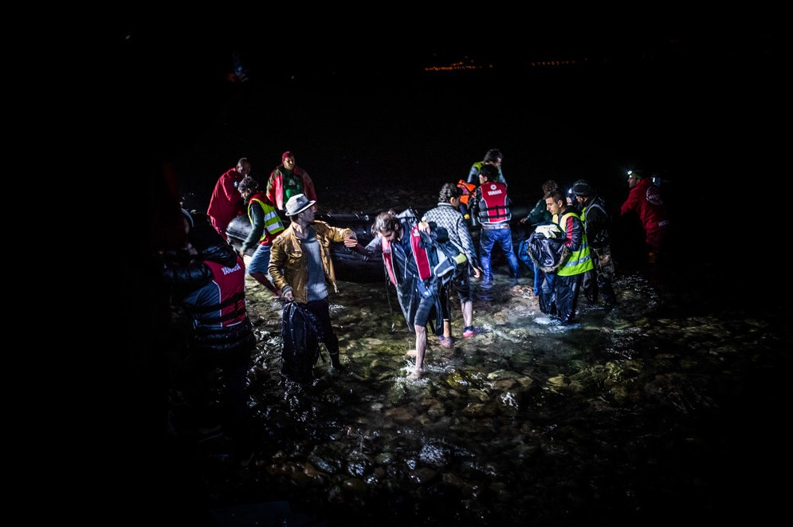

### AYS Daily Digest 13/05/2021: Somali father sentenced to 146 years in prison for trying to save dozens of lives off Lesvos
#### MSF returns to Central Med // Shipwrecks and returns to Libya // Greek petition to build schools — not walls // A moment of hope in Glasgow
### FEATURE — The price of saving lives? Two lifetimes in prison

Photo: Borderline Europe

The Greek justice system and the EU’s harsh border policies have destroyed another life this week: not by drowning, but with a sentence of 146 years in a Greek prison for trying to save 33 lives off the coast of Lesvos last December\.

While the criminalization of European sea rescuers such as Carola Rackete receives a good deal of media attention, “the everyday practice of incarcerating non\-Europeans on the Greek islands goes almost unnoticed,” [Borderline Europe](https://www.borderline-europe.de/unsere-arbeit/lesbos-gefl%C3%BCchtetem-droht-zweimal-lebensl%C3%A4nglich-haft-nachdem-er-bei-einem-schiffbruch?l=en&fbclid=IwAR3umtsAryMqogX6AvBx8G8HCDr6KREWzNImPzypbSZX5VId8D2DTzrhUf4) wrote in a press release on Wednesday\. “However, it is they who constitute the majority of those being arrested and imprisoned on allegations of ‘smuggling’ and ‘aiding illegal immigration’\.”

This Thursday, May 13, 27\-year\-old Mohamad H\., a father of four children, stood trial in Mytilene, Lesvos\. His crime? Steering a rubber boat, of which he himself was also a passenger, through treacherous waters off the coast of Greece in an effort to avoid a shipwreck and apply for asylum in Europe\. For this, Mohamad faced two life sentences and a further ten years imprisonment for each passenger aboard\.

The journalist Daphne Tolis wrote on Twitter that the young father was sentenced to 146 years in prison in a Mytilene courtroom yesterday:

■■■■■■■■■■■■■■ 
> **[Daphne Tolis](https://twitter.com/daphnetoli) @ Twitter Says:** 

> > The case was tried today on #Lesvos, Greece. The asylum seekers that were on the same rubber boat appeared in court to testify and said they owe their lives to Mohamad’s actions. Mohammad was sentenced to 146 years in prison. 

> **Tweeted at [2021-05-13 12:33:09](https://twitter.com/daphnetoli/status/1392820207111086082).** 

■■■■■■■■■■■■■■ 

On December 2, 2020, Mohamad and 33 other people, including three children, left Turkey for Greece in a rubber boat\. In the middle of the Aegean, the boat went into distress, and Mohamad, who had no prior boating experience, took the helm and tried to steer the craft to shore\. \(The other passengers confirmed that Mohamad tried to save their lives\. \)

Unfortunately, Mohamad’s efforts were not enough\. The boat capsized close to the island of Lesvos and two young women lost their lives\. The survivors were brought to the port of Mytilene, where Mohamad was immediately arrested for driving the boat and later charged with the “illegal transportation of third\-country nationals into Greek territory” and endangering the lives of everyone on board the rubber boat\. Since then, he has been held in a prison on the island of Chios to await trial\.

Borderline Europe wrote in a press release:

> We stand in solidarity with Mohamad H\. who is clearly being used as a scapegoat to divert attention from the responsibility that the EU and its ever\-increasing closure of borders carries for these deaths\. 

> Instead of being threatened with life in prison, Mohamad H\. should receive the care he needs after suffering such a traumatic experience\. 

> Instead of being threatened with life in prison, Mohamad H\. should be thanked and celebrated for trying to save the life of 33 people\. 

Under Greek law, any person who drives a vehicle across the Greek border carrying people seeking international protection is considered a smuggler\. Thus, [many other asylum\-seekers](https://www.borderline-europe.de/unsere-arbeit/stigmatisiert-inhaftiert-kriminalisiert-der-kampf-gegen-vermeintliche-schleuser-auf?l=en) before Mohamad H\. have been arrested, charged and found guilty of such crimes\. Their trials, however, are hardly fair and just\. The proceedings last on average 38 minutes only, and lead to an average sentencing of 44 years and fines over 370,000 euro, according to Borderline\.

“\[I\]t becomes absolutely clear that the accused tried to prevent the death of more people and his ‘driving’ the boat wasn’t a decision but a necessity\. It’s time to start applying all of the Greek Law and not only the parts of it that help to criminalize asylum seekers,” Dimitris Choulis and Alexandros Georgouli, Mohamad’s lawyers, said\.

Lena K\. identified the hypocrisy best in a tweet following the sentencing:

### TUNISIA
#### PM: There will be no reception centers in Tunisia

The Prime Minister of Tunisia Hichem Mechichi [said](https://www.infomigrants.net/en/post/32202/migrants-tunisian-premier-says-no-to-reception-centers?fbclid=IwAR2JPvtzXgTg3DaCSoR0TB9qf0-U38kvGVIiy-FhAGUewrchf0oDxJ7LIVE) at a conference in Lisbon this week that he rejects the idea of setting up reception centers for people on the move in his country\. He was speaking at the Ministerial Conference on the Management of Migrant Flows, held in Lisbon and sponsored by the Portuguese presidency of the Council of the European Union, with the participation of representatives from African countries\.

“Tunisia refuses to set up reception centers on its territory for foreign migrants headed to Europe, and is not at all ready to welcome citizens from other countries, just as it opposes any interference with operations that affect its national sovereignty,” Mechichi said, according to a statement from his office\.

Rather, Mechichi said Tunisia was committed to a global strategy aimed at curbing the problems and challenges caused by migration\. The PM said migration “shouldn’t be considered a permanent threat” but rather a “factor of economic, social and cultural development, as well as a factor that builds closeness between peoples\.”
### SEA
#### MSF Returns to Central Med

■■■■■■■■■■■■■■ 
> **[MSF Sea](https://twitter.com/MSF_Sea) @ Twitter Says:** 

> > #MSF is urgently relaunching its #SAR activities in the central #Mediterranean to save lives. Our return to sea is the direct result of #Europe’s reckless policies of non-assistance at sea, condemning people to die. We won't stay silent in the face of this manmade disaster! https://t.co/GhWQ5sQtkk 

> **Tweeted at [2021-05-13 07:27:25](https://twitter.com/msf_sea/status/1392743265447854081).** 

■■■■■■■■■■■■■■ 

Doctors Without Borders \(MSF\) [announced](https://www.msf.org/msf-returns-saving-lives-sea-central-mediterranean?fbclid=IwAR3DlzXnvxUhFKp3WAJ_MtXFgd7vf7F7-OL1DMUfe8LjD4LGHCh_SxcXYnY) on Thursday that it was returning to search and rescue work in the Central Mediterranean, this time on its own chartered ship, the _Geo Barents_ \.

“Our return to sea is the direct result of Europe’s reckless policies of non\-assistance at sea which are condemning people to die,” said Ellen van der Velden, MSF’s operations manager for search and rescue\.

Since 2015, MSF has joined a total seven SAR vessels on rescue missions in the Med, participating in 682 operations that assisted more than 81,000 people\. Now, they have their own craft\. The 76\.95\-meter\-long _Geo Barents,_ built in 2007, is chartered from Uksnøy & Co AS and will sail under a Norweigian flag\. The ship has two decks, one for men and one for women and children, as well as a clinic, a midwife’s room, an observation room, and two fast rescue boats, according to the press release\.

“We will not stay silent in the face of this manmade disaster,” said van der Velden\. “EU support to the business of suffering should stop immediately\. European member states must ensure a dedicated proactive state\-led search and rescue mechanism is urgently relaunched in the central Mediterranean\.”
#### Shipwrecks and returns to Libya

IOM says 17 people drowned off Tunisia yesterday:

■■■■■■■■■■■■■■ 
> **[Safa Msehli](https://twitter.com/msehlisafa) @ Twitter Says:** 

> > ‼️ At least 17 migrants drowned off the Tunisian coast today according to two survivors rescued by authorities. 

The boat reportedly departed from Zwara, #Libya two days ago. 

> **Tweeted at [2021-05-13 16:01:59](https://twitter.com/msehlisafa/status/1392872762285436930).** 

■■■■■■■■■■■■■■ 

Two boats were returned to Libya, according to UNHCR:

■■■■■■■■■■■■■■ 
> **[UNHCR Libya](https://twitter.com/UNHCRLibya) @ Twitter Says:** 

> > 🚨 2 boats were brought back today to Tripoli by Libyan Coast Guard.

One with 52 survivors and the 2nd with 99.

UNHCR’s partner IRC was on-site to provide medical assistance to all asylum-seekers and migrants.

Libyan authorities took all survivors to detention. https://t.co/ecSNaaDdrH 

> **Tweeted at [2021-05-13 17:28:54](https://twitter.com/unhcrlibya/status/1392894635153018887).** 

■■■■■■■■■■■■■■ 

99 people were intercepted by Libyan coastguard and returned to the living hell that exists for migrants there, Alarm Phone wrote:

■■■■■■■■■■■■■■ 
> **[Alarm Phone](https://twitter.com/alarm_phone) @ Twitter Says:** 

> > 🚩 We have learned that 99 people were intercepted by the so-called Libyan coastguard. We hope everybody survived even though they said earlier that 5 people were at risk of dying. They were returned to #Libya, the place they wanted to escape. 

> **Tweeted at [2021-05-13 18:45:43](https://twitter.com/alarm_phone/status/1392913966331011074).** 

■■■■■■■■■■■■■■ 

### GREECE
#### Mitarachi proposes Frontex be allowed to operate beyond EU borders

Greek Migration Minister Notis Mitarachi said on Wednesday that the process of returning asylum\-seekers to their home countries could be streamlined if Frontex was allowed to operate outside EU borders, [media](https://www.keeptalkinggreece.com/2021/05/13/greece-frontex-eu-borders-operation/) reported\.

In a virtual conversation with German Deputy Minister for Migration Stephan Mayer, Mitarachi said that partnering with third countries to prevent people on the move from leaving Turkey would be key for his plan\.

Mayer said Greece should improve its housing and welfare system for asylum\-seekers and recognized refugees in the country\. The German minister said that 13,000 people have sought asylum in Germany since the summer of 2020, but had already received protection in Greece\. Mayer also said that he wanted the two countries to work together to make more relocations from Greece to Germany possible\.

A German court [ruled](https://www.infomigrants.net/en/post/29897/german-court-rules-that-refugees-cannot-be-deported-to-greece) in January that people could no longer be deported from Germany to Greece, citing “severe risk of inhumane and degrading treatment\.”
#### Petition: Build Schools Not Walls

Some 28 organizations have signed onto a petition to halt the construction of walls around Greek camps\.

“The walls are a jeopardy for integration, safety and mental health,” the organizations wrote in a [press release](https://secure.avaaz.org/community_petitions/en/notis_mitarachi_the_minister_of_migration_of_greec_eu_build_schools_not_walls/) \. “Residents of refugee camps fled their country in search for safety\. In Europe their \(mental\) health is worsening because of the horrific conditions in the camps\. Building the walls after a year of strict lockdown will lead to a further deterioration in their mental state\.”

There is ongoing fencing work at the Ritsona, Polykastro, Diavata, Malakasa and Nea Kavala camps, turning the facilities into “de\-facto prisons\.”

Parwana Amiri, a resident of Ritsona, wrote on Twitter:

■■■■■■■■■■■■■■ 
> **[Parwana Amiri پروانه اميري](https://twitter.com/parwana_amiri) @ Twitter Says:** 

> > #Eid_Mubarak to all those who celebrate and those who celebrate our happiness 💚
I am writing Eid Mubarak, while #Palestine and  #Kabul is sunk in blood and we struggle under the camps to defend our freedom #BuildSchoolsNotWalls  
Wishing better Eid moments this year ✨ https://t.co/9Q7ENXMJk3 

> **Tweeted at [2021-05-13 13:19:27](https://twitter.com/parwana_amiri/status/1392831860015714311).** 

■■■■■■■■■■■■■■ 

#### Lesvos updates

The Hope Project on Lesvos says it and its partners have managed to distribute clothes, shoes and other essential items to every family in the new camp in just over three months: 5,108 people in total\.

Latest Covid numbers:

■■■■■■■■■■■■■■ 
> **[Dr. Apostolos Veizis](https://twitter.com/AVeizis) @ Twitter Says:** 

> > 66 cases of COVID 19 in 14 days,140 people on quarantine, Moria 2.0 #endcontainment  [stonisi.gr/post/17008/se-…](https://stonisi.gr/post/17008/se-mia-mera-18-kroysmata-koronoioy-ston-kara-tepe#.YJ07uRrReCt.twitter) 

> **Tweeted at [2021-05-13 14:48:02](https://twitter.com/aveizis/status/1392854153760845837).** 

■■■■■■■■■■■■■■ 

#### Racist Crimes Watch: Violence in Thessaloniki

■■■■■■■■■■■■■■ 
> **[Vassilis Tsarnas](https://twitter.com/VassilisTsarnas) @ Twitter Says:** 

> > #Greece
An elderly migrant (who hardly could walk) was attacked (in the 2nd similar incident in a week) by a bus driver. Arguing that he insulted him in Russian, he bullied him in an extreme way  Despite being videotaped, no prosecutor announced any action so we filed a complaint 

> **Tweeted at [2021-05-13 19:49:05](https://twitter.com/vassilistsarnas/status/1392929915876610049).** 

■■■■■■■■■■■■■■ 

Read more about the incident on Racist Crimes Watch’s [website](https://racistcrimeswatch.wordpress.com/2021/05/13/1-1187/?fbclid=IwAR11ifv3FV2NCNsd8yewCuf9oH_4duwfdIIm6lbWc1GlN9ertOCoZxpGjDU) \.
### SPAIN
#### Family claims body of a victim of El Hierro tragedy

The family of a victim of last month’s El Hierro tragedy have claimed their relative’s body, [Spanish media](https://www.eldiario.es/canariasahora/migraciones/familia-reclama-cuerpo-24-migrantes-fallecidos-tragedia-hierro_1_7929968.html?fbclid=IwAR3nGh7mHNZPr5JhUJafsoD8sAW4vAFTFKgpudZ87DIGPN9QmBuLY2k5mS4) reported\.

Late last month, the Spanish coastguard found a boat adrift of El Hierro, one of the Canary Islands, with 24 dead people aboard\. All of the victims were men—two of them minors—of sub\-Saharan African origin\.

The family of the deceased lives in the Basque region of Spain, and will provide a DNA sample of an alleged brother of the deceased to compare with the DNA of the body, according to media\.

The bodies remain in the Institute of Legal Medicine and Forensic Sciences, after they were transferred to Tenerife on April 28 by Salvamento Marítimo, Spain’s search and rescue agency\. The agency now awaits the Justice Ministry for an order to bury the bodies in different municipal cemeteries on the island\.

In a [digest](ays-daily-digest-06-05-2021-paris-gymnasium-occupied-to-protest-housing-failures-78e7e5ded627) last week, AYS reported that autopsies conducted on the bodies found that some of the men had died only one or two days before the boat was found\.

The possible family member is expected to arrive on the Canaries on Friday to have his DNA sample taken, according to media\.
### GERMANY
#### Demo in Berlin on Saturday

■■■■■■■■■■■■■■ 
> **[Seebrücke International](https://twitter.com/Seebruecke_intl) @ Twitter Says:** 

> > On Saturday, we take to the streets in Berlin! The Initiative Familiennachzug #Eritrea demands an end to the blockade of family reunion by the German Foreign Office and calls for a joint demonstration for the right to #familyreunion on May 15. https://t.co/MlIfdFwZiL 

> **Tweeted at [2021-05-13 10:39:09](https://twitter.com/seebruecke_intl/status/1392791516645560323).** 

■■■■■■■■■■■■■■ 

The Initiative Familiennachzug Eritrea is organizing a demonstration on Saturday, May 15, at 11:00 am, at the Foreign Office \(Werderscher Markt 1, 10117 Berlin\) \. Find more information about the protest in Seebrücke’s thread\.
### UNITED KINGDOM

[A great success story](https://www.glasgowlive.co.uk/news/glasgow-news/home-office-protest-pollokshields-live-20588938?fbclid=IwAR1gkelTrCK33uFpz0oemcsKckzlW7fNtx1W60Il1qw0R3RldtYo9FW43Iw) from Scotland yesterday: residents of a Glasgow neighborhood staged an hours\-long protest against the UK Border Agency, which was trying to deport two community members\.

Activists blocked the Home Office vans that held the men and refused to let them drive away\. After seven long hours, the men were released, to cheers from the crowd\.

This story received a great deal of traction in mainstream media, so we won’t repeat all the details\. Instead, here are some eyewitness perspectives from those among the crowd of protestors:

■■■■■■■■■■■■■■ 
> **[Steph Paton](https://twitter.com/stephenpaton134) @ Twitter Says:** 

> > No trust for the cops. The Kenmure Street protest is marching with the asylum seekers to the mosque where they'll be released. https://t.co/cJZc7jpUOI 

> **Tweeted at [2021-05-13 16:52:50](https://twitter.com/stephenpaton134/status/1392885557550886912).** 

■■■■■■■■■■■■■■ 

### EU \+ FRONTEX
#### Josoor: Is there a European Migration ‘Crisis’?

#### The EU in Libya wishes everyone well…

■■■■■■■■■■■■■■ 
> **[Jeff Crisp](https://twitter.com/JFCrisp) @ Twitter Says:** 

> > Does that include the refugees who are locked up in abusive detention centres as a result of the EU-funded programme of interception and return? 

> **Tweeted at [2021-05-13 10:15:58](https://twitter.com/jfcrisp/status/1392785683924856838).** 

■■■■■■■■■■■■■■ 

### WORTH READING
#### A Family Reunion in Greece

Torn apart in the deadly chaos of an air raid, a Syrian family of seven has been reunited, against the odds, three years later at a refugee shelter in Greece’s second city of Thessaloniki, a centuries\-old meeting point of cultures overlooking the Aegean Sea\.

#### Report: Protecting Rights at Borders

The [first report](https://drc.ngo/media/mnglzsro/prab-report-january-may-2021-_final_10052021.pdf?fbclid=IwAR30cDksG562hBeWyD-FPQ0c6VKdmz9EvlpECewC0vYf9eXZg-Cn9sOLBIU) of the initiative Protecting Rights at Borders \(PRAB\), a partnership between the Danish Refugee Council and six organizations in various European countries has been released\. The report covers the months of January to May 2021\.
#### UK Asylum System Explainer

A well\-rounded summary of everything happening in the UK, from crossings to the harshening of asylum procedures

#### A French Millionaire Wants to “Welcome Migrants with Dignity”

Two years ago, former industry boss Olivier Legrain created an endowment fund to support migrants in France\. The fund enabled the purchase of a “hospitality house” on the Italian border, which is scheduled to open its doors this summer\.

#### A Journey Across the Algerian Desert

At the age of 15, Aboubacar, now a refugee in France, fled Guinea\. When he crossed the Algerian desert to reach Libya, he was one of only two survivors\. Aboubacar told InfoMigrants about this traumatic journey\.

#### In pictures: the Balkan Route

#### Film : Zaatari: Jordan’s Newest City

Zaatari: Jordan’s Newest City is a documentary film by Dunya Habash that provides a detailed and visual account of the daily lives of the displaced people in the Zaatari Refugee Camp\. The film follows Dunya as she interviews different families that have been displaced by the Syrian Civil War\.

**Find daily updates and special reports on our [Medium page](https://medium.com/are-you-syrious) \.**

**If you wish to contribute, either by writing a report or a story, or by joining the info gathering team, please let us know\.**

**We strive to echo correct news from the ground through collaboration and fairness\. Every effort has been made to credit organisations and individuals with regard to the supply of information, video, and photo material \(in cases where the source wanted to be accredited\) \. Please notify us regarding corrections\.**

**If there’s anything you want to share or comment, contact us through Facebook, Twitter or write to: areyousyrious@gmail\.com**

_Converted [Medium Post](https://medium.com/are-you-syrious/ays-daily-digest-13-05-2021-somali-father-sentenced-to-146-years-in-prison-for-trying-to-save-a02013048365) by [ZMediumToMarkdown](https://github.com/ZhgChgLi/ZMediumToMarkdown)._
