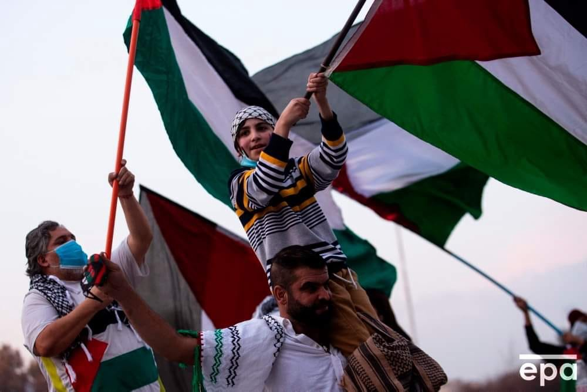
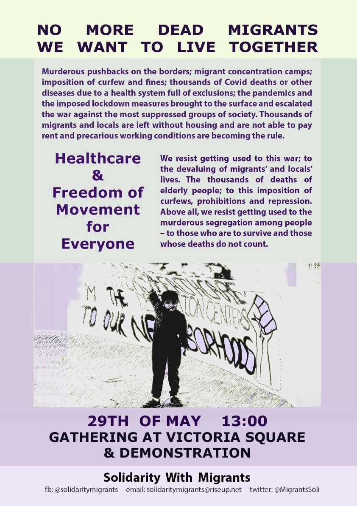

### AYS Weekend Digest 15–16/05/21: Josoor and Stop the Wall Statement on context of Gaza conflict

Arrivals on Samos and Lesvos//172 people rescued in Med//Two boats currently in distress//Antiracist demos and meetings in Greece and Italy//Updates from France and more…

 \)](assets/8871b0a489e9/1*r1b9yCYyL8_KdmP28j9PoQ.jpeg)

\(Photo Credit: [Mohammed Saber via Art Against](https://www.facebook.com/artagainstproject/photos/a.704384742944296/3950948281621243/) \)
#### FEATURED: Josoor and Stop the Wall Statement on context of Gaza conflict

■■■■■■■■■■■■■■ 
> **[Josoor](https://twitter.com/JosoorNet) @ Twitter Says:** 

> > Prior to the current escalation of violence in #Israel and #Palestine, we have joined a statement by Stop the Wall regarding the use of drones in #EU border militarisation relating to Israel. This statement was always meant to be released today, on #Nakba73  (1/4) https://t.co/n1ukgq9esS 

> **Tweeted at [2021-05-15 18:37:08](https://twitter.com/josoornet/status/1393636583690186762).** 

■■■■■■■■■■■■■■ 

As concerns continue about the situation in Palestine and Israel, Josoor and Stop the Wall have released a joint statement scheduled for the 73rd anniversary of Nakba looking at the complex history of the current conflict\.

> The recent court ruling and plan to forcibly evict over 2,000 Palestinians from their homes in the neighbourhoods of Sheikh Jarrah and Al\-Bustan is currently being portrayed as the reason for the most significant escalation of violence between Palestinians and Israelis of the past decade\. Given the background to these events, relating to the past eviction of Jewish inhabitants under Jordanian occupation, there is a lot of room for discussion — as with so much in this longstanding, highly complex issue\. But whether this specific court ruling is considered justified or not, it is part of a broader pattern of oppression, violence, and settler colonialism which has been in place since 1948\. 

\{…\}

> The responsibility for this sad fact does not only lie with Israel and Hamas\. The Israeli\- Palestinian history and current state of affairs are both intertwined with British colonisation, European and Arab antisemitism, racism, nationalism, capitalism, regional wars and conflicts, the interests of various global players and much more\. 

Read the full statement [HERE](https://www.josoor.net/post/73-years-of-the-nakba?fbclid=IwAR0Q84zXydsR8RoeLFSN3dYGq4mv6d_3Ku0-oCC_LihDwH52LfNzabjIZCQ) \.

At the same time, protests took place throughout the world in support of the people of Palestine\.

 \)](assets/8871b0a489e9/1*rHWPVxDZ6cFkYrahxGy2lA.jpeg)

\(From left to right\. Athens, photo credit: Chrysoula Patsou\. Chile, photo credit: Alberto Valdes\. London, photo credit: Guy Smallman\. All via [Art Against](https://www.facebook.com/artagainstproject) \)

For some, the current violence will force them to leave and risk their lives to seek safety abroad as it has so many times in the past:

■■■■■■■■■■■■■■ 
> **[Itamar Mann](https://twitter.com/itamann) @ Twitter Says:** 

> > The attack on Gaza will displace many Palestinians, sending them on horrific journeys seeking asylum. Many will have suffered bombings against the backdrop of extreme poverty and oppression. Governments should grant them intl protection, but also help make their return possible. 

> **Tweeted at [2021-05-16 11:42:41](https://twitter.com/itamann/status/1393894670481170433).** 

■■■■■■■■■■■■■■ 

#### ARRIVALS

 \)](assets/8871b0a489e9/1*OmyncYB8io4yPYjt3Q4YLQ.jpeg)

\(Photo credit: via [ABR](https://www.facebook.com/AegeanBoatReport/posts/1085033892019714) \)

Aegean Boat Report state that approximately 27 people arrived on Sunday at Samos\. Another boat landed on Lesvos, numbers unknown\.
#### SEA
#### SEA\-EYE 4 rescues 172 people in two rescues within one day\!

> The two wooden boats were discovered simultaneously by the bridge\. All people were brought aboard SEA\-EYE 4 and medically examined\. Two people had to be stabilized in the infirmary for a longer time\. Among those rescued are many children, an eight\-month young baby and a pregnant woman\. A third rescue is imminent\. The emergency came to the attention of the crew because a Frontex aircraft circled not far from the SEA\-EYE 4, but without directly informing Sea\-Eye about the boat in distress\. 

 \)](assets/8871b0a489e9/0*upA9M3a-xM9va2BO)

\(Photo Credit: [Sea Eye](https://www.facebook.com/seaeyeorg/posts/3600228416749696) \)

 \)](assets/8871b0a489e9/0*MG6N86TIUTePRaqK)

\(Photo Credit: [Sea Eye](https://www.facebook.com/seaeyeorg/posts/3600228416749696) \)

**Two Boats Currently in Distress**

One boat [carrying 85 people](https://twitter.com/alarm_phone/status/1393963578886172675?fbclid=IwAR2rWjci41ddXbakjHxMXrJFFF1sC6trQDbV_qBS14qyUmUu0HxFzl15UYU) is in the Italian SAR zone\. Another [carrying 100 people](https://twitter.com/alarm_phone/status/1393959575884283905?fbclid=IwAR2tltv9Cu_9U_ZQzlSQ7mt7BbrYcXnsD4ffhfqRRs2W6I_88ZC9mxLQyCQ) is in distress off the coast of Libya\. In both cases Alarm Phone has reached out to authorities to inform them of the situation and received no response\.

**Eleven people were in distress off Morocco**

[Alarm Phone reports](https://twitter.com/alarm_phone/status/1393898733734072320?fbclid=IwAR2CEl1qTYlIvIEZ6dDYBqaPurae2X6ppHRBCYPQ4n5Rk-U45OB-woLq-eU) that 11 people spent a night at sea without an engine or oars before finally being picked up by the Moroccan Navy\.

**Two hundred people arrived to UK**

On Thursday [200 people crossed](https://www.dailymail.co.uk/news/article-9579785/Nearly-200-migrants-crossed-Channel-yesterday.html?fbclid=IwAR2eJRjuin1XHtEI2xj5RKczY6hLRPwwCgt5CmPmoESMUaC8TisQcRJBiGw) the channel using small boats\. Luckily everyone arrived safely\. An analysis by Free Movement of the legal framework for asylum seekers who cross borders and the overturning of the conviction of an Iranian man who steered a boat can be read [HERE](https://www.freemovement.org.uk/hand-on-the-tiller-prosecution-for-assisting-unlawful-immigration-fails/?fbclid=IwAR0w8DYtwUwpGOAWt2nJ0yNFtzi21qP9AP3AEEN6aJJ7svKFfXvaM2TpPWU) \.
#### GREECE

**Demo Called for 29 May**

There will also be a series of [antiracist meetings](https://www.facebook.com/solidaritymigrants/posts/306677474288122) :

Monday, 17 May, 6:00 pm: Anti\-racist gathering with sound system in Victoria Square\.

Wednesday, 19 May, 6:30 pm: Open assembly at the social center Zizania \(Filis and Ferron\) to organise an anti\-racist demonstration on 29 May, 1:00 pm, starting from Victoria Square\.

Friday, 21 May, 6:00 pm: Anti\-racist gathering with sound system in Agios Panteleimon square\.
#### ITALY

**Demonstration at Italian/French border**

A protest walk — [Let’s cross the border](https://hurriya.noblogs.org/post/2021/05/16/alta-val-di-susa-camminata-resistente-frontiera/?fbclid=IwAR0Q84zXydsR8RoeLFSN3dYGq4mv6d_3Ku0-oCC_LihDwH52LfNzabjIZCQ) — took place on Sunday\.

> The procession then climbed onto the main road, blocking it, once again underlining how this road is inaccessible to a few people selected by the states but is crossed every day by hundreds of merchandise trucks\. 

> Aware that the forests are the place where the violence of the border is perpetrated, we took back the paths\. 

**Four ships being rented by Italian government for ‘Healthcare and Surveillance’**

[The Ministry of Infrastructure and Sustainable Mobility](https://www.interno.gov.it/it/notizie/avviso-pubblico-noleggio-4-navi-assistenza-e-sorveglianza-sanitaria-migranti?fbclid=IwAR3cHoF_n6thnucUEgMSjmxxZPDUqHRZVna3NZGNlBVwaW6bovD-QELXslY) will use four more ships for quarantine at sea for both sea and land arrivals\.
#### FRANCE

**Petition for Alassane**

A young man of 25 has been threatened with having his residence permit removed despite being well integrated and having a job in France\. Sign the petition [HERE](https://www.change.org/p/le-pr%C3%A9fet-du-pas-de-calais-soutenons-alassane-jeune-guin%C3%A9en?recruiter=711070238&utm_medium=twitter&utm_term=address_book&recruited_by_id=aaaae3a0-25f9-11e7-8a4c-5b964fb73f52&share_bandit_exp=message-28838065-fr-FR&fbclid=IwAR2_dl5MrZaT5rfm_QLTZbt0ehkWWcZaqQhZVyH3rh7WGtDBs4Ba3pQvOj4) \.

**Destruction of natural spaces in Calais**

[Auberge des Migrants](https://twitter.com/AubergeMigrants) report that the destruction of natural spaces in Calais and Coquelles continues\.

> The aim is to prevent [\#exilés](https://twitter.com/hashtag/exil%C3%A9s?src=hashtag_click) to take shelter and protect themselves\. Several hectares were bulldozed\. 

#### WORTH LISTENING

[Episode 5 in the Civil Fleet Podcast](https://open.spotify.com/episode/4dN5VStr7dv0XfCBU9Hy7N?si=Has793-qQCmG9bWxc6gIPQ&nd=1&fbclid=IwAR3DaictLPCVCe9JBWCBS2sq8XACZfcYrwFxT-FN9MLY02UL-cpi66RrhKE) : “IN TODAY’S episode, we speak with Alarm Phone activist Deanna\. She talks to us about the refugee shipwreck in the Mediterranean last month that took the lives of 130 people\. Though the disaster may look like a catastrophic dereliction of duty, Deanna tells us that the authorities behaved exactly as the European border regime wants them to\. Deanna tells us why the Maritime Rescue Coordination Centres in Italy, Malta and Libya should be replaced by civil\-society organisations, and in fact how they already have been\. And we also speak about why Alarm Phone advocates for the removal of all borders and for the abolition of itself\.”
#### WORTH READING

[Between Moving and Mourning — the struggle along the routes to Spain continues](https://alarmphone.org/en/2021/04/30/between-moving-and-mourning-the-struggle-along-the-routes-to-spain-continues/?post_type_release_type=post&fbclid=IwAR3GKb9tWuQX_ys0YLDK-YNj2yf19dRL5YSKUMOxkAVZCMnIQPGZQBW4IUo) : Alarm Phone: Western Mediterranean and Atlantic Route Regional Analysis, 1 January — 31 March 2021

[The Glasgow immigration raid was arbitrary as are all such raids](https://www.freemovement.org.uk/the-glasgow-immigration-raid-was-arbitrary-as-are-all-such-raids/?utm_medium=rss&fbclid=IwAR2oVJzM4aABh8d5bFFIcypcLFYST-Tn8WLcQfF1_Wikuuun87WOJnfcdQA) — “Detention should be viewed as a traumatic experience in and of itself\.” By Free Movement\.
#### WORTH ATTENDING

19 May — [EU Strategy on Voluntary Return and Reintegration: Switching Perspectives?](https://www.migrationpolicy.org/events/eu-strategy-voluntary-return-and-reintegration?fbclid=IwAR0DSVkwvmcEkyjKJ-emHCaYuSmwYAYiYb-q3t8AKDMXYqHXuZJ-cXPi_v0) “Join MPI Europe for a release event examining origin\- and destination\-country policy priorities, opportunities for cooperation, challenges and structural limitations that shape what can be achieved, and possible next steps for building on the principles identified in the EU Strategy on Voluntary Return and Reintegration…”

**Find daily updates and special reports on our [Medium page](https://medium.com/are-you-syrious) \.**

**If you wish to contribute, either by writing a report or a story, or by joining the info gathering team, please let us know\.**

**We strive to echo correct news from the ground through collaboration and fairness\. Every effort has been made to credit organisations and individuals with regard to the supply of information, video, and photo material \(in cases where the source wanted to be accredited\) \. Please notify us regarding corrections\.**

**If there’s anything you want to share or comment, contact us through Facebook, Twitter or write to: areyousyrious@gmail\.com**

_Converted [Medium Post](https://medium.com/are-you-syrious/ays-weekend-digest-15-16-05-21-josoor-and-stop-the-wall-statement-on-context-of-gaza-conflict-8871b0a489e9) by [ZMediumToMarkdown](https://github.com/ZhgChgLi/ZMediumToMarkdown)._
