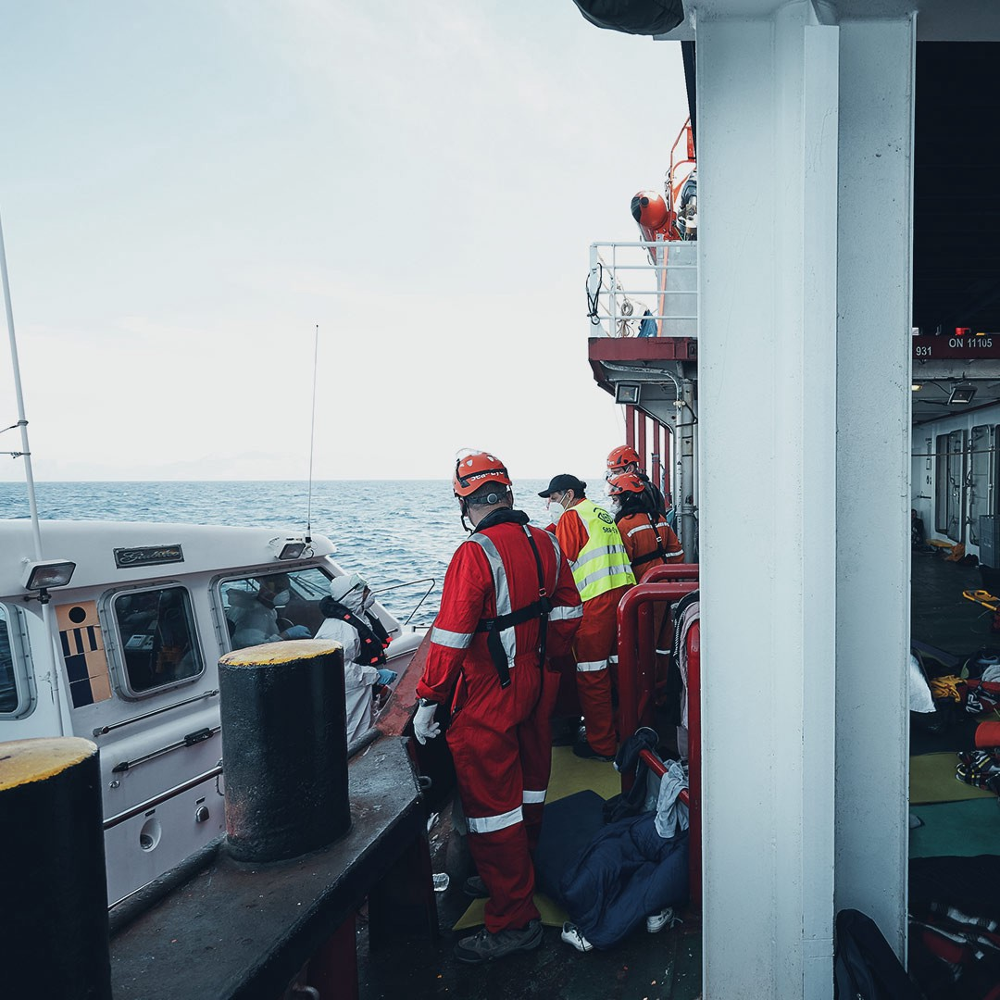

### AYS Daily Digest 19/05/21 — 8,000 people used as ping pong balls between Spain and Morocco

_Malta paid for “3–4” pushbacks // UNHCR warns of “externalizing borders” // Evictions in France // Romanian police brutality // and more…_

](assets/2f49a3a23828/0*q-1LOKVqzpm1gTtC.jpg)

Spainish soliders in Ceuta\. Photo by [EPA](https://www.bbc.com/news/world-europe-57168701)
### FEATURE: 8,000 people used as ping pong balls between Spain and Morocco

The 8,000 people who entered Ceuta on Monday night and Tuesday morning are not part of an “invasion” as many media outlets and politicians have called it\. Their arrival signifies the ongoing political and humanitarian crisis resulting from Spain and Morocco’s policy ping pong game\.

What exactly happened? El Pais reports:

> “On Sunday night, rumors broke out in Morocco about the laxity of the Moroccan security forces on the coast; During the early hours of Monday, hundreds of people approached the breakwaters that separate them from the autonomous city to skirt them by swimming or on foot\. The gendarmerie, indeed, showed an ‘unusual passivity,’ according to sources from the Spanish security forces\. By Tuesday afternoon there were already 8,000 immigrants in the autonomous city, the majority Moroccans, but also some sub\-Saharan Africans\. Dozens continued to enter during the day\. Most are young men, but there are entire families and at least 1,500 minors, some very young, according to sources from the Government of Ceuta\.” 

The Interior Ministry reports that [half of the 8,000 people](https://elpais.com/espana/2021-05-19/que-esta-pasando-en-ceuta-claves-de-la-crisis-entre-espana-y-marruecos.html?fbclid=IwAR34XVAJKEblEspnqZcOqaYs3PF2ID-wWumRgv6nMVf3jwPge_U2JGMk6RY) have already been returned to Morocco\. Journalist [Steffen Lüdke](https://twitter.com/stluedke/status/1394961731324162048) reported that by Wednesday afternoon:

> “The Spanish police are shooting tear gas, in the morning around 200 more migrants swam up, now it looks as if the Moroccans are doing some control again\. 

> Since yesterday evening, some teenagers and young men have been returning disaffected and largely voluntarily\. According to the latest information, of the 8,000 people who had arrived, Spain pushed back 4800 directly, and minors should not be forced to return\.” 

[Amnesty International](https://www.amnesty.org/en/latest/news/2021/05/spainmorocco-people-being-used-as-pawns-as-political-games-turn-violent/?fbclid=IwAR2a0OJSu9SIWijWno_afeCi2fUJh_SclOT-Ic_RixTKf7d1yq3Vq_gQsCg) sent out a press release on Wednesday exclaiming:

> “People, including children have been subjected to violence by Spanish security forces and the army, including being thrown into the sea, after Morocco opened its borders, said Amnesty International today\. 

> The organisation says that asylum\-seekers and migrants are being used as pawns in a political game between Morocco and Spain, after more than 8,000 people, including about 2,000 unaccompanied children, entered Ceuta from Morocco irregularly before being subjected to collective expulsions\. 

> ‘We cannot accept that people, including children, are being beaten by Spanish forces\. While border officials did provide emergency assistance to people, abuses cannot be tolerated\. Spanish authorities must open a thorough investigation and ensure accountability,’ said Virginia Álvarez, Head of Internal Policy and researcher at Amnesty International Spain\.” 

> “European leaders were quick to support Spain and say that Spanish borders are EU borders\. By the same logic, Spanish abuses are also EU abuses\. We call on EU leaders to not turn a blind eye to the abuses happening at EU borders\.” \-Álvarez 

[Association Marocaine des Droits Humains — Section Nador](https://www.facebook.com/AmdhNador/posts/2928218374057085) elaborates upon the “game” between the Spainish and Moroccan authorities:

> “The most serious violations are also perpetrated by the Spanish authorities of Melilla And Ceuta who have hotly repressed all sub\-Saharan migrants who have been able to access Ceuta and Melilla without allowing them to apply for asylum\.
 

> Very simple to understand the game of Moroccan and Spanish authorities:
 

>  — Morocco opens the valves in Ceuta and Melilla for the entry of migrants\.
 

>  — Spain arrests migrants and represses them hot and mass without studying cases one by one\.
 

>  — Morocco receives hot\-repressed migrants and releases them\.
 

> Thus the cycle is closed\. A cycle comparable to a ping pong game where the migrant and asylum seeker is perfectly instrumentalized\. Respect the rights of migrants and asylum seekers\.” 

AYS stands in solidarity with everyone fleeing to Ceuta and anyone trying to protect their human rights right now\. Check out the post below for more devastating video evidence\.

■■■■■■■■■■■■■■ 
> **[El HuffPost](https://twitter.com/ElHuffPost) @ Twitter Says:** 

> > Cinco vídeos que deberían ver quienes llaman "invasión" a esta crisis humanitaria [huffingtonpost.es/entry/cuatro-v…](https://www.huffingtonpost.es/entry/cuatro-videos-que-deberian-ver-quienes-dicen-que-esto-es-una-invasion-y-no-una-crisis-humanitaria_es_60a413bee4b0daf2b5a75aaa) 

> **Tweeted at [2021-05-19 00:35:53](https://twitter.com/elhuffpost/status/1394814027096895492).** 

■■■■■■■■■■■■■■ 

#### SEA

 **and photos from Sea Watch 4:** “A young man had to be evacuated from the SEA\-EYE 4 for medical reasons\! The young man had to be evacuated due to a heart condition that got worse\. He could have collapsed at any moment and needs intensive medical treatment, which cannot be provided on board\. The Italian Coast Guard carried out the evacuation in the afternoon\. Meanwhile, the SEA\-EYE 4 has reached Sicily, but still has not been assigned a port of safety\. There are more medical cases on board that need to be treated ashore\. To avoid more evacuations, we finally need a port of safety\!”
[**Update \#2**](https://www.facebook.com/seawatchprojekt/posts/2827031054181624) **from Sea Watch 4:** “14 days after the last of the more than 450 rescued people could leave our ship, the Sea\-Watch 4 returns to the port of Trapani after an imposed quarantine\. When we can start the next rescue mission? Uncertain\. Because the criminalization of civil rescue goes on\.
If we will continue? By all means\. Until no human being has to drown in search of safety\.”](assets/2f49a3a23828/1*bLjJQZIB2oPIJdrsYllWVQ.jpeg)

[**Update \#1**](https://www.facebook.com/NewsfromtheMed/posts/1217247152062212) **and photos from Sea Watch 4:** “A young man had to be evacuated from the SEA\-EYE 4 for medical reasons\! The young man had to be evacuated due to a heart condition that got worse\. He could have collapsed at any moment and needs intensive medical treatment, which cannot be provided on board\. The Italian Coast Guard carried out the evacuation in the afternoon\. Meanwhile, the SEA\-EYE 4 has reached Sicily, but still has not been assigned a port of safety\. There are more medical cases on board that need to be treated ashore\. To avoid more evacuations, we finally need a port of safety\!”
[**Update \#2**](https://www.facebook.com/seawatchprojekt/posts/2827031054181624) **from Sea Watch 4:** “14 days after the last of the more than 450 rescued people could leave our ship, the Sea\-Watch 4 returns to the port of Trapani after an imposed quarantine\. When we can start the next rescue mission? Uncertain\. Because the criminalization of civil rescue goes on\.
If we will continue? By all means\. Until no human being has to drown in search of safety\.”
#### GREECE

Art via @yorgovich
#### MALTA
### Reports the Government paid for pushbacks “3–4” times

Malta Today reports that **Carmelo Grech** , “the owner of the Libyan\-flagged fishing vessel Dar Es Salaam 1,” told Mr Justice Lawrence Mintoff in court on Wednesday afternoon that Malta paid for 3–4 pushbacks\.

> “\(This is\) the case against Prime Minister Robert Abela, National Security and Law Enforcement Minister Byron Camilleri and AFM Brigadier Jeffrey Curmi, filed by lawyers Paul Borg Olivier and Eve Borg Costanzi on behalf of 52 would\-be asylum seekers who had been pushed back to Libya in the Spring of 2020\. 

> Grech said that at the time, his boat had been in the Grand Harbour for between four and six weeks when he was approached by an AFM representative, whose name he didn’t know\. The AFM gave him a set of coordinates of a dinghy, but the dinghy wasn’t found at first, he said\. ‘We were closer to Lampedusa than Malta,’ he recalled\. 

> There were strong seas, and five people had died on board the dinghy\. When he was informed, he relayed this fact to the AFM, who ordered that his crew bring on board the live ones first and then the dead\. Although he resisted the order, the dead were eventually lifted onto the fishing boat\. Grech made it clear to the court that he was not on board at any time\. The vessel’s captain would speak to him, and he would speak to the AFM, he said\. 

> After taking the bodies on board, the crew were instructed to sail to Tripoli and transfer them onto a Libyan patrol boat\. ‘There were heavy seas, and the \[rescued\] people on board mutinied, but the Libyans helped quell the uprising,’ Grech said\.” 

> “Lawyer Paul Borg Olivier asked Grech how many times he had carried out this type of operation\. ‘We were asked to do this by the AFM around 3 or 4 times,’ he said\. ‘We weren’t paid charter fees\. AFM paid for fuel\. At first, we would give them our food, but when Captain Morgan \[offshore detention centres\] started, sea\-launches with food would be dispatched to them…’” 

Read [the full report here](https://www.maltatoday.com.mt/news/national/109738/malta_government_paid_for_libya_pushbacks_three_to_four_times_shipper_reveals?fbclid=IwAR2YlGQpAxDV3Y88HVkI7KSiFpAL636LKICEJ_5YWwwQWuJPtlq54VMvXq0#.YKZp9KhKg2x) \.
#### BOSNIA AND HERZEGOVINA
### Emergency in Bihac

[No Name Kitchen](https://www.facebook.com/NoNameKitchenBelgrade/posts/1240588593006089) reports:

> →“As we published yesterday, more than 200 people got evicted by the SFA \(Service of Foreign Affairs\) yesterday from a big Squat localted in the city\. People was sent to Lipa Camp, also managed by SFA\. Many told us that they were rejected by the security at the dorr for lack of space\.
 

>  →We estimate that at least 150 returned to Bihać through the day walking\. So we did distributions of snack bags to dozens of people\. At the same time we have been receiving since then many more message than usual on our messenger\. As you can see, people were left with nothing\. 
 

>  →The squat was cleaned after the eviction and many people had no chance to take their food, backpacks, clothes, blankets and other belongings\. Even lots of food was thrown away\! \! \!
 

>  →We were warned by local groups that are also helping here to the people on the move that more evictions will happen in Bihać this week, especially in the city center\. 
 

>  →With this fear, many people that came back to the city from Lipa Camp \(more than 20 kilometres\) went to the jungle areas south of Bihać\. So we distributed a lot of tents, mattresses, tarps etc\. \. The forest is humid and not so convenient to live in\. Yesterday it rained\. 
 

>  →We combined efforts with another group yesterday and packed a lot of food and got food boxes from a Pakistani restaurant as well\. In total, we could prepare bags for 750 people\. As well, pakistani meals for 400 people were distributed\. Everything was distributed all day long until very late night\. 
 

>  →Appart from the people evicted, we estimate that there might be around 1,500 people in general living in this north part of Bosnia and Herzegovina out of camps and relying on this support that independent organizations can bring\. 
 

>  →This time we especially want to thanks Lorena Fornasir and Gian Andrea Franchi and their group of support; and also OpetBosna\. Their last donation was very helpful to keep the activities and face these new emergencies, that mean more needs, more food to buy, and more expenses for us\.
 

>  →Please, help us to help: [https://donorbox\.org/emergency\-in\-northern\-bosnia](https://donorbox.org/emergency-in-northern-bosnia) 
 

>  →Information: Angelo Brahms” 

#### SERBIA

 :** “APC/CZA psychosocial mobile team visiting open location along the border with Bosnia in Loznica city where refugees sleep in the open, found many unaccompanied minors sleeping in the open without any food, water or shelter\. APC/CZA have a cooperation with local centers for social welfare and contact with social workers in the field to report and assist many of the unaccompanied minors so they can be protected and accommodated in one of reception centers and to assign for them guardian who will be responsible about them and with the help of APC/CZA legal sector they can access the asylum system and seek asylum and have free access to education and health institution\.”](assets/2f49a3a23828/0*T6JnSl8fyhR0qRMX)

**Update \#1 and photo from [Azil u Srbiji Asylum Protection](https://www.facebook.com/AzilUSrbiji/posts/1909168192576347) :** “APC/CZA psychosocial mobile team visiting open location along the border with Bosnia in Loznica city where refugees sleep in the open, found many unaccompanied minors sleeping in the open without any food, water or shelter\. APC/CZA have a cooperation with local centers for social welfare and contact with social workers in the field to report and assist many of the unaccompanied minors so they can be protected and accommodated in one of reception centers and to assign for them guardian who will be responsible about them and with the help of APC/CZA legal sector they can access the asylum system and seek asylum and have free access to education and health institution\.”

**Update \#2 from Azil u Srbiji Asylum Protection** : “ _Romanian police continue to seize phones and money intensively, but also use excessive use of physical force, most often by beating them with batons\. Hamid from Morocco received several blows with a truncheon on his left leg, while lying on the ground, as he described\. He still uses a crutch when walking\._ ” See pictures of injuries [here](https://twitter.com/APC_CZA/status/1395051988124061696) \.
#### SWITZERLAND
### Swiss government will take in up to 1,600 refugees over 2 years

[Swiss Info](https://www.swissinfo.ch/eng/switzerland-to-take-in-up-to-1-600-refugees/46630850?fbclid=IwAR0NJs_SJkq_vwANOTrk98XXHpzKOE-umftpF4Fsdy0e8J3Xhom_qaU_L5o) reports:

> “The government has decided to welcome up to 1,600 refugees over two years as part of an international resettlement programme\. This figure for 2022/2023 is unchanged from the quota for the current period\. However, the government said it will take in up to 300 additional refugees who could not be included in a previous programme due to the Covid\-19 pandemic\. 

> Switzerland will focus on victims of ongoing military conflicts in the Middle East and from the central Mediterranean region, as well as people fleeing persecution\. For practical reasons, the Swiss programme will be limited to refugees from a maximum of five countries, the State Secretariat for Migration said on Wednesday\. 

> The secretariat added that Switzerland’s participation in the resettlement programme under the auspices of the United Nations High Commissioner for Refugees has been an integral part of the country’s refugee policy for several decades\. The Swiss section of the United Nations refugee agency \(UNHCR\) has welcomed the latest government decision\. However, it called on Switzerland to increase its contingent in the near future given the demand for more resettlement places worldwide and the limited asylum requests in Switzerland\.” 

#### FRANCE

 :** “Operations & Expulsions to GrandeSynthe → 4 excursions from informal living spaces in April\. 444 tents and tarpaulins \(were\) seized\. Forced expulsions participate in the exhaustion, physical and moral harassment that exiles are subjected to at the border\.”](assets/2f49a3a23828/1*i0AKZOJoM16-pauGanUcFw.jpeg)

**Update and photos from [Human Rights Observers](https://twitter.com/HumanRightsObs/status/1395105949099175939) :** “Operations & Expulsions to GrandeSynthe → 4 excursions from informal living spaces in April\. 444 tents and tarpaulins \(were\) seized\. Forced expulsions participate in the exhaustion, physical and moral harassment that exiles are subjected to at the border\.”

■■■■■■■■■■■■■■ 
> **[Human Rights Observers](https://twitter.com/HumanRightsObs) @ Twitter Says:** 

> > A nouveau, à @[VilleGdeSynthe](https://twitter.com/VilleGdeSynthe)  lors d’une opération d’#expulsion de grande ampleur, l'équipe de nettoyage mandatée par l’Etat @[Groupe_Ramery](https://twitter.com/Groupe_Ramery)  lacère les #tentes alors que des personnes sont encore à l’intérieur. L’indifférence des #FDO face à une telle violence est préoccupante. https://t.co/YdDaFkAsLV 

> **Tweeted at [2021-05-19 08:12:29](https://twitter.com/humanrightsobs/status/1394928937302740993).** 

■■■■■■■■■■■■■■ 

#### BELGIUM
### 49 refugees rescued off coast

[The Brussel Times](https://www.brusselstimes.com/news/belgium-all-news/170071/ostend-marc-vanden-bussche-nieuwpoort-forty-nine-refugees-rescued-off-the-belgian-coast-oostduinkerke-koksijde/?fbclid=IwAR1aFgbvFat7fYh3ahz3HCLMSkwJC6LlDC4W2vjI_EvaBOUJOEaJZFcEo2w) reports:

> “A boat with 49 refugees on board got into trouble off the western coast of Belgium near Oostduinkerke on Wednesday morning, said Koksijde mayor Marc Vanden Bussche \(Open Vld\), who indicated this was a recurring problem\. 

> ‘We work together with our French colleagues to intercept people who try to make the crossing to England, which happens every day when they leave France\. Such situations are, of course, very dangerous\.’ 

> The maritime police, who had spotted the boat on Wednesday morning, intercepted the refugees and took them to Nieuwpoort\. Some of them were experiencing hypothermia\.” 

#### DENMARK

](assets/2f49a3a23828/0*fV0I8jm85JotuRLA)

“Over 27 thousand protesters in Copenhagen
Demonstrations in 25 Danish cities today solidified with Syrians
Lifting hearts that made the scene so touching
With an open sit\-in front of the Danish parliament
The sit\-in will not be dismissed until the Danish government cancels the decision to recognize a safe Syria and the decision to deport Syrians
Today was a big love day for Syrians ❤️”
Photo and Info by [Mohamad Sourity](https://www.facebook.com/Mohamad.Souriti/posts/10218306483349173)
#### GENERAL
### UNHCR warns against “externalizing” asylum processes

In a press release on Wednesday, UNHCR made very clear that off shore asylum processes “jeopardize safety\.”

> “Amid considerations by some governments to send asylum seekers abroad for processing, UNHCR, the UN Refugee Agency, is urging states not to externalize their asylum and protection obligations\. UNHCR warns that such practices jeopardize the safety of those in need of international protection\. 

> ‘UNHCR remains firmly opposed to externalization initiatives that forcibly transfer asylum seekers to other countries\. Externalization simply shifts asylum responsibilities elsewhere and evades international obligations\. Such practices undermine the rights of those seeking safety and protection, demonize and punish them and may put their lives at risk,’ said UNHCR’s Assistant High Commissioner for Protection, Gillian Triggs\. 

> ‘It is ironic that, as we celebrate the 70th anniversary of the Refugee Convention, attempts are being made to weaken its principles and spirit\. Instead, the priority must be to find more effective ways to guarantee the universal right to seek asylum and other rights provided by international refugee law\.’ 

> Externalization attempts typically involve the forced transfers of asylum seekers to third, often developing, nations where human rights safeguards and resources may not be adequate\. This may lead to their indefinite ‘warehousing’ in isolated places or in punitive conditions, at great harm to their physical and mental health\.” 

Read full press release [here](https://www.unhcr.org/news/press/2021/5/60a2751813/unhcr-warns-against-exporting-asylum-calls-responsibility-sharing-refugees.html?fbclid=IwAR0jOMfz2IuyFB6ndgmgdFAav6Ncx3kCTBIEHGS__KLVJ8pmVVf_WiESedk) \.
#### WORTH READING
- Info Migrants’ [**Reza Jafari, refugee turned politician: ‘If you want things to change, you have to get involved’**](https://www.infomigrants.net/en/post/32315/reza-jafari-refugee-turned-politician-if-you-want-things-to-change-you-have-to-get-involved?fbclid=IwAR1YTlgytAuhmHYMPpxU9b7DY75kd7m2b2Zkyk2Bibsfw0kj-c5nvpXV1Ng)
- Info Migrants’ [**‘Disheartening picture’ for unaccompanied minors in Samos**](https://www.infomigrants.net/en/post/32335/disheartening-picture-for-unaccompanied-minors-in-samos?fbclid=IwAR0NJs_SJkq_vwANOTrk98XXHpzKOE-umftpF4Fsdy0e8J3Xhom_qaU_L5o)

**Find daily updates and special reports on our [Medium page](https://medium.com/are-you-syrious) \.**

**If you wish to contribute, either by writing a report or a story, or by joining the info gathering team, please let us know\.**

**We strive to echo correct news from the ground through collaboration and fairness\. Every effort has been made to credit organisations and individuals with regard to the supply of information, video, and photo material \(in cases where the source wanted to be accredited\) \. Please notify us regarding corrections\.**

**If there’s anything you want to share or comment, contact us through Facebook, Twitter or write to: areyousyrious@gmail\.com**

_Converted [Medium Post](https://medium.com/are-you-syrious/ays-daily-digest-19-05-21-8-000-people-used-as-ping-pong-balls-between-spain-and-morocco-2f49a3a23828) by [ZMediumToMarkdown](https://github.com/ZhgChgLi/ZMediumToMarkdown)._
