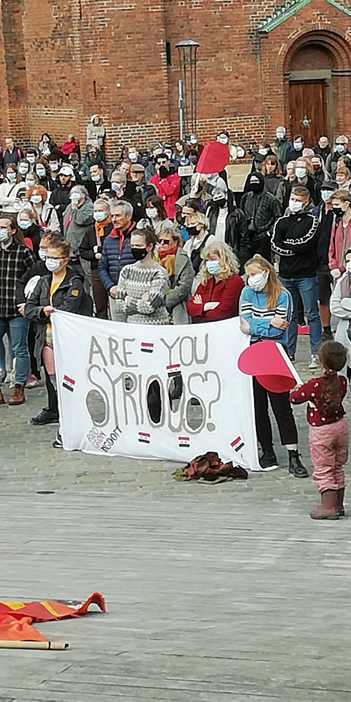

### AYS Daily Digest 20/05/2021: Progress Made on Human Rights in EU Migration Deals
#### Updates from Ceuta, Canaries and Aegean Islands // Sea\-Eye 4 assigned a port // Clinic for torture victims opened in Italy // Solidarity protests in Denmark

EU Parliament\. \(Photo: [Flickr](https://www.google.com/url?sa=i&url=https%3A%2F%2Fwww.flickr.com%2Fphotos%2Fdoommeer%2F463366699&psig=AOvVaw1CoMWNWauA1FgV6gd_YsNJ&ust=1621679048747000&source=images&cd=vfe&ved=0CAIQjRxqFwoTCLCVr7HH2vACFQAAAAAdAAAAABAK) \)
### FEATURE — Report on human rights in migration meets with success in EU parliament

This week the Spanish enclave of Ceuta made headlines when some 8,000 people crossed into the territory from Morocco in 48 hours\. As we reported in [yesterday’s digest](ays-daily-digest-19-05-21-8-000-people-used-as-ping-pong-balls-between-spain-and-morocco-eebc26585a56) , more than half of those people have already been returned to Morocco — summarily pushed back and denied the right to apply for asylum in the EU\.

In an ironic coincidence, the dramatic events in Ceuta coincide with a rare migration\-related success story — or at least, the seeds of one — in the hallowed halls of the EU Parliament: MEPs endorsed a report calling for stronger protection of human rights in EU migration deals with third countries\.

Tineke Strik, a Dutch MEP for the Greens and the author of the report, celebrated the news on Twitter:

The report says the EU’s migration agreements must meet the following conditions:

> _An independent and transparent monitoring system that oversees the protection of human rights;_ 

> _Exclusive cooperation with countries that respect the rights of refugees;_ 

> _A stronger role for the European Parliament to supervise the funds and agreements with non\-EU countries on migration;_ 

> _Improved access to justice for migrants and refugees in case of human rights violations, to hold countries directly accountable\._ 

“Co\-operation with third countries does not absolve the EU of meeting its human rights obligations towards migrants and refugees\. These obligations must be fulfilled through better monitoring, more transparency on the use of EU funds and enhanced democratic oversight from the European Parliament,” Strik told [media](https://www.schengenvisainfo.com/news/meps-urge-for-better-protection-of-migrants-from-human-rights-violations/) \.

The report notes that since 2016, the EU and some individual member states have made “informal agreements and arrangements” with third countries in an effort to “strengthen their operational capacities in border control and management, and the fight against human trafficking” and “effective return and readmission with third countries”\. Eleven such informal agreements have been made over the past five years, “but only one new readmission agreement\.” The report cautions that such informal agreements “do not provide a predictable policy or any stable and coherent statutory framework provisions on irregular migration\.”

The report also “\[n\]otes with great concern the absence of operational, reporting, monitoring, evaluation and accountability mechanisms for individual cases which track and respond to potential violations, as well as the lack of effective judicial remedies for persons whose rights are allegedly violated as a consequence of informal EU agreements and financial cooperation\.”

The full report can be accessed [here](https://www.europarl.europa.eu/doceo/document/A-9-2021-0060_EN.html?fbclid=IwAR3-ffVjpxGOq9s5OAX_WB95THa1OHQFDhybtpFYMZZzdbQIFfaj5MXatFs) \.
### SPAIN
### Ceuta updates

Moroccan officials may have tightened control over the border, but the people who crossed into Ceuta in the recent days still feel the sharp edge of the diplomatic spat between Spain and Morocco\.

Minors are being marked as they access facilities for those recently arrived in the enclave, according to a volunteer from No Name Kitchen, which is operating in the area\.

[It is estimated](https://twitter.com/NFerdaoussi/status/1395088624501276679) some 5,800 of the 8,000 arrivals have already been returned to Morocco\. Lena Karamanidou, a research fellow at Glasgow Caledonian University, noted on [Twitter](https://twitter.com/lk2015r/status/1395302825727496192) that the seeds of Spain’s summary expulsions have already born fruit in the Aegean, where Greece, with the backing of the EU and the complicity of Frontex, its border agency, has long carried out pushbacks of people\-on\-the\-move\. “Very clear that both EU institutions & European states endorse pushbacks as a technology to prevent movement”, she wrote\.

The Spanish members of Migreurop, a network of activists and scholars focusing on migration issues, spoke out about the situation in Ceuta and demanded “a radical change in Spanish and EU migration policies to allow safe and regular pathways and by focusing on rights”, according to [media](https://www.statewatch.org/news/2021/may/spain-a-human-rights-based-approach-must-be-taken-in-ceuta-say-spanish-members-of-migreurop/?fbclid=IwAR1QRQYkSbir0ryUW-BavkWI44C7wRCwJMlTbHUi8agxFmC3ASJ5907EoMw) \.

The signatories demanded:

> _Respect, protection and guarantee of human rights and people’s dignity by enabling legal and safe routes that do not endanger the lives of those who exercise their right to freedom of movement\._ 

> _Guarantees for the security of vulnerable people, like children who are on the move and potential victims of networks involved in trafficking and/or the trade in human beings\._ 

> _That truthful information be provided that focuses on rights, without \[authorities\] acting as a loudspeaker for hate speech, criminalisation and the creation of stereotypes and prejudice\._ 

> _We call upon the responsibility that all political forces share to implement a coherent migration policy that prioritises respect for human rights, solidarity and people’s dignity\._ 

### Deplorable conditions on the Canaries

While all eyes are on Ceuta this week, living standards for people\-on\-the\-move in the Canaries remain abysmal\.

A Guinean man stuck in a quarantine center on the island of Fuerteventura told [media](https://observers.france24.com/en/tv-shows/the-observers/20210520-spain-canary-islands-migrant-poor-living-conditions?fbclid=IwAR3x0HjD3WPGnk7Zzrm30ZUV3obaCfLS6bNyTkFzKnEopjZCVNAl6JBuaxE) :

> _We have been here for 35 days\. During the day, we only sleep, we don’t go outside, absolutely everything is closed\. The toilets are next to where we sleep\. We eat there, we do everything\. Sometimes, if the toilets are full, there is water running\. We can’t live here, it’s impossible\. On top of that, we lack food, and even water to drink\. People are sick here, physically and psychologically\._ 

### GREECE
### Aegean Boat Report: detailed pushback report

Aegean Boat Report published a [detailed report](https://aegeanboatreport.com/2021/05/20/the-illegal-practice-continues/?fbclid=IwAR2U4xzXpp0Ryv4tSikJORo3DpWrSyyxCSfACvCpQ_waXd6M3zGMQlc9YeY) of a pushback on May 16 off the coast of Samos\. Thirty\-two people, 16 men, seven women, and nine children, were affected\.
### Death on Chios

Translation: _Another dead refugee in Chios\. A young woman passed away last night in the ICU of Skylitsio Hospital of Chios due to tuberculosis\. Pure death the state detention centers\._

Report from ‘hell’ of Chios:
### [Log into Facebook](https://www.facebook.com/doro.blancke/posts/2245577638906439)
### [Log into Facebook to start sharing and connecting with your friends, family, and people you know\.](https://www.facebook.com/doro.blancke/posts/2245577638906439)

[www\.facebook\.com](https://www.facebook.com/doro.blancke/posts/2245577638906439)
### Tensions on Lesvos

A young child living in the camp was accidentally injured when a group of minors was throwing stones out of frustration at not being allowed to leave the camp\.
### ITALY
### Italian police catch people\-on\-the\-move in Trieste

People\-on\-the\-move in the Balkans have increasingly reported pushbacks from Trieste, an Italian city near the Slovenian border\. The fate of the people in this video is unclear — whether they will be taken to a processing center and given the chance to apply for asylum, or pushed back to Bosnia\.

More and more people\-on\-the\-move in the Balkans know of the dangers of being caught by authorities in Trieste, or anywhere else near the Slovenian border\. Many now push on deeper into Italy, to Milan or other large cities, where they can more easily find work\.
### Sea\-Eye 4 assigned a port

The ship Sea\-Eye 4, with over 400 rescued people on board, was assigned the Sicilian port of Pozzallo\. Sea\-Eye criticized the decision, though, saying that another port would have been much closer\. When the crew received the news, they were two days away from Pozzallo\.

Translation: _Finally the [\#SEAEYE4](https://twitter.com/hashtag/SEAEYE4?src=hashtag_click) assigned a safe haven\! But why [\#Pozzallo](https://twitter.com/hashtag/Pozzallo?src=hashtag_click) ? How did you get the idea to send a rescue ship with hundreds of exhausted people and 150 children on a two\-day sea voyage, even though it was already in front of a safe harbor?_
### Clinic for torture victims opens

A clinic for people who have been victims of torture has opened in Palermo, [media](https://www.infomigrants.net/en/post/32357/clinic-for-migrant-torture-victims-opens-in-palermo?fbclid=IwAR1Pt2vAVGXbyvXNbt69VvuEUvW9W9fdMXEuHGpD8FiDWpKvw7E2MhzqKeM) reported\. Doctors Without Borders \(MSF\) and the provincial healthcare authority \(ASP\) opened the clinic\.

According to a statement issued on Wednesday, the new service is free of charge\. It is open to men, women, and children, including unaccompanied minors, that have suffered torture or inhumane and degrading treatment in their home countries or in their nations of destination and who are suffering repercussions on their psychological and physical health\.
### SERBIA
### No Name Kitchen update from Šid
### [Facebook](https://www.facebook.com/plugins/post.php?href=https%3A%2F%2Fwww.facebook.com%2FNoNameKitchenBelgrade%2Fposts%2F1241241469607468&show_text=true&width=500)
### [We have started seeing the effects of spring, sun and higher temperatures here in Šid, Serbia\. In the last week, the…](https://www.facebook.com/plugins/post.php?href=https%3A%2F%2Fwww.facebook.com%2FNoNameKitchenBelgrade%2Fposts%2F1241241469607468&show_text=true&width=500)

[www\.facebook\.com](https://www.facebook.com/plugins/post.php?href=https%3A%2F%2Fwww.facebook.com%2FNoNameKitchenBelgrade%2Fposts%2F1241241469607468&show_text=true&width=500)
### GERMANY
### Investigators fear another neo\-Nazi attack planned on refugee accommodation

The main suspects of the right\-wing extremist attack series in Berlin\-Neukölln are said to have planned another attack, [media](https://amp.tagesspiegel.de/berlin/rechtsextreme-anschlagsserie-in-berlin-neukoelln-neonazis-planten-womoeglich-anschlag-auf-fluechtlingsunterkunft/27208686.html?fbclid=IwAR0pH-ysg_iUIAN10qfnEkf-zAUnntSn4YrjgMrb0T67AJ8K6AIqsTwGENk) reported\.

Investigators are worried\. The two main suspects in the [right\-wing extremist attack series in Neukölln](http://https//www.tagesspiegel.de/berlin/rechtsextreme-anschlagsserie-in-berlin-neukoelln-kammergericht-sieht-keinen-dringenden-tatverdacht-gegen-neonazi-sebastian-t-/27121688.html) are said to have planned another attack that goes beyond the previous arson attacks\. The possible target? Refugee accommodation in Neukölln\.
### DENMARK
### Solidarity demonstration against deportations to Syria

Yesterday a group of Syrian refugees started a fourteen days sit\-in protest in front of the Danish Parliament\.

“We will sit here until Mathias Tesfaye and Mette Frederiksen looks out from their window and looks at these people who are struggling, who came to sit in this cold weather, in this inhuman situation\.”

Listen to their demands, visit them in front of the parliament the next couple of weeks, offer your support and show up today at the protest against sending refugees back to Damascus and against the inhumane refugee policies in Denmark\. There will be protests in 23 cities all around Denmark so join your local network\.”

### WORTH READING

The closure of Kara Tepe municipal camp marks the end of an era for refugee reception in Greece\. While nobody should ever be forced to live in camps, Kara Tepe was a rare example of how Europe could welcome refugees with some level of dignity — moving towards a better way of securing their rights, health and wellbeing\.
### [Greece’s most vulnerable refugees are being denied safe shelter \| View](https://www.euronews.com/2021/05/20/greece-s-most-vulnerable-refugees-are-being-denied-safe-shelter-view?fbclid=IwAR0S5s6I4gKjw_5F0ZeYK1D2NMtuM9MT0OpnxEt7uK5L7pu2GbJ3jN-20GM)
### [The closure of Kara Tepe municipal camp marks the end of an era for refugee reception in Greece\. Since 2015 it has been…](https://www.euronews.com/2021/05/20/greece-s-most-vulnerable-refugees-are-being-denied-safe-shelter-view?fbclid=IwAR0S5s6I4gKjw_5F0ZeYK1D2NMtuM9MT0OpnxEt7uK5L7pu2GbJ3jN-20GM)

[www\.euronews\.com](https://www.euronews.com/2021/05/20/greece-s-most-vulnerable-refugees-are-being-denied-safe-shelter-view?fbclid=IwAR0S5s6I4gKjw_5F0ZeYK1D2NMtuM9MT0OpnxEt7uK5L7pu2GbJ3jN-20GM)

Novara Media reporter Sophie K Rosa spoke to a former resident about his experience of the camp, the far\-right threat, and how he thinks residents and activists can work together to resist border violence and the systemic racism of the Home Office\.
### [A Former Resident of Napier Barracks on Why the Asylum Camp Must Be Shut Down \| Novara Media](https://novaramedia.com/2021/05/19/a-former-resident-of-napier-barracks-on-why-the-asylum-camp-must-be-shut-down/?fbclid=IwAR1w34OrhBNnjyM_lNz_sSRQX8ZpA9aVnn9O-vCvC-shxZEJTDcApYPSMnQ)
### [The Home Office is still housing asylum seekers in Napier barracks, a squalid and run\-down ex\-army site on the Kent…](https://novaramedia.com/2021/05/19/a-former-resident-of-napier-barracks-on-why-the-asylum-camp-must-be-shut-down/?fbclid=IwAR1w34OrhBNnjyM_lNz_sSRQX8ZpA9aVnn9O-vCvC-shxZEJTDcApYPSMnQ)

[novaramedia\.com](https://novaramedia.com/2021/05/19/a-former-resident-of-napier-barracks-on-why-the-asylum-camp-must-be-shut-down/?fbclid=IwAR1w34OrhBNnjyM_lNz_sSRQX8ZpA9aVnn9O-vCvC-shxZEJTDcApYPSMnQ)

While many international circles are preoccupied with the issue of Syrian refugees, discussing possible ways and dates for their return, it may be forgotten that the ongoing conflict in the country is still convincing more Syrians to search for a new and safe life elsewhere\.

This study attempts to identify attitudes among residents of the Syrian capital, Damascus, toward emigration and the context surrounding it, conducted at a time when the areas under the Syrian regime’s control are witnessing an exceptional deterioration in living standards, especially during the last two years\.
### [Attitudes Toward Emigration in the Syrian Capital of Damascus: A Survey in Three Neighborhoods …](https://opc.center/attitudes-toward-emigration-in-the-syrian-capital-of-damascus-a-survey-in-three-neighborhoods/?fbclid=IwAR1HqyiCndTKFKSzOv-nmoAMbuJLpOlKgQvJSnB23mFERH3HeEKKNd_Kcug)
### [Using a sample of 600 respondents, this study attempts to identify attitudes among residents of the Syrian capital…](https://opc.center/attitudes-toward-emigration-in-the-syrian-capital-of-damascus-a-survey-in-three-neighborhoods/?fbclid=IwAR1HqyiCndTKFKSzOv-nmoAMbuJLpOlKgQvJSnB23mFERH3HeEKKNd_Kcug)

[opc\.center](https://opc.center/attitudes-toward-emigration-in-the-syrian-capital-of-damascus-a-survey-in-three-neighborhoods/?fbclid=IwAR1HqyiCndTKFKSzOv-nmoAMbuJLpOlKgQvJSnB23mFERH3HeEKKNd_Kcug)

**Find daily updates and special reports on our [Medium page](https://medium.com/are-you-syrious) \.**

**If you wish to contribute, either by writing a report or a story, or by joining the info gathering team, please let us know\.**

**We strive to echo correct news from the ground through collaboration and fairness\. Every effort has been made to credit organisations and individuals with regard to the supply of information, video, and photo material \(in cases where the source wanted to be accredited\) \. Please notify us regarding corrections\.**

**If there’s anything you want to share or comment, contact us through Facebook, Twitter or write to: areyousyrious@gmail\.com**

_Converted [Medium Post](https://medium.com/are-you-syrious/ays-daily-digest-20-05-2021-progress-made-on-human-rights-in-eu-migration-deals-8fa59f67bed) by [ZMediumToMarkdown](https://github.com/ZhgChgLi/ZMediumToMarkdown)._
