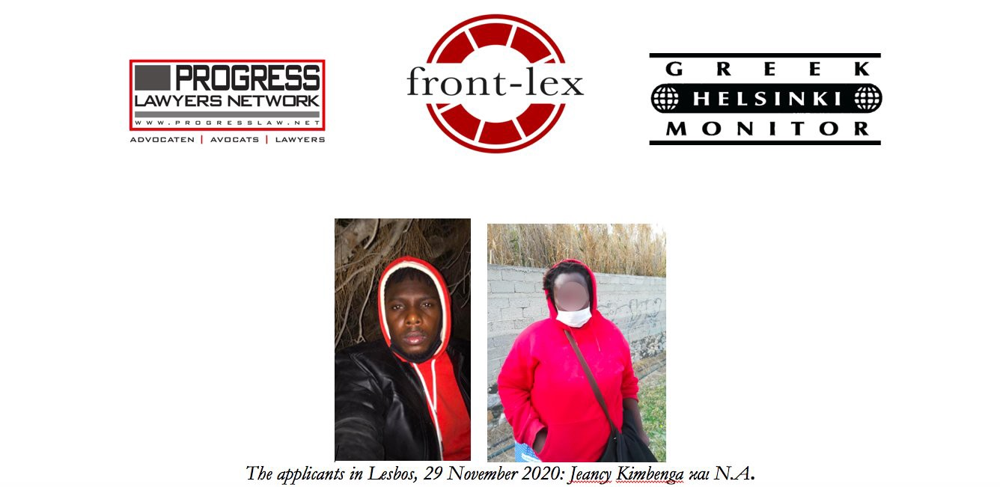

### AYS Daily Digest 25/05/21: Lawsuit against Frontex
#### Lawyers file cases of pusbacks at ECJ// 100 people disembark on Cyprus// Positive Covid cases on Samos// More concrete walls planned around Greek camps// UK Home Office postponed evictions

### Feature: Lawsuit against Frontex

Human Rights lawyers from [Front\-Lex](https://www.front-lex.eu/?fbclid=IwAR0jZ0g8UkKTg0bhwqaUHzo_i8kD_87_K5SqxEByAm8fZYXzy4DVSXd-z3c) have filed a lawsuit against Frontex at the European Court of Justice, relating to violations of people’s rights to seek asylum in the European Union\. In particular, the case concerns a woman from Burundi and a Congolese teenager, who attempted to apply for asylum on Lesvos\. According to the lawyers, this is the first time that Frontex is being sued at the ECJ, AP [writes](https://apnews.com/article/middle-east-europe-migration-lawsuits-government-and-politics-48239024048f0793bead8d60347b0a14?fbclid=IwAR0xAFFy1FtmJLfQPVHRzVlKAH2Bx-BRJNXK8C2nWy_dDkIBfeCKazOb3G0) \. The lawyers state that during their ordeal, the two people “were violently rounded up, robbed, abducted, detained, forcibly transferred back to sea, collectively expelled, and ultimately abandoned on rafts with no means of navigation, food or water\.” A Frontex spokesperson denounced the lawsuit as an activist agenda and not a real legal case\. NGOs and media have documented far more cases of Frontex’ involvement in illegal pushbacks and how the agency tries to hide its role\. On Tuesday, Der Spiegel [published](https://www.spiegel.de/ausland/pushback-skandal-in-der-aegaeis-interne-dokumente-belasten-frontex-a-b78caceb-07a4-42c4-bf7e-ec92a81b4f8a?fbclid=IwAR2HVmhuOPBr4fk03GXxqQriRmaI44bG_hHTjsgHn2-uY_d2Dz85h9moH7s) an article about this topic for subscribed readers\.

Meanwhile, the President of the European Union’s parliament has called for action in the Mediterranean to stop the drownings\. “Every day we hear of yet more tragedies and deaths and boats capsizing in the Mediterranean; it is tragic,” David Sassoli said, [according to](https://www.theparliamentmagazine.eu/news/article/sassoli-calls-for-fresh-eu-action-to-tackle-deaths-of-asylum-seekers-in-mediterranean?fbclid=IwAR3TIU8CDf5LN8UcxKjqBtUB-tUtVBSP8sEMv9bz7TW0HAMu3ln8AA0n0Z0) The Parliament Magazine\.

Additionally, EU commissioner for inner affairs, Ylva Johannson, has said that the EU should implement a solidarity mechanism for Italy, Der Standard [reports](https://www.derstandard.de/story/2000126904714/migration-eu-innenkommissarin-plant-solidaritaetsmechanismus-mit-italien) \. Member states should define fixed numbers of how many relocations they will provide every year\. Similar attempts have failed in the past, when target numbers were not met by far\. Additionally, Johannson suggested a Search and Rescue mission by the EU in the Mediterranean\.
### Cyprus

After five days of waiting, 102 people from Syria were finally allowed to disembark in Cyprus\. Before, they were waiting at a fishing shelter, where tents had been set up and authorities conducted security checks and Covid\-19 tests, CyprusMail [writes](https://cyprus-mail.com/2021/05/25/migrants-on-boat-for-five-days-finally-allowed-to-disembark/?fbclid=IwAR1iB-5RiZY_5lvaee9XhpqF8EgyH3gnNKeEix18N8KY9Jco3RmIQDxuUSE) \.
### Greece

In the hotspot on Samos, three people have tested positive for Covid\-19, according to volunteers\. The hygiene and sanitation facilities in the Greek camps are severely lacking, meaning that the risk of disease spreading among the population is significantly higher\. Currently, almost 2,000 people live in the Samos hotspot — which has a capacity of only 650\.

After Ritsona, Greek authorities want to surround another 24 camps on the mainland with concrete walls, Aljazeera [reports](https://www.aljazeera.com/news/2021/5/25/concrete-walls-and-drones-greek-plans-for-refugee-camps-decried?fbclid=IwAR0vyNCxuJ3WWtZJtRwGQkxNFCUgCj6v_L4B6ttZFlJPuCVTq7CNOND7ePI) \. The official narrative is that the walls are for the protection of the residents\. Calls for proposals show that security measures will also be massively increased\. Plans include drones, magnetic gates with thermographic cameras, X\-ray machines and security cameras in a total of 39 camps\. “There are also proposals to close camp gates at about 9pm to prevent people from leaving, according to the Ministry for Migration,” the report continues\. The EU will cover 75 percent of the costs through funds\. The concrete walls already cost 28\.4 million Euros\.

■■■■■■■■■■■■■■ 
> **[Parwana Amiri پروانه اميري](https://twitter.com/parwana_amiri) @ Twitter Says:** 

> > At the moment in Ritsona!!
No one dares to go out, everyone is afraid that dominant fight may be started!!
Where is safety, if there is no security in the area....? 
The walls you are building around us, will not bring us safety, but only repression and invisibility!! https://t.co/XkgsEZAGzh 

> **Tweeted at [2021-05-25 16:43:43](https://twitter.com/parwana_amiri/status/1397231920996626434).** 

■■■■■■■■■■■■■■ 

### Bosnia

> All I want is to see my son\. 

Aljazeera published a long\-read about fathers stuck in Bosnia, trying to reach their families in Croatia\.

### Spain

After some 8,000 people arrived in Ceuta, many locals have showed their solidarity and support\. Al Jazeera has produced a video documenting the activities of the volunteers\.

However, more than 6,500 people were not granted access to the asylum system and were pushed back to Morocco\. France24 [collected](https://observers.france24.com/fr/afrique/20210524-migrants-after-ceuta-crossing-return-morocco) testimonies of people who did not have a chance, and return now to unsafe conditions in Morocco\.

**Further Reading:**
- [Europe’s Militarized Borders Are a Band\-Aid for Climate Chaos](https://jacobinmag.com/2021/05/militarized-borders-migrants-morocco-climate-crisis-refugees-european-union/?fbclid=IwAR38YB_yNb4MpqjFiUuq4QwR2UXw0CX0p3naWJ0d-oYJnz8HQgeXBbogLy4)

### France

Police conducted 8 eviction operations this morning in Calais, taking 19 tents and 20 tarps, Human Rights Observers documented\.

■■■■■■■■■■■■■■ 
> **[Human Rights Observers](https://twitter.com/HumanRightsObs) @ Twitter Says:** 

> > Ce matin à #Calais, 8 opérations d'expulsions se sont déroulées sous la #pluie.
19 tentes et 20 bâches saisies par les #FDO.
Ce #harcèlement constitue une atteinte grave à l’intégrité physique et psychologique pour les personnes #exilées. #StopExpulsion #Violencelnstitutionnelle https://t.co/mrWEeOn6d1 

> **Tweeted at [2021-05-24 20:27:43](https://twitter.com/humanrightsobs/status/1396925903742062600).** 

■■■■■■■■■■■■■■ 

### UK

Due to concerns about the spread of Covid\-19 and the discrimination of people of colour, who are often targeted by evictions, the Home Office has reversed its plans to evict around 4,000 people from Home Office accommodation\. This comes at the same time as a legal challenge, in which the high court raised concerns that the Home Office “could have been distributing public funds without legal authority in part of its accommodation policy”, The Guardian [writes](https://www.theguardian.com/uk-news/2021/may/25/home-office-drops-plan-to-evict-thousands-of-migrants-during-pandemic?CMP=Share_AndroidApp_Other&fbclid=IwAR1_5zUJ6yyQ0SyWeRuWkjaibXJ5ONaGcF6F2WMCCjY2fJrTRu-PjWfdg9Q) \. According to the judge, the secretary of state herself says she was acting without lawful authority\. Additionally, Public Health England \(PHE\) have advised that no one “should be enabled to become homeless from a public health perspective” during the pandemic\. However, the plans have only been postponed and will be considered again at step 4 of the pandemic roadmap\. At the moment, this would be 21st June\.

Residents of the Napier Barracks in Kent say they were intimidated by security officers at the camp, IPA news [reports](https://ipa.news/2021/05/25/napier-barracks-residents-warned-against-joining-a-solidarity-event/?fbclid=IwAR3b-YDUTEuOCV6FZbSNBWqQp8KO6_a5_ZSWTCO6ynjSau8Kpz9cfM8f7HM) \. They were “warned”, that joining a protest organized by a rights group to close the old military facility could impact their asylum claim\.

■■■■■■■■■■■■■■ 
> **[Benny Hunter](https://twitter.com/BennnyH) @ Twitter Says:** 

> > Good vibes today at the #ClosetheCamp protest at Napier military barracks. https://t.co/fvRzGkWc9C 

> **Tweeted at [2021-05-22 20:15:58](https://twitter.com/bennnyh/status/1396198171165003776).** 

■■■■■■■■■■■■■■ 

### Denmark

Hundreds of Syrian refugees who have spent years rebuilding their lives in Denmark now face the prospect of losing their residency — leaving them with little option but to return to Syria and potentially face the threat of arbitrary arrest and violence\.

Danish authorities have in recent weeks been reconsidering the status of at least 800 refugees who were granted temporary protection after fleeing wartime violence in Damascus and the Rif Damascus governorate\. The Social Democrat\-led government now deems those areas safe\.

### Finland

Ten people were relocated from Greece to Finland last weekend, the Immigration Service announced\. With 169 relocations since July 2020, the country has “almost completed” its promise of relocating 175 people, with more arrivals planned from Greece, Malta and Italy\. Most of the people are from Afghanistan and Somalia\. The Migration Service received 12 million Euros in EU funding, according to [Foreigner\.Fi](https://www.foreigner.fi/articulo/moving-to-finland/10-unaccompanied-refugee-children-and-adolescents-arrived-in-finland/20210525153237011650.html?fbclid=IwAR0TZoqso6QsnnnHpRfMog0pE721loIkHqEs5tse8jCLyVm-mvqqQr4aKFI) \.
### Further Reading
- [The Asymmetrical EU\-Afghanistan Cooperation on Migration](https://thediplomat.com/2021/05/asymmetrical-eu-afghanistan-cooperation-on-migration/?fbclid=IwAR3bFiVgudVETkgrRnQRb17sCBlTSQNFVGh-7dx5aA9oP0Q1_PPWPVQbvM0)
- [The everyday at the border: Examining visual, material and spatial intersections of international politics along the ‘Balkan Route](https://journals.sagepub.com/doi/pdf/10.1177/0010836719882475?fbclid=IwAR3t1nwLa_8Cb-MfIDSdmnvuRqmjODphzxBcCJg-4K7HBl1h_qOVNrl5k6Y&)
- [As Assad tightens grip on Syria, many refugees lose hope](https://uk.news.yahoo.com/assad-tightens-grip-syria-many-144120749.html)
- [How Libya’s human smuggling industry evolved to cash in on captivity](https://timesofmalta.com/articles/view/how-libyas-human-smuggling-industry-evolved-to-cash-in-on-captivity.873859?fbclid=IwAR1a1AY-nCgYMJruD0n1MM1yzlZWDigtFEbHLKbZS_nmmi6R8PPPp5EJUG4)
- [Afghanistan to the Aegean: why thousands make this journey each year](https://www.europemustact.org/post/from-afghanistan-to-the-aegean-why-thousands-of-people-make-this-journey-each-year?fbclid=IwAR39iEW9YLwW3hImMs72mRDnANjE8OAHd7Kxbx1Itb---pHOrmFhZfVMGLs)

**Find daily updates and special reports on our [Medium page](https://medium.com/are-you-syrious) \.**

**If you wish to contribute, either by writing a report or a story, or by joining the info gathering team, please let us know\.**

**We strive to echo correct news from the ground through collaboration and fairness\. Every effort has been made to credit organisations and individuals with regard to the supply of information, video, and photo material \(in cases where the source wanted to be accredited\) \. Please notify us regarding corrections\.**

**If there’s anything you want to share or comment, contact us through Facebook, Twitter or write to: areyousyrious@gmail\.com**

_Converted [Medium Post](https://medium.com/are-you-syrious/ays-daily-digest-25-05-21-lawsuit-against-frontex-c04494da579e) by [ZMediumToMarkdown](https://github.com/ZhgChgLi/ZMediumToMarkdown)._
