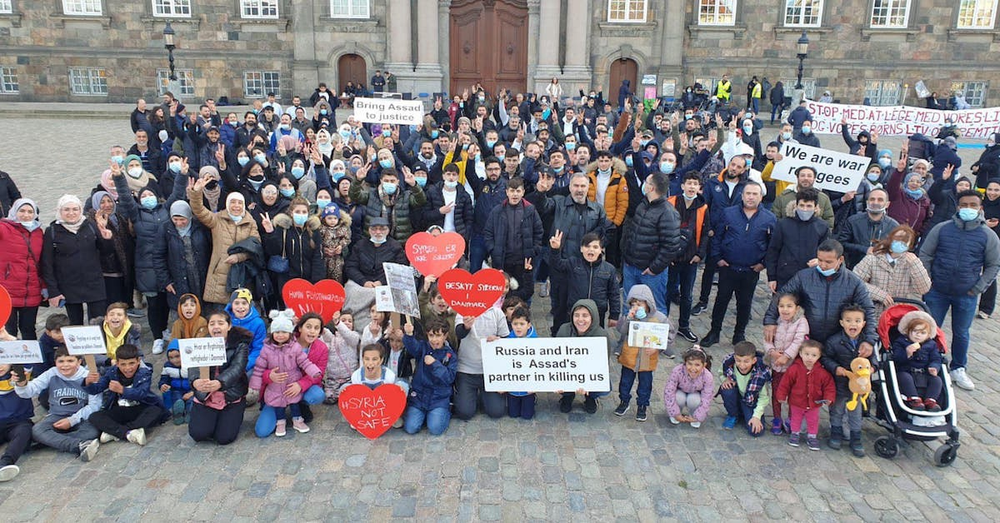

### AYS Daily Digest 28/5/2021 — Plans for closed camps on the Greek islands to go ahead

[Are You Syrious?](?source=post_page-----5c9d29ad5887--------------------------------)

[May 29](ays-daily-digest-28-5-2021-plans-for-closed-camps-on-the-greek-islands-to-go-ahead-5c9d29ad5887?source=post_page-----5c9d29ad5887--------------------------------) · 8 min read

The situation for children on the move in Ceuta\. The \#AspenCardScandal in the UK\. New eviction in Bosnia\. Updates from the \#Briancon7 case and from the Western Med\.

Copenhagen, Denmark, \(Credit: [Syriske Forening i Danmark — SFD](https://www.facebook.com/love.star.syria.dk/?__tn__=-UC*F) \) \. A [New \#SyriaIsNotSafe demonstration](https://www.facebook.com/events/186572406684363/) is launched for Sat 29/5 in Copenhagen, h\.15:30 CET\.
### Tender launched for Closed and Controlled camps in Lesvos and Chios

Greek authorities have launched a tender to build the much criticised closed and controlled camps on the islands of Lesvos and Chios\. They will be Multi\-Purpose Reception and Identification Centres \(MPRIC\), and the Greek government \(together with the EU Commissioners Johansson and Schinias\) have presented them as THE solution to almost every problem related to migration in the country\. The camps will be far away from cities and towns, and the very meaning of ‘closed and controlled’ is far from clear, changing according to the mood and the audience of whoever is describing these future camps\. According to Commissioner Johansson, ‘closed’ must mean open:

Human Rights Commissioner Mijatovic is instead of a different opinion:

The sum of €76m has been [channelled](https://twitter.com/AVeizis/status/1398225933253984258/photo/1) for the new MPRIC in Lesvos alone\.

The Greek authorities have recently released statements which leave little doubt as to their intentions regarding people on the move in the country\.

Prime minister Mitsotakis has [praised](https://twitter.com/lk2015r/status/1398361745807319040) the border police forces and coast guard:

> _… we have significantly reduced migration flows and we’re happy about this because we don’t only protect the borders of Greece, but the borders of Europe\._ 

Migration minister Mitarakis [stated](https://euobserver.com/migration/151968) instead that Greece, as a front\-line country, should not have to integrate people on the move within Greek society\.

Border violence and illegal pushbacks, new closed and controlled facilities, undignified living conditions, fences and walls built around most mainland camps, evictions from housing, widespread homelessness and detention, lack of access to education and healthcare services… : it seems that the Greek government is already doing great at NOT integrating people\.

Read the latest instalment in Khora’s asylum fact series on the use of detention against asylum seekers [HERE](https://www.facebook.com/KhoraAthens/posts/1768076490031618) \.

SEA
### Central Med

A total of 308 people were [returned](https://www.facebook.com/%D8%A7%D9%84%D9%86%D8%A7%D8%B7%D9%82-%D8%A7%D9%84%D8%B1%D8%B3%D9%85%D9%8A-%D8%A8%D8%B1%D8%A6%D8%A7%D8%B3%D8%A9-%D8%A3%D8%B1%D9%83%D8%A7%D9%86-%D8%A7%D9%84%D9%82%D9%88%D8%A7%D8%AA-%D8%A7%D9%84%D8%A8%D8%AD%D8%B1%D9%8A%D8%A9-%D8%A7%D9%84%D9%84%D9%8A%D8%A8%D9%8A%D8%A9-108024311128764/) to Libya on Thursday night\. An important role in the interception was played by the Bigliani Ras Jadeer 648 vessel \( [donated by Ital](https://twitter.com/saracreta/status/1398325983745351685) y\) \.
### Western Med and Atlantic route

On Thursday night, 36 people were [rescued](https://www.diariodefuerteventura.com/noticia/salvamento-mar%C3%ADtimo-auxilia-una-patera-y-la-lleva-fuerteventura) by Salvamento Maritimo\. They were taken to Fuerteventura island, in the Canary archipelago\.

_Héroes del Mar_ [report](https://twitter.com/Heroesdelmar/status/1398326187060043777) that at the moment three small boats are missing at sea, and have been so for the past week, carrying 176 people \(102 \+ 32 \+ 42\) \.

We hope they will be found before it is too late\.

If you are looking for someone who has gone missing on a migratory route, _Caminando Fronteras_ has published a guide supporting the family members of people lost at sea and land borders\. Find it [HERE](https://caminandofronteras.org/wp-content/uploads/2021/05/MAQUETA-UKweb.pdf) \.

BULGARIA
### Yet another pushback to Turkey

Josoor has published the story of a father and son being repeatedly and violently pushed back from Bulgaria to Turkey\. Beaten up, stripped to their underwear, humiliated and with their possessions stolen\.

> _After they reached the border area again, five of the eight men were dragged out of the car, including Abdulrahman’s father, while he himself was left in the car\. Afterwards, his father told him that they were forced to strip down to their underwear\. All their possessions were stolen from them, cell phones, power banks, money — and clothes and shoes\. They were beaten with branches and plastic sticks\. Then, still in their underwear, they were beaten through the border fence back into Turkey\. They had to crawl through a small, unofficial opening in the fence\. From there, they had to walk about five kilometres until they got to the next village, from where they were able to take a cab to Edirne\._ 

Read the full story [HERE](https://www.josoor.net/post/left-in-their-underwear-and-beaten-on-their-back-to-run-towards-the-turksih-territory) \.

MALTA
### EU Pact criticised by the island government

[According to](https://www.maltatoday.com.mt/news/ewropej/109914/hardline_stance_from_malta_against_migration_pact) local media, Maltese representatives have severely criticised the EU Commission’s New Pact on Asylum and Migration which is now being discussed at the European Parliament\. Especially, Malta is arguing that the harmonised and ‘one\-size\-fits\-all’ approach envisioned in the pact provides no fair balance between solidarity and responsibility\. The country’s authorities also rejected the proposal’s five\-day limit in which to process irregular migrants as completely unrealistic for frontline countries such as Malta\.

ITALY
### Arrivals

A total of 162 people [arrived](https://palermo.repubblica.it/cronaca/2021/05/28/news/migranti_a_lampedusa_sbarcate_269_persone_in_24_ore-303192902/) on Lampedusa on Friday, in six different boats\.

SPAIN
### Children on the move in Ceuta

ECRE [report](https://mailchi.mp/ecre/ecre-weekly-bulletin-28052021#Spain) that in the aftermath of last week’s tension at the Spanish/Moroccan border in Ceuta, around 800 children are crammed into industrial warehouses to undergo a 10\-day quarantine\.

Two hundred unaccompanied children are about to be transferred to the mainland after an agreement was reached between the Ministry of Social Rights and autonomous regions, but hundreds of unaccompanied children remain in cramped conditions in Ceuta\.

[According to](https://elpais.com/espana/2021-05-28/la-fiscalia-de-ceuta-investiga-las-devoluciones-en-caliente-de-menores-durante-la-crisis-fronteriza.html?ssm=TW_CC) local media, the Prosecutor Office in Ceuta is investigating the pushback of minors to Morocco, focusing for now on the case of a 16\-year\-old who was returned to Morocco twice over the past week\.

BOSNIA AND HERZEGOVINA
### New eviction in Bihac

No Name Kitchen [report](https://www.facebook.com/NoNameKitchenBelgrade/posts/1246475692417379) of a new eviction in Bihac, only a week after the ‘Nursing home’ eviction\.

On Friday, hundreds of people were unpleasantly surprised again\. “The Jungle, a large area south of Bihać where camps and squats are scattered over hilltops, fields and forests, was evicted\. Over 300 people were estimated to reside in the jungle\.

> _We ran away early in the morning when we heard three large police cars coming … We heard that the police will take away our phones and our other things, and we really need them, so we ran into the hills\._ 

While some managed to get away in time, most people were taken to Lipa camp, some 30km south\. Local media report that 255 people were evicted\. Among them, many who had just walked back from Lipa after the previous eviction\.

Just like last week, many of the people deported are already on their way back to Bihać, with authorities trying to prevent them from ariving\.

Authorities have reportedly burned down the makeshift camps in the area, “including all personal objects and food items\.”

> _… there are almost no places left in Bihać for people who are migrating to come back to\. What happens next is a big question mark to all of us and is being monitored carefully\._ 

Also, No Name Kitchen volunteers faced harassment while distributing food in the area, being stopped by police multiple times and with two volunteers having their passports confiscated\.

ROMANIA
### Deportation to Turkey halted at the last minute

On Friday, Romanian authorities attempted to deport 29 people to Turkey, among them political asylum seekers, including former members of the pro\-Kurdish party HDP, journalist Zübeyir Koçulu [report](https://twitter.com/zubeyirkoculu/status/1398372185304092680) s\.

> _The Romanian police detained them last night, violently forced them onto a plane at Bucharest Airport to Istanbul\._ 

Already on the plane, handcuffed behind their backs, some protested and resisted the deportation\. Following their resistance and social media backlash, Romanian authorities stopped the deportation\.

The 29 people were disembarked and were taken to an unknown place by bus\.

FRANCE
### Update from the \#Briancon7 court case

GERMANY
### Authorities admits mistakes with revealing the sexual orientation of asylum seekers

InfoMigrant [report](https://www.infomigrants.net/en/post/32558/revealing-sexual-orientation-of-asylum-seekers-german-government-admits-mistakes) that this was communicated in a letter to Germany’s Lesbian and Gay Association \(LSDV\), after they [had raised the issue](https://www.infomigrants.net/en/post/32430/german-authorities-accused-of-revealing-sexual-orientation-of-asylum-seekers) one week ago\.

> _As a part of the asylum procedure, Germany’s Federal Office for Migration and Refugees \(BAMF\) had asked the foreign office to evaluate information about the applicants’ sexual identity\. Information was later disclosed by lawyers in their countries of origin, who were assigned with evaluating them\._ 

> _The LSDV called it a case of “human rights abuse” that could irreversibly damage the social life of the asylum seekers and cut ties to their families\._ 

> _The government’s letter pledges that in the future, the BAMF will be more cautious about the “necessity, proportionality and the content of the requests” they make to the foreign office\._ 

DENMARK

EU
### Strengthened collaboration with Libya agreed in Tripoli

On Friday, EU Commissioner Oliver Varhelyi, Italian foreign minister Luigi Di Maio and Maltese foreign minister Evarist Bartolo were in Tripoli\. According to media [reports](https://www.ansamed.info/ansamed/it/notizie/rubriche/politica/2021/05/28/ministra-libia-rafforzata-intesa-con-ue-per-sicurezza-sud_b266b229-fbbf-4f9f-afc6-774f09c4d586.html) , it was agreed to strengthen the collaboration between the EU and Libya to defend the Southern Libyan border\.
### Call for inputs by the EP’s Frontex Scrutiny Group

UK
### The Aspen Card scandal

Care4Calais, like many other groups throughout the UK, have taken it upon themselves to [support](https://www.facebook.com/care4calais/posts/4384331431599780) thousands of people, who are facing a dire emergency due to the “government’s botched switching of contracts between two companies it pays to run the Aspen Cards\. Aspen cards are a kind of debit card given to asylum seekers so they can spend £5\.66 a day \(£1\.14 if they are in a full\-board hotel\) on basic necessities\. In the vast majority of cases this is the only source of money they have\.”

In almost every region, vulnerable people — including the old, the disabled, and families with babies and toddlers — are being left without food or money after having their financial support effectively cut off by the Home Office\.

> _Aspen cards were, until last week, administered by Sodexo, a French food services and facilities management company\. When the Home Office switched the contract to Prepaid Financial Services \(PFS\), a fintech firm, it provided the names and addresses of the people who should be sent new Aspen cards\. PFS duly posted out the cards, and last weekend the old ones were cancelled\._ 

> _However, in hundreds of cases the Home Office provided the wrong addresses\. In some instances cards were sent to hotels from which people had been moved two months ago\. One man’s card was posted to an address he had not lived in for seven months\._ 

> _Other recipients have received their cards, only to find they cannot be activated\. With contacting the helpline proving all but impossible due to overload, people have been forced to look for food wherever they can\. Foodbanks and other support organisations have been overwhelmed, asylum seeking families left to go hungry\._ 

> _The Home Office has said it will ensure everyone has a card by Tuesday June 1, but even if that target is met, it will mean some people have been without food or money for 11 days\._ 

WORTH READING
- **Against All Reason: German Authorities Plan Further Deportations to Afghanistan,** by Therese Lerchi \(PRO ASYL\) for ECRE\.

> _… the German government is at one and the same time pulling out of Afghanistan, leaving behind a deteriorated country and potentially the families of people who risked their life in its service, and disregarding the evident risks for people forcibly returned\. This incoherence and lack of responsibility indeed defy all reason\._ 

- **Die vernichtung von flucht nach Europa \(The destruction of escape to Europe\)** , by Axel Pasligh, head of communication at Sea\-Eye e\.V\.

> _The EU states do not want people to flee on European soil\. That is why they build border fences, beat refugees, let them drown, lead them back to internment camps or build slum camps themselves where children are eaten by rats\. The EU states no longer recognize flight and the search for security as human rights\. Instead, their goal is: The destruction of escape to Europe\._ 

**Find daily updates and special reports on our [Medium page](https://medium.com/are-you-syrious) \.**

**If you wish to contribute, either by writing a report or a story, or by joining the info gathering team, please let us know\.**

**We strive to echo correct news from the ground through collaboration and fairness\. Every effort has been made to credit organisations and individuals with regard to the supply of information, video, and photo material \(in cases where the source wanted to be accredited\) \. Please notify us regarding corrections\.**

**If there’s anything you want to share or comment, contact us through Facebook, Twitter or write to: areyousyrious@gmail\.com**

_Converted [Medium Post](https://medium.com/are-you-syrious/ays-daily-digest-28-5-2021-plans-for-closed-camps-on-the-greek-islands-to-go-ahead-76cdcd8fc32b) by [ZMediumToMarkdown](https://github.com/ZhgChgLi/ZMediumToMarkdown)._
