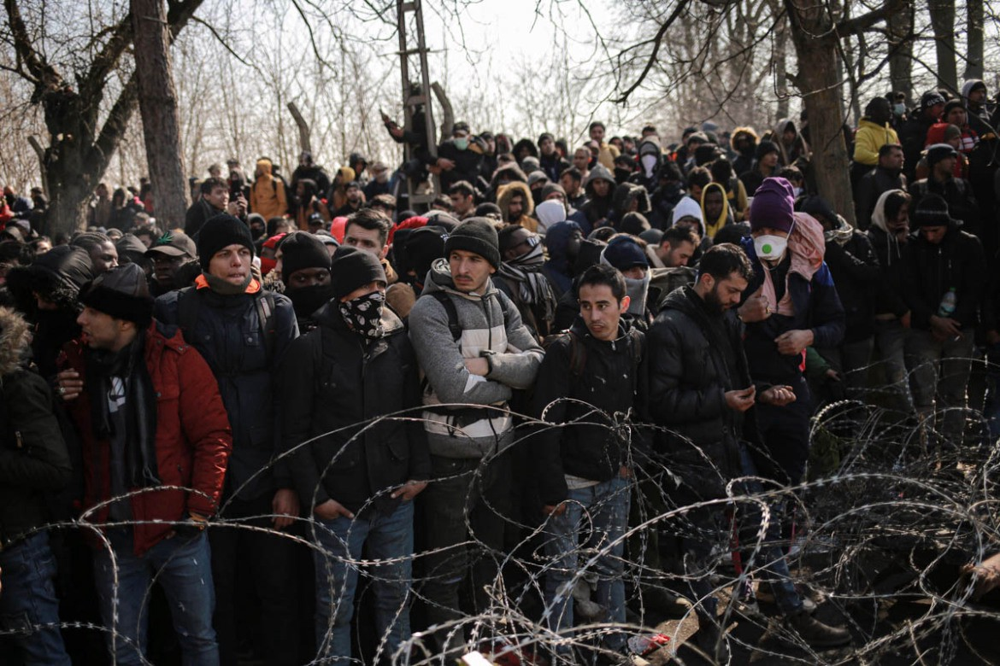
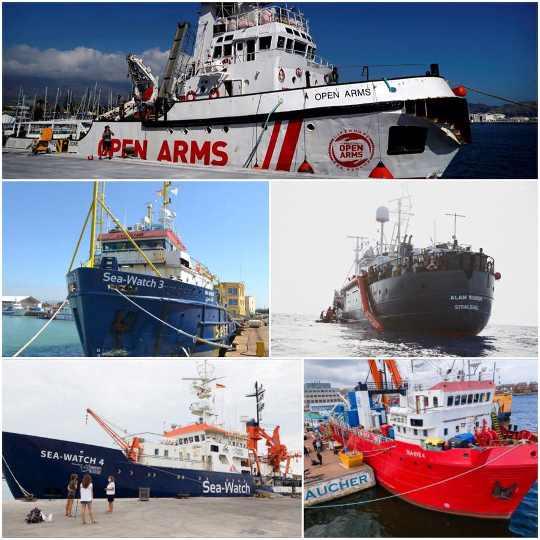
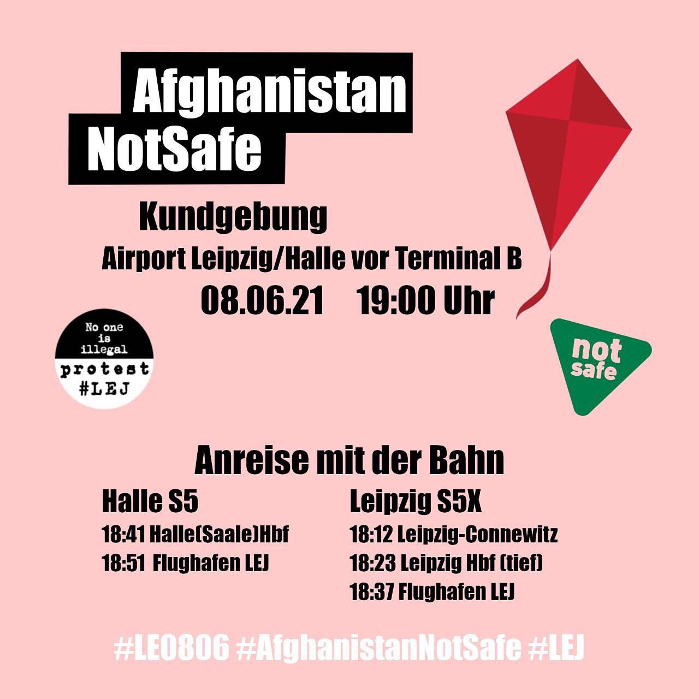

### AYS Daily Digest 07/06/21 Greece designates Turkey as a “safe third country”

[Are You Syrious?](?source=post_page-----f0aa60016a2f--------------------------------)

[Jun 8](ays-daily-digest-07-06-21-greece-designates-turkey-as-a-safe-third-country-f0aa60016a2f?source=post_page-----f0aa60016a2f--------------------------------) · 8 min read

_More about the mysterious boat that arrived in the Caribbean // deportation alerts in Germany // health concerns due to stress for Syrians in Denmark // and more…_

Asylum seekers at the border of Greece and Turkey March 2020\. Photo by [Hosam Salem/Al Jazeera](https://www.aljazeera.com/gallery/2020/3/1/in-pictures-refugees-stream-towards-greece-as-turkey-opens-gates)
### FEATURE: Greece designates Turkey as a “safe third country” for asylum seekers from Syria, Pakistan, Afghanistan, Bangladesh, and Somalia

The Ministry of Migration and the Ministry of Foreign Affairs announced on Monday in a joint ministerial decision that Greece now considers Turkey as a “safe country” for asylum seekers from Syria, Afghanistan, Pakistan, Bangladesh and Somalia\. They conclude that asylum seekers from these countries will not be in any danger in Turkey “due to their race, religion, citizenship, political beliefs\.”

[Migration Minister Notis Mitarakis](https://www.keeptalkinggreece.com/2021/06/07/greece-turkey-safe-country-asylum-seekers/) said the decision is an “ _important step in tackling illegal migration flows and criminal activities of smuggling rings… The joint ministerial decision fully complies with the International Law and shields the legal tools of Greece towards requests by asylum seekers from Syria, Afghanistan, Pakistan, Bangladesh and Somalia who objectively do not have a reason to not regard Turkey as a safe country…\(this is\) another step towards the full and unwavering implementation of the EU\-Turkey Joint Declaration, which obliges the neighboring country not to allow the operation of smuggling networks and transit in Greece_ \.”

Of course human rights activists are outraged by this decision\. As tweeted above, Samos Volunteers points out how this decision goes directly against the Geneva convention\.

Reporter Giorgos Christides gives a detailed overview of some the evaluations and remaining questions this decision leaves:

> _“What Athens’s decision today, designating Turkey safe for the vast majority of asylum seekers reaching Greece, means\. First tentative info and expert evaluations:_ 

> _Decision applies, according to Der Spiegel info, to asylum seekers reaching the country from the land border as well\. It is not clear yet if it also applies to pending asylum applications or to migrants who have been registered by police but have not applied for asylum yet\._ 

> _Asylum applications from Syrians, Afghanis, Somalians, Pakistanis and Bangladeshis can now be rejected as “inadmissible”, i\.e\. Greek asylum authorities can reject them without getting into their merits, referring this decision to Turkey where they are supposed to be deported\._ 

> _Asylum seekers from these countries retain the right to contest the inadmissibility decision based on their individual circumstances\. But the burden of proof that Turkey is not safe, now falls on them\._ 

> _A big question is: Turkey has stopped receiving rejected asylum seekers from Greece since March 2020\. This means Greek asylum authorities should in fact examine such cases on their merits \(since the “safe country” refuses to take them back\)…_ 

> _Greece and the EU are pushing for returns, but at the moment it seems likely that many “inadmissible” asylum seekers will remain in a state of legal limbo\._ 

> _Remain where? is another good question\. Some asylum experts say that here’s where the EU\-funded, new reception centres to be built at the so\-called hotspot islands will become useful: hosting asylum seekers pending deportation\._ 

> _Greece on the other hand is hoping that the lack of decent prospects to get asylum here will act as a powerful deterrent against future arrivals\.”_ 

AYS will continue to report on the ramifications of this decision\.
### SEA

“5 ships blocked by the Italian government: — ALAN KURDI — OPEN ARMS — SEA WATCH 3 and 4 — SEA EYE 4\. They act against International Maritime Law, while buying time and punishing us financially\. What they do not know is that behind there are millions of people who will continue to support us\.” Photo and info by [Oscar Camps](https://twitter.com/campsoscar/status/1401796848596180994)
### More on the mysterious boat that arrived in the Caribbean with 14 bodies

A boat with 14 bodies arrived late in May onshore of the island of Tobago and the police have since made some headway to understand what happened\. They believe more than 14 people died and that the boat was initially heading towards the Canary islands\. They have determined the boat was from Mauritania because “ _According to medical services, a mobile phone found in the cayuco provided the missing link for the cybercrime unit, which revealed that the ‘phone was registered in Mauritania\._ ’”

Also “ _Forensic pathologist Eastlyn McDonald Burris began the autopsies\. However, due to the advanced state of decomposition of the remains, the authorities may have to rely on a toxicology report or other methods to determine the identities of the people found in the cayuco\._ ” Learn more [here](https://noticiasfuerteventura.com/fuerteventura/1llega-al-caribe-una-patera-que-se-dirigia-a-canarias-con-14-cadaveres?fbclid=IwAR0Drgu_4mBnWmFI192Pz69MSTbOeloGaWSjzBfuzHrsWExKJfRjGZPEHn0) \.
### SPAIN
### “The hospitals of Ceuta and Melilla notify the police to ‘identify’ migrants who do not have documentation or a health card”

El Diario reports:

> _“In the middle of the migratory crisis in Ceuta, when hundreds of Moroccans lived hiding in any corner in fear of being discovered by the police, many migrants did not even see a safe place for them in the hospital\. Although suspicion of institutions is common among people without papers, their distrust is not always unfounded: the hospitals of Ceuta and Melilla notify the police when they treat people who lack an identification document and do not have a health card, as confirmed to elDiario\.es the Ministry of Health, which depends on health care in the autonomous cities\._ 

> _‘Since always, the protocol says that before a person who is unidentified, the police must be notified to proceed with their identification,’ explains the spokesman in Ceuta of the National Institute of Health Management \(INGESA\), an entity dependent on the Ministry of Health in charge of public health management in autonomous cities\._ 

> _Asked about the reason behind these calls to the police from the Ceuta hospital after treating immigrants in an irregular situation, the department headed by Carolina Darias justifies that the health centers of the autonomous cities notify the security forces when patients are lacking of a physical identity document — for example, passport, identification document of their country or registration card issued by Spain upon arrival — and they have no ‘right to healthcare\.’ The goal, they say, is to issue an invoice for the assistance provided\._ 

> _‘Those who do not have the right to health care from Social Security are obliged to pay for the services they have received, as established in current regulations\. Only in cases where they do not provide the mandatory identification documentation, they are requests police assistance in the case of adults, in order to identify the person obliged to pay,’ explains a spokesman for the Ministry of Health via email\. According to it, if it did not do so, ‘INGESA would incur accounting responsibility for not processing the records of the income that correspond to it in accordance with current regulations\.’”_ 

[Learn more here](https://www.eldiario.es/desalambre/hospitales-ceuta-melilla-avisan-policia-identificar-migrantes-no-documentacion-tarjeta-sanitaria_1_8005271.html?fbclid=IwAR196mYGgIyBrbxlW5uMB1_FogDKyHnmxHPRPvXkueIxVM6Ux4ee-7jhWek#) \.
### SLOVENIA
### “Janša to the Commissioner of the Council of Europe: You are part of a network of fake news”

RTVSLO reports: _“After the publication of a critical report on freedom of the media and freedom of expression in Slovenia, Prime Minister Janez Janša accused Dunja Mijatović, the Council of Europe’s human rights activist, of being part of a network of false news\.”_

> _“In a report, the commissioner called on the Slovenian authorities to stop the deterioration of the situation in the areas of media freedom and freedom of expression\._ 

> _‘Unfortunately, Dunja Mijatović is part of a network of fake news\. Well paid with our money,’ Janša wrote on Twitter in English\._ 

> _In a report published last Friday, the Council of Europe Commissioner for Human Rights called on the Slovenian authorities, among other things, to stop the deterioration of the situation in the areas of media freedom and freedom of expression in the country\. Regarding the deteriorating situation in the field of media freedom, she mentioned a number of problems, including harassment, intimidation and criminal lawsuits against journalists\. She also mentioned the sexist harassment of female journalists and the government’s handling of the public media\.”_ 

Read in full [here](https://www.rtvslo.si/evropska-unija/jansa-komisarki-sveta-evrope-ste-del-omrezja-laznih-novic/583265?fbclid=IwAR1nk1XG0GgHF_806I0OxebNxULdfvbXouIpRvfPOqV-biLoHuXl1DCOIWw) \.
### GERMANY
### DEPORTATION ALERT\!

[Leipziger Seebrücke](https://twitter.com/seebrueckeLE/status/1401890042990280708) reports: “\(Tuesday\) there will be another deportation from the airport\. Leipzig / Halle to Afghanistan\. Germany’s inhuman deportation practice must finally be stopped\! Come to the rally of
[@protest\_lej](http://twitter.com/protest_lej) & stand against all deportations\!”
### SWITZERLAND
### “First refugee parliament held in Swiss capital”

SWI reports: _“Around 75 refugees from 19 cantons and 15 countries met in Bern on Sunday for the first Swiss refugee parliament\. Participants discussed and put forward various proposals for improvement\. Family visits in the Schengen area for provisionally admitted persons, better access to education, or that apprentices whose applications have been rejected be able to complete their apprenticeships: these are some of the requests made by those present, said the National Coalition Building Institute External link \(NCBI\), which organised the event in a church\. The refugee parliament also voted in favour of extending family reunification to parents of children already in Switzerland\.”_ Read more [here\.](https://www.swissinfo.ch/eng/first-refugee-parliament-held-in-swiss-capital/46682958?fbclid=IwAR3ZluMY4MxegSqDhVDgI1P1Sh3k8wJtM1tKOlJiTLDgiHK3tWAXOFM9FU4)
### FRANCE

ENGLISH translation: “This morning in Calais, the exiled people were again expelled from their places of life\. 40 tents and 20 tarpaulins were seized by the FDO\. The French state violates human rights\.”

[**UTOPIA 56**](https://twitter.com/Utopia_56/status/1401941009056010247) also reported from Calais: _“This morning, two volunteers intervening in Calais on the sinking of 27 people including 1 pregnant woman were arrested by the border police, gun pointed in their direction\. \(Minister of the Interior\) the smugglers are creatures born of your border policies, not us\.”_
### DENMARK

[Alexandra](https://twitter.com/AlysiaAlexndra/status/1401809189811494913) continued:

> _“Doctors confirmed that Muhammad’s stroke was onset by extreme stress, leading to a spike in blood pressure, causing a stroke and paralysis in the left side of his body\._ 

> _Denmark’s cruel and inhumane decisions to send Syrian refugees back to Damascus have already had fatal consequences, after the tragic death of Akram, who died from a heart attack after learning he lost his residency\. Now, this stroke nearly killed Muhammad\._ 

> _Syrian families who have lost residency or are being separated, are experiencing serious physical health issues, worsening or relapsing PTSD, extreme stress and depression because of the Danish govts abhorrent policies\.”_ 

### UK
### “THOUSANDS of asylum seekers are still being left without money for food nearly two weeks after a failed Home Office roll out of new pre\-paid cash cards\.”

The Glasgow Times reports : “ _\(We were\) told on May 27 how individuals and families with children were struggling to buy food after the Westminster department switched contracts for the Aspen cards\. Charity Positive Action in Housing stepped in to fill the breach with emergency payout and its director, Robina Qureshi, warned of a ‘tsunami of suffering’ about to hit the city\. Thousands of more people in the asylum system are affected across the UK with no clear signal from the Home Office of when the issue will be resolved\. Robina said: ‘ **This is like a another Windrush\. The Windrush scandal showed how incompetent the Home Office is and now this crisis is showing it again\. We are still waiting for an apology from the Home Secretary but Priti Patel has remained silent throughout — she has not said a thing\.**_ ’”
### “Police in Norway have said a body found on the country’s coast earlier this year is that of a missing 15 month old who died in the English Channel\.”

[BBC reports](https://www.bbc.co.uk/news/world-europe-57384925.amp?fbclid=IwAR0nZnvjsum2OKCxxuxUexWrUmQ_QjsK8TaPuibJHEVfLcRN5Xtyh7MqCU4) “ _The child, named Artin, died along with four family members when the boat they were travelling in sank in October\. The Kurdish\-Iranian family had been attempting to reach the UK from France\. Relatives of the family have spoken of their grief and confusion as they waited to hear what had happened to Artin_ \.”
### Find daily updates and special reports on our [Medium page](https://medium.com/are-you-syrious) \.

**If you wish to contribute, either by writing a report or a story, or by joining the info gathering team, please let us know\.**

**We strive to echo correct news from the ground through collaboration and fairness\. Every effort has been made to credit organisations and individuals with regard to the supply of information, video, and photo material \(in cases where the source wanted to be accredited\) \. Please notify us regarding corrections\.**

**If there’s anything you want to share or comment, contact us through Facebook, Twitter or write to: areyousyrious@gmail\.com**

_Converted [Medium Post](https://medium.com/are-you-syrious/ays-daily-digest-07-06-21-greece-designates-turkey-as-a-safe-third-country-ce51acc91f99) by [ZMediumToMarkdown](https://github.com/ZhgChgLi/ZMediumToMarkdown)._
