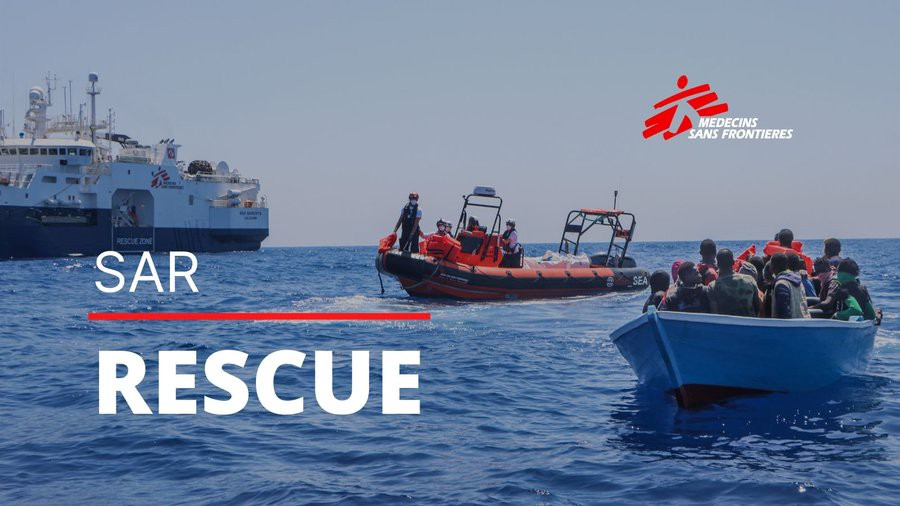
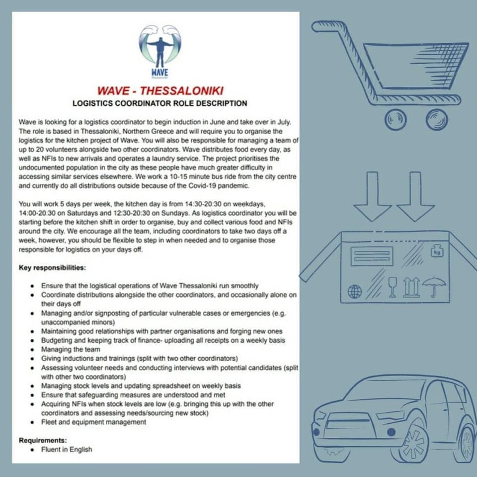
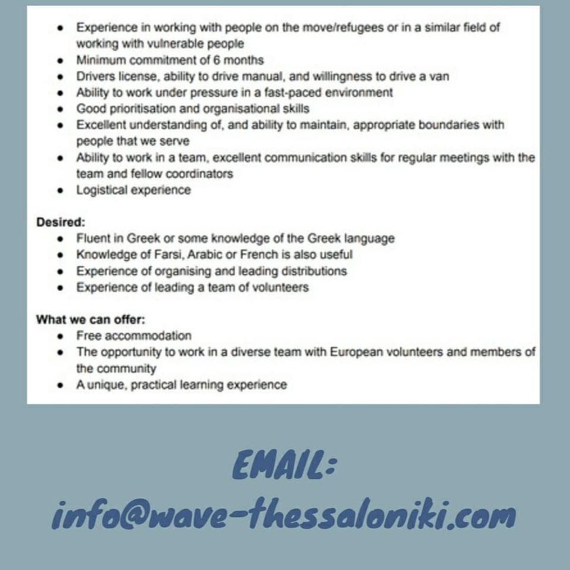
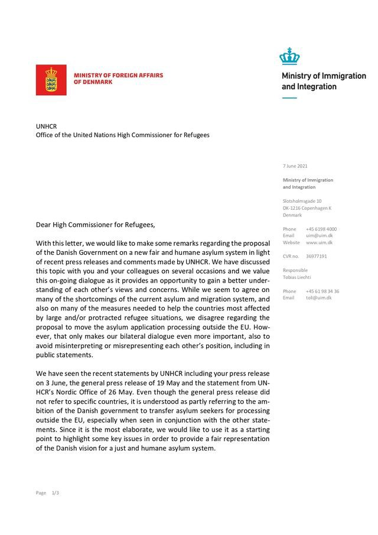
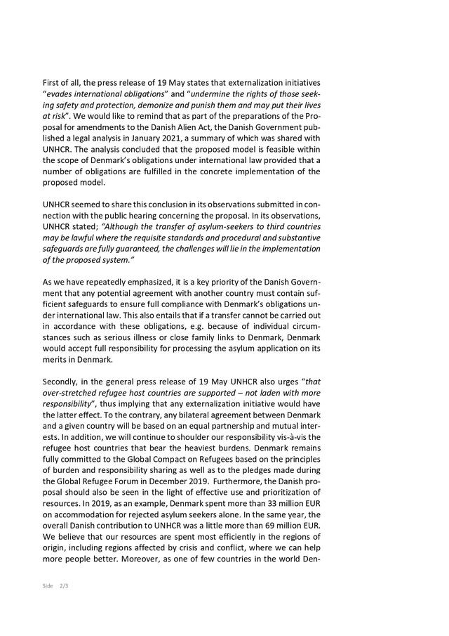
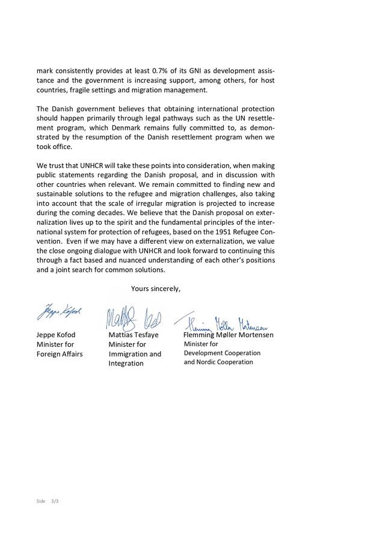

### AYS Daily Digest 10/6/21: Report confirms — people are being arrested, detained, and tortured by Syrian authorities upon return
#### State of things at the Italian\-French border / News from the SAR teams in the Mediterranean / Germany: European Court of Justice decided on the requirements for granting subsidiary protection, giving hope to Afghans, in particular / Recommended reads & more

 report was drafted by the Country of Origin Information \(COI\) Unit of the Netherlands Ministry of Foreign Affairs\[2\], in accordance with the [EASO COI Report Methodology](https://coi.easo.europa.eu/administration/easo/PLib/2019_EASO_COI_Report_Methodology.pdf) , and was reviewed by Denmark, Danish Immigration Service \(DIS\), Hungary, National Directorate\-General for Aliens Policing Documentation Centre and the EASO COI Sector\.](assets/702dff50ec94/0*zYQyuAgQhxNy-DpE)

[**Syria: Situation of returnees from abroad**](https://coi.easo.europa.eu/administration/easo/PLib/2021_06_EASO_Syria_Situation_returnees_from_abroad.pdf) report was drafted by the Country of Origin Information \(COI\) Unit of the Netherlands Ministry of Foreign Affairs\[2\], in accordance with the [EASO COI Report Methodology](https://coi.easo.europa.eu/administration/easo/PLib/2019_EASO_COI_Report_Methodology.pdf) , and was reviewed by Denmark, Danish Immigration Service \(DIS\), Hungary, National Directorate\-General for Aliens Policing Documentation Centre and the EASO COI Sector\.
#### FEATURED
### **Syria — Situation of returnees from abroad**

The new [EASO COI report on Syria](https://l.facebook.com/l.php?u=https%3A%2F%2Fwww.easo.europa.eu%2Fnews-events%2Feaso-publishes-coi-report-syria-%25E2%2580%2593-situation-returnees-abroad%3Ffbclid%3DIwAR3KWEm7vHXZwIb6lhEVcxTHWwlbgfgST7w2NEVjyb2otLuuMDdERHKkw9c&h=AT13-wi-fghO3p_mYMoXlilfYVS0qQUMdDGrF6Bt-urMCwvZKEZlypYyPziibhW-1cCqJwFcGtA4HaZWOK7-KiqqJyzt3mu2deTabOYJHXQBCZaobupeA43XLIQjVedgC0tMZXcjWWQDDA&__tn__=R]-R&c[0]=AT3-q98XVWHduCxvycl15NmYKzq50trSybuIzxeayOErPQA6El7g_nGbQeYqJsTzyblu3An_eO_SdUf7vQU-Ababge5VJ-_-T9wz2NI_1lNktsqvTpnRMcANQXPlduOAH48-EOVZhcKY_8utHz1Y2ZGRbbv3STeRs83B5LW07A7i8KgzuZF2ug5AFUUfxG9p0vmLTYL1djaWxvnmAVmwxdrMcKKp3O90vvqDwsgr6Q) confirms that returnees, including those who had settled their status, are being arrested, detained and tortured by the Syrian authorities upon return, and that obtaining a security clearance will by no means guarantee a safe return to Syria\.

The report, [**EASO COI Report: Syria — Situation of returnees from abroad**](https://coi.easo.europa.eu/administration/easo/PLib/2021_06_EASO_Syria_Situation_returnees_from_abroad.pdf) , focuses on a number of topics relating to the issue of return of Syrians from Europe and Syria’s neighbouring countries \(Turkey, Lebanon and Jordan\) to Syria, including the consequences of having exited Syria “illegally” and having applied for asylum abroad, the return procedures for Syrian citizens who live outside Syria, potential obstacles to return, and possible treatment upon return to government\-held Syria\.

> Syrian authorities continue to arrest, detain, interrogate, torture and pursue returnees by terrorism courts upon return, reports and experts have confirmed previous claims by many\. 

A security clearance can be applied for in two ways: 1 — the returnee personally lodges an application at a Syrian embassy or consulate; 2 — a first\-degree relative of the returnee applies inside Syria on behalf of the returnee \. “The sources consulted gave **conflicting information about the government agency** where the returnee’s relative is supposed to apply\.”

One of the things important to know that a security clearance merely permits a returnee to enter Syria\. In addition to a security clearance, it is common for returnees to receive written instructions to visit a particular security branch upon return\. This type of document is known as **Waraket Mourajaa** and is either issued to a returnee at a Syrian diplomatic mission or upon entering Syria\. Visiting a security branch brings along with it the **risk of being interrogated, arrested, detained, tortured, and/or forced to become an informant, government soldier, or pro\-government militia member** \.

It’s an impossible bind: If the returnee does not adhere to the written instructions to visit a security branch, an arrest warrant will be issued against them, but if the person chooses to present themself at the security branch, they may well be exposed to serious harm\.
### Update from the Monginevro border

](assets/702dff50ec94/0*BUHeu783lArRu5Oo.jpg)

Photo: [PASSAMONTAGNA](https://www.passamontagna.info/?author=1&lang=en)

The activist collective from the former Casa Cantoniera in Oulx that was evicted at the end of March continue their resistance at the border and are currently organizing an info point in Claviere, right at the French\-Italian border\. The cross\-border camp has been resisting in Claviere for more than 20 days; they sent AYS their report with the most recent developments in the area\.

> The border and its deadly dynamics continue to change and from here we continue to monitor and act against the violence that the states perpetrate on those who want to cross it and on those who are determined to oppose it\. 

Both at the border as well as in the CPRs and prisons, the violence of the state also manifests in the operational support of the humanitarian organisations — in conjunction with the prefecture and in direct collaboration with the police, the collective alleges\. 
The Red Cross goes up to Claviere every evening when the bus arrives\. They mostly stop activities after 10 p\.m\., “although their pretended mission is to guarantee medical support to people who cross the mountain or who injured themselves fleeing from the gendarmerie, PAF \(Police Aux Frontiéres\) and military\.”
The group claims that, in conjunction with the Italian and French police, the Red Cross is actually participating in pushbacks:

> In many cases, the ambulance itself is responsible for transporting people rejected by the PAF to the shelter in Oulx\. 

> We know that mountains can be dangerous, especially if you walk at night, in the cold and without knowing the area, but it is the presence of the police they definitely get dangerous and even deadly\. Borders kill, in the Mediterranean Sea as well as in Ventimiglia and in these mountains, where four people have died in recent years and countless others have suffered theft, beatings and assaults\. 
 

> The repression has also increased against those who are here at the camp: every day we are stopped and identified on the way\. They want to intimidate and threaten us because our presence is uncomfortable, especially with the arrival of the summer season and the tourists\.
 

> From the testimonies we have received from people who have been pushed back, we know that the Italian police is becoming more involved in pushbacks\. On Thursday afternoon, police were seen entering the refuge Talitha Kum in Oulx\. 
 

> It is now common practice that, once pushed back, people are given a piece of paper obliging them to report to the Turin police station\. Such collaborations between Italian and French police are not a surprise but a clear example of how fortress Europe violently acts out its racist and oppressive policies to manage and control the lives of undocumented people, to protect its internal and external borders\. 

The group’s reports and news from the border area are available in different languages [here](http://https//www.passamontagna.info/?lang=en) \.
#### THE MEDITERRANEAN

> Today, it is with pain that we still see three boat interceptions by the Libyan coastguard\.
 

> The refoulement of these people to a warfare country violates international law by contempt of the principle of non\-refoulement, mentioned in the Geneva Convention of Relating to the Status of Refugees — _Pilotes Volontaires_ 

](assets/702dff50ec94/0*5IQ5Br2oE3FMO9V2)

Infographic: [Watch The Med — Alarmphone](https://web.facebook.com/watchthemed.alarmphone/?__cft__[0]=AZVe60KP2kAB7K1Mart1lXbMgbXBXw2oSxT9hOLY9TFG5e4Y1WjKVuSNp_1hIkQ0XEihl8MPR4ksYc8oB3TsrkzOy51kgWpAWDyobyQ5cooKYwnTrAgYC-rtZrG4sF5DSc1QVPCXq3d2G-9Ma-rSpNUG9yyW8irkKmcFEhpYy3ydvGoJJ7l6_yjs7IYK2qhRAPs_uPFCU4bHOX2ktRYzfKqv&__tn__=-UC%2CP-y-R)

[Watch The Med — Alarmphone](https://web.facebook.com/watchthemed.alarmphone/?__cft__[0]=AZVe60KP2kAB7K1Mart1lXbMgbXBXw2oSxT9hOLY9TFG5e4Y1WjKVuSNp_1hIkQ0XEihl8MPR4ksYc8oB3TsrkzOy51kgWpAWDyobyQ5cooKYwnTrAgYC-rtZrG4sF5DSc1QVPCXq3d2G-9Ma-rSpNUG9yyW8irkKmcFEhpYy3ydvGoJJ7l6_yjs7IYK2qhRAPs_uPFCU4bHOX2ktRYzfKqv&__tn__=-UC%2CP-y-R) reported being contacted by a boat in distress with 43 people on board\. The people on board the boat told them that water was coming into the boat, and that they had been at sea for over a day\.

> They are in panic and ask for urgent help\. We informed authorities and demand the immediate launch of a rescue operation\. 

In a later update, they said they lost contact with the people: “Last time we spoke to them, they were still adrift and in a state of panic because rescue was not in sight\! 
There are 9 women and many children among them\.”

Photo: MSF

MSF has reported they completed a rescue of 26 people including 15 unaccompanied minors from a small wooden boat 44NM off Sabratha\. “While the rescue was ongoing, the Libyan coast guard was verbally intimidating and threatening the MSF team via radio\.” The Geo Barents was built in 2007, initially as a ship for geological analysis, and has now been equipped for search and rescue missions of MSF\.

More than 500 people have died trying to cross the Mediterranean this year\. In the same period of the previous year there were around 150 deaths\.
The southern Tunisian city of Zarzis is the final resting place of those who drowned in the Mediterranean Sea\. With more than 200 graves on site, many of the dead are still nameless\.
#### GREECE
### MSF urges the EU and Greece to immediately stop the policy of containment

**Médecins Sans Frontières \(MSF\) once again [calls](https://www.msf.org/greece-and-eu-must-change-approach-migration?fbclid=IwAR2vmey7Ov5E88BhlGxN-BFHZEBizTgTQ_m3O834lh0jl5T76rXYHcXl99s) on European Union leaders to completely change their approach to migration and to stop intensifying their existing containment and deterrence policies\.**

[The report, ‘Constructing Crisis at Europe’s Borders’](https://www.msf.org/constructing-crisis-europe-border-migration-report) , shows how the EU’s migration policies put the health, wellbeing and safety of people trapped on the Greek islands in jeopardy\.
NGOs have been forced to provide even basic services in some camps, such as clean water\. As even the basic life essentials have been taken away from people confined in official camps across the Aegean, navigating life in such poor conditions, with complicated administrative and asylum procedures, constant exposure to violence and insecurity, family separation, unaddressed medical needs, and fear of deportation are all major factors that affect people’s mental health and their lives inside the camps\.

■■■■■■■■■■■■■■ 
> **[Katy Fallon](https://twitter.com/katymfallon) @ Twitter Says:** 

> > Above the Vathy camp on Samos, which now has 1,657 people living in space for 648. The new camp in Zervou, 20 mins drive away &amp; located in a somewhat shadeless plot of land, surrounded by barbed wire - built &amp; backed by EU € was supposed to have opened already. https://t.co/D4hnQ2ccAq 

> **Tweeted at [2021-06-10 15:12:36](https://twitter.com/katymfallon/status/1403007196200382466).** 

■■■■■■■■■■■■■■ 

According to Greek officials, a separate camp on Chios is currently under tender\. Three other camps in Samos, Kos and Leros are expected to be up and running by this winter\. Also, along with the rest of the EU, Greece is increasingly turning to digital technologies such as drones, sound cannons and AI\-powered lie detectors in a bid to prevent people from crossing the borders\. At a recent meeting with Minister Mitarakis, EU Home Affairs Commissioner Ylva Johansson [reportedly](https://www.infomigrants.net/en/post/32850/9-months-after-moria-fire-work-on-new-lesbos-migrant-camp-still-hasn-t-begun?fbclid=IwAR2oVJpM8uA8hZ4pOADt0IYqhUmgvy_-7SyFeZVb_TukbZDAI6AoyMvR7fw) called the use of sound cannons “strange” and legally questionable\.

EU and the Greek government are spending millions of euros to standardise and intensify policies that have already done so much harm, says the Greek head of MSF\.

> “It is not too late for compassion and common sense\.” 

### Criminalization as underreported constant

Bizarre court cases of criminalization reaching mainstream media headlines are the exception, activists say — most cases go unnoticed by the public\. Meanwhile, activist groups and NGOs are warning that these are not isolated cases nor a new phenomenon\. “Systematic criminalisation of migrants has a tradition in Greece as part of Europe’s policies of deterrence and isolation\. Laws have been passed that allow draconian measures against already marginalised people under the cloak of fighting smuggling and securing Europe”, Mare Liberum writes\.

> The Moria6 are accused of arson in an exemplary case of criminalisation\. While 2 minors were already convicted to the max\. sentence of 5 years, we’re awaiting the remaining 4 teenagers in court tomorrow\. We demand a fair & transparent trial\. 

[Read more](https://mare-liberum.org/en/230-years-in-prison-the-systematic-criminalisation-and-imprisonment-of-people-on-the-move-in-greece/?fbclid=IwAR1WCKvXA2simkhZitV4SCb_7Q9brlENsPrFo3jnuEwDbknTqkY273Vw5YA) on what else Mare Liberum has to say on that topic, and read our forthcoming AYS Special this Sunday on the topic of the Moria 6\.

**Our friends at Wave — Thessaloniki are looking for a new logistics coordinator:**

#### FRANCE
### Evictions of the only property people on the move have, leaving them homeless again

[Human Rights Observers](https://twitter.com/HumanRightsObs) are reporting ongoing evictions in the Grande Synthe area\. They have documented the destruction of about 250 tents and temporary shelters in the area this Wednesday morning alone\.

■■■■■■■■■■■■■■ 
> **[Human Rights Observers](https://twitter.com/HumanRightsObs) @ Twitter Says:** 

> > La suite des images de l'expulsion d'hier à #GrandeSynthe.
#harcèlement et #ViolenceInstitutionnelle
#StopExpulsion https://t.co/fypg9gfad6 

> **Tweeted at [2021-06-10 12:00:39](https://twitter.com/humanrightsobs/status/1402958886957617166).** 

■■■■■■■■■■■■■■ 

#### GERMANY
### Germany too has to change its legal practice following the ECJ judgment

Given that judgments of the European Court of Justice are legally binding for all national courts, Germany will have to follow in changing the so far purely quantitative approach in their case law following the new ECJ [judgment\.](https://curia.europa.eu/juris/document/document.jsf?text=&docid=242566&pageIndex=0&doclang=DE&mode=req&dir=&occ=first&part=1&cid=12506110)

The ratio of civilian deaths to the total population in the country of origin of asylum seekers cannot be a sole crucial starting point to grant the asylum seeker a protection status or deny their claim, ECJ stated\. Rather, it requires a quantitative as well as a qualitative overall assessment of the circumstances\. A comprehensive consideration of all relevant circumstances of the individual case, in particular those that characterize the situation of the applicant’s country of origin, is necessary\.

The verdict from Luxembourg is an important sign of hope for refugees seeking international protection in Germany\. As a consequence, Afghans in particular from highly competitive provinces can now hope to be granted subsidiary protection in the future\.

In the meantime, the German government said it will continue with deportations to Afghanistan, in spite of the many critics of the practice\.

[](https://l.facebook.com/l.php?u=https%3A%2F%2Fthruttig.wordpress.com%2F...%2Fnr-39-nachste...%2F%3Ffbclid%3DIwAR3eq6IwQhF-Jpl_mlCYK1V5lmDzPB_dqxCH4GLTyWshE-E5VhLFfcswEeg&h=AT16RUvtElMENx1fpwD0HA8a0K-fPhKhtboM5UKAa9HDjigLJUakEjaxanYtESTytEXNRza-Fd9Oj_53dYSUVPpsA2EHDzUKnAbXbycSXA1FveUEMENy5PO_WNJo04nfYVW0NuoTQxFGYA&__tn__=R]-R&c[0]=AT0LJqDotkxj5y3WD5jYTE2pNJoTPKNDmzuJC__-Pf77iVCMzUgoTwuqjmEHLiJresPbwOkudWLlH6beLf6Wg-uCnwkvKE6JeFHDWlGQYBzQG6HjknU2GSvoq_iUIXnQhYxsmcRTaYF51UjTDkEsPNWWk8v5ue1ZmNxU9jxsZ4ZXGNFEJ6KDSfnFdJ3TPcNvkSyF2-FwSokK3E6tXA)

Since 2016, more than 1,000 people have been [deported from Germany to Afghanistan](https://www.infomigrants.net/en/post/30778/more-than-1-000-afghan-asylum-seekers-deported-from-germany) \. The German military said they would start processing the potentially 520 cases of [Afghan translators](https://www.infomigrants.net/en/post/31675/520-afghan-translators-may-be-offered-protection-in-germany) and their immediate families who worked for the Bundeswehr so they can receive protection in Germany\. They also firmly stick to the requirement that people have to prove in detail they are under threat and finance their relocation by themselves\. 
At the same time, the regular clashes across the country c [ontinue](https://www.infomigrants.net/en/post/32870/german-government-set-on-continuing-deportations-to-afghanistan?fbclid=IwAR0QikKXtRxXRgbfx1EMg8QFj16CNg6YvXrFkyty7aCZU9N4AclyqZ23Ob8) , and the rate of targeted killings and bomb attacks in Kabul has been rising\.
#### DENMARK
### Danish government’s response to UNHCR’s comments on externalisation

> We believe that the Danish proposal on externalization lives up to the spirit and the fundamental principles of the international system for protection of refugees, based on the 1951 Refugee Convention 

#### WORTH READING
- From Italy: Laura Lo Verde works at the Legal Clinic for Human Rights of the University of Palermo and is a PhD student in “Human Rights: evolution, protection and limits” at the University of Palermo\. This is the third post of the blog series on “ **Migrant detention and confinement in Italy at the time of Covid\-19”** , published on Border Criminologies and edited by Francesca Esposito and Giulia Fabini\.

[](https://l.facebook.com/l.php?u=https%3A%2F%2Fwww.law.ox.ac.uk%2Fresearch-subject-groups%2Fcentre-criminology%2Fcentreborder-criminologies%2Fblog%2F2021%2F06%2Fle-navi%3Ffbclid%3DIwAR2CZx1IWA4AphNo-pNeTW-Uo3s5k7K5AIxYNg-5x48oYuiGgZR1gPZYdQY&h=AT2PDQh7mV3Opaa5xbu_UG2DDWV8RHMlC3mrmt4YBCYMiy6ZTNsFqBvvAwj2sAGe4ZQ96fvNP0uxLUnSMsfoH-i5ymZglf7DxXTMkOkyrYC8-khyVuWgr1I-jxdpOPpJnA&__tn__=%2CmH-R&c[0]=AT0VKlm6CqyKcwmrNbWvotENsttFMG3oQJHeRrr3tRiH1RvqLTGA3TbkE4ZEwb5YkwKMkHBBYV9SayjwTU0gGaWb93Fp1cCDrlEFlQB3uDo7tIHRF8cy8XlUDbSr6vN_48NbPLf73jqUOXFFeKlIbjWkggmQLrKyL4FbnkA5qOcjY0HwvNtUYDKnCS3ocJkfLrt6Nlr6dWCZD4dyeg)

- The UN refugee agency UNHCR on Monday launched an appeal calling for better protections for lesbian, gay, bisexual, transgender, intersex, and queer \(LGBTIQ\+ \) people around the world who have fled violence or persecution and are seeking refuge inside their own countries or across borders:

#### **Find daily updates and special reports on our [Medium page](https://medium.com/are-you-syrious) \.**

**If you wish to contribute, either by writing a report or a story or by joining the info gathering team, please let us know\.**

**We strive to echo correct news from the ground through collaboration and fairness\. Every effort has been made to credit organisations and individuals with regard to the supply of information, video, and photo material \(in cases where the source wanted to be accredited\) \. Please notify us regarding corrections\.**

**If there’s anything you want to share or comment on, contact us through Facebook, Twitter or write to: areyousyrious@gmail\.com** 
**\(Note: We use no other \(private\) address as AYS official email contact\)**

_Converted [Medium Post](https://medium.com/are-you-syrious/ays-daily-digest-10-6-21-report-confirms-people-are-being-arrested-detained-and-tortured-by-702dff50ec94) by [ZMediumToMarkdown](https://github.com/ZhgChgLi/ZMediumToMarkdown)._
