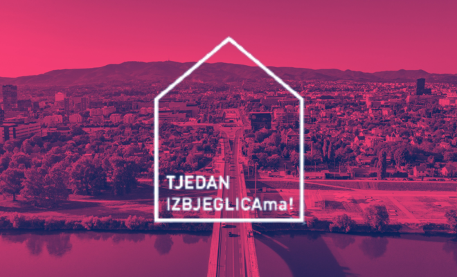

### AYS Daily Digest 11/06/21: Moria 6 ongoing trial — no transparency, no justice?
#### The Moria 6 case as a reflection of the EU problem / Hungary given 2 months to notify the Commission of the measures taken to ensure the full transposition of the Asylum Directive / In Croatia, the fight for fair treatment of asylees by the banks continues / Calls for support, recommended reads, weekly updates & more

](assets/a0450e9bc1ae/0*IqKCwGXsXoFVf6RM)

“Destroy camps and borders — not the lives of the 6 innocent migrants from the Moria trial” Banner at the Syntagma square of Athens\.” Photo and caption credit: [Solidarity with Migrants](https://twitter.com/MigrantsSoli/status/1403324310555664385/photo/1)
#### FEATURE
#### Free the Moria 6\!

Today was the first day of the trial for the remaining Moria 6, which took place on Chios\. Two minors have already been tried and found guilty in a trial full of irregularities\. The remaining four are [charged with intentional arson](https://greekreporter.com/2021/06/11/four-afghans-on-trial-for-burning-down-migrant-camp-at-greeces-lesvos?fbclid=IwAR3GJHwk1kp9qhn0bbpJrONLfu-6Hl2K2oWJv-MKn1ZOn84iWIP9pgXJbHM) and membership in a criminal group for their alleged role in the fire that burnt down the already hellish Moria camp last September\.

There was a **lack of transparency around the trial\.** Many people were excluded from the trial with the excuse of following COVID\-19 measures\. Foreign journalists were [not allowed to enter](https://www.rnd.de/politik/nach-mutmasslicher-brandstiftung-in-moria-prozess-ohne-oeffentlichkeit-CDGMLLFABE62JLLBUXP3QGMAKI.html?fbclid=IwAR056LpPaKbGYN-PfwQ-d0_CFcUbivYH8ytMezk6d6PvQvxr9vP6ut8Jhe0) the courthouse, and domestic **members of the press were also restricted** \. Local media, including Astrapartis\.gr’s director Giannis Stevis, denounced the decision to exclude media from the trial, saying it was [unprecedented](https://astraparis.gr/protofanis-energeia-o-apokleismos-ton-dimosiografon-apo-tin-kalypsi-tis-dikis/?fbclid=IwAR2yhHTyHkKN7Mk1l1z2XmhZ1nYqTJSvv87jAadhLhgNVmEzMymcxqa6dV8) \. International legal observers, including a lawyer from the High Commission, were also barred from entering\.

> The trial was laughably called “public” even though [only 15 people](https://twitter.com/lnob2020/status/1403269844892622850?s=03&fbclid=IwAR24-WH6VHiGoqigrfVE3e-b7WQJ3wjB4KNxf9k-0c4x0rEZycXPcqFd4ps) were allowed inside—including at least 6 police officers to guard 4 teenagers\. No members of the public were allowed entry to the “public” trial\. 

Inside the court, proceedings were also questionable\. Authorities rejected [three of the defense’s objections](https://www.efsyn.gr/ellada/dikaiosyni/297855_me-kleistes-portes-i-diki-ton-4-tis-morias-enstaseis-apo-toys-dikigoroys) \. Even though the four are **teenagers and three were minors** when they were arrested, they will be **tried in an adult court** , not a juvenile one\. The case file was served in Greek, a language none of the defendants understand\. Finally, the main eyewitness, who has since disappeared from Moria and was possibly motivated by prejudice against Hazara people \(all the defendants are Hazara\), still had his testimony read in court even though the defence cannot cross\-examine him\. No other person has identified the Moria 6 as the arsonists\.

**People gathered to show their solidarity [in front of the courthouse](https://twitter.com/Theurgia_Goetia/status/1403269386698379268) in Chios\. They serenaded the four with chants of “ [freedom”](https://twitter.com/lnob2020/status/1403446824430714891?fbclid=IwAR03yVZLiH3Agf_9PXPBWUvkIg82gy_YoNinYE5DHqCzd5CtPBmqLH6Wmgw) as they left the court after a 12\-hour trial\. Others [gathered in Athens](https://twitter.com/MigrantsSoli/status/1403324310555664385?fbclid=IwAR3tA8oSnPcCmr0BFYfWZTloFTupt2m8W7Hz-zVxI8sQOH-ctpXXhbPiDhU) as well\.**

The trial will continue tomorrow morning\. Legal Centre Lesvos, [whose thread today](https://twitter.com/lesboslegal/status/1403289918827343876) provided detailed updates on the proceedings, will also continue their coverage tomorrow, and we recommend following them\.

There are huge issues at stake in this trial\. First, we are talking about the lives and futures of four young people who have been arrested just because the state needed a culprit\. This case is also bigger than the Moria 6\. It is sadly just the latest incident in a pattern where the Greek legal system hands down “ [draconian](https://twitter.com/teammareliberum/status/1403374863864274947?fbclid=IwAR3GJHwk1kp9qhn0bbpJrONLfu-6Hl2K2oWJv-MKn1ZOn84iWIP9pgXJbHM) ” sentences to people on the move in trials that are [rarely fair](https://mare-liberum.org/en/230-years-in-prison-the-systematic-criminalisation-and-imprisonment-of-people-on-the-move-in-greece/) \. 
It is also a symptom of a **European\-wide problem** where migration, as well as solidarity work, are criminalized, while murder at the borders goes unpunished\.

■■■■■■■■■■■■■■ 
> **[Sea-Watch International](https://twitter.com/seawatch_intl) @ Twitter Says:** 

> > We stand up against the criminalization of people on the move and of sea rescuers. Because flight is not a crime, sea rescue is not a crime, solidarity is not a crime! #FreeMoria6 #FreeElHiblu3 #FreeIuventa10 #FreeTheShips #SeaRescueIsNotACrime https://t.co/wCPxCvGvLO 

> **Tweeted at [2021-06-10 15:00:03](https://twitter.com/seawatch_intl/status/1403004035477565441).** 

■■■■■■■■■■■■■■ 

#### LIBYA
### Over 200 people pulled btoack to Libya

The so\-called Libyan coast guard pulled back [over 200 people](https://twitter.com/msehlisafa/status/1403365140465176584?fbclid=IwAR3Dddb4S4B8ZA5m8BJ-LUx_ZDaIh1OGoDLkxzaNn1lq9sZKsLfB65x0mgg) today, bringing this year’s total to over 11,000 people returned to almost\-certain torture in Libya\. Seemingly the Council of Europe’s warnings [back in March](https://www.coe.int/en/web/commissioner/-/european-countries-must-urgently-change-their-migration-policies-which-endanger-refugees-and-migrants-crossing-the-mediterranean?fbclid=IwAR1AU0Wdkki6DngU21OuNuS-KGE0ETeTvA0kiy3cBB2H3sbfTk4drl2c4aY) that Europe must change its migration policy, including cooperation with Libya, have gone unheeded\.
#### GREECE
### ECRE legal note examines asylum in Greece

Despite individual successes, the asylum system in Greece remains “ [beyond judicial control](https://www.ecre.org/ecre-legal-note-9-asylum-in-greece-a-situation-beyond-judicial-control/?fbclid=IwAR3FQiHOAFyAonIdP9G_GtCEy0VwKeNizPibxiICT-rbsQFbMcVP-H5LgJY) \.” The situation on the ground does not often match EU and Greek law\. Authorities do not implement legal requirements for reception conditions, unlawful returns, and more\. There is no political will to implement legal decisions\.
### Updates from Lesvos

We are sad to share the news that a renowned volunteer and light in the Skala Sikamineas community, Dimitri, has passed away\. Lighthouse Relief published [this post](https://www.facebook.com/lighthouserelief/posts/4009793105809867) remembering her life\.
### Support the cause\!

Khora’s [panel discussion last week](https://www.facebook.com/KhoraAthens/posts/1778209242351676) on the barriers for asylum seekers in Greece is now available to watch online\. You can view it [here](https://www.facebook.com/watch/live/?v=318558743098416&ref=watch_permalink) \. You can support the work of Khora’s legal team by donating [here](https://khorafundraising.org/khorafundraising/index.php?fbclid=IwAR2H-8iwSL6LwoP2IzfsydjZLKXQrvemmK5K8pFmI2gLVFezf7n9tRgh4J4) \.

Khora’s valuable work includes producing asylum fact sheets such as [this one](https://www.facebook.com/KhoraAthens/posts/1778385109000756) , which discusses malpractice surrounding age assessments\. Greek and European authorities often misidentify children as adults, robbing them of protections they would be entitled to due to their age\.

Another initiative worth supporting is Donate4Refugees’ fundraiser for displaced people in Athens\. Learn more and donate [here](https://www.facebook.com/donate/503865134070320/) \.
#### CROATIA
### The fight for fair treatment by the banks continues

Along with a few more organisations providing support to people on the move and asylees in Croatia, AYS has written to the Economic Interest Group Croatian Banking Association \(EIG CBA\), the national banks’ trade association, demanding a change in their practices in relation to people under international protection in Croatia, some of whom have been deprived of the right to use bank services and denied the opening of accounts to be able to receive salaries and/or child social welfare, as they were treated as third country nationals from countries earmarked by the latest Money Laundering and Terrorism Financing Prevention Act, following the Directive \(EU\) 2015/849\. Previous appeals to the Ombudswoman, who requested an explanation from the banks, did not result in any changes, so we continue on our own attempts to get the banks’ MO to change when it comes to bank users who are persons under international protection in Croatia\.
### Eighth Refugee Weeks

The Coordination for Integration, an informal network of civil society organisations that provide support in integration, is organising the 8th edition of the program titled [8\. Tjedni IZBJEGLICAma\!](https://www.facebook.com/events/311018490555519/) \(Refugee Weeks\), which will take place from June 7th until June 20th, World Refugee Day\. Events take place in Zagreb, Osijek, Split, Sisak, Rijeka, Kutina, Karlovac and Mljet\. They include panels, round tables, presentations, interactive workshops, photo exhibitions, webinars and a lot of getting together\.
#### HUNGARY
### Commission calls on Hungary to fully implement the Asylum Procedures Directive

Hungary has failed to fully transpose the Asylum Procedures Directive, which sets out common procedures for examining applications for international protection across the EU\. 
The reasoned opinion follows the letter of formal notice sent by the Commission in September 2015, covering provisions on the personal interview, the medical screening and guarantees for unaccompanied children and teenagers\.

> _Hungary now has two months to notify the Commission of the measures taken to ensure the full transposition of the Directive\. In the absence of a satisfactory response, the Commission may refer the case to the Court of Justice for the first part and send a reasoned opinion for the rest of the provisions yet to be implemented\._ 

#### ITALY
### New arrivals in Lampedusa

[Over 100 people](https://livesicilia.it/2021/06/11/nuovo-sbarco-a-lampedusa-arrivano-88-migranti/?fbclid=IwAR056LpPaKbGYN-PfwQ-d0_CFcUbivYH8ytMezk6d6PvQvxr9vP6ut8Jhe0) arrived on Lampedusa over the past day\. A total of 25 people arrived last night and another 88 arrived this morning\. They were transferred to quarantine ships\.
#### HUNGARY
#### Orban wants to ban people on the move for two years

Hungary’s authoritarian and xenophobic Prime Minister’s latest proposal is to ban people on the move from the country completely for two years, citing the pandemic\. He gave this speech on state radio, which was peppered with far\-right rhetoric such as describing “migrant armies” and claiming that people should stay where they were born “according to God’s will\.” While it is unlikely that this will become law any time soon, the normalization of this type of rhetoric speaks poorly about the treatment of people on the move in Hungary\.
#### BELGIUM
### Ikea to train people on the move

Ikea announced a program to train people on the move and give them work experience in its Belgian stores\. However, the program will only have space [for 80 people](https://www.brusselstimes.com/news/business/173546/ikea-will-train-refugees-and-provide-them-with-work-experience-in-belgium/?fbclid=IwAR3l64LsR7xbPYUaMSNMAlog8O5Q2xRFuwff73J8nbF5hWLmAtOHTHZ1_og) , although Ikea’s similar programs globally have a reach of thousands\.
#### DENMARK
### The human cost of deportations

Among the victims of Denmark’s arbitrary decision to revoke residency permits for hundreds of people is [Rihab Kassem](https://www.aljazeera.com/news/2021/6/10/denmark-refugee-grandmother-told-to-return-to-syria?fbclid=IwAR386qCiMUcC9LtvaNgUMoMcIj04xJpFcil2v53HmeqrO8PIOvljhn5vLDc) , a mother and grandmother whose son is a Danish citizen\. She has no home to return to and will not receive the medical care she needs in Syria for her lung problems, which were caused by a gas attack by the Syrian regime\.

The decision was also criticized by [Jan Egeland](https://norwaytoday.info/news/jan-egeland-attacks-denmarks-asylum-policy-stingy-petty-and-hypocritical/?fbclid=IwAR3Dddb4S4B8ZA5m8BJ-LUx_ZDaIh1OGoDLkxzaNn1lq9sZKsLfB65x0mgg) , head of the Norwegian Refugee Council\.
#### UK
### 179 arrivals in Kent

The Home Office has released numbers for arrivals from Wednesday\. A total o [179 people](https://www.bbc.com/news/uk-england-kent-57425111?fbclid=IwAR0BC3DqO7VWIwbhquLls83m2MPo0L3DumgKJR6a8bQkpa3KhpDR7UDfh9U) crossed the Channel in small boats\. Over 4,000 people have reached the shores of the UK in 2021 so far\.

[This article](http://www.exils.org/channel-crossings/?fbclid=IwAR3pwOqKFmhb9l9Oxln0g4XFrusxNIpMI0GIUHxPto6-KIABLxHXhj_1DeM) \(in French\) provides background context about Channel crossings since 2018\.
#### EU/FRONTEX
### Former deputy says Frontex ignoring human rights violations

Gil Arias Fernandez, the [former deputy head](https://www.theguardian.com/global-development/2021/jun/11/frontex-turning-blind-eye-to-human-rights-violations-says-former-deputy?fbclid=IwAR1BgeQTL336_CrTF-nskRVBNq5kQiWQTwfzP40Gdq4I_53kUgynRdqHorU) of Frontex, criticized the agency’s vulnerability to far\-right infiltration, its decision to use weapons, and its complicity in human rights violations\. However, Fernandez stopped short of saying the agency perpetrated human rights violations, saying instead it was guilty of ignoring them when others perpetrated them\.

France is joining Italy in [flying drones](https://twitter.com/matthimon/status/1403271826042765313?fbclid=IwAR3h9kuR7io9_jhkihhkTSrCU_GipRfzX2cZdSjS4aH3q-Z5TySeftaUDwM) in the Mediterranean as part of Operation Irini, which is allegedly to stop smuggling\.

Besides its perpetration of human rights violations, Frontex is also unable to [handle criticism](https://twitter.com/fragdenstaat/status/1403258531378307075) \. FragDenStaat uncovered [35 pages](https://fragdenstaat.de/dokumente/21236-frontex-emails/?fbclid=IwAR3rYf77H741pHNzHxucaKhoDkv2ST4d2_QxNkbbSAT_JWB-eO8CBLaj95w) of corrections requests that the agency sent to the media whining about its coverage\. Meanwhile, there is a [defamation case](https://racistcrimeswatch.wordpress.com/2021/06/11/1-1199/?fbclid=IwAR1AUzZ2FqNann22sORxJEVLzlSg3DFEsHRoqQj_m-IvIBEazwpZiXsVrQ8) against Leggeri for his statements claiming that Frontex’s complicity in pushbacks were Turkish propaganda\.
#### GENERAL
### Important weekly updates

The [ECRE Weekly Bulletin](https://mailchi.mp/ecre/ecre-weekly-bulletin-11062021?e=1fd2db1ebf&fbclid=IwAR0Opbt17oZVue3HtVtWJ8GULpNhGjdW8FUehpvgSKEk5-khSo32wl76TEo) is out, and you can read it here\.

The ELENA Weekly Legal Update is [also out\.](https://mailchi.mp/ecre/elena-weekly-legal-update-11-june-2021?e=1fd2db1ebf&fbclid=IwAR0gqpLEVzsYwb3F_DLGg2iqBswiF4Vkx6zTmuVx_jdzcnllxItLmAmPgxA)
#### WORTH READING
- [This article](https://wearesolomon.com/mag/on-the-move/greek-strawberries-made-in-bangladesh/?fbclid=IwAR2c5eh2Ei1gWmpWAu2t_P4_r-xQIaPS-EkFl3Xa0WUWfWC8bePB6DMUucA) from Solomon talks about the growing Bangladeshi community in Greece’s strawberry\-producing areas\.
- [This article](https://www.vice.com/en/article/k7873m/how-the-dollar68-billion-border-surveillance-industrial-complex-affects-us-all?fbclid=IwAR3L_VQA9j0uyKw2YHg7C63oy_vyCYiDKghZDRjvWLmSgnOsTpQ_Z2_Sz8Y) discusses the effects of the world’s multi\-billion\-euro border surveillance complex and how it affects the privacy even of people away from the borders\. While we should care even about issues when they only affect people on the move, this is a chilling look in the way the militarization complex affects everyone\.
- A little beyond our usual geographic overview, but [this article](https://www.economist.com/middle-east-and-africa/2021/06/12/lebanese-move-to-west-africa-escaping-the-crisis-at-home?fbclid=IwAR1AU0Wdkki6DngU21OuNuS-KGE0ETeTvA0kiy3cBB2H3sbfTk4drl2c4aY) tackles an interesting phenomenon of Lebanese people who are moving to West Africa in search of economic opportunity\.

#### WORTH ATTENDING
- Lancet Migration’s European Regional Hub is launching on June 22nd\. To learn more about this research network, [go here](https://twitter.com/miriamorcutt/status/1403294873101475844?fbclid=IwAR3RU4GMo6g71hcN_PXW2x0fjbhR2MatI1rrLGUp3D8XBtFsYpR5jO-lpkk) \.
- Tomorrow, a member of BVMN’s network will speak at the Dear White People festival in Freiburg\. Learn more about the event [here](https://twitter.com/Border_Violence/status/1403350764475535370?fbclid=IwAR3jCweYQ3pIz7p0ehhcuuqXoY4fHzSPXrHecmf0h_oSP27vDXEpCuNcYD0) \.

### Find daily updates and special reports on our [Medium page](https://medium.com/are-you-syrious) \.

**If you wish to contribute, either by writing a report or a story or by joining the info gathering team, please let us know\.**

**We strive to echo correct news from the ground through collaboration and fairness\. Every effort has been made to credit organisations and individuals with regard to the supply of information, video, and photo material \(in cases where the source wanted to be accredited\) \. Please notify us regarding corrections\.**

**If there’s anything you want to share or comment on, contact us through Facebook, Twitter or write to: areyousyrious@gmail\.com** 
**\(Note: We use no other \(private\) address as AYS official email contact\)**

_Converted [Medium Post](https://medium.com/are-you-syrious/ays-daily-digest-11-06-21-moria-6-ongoing-trial-no-transparency-no-justice-a0450e9bc1ae) by [ZMediumToMarkdown](https://github.com/ZhgChgLi/ZMediumToMarkdown)._
