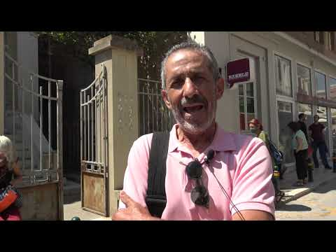

### AYS Special: Serious doubts on rule of law after verdict against Moria6

_The teenagers accused of setting fire to Moria in September 2020 were convicted and sentenced to long prison sentences\. The trial raises serious questions about the rule of law on the Greek islands, especially when it comes to people on the move\. The judgment is yet another mosaic in Europe’s message: Moria was not a camp, Moria 2\.0 remains a persistent system of systematically shattering the rights and dignity of people who dare to hope for asylum\._

 \)](assets/49e000dd5915/1*qSZaTsfPBp11GvIxouZYPw.jpeg)

\(Image Credit: [Aegean Migrant Solidarity](https://www.facebook.com/CPTLesvos/photos/basw.AbrnBcvWzkwcIeU0OXG6O9G4J_diyhJjCko042dlzBYLINnQ5VzeYbgVMXINbi0FRBun9aCWuMEIW2kiRZWeu1GNeJIiiFVnt2fUwdsrKhQGOh27AmJ9pvbigsWj3zMnyzObrUYErkhLNyawr4A1YwAw/2900818476851581) \)

On Saturday 12th of June 2021, four of the six teenagers accused of having caused the fire that destroyed the notorious Moria camp on Lesvos on 8th of September 2020 were sentenced to 10 years in prison\. [Two other young people, also accused of being involved were sentenced in March to 5 years in prison\.](https://legalcentrelesvos.org/2021/03/09/justice-for-the-moria-6/) The four young Afghans now convicted were charged with arson with endangerment of human life, destruction of private property and membership in a criminal organization\. They were arrested and now convicted following the statement of a single eyewitness who claims to have seen them setting fire to Moria — and who is no longer traceable\. The trial started on Friday morning and was closed Saturday midday\.

Defence lawyer Effie Doussi said after the trial:

> “This unfair decision is even worse than the punishment because it kills the law and denies its very existence\.” 

### The Trial

Allegedly due to pandemic\-restrictions, the public, including journalists and independent trial observers, where not allowed to follow the proceedings in the court room\. According to sources from outside the court, three international Human Rights observers, among them one from UNCHR, were also denied access even though they registered in advance\. However, at least four police officers were present inside the courtroom, despite the high police presence around the building\. The journalist and director of the local newspaper Astraparis, Giannis Stevis, denounced the exclusion of the press as an unpreceded decision of the court\.

The trial started with several requests by the defence, all of them were rejected by the judges\. First of all, the defence lawyers from Legal Centre Lesvos requested the court to hold the proceedings for three of the four accused at a juvenile court, arguing that they were minors at the time of the fire\. To prove that they were juveniles, the defence brought the birth certificate of one of the accused as well as medical documents stating a younger age\.

> However, the court rejected the request and followed the initial age assessment that was conducted, according to support networks, by an anthropologist and a criminologist instead of a physician\. 

The second request concerned the inadequate translation provided for the accused and was equally rejected\. The final request regarded the fact that the defence had no chance to question the main witness, as he did not appear in court\. The only known piece of evidence linking the accused to the offence, is a written statement by one man who is no longer traceable\. It is very likely that he is no longer on the island of Lesvos, [some observers even say he was provided with papers to leave the island by the police after having given the statement\.](https://twitter.com/PioManterola/status/1403668054324744194)

These rumours are not without any basis: in a case against eight men who were accused of arson and attacking the police during protests in Moria in March 2018 the only eye witness also disappeared after giving a written statement\.

> He later send a video to one of the defendants apologizing for having given false witness, saying he had been threatened and had to leave Mytilini\. 

After giving the false testimony, the police arranged for him to leave the island, [as reported by the independent monitoring group Deportation Monitoring Aegean](https://dm-aegean.bordermonitoring.eu/2019/02/23/moria-8-declared-innocent/) \. In this case, the accused were later declared innocent\. 

In the present case of the Moria 6, the main witness is said to have been an influential person within the Pashtun community in Moria\. The defendants in turn all belong to the Hazara minority community which suffers from discrimination from the Pashtun majority in Afghanistan\. The tension between the two communities also played a role in Moria\. The defence called for the written statement to be excluded from the hearing of evidence, citing the right to cross\-examine prosecution witnesses as enshrined in the European Convention on Human Rights \(Art\. 6\) \. This request was also rejected\.

In total, 15 witnesses of the persecution were heard, mainly people who lost property in the fire, none of them identifying the defendants\. The defence presented three witnesses\. After a long first day in court, the defendants left the court room to be taken to back to prison at around 9 pm on Friday evening, accompanied by shouts of “azadi”, the Farsi word for Freedom\.

■■■■■■■■■■■■■■ 
> **[#LeaveNoOneBehind](https://twitter.com/lnob2020) @ Twitter Says:** 

> > After a 12h long trial, people in solidarity with the #Moria6 are chanting "freedom" as the four young defendants are guided into police cars. 

Their verdict will follow tomorrow at 10 a.m. 

#FreeMoria6 https://t.co/R4msCnQh2X 

> **Tweeted at [2021-06-11 20:19:32](https://twitter.com/lnob2020/status/1403446824430714891).** 

■■■■■■■■■■■■■■ 

Legal Centre Lesvos reported about the proceedings in this thread:

■■■■■■■■■■■■■■ 
> **[Legal Centre Lesvos](https://twitter.com/lesboslegal) @ Twitter Says:** 

> > We are at the trial of four of the Moria 6, today in Chios.#FreeMoria6 

> **Tweeted at [2021-06-11 07:24:17](https://twitter.com/lesboslegal/status/1403251726958923779).** 

■■■■■■■■■■■■■■ 

The trial resumed on Saturday morning at 10 am\. After hearing the final speeches, the three judges and four members of the jury came to an unanimous decision\. They declared the accused guilty of arson with endangerment of human life with aggravating circumstances of property destruction\. The charges of membership in a criminal group were dropped\. The four teenagers were sentenced to 10 years in prison each, without suspension\. No mitigating circumstances were taken into account\. After the trial, the defence lawyers Natasha Dailiani, Effie Doussi and Vicky Aggelidou expressed their anger and disbelief, but also their will to continue to fight for freedom for the Moria6\.

■■■■■■■■■■■■■■ 
> **[Solidarity Campaign FreetheMoria6](https://twitter.com/freethemoriasix) @ Twitter Says:** 

> > #FreeTheMoria6 “The only witness who identified the accused did not present himself to the court. His written testimony only mentioned the first names of six people and was full of lies and inconsistencies.” Defense lawyer Natasha Dailiani https://t.co/UTE1nLrYd9 

> **Tweeted at [2021-06-12 16:35:20](https://twitter.com/freethemoriasix/status/1403752790711848962).** 

■■■■■■■■■■■■■■ 

After the trial the defence lawyers lodged an appeal and expressed their willingness to fight for justice for the Moria 6:

■■■■■■■■■■■■■■ 
> **[Solidarity Campaign FreetheMoria6](https://twitter.com/freethemoriasix) @ Twitter Says:** 

> > #freethemoria6 "Every meaning of legality was violated during the pre-trial and the trial procedure. If the next court goes on with the same violations the judges of the European Court of Human Rights will definitely laugh.” Defense lawyer" Vicky Aggelidou 

> **Tweeted at [2021-06-12 15:27:38](https://twitter.com/freethemoriasix/status/1403735753423822848).** 

■■■■■■■■■■■■■■ 

Prior to the trial, [70 human right organizations had expressed their concern and called for fair and transparent proceedings\.](https://freethemoria6.noblogs.org/english-call-for-a-fair-and-transparent-trial-for-the-accused-moria-6-based-on-the-presumption-of-innocence/) Are You Syriou? was one of the signatories\.

> “We are deeply concerned that their right to a fair and just trial based on the presumption of innocence is not guaranteed and that they are instead made scapegoats for the inhumane EU migration policy\. We stand in solidarity with the Moria 6 & against the deadly European border regime\!” 

It seems like these calls have been in vain\.

■■■■■■■■■■■■■■ 
> **[Solidarity Campaign FreetheMoria6](https://twitter.com/freethemoriasix) @ Twitter Says:** 

> > Statement from defense lawyer Natasha Dailiani after the trial: “The only witness who identified the defendants didn’t present himself to the court. His written testimony was full of lies and inconsistencies.”
#FreeTheMoria6 https://t.co/pF2ipo0tnZ 

> **Tweeted at [2021-06-12 16:48:29](https://twitter.com/freethemoriasix/status/1403756100864942084).** 

■■■■■■■■■■■■■■ 

### Non\- transparent and unfair court proceedings: a systematic practice against People on the Move

The non\-transparent and unfair case of the Moria6 is far from being a singularity\. Alongside the executive forces that conduct pushbacks on a regular basis and the legislative power that continues to issue laws that limit the access to the asylum system and dignified living conditions \(latest: [recognizing Turkey as safe third country](https://www.keeptalkinggreece.com/2021/06/07/greece-turkey-safe-country-asylum-seekers/) \), the judicative is taking an ever\-increasing part in illegitimate and discriminatory behaviour against people on the move\.

Already the trial at a juvenile court of the two youngsters accused of setting the fire in Moria, who were convicted in March, was described as “a cross miscarriage of justice”, as [Legal Centre Lesvos states](https://legalcentrelesvos.org/2021/03/09/justice-for-the-moria-6/) \.

> They were also convicted based only on the written statement of someone who claimed to identify them but did not appear in court\. 

In 2017, 35 residents of Moria were arrested after a peaceful protest in the camp, on charges of dangerous bodily harm against police officers\. While some of them were not even in the camp at the time of the protests, they were nevertheless sentenced to a 26\-month suspended prison sentences, after spending 10–15 months in pre\-trial detention\. In 2021 they were finally cleared of all charges in the appeal proceedings\. The brutal police violence against them during the arrest that sparked a [statement by Amnesty International](https://www.amnesty.org/download/Documents/EUR2568452017ENGLISH.pdf) was not investigated by Greek authorities\.

Another shocking but systematic juridical practice is the conviction for human smuggling of people that arrive on boats to the islands\. Upon arrival of boats with People on the Move, the present Hellenic Police, Hellenic Coast Guard or Frontex will try to establish who steered the boat in order to accuse that person of smuggling\. In some cases the authorities would even accuse the person that made an emergency call\. [A report published by Aegean Migrant Solidarity, bordermonitoring\.eu and borderline\-europe analysed 48 trials of alleged human smuggling from 2016–2019](https://bordermonitoring.eu/wp-content/uploads/2020/12/report-2020-smuggling-en_web.pdf) \. All of the people accused in these trials were convicted\. The average sentence that included human smuggling was 48\.65 years, with an average prison sentence of 19\.90 years plus a penalty fee of 396,687 Euros\. **The average duration of these trials was 38 minutes\.**
### No way out of Moria

Until today, the circumstances of the starting of the fire remain unclear\. Little is needed to cause a wildfire after a hot Greek summer, [especially in camps with bad wiring and insecure cooking facilities\.](https://www.infomigrants.net/en/post/30853/fires-in-migrant-camps-most-fires-are-caused-by-bad-wiring?fbclid=IwAR3dgDjTYpMzJNip-S1zciRrIW_qInW3tfn6nZawASeUz7RcPio2cIwHcbQ) However, it is also well known that many people were sick and tired of the Moria camp in 2020\. [Right\-wing activists attacked People on the Move, support structures and the camp itself regularly](ays-special-lesvos-well-beyond-the-brink-this-is-what-we-know-so-far-7c11873e12f8) \. On the 20th of August 2020, only two weeks before the fire, in the course of a President’s visit the Medicins Sans Frontieres clinic was attacked by right wing protesters\. [Besides throwing stones towards medical personal and threatening them verbally, a fire was started outside the clinic\.](https://www.msf.org/msf-statement-violent-protest-outside-greeces-moria-camp)

But the atmosphere was explosive inside the camp\. It was four times over its initial capacity, there was no running water during a global pandemic, no options to practice social distancing and no hope whatsoever that anything could change any time soon\. In addition, COVID\-19 reached the camp at the beginning of September, causing a strict lockdown to be imposed\. Frustration was high and protests took place on a regular base\.

Only one day after the fire, the Greek Minister for Migration Mitarachi claimed in an [interview with BBC](https://www.bbc.com/news/world-europe-54082201) that the “incidents in Moria began with the asylum seekers because of the quarantine imposed”, without offering any evidence\. On the 15th of September, the day of arrest of the accused teenagers, [Mitarachis declared them guilty in an interview with CNN,](https://www.youtube.com/watch?v=52lWG65Wbq4) saying:

> “The police have arrested six residents of the camp for causing the fires … When people come to our country and apply for asylum, they need to respect the country they’re in, they need to respect our laws and our regulations\.” 

In [Greek media,](https://twitter.com/ninarei/status/1305902258563973122?fbclid=IwAR09kc16JxAq2hx4BK8Z136G7c6ArLYtFEBwfojBzb9-xZkTtrI1f1fTGVQ) the presumption of innocence was also regularly ignored\.

While apart from the dubious written statement no evidence was provided to link the arrested teenagers to the fire, Greek authorities were fast in closing the case\.

Yesterday’s Court ruling cements the insidious system of absolute disregard of the wellbeing of people on the move on the one hand and unrelenting and arbitrary punishment on the other hand\. After Moria burned down, it is plain to see: The Moria camp was only one cornerstone in Europe’s approach towards people on the move\. The system of Moria, a system that is willing to do everything to stop people from actually daring to hope for safe and humane asylum, is here to stay\. There is no escape from this system\. It chooses victims indiscriminately in order to make an example of what it is capable of\. There is more to come\.
### Find daily updates and special reports on our [Medium page](https://medium.com/are-you-syrious) \.

**If you wish to contribute, either by writing a report or a story, or by joining the info gathering team, please let us know\.**

**We strive to echo correct news from the ground through collaboration and fairness\. Every effort has been made to credit organisations and individuals with regard to the supply of information, video, and photo material \(in cases where the source wanted to be accredited\) \. Please notify us regarding corrections\.**

**If there’s anything you want to share or comment, contact us through Facebook, Twitter or write to: areyousyrious@gmail\.com**

_Converted [Medium Post](https://medium.com/are-you-syrious/ays-special-serious-doubts-on-rule-of-law-after-verdict-against-moria6-49e000dd5915) by [ZMediumToMarkdown](https://github.com/ZhgChgLi/ZMediumToMarkdown)._
