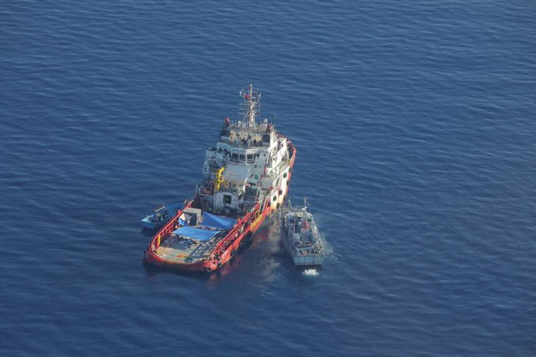

### AYS Daily Digest 15/6/21: ‘Saved’ to be sent to certain detention and torture
#### Israel supporting repression in Greece// “Significant delays in the creation of new infrastructure” for the new camps in the Aegean// Situation in Serbia// Shipwreck takes more lives of Yemenis trying to escape misery// EP says it wants for EU to take the lead in SAR missions

Photo: Seabird/Sea\-Watch
#### FEATURED

Several organisations engaging in search and rescue missions at sea have reported that the people rescued by the merchant ship Vos Triton were then transferred against their will to a Libyan vessel and sent back to Libya, thus returned to conditions of detention, torture, and rape\.

■■■■■■■■■■■■■■ 
> **[Sea-Watch International](https://twitter.com/seawatch_intl) @ Twitter Says:** 

> > A sad recap of another illegal push-back, in which the supply ship #VosTriton first rescued people in distress far too late and then arranged that the rescued people were pushed back to #Libya against international law. https://t.co/suf5Aty7it 

> **Tweeted at [2021-06-15 17:13:16](https://twitter.com/seawatch_intl/status/1404849501429501952).** 

■■■■■■■■■■■■■■ 

This occurs at the same time as Italy and Malta refused to provide a port to the rescue vessel Geo Barents’, with 410 rescued people on board\. These ongoing situations at sea are just a few of those that Sea Watch has been reporting on, and is a burning issue across the Mediterranean, despite being actively ignored by the EU:

> In addition to the [**\#VosTriton**](https://twitter.com/hashtag/VosTriton?src=hashtag_click) case, [\#Seabird](https://twitter.com/hashtag/Seabird?src=hashtag_click) sighted 9 other boats: 1 was pulled back — probably involving a [\#Frontex](https://twitter.com/hashtag/Frontex?src=hashtag_click) drone\. 2 were rescued by the Italian Coast Guard\. 1 with smoking engine will probably be intercepted soon too\. 

The boat’s meeting with the Libyan Coast Guard vessel prompted many warnings from various sides\. One of them came from MSF:

■■■■■■■■■■■■■■ 
> **[MSF Sea](https://twitter.com/MSF_Sea) @ Twitter Says:** 

> > By transferring rescued people to a LCGvessel #VosTriton knowingly contributes to forcible returns to Libya where people are arbitrarily detained at risk of abuse. This has been the case for 12,794 migrants and refugees intercepted&amp;returned to Libya since Jan 2021. 

> **Tweeted at [2021-06-15 11:36:10](https://twitter.com/msf_sea/status/1404764668476919810).** 

■■■■■■■■■■■■■■ 

In the meantime, more resistance on the waters — SAR vessel Nadir now sails under [RESQSHIP](https://twitter.com/resqship) \!

■■■■■■■■■■■■■■ 
> **[RESQSHIP](https://twitter.com/resqship) @ Twitter Says:** 

> > Our new ship is called #Nadir. Not just any name, but that of a man who lost his son while fleeing to Europe. This is the reason he now faces 10 years in prison. His story must not go unheard. (1/10) https://t.co/sSJZZ4nnXl 

> **Tweeted at [2021-06-14 18:56:50](https://twitter.com/resqship/status/1404513174943113216).** 

■■■■■■■■■■■■■■ 

More people have been returned to Libya so far this year than in the entire previous year\. The president of the European parliament said on June 14 that it is no longer acceptable to leave this responsibility only to NGOs, and insisted that the EU takes the lead in SAR missions\. [The statement](https://l.facebook.com/l.php?u=https%3A%2F%2Ftwitter.com%2FEP_President%2Fstatus%2F1404458170995687425%3Ffbclid%3DIwAR0vZbSDk6ctnPuPXsewDkrFe9NT9wKVW49DwMTzkNDwCtzB18ifSF-gCag&h=AT2jAcXUs0Unf_4Bt3Qlgj3Q8gyWHb6VnQPyYn-BdmAif5euR6ZNNr5-1dwDRCAEMpbRys2aGr14h5ET1kma8BU2zaJPhjm8BVvklcYxurvyKnnVDPl1qHGcMNB2l0b5-ZU2E6xRMuSG6A&__tn__=R]-R&c[0]=AT2qd1wCgXV5ppDNkE8zK8S3xiRX_Lj0TZBhSLV79UzX0Cj6UWYHy7kzJWLwjSXF7YIRvj6xBZMq8SAs6goqDpcQmTBh00X5AUFzKz9qjT3cU9dO5H8BdddzPReFdvisYYyfeLpYatOoF-thertsvpjXh9UPfvhm6D53Z_8lV40bK_L__jJzuinxEnmqUz5tG3pDnDWFY0hr0kJHXQ) came following the most recent SAR action by MSF’s Geo Barents\.

> That includes using visas and trade as leverage to secure deals for returns, readmission and reintegration\. “The external dimension cannot be an accessory, cannot be an afterthought, it is has to be integrally interwoven at the heart of our overall thinking,” EC Vice\-President [said](https://euobserver.com/migration/152138?s=09&fbclid=IwAR2NsorHgDuiBz_Rx_1qHfPdDqbhzhobkw-Sj-STe_eEAykcnnFh583u4Ws) , noting the EU will have to assume the associated moral costs\. 

#### GREECE
### New closed camps delayed

Delays are reported in the project of building new closed camps in the Aegean: the deadline for submitting applications for participation in the tender for the study and execution of the construction project has been extended until July 22\.

We hope that the extra time will provide an opportunity for the plans and intentions of the new campsite to be examined, and the criticisms and alternatives be taken into account\.

**More local voices on the Moria 6 case:**

■■■■■■■■■■■■■■ 
> **[NoBorderKitchen](https://twitter.com/noborderkitchen) @ Twitter Says:** 

> > Tonight on Radio105FM, Mitllini's alternative radio: 

listen  to Radio:Free Mytillini tonight! Tonight we will have a conversation with two people from a legal support organisation on Lesvos who where present on Chios during the Moria 6 trail.

#antireport #freethemoria6 

> **Tweeted at [2021-06-15 13:02:07](https://twitter.com/noborderkitchen/status/1404786296334209033).** 

■■■■■■■■■■■■■■ 

### Israel leasing drones to Greece, with the option of selling

Israel’s Aerospace Industries IAI will lease Maritime Herons to Greece for a period of three years, with an option to purchase the system upon completion of the leasing period\.

_They are equipped with day and night reconnaissance systems, maritime patrol radars and satellite communications\. They are used for maritime patrol, marine and land border protection, search and rescue, disaster management and more\._

Read [more](https://www.keeptalkinggreece.com/2021/06/15/greece-israel-maritime-heron-drones-leasing-purchase/) \.
#### SERBIA
### Police raids and centre closing during summer

Info Park reports that police raids continue across Serbia, focusing on arresting people on the move without documents \(IDs issued in reception centers\) \. The police organized a raid in Savamala area in Belgrade last week and arrested around a hundred people, who were most likely transferred to Preševo, they assume because no official information by the Ministry of Interior was released afterwards\.

Bujanovac reception center is temporarily closed during the summer because it is under reconstruction\. Families who stayed there were transferred to Vranje RC, while single men and women were sent to Divljana\. Three UASBs are accommodated at the Institute for Upbringing of Children and Youth in Niš and the rest of the people chose to rather leave the RC once they were informed of its closure\.
#### SPAIN
### Frontex coming to the south?\!

Spain might request the presence of Frontex in Ceuta and Melilla, according to a number of media [reports](https://elpais.com/espana/2021-06-15/sanchez-planea-reforzar-ceuta-y-melilla-con-agentes-de-frontex.html?fbclid=IwAR2UBg3Tm2sW8l6fe-uAm_zHY2n-3k5WwM0eFb36NolcQQApxS-NfPwb1dg) \. “The objective is to visualize that the two autonomous cities are the external border of the European Union”, as it is explained, in spite of Spain historically not being inclined to the presence of Frontex in their area\.

The details surrounding the reports, and the conditions under which Frontex may operate are yet to be defined\. It is bizarre, to say the least, given Spain’s previous stance on the matter and the current controversies surrounding Frontex\. However, it also speak plainly regarding to the policies that Spain wishes to impose when it comes to people on the move in Ceuta and Melilla\.
#### WORTH READING
- Report: Those who were sent back to Afghanistan…

- An interview with Afghan asylum seeker:

[](https://l.facebook.com/l.php?u=https%3A%2F%2Fwww.proasyl.de%2Fnews%2Fdie-taliban-vergessen-nichts-sie-werden-sich-raechen%2F%3Ffbclid%3DIwAR1p31474LsaFJmgZfEaB2gLLorb-f03ZQsQQ9bzvjcZJmR5htgJm5gWFS0&h=AT0RnF-n3qxdNLLNUpUWBXDLaSScuA7aFCznhlNQzW-ffUHxysXTqv_lRCmc_hcyfW9Qbp91n_9JqqzrwC_C2Htf8I-Cg1cl8edGGVrN-RhR54VAvBYVUSvFVc7ce-NlGkcjIAgjIicUaA&__tn__=R]-R&c[0]=AT3mHcE2R-dzol6TRgO6fMzbjas2KgdfrdvDchFM-mcmyxQnul0rtg_lajc_eBga2tGrxLnr98P9302iaOq1gcTx7IlEyeahY717thv-zIsfRF73lQz-1W-Jf_g02vNZjntPKgq1ywo-nJ6tn6hzNIQY4ccKm70qL0xfNrzFtIb1_8fTDs-jE6P0AP0MutRRnY67jkqQflM)

- Yemen: seven years into a civil war with poverty, malnutrition and displacement, the tragedy doesn’t stop

- ECRE’s Press Review is [here](https://l.facebook.com/l.php?u=https%3A%2F%2Fmailchi.mp%2Fecre%2Fecre-press-review-15062021%3Ffbclid%3DIwAR3R0xEuOHK3eyNgAp2UwpkaZm8WOzeTedRR22Rt8r3ZsJ6u9tz-aPO2MRo&h=AT0KjkIibJ2O9elB1QqGEZ9nlILtndt4wehFb0OleVhx3O8hmm2tHFPKdZ1B29wMBbSBWfPsG_vzxpc_U0sMdkcwIsfqKv0et5k4SCdE4x4yMDdIcHGD3sjs_6OHQQx22VbWIa2IrHRRLQ&__tn__=R]-R&c[0]=AT0Lsn-eo0OdJ0kL8vMfn8STiD1UUMKw-M792AePJkgYw2qX2psA_mVGAKoc8MU0BfaGe53LKLAESg24-GqzjUFiUbPW1khGPk1LndFldG1MY_byc75a30_YNJiSK1FeYGdnJDLUQnwUntJf5BA8Fo5T2k1Jap2nuSE9gn9_QoeV4HRyqihd7QjnweSaB3FbvHrplC3X_zE)

### Find daily updates and special reports on our [Medium page](https://medium.com/are-you-syrious) \.

**If you wish to contribute, either by writing a report or a story, or by joining the info gathering team, please let us know\.**

**We strive to echo correct news from the ground through collaboration and fairness\. Every effort has been made to credit organisations and individuals with regard to the supply of information, video, and photo material \(in cases where the source wanted to be accredited\) \. Please notify us regarding corrections\.**

**If there’s anything you want to share or comment, contact us through Facebook, Twitter or write to: areyousyrious@gmail\.com**

_Converted [Medium Post](https://medium.com/are-you-syrious/ays-daily-digest-15-6-21-saved-to-be-sent-to-certain-detention-and-torture-bb0cdc06bc92) by [ZMediumToMarkdown](https://github.com/ZhgChgLi/ZMediumToMarkdown)._
