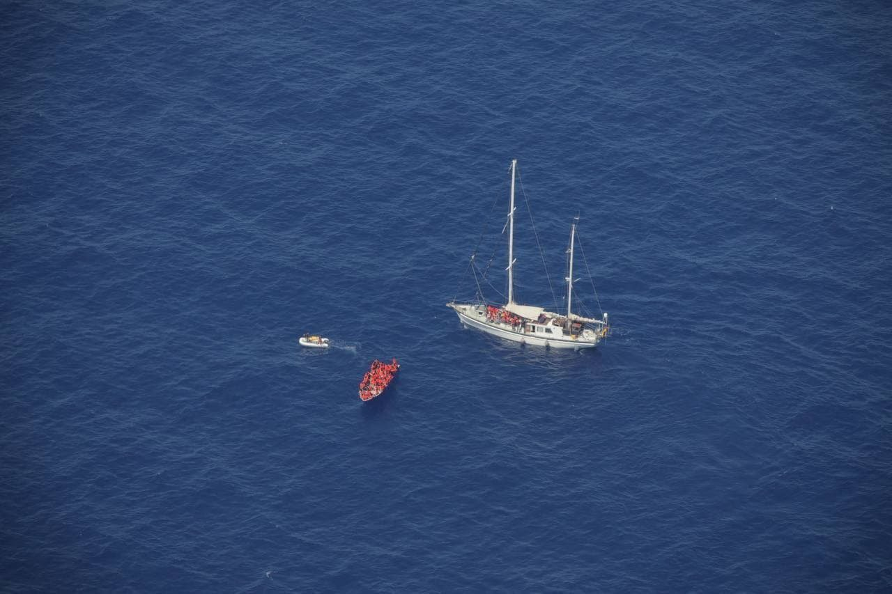

### AYS Daily Digest 17/06/21: More than 13,000 illegal pullbacks to Libya
#### Lebanese bank burns 250 million USD in UN aid // New footage from Malakasa camp // New vaccination campaign in Sicily

More than 13,000 people were pulled back to Libya in 2021 — a place that is not safe for them\. Credits: Twitter/@TilleyMarc
### Lebanon

Lebanese banks have burned at least 250 million dollars in UN humanitarian aid, which was intended to support people on the run and poor communities\. According to Thomson Reuters Foundation, they lost the money by “selling the local currency at highly unfavorable rates”, Al Arabiya [reports](https://english.alarabiya.net/business/economy/2021/06/17/Lebanese-banks-swallow-at-least-250m-in-UN-aid-for-refugees?fbclid=IwAR05zTAat1JLFaxkdfGRbolYv7BIPZhDMDVD9B3dt4mLf1X0n0qjY1ucyFM) \. Due to the economic crisis and inflation, the value of the aid has shrunk despite the amount per person increasing , making it hard for people to get basic supplies like food\.
### Greece

“Despite mounting national and international pressure, Greece is still continuing, business as usual, with pushbacks and the EU stands idly by”, Raphael Shilhav, Oxfam’s EU migration expert [said](https://www.oxfam.org/en/press-releases/alleged-pushbacks-greek-border-are-persistent-and-systematic?fbclid=IwAR2Y9QZho2CO0HtaxyqcrWkBZxXi5hvdXcDxvgXjY-IzYxasikQdMDBcQQc) in an analysis of the NGO, collecting several testimonies of unlawful behavior by Greek authorities\.

■■■■■■■■■■■■■■ 
> **[Syrian Network](https://twitter.com/snhr) @ Twitter Says:** 

> > Chart shows the distribution of deaths due to #Torture in #Syria from Mar 2011 to Jun 2021, totaling 14,537 individuals with the Syrian regime responsible for 14,338 of these individuals’ deaths by torture, incl. 173 children &amp; 74 women, far exceeding all other parties. https://t.co/ODD14XtoRF 

> **Tweeted at [2021-06-16 19:20:06](https://twitter.com/snhr/status/1405243806673420289).** 

■■■■■■■■■■■■■■ 

Activist Parwana Amiri shared a video showing how tents are packed together, leaving almost no room to move\.

■■■■■■■■■■■■■■ 
> **[Parwana Amiri پروانه اميري](https://twitter.com/parwana_amiri) @ Twitter Says:** 

> > In #malaksacamp
I was shocked in Malakasa!!
Tens of tents are together in a big space, far from the eyes and no one able to raise their voice!!

Women were demanding to send their message to others....
No them, but humanity is getting violated!!
#refugeesgr #buildschoolsnotwalls https://t.co/CPG99tGSZO 

> **Tweeted at [2021-06-17 10:13:58](https://twitter.com/parwana_amiri/status/1405468756156063745).** 

■■■■■■■■■■■■■■ 

The Dunya Collective reports that police entered the Moria camp with a list of names of rejected asylum seekers to register them for transfer to Thessaloniki and deport them to Turkey after\.

■■■■■■■■■■■■■■ 
> **[DunyaCollective](https://twitter.com/DunyaCollective) @ Twitter Says:** 

> > Refugees from inside #Moria2 saying that police entered the camp with a list of rejected Asylum seekers in order to register them for a transfer them to #Thessaloniki. According to statements of refugees, they are to be deported to Turkey later.

#LeaveNoOneBehind 
#Karatepe 

> **Tweeted at [2021-06-17 09:35:07](https://twitter.com/dunyacollective/status/1405458979174731777).** 

■■■■■■■■■■■■■■ 

**Worth reading**
- [Pushbacks, homelessness and human rights abuses — Greece during Covid\-19](https://refugee-rights.eu/wp-content/uploads/2021/06/RRE_pushbacks-homelessness-and-human-rights-abuses.pdf?fbclid=IwAR0hjVrc4pQ3rV3XG50yN2ZhAcN7Irap0317eSEEIFqeMVNDl22qWmVdQfg)

### Sea

More than 13,000 people have been pulled back to Libya unlawfully, IOM and UNHCR [wr](https://www.iom.int/news/iom-and-unhcr-condemn-return-migrants-and-refugees-libya) ote in a joint statement following an incident with over 270 pulled back people\. This number is already higher than in all of 2020\. In another case, 190 people fled the landing point upon arrival, Ansamed [reports](https://www.ansamed.info/ansamed/it/notizie/rubriche/cronaca/2021/06/17/migranti-libia-quasi-200-fuggono-da-un-punto-di-sbarco_5473c6d7-6082-4a7d-8eeb-0464b8868cb9.html?fbclid=IwAR0NSjuu0uc69E63tDQcGBPtyDH9RY-JEvm8Z53aI9UZDb7pCZPpvHNXaCU) \.

Resqship rescued some 86 people and transferred them to the Italian Coast Guard, after a three\-day odyssey\. The Civil Fleet [summarized](https://thecivilfleet.wordpress.com/2021/06/17/three-day-ordeal-over-for-86-refugees-abandoned-by-malta/?fbclid=IwAR3y28R8atTILAyN1wbm851X8BKiXTUW9ESVWxFp_p6pxg9soPinaSuHORY) the incident here\. The GeoBarents also rescued 410 people\. As this is the only rescue ship at sea at the moment, several NGOs demanded that the EU assist with sea rescues, EU Observer [reports](https://euobserver.com/migration/152169?fbclid=IwAR1xds8EQOgcpS66biZXN7JFzo0GN9UELxTMuP-ia3pzHtWO5hZna7GUl2M) \.

■■■■■■■■■■■■■■ 
> **[Marc Tilley](https://twitter.com/TilleyMarc) @ Twitter Says:** 

> > The sailing boat "Nadir" of @[resqship](https://twitter.com/resqship) found and stabilised a wooden boat this afternoon carrying ~86 migrants (including children, 3 pregnant women) 70 nautical miles West of Sfax. The crew provided lifejackets and medical assistance to one person, and continues to stand by. 
1/5 https://t.co/3tRg0q9jOw 

> **Tweeted at [2021-06-16 19:49:40](https://twitter.com/tilleymarc/status/1405251247289024517).** 

■■■■■■■■■■■■■■ 

In Luzern, Seebrücke Schweiz and other activists have started writing and reading out the names and causes of death of people who died in the Mediterranean\.

■■■■■■■■■■■■■■ 
> **[Seebrücke Schweiz #AbolishFrontex](https://twitter.com/SeebrueckeCH) @ Twitter Says:** 

> > Das Lesen und schreiben der Namen und Todesursachen der Menschen, die auf der Flucht über das Mittelmeer verstorben sind, hat in der Matthäuskirche Luzern begonnen. Die Gedenkveranstaltung dauert ohne Unterbruch bis morgen Freitag 12.00 Uhr. #beimnamennennen https://t.co/Ju4mBdQ41e 

> **Tweeted at [2021-06-17 10:36:58](https://twitter.com/seebrueckech/status/1405474546380062729).** 

■■■■■■■■■■■■■■ 

### Italy

NGOs in Southern Sicily have started a Covid\-19 vaccination campaign, which is open to all people, including undocumented people\. They can get their dose in the centers in Ragusa and Vittoria\. On the first day, 129 people were vaccinated, InfoMigrants [reports](https://www.infomigrants.net/en/post/33001/southern-italy-coronavirus-vaccination-campaign-for-undocumented-migrants?fbclid=IwAR0MZZq-PsSRGkSdyhU1viK26HnpjTwmnFQn5aTzt7QYCJPJU1U2a1IvajU) \.
### Spain

A boat with 57 people landed on Lanzarote this Thursday, EFE [reports,](https://www.canarias7.es/canarias/lanzarote/llega-madrugada-patera-20210617100052-nt.html?fbclid=IwAR2Ueu7-_5RJiT7FXsrNEjHJ3hhL_Z-dDCEetRhthhaPpXS1rnlPBXqfE0w) referring to Salvamento Maritimo and the emergency hotline\. All aboard were in good health\. Three babies, their mothers and a pregnant woman were transferred to the hospital for evaluation\.

A man in Las Palmas was sentenced for eight years in prison after the boat he was responsible for capsized in May 2019 and a baby died, while two relatives are still missing\. The Superior Court now confirmed the trial, EFE [writes](https://www.efe.com/efe/canarias/sociedad/el-tsjc-confirma-los-8-anos-impuestos-por-la-audiencia-de-las-palmas-al-patron-patera-donde-iba-bebe-shepora/50001312-4564760?fbclid=IwAR39JbK22RShnWTnBxZ_FdCrN7NXRP7T59g5VTyOXN7Q-D0yzqho1ZICbys) \.

Following Morocco’s border opening to Spanish enclaves Ceuta and Melilla and the ongoing dispute between both governments, Spain intends to ask Frontex for help at the border, ORF [reveals](https://orf.at/stories/3217376?fbclid=IwAR2Yy_P8z4a23GXgH56Q3jz2WlI6QoVSGbBMmua3LYnLQ7nEFokR9YaHAhM) \.
### Portugal

Following an assumed arrival at Portuguese shores, police detained five people, [according](https://www.publico.pt/2021/06/17/sociedade/noticia/detidos-dois-homens-integravam-grupo-avistado-perto-praia-aljezur-1966864?fbclid=IwAR31AyNrJ7PyXxDy8q3vJGgRVhPHtq21K9UnqMs4dQELf9ceIzH8mT9EPpI) to Publico\. Water police are still looking for the vessel\.
### Bosnia

NoNameKitchen is looking for donations to start their Vouchers for Food programme near Velika Kladusa\.

### UK

The UK’s Refugee Council has published a briefing on the New Plan for Immigration proposals of the government, warning of a “two\-tier asylum system”\.

### Denmark

**Worth reading:**
- [Denmark to Refugees: Be My Guest, Just Not in My House](https://www.counterpunch.org/2021/06/17/denmark-to-refugees-be-my-guest-just-not-in-my-house/)

### General

The European Ombudsman [asked](https://www.ombudsman.europa.eu/en/news-document/en/143159?utm_source=some_EO&utm_medium=tw_organic&utm_campaign=Frontex_accountability_suggestion) Frontex to improve its accountability by
- ensuring people know there is a complaints mechanism they can use
- improving how complaints are handled
- making more information about its activities public

The next LERRN\-IDRC [Webinar](https://carleton.ca/lerrn/cu-events/lerrn-idrc-webinar-health/) will focus on “Forced Displacement and Health in the Context of the Pandemic: Localized Responses to COVID\- 19’s Impact on Refugees, IDPs, and Communities Living in Chronic Displacement\.” It starts on June 24th at 9am\.

■■■■■■■■■■■■■■ 
> **[NoNameKitchen](https://twitter.com/NoNameKitchen1) @ Twitter Says:** 

> > We want to bring our Vouchers for food to a new location where dozens of families are living

Please, share and support 

[donorbox.org/emergency-in-n…](https://donorbox.org/emergency-in-northern-bosnia) https://t.co/2YEThnQ0v8 

> **Tweeted at [2021-06-17 17:29:35](https://twitter.com/nonamekitchen1/status/1405578382453133315).** 

■■■■■■■■■■■■■■ 

On the same day, from 15\.30 on, there will also be a [Webinar](https://www.asser.nl/media/794974/webinar-announcement-24-juni-2021.pdf?fbclid=IwAR34l05GT1en9wbgiZyOcGzoGoyVoqxvmascsrovXJAYY3Paf4Mza5phwTw) on “Unaccompanied migrant children in the Netherlands: protection, integration, and transition to adulthood”\.

Find ECRE’s daily press review [here](https://mailchi.mp/ecre/ecre-press-review-17062021?fbclid=IwAR3o_3jyX2qOZHMf_GWXWjwoVDlW-MIXkQJxbjeLOFhHMIODLN0swO4Ny4s) \.

**Worth reading:**
- [European Economies Need African Migrants And There’s No Way Around It](https://www.forbes.com/sites/freylindsay/2021/06/15/european-economies-need-african-migrants-and-theres-no-way-around-it/?sh=527e5f15166c)
- [Global Peace Index 2021](https://reliefweb.int/sites/reliefweb.int/files/resources/GPI-2021-web.pdf?fbclid=IwAR2dIOWd0LAy_NOxeoTwWTnOUE7eBcyH87awg72Yp3hPN42tbqfATWUdXKg)

_Converted [Medium Post](https://medium.com/are-you-syrious/ays-daily-digest-17-06-21-more-than-13-000-illegal-pullbacks-to-libya-344ec813d0b7) by [ZMediumToMarkdown](https://github.com/ZhgChgLi/ZMediumToMarkdown)._
