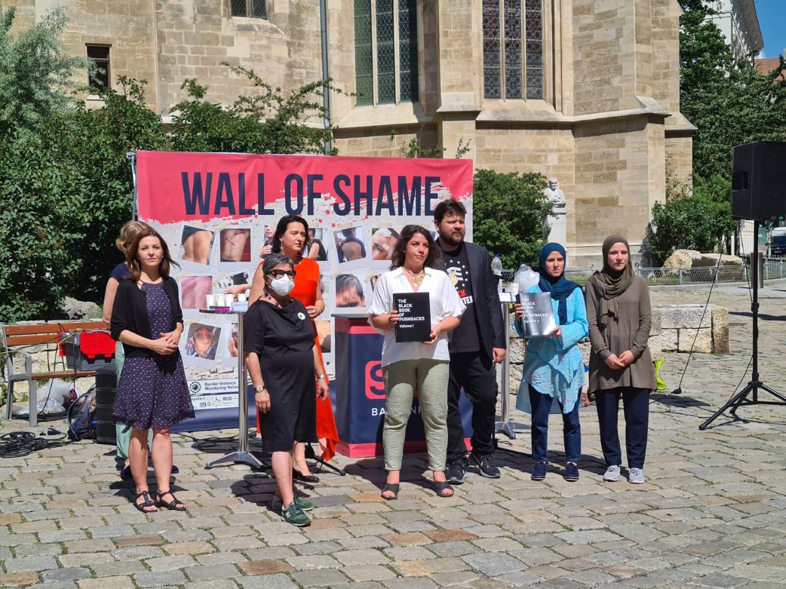
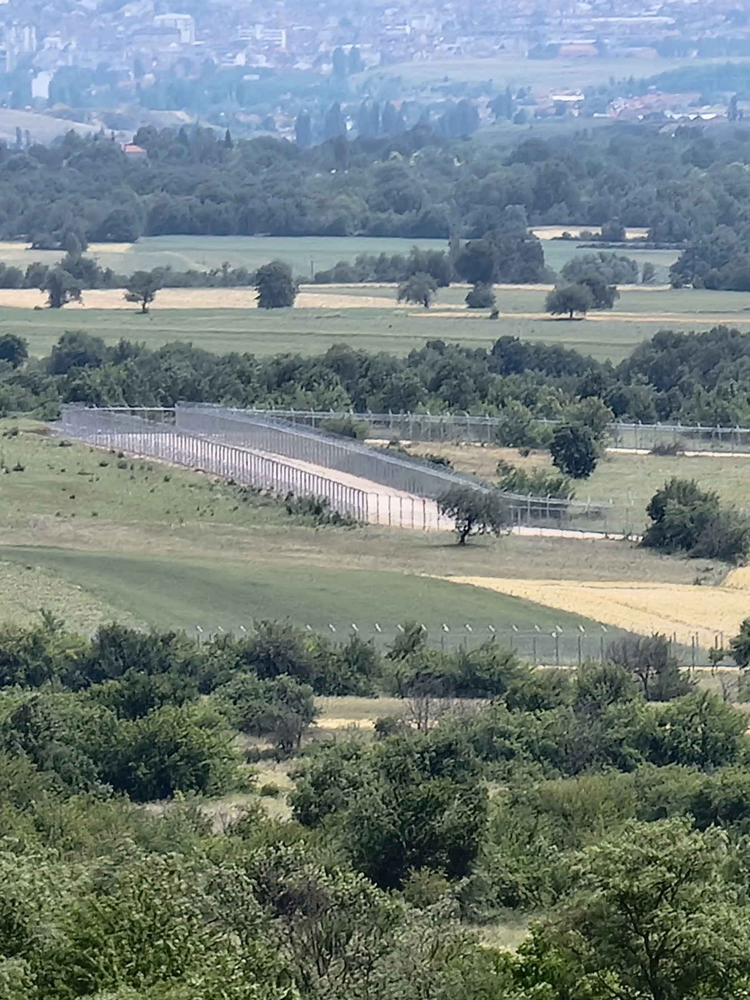
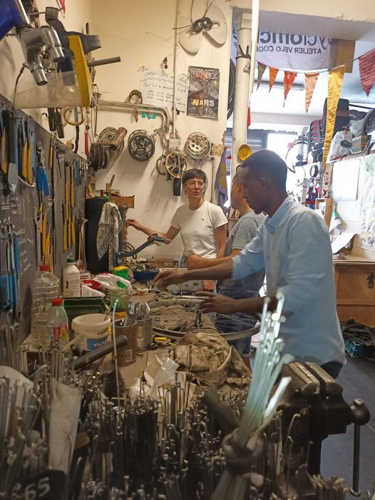

### AYS Weekend Digest 19–20/06/2021: Rape and sexual violence in EU supported detention centres in Libya
#### Handover of ‘Black Book on Pushbacks’ to Austrian Parliament // Rape and sexual violence in EU supported detention centres in Libya // Dismantling of rule of law and press freedom in Greece // Demonstration at the Croatian border // Updates on the fence at North Macedonian and Serbian border // 5th Frontex operation outside EU launched

Natalie Gruber and others raising awareness about Pushbacks in Vienna\. Copyright: Josoor

This weekend with World Refugee Day on Sunday 20th of June saw many actions in support of the situation of people on the move, but also some free\-riders and hypocrites trying to whitewash their actions by posting fake solidarity\. In today’s feature we speak about Natalie Grubers campaign in Austria, raising awareness about pushbacks\. This part will be followed by a short and incomplete best and worst of \#WorldRefugeeDay\.
#### Natalie Gruber hands ‘Black Book of Pushbacks’ to Austrian members of parliament

On Friday 18th of June, Natalie Gruber from Josoor, a member organization of the Border Violence Monitoring Network \(BVMN\), handed the Black Book of Pushbacks to Austrian Members of Parliament\. The Black Book of Pushbacks was published by BVMN in collaboration with The Left in the European Parliament in December 2020\. It contains 900 testimonies of border violence, and thus fundamental rights violations, experienced by 13,000 people on the move\. You can download the book here:

The hand\-over was conducted by Natalie Gruber alongside Petar Rosandić, chairman of the [SOS Balkanroute](https://www.facebook.com/SOSBalkanroute/) and Amina and Merdijja Kobilica from SOS Balkanroute\. Natalie Gruber also [appeared in a Live\-Talk in Austrian TV](https://tvthek.orf.at/profile/ZIB-Nacht/13890328/ZIB-Nacht/14096037/Gespraech-mit-Nadine-Gruber-Border-Violence-Monitoring-Network/14941907) on Saturday 19th June and spoke about Pushbacks and the work of BVMN in order to document them\.

■■■■■■■■■■■■■■ 
> **[Natalie Gruber](https://twitter.com/NatalieSGruber) @ Twitter Says:** 

> > So that happened
Gespräch mit Natalie Gruber, Border Violence Monitoring Network [tvthek.orf.at/profile/ZIB-Na…](https://tvthek.orf.at/profile/ZIB-Nacht/13890328/ZIB-Nacht/14096037/Gespraech-mit-Nadine-Gruber-Border-Violence-Monitoring-Network/14941907) 

> **Tweeted at [2021-06-18 22:51:23](https://twitter.com/nataliesgruber/status/1406021753424560133).** 

■■■■■■■■■■■■■■ 

The NGO Josoor of which Natalie Gruber is co\-founder and spokesperson documents pushbacks from Greece to Turkey, provides emergency relief and is engaged in advocacy work\. The NGO is currently facing extreme challenges: In Greece’s attempts to criminalize the work of NGOs that report about pushbacks conducted by Greek authorities, [Josoor was attacked amongst others\.](https://www.spiegel.de/ausland/verfahren-gegen-ngos-in-griechenland-man-will-uns-ruhig-stellen-a-6dcab115-2f50-45ef-ac8c-4d036d8bfe5c) While no official charges have been pressed, the threatening gestures by Greece are already showing consequences\. According to Josoor, a foundation that offered a much needed grant withdrew from previous promising talks after learning about the accusations by Greek authorities\. Josoor stated its immense disappointment about the foundation’s decision\.

> “The goal of these criminalisation campaigns is to create a hostile environment for both people on the move and people working in solidarity with them\. To be refused funding on the grounds of these false allegations that have not even been brought to court yet accelerates the shrinking of space for civil society to operate in\.“ 

If you can, please consider [supporting Josoor here](https://www.josoor.net/) :

■■■■■■■■■■■■■■ 
> **[Josoor](https://twitter.com/JosoorNet) @ Twitter Says:** 

> > After a grant offer was cancelled due to the false accusations in #Greece, we started a #solidarity campaign. 

We will continue our work as long as we can. But the reality is: even as a volunteer-run organisation, we need #funding to be able to provide support. 

Please share! https://t.co/Iavkbb53mF 

> **Tweeted at [2021-06-16 15:33:54](https://twitter.com/josoornet/status/1405186883324424193).** 

■■■■■■■■■■■■■■ 

#### Worst of \#WordRefugeeDay

On World Refugee Day, Greek Minister for Migration Notis Mitarachis saw a nice opportunity to brag about the reduction of arrivals to the Greek islands that is only happening because Greek authorities **_push people back at sea\!_**

■■■■■■■■■■■■■■ 
> **[Νότης Μηταράκης - Notis Mitarachi](https://twitter.com/nmitarakis) @ Twitter Says:** 

> > Κάποιοι με πανό στη Λέσβο αναπολούν την πολιτική "ανοικτών συνόρων". Για την Κυβέρνηση η μείωση των ροών - κατά 80% το 2020 και περαιτέρω 70% το 2021 - αποτελεί προτεραιότητα μας. https://t.co/Fd66LAxbVV 

> **Tweeted at [2021-06-20 06:50:56](https://twitter.com/nmitarakis/status/1406504823697063937).** 

■■■■■■■■■■■■■■ 

Frontex also saw a nice opportunity for promoting its work, just forgot to mention how exactly they identify those in need of protection when surveilling boats by airplane before calling Libyan coast guards to intercept people\.

■■■■■■■■■■■■■■ 
> **[Frontex](https://twitter.com/Frontex) @ Twitter Says:** 

> > Border guards are often the first ones who come in contact with people fleeing wars and persecution. 

#Frontex trains the officers so that they can identify those in need of protection and refer to national authorities #WorldRefugeeDay https://t.co/T0gyjZ3VVw 

> **Tweeted at [2021-06-20 11:35:49](https://twitter.com/frontex/status/1406576520190103559).** 

■■■■■■■■■■■■■■ 

#### Best of \#WorldRefugeeDay

Europe Must Act organized an excellent round table with people on the move, organizations on the ground and the European Member of Parliament Tineke Strik, [see here\.](https://www.facebook.com/104103804535656/videos/198797525357316)

BVMN put together a short but informative thread about the situation along the Balkan Route:

■■■■■■■■■■■■■■ 
> **[Border Violence Monitoring Network](https://twitter.com/Border_Violence) @ Twitter Says:** 

> > [Thread] From Evros 🇬🇷 to Trieste 🇮🇹, on #WorldRefugeeDay we look at the experience of people asking for international protection along the Balkan Route #RefugeeWeek2021 https://t.co/8uOD8X2xXP 

> **Tweeted at [2021-06-20 10:51:58](https://twitter.com/border_violence/status/1406565483566993412).** 

■■■■■■■■■■■■■■ 

Al Jazeera published an article with very interesting infographics about the situation of refugees worldwide

■■■■■■■■■■■■■■ 
> **[Al Jazeera English](https://twitter.com/AJEnglish) @ Twitter Says:** 

> > At 6.7 million people, Syrians are the biggest population of refugees today followed by Palestinians (5.7 million) and Venezuelans (4 million). 

As of 2020, 88% of the world’s refugees originated from only 12 countries.

 ➡ [aje.io/k6ccbr](https://aje.io/k6ccbr) | #WorldRefugeeDay https://t.co/Uc7sa1RBSA 

> **Tweeted at [2021-06-20 19:03:33](https://twitter.com/ajenglish/status/1406689192684425216).** 

■■■■■■■■■■■■■■ 

### SYRIA
#### Member of White Helmets dies in air strike

On Saturday morning, 19th of June, the Syrian Civil Defence centre in Qastoun in the western Hama countryside was hit by direct artillery shelling\. One person was killed, a member of the Syrian White Helmets Daham Al\-Hussein\. Three more persons were wounded\.

■■■■■■■■■■■■■■ 
> **[The White Helmets](https://twitter.com/SyriaCivilDef) @ Twitter Says:** 

> > Today we mourn our 290th fallen hero, The volunteer "Daham Al-Hussein" who lost his life this morning after a direct artillery shelling on his center in #Hama countryside. Our condolences to his family. Our hearts are with them. #NotATarget #Syria https://t.co/1UqG0p7wGd 

> **Tweeted at [2021-06-19 11:30:56](https://twitter.com/syriacivildef/status/1406212902038786054).** 

■■■■■■■■■■■■■■ 

In a statement published on Facebook, the Syrian White Helmets say that the strike was conducted by Assad and Russian forces\. They say the centre was deliberately targeted, as it is located far off from different buildings\. Daham Al\-Hussein is the 290th member of the Syrian White Helmets that has been killed by strikes\. The Syrian White Helmets are a private organization mainly relying on volunteer work that provides first aid after air strikes and shelling in non\-regime controlled areas in Syria since 2013\. According to the White Helmets, Assad and Russian forces are adopting a double\-strike tactic, in which they re\-attack volunteers who come to rescue after a first attack\.

■■■■■■■■■■■■■■ 
> **[The White Helmets](https://twitter.com/SyriaCivilDef) @ Twitter Says:** 

> > This terrorist crime is a continuation of the crimes of Russia and the regime forces by targeting first responders and humanitarian workers in #Syria. #WhiteHelmets statement on targeting a Syrian Civil Defense center in Qastoun town in #Hama. https://t.co/vPrEXFxndD 

> **Tweeted at [2021-06-19 14:59:46](https://twitter.com/syriacivildef/status/1406265455497580550).** 

■■■■■■■■■■■■■■ 

### LIBYA
#### Allegations of rape in EU funded detention centre

Five teenage girls accuse staff in the Shara al\-Zawiya detention centre in Tripoli of rape and sexual assault\. The centre is run by Libya’s Department for Combating Illegal Immigration \(DCIM\), which is supported by and working in the interest of the EU\. The girls reported to The Associated Press that guards would rape and sexually assault the girls if they wanted to call their families, go to the bathroom or avoid being beaten\.

Reports like this are unfortunately not at all surprising\. In a UNHCR Position paper on the designation of Libya as a safe third country for disembarkation following rescue at sea, [UNHCR states](https://www.refworld.org/pdfid/5f1edee24.pdf) :

> “In all detention facilities, conditions fail to meet international standards and have been described as “horrendous” and “cruel, inhuman and degrading”\. Deaths in detention due to violence, suicide, and disease have been reported\. Both male and female asylum\-seekers, refugees and migrants, including children, are routinely subjected to torture and other forms of ill\-treatment, including rape and other forms of sexual violence, forced labour, forced recruitment, as well as extortion, both in official and unofficial detention facilities\. Those detained have no possibility to challenge the legality of their detention or treatment\.” 

And the situation is worse in militia\-run detention centres\. But also before actually trying to cross the sea and being brought back to detention centres by the so\-called Libyan coast guards, [many women face forced prostitution, often in connection to human smuggling](https://www.newagebd.net/article/141329/women-migrants-reduced-to-sex-slaves-in-libya?fbclid=IwAR2bK8yKoc_RqBeHLrh12l6rC0kPzBfilL4kpTRkUlU3wfodbERJi6rcCPA) \.

Nevertheless, the EU continues to support the so\-called Libyan coast guards and the DCIM, and the EU border agency [Frontex continues to cooperate](https://www.spiegel.de/international/europe/libya-how-frontex-helps-haul-migrants-back-to-libyan-torture-camps-a-d62c3960-ece2-499b-8a3f-1ede2eaefb83) with the so\-called Libyan coast guards in order to prevent people being rescued by civil rescue operations\.
### GREECE
#### Dismantling of rule of law and press freedom in Greece

In an interview, the Lesvos based journalist Franziska Grillmeier speaks about the state of freedom of press and the rule of law in Greece\. The access to the new camp Moria 2\.0 is strictly limited, journalists can only visit it on special guided media tours that take about 30 minutes\. In a press conference with the Greek Migration Minister Notis Mitarakis and EU Commissioner Eva Johannson, Mitarakis denounced a question by a journalist about proven pushbacks in the Aegean as fake news\. Court rulings in which youngsters that the Prime Minister already declared guilty beforehand were convicted, as last week the Moria 6, are proceeded without access to the public and international media\.

With regard to these worrying events, Grillmeier stated:

> “I would not have thought possible this rapid dismantling of the rule of law that we have seen in the last year alone, in the courtrooms, but also in the freedom of the press\.” 

On one visit to Moria 2\.0 with the official press tour:

> “The press representatives of the Ministry of Migration repeatedly dragged me away by the sleeve\. This is no way to get a picture of the situation\. People are supposed to become more and more like ghosts\. They are removed from the public eye, while the narrative is pushed that everything is under control\. Voices of camp residents are vehemently restricted, as are those of media professionals, who are rigorously intimidated\. “ 

Read the full interview here:

#### Samos: residents\-led research in Camp Vathy

A team of Syrian residents of Vathy camp on Samos conducted a research amongst the Syrian population of the camp\.

■■■■■■■■■■■■■■ 
> **[Samos Volunteers](https://twitter.com/samosvolunteers) @ Twitter Says:** 

> > A Crime Of Survival | research report on Syrian #RefugeesGr in #Samos.

The independent report project undertook by a team of Syrian camp residents in #Samos, with the support of @[AdvocacySamos](https://twitter.com/AdvocacySamos), is now available for everyone to read and share:

👉 [bit.ly/3zPQwxF](https://bit.ly/3zPQwxF) https://t.co/UPzgXOnlbe 

> **Tweeted at [2021-06-20 20:55:41](https://twitter.com/samosvolunteers/status/1406717413253652482).** 

■■■■■■■■■■■■■■ 

Asked if their opinion on coming to Europe had changed due to the experience of living in the ‘hotspot’, some said:

> “Yes, because our souls are destroyed here” 

> “Yes, a lot, because of this island and the future of my boy\- and a lot of this is lost” 

> “No, but if we remain in this situation, Europe will not remain what we thought” 

### CROATIA
#### Demonstration at the border

On Saturday, a group of human rights activists temporarily blocked Croatia’s border with Bosnia and Herzegovina\. The action took place near Maljevac, the village on the Croatian side opposite to Velika Kladuša in Bosnia and Herzegovina\. BVMN collected more than 300 testimonies of violent pushbacks in this area alone\.

■■■■■■■■■■■■■■ 
> **[Lesvos Calling](https://twitter.com/CallingLesvos) @ Twitter Says:** 

> > The caravan just reached Maljevac, on the border between Croatia and Bosnia-Herzegovina. Here we stand with our bodies against this border regime that every day kills thousands of people!
#AbolishFrontex #OpenTheBorders
#Balkanroutecalling https://t.co/YlX5m0BHbC 

> **Tweeted at [2021-06-19 16:42:57](https://twitter.com/callinglesvos/status/1406291422148546564).** 

■■■■■■■■■■■■■■ 

### SERBIA
#### Pictures of border fence

Members of the Serbian NGO KlikAktiv made a trip to the southern border areas with North\-Macedonia in order to see how the erecting of the border fence is going\. They were stopped by a Hungarian police car with both Hungarian and Serbian police inside\. According to a bilateral agreement from 2018, police forces of the two countries cooperate in the field of border enforcement\. The next day, the group managed to see the construction side of the border from a hill near Miratovac\.

The new border fence near Miratovac, Copyright: KlickAktiv

There is [little information yet](https://www.dawn.com/news/1575987) about the length of the fence, but construction is ongoing\.
#### Launch of new joint Frontex operation

Meanwhile, EU Commissioner for Home Affairs Ylva Johannson visited Serbia for the launch of the new joint Frontex mission\. The mission is the 5th Frontex mission outside the EU\. According to Johannson, the EU contributed 158€ million for Serbia’s border enforcement\.

■■■■■■■■■■■■■■ 
> **[Frontex](https://twitter.com/Frontex) @ Twitter Says:** 

> > Today, @[YlvaJohansson](https://twitter.com/YlvaJohansson) was in Serbia to launch our fifth operation outside the EU. Starting this week, there are 44 Frontex #EUStandingCorps officers working together with their Serbian colleagues to tackle cross-border crime. Thank you, Commissioner! https://t.co/8p5OAmfmqH 

> **Tweeted at [2021-06-18 16:42:48](https://twitter.com/frontex/status/1405928995305234436).** 

■■■■■■■■■■■■■■ 

### ITALY
#### Humanitarian corridor for 500 people announced

Italian Interior Minister Luciana Lamorgese announced the signing of an agreement to take in 500 people from Libya\. She also called on other EU member states not to leave the countries of first arrival alone\.

#### Landings on Lampedusa

On the weekend, two boats arrived to Lampedusa, one with 53 people on board, the other one with 17 people, according to local media\.

### SPAIN
#### Frontex joint operation restarts

The joint operation MINERVA 21 between Frontex and Spanish National Police was launched on Friday 18th of June\. The operation focusses on the cities Algeciras, Ceuta and Tarifa in the strait of Gibraltar\. For many years, Frontex has had operations in Spain, especially during the summer months\. This operation will run until September 8th\. Frontex will contribute with a total of 112 employees\.

#### Rescues

A boat with 8 minors, 24 women and 13 men was rescued Sunday morning south of Gran Canaria [according to local media\.](https://www.eldiario.es/canariasahora/migraciones/salvamar-macondo-rescata-8-menores-24-mujeres-13-hombres-patera-sur-gran-canaria_1_8057168.html?fbclid=IwAR3D53bQx4XmXuuctxZA9f8lR2jtLo9-fvAXZes-HrawxtEhnRo3JaQUvtI) The boat was located by a merchant vessel that alerted the national authorities\. The rescued persons were brought to Arguineguín port\.

[Five men were rescued](https://www.diarioarea.com/2021/06/20/cinco-inmigrantes-rescatados-este-domingo-de-una-patera-que-se-hundia-al-sur-de-punta-europa/?fbclid=IwAR3GMdRZYOcUPIDtgROMQ3EeLOY8vEDeWxcYZ3jg5qoXddlDce_9Y2Gb1eU) in the strait of Gibralta on early Sunday morning\. They were arrested on suspicion of being non\-Gibraltarians found in Gibraltar without a valid permit or certificate and are currently being held at a police station\.
### FRANCE
#### News from Solidarité Migrnats Wilson

Solidarité Migrants Wilson, a Paris based NGO, started a bicycle repair workshop where everybody can come and repair bikes\.

Solidarité Migrants Wilson is also looking for volunteers for their food distribution\. If interested, [please visit their call on facebook here](https://www.facebook.com/permalink.php?story_fbid=1748024425398322&id=598228360377940) \.

The new workshop\. Copyright: Solidarité Migrants Wilson
### Find daily updates and special reports on our [Medium page](https://medium.com/are-you-syrious) \.

**If you wish to contribute, either by writing a report or a story, or by joining the info gathering team, please let us know\.**

**We strive to echo correct news from the ground through collaboration and fairness\. Every effort has been made to credit organisations and individuals with regard to the supply of information, video, and photo material \(in cases where the source wanted to be accredited\) \. Please notify us regarding corrections\.**

**If there’s anything you want to share or comment, contact us through Facebook, Twitter or write to: areyousyrious@gmail\.com**

_Converted [Medium Post](https://medium.com/are-you-syrious/ays-weekend-digest-19-20-06-2021-rape-and-sexual-violence-in-eu-supported-detention-centres-in-ae10acb65034) by [ZMediumToMarkdown](https://github.com/ZhgChgLi/ZMediumToMarkdown)._
