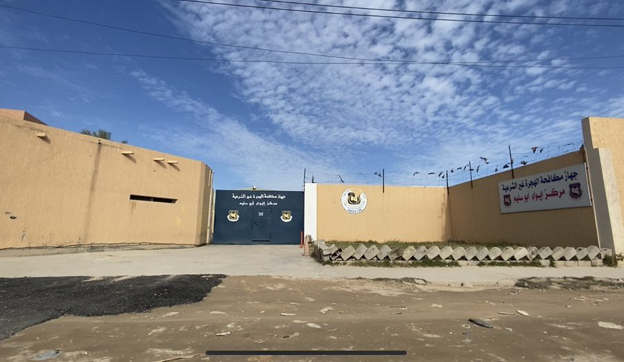
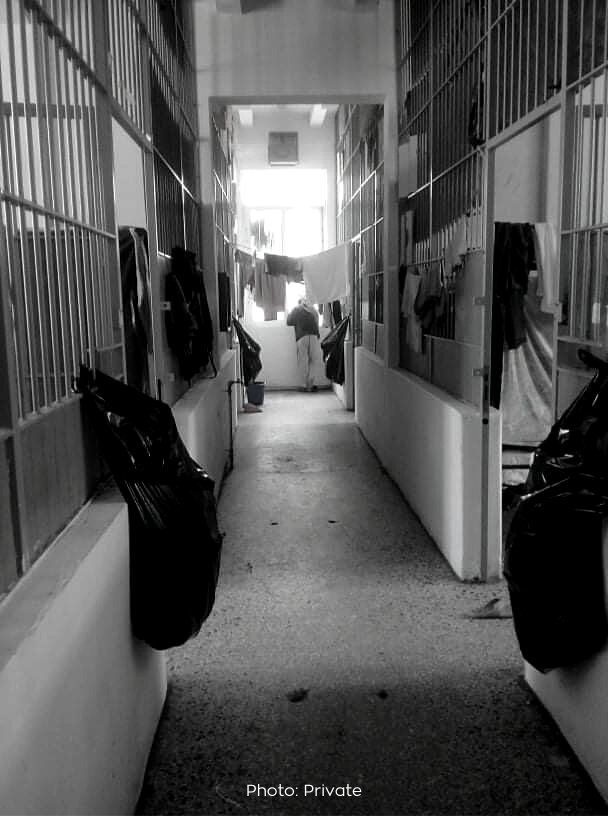
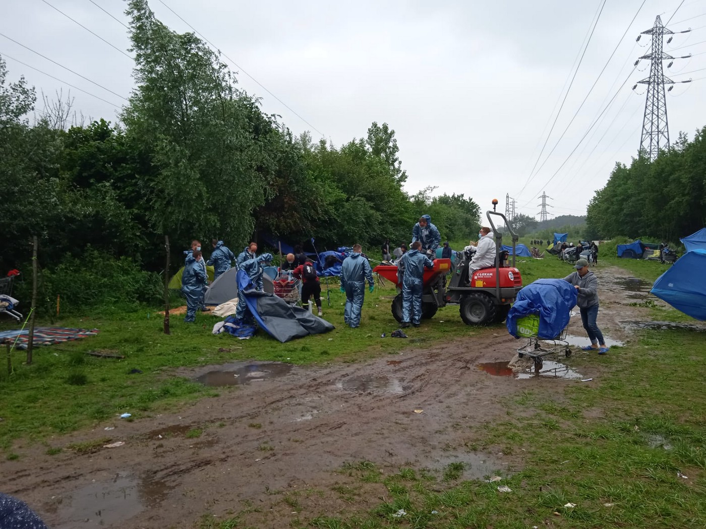

### AYS Daily Digest 22/6/21: With too many eyes on Libyan torture, even the EU calls for closure of detention centres
#### AI’s Pushback report calls out Frontex / Greece: Dutch journalist arrested for “facilitating illegal residence to an asylum seeker” / France: intimidation of activist in the heart of Paris / more news, reports and recommended reads

Photo: Sara Creta
#### FEATURED

It is only now, following [press reports of minors, children, being sexually assaulted](https://apnews.com/article/united-nations-libya-africa-middle-east-europe-9e9cdf60495c34372c1b2155f010f3f6?utm_source=Twitter&utm_medium=AP&utm_campaign=SocialFlow) by Libyan guards, that the EU Commission is officially saying it is “pressing” to shut down Libyan detention centres\.

[](https://l.facebook.com/l.php?u=https%3A%2F%2Fanfdeutsch.com%2Fmenschenrechte%2Flibyen-sexualisierte-gewalt-an-schutzsuchenden-26894%3Ffbclid%3DIwAR1VmwWS8qHKJH0hvXxVqIzrTBWWQhfnoTbnmiTp0hJo0XjFkYGtWpxtZeA&h=AT1bmSIm_14TlpWlNnXwAq264XtIVv7mlHUuxgofoGqGOqSlf1JGZundREaQsgfH06o1O_Xo6UIJBZnJW7ctbnx6oPbAj9AlILZPMMdYC4Im8vlYYIl7b7AcxOriVgnl1jCnCloS5KcPZw&__tn__=R]-R&c[0]=AT3WzgLE3EMdAtvKsxRucsZZ_mDYZof7VUjES0eFSDkXqH2xj4r1-uXuprtxmeu6tjf_480xuFth_tT8WNp1dhURQEajk65JlE6GB6-a8F8Q-wjM1gE36dM7hD0YDDJd5c-DyXOjBkvYUyGxVKEsDhCeQ97cprga9KIGUk42tBVK_pF0d3ttCh1vRRV58POm4K9swTbXmVc)

As Brussels dumped the responsibilities on Rome, all international organisations and representatives of the EU rush to make sure the public is aware they oppose torture and degrading treatment of people\.

> Even if it is not the first time that I have experienced sexual assaults, these are the most painful, because they are committed by the people who are supposed to protect us _, one of the molested girls said to the [media](https://www.avvenire.it/attualita/pagine/libia-l-inferno-delle-minorenni-stuprate-dalla-polizia?fbclid=IwAR0zKNsajSvaoa1K7FiWu4QxjV1IU1JE1gpsTp6Q3Df2qP12NJtdqWYGm-k)_ 

Reporting of suicide attempts out of desperation and hunger, the UNHCR also demands their immediate release and protection\. 
There are those who have loudly and clearly been calling out human rights abuses since the start:

■■■■■■■■■■■■■■ 
> **[Sara Creta](https://twitter.com/saracreta) @ Twitter Says:** 

> > The detention center in AbuSalim neighbourhood is under the control of Abu Salim armed group led by one of the most prominent warlords in #Tripoli Abdelghani al-Kikli [AKA Ghnaiwa]. Last January, he was appointed by al-Sarraj as the head of the new 'Stabilization Support Agency'. https://t.co/0d2zExujgT 

> **Tweeted at [2021-06-22 17:19:08](https://twitter.com/saracreta/status/1407387690912321549).** 

■■■■■■■■■■■■■■ 

However, nothing concrete has been done by the EU to prevent abuses, returns to torture and loss of more lives at sea, as Europe still provides means, funds and support to the Libyan Coast guard, but also in other ways safeguards the current policies and actions of fear and aggression towards people on the move, both on its sea and land borders\.

[](https://l.facebook.com/l.php?u=https%3A%2F%2Fwww.infomigrants.net%2Ffr%2Fpost%2F33103%2Fdans-les-prisons-officielles-libyennes-les-migrants-sont-frappes-tous-les-jours%3Ffbclid%3DIwAR3sp9CPcXKXSon1LaLQV5c7OJCLQqzWAF3k8p9xtOPUXWiTDRUP7ftW8jQ&h=AT1K5IibbnqariKHrDleiHWZxuONWQAVdcHYZvcOHvzyG5AY_XkF3-q9XdvHTglIDfRKhoTchKW83fHLgioIn75Iq0sbX_gmuf6cyH7w9EMcQ0P5jggihdoEtnvnk2NqPV5ziRu1gphYvg&__tn__=R]-R&c[0]=AT3WzgLE3EMdAtvKsxRucsZZ_mDYZof7VUjES0eFSDkXqH2xj4r1-uXuprtxmeu6tjf_480xuFth_tT8WNp1dhURQEajk65JlE6GB6-a8F8Q-wjM1gE36dM7hD0YDDJd5c-DyXOjBkvYUyGxVKEsDhCeQ97cprga9KIGUk42tBVK_pF0d3ttCh1vRRV58POm4K9swTbXmVc)

Following repeated incidents of violence towards [refugees and migrants](https://www.msf.org/refugees-idps-and-people-move) held in two detention centres in Tripoli, [Libya](https://www.msf.org/libya) , Médecins Sans Frontières \(MSF\) has announced that we feel obliged to temporarily suspend our activities in Mabani and Abu Salim detention centres:

The Austrian migration expert Gerald Knaus [has sharply criticized](https://l.facebook.com/l.php?u=https%3A%2F%2Fwww.news.at%2Fa%2Ffluechtlinge-grenzkontrolle-angst-folter-12134718%3Ffbclid%3DIwAR1BFB0QWQI1b6ajXhGlMGPWtIcg4bEXyjQlh4tyXCdO2G9GdXOeW6nS_4Q&h=AT2usitPyEz2_hoFE4FpQujZhbLeqHLH8VyQ0lBV7rUir2GE8J-97pyGQ3MHpH1rd302oCtx-I5_2bfsMleS0C2uGSo5uCs6BAg0-lQJtxyCDr3S_irIHyKjcou3iwB8Pye5o1NhemBXYQ&__tn__=R]-R&c[0]=AT0SmGD6MVP9ffCSPoDtZewarIVD7suuatB6Dd7TSTcd33f08nPRlbDtz4qkEfq4Brh7rg16BZxGCxVTVgI8P6ShgPPkcNib_Xvq35uwqp_oM5JJvxv59S4Fji4DiNEoAQ9qNRQatyoIzkCApU6puhQYJACLlaAr7c9HLMJVP0fBuj-AAQew4FuwR4BnCQGr-WVbRCXWr0o) the EU’s current refugee policy\. “It is a border control through fear of torture,” Knaus told “Welt” on Tuesday about Europe’s cooperation with the Libyan coast guard\. At the core of the Geneva Convention, it is clear “that the signatory states are not allowed to reject refugees at their borders without first checking their need for protection”, and with the re\-sparked EU\-Turkey deal, Europe is going against the core of the Convention, Pro Asyl reminds\. Given that the German Chancellor Angela Merkel said Turkey “is doing outstanding things” to support the Syrian refugees, as the EU and Turkey are [negotiating a new refugee agreement](https://l.facebook.com/l.php?u=https%3A%2F%2Fwww.tagesspiegel.de%2Fpolitik%2Fvereinbarung-von-2016-laeuft-aus-eu-und-tuerkei-verhandeln-ueber-neues-fluechtlingsabkommen%2F27311680.html%3Ffbclid%3DIwAR2KIvtO_Mq8fmsV5viA2fIlXYZDQV9xwrVGrfvYqtw53jx0RVBX5yOW8Zk&h=AT0h7Q_spXT0dvFVdfl2xJ9MyrVVDNaKgl6zt6aMjd6hY_FB7scj6usEpd96a-iGmzmM4O0g4oB2wmSIyLROXSV3eLr1S12hXk4r0ajGeXSz0HW_rT38Y1yvIfQbuuwRhL_CSs2RHTYWwA&__tn__=R]-R&c[0]=AT3YbJumv4-kRDdlVnuMnTRA5fxZzj-gdG_L448C0FSm85j1W3vBo2fZiQbsMiZaER4nmodVVNzSAIZ9LVXIEpNdVVpKnHLV8V-Ea6d7cjThB5A4sfJyyfRt6cuDBOqq4-f-6zL1fJVu-W3ZnpyHL_w91XdYEUKqOKf3uC8ZYjGBOiNpeYvQfFRFhyzTVGvbt11puG86TvY) , it is likely we will see more of that collaboration, only with a slight [change of focus](https://apnews.com/article/middle-east-turkey-europe-migration-government-and-politics-70d9ab0d52937cc5d8aa155bcecb77a0?fbclid=IwAR3D2U49SqdjGwO89JumtEVBEZ0iZ21nF2-KTGTcydHVHdONwxerj0DIPKY) , according to the recent statements by the EC\.
#### GREECE
### Amnesty International’s Pushback report calls out Frontex

AI has published a report which shows that violent pushbacks have become the de facto Greek border control policy in the Evros region\. The level of organization needed to execute these returns, which affected around 1000 people in the incidents we documented, some numerous times and sometimes via unofficial detention sites, shows just how far Greece is going to illegally return people and cover it up\. Also, they stress the responsibility of Frontex: “All of the people we spoke to were pushed back from areas where Frontex has significant numbers of staff\. The agency cannot therefore claim to be ignorant of the abuses\.” They therefore call on the EU border force Frontex to suspend or withdraw its Greek operations

_One of the many reports documented speaks about people who were forced off the boat and into the water, while one of them who was forced off the boat could not swim and screamed for help as he bobbed up and down in the water and was seen to be swept away with the current\._
### Excause for violation — the infamous ‘administrative detention’

Greece is intensifying its detention policy under the hypocritical and tolerating gaze of the EU\. More specifically, on Kos and — during the operation of the pre\-removal centre — in Evros the authorities apply a policy of generalised and systematic detention of newly arrived asylum seekers subject to a few exceptions, whereas even vulnerable people are detained for prolonged periods, RSA [report](https://rsaegean.org/en/administrative-detention-a-human-rights-black-hole/?fbclid=IwAR0jvhJVhHfvS4TJqvPTblsbw750W74O9tectfnAGnJwJXK-HGsF7BjIRpw) demonstrates\. On the mainland, persons without documentation continue to be detained for the purpose of removal, including persons that overwhelmingly wish to seek international protection without having had a prior possibility to make an application\.

> _Every now and then we are forced to sign documents \[extension of detention\] that are written in the Greek language and if we do not sign them, they hit us\._ 

While in detention, people are in a gap regarding medical and psychosocial services, lack of legal assistance and interpretation, as well as arbitrariness and police violence\.

> Wandering around a 100 metres backyard for 18 months is torture in itself, one of the detainees, explains\. 

Following their findings, the RSA calls on the Greek authorities:
- To immediately end the generalised and systematic implementation of administrative detention against refugees and migrants\.
- To comply with their obligation to conduct an individual assessment of the necessity of imposing in each case, taking particularly into account the conditions of detention in light of the pandemic\.
- To take immediate action to improve detention conditions in accordance with the recommendations of national and international bodies\.
- To immediately address deficiencies in the treatment of detainees and the prevention of health risks\.
- To ensure the communication of detainees with appropriate and adequate medical staff, as well as their access to legal assistance\.

### Neighborhood watch against human\(itarian\)s

At the same time, while some are being held in horrendous conditions, those who provide some trace of humanity to people stuck in the limbo are, once again, being criminalised\. the Greek police has arrested 61\-year\-old Dutch journalist Ingeborg Beugel on Sunday, June 13, on charges of hosting the 23\-year\-old man from Afghanistan, Freydun, an asylum seeker\. She has been living on Hydra for the last 40 years, is correspondent for several Dutch media\. As the Greek media [reported](https://www.keeptalkinggreece.com/2021/06/22/dutch-journalist-ingeborg-beggel-arrest/) , she “met the Afghan asylum seeker and his dog in the camp in Malakasa in December 2018 while she was filming for a documentary the economic crisis and the migration issue\. He helped her with translations and when the living conditions in the camp became unbearable for him and his dog, she started hosting him\.”

It appears some of the locals called in the police\. According to the official information, she could face at least one year in prison and a fine of at least 5,000 euros — or double if the goal is for profit\.
### Voices from Patras

Our friend from No Name Kitchen give an update from Patras and a note about power dynamics and the ways that humanitarian approaches can influence them:

\(…\)

> A short conversation is enough to realise that people in transit are not the passive victims described by the most common political and social media discourses\. They decided to leave their country to save their own lives, to help their families or to search a different life\. They made a choice in contexts where the european colonial history still have lot of responsabilities\. 

> A border system that produces inequality\. 

> The “victim” is passive, can only receive help, and “the saviour” brings help thanks to his kindness, reproducing neocolonial hierarchies\. Nevertheless fighting the structural violence of borders is not a about goodness: the solidarity toward people on the move it’s a responsibility to fight injustice\. 

> None of the people in transit is simply a passive victim\. 

#### FRANCE
### Demonstration of force on homeless people on the move and activists who feed them

New evictions of temporary placed tents have been reported and video documented in the north\.

](assets/bb0f76008011/0*n9vP0_rU0wuWlKya)

Photos: [Fleur Ali](https://web.facebook.com/fleur.ali.5?__tn__=-UC*F)

In the meantime, in Paris, Utopia 56 volunteers were surrounded and intimidated by police as they stood to guard families and children stranded in the streets \- on top of everything, this happens in places where people have been able to receive meals from this and similar initiatives\.

■■■■■■■■■■■■■■ 
> **[Utopia 56](https://twitter.com/Utopia_56) @ Twitter Says:** 

> > Ce soir, nos bénévoles à #Paris ont été encerclé•es par @[prefpolice](https://twitter.com/prefpolice), alors qu'ils mettaient à l’abri des dizaines de familles et enfants à la rue. L’intimidation semble être la seule réponse de @[GDarmanin](https://twitter.com/GDarmanin) à nos alertes. https://t.co/hlYYG0SPCh 

> **Tweeted at [2021-06-22 17:41:02](https://twitter.com/i/status/1407393205608460289).** 

■■■■■■■■■■■■■■ 

#### SPAIN
### At least four people lost lives, search under way for the others

Two smugglers were arrested after a boat sank on Thursday off the Canary Islands\. At least four people died in the tragedy, Spanish police said\. 
41 people were rescued: 20 men, 17 women and four children, including two babies\. Bodies of four people were recovered lifeless, including that of an eight\-year\-old child\. At least four persons are still missing, [reports say](https://www.infomigrants.net/fr/post/33130/naufrage-au-large-des-canaries-deux-passeurs-arretes?ref=tw_i&fbclid=IwAR3xeuXYnwLwO0SBjXKrQwoiwt4aQlFK8l3I0AtyABoQjXhoDX9xOSA3RK0) \.
#### UK
### Suspended further transfers to Napier

In a rather belated action, the UK has suspended sending asylum seekers to Napier Barracks due to concerns of Covid transmission\. After six asylum seekers [won a legal challenge](https://www.theguardian.com/uk-news/2021/jun/03/napier-barracks-asylum-seekers-win-legal-challenge-against-government) against the government \(the judge ruled their accommodation in the barracks failed to meet a minimum standard\), facing a new legal challenge against the Home Office due to the conditions in the accommodation still concerning, the government has decided to suspend new transfers to the barracks\.
Rather cynically, the Home Office stated that the “asylum seekers are free to come and go as they please and significant improvements have been made to the Napier site, including improved accommodation, more outdoor and recreational activities, additional coronavirus tests and reduced capacity, and individuals are screened for vulnerabilities before being placed on site\.”

To remind you of the situation there, take another look at our [earlier stories](ays-daily-digest-03-06-2021-napier-barracks-unlawful-uks-high-court-rules-b08c7f2a5421) on Napier\.
#### WORTH READING
- The Center for Global Development took a look at representation across the boards of the largest humanitarian NGOs and the distribution is…unsurprising:

[](https://l.facebook.com/l.php?u=https%3A%2F%2Fwww.cgdev.org%2Fblog%2Fdecolonizing-humanitarian-nonprofit-sector-why-governing-boards-are-key%3Ffbclid%3DIwAR2SL_d6GXhCWHSEM6PlpThfTbZD7nK-pWLQGt41pPbfl4vmGiEU-_nv0bc&h=AT0aq0rdm5IUfUJ0qMQWjctEryH2e7bLCbmVWZ2IA4kl2ijbKtPT0xwNP6llmc__k33q5HHIvOIv04-a-O4sfsb4kt52JtyFuSR9fNrbJSPa8n3FQ7u4lxrWAzx2sUDiorFQiZLkaxh6nQ&__tn__=R]-R&c[0]=AT04xLDkiUyBar4FWWxs5LtpHI37FxeAIdgY9OK2PsCJjYAISsqF3zD2DC24kR3vywK8pXD6QWi2freMK_HGcdLqmYWMgXlxhw5oWqMAUdMS-RswZI7QQN934me2JDmJFpj6OT_oshxkKeec_z0Yr3l0PmBYr1hovSZQ74aYL00JYg4fPJnnGA3TGL-LnYgEQoYYoKL4czI)

- The long\-held prejudice that migrants steal jobs from locals is being challenged\. As Europe prevents young people from arriving and realizing their goals whilst contributing to the society, and at the same time many EU Member States [rob migrant workers of their rights](https://l.facebook.com/l.php?u=https%3A%2F%2Fwearesolomon.com%2Fmag%2Fnewsletters%2Flabor-rights-of-thousands-of-migrants-are-violated-in-greeces-red-gold-industry%3Ffbclid%3DIwAR2NMWq9tUP8YDUATmO7zNahn5RgJDTEnG2JRSSfX1XCAgIxdcyf_fFimnY&h=AT2xlNBmHLUs1pmIx27NPTPeWD5bgC81u4vytFNHr8EaqO1An8Lbmke9LrOtCq9skSjCRtkQU0vDC2fqBy0vZ_Q8-_1M2VGTo9eBsNwh0XYJBnqyhiLSJLgDSFoewh_h3fXkzx5Qsm5epw&__tn__=R]-R&c[0]=AT0q8UiWvLrTBaplgw6ZDnV-R3OjnhLmnacEy_DqUDzXHMu5sUPoZ4W6ECiAC5upmkc17V8eKgaIVxp2l8cd69aHyXtdjo0UaNpNvw83bw6BjLoEL3DXqdk1bgtd3MekhB5JTbzCrPkZpNoOdBBiGtZFcvShPkWMTJa25Y4MkZ8Cc4LLXI8xBtGnNBEiex_6al6OWwaFlQTog96Kqw) , Europe will soon have to rely on immigration to make up for imminent labor shortages, according to a report published by the Washington\-based Center for Global Development\.

#### Find daily updates and special reports on our [Medium page](https://medium.com/are-you-syrious) \.

**If you wish to contribute, either by writing a report or a story, or by joining the info gathering team, please let us know\.**

**We strive to echo correct news from the ground through collaboration and fairness\. Every effort has been made to credit organisations and individuals with regard to the supply of information, video, and photo material \(in cases where the source wanted to be accredited\) \. Please notify us regarding corrections\.**

**If there’s anything you want to share or comment, contact us through Facebook, Twitter or write to: areyousyrious@gmail\.com**

_Converted [Medium Post](https://medium.com/are-you-syrious/ays-daily-digest-22-6-21-with-too-many-eyes-on-libyan-torture-even-the-eu-calls-for-closure-of-bb0f76008011) by [ZMediumToMarkdown](https://github.com/ZhgChgLi/ZMediumToMarkdown)._
