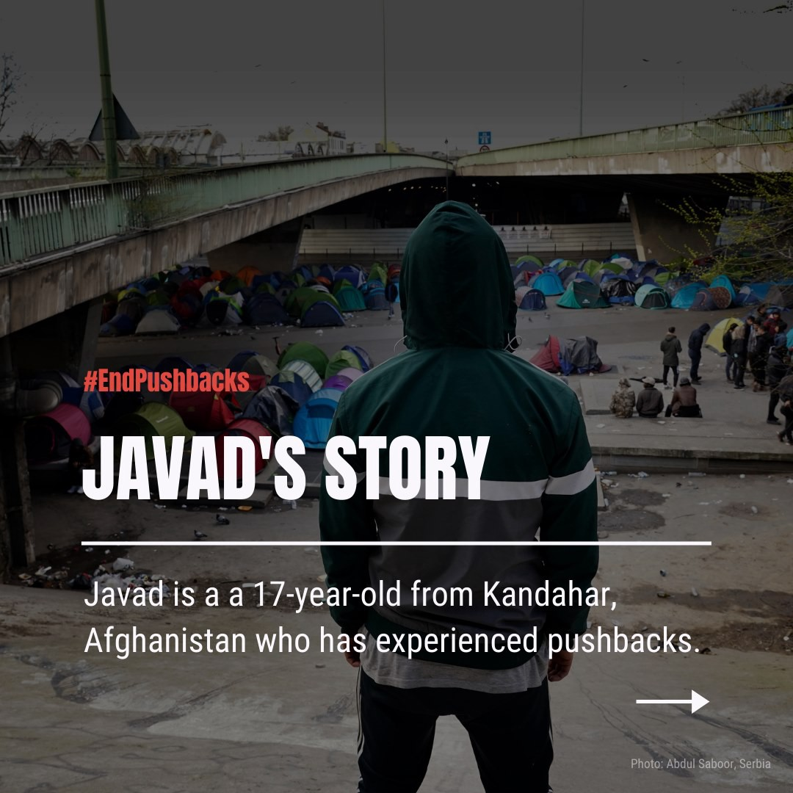
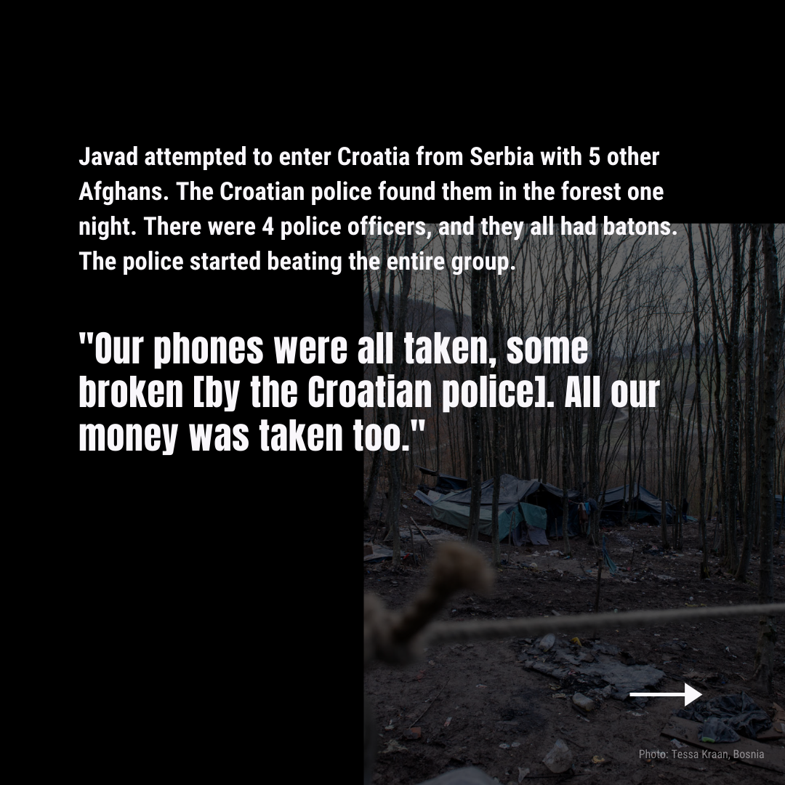

### AYS Daily Digest 24/06/21 People on Samos will be transferred to the new camp < 1 month

_EU considering giving Turkey 3\.5 billion euro to host refugees // more on pushbacks in Serbia and Croatia // arrests in Italy // and more…_
### FEATURE: People on Samos will be transferred to the new camp, Zervou MPRIC, “in less than 1 month”

](assets/9d4508a66ab7/0*T_xPI2v4G1x3FEVh.jpeg)

Outside the RIC Photo by [Jannis Papadimitriou](https://www.infomigrants.net/fr/post/13800/the-camp-outside-the-camp)

**SAMOS** — An AYS contact provided us with the following message that was circulated via WhatsApp to Vathi RIC residents, regarding the transfer to the new camp, Zervou MPRIC\. This message comes after [the news last month](https://twitter.com/samosvolunteers/status/1374360983376961544) that the Migration Minister said he believed the structure in Vathy would close “ _within the second quarter of 2021_ \.”

> “IMPORTANT INFORMATION BY THE MINISTRY OF MIGRATION AND ASYLUM: The Reception and Identification Centre \(R\.I\.C\. \) of Samos is going to close in less than one \(1\) month and all its residents will be transferred to a new space in the island located in Zervou area\. One \(1\) year ago, in the space you are residing approximately 6\.500 people were living, of whom 5\.000 have departed, while the decongestion continues\.” 

> “The goal of the Ministry of Migration and Asylum is exclusively the provision of better living conditions and of an organized framework of provision of services to the residents\. No one is going to be detained or imprisoned\. 

> The asylum seekers will be offered a place of residence in the new Centre in Samos\. Their movement will take place in an organized manner by the Ministry in collaboration with the actors Movement on the Ground\[ \*False claim\], Eurorelief and UNHCR\. No spontaneous movement to another Site or Centre will be acceptable\. The presence of beneficiaries at a Site or Centre other than the one determined by the Ministry, will result in the termination of cash assistance\. 

> \[ \* \* \]For the Recognized Refugees and beneficiaries of Subsidiary Protection, the Management has coordinated and expedited the applications of ID/TDV, that is of identification cards and travel documents\. The recognized beneficiaries of international protection that have received ID/TDV ought to speed up their exit from Samos RIC, while for those expecting to receive ID/TDV, efforts have been made for the timely delivery of the documents\. Once the latter receive their documents they should depart immediately from the RIC\. 

> All recognized refugees and beneficiaries of subsidiary protection can address the HELIOS project coordinated by IOM\. Those interested, please proceed immediately with the completion of the registration procedure in the aforementioned project\. The management of the Centre will provide services only to beneficiaries who officially reside in the RIC\. Thank you” 

AYS’s contact provided the following analysis of this official message:
- “Previously the authorities had informed NGOs that all persons, regardless of their asylum status, would be welcome to move to the new camp\.”
- “\* \* Movement on the Ground are not involved in the transfer at all, this is false information\. Only EuroRelief, UNHCR and the authorities will be directly involved\. It is worrying that such basic information was misrepresented in an official message that is supposed to be, at minimum, trustworthy\.”
- “This message has served to further raise tensions in the camp\. The generally poor communication, as well as planning from the authorities is contributing massively to this\. There is a mental health crisis in the island, moving to this ‘closed/controlled’ camp will almost certainly result in an increase on already high rates of self harm and attempted suicide\.”
- “Moreover, the authorities believe that NGOs should be supporting them in their decision to move to the ‘closed/ controlled’ model of camps\. Most NGOs are refusing to cooperate and are united against this new ‘model’ of camps\.”
- “ _‘No one is going to be detained or imprisoned’_ — this is the quote from the message that we should all keep in mind\.”

#### TURKEY

[Reuters](https://www.ekathimerini.com/news/1163309/eu-mulling-e3-5-bln-migrant-support-package-for-turkey/?fbclid=IwAR1K1KvmNjixswcuDzCOqvoF8xVWo0LCdkNEP3jhGN_GLlJ9pP3ZfJPUgtM) reports — “ _The European Union is considering **3\.5 billion euros for Turkey to continue hosting Syrian refugees until 2024** , two diplomats said on Wednesday, part of a bigger regional refugee support plan to stop migrants reaching the bloc\. The total €5\.77 billion package for Turkey, Jordan, Lebanon and Syria, which goes to humanitarian projects and not governments, aims to prevent a new refugee influx into the EU and win time until the 10\-year Syrian civil war eventually ends\. The 27 EU leaders are expected to support the funding proposal by the executive European Commission at a summit in Brussels on Thursday\._ ”
#### SEA

■■■■■■■■■■■■■■ 
> **[Sea-Watch International](https://twitter.com/seawatch_intl) @ Twitter Says:** 

> > Update: Illegal push-back confirmed! Two Italian supply vessels have been willing to rescue, but the so-called Libyan Coast Guard did not allow them to do so. They let the 20 people adrift for 12 long shameful hours before intercepting them. #Libya is not a place of safety! 

> **Tweeted at [2021-06-24 16:25:15](https://twitter.com/seawatch_intl/status/1408098907582775302).** 

■■■■■■■■■■■■■■ 

### 267 people rescued off Tunisia

> “In a boat accident off the coast of Tunisia, 267 people were rescued\. Most of them came from Bangladesh, three from Egypt, a spokesman for the Tunisian Red Crescent told the German press agency on Thursday\. Units of the Navy would have brought the people ashore\. According to the organization, so many migrants have never been rescued in Tunisia at once\. It was initially unclear whether people also drowned\. 

> The accident occurred off the coast of the city of Ben Guerdane near the border with Libya\. According to the spokesman, the boat had probably cast off from the neighboring country\. The people are now to be isolated on the island of Djerba, which is popular with tourists\. Where they will be housed afterwards is still unclear\.” 

More [here](https://kurier.at/politik/ausland/bootsunglueck-vor-tunesischer-kueste-267-menschen-gerettet/401423970?fbclid=IwAR3uGYZlklgFGPHSZd4x7vkWdiNcDSTQ53b-pXhhkhHbj_qM4D2bbPrLbv0) \.
#### GREECE

On Thursday, [UNHCR](https://www.unhcr.org/news/press/2021/6/60d4a2c14/un-agencies-welcome-relocation-4000-asylum-seekers-refugees-greece.html?fbclid=IwAR1MVTjD6wUqQNnGT2FEW2TWCgnOGLDMNRQvhT1TIQ86HoQ5PHn4X2t_DyI) released a joint press release with IOM and UNICEF:

> “\(We\) welcomed today \(24–06\) the relocation of 43 asylum seekers on two flights to France\. Their arrival under the Greek government\-managed European Union \(EU\) relocation scheme has brought the total number of people relocated from Greece to other European countries to over 4,000\. 

> To date, collective action between Greece, European governments, UN, EU agencies and non\-governmental partners has resulted in the relocation of 4,008 individuals — including vulnerable children and adults — from Greece since the start of the EU funded initiative in April 2020\. Among them were 1,628 recognized refugees, 1,531 asylum seekers and 849 unaccompanied children\. 

> Abdul\-Ahad,\* an unaccompanied boy, told IOM that he had been anxiously counting the hours until his relocation from Greece\. ‘I’m so excited that I can’t sleep,’ he said prior to his departure\. ‘I’ve already deleted all the game applications from my mobile and I am so impatient to go to school and exercise\. I want to live to the best of my abilities\.’” 

While over 4000 people relocated out of the hellish camps in Greece is appreciated, almost [3,500 people](https://data2.unhcr.org/en/situations/mediterranean/location/5179?fbclid=IwAR1YCaz3W2OhbXMU_yku94Waz6kt-4K8c_cHkja7u3V3txVMgkV7_9toSco) have already arrived in Greece so far in 2021\. The relocation scheme as currently operating is simply not enough\.

](assets/9d4508a66ab7/0*T_xPI2v4G1x3FEVh.jpeg)

Outside the RIC Photo by [Jannis Papadimitriou](https://www.infomigrants.net/fr/post/13800/the-camp-outside-the-camp)

**SAMOS** — An AYS contact provided us with the following message that was circulated via WhatsApp to Vathi RIC residents, regarding the transfer to the new camp, Zervou MPRIC\.

> “IMPORTANT INFORMATION BY THE MINISTRY OF MIGRATION AND ASYLUM: The Reception and Identification Centre \(R\.I\.C\. \) of Samos is going to close in less than one \(1\) month and all its residents will be transferred to a new space in the island located in Zervou area\. One \(1\) year ago, in the space you are residing approximately 6\.500 people were living, of whom 5\.000 have departed, while the decongestion continues\.” 

> “The goal of the Ministry of Migration and Asylum is exclusively the provision of better living conditions and of an organized framework of provision of services to the residents\. No one is going to be detained or imprisoned\. 

> The asylum seekers will be offered a place of residence in the new Centre in Samos\. Their movement will take place in an organized manner by the Ministry in collaboration with the actors Movement on the Ground\[ \*False claim\], Eurorelief and UNHCR\. No spontaneous movement to another Site or Centre will be acceptable\. The presence of beneficiaries at a Site or Centre other than the one determined by the Ministry, will result in the termination of cash assistance\. 

> \[ \* \* \]For the Recognized Refugees and beneficiaries of Subsidiary Protection, the Management has coordinated and expedited the applications of ID/TDV, that is of identification cards and travel documents\. The recognized beneficiaries of international protection that have received ID/TDV ought to speed up their exit from Samos RIC, while for those expecting to receive ID/TDV, efforts have been made for the timely delivery of the documents\. Once the latter receive their documents they should depart immediately from the RIC\. 

> All recognized refugees and beneficiaries of subsidiary protection can address the HELIOS project coordinated by IOM\. Those interested, please proceed immediately with the completion of the registration procedure in the aforementioned project\. The management of the Centre will provide services only to beneficiaries who officially reside in the RIC\. Thank you” 

AYS’s contact provided the following analysis of this official message:
- “Previously the authorities had informed NGOs that all persons, regardless of their asylum status, would be welcome to move to the new camp\.”
- “\* \* Movement on the Ground are not involved in the transfer at all, this is false information\. Only EuroRelief, UNHCR and the authorities will be directly involved\. It is worrying that such basic information was misrepresented in an official message that is supposed to be, at minimum, trustworthy\.”
- “This message has served to further raise tensions in the camp\. The generally poor communication, as well as planning from the authorities is contributing massively to this\. There is a mental health crisis in the island, moving to this ‘closed/controlled’ camp will almost certainly result in an increase on already high rates of self harm and attempted suicide\.”
- “Moreover, the authorities believe that NGOs should be supporting them in their decision to move to the ‘closed/ controlled’ model of camps\. Most NGOs are refusing to cooperate and are united against this new ‘model’ of camps\.”
- “ _‘No one is going to be detained or imprisoned’_ — this is the quote from the message that we should all keep in mind\.”

#### ITALY

Info Migrants reports — “ _A 38\-year\-old Serbian citizen was arrested on the A14 highway by police near the northern Italian city of Forlì\. The Serb is suspected of illegally taking a 15\-year\-old of Afghan origin and a 33\-year\-old Iranian into Italy in his refrigerated truck, sources said on Tuesday \(June 22\) \. The Serbian hid the two migrants inside the refrigerated part of his truck, which was transporting cheese\. According to the sources, the migrants were cold but in good condition\._ ” More [here](https://www.infomigrants.net/en/post/33176/man-arrested-in-italy-for-hiding-two-migrants-in-refrigerated-truck?fbclid=IwAR1M36gAwKcRaI4ccBy1DsMxmfKEfPqRCwTg7T5shmc-yRXTm8JM7gU2dbc) \.
#### SERBIA

](assets/9d4508a66ab7/0*3WNN63sx6B0xV6HT)

“Sid\. Chain pushbacks are a daily practice according to\. From Slovenia, persons returned to Croatia, and then from Croatia with excessive use of force to Serbia or BiH\. In addition to the beatings, the Croatian police are returning people to Serbia without shoes\. Sometimes they take off all their clothes, except the laundry\. and so they push them back” Photo and Info by [Azil u Srbiji Asylum Protection in Serbia](https://twitter.com/APC_CZA/status/1408052538436468739)

Job Opportunity with the Workshop Belgrade listed [here](https://www.theworkshopbelgrade.org/job-opportunities?fbclid=IwAR0O2BJu_zM5z7MoSaEb4afE-MaWDsn31LQiBuJMJl2C4Crnfxvfzq6dZXw) \! Help them on a new project to provide education and language lessons\.

](assets/9d4508a66ab7/1*8ud45WjPgNo7QlMAVnzVWg.jpeg)

Photos by [Klikaktiv — Centar za razvoj socijalnih politika](https://www.facebook.com/klikaktiv/posts/4372414152820171)
#### CROATIA

■■■■■■■■■■■■■■ 
> **[Lighthouse Reports](https://twitter.com/LHreports) @ Twitter Says:** 

> > THREAD Disturbing footage shows Croatian police illegally pushing-back families at the border in Bosnia. Women &amp; children, the elderly &amp; infirm being barred from seeking asylum. Warning: video is heartbreaking 

> **Tweeted at [2021-06-24 11:58:59](https://twitter.com/lhreports/status/1408031897620467715).** 

■■■■■■■■■■■■■■ 

Continuing the reporting from Wednesday’s digest, [the anti\-torture](https://twitter.com/stluedke/status/1408006072581885953) Committee of the Council of Europa is still going to release a report about their investigations into Croatian police pushbacks this summer, even if Croatian officials are currently blocking the report\. The findings will be published sooner or later\.
#### FRANCE

■■■■■■■■■■■■■■ 
> **[Refugee Info Bus](https://twitter.com/RefugeeInfoBus) @ Twitter Says:** 

> > Info Bus volunteers make it possible for us to do our work. We're recruiting an Information Coordinator to join our Calais team &amp; help ensure that displaced people can access accurate information about services.

Find out more &amp; apply 👉 [buff.ly/3wUvtI3](https://buff.ly/3wUvtI3)

Deadline: 5 July https://t.co/Nl6wC8wuGw 

> **Tweeted at [2021-06-24 08:59:31](https://twitter.com/refugeeinfobus/status/1407986734697168901).** 

■■■■■■■■■■■■■■ 

#### GENERAL

UNHCR sent out a press release concerning vaccination for refugees:

> “Four months since the first delivery of COVID\-19 vaccines from the COVAX facility, the global initiative to ensure the vaccines’ equitable distribution, UNHCR, the UN Refugee Agency, calls on States to expedite the roll\-out of vaccination campaigns and remove barriers that limit access to vaccines for the world’s 82\.4 million forcibly displaced people\. 

> UNHCR is monitoring the inclusion of refugees and asylum seekers in COVID\-19 vaccination plans and roll\-out in 162 countries\. 

> Of the 126 countries with a refugee population of more than 500 people, UNHCR has confirmed that 123 have either explicitly included refugees in their vaccination plans or provided assurances that they will do so\. This is also the case for asylum\-seekers in 93 out of 96 countries\. 

> Moreover, UNHCR is able to confirm that refugees and asylum\-seekers have begun receiving COVID\-19 vaccinations in 91 of the 162 countries monitored\. UNHCR commends the States that have included these forcibly displaced populations in the vaccine roll\-out and urges others to follow their lead\.” 

Read in full [here](https://www.unhcr.org/news/press/2021/6/60d45ebf4/unhcr-calls-states-remove-barriers-access-covid-19-vaccines-refugees.html?fbclid=IwAR1_EL365rF6YgdWJwSr6wa6SSiGD6nFz6gyMjwrk71hAmnPo1eqfsduTg0) \.
#### WORTH READING
- [FR\.de](https://www.fr.de/zukunft/die-neue-allianz-der-staedte-90822537.html?fbclid=IwAR1Da98L28zae2Hh8K_Jtfifuop_E7nXpnlWRVLxFK8rZf3_Od3fpyD4J_Y) ’s article **Migration Policy in Europe: The New Alliance of Cities\.** How cities are coming together to actually support refugees with local solidarity\!
- [Refuge Point](https://www.refugepoint.org/preserving-the-humanitarian-nature-of-resettlement/?utm_content=buffer92819&utm_medium=social&utm_source=twitter.com&utm_campaign=buffer&fbclid=IwAR0vwdkKgNcwLPt0mcPiN8pZ2gOIUGulyp8LKYuXK1WCbCpPgZnuoNwmFTE) ’s new report **Preserving the Humanitarian Nature of Resettlement\.**

### Find daily updates and special reports on our [Medium page](https://medium.com/are-you-syrious) \.

**If you wish to contribute, either by writing a report or a story, or by joining the info gathering team, please let us know\.**

**We strive to echo correct news from the ground through collaboration and fairness\. Every effort has been made to credit organisations and individuals with regard to the supply of information, video, and photo material \(in cases where the source wanted to be accredited\) \. Please notify us regarding corrections\.**

**If there’s anything you want to share or comment, contact us through Facebook, Twitter or write to: areyousyrious@gmail\.com**

_Converted [Medium Post](https://medium.com/are-you-syrious/ays-daily-digest-24-06-21-people-on-samos-will-be-transferred-to-the-new-camp-1-month-9d4508a66ab7) by [ZMediumToMarkdown](https://github.com/ZhgChgLi/ZMediumToMarkdown)._
