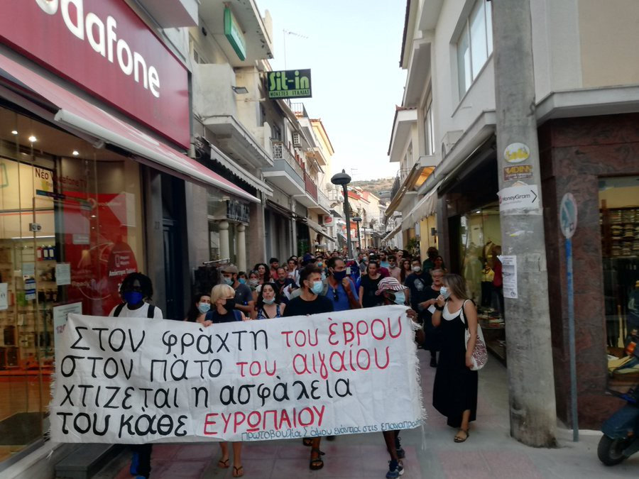
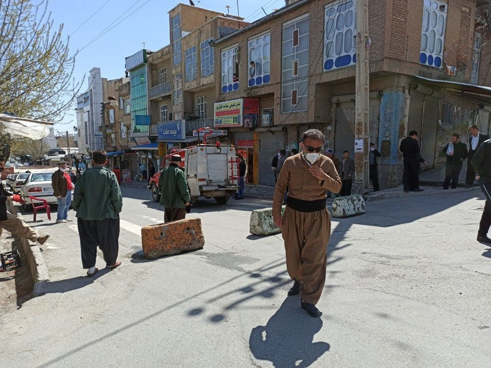
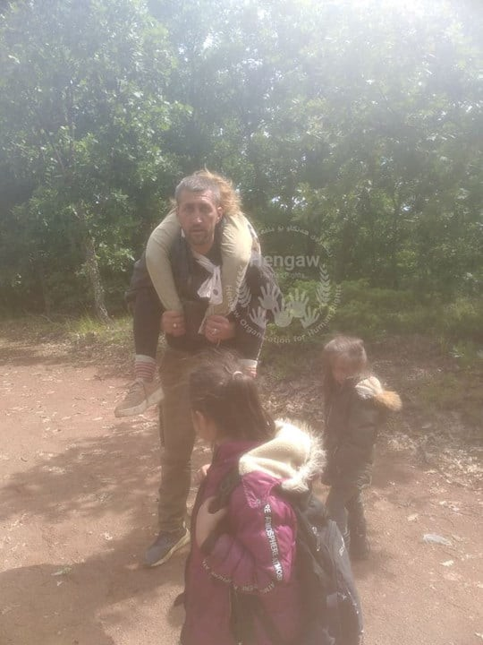
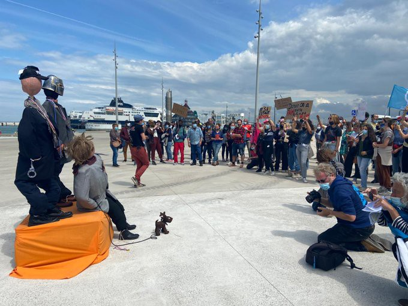
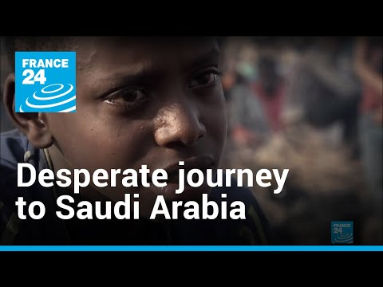

### AYS Weekend Digest 26–28/6/21: “It is not the destination where you arrive that defines migration, but the journey toward resistance\.”
#### A personal story / Minor refugee children enrolled in a school in Athens denied entry to the National Archaeological Museums / Initiatives against pushbacks / Reports and analysis, and other essential reads…

More images from the Samos protest against pushbacks \(Photo: Samos Advocacy Collective\) Read our previous Digest for more information
#### FEATURED

_We are sharing a story about Mehri, a Kurdish\-Iranian woman who died in Greece, after crossing the land border in Evros, as posted by [Siyâvash Shahabi](https://www.facebook.com/sia.lemel?__cft__[0]=AZWnoAyBs9bn8DQbWnZFo-rR1InRhk6EdpdUUidnJNRpo6XzJ17E3afovjnReTUwfpcbaRzVqrsyn62Pv9JlHNW-coK0ApPVeWi-fmoJrNYUONMqDfH-T5ibsXFUSzeWsgQ&__tn__=-UC%2CP-R) \._

“Sardar Ebrahimnejad and Mehri Nabizadeh, from Sardasht in Iranian Kurdistan, fled Iran three years ago\. As political and social pressures grow, poverty spreads, and job conditions worsen, Sardar and Mehri decides to emigrate\. After living in Turkey for 3 years, this Kurdish family moved to Greece\.

The family crossed the Turkish\-Greek border on foot with their two children and a group of immigrants, while other family members were unaware of their situation\.

After an exhausting 3 days of hard hiking in the forest and in extremely high temperatures, Mehri loses all of her abilities and is so exhausted that she is unable to eat and drink anything\. There is no help available\.

In view of Mehri’s condition and delays along the way, other immigrants find themselves fleeing out of fear of being arrested and pushed back\. So they leave the family behind\.

> The worried eyes of the children \(7 and 4 years old\) witnessed Mehri’s heart failure and her death on Monday afternoon, despite Sardar’s efforts to save her\. 

Her body was carried for 2 hours by the young husband\. Sardar says he stood on the side of the road for a long time and shouted at cars, but nobody stopped\. In spite of artificial respiration, nothing could be done for Mehri\. Sardar said, “There was nothing I could do but cry\.” At least one passing car stopped to help and called the police\. Mehri’s body was returned to Iran yesterday after being stationed in the camp for a while\.

Sardasht is a city in the West Azerbaijan Province of Iran which has a Kurdish population\. According to Kamal Hosseinpour, the MP of Sardasht, over a thousand people have emigrated from this city in the past five months\. The majority of these immigrants are male, and about 20 to 30 percent of them have left as a family\.

Many young people in this city are Koulbar \(porters\) \. For a job bringing cargo into the city from the border and through mountains and very dangerous roads, they receive a figure of almost 50$\. Reports of continuous firing by the Iranian Border Regiment on Koulbars, or freezing to death in the mountains are always at the forefront of the news\.

Additionally to widespread poverty and unemployment, people and youth must also deal with widespread political, cultural, and social pressures\. One of the reasons for the spread of poverty and unemployment is the regime’s economic policies and a kind of economic sanctions against the Kurdish people\. In the past three years, the city’s suicide rate has increased by 86 percent\. In a recent interview, Setareh Fattahpour, the head of the Sardasht city council, said that women in the city do not feel safe\. In this city, honor killings and suicides of women are common due to the pressures of patriarchal society\.

Ameneh Ebrahimi, 45, Agrin Pardehdar, 27, Rangin Hassannejad, 28, Sarveh Ebrahimi, 18, Masoumeh Bryaji, 31, Sima Mollai, 19, and many other women committed suicide at the risk of family problems in recent months\. Sardar and Mehri decided to leave Iran under such circumstances\. People are forced to leave such societies as a result of this aspect of life\.”

> It is not the destination where you arrive that defines migration, but the journey toward resistance\. 

#### GREECE

From July 1st, asylum seekers living outside of official accommodation, such as camps, or housing programmes like ESTIA, will no longer receive cash assistance\.
Many NGOs oppose this decision as since the small monthly sums are still a crucial lifeline to the people in need\. Read more on the cut:

### Symbolic compensation for the families of the two victims of the fire in 2017

The Administrative Court of Athens acknowledged the miserable conditions that prevailed in the reception and identification center of Lesvos and noted the inaction of the authorities to provide decent housing or adequate information to residents about the dangers they faced\. Two people, one from Syria, the other from Egypt, died from carbon monoxide inhalation in January 2017 in Moria, when they had lit makeshift braziers to be protected from the bitter cold\. Their relatives have been awarded compensation by the court\. In the process, the Greek state argued the people were guilty themselves, as “on the one hand they put themselves in danger by taking part in the migratory flows of the period in question and on the other hand that they should be aware of the dangers posed by an improvised fire\.” Also, the state said they had informed everyone about the danger, but “the specific warning messages invoked by the representatives of the state proved to be later than the deaths,” the media [reports](https://www.kathimerini.gr/society/561411055/dikaiosi-gia-thanatoys-sti-moria/?fbclid=IwAR00htMbQdNAyqo2Sq9bYalQJID_mgYurRTH-2bF7QCETOaEBClSvnBTdBQ) say\.
### Racism from the National Archaeological Museum towards school children

Employees of the largest museum in the country reportedly refused to admit students who were on a trip with their school, because … “they are not European citizens”, the school staff that witnessed the refusal [said](https://left.gr/news/arnithikan-se-anilika-prosfygopoyla-tin-eisodo-sto-ethniko-arhaiologiko-moyseio?fbclid=IwAR1CtTzWlP0s9mK-Q37ANIUfZzpZ_On58pTWcOVu4tNj1E0392cZ-N2ljPI) \.

> The presentation of “foreign” immigrants and refugees as a dangerous social group has taken the form of an avalanche lately, with the responsibility of the government and the media both inciting xenophobia, while they have made racism socially tolerable\. 

#### Pushbacks by sea from Greece — a 25 minute video in German:

Find archived reports and documented testimonies of people on the move across the Balkans who experienced pushbacks:

#### FRANCE

Fellow activists from Utopia and others active in the northern area have protested the decisions that came to power on September 11 last year, prohibiting the distribution of food and water to people on the move in the city:

](assets/9c796b549a8c/0*nqWaV-fAmOvcg6OP)

Photos: [Utopia\_56](https://twitter.com/Utopia_56)
#### EU
### International Day in support of victims of torture

At the same time when Europe reclaims its position on effective justice systems, part of the political EU [accuses the Frontex](https://l.facebook.com/l.php?u=https%3A%2F%2Ftwitter.com%2FErnstCornelia%2Fstatus%2F1408399130767118344%3Ffbclid%3DIwAR00htMbQdNAyqo2Sq9bYalQJID_mgYurRTH-2bF7QCETOaEBClSvnBTdBQ&h=AT1OmJWMeURkP77q9V-PXKLgYwRkneBVek6BtA4JREOKGnXVnv-dgEoIf-jgCTx3VYhYQeWiIIauZc-RvOR7okGCWv98YlNYXbDo8uTX2uOPm-wpMtHR355FUVEyx0bPnA&__tn__=R]-R&c[0]=AT216oPFGGMSvKBpnRl1JNK6zquOCGvzaFqHX5mCyOiKfFObfAvcxXntsrP7mLCrc5sv0IG0bKJtbxPvBkSmZxAcYftVaKi3RSm6-_FRMC_OOmTvZtugJImnU8FxRU34xyHiwPZkImfVEgMRa5RCmlRZKFQRfJTrFBzogKATU-SI-Vd3-6YL94elx0T3Wm9lnflr8ijjsUj8egF1uw) agency of its role in violent border regimes\. In a row of internationally marked, mentioned, tagged and commemorated days that seemingly give a clear stance in support of human rights, the latest [statement](https://eeas.europa.eu/headquarters/headquarters-homepage/100771/international-day-support-victims-torture-statement-high-representativevice-president-josep_en?fbclid=IwAR3M64gBRssDZpl1eZF-WxlwKIFoUIJsAzIRb8Yt9mJg6zRiti1ESQanOf8) by the High Representative/Vice\-President Josep Borrell stated:

> Impunity for acts of torture and other ill\-treatment must end\. Accountability for perpetrators, effective justice systems and redress for victims are crucial\. We will **not shy away from condemning acts of torture and other ill\-treatment** worldwide and support independent investigations of serious human rights violations and abuses wherever they occur\. **Evidence collection, documentation of cases** of torture and other ill\-treatment, accountability and justice **are important** steps for the realisation of victims’ rights\. 

> The EU Global Human Rights Sanctions Regime signals the EU’s determination to stand up for human rights and **to take decisive, tangible action against those responsible** for serious human rights violations and abuses, such as torture and other ill\-treatment\. 

> We will continue to engage at bilateral, regional and multilateral levels, in particular with the United Nations, the Council of Europe and the International Criminal Court, and through our **support to civil society organisations and human rights defenders\.** 

The UNHCR has [called on the EU](https://www.rnd.de/politik/un-hilfswerk-fordert-deutsche-beteiligung-bei-seenotrettung-laender-an-eu-aussengrenze-entlasten-4XBH6M3DQYFRN6ANKOXP2SSGH4.html?fbclid=IwAR00htMbQdNAyqo2Sq9bYalQJID_mgYurRTH-2bF7QCETOaEBClSvnBTdBQ) to invest more in sea rescue in the Mediterranean and the distribution of rescued people, providing more support and much mentioned solidarity with the people arriving, but also other Member states like Italy:

> “If it is not possible to involve all 27 states, it would be good if at least some states create predictable mechanisms for this summer\.” 

#### WORTH READING & LISTENING
- a video story on the suffering of Ethiopians, hundreds of whom die of exhaustion in the desert or drown while crossing the Gulf of Aden on the way to Saudi Arabia\. Those who make it to Yemen, often having starved for days on end, are easy prey for the local mafia who kidnap them for ransom…

- an interview with Simon Campbell from the Border Violence Monitoring Network \(BVMN\) about the violence people face attempting to reach Europe along the Balkan route:

[](https://l.facebook.com/l.php?u=https%3A%2F%2Fcivilfleet.libsyn.com%2Fepisode-8-state-violence-and-chain-pushbacks-along-the-balkan-route%3Ffbclid%3DIwAR3vvX3iHWOgTuERijledulwHiRk6cX4XP4QTPTKR7_jtJr4SPNGorx1zDs&h=AT2F6duU2EsJlyHc2CyWowMa30i6EWnrKvG9IQIJZVXxseb4ut_H3QFq7LJzeGq7U8HGcEWM6GV_8oXSQ5B6upAdtS3gQLIT6RTlODv4AbJpUYj1Fcsprj4lIMouHYk53Q&__tn__=H-R&c[0]=AT3PGFdGAurNHCngVOz5g6pnhS_eboJamgwJiVmWHRKd9OWMVzQObABO6sCaymNwtlB0IyxiAtOga8rox1DI6qmK4T-IwEVo3a5kaBGS5t_h6rVAkSLCqpvZjwVr7g4Z2M0cfWHd5jxORjlleSWdO-_0q5F2eMQZ2DjR3pByvzjdBcxVz586AkFhaxqQXrEU7abK3RgcQW32_jBz0Q)

- A decade after the first shots were fired, cities are in ruins, over half a million Syrians have died, and more than ten million have been displaced:

- Gorana Mlinarević’s important take on solidarity:

### Find daily updates and special reports on our [Medium page](https://medium.com/are-you-syrious) \.

**If you wish to contribute, either by writing a report or a story, or by joining the info gathering team, please let us know\.**

**We strive to echo correct news from the ground through collaboration and fairness\. Every effort has been made to credit organisations and individuals with regard to the supply of information, video, and photo material \(in cases where the source wanted to be accredited\) \. Please notify us regarding corrections\.**

**If there’s anything you want to share or comment, contact us through Facebook, Twitter or write to: areyousyrious@gmail\.com**

_Converted [Medium Post](https://medium.com/are-you-syrious/ays-weekend-digest-26-28-6-21-it-is-not-the-destination-where-you-arrive-that-defines-migration-9c796b549a8c) by [ZMediumToMarkdown](https://github.com/ZhgChgLi/ZMediumToMarkdown)._
