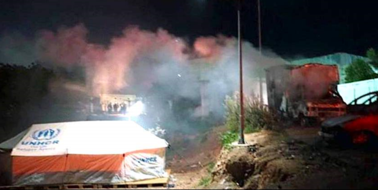
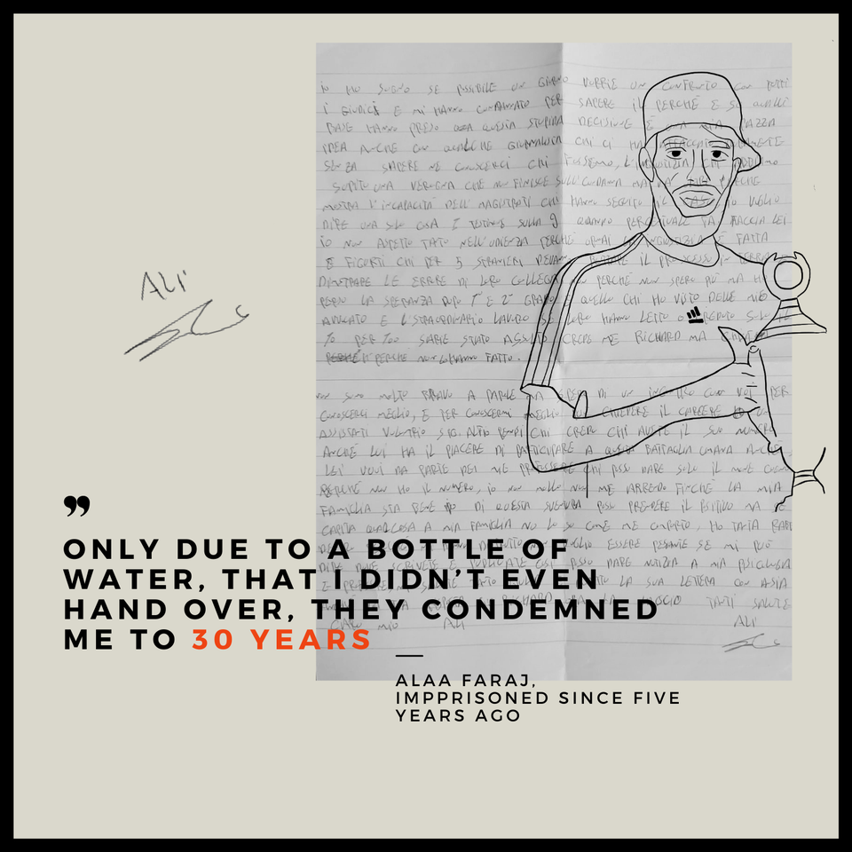

### AYS Daily Digest 29/6/21: The real questions after the Vial 15 trial
#### News from the Med// A 92\-year old woman with dementia dies in Danish pre\-deportation detention centre// Hunger strike in Belgium// Restrictions on food and water distributions to people on the move in Calais continue// & reports from Serbia, France, Denmark, announcements and recommended reads

_Photo credit: Politischios\.gr_
#### FEATURED

In April last year, a curfew was imposed on the residents of Vial camp as part of measures to prevent the spread of Covid\-19\. The curfew and other restrictive measures meant that sufficient basic supplies were not provided for the affected people, and riots ensued at the camp\.

The rage of the people in the camp reached a peak when an Iraqi woman died in an isolation container without having received sufficient medical treatment, something that many had feared for some time\. The riots became heated and 15 people were arrested: they have now stood trial\. An activist solidarity group [summed up](https://cantevictsolidarityenglish.noblogs.org/post/2021/06/29/press-release-final-judgement-against-the-vial-15/?fbclid=IwAR0j706ml26pjiPOB0oxsVx0sYW3Jk4rdxcG_oWJHroOau-vAQLAqaHqICI) the case:

> The trial joins a series of court cases targeting migrants for resistance against the inhuman treatment they are facing on the Greek islands\. Only two weeks before the trial against the Vial 15, the Moria 6 were convicted in an unfair trial with flimsy evidence to long prison charges and found guilty of burning Moria camp on Lesvos Island\. 

The summary of the Court decision is:

Four people were found completely innocent, eight people were found guilty for resisting arrest and violence in the camp and one person for destroying public goods\. Lawyers will appeal to their 3\.5 year suspended sentence\. One of the defendants was excluded from the procedure on the first day because he is a minor\. Another person could not be found and arrested and therefore was not present at the trial\.

> Within the entire procedure, the prosecution could not produce any well\-substantiated evidence against the accused, basing the conviction of the defendants solely on the questionable identification of a security guard of Vial camp\. Even the 15th defendant — who was officially recognized by the asylum service as minor — stayed in prison for 14 months, despite a maximum detention period of six months for minors in Greece\. He has been finally released but still awaits his trial before a juvenile court\. 

In the meantime, the policies of segregation, encampment and incarceration of the EU continue\.

> The real crime of putting human beings in unbearable living conditions, condoning even their deaths, has not been touched by any court\. The problem is not the self\-organized protests against this repression and the camp structures\. The problem is the existence of the camps\! 

#### SEARCH AND RESCUE AT SEA

After a two and a half month\-long blockade in Italy, Open Arms was able to [return their vessel](https://web.facebook.com/watch/?v=832954784273357) to Borriana Port for essential maintenance\.

In Spain, it was reported that 35 survivors and one deceased person were found by a merchant vessel off of the Canary islands\. It was [reported](https://www.efe.com/efe/canarias/sociedad/un-muerto-y-nino-que-sera-evacuado-por-el-sar-en-una-patera-a-500-kilometros-de-gran-canaria/50001312-4574453?fbclid=IwAR0l6XRX3W3pS5NFMPiZF-sqD2DxxnheLGQaERyC3EA7GUZ3Xr7Jxp5ajtU) that six children, 16 women and 13 adult men were on deck\.

In Ceuta, it is reported that people are again being detained\. According to lawyer [Patricia Fdez Vicens](https://twitter.com/patucafvicens) : “right now 27 people are detained on the Tarajal border\. Among them are people who have tried for several days to apply for asylum\. It is urgent to guarantee legal aid and access to asylum\.”

AlarmPhone has reported about a dramatic followup of a call in distress, as they were calling on authorities to assist approximately 110 people who were at the time on a precariously loaded boat off the coast of Malta\. Their last news of the case was that they lost contact:

■■■■■■■■■■■■■■ 
> **[Alarm Phone](https://twitter.com/alarm_phone) @ Twitter Says:** 

> > Abbiamo perso contatti con le persone in pericolo alle 03:50. Erano in panico e la barca a rischio di capovolgersi. Non sappiamo cosa sia successo dopo e se siano arrivate a #Lampedusa. Le autorità non danno info. Sono allertate alle 18:05 ma si sono rifiutate di soccorrere. https://t.co/eio3Zhd2J5 

> **Tweeted at [2021-06-30 06:19:08](https://twitter.com/alarm_phone/status/1410120699788808198).** 

■■■■■■■■■■■■■■ 

As the shipping company Vroon is accused of being complicit in forced return in the case of [170 people who were brought back to Libya](https://sea-watch.org/en/shipping-company-vroon-complicit-in-forced-return/?fbclid=IwAR11yV4RAOrdssgZuMqnl6mjotvb6-B_F8iRPkPNyUhEyfwwGcF6ZnOm-mU) , SAR activists now demand:

> **To all** 

> The compliance of any operation of search and rescue with the assumption of Libya as place of unsafety and unsafe country, which is featured by systematic and intentional violence against people on the move and Libyan citizens\. This means people must not be brought back to Libya, in any case\. 

> **To EU authorities** 

> The abolition of all the political and juridical tools which try to legitimize these unacceptable modi operandi, and that only lead to violence and death at the border\. 

> **To Private actors, such as Merchant Vessels** 

> To comply with international maritime law principle and duties and hence, rescue without any delay and ensure a disembarkation in a safe place — which can only be Europe — to not become complicit in illegal pushbacks and human rights violations by agreeing with transhipments to an unsafe country and to not put their economic interests before human rights and human lives\. 

### \#FreeTheFootballers\!

 — Campaign by [borderline europe — Menschenrechte ohne Grenzen e\.V\.](https://web.facebook.com/borderlineeurope/?__cft__[0]=AZVtzDODdTPHTOwgQd_AEYkOWwPfk4zHAomClSTeCX6Nu8zXtFDVei3QYjzqjG9JKs46rCnspSs5kBWL-dLChCGk9p0EUB11DyrMzxsmw9wbql4m73a4GjrcOIp-VeFjYzDiALDuuu-ZMdp7skFUuSVq&__tn__=kK-R)](assets/a220a9074231/0*WvOc9bdb0_pbg3EV)

[\#FreeTheFootballers](https://web.facebook.com/hashtag/freethefootballers?__eep__=6&__cft__[0]=AZVtzDODdTPHTOwgQd_AEYkOWwPfk4zHAomClSTeCX6Nu8zXtFDVei3QYjzqjG9JKs46rCnspSs5kBWL-dLChCGk9p0EUB11DyrMzxsmw9wbql4m73a4GjrcOIp-VeFjYzDiALDuuu-ZMdp7skFUuSVq&__tn__=*NK-R) — Campaign by [borderline europe — Menschenrechte ohne Grenzen e\.V\.](https://web.facebook.com/borderlineeurope/?__cft__[0]=AZVtzDODdTPHTOwgQd_AEYkOWwPfk4zHAomClSTeCX6Nu8zXtFDVei3QYjzqjG9JKs46rCnspSs5kBWL-dLChCGk9p0EUB11DyrMzxsmw9wbql4m73a4GjrcOIp-VeFjYzDiALDuuu-ZMdp7skFUuSVq&__tn__=kK-R)

While the European Football Championship is ongoing, the fate of four young Libyan footballers Joma, Ali, Abdelrahman, and Muhannad, will be decided on Friday, July 2, in the Court of Justice in Rome\. Like hundreds of victims in Italian and Greek prisons, they are accused of “aiding and abetting illegal immigration” in arbitrary proceedings\.

In 2015, when the civil war broke out in Libya, the four men crossed the Mediterranean on a wooden boat carrying more than 360 people\. During the journey, 49 people were forced to sit in the hull of the ship, and subsequently suffocated\. The shipwreck became known as the “Ferragosto Shipwreck,” named after the Italian holiday on which it occured\.

The four were arrested, charged with “aiding illegal immigration” with the aggravating circumstances of causing the deaths of 49 people, and sentenced to 30 years in prison\.
#### GENERAL
### As the number of pushbacks increases, so does the number of voices against the practice

The deeply concerning global pattern of routine human rights violations at international borders has reached incredible proportions\. The Special Rapporteur, the High Commissioner, and the reports of many of the civil society organizations show that this pattern of violations and abuses is not limited to one corridor or region\.

51 organisations are now calling on the UN Human Rights Council to ensure an appropriate response through a resolution that calls on all states to fully implement all the recommendations of the Special Rapporteur\. Find the letter and the list of demands [here](https://www.fidh.org/en/international-advocacy/united-nations/un-human-rights-council-ending-collective-pushbacks-of-migrants-at?fbclid=IwAR08bzrnFS1rSZ9De_LkTr0Yr1L1qXlLJ_kAbGsC4gBuinnthZ6XwO8T23I) :

As pushbacks receive more and more attention from the wider public, [media](https://l.facebook.com/l.php?u=https%3A%2F%2Famp.theguardian.com%2Fglobal-development%2F2021%2Fjun%2F29%2Fgreece-accused-of-refugee-pushback-after-family-avoid-being-forced-off-island%3F__twitter_impression%3Dtrue%26fbclid%3DIwAR02c_cqTse3ECLOOkxkgeh80Vf0JzzzEh10yXEPXmM-H6KLwkhpg0oYzxU&h=AT2_Y3qcxaYg_KJ07D0fxc8G6yIM6ASsrLoeAXSMvwMhQpdI60qeRImpIqPLgGBZo7nGVvvlHjW5JMZjmTYUDvvO_YTyl0qf6uSdBkZ5p88B2HITMIuCB_J56dop4fi362UxBa3KU3aELg&__tn__=R]-R&c[0]=AT3ErOzyd4haZTVvr-EnrLl6tqQMWR2ziP9f6_gnsiggTGvKkYM6tDhs28RxVLgRXhckzl-uoRFqpLI62IbFH0NgwSY9GIO9dQ4fmpGXBsG_dBLKCCvrCJGFnaQmvdQygmjAeD9_D-q1UagPCvFAqgEYeCjZfewvAKq9VYixsLJlLEqH_Zdl1n6JYv31fbW5i4nGRAPjWRo) , and — we hope — politicians in power, not much has changed in the field\. The discrepancy between the nominal solidarity and the lack of solidarity in practice is stark\. One such example of this fickle solidarity has been the great reaction to what is taking place in Palestine, while the same people ignore Palestinians who fled the horrors and are now, like everyone else, being denied rights and experiencing pushbacks:

Many media outlets search for ready\-made stories, less and less investigations \(apart from the NGOs and individuals dedicated to the issue\) are taking place with a transparent outcome and publically available reports, but one thing is clear — illegal and illegitimate expulsions of people who wish to express the intention to seek international protection are taking place every day, even as you read this\.

The UN Special Rapporteur on the human rights of migrants, Felipe González Morales, has highlighted that public [health crises like the COVID\-19 pandemic should not have the effect of denying asylum and protection](https://l.facebook.com/l.php?u=https%3A%2F%2Fwww.infomigrants.net%2Fen%2Fpost%2F33268%2Fun-expert-pandemic-must-not-favor-migrant-pushbacks%3Ffbclid%3DIwAR0B2ehMaY1Zd8l3y-_ZsKEWfroSKUilCasH8R53EV1AdEkk9bAw0QptBXw&h=AT2phG_ZwagA45xufPXrpe86xywNYPcLWJJeVDIPcXLOUP9atFmRV927nbKu5K9aqMUqO4HGVe7pX3nVI5b_HEYsk3lk3yRiK3YJMxgfBwapPPuFf8BBjmphAZqBjD2O3_XnDpjCezI6IA&__tn__=R]-R&c[0]=AT1gX_jnVH34Yf_rx58WJcbMJ0HDaNe5akWhAh2Ipcfw7ynkAk2pgIdvMYaRYDW0z2mrbKv1Rkti2W2jKMN0mGHLpzFJtKq2aNVGfB0ZrAWVnWNm2eDdzGMqrLGt_4EiYzJhVKG0X1MuQDRtZxdNw3aOfHLu4dWP5eobm8W-wMGz7d1rVmqivFnLTS0a61ImUta1S6dxf6Y) to migrants\. In the report, Morales also denounced the practice of collective expulsions carried out by some countries\. The Covid\-19 pandemic has also called the EU\-Turkey deal into question, as people’s existence in [Turkey is becoming overly difficult\.](https://www.voanews.com/episode/pandemic-pushes-refugees-turkey-debt-crisis-4732051?fbclid=IwAR0UL9U2ki1v8FKhd0CH8DrRoeWJ4pVu9j50CAeLmdCXCnLItK2lFtK338Y)

Covid\-19 measures and state decisions are still also a reason, or an excuse, for many countries to limit movement, deny protection or access to services, including vaccinations\. One example of these restrictions is the story of an Iranian woman and her two children, who claim to have been pushed back from Croatia 22 times\. Locals in Karlovac County have been hiding the woman and her children: she recently reached out to a journalist who contacted AYS for advice, who then went together with the woman and her children, once again, to the police station to make sure they were given the chance to seek asylum\. This is [their story](https://www.rtl.hr/vijesti-hr/potraga/4060842/mjestani-u-karlovackoj-zupaniji-skrivali-iranku-s-dvoje-djece-koja-tvrdi-da-ih-je-policija-22-puta-izbacila-iz-zemlje-potraga-donosi-njihovu-pricu/?fbclid=IwAR10akOBTn6jvCcKV5vgGwbiImwKBe-mnHD1gu3Otb3rsjLOyCcjQwS9IsU) \.
#### SERBIA
### Inconsistent response in the treatment of unaccompanied minors

Info Park noted in their weekly newsletter the inconsistent response in the treatment of newly arrived unaccompanied and separated children in Belgrade by the SCRM and Center for Social Welfare’s outreach social workers\. They write:

> On 22 June, Info Park’s mobile team identified four newly arrived UASBs from Afghanistan, aged 15–17\. The boys agreed to separate from the group of other adult men they’ve been travelling with, and go to OSP Miksalište for accommodation in an asylum center for unaccompanied minors\. Info Park’s protection officer and cultural mediator accompanied the boys to the OSP Miksalište but the SCRM’s shift manager refused to accept them as minors despite their obvious physical appearance being that of a child\. The outreach social worker of BCSW did not want to intervene in the case\. Therefore the boys were directed to a RC for single men\. 

> On 23 June, an unaccompanied boy \(16\) who was previously accommodated in AC for minors in Bogovađa was not allowed to return to the camp after being pushed back from the border, because the SCRM staff at Miksalište assessed him to be an adult and referred him to RC for single men\. 

> On Saturday, 26 June, several other UASBs who were refused accommodation by the SCRM, shared with Info Park that they went to Miksalište a few days after while the other SCRM shift was present and they were assessed as minors and accepted for Bogovađa\. 

> Other boys who were rejected as minors during the previous week said they went to RC in Adaševci on their own and the SCRM in Adaševci assessed them as minors and referred them to Bogovađa\. 

> These decisions by the service providers lead to confusion among the newly arrived UASC and discourages them for seeking assistance in accommodation, while the inability to access the protective and supportive services further exposes them to risks of violence, abuse and exploitation\. 

> The change in border\-crossing dynamics\. With warmer weather conditions, Info Park noted a change in the dynamics on the routes exiting Serbia, especially through Bosnia and Herzegovina which witnessed a drop in attempts during colder months\. Most refugees interviewed by Info Park’s mobile team in the previous week, stated they plan to try “game” \(irregular border\-crossing\) to Romania or Bosnia, while much less people opted to try going through Hungary or Croatia\. There is a surge of pushed\-back cases reporting physical violence and mistreatment at the hands of Romanian police\. On the other hand, despite the Bosnian police holding a reputation of being less violent, the dangers of crossing a river as big as Drina remain\. 

#### SLOVENIA
### WEBINAR: Slovenia & chain pushbacks — a dishonest broker of the New Pact on Migration and Asylum

Info Kolpa is organising a webinar ahead of the Slovenian presidency of the Council of the EU\.
Their presidency, which begins next month, will strive in pushing the legislative agenda on the New Pact on Migration and Asylum and “strengthening the Schengen Area”\. In light of this, it is important to reflect on the current state of migration and asylum policy in the presiding country, and the \(mal\)practice which Slovenia is seeking to entrench\.

Since 2018, Slovenia has been involved in massive and systemic denials of asylum rights and collective expulsion to Croatia\. This webinar will discuss the guise of legality used to initiate chain pushbacks, and the numerous reports and court judgements that have exposed the subsequent risks of torture during pushback from Croatia, as well as the inhuman conditions in Bosnia and Herzegovina\.

> On Monday 5th July we will ask: how can a country responsible for mass violations of Human Rights be an honest broker in the preparations of the New Pact on Migration and Asylum? 

#### BELGIUM

**It is reported that hundreds of asylum seekers have been on hunger strike for more than a month in Brussels\.**

At least 250 men are holed up in a church in central Brussels on hunger strike with more than 200 at other locations in Brussels\. They are demanding immediate recognition as residents in Belgium and want to be collectively granted settled status\. They have not eaten since May 23\.

Mainly from Tunisia, Morocco, Algeria, Egypt and Pakistan, the hunger strikers and asylum seekers have been living and working in Belgium for years\.
#### FRANCE
### Calais

](assets/a220a9074231/0*KwUIke7OwINVhhpd)

via [**Utopia 56**](https://twitter.com/Utopia_56)

Once again, restrictions on food and water distributions to people on the move in Calais are taking place\. The perimeter of prohibition extends to each new order, the activists report as the latest in line, the 12th decree prohibiting the free distribution of water and food is presented and put into practice\.
#### DENMARK
### Outrage over the death of a 92\-year old woman who was to be deported to Afghanistan

](assets/a220a9074231/0*vma6xvEwFv9oJUMT)

Rest in peace, Bibi — Photo by [Lene Kjær](https://web.facebook.com/lenekjj?__cft__[0]=AZUYU4Lbbt65QHwPZQjCHuSqiOSmMMX0FZHqno6MQtSQQRzL8D7dSGBHtoKH55eqnUCaMVkFHiblwGGRcs7QqtPLhgWczpZ0uolBvoUhhejiuNGq14OpKQ2tDmXkxXti13c&__tn__=-UC%2CP-R)

> Yesterday, Bibi, a 92\-year\-old Afghan refugee with dementia, died in a Danish deportation camp\. She died after days of complaining of pain with no reaction from the center\.
 

> For more than a year, Denmark kept her there, away from family, and neglected giving her elderly care\. 

> “Denmark was planning on deporting a 92\-year\-old woman to Afghanistan\. A woman with dementia who was so sick that she couldn’t take care of her own personal hygiene\. Other women at Kærshovedgård, the deportation camp, helped Bibi because she wasn’t given care at the center\.” — [Alysia Alexandra](https://twitter.com/AlysiaAlexndra) 

People are sharing their rage at the treatment of people, demanding answers to questions such as:

“What care did the woman get from those responsible at the Red Cross? Will an autopsy be done so that the cause of death is known?

“How can an organization like the Red Cross even vouch that the health care of these people, if that is the responsibility of Red Cross — a responsibility they fail to that extent?

“Which other countries will even send 92\-year\-old dementia people to the world’s most dangerous country?

“And where are those organizations — Danish Refugee Help and Red Cross, who should have long cried out about the woman’s situation?” — Lene Kjær

Denmark’s decision to declare Syria safe for returns has already caused outrage, concern and even official disagreement and [answers by the EU](https://eeas.europa.eu/headquarters/headquarters-homepage_en/100936/Petition%20response:%20Letter%20about%20Syrian%20refugees%20in%20Denmark9?fbclid=IwAR1tYUxoHvFfB7D0Gn-KeH552TfMrmO0J-zVZgBUfCsXtGUX7T0vlM7IV-I) , but the extent of the deportation package, when it comes to the treatment of people in detention centres is now sparking more reactions from the public\.

If you want to read more stories about actual people whose lives have been heavily affected by these policies, here is another read:

#### WORTH READING
- A new exploratory case study from Portland State University Associate Professor of Management [Theodore Khoury](https://www.pdx.edu/business/profile/ted-khoury) reveals how Syrian refugees in Za’atari camp in Jordan reached beyond basic disaster relief support and leveraged social capital to create informal economic systems that helped improve their quality of life\. The study dispels the notion of refugees as passive aid recipients awaiting charity, and instead asserts a refugee camp as a society with complex social systems:

- As asylum applications in the EU plummet to 2013 levels, authors of this article argue this should be attributed to more restricted movement through Covid rather than anything else or some decreased level of need for asylum:

[](https://l.facebook.com/l.php?u=https%3A%2F%2Fmarketresearchtelecast.com%2Fasylum-applications-in-the-eu-plummet-to-2013-levels%2F88238%2F%3Ffbclid%3DIwAR0UL9U2ki1v8FKhd0CH8DrRoeWJ4pVu9j50CAeLmdCXCnLItK2lFtK338Y&h=AT2T3e5f05_2yX9zhw_y3NXcngiUDfJ4dQdQj2dYsL7KCrjo5TJiOL9gNAwJnbaQZGaHzBDZPww3Z-OTO7Z38jCHa3P3cXIl-v2_J-s-RQFkVTQJ5BJU_NB0U1f7NQch2sCUefMCe1GvCw&__tn__=R]-R&c[0]=AT1gX_jnVH34Yf_rx58WJcbMJ0HDaNe5akWhAh2Ipcfw7ynkAk2pgIdvMYaRYDW0z2mrbKv1Rkti2W2jKMN0mGHLpzFJtKq2aNVGfB0ZrAWVnWNm2eDdzGMqrLGt_4EiYzJhVKG0X1MuQDRtZxdNw3aOfHLu4dWP5eobm8W-wMGz7d1rVmqivFnLTS0a61ImUta1S6dxf6Y)

**Find daily updates and special reports on our [Medium page](https://medium.com/are-you-syrious) \.**

**If you wish to contribute, either by writing a report or a story, or by joining the info gathering team, please let us know\.**

**We strive to echo correct news from the ground through collaboration and fairness\. Every effort has been made to credit organisations and individuals with regard to the supply of information, video, and photo material \(in cases where the source wanted to be accredited\) \. Please notify us regarding corrections\.**

**If there’s anything you want to share or comment, contact us through Facebook, Twitter or write to: areyousyrious@gmail\.com**

_Converted [Medium Post](https://medium.com/are-you-syrious/ays-daily-digest-29-6-21-the-real-questions-after-the-vial-15-trial-a220a9074231) by [ZMediumToMarkdown](https://github.com/ZhgChgLi/ZMediumToMarkdown)._
