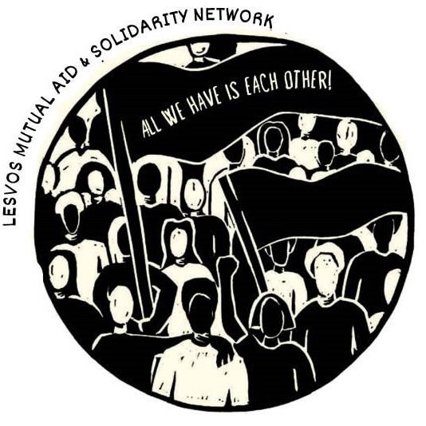

### AYS Daily Digest 1/7/21: Video proof: Lybian coast guard shooting at refugees
#### Sea Watch revealed a video of the so\-called Lybian coast guard opening fire to a boat with about 50 people // Lesvos mutual aid & solidarity network looking for support // Movement On The Ground decides to work in the new camp on Samos // Hunger strikers at the ULB University in Brussels need medical support

](assets/508d29b5d961/0*TReed0Z6jXDJoOFc)

“Ocean Viking spotted this wooden vessel in the Italian rescue zone\. Empty\. Inside we could see bottles of water and wrappers\. Circumstances remain unclear\.” — Photo: [**Nikolaj Nielsen**](https://twitter.com/NikolajNielsen)

FEATURED
#### SAR

As Sea Watch Italy reported yesterday, there was a violent interception in the Maltese SAR area: “the so\-called Libyan coast guard fired into the water to stop a boat fleeing Libya with about 50 people on board and tried to block the engine with a rope”\. Reminder of the Libyan coast guard’s actions:

■■■■■■■■■■■■■■ 
> **[Sea-Watch International](https://twitter.com/seawatch_intl) @ Twitter Says:** 

> > Yesterday #Seabird witnessed a brutal attack by the so-called Libyan Coast Guard deep in the Maltese SAR zone. Our video shows: Shots have been fired in the direction of the boat, the so-called Libyan Coast Guard tried to ram the boat several times and threw objects at people. https://t.co/0C2YSmcPoO 

> **Tweeted at [2021-07-01 13:00:08](https://twitter.com/seawatch_intl/status/1410584003065884677).** 

■■■■■■■■■■■■■■ 

It now seems that the boat that fled in pursuit of the Libyan Coast Guard in Maltese search and rescue area somehow managed to reach Lampedusa in the evening, with 63 people on board\.

Two more boats [reportedly](https://l.facebook.com/l.php?u=https%3A%2F%2Ftwitter.com%2FAngiKappa%2Fstatus%2F1410586256229208071%3Ffbclid%3DIwAR2AWDVlj2JgsLwu7DNG48L8QH2EhaQZ1FoZPbVmThDEesYYpOykfycEFo8&h=AT1vre3L7OT_WRrtuhrRAjJ7oUuHTpe1AEJKyJ91S8KdTb9Bt4p8wpT_-RYDU6pCRRiVNrtGGh7hxSzB0is1xb0UPiKzL_FcMdAHdSYUZdkDQeWeaenRH0raBiPWPZX2SogHDleg5KCyJg&__tn__=R]-R&c[0]=AT2RzGn6rVYunQDe4LZSGjKhqw6Gclg9YMlC7-2fSSW5tHfHfTM8cMFB-gxI020VFj8rnHwtZVMaDe2I5HL5mbpiKUXzLbnMSeQK7am3IaHHZROdAKJcsxHFqRLzeKTQX8lVVBaGYap-Iquggf1Wzdvpv4LsY5UTMHIxycnE-NjYMijneB6eW_zKEGQzo578sljrQqBImXFKVQIP) arrived with 180 and 50 people\.

A shipwreck was reported near Sfix, Tunisia, with 12 people saved, 4 lost their lives and 19 people are considered missing\.

By June 18, 2021, 815 people had died while fleeing across the Mediterranean Sea\. According to the same [statistics](https://de.statista.com/statistik/daten/studie/892249/umfrage/im-mittelmeer-ertrunkenen-fluechtlinge/) , since 2014, around 22,100 people had drowned in the Mediterranean Sea\. In 2016, over 5,000 people died while sailing to Europe\.
#### GREECE
### Samos

A protest performance took place in front of the German Frontex boat in Vathy:

■■■■■■■■■■■■■■ 
> **[Flo @sonntagsflo@climatejustice](https://twitter.com/sonntagsflo) @ Twitter Says:** 

> > Scene of our protest street theatre in front of the German Frontex boat in Vathy, Samos, addressing EU authorities to #StopPushbacks! By June 18, at least 815 refugees died in the Mediterranean in 2021. Europe must stop this shame right now, #LeaveNoOneToDie! https://t.co/8PiezCSC9e 

> **Tweeted at [2021-07-01 10:50:43](https://twitter.com/sonntagsflo/status/1410551434760830978).** 

■■■■■■■■■■■■■■ 

At the same time, with the Vathy camp set to close, and the remaining people in the camp are to be relocated to a newly built Reception and Identification Centre on the island, Movement On The Ground group announced they have decided “to be present in the new reception centre to provide services and programs that will improve the overall livelihood and address the specific needs of the community\.” They [wrote](https://movementontheground.com/story/samos-vathy-camp-community-to-relocate-to-the-new-reception-and-identification-centre-23145?fbclid=IwAR1HA9cuYcNH4QFLapc7lszQCBE6sLoq9jBHWkGkafN0evEyVq6vUdZDN2M) :

> We understand the situation comes with challenges for all involved and therefore trust to provide a constructive contribution as we have been doing the past years on Lesvos, Samos and Chios\. 

### Call for support on Lesvos

An activist network of comrades and friends active on Lesvos, with ties to a number of collectives and movements, is looking for support in order to pursue with their activities on the ground:

> Despite the difficult circumstances, we have managed for more than a year to support individuals and families in need from persecuted refugees, local families, Roma and migrants\. In this way, we are not only \(co\- \)working to combat xenophobia, racism and fascism or other forms of discrimination found on the island, but we are also participating in the slower task of building a different kind of society, where the stigma of the minority has been removed\. 

[Find out more and support](https://www.firefund.net/lmasn?fbclid=IwAR3PJlXKYAj8LIUdnNkn7Oi2VN4rnDh0vMY8Ds7H1AigM96VRiRsLkhN9mw)

As we reported earlier, from July 1 the Greek government cuts the cash assistance for people who are self\-accommodated\. For those who 'opposed' to reside in ministerial facilities \(camps\) will no longer be entitled to this support\.
#### SLOVENIA
### Webinar — Slovenia & chain pushbacks

Once again, we’d like to invite you to follow the developments regarding decisions taken in the context of migration, particularly regarding the issue pf pushbacks, now that Slovenia is taking over the EU Presidency\. In light of that, you are invited to find out more on the context at an online event hosted by our friends from Info Kolpa, Slovenian activist group and member of the Border Violence Monitoring Network:

#### ITALY

On Friday, Italy’s supreme court will decide over a case of 4 Libyan footballers sentenced to 30 years in prison in 2015, case that we reported about earlier this week\.

Follow [this thread](https://twitter.com/lorenzodago/status/1410600147348713485?s=20) to find out how it all happened:

■■■■■■■■■■■■■■ 
> **[Lorenzo D'Agostino](https://twitter.com/lorenzodago) @ Twitter Says:** 

> > On 15/08/2015 the Italian Navy rescued 313 people from a dinghy boat fleeing Libya; 49 bodies were found below deck. 8 survivors, accused of being "the crew", were convicted for smuggling and murder to 20 and 30 years in jail. This is how it happened. https://t.co/at8GIjs1RQ 

> **Tweeted at [2021-07-01 14:04:17](https://twitter.com/lorenzodago/status/1410600147348713485).** 

■■■■■■■■■■■■■■ 

#### BELGIUM
### Hunger strike: Pressure grows on authorities

Hunger strikes are usually the last method that people have left to fight, when they feel they have no other tools to be heard, as the activists from No Border Kitchen remind\. However, in the case of people who have been on hunger strike for more than a month now, in the heart of Europe, at the ULB university in Brussels, there is not much medical help in the situation, given that the very reason of their strike was in fact the inability to obtain any services, including health, due to being — undocumented\.

“Every night I sleep with the depression and the frustration, every morning I wake up with the hope,” one of the few hundred hunger strikers said to the Belgian media\. Recently, there was another in line of demonstrations in support of the undocumented people searching for rights and opportunities to sustain for themselves and their families, but as it seems, there is non unique opinion or voice on the whole issue of \(im\)migration with the ruling coalition\. In the meantime, people whom nobody hears are no too weak to stand up\.
#### WORTH READING
#### How Italy is funding Lybian border militias?

From March to June this year the amount that the Naval Center of the Guardia di Finanza’s tenders reach almost 5\.8 million euros — Engines, spare parts, propellers, “paints”… At the same time, the Italian Ministry of the Interior is renewing the project on the Libyan borders financed by the EU Trust Fund\. We already wrote about how Italy continues to supply the militias bringing people back to torture in Libya, and here is another analysis:

#### Rosa Lux presents an online book on the militarisation of the EU

Although ideas regarding the militarisation of the EU have been around for a long time, they gained significant traction in 2016 with the Brexit referendum\. In just a few years, EU Member States and institutions — with substantial lobbying by the European arms and security industries — have advanced the militarisation of the EU at a worrying pace\. Rosa Luxemburg Brussels published [an online book](https://www.rosalux.eu/en/article/1981.a-militarised-union.html?fbclid=IwAR2D345arSiES3nxf9qums0McmNFbGMb1iq2UwO0IHqHLEB7JcGoDxAPujE) looking at the issue of militarisation\.
#### **Europe’s unsafe environment: migrant confinement under Covid\-19**

In their [new article](https://www.tandfonline.com/doi/full/10.1080/21624887.2021.1904365?fbclid=IwAR3Lhi5skJPM7xLgAiPHwlPuQWosz2Nz5R79VMDNXLtyU1OPV004-ATVMjk&) , scholars Martina Tazzioli and Maurice Stierl explore how European border measures in view of the Covid\-19 crisis were pursued in the name of safety and protection — of citizens and migrants alike — when, of course, they were anything but protective to those least able to move and shelter safely\.
#### Externalising Migration: An Act of Strategic Containment or a Matter of Human Rights?

Six years after the conclusion of the EU\-Turkey Statement and the criticism that has taken place regarding the designation of Turkey as a safe country, the latest Greek decision to deem Turkey a safe country once again undermines and outsources EU’s protection responsibility to a country where the human rights situation is highly contested\. [An article](https://rli.blogs.sas.ac.uk/2021/06/28/externalising-migration-an-act-of-strategic-containment-or-a-matter-of-human-rights/?fbclid=IwAR3k3eUG_WC_mzHtyu5JtvhVkJ9RwagEXqJC6yMJpiOqnqbe44drf4nLdi0) by Vasiliki Apatzidou, Pupul Lama and Constanzza Sermeno\.
#### Find daily updates and special reports on our [Medium page](https://medium.com/are-you-syrious) \.

**If you wish to contribute, either by writing a report or a story, or by joining the info gathering team, please let us know\.**

**We strive to echo correct news from the ground through collaboration and fairness\. Every effort has been made to credit organisations and individuals with regard to the supply of information, video, and photo material \(in cases where the source wanted to be accredited\) \. Please notify us regarding corrections\.**

**If there’s anything you want to share or comment, contact us through Facebook, Twitter or write to: areyousyrious@gmail\.com**

_Converted [Medium Post](https://medium.com/are-you-syrious/ays-daily-digest-1-7-21-video-proof-lybian-coast-guard-shooting-at-refugees-508d29b5d961) by [ZMediumToMarkdown](https://github.com/ZhgChgLi/ZMediumToMarkdown)._
