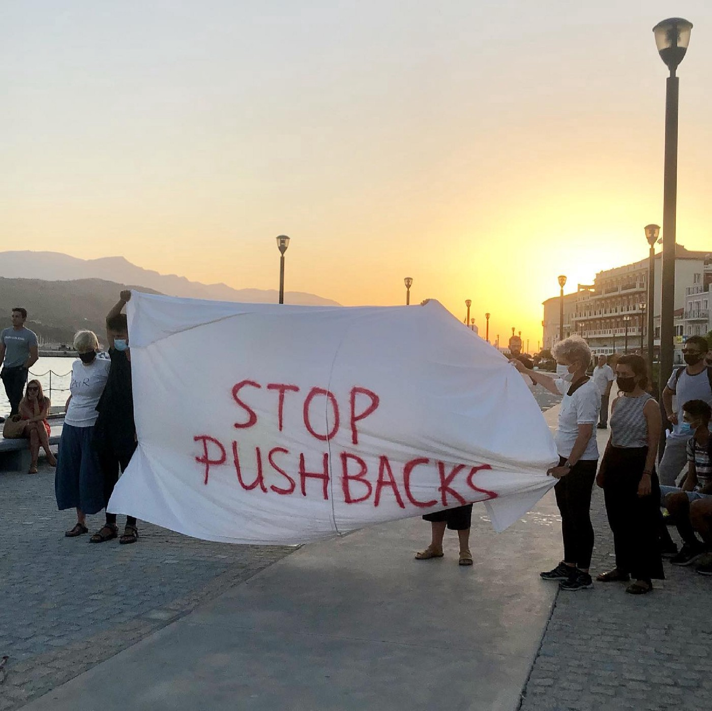

### AYS Daily Digest 02/07/21: Children in Greece struggle to visit schools
### So\-called Libyan Coast Guard attacks boat in Maltese SAR zone // Belarus closes border to Ukraine // Austria wants to “never halt” deportations to Afghanistan // Sea\-Eye starts fundraiser in the name of Germany’s interior minister

[Are You Syrious?](?source=post_page-----4670c8dccb34--------------------------------)

[Jul 3](ays-daily-digest-02-07-21-children-in-greece-struggle-to-visit-schools-4670c8dccb34?source=post_page-----4670c8dccb34--------------------------------) · 5 min read

Pushbacks are one problem in Greece, access to education another one\. Credits: [Facebook/Europemustact](https://www.facebook.com/europemustact/photos/pcb.325980615681306/325980495681318/)
### Greece

For children in Greece it has become even more difficult to be enrolled into schools during the Covid\-19 pandemic, Euractiv [writes](https://www.euractiv.com/section/non-discrimination/news/pandemic-takes-toll-on-refugees-school-access/?fbclid=IwAR35wU3HLMZd7ysIvUcFdrm2vSn2YFiIkWQw99Dc2X5BwNkgvRCahGrwYoQ) \. “There is also a lack of harmonisation across the EU when it comes to recognising the qualifications already obtained by refugees and migrants, despite the existence of the European Qualifications Passport for Refugees,” the magazine writes\. Despite EU\-funded coordinators, NGOs are critical because they say no smooth access is guaranteed\. With contradictory statements by the Greek Ministry of Education, it is not known how many kids go to school — either 8600 or 14,400\. However, at the end of 2020 some 44,000 children are estimated to be living in Greece\.

The Mobile Info Team for refugees in Greece wishes to remind refugees to check their interview dates and renew their plastic cards\.
### [Log In or Sign Up to View](https://www.facebook.com/mobileinfoteam/posts/3039238386304870)
### [See posts, photos and more on Facebook\.](https://www.facebook.com/mobileinfoteam/posts/3039238386304870)

[www\.facebook\.com](https://www.facebook.com/mobileinfoteam/posts/3039238386304870)

Samos volunteers is looking for a project manager\.
### [Project Manager — Samos Volunteers](https://www.samosvolunteers.org/project-manager?fbclid=IwAR1iTf6B1o7J4fk9sTKzWqmnkMQkJBCpHpkNw01yNGRZ_ylXWfS_OKGzaiI)
### [Samos Volunteers is recruiting a Project Manager to oversee the activities and services of the organisation on the…](https://www.samosvolunteers.org/project-manager?fbclid=IwAR1iTf6B1o7J4fk9sTKzWqmnkMQkJBCpHpkNw01yNGRZ_ylXWfS_OKGzaiI)

[www\.samosvolunteers\.org](https://www.samosvolunteers.org/project-manager?fbclid=IwAR1iTf6B1o7J4fk9sTKzWqmnkMQkJBCpHpkNw01yNGRZ_ylXWfS_OKGzaiI)
### Libya

In the Tajoura prison air strike on July 2nd 2019, dozens of people were killed and some 140 wounded\. Many of the suvivors are still living in the facility, waiting for support\. Around 160 are said to be in the streets, demanding that the UNHCR take care of them\. They want to be evacuated out of the country\.
### Sea

After a search operation by Pilotes Volontaires in the central Mediterranean, SOS Mediterranee found two boats set on fire by the so\-called Libyan Coast Guard \(LCG\) \. The people had been intercepted and pulled back\.

The Pilotes found a third boat, which reportedly landed at Lampedusa\.
### [Log In or Sign Up to View](https://www.facebook.com/pilotesvolontaires/posts/855551945062151)
### [See posts, photos and more on Facebook\.](https://www.facebook.com/pilotesvolontaires/posts/855551945062151)

[www\.facebook\.com](https://www.facebook.com/pilotesvolontaires/posts/855551945062151)

In another incident on June 30, at least seven people died and ten are still missing, [according](https://www.msf.org/seven-people-drown-and-10-are-missing-shipwreck-italian-island?fbclid=IwAR1wRHt7sVZ9AFK-99z693ayvKUoMM5T0gKkVpVioxEAvc3YNjp-pB5vyBE) to MSF\. The shipwreck was found off Lampedusa\.

At the same time, the Coast Guard announced internal investigations of dangerous maneuvers against boats, according to [Avvenire](https://www.avvenire.it/attualita/pagine/in-vista-del-rifinanziamento-italiano-tripoli-fa-mea-culpa-e-apre-inchiesta?fbclid=IwAR1AlEqHnQ9mKRVa_pQqPB3CofFcwa7z23nm3amiTJ-MbVKHfjHV9NRiVDM) \. The European Commission stated they had seen the video of one such incident and will try to verify the circumstances and ask for explanations\. In a few days, the Italian Parliament is voting on the refinancing of missions in Libya\. Since 2017, the country has transferred around 213 million euros of the 800 million allocated\.

Journalist Nikolaj Nielsen further witnessed a Libyan Patrol Vessel intercepting a boat inside the Maltese SAR area\.

**Worth reading:**
- [Inside Italy’s show trial against Libyan](https://www.borderline-europe.de/unsere-arbeit/article-inside-italys-show-trial-against-libyan-boat-drivers?fbclid=IwAR2kuGs2ykrApx0dcPPO21OM32Dgzlm-Lff-degouFiAjXVl3r-fp23kQ0Y) ‘boat drivers’

### Serbia

Klikaktiv highlights the poor conditions at the Old Farm in Horgos, where many people start their attempt to cross the border to Hungary — and return after being illegally pushed back\.
### [Log In or Sign Up to View](https://www.facebook.com/klikaktiv/posts/4397295853665334)
### [See posts, photos and more on Facebook\.](https://www.facebook.com/klikaktiv/posts/4397295853665334)

[www\.facebook\.com](https://www.facebook.com/klikaktiv/posts/4397295853665334)
### Belarus

Apparently, Belarus has closed its borders to Ukraine, accusing the country of harbouring “Western\-linked terrorists”, Radio Free Europe [writes](https://www.rferl.org/a/lithuania-belarus-migrants-surge/31338185.html?fbclid=IwAR1K78BI9tyLaV2jiSXjcy4vPJJ3GgsZAoO9ObR5BYLV0Vm9szh5ucc4ehw) \. At the border with Lithuania, the number of irregular crossings has increased in the past months\. It is rumoured that the regime is sending people there to put pressure on its neighbours\.

Also, Belarus is building a detention centre, which is scheduled to be completed in 2021, according to [Belta](https://www.belta.by/regions/view/stroitelstvo-tsentra-dlja-migrantov-v-polotskom-pogranotrjade-planirujut-zakonchit-v-2021-godu-420078-2020/?fbclid=IwAR0v2y1i25UddVxVfmX3fH4WqlZdquOzYBfnkty-ovxn2T9HjxyCKJD5B6E) \.
### Austria

As three Afghan asylum seekers have been arrested, two at the end of June and one this month, accused of having raped and killed a teenage girl, chancellor Sebastian Kurs vowed according to [InfoMigrants](https://www.infomigrants.net/en/post/33371/austrian-chancellor-vows-not-to-halt-deportations-to-afghanistan?fbclid=IwAR1JfZqUrp7Sduz8icPgOGE5AS10j1bsABLH6dIvsgs4qI5fOhu4JGYd9ks) : “With me, there will definitely never be a halt to deportations to Afghanistan or a watering\-down of asylum laws toward asylum\-seekers who commit crimes\.”
### Germany

Following the cynical statement by interior minister Horst Seehofer three years ago, when 69 Afghans were deported on his 69th birthday, Sea\-Eye has started a fundraiser to benefit civilian sea rescue\. They will present Seehofer with a donation certificate as a birthday present\. More than 6000 people have already given 190,000 Euros, and a couple of prominent figures support the fundraiser, [according to taz](https://taz.de/Spendenaktion-fuer-zivile-Seenotrettung/!5783856/) \.

**Worth reading:**
- [Hamburg: How are Afghan immigrants looking at NATO troop withdrawal?](https://www.infomigrants.net/en/post/33350/hamburg-how-are-afghan-immigrants-looking-at-nato-troop-withdrawal?fbclid=IwAR3TdTSCkTplB7Di8TIAIT5x3CDwkT8R0JfdvrR7wq1jrSeqsT61bxNIX6s)

### UK

Following Denmark’s approach to externalize Aslyum processes to African countries, the UK’s Home Secretary, Priti Patel, wants to present a similar bill next week, Il Manifesto [reports](https://global.ilmanifesto.it/london-follows-denmark-send-migrants-to-africa/?fbclid=IwAR1qyxVw7cbSyhlPduGHR9ms-LFQE-nZKXFRBBGabY9MYugf4KhcT7V7gdQ) \. It is said to be a reaction to the increasing number of new arrivals from France, where people try to cross the Channel by boat\. “Furthermore, this law goes hand in hand with the recent government decision to cut humanitarian foreign aid,” the outlet recalls and adds that according to the proposal, business travel would be exempt from quarantine if the trip has significant benefit for the UK\.

After the Home Office claimed that the much\-criticized Napier barracks in Kent would be only temporarily used during the pandemic, the Tories have now suggested using it for “another couple of years”, the Socials Worker [writes](https://socialistworker.co.uk/art/52043/Tories+want+to+keep+refugees+in+Napier+army+barracks?fbclid=IwAR1oL1ojZc7f0lpBV_T9pwAgylibGl7b0pyicsIlUFxc41N-NwTZpV2-nn0) \. Some 200 residents got infected with the coronavirus in a major outbreak this year\. Later, a court ruled that the facility does not meet minimum standards, while the Home Office speaks about “significant improvements”\. In Penally, west Wales, a campaign by anti\-racism activists achieved the closure of a similar facility\.

The UK’s refugee council has [published](https://www.refugeecouncil.org.uk/latest/news/thousands-seeking-asylum-face-cruel-wait-of-years-for-asylum-decision-fresh-research-shows/?fbclid=IwAR3GUPC9Ze8Kwx2BQBycUpmlFdLWTPCZWuPAgJCb0kP53u6fUSMVYPcU6II) a new report showing how asylum decisions are delayed, sometimes for years: “The number of people waiting for more than a year for an initial decision increased almost tenfold from 3,588 people in 2010 to 33,016 in 2020\.” The number of children waiting longer than a year for an initial decision rose twelve times from 560 to 6900\. More than 250 people have been waiting for more than five years\.

**Worth reading:**
- [Iranian refugee acquitted of smuggling slams](https://www.aljazeera.com/news/2021/7/1/profound-injustice-uk-jailing-of-asylum-seeker-draws-ire?fbclid=IwAR2H5qTMnXdV56dcozsDJlFBnczqUm45gJ4aKG2t8zHbz3iS2WUzk9GgBZQ) UK asylum policies
- [Sudanese Experience of the Everyday Cruelties](https://africanarguments.org/2021/07/sudanese-experience-of-the-everyday-cruelties-in-the-uk-asylum-system/?fbclid=IwAR1oL1ojZc7f0lpBV_T9pwAgylibGl7b0pyicsIlUFxc41N-NwTZpV2-nn0) in the UK Asylum System
- [Denmark shattering lives of Syrian refugees](https://euobserver.com/world/152315?fbclid=IwAR25zKDBzvDO5-8gyqllpLRRztaUHLTZjC6tnqFJb9WJshoYKMsggdIts1k)

### EU

**Worth reading:**
- [Frontex: the controversial European Union](https://unfilteredvoices.org/2021/07/02/frontex-the-controversial-european-union-agency-on-the-brink-of-closure/?fbclid=IwAR2poXQqhZ4DIAHcUzIpbpytDjA5rwCkbBEHwzmho1EJM0GPTBXIcVLWIRI) agency on the brink of closure
- » [Die Agentur ist komplett außer Kontrolle](https://www.jungewelt.de/artikel/405574.eu-abschottung-die-agentur-ist-komplett-au%C3%9Fer-kontrolle.html?fbclid=IwAR3ID8hg2YoGrl1VTZv5LmNZGlEheBhVpQy6VtLujKDK3iJS6HA_34xMQBo) «
- [Assessing the Responsibility of EU Officials](https://www.e-ir.info/2021/07/02/assessing-the-responsibility-of-eu-officials-for-crimes-against-migrants-in-libya/?fbclid=IwAR3P5NNy0l5Idqmb9xVj6ive96HjX6uGosbQkT4HGVaQsr0pXVQqgyFB9RU) for Crimes Against Migrants in Libya

### General

Border Violence Monitoring Network [invites](https://www.facebook.com/events/819229555367578/) everyone to an online webinar on Slovenia and chain pushbacks on Monday\.
### [Log In or Sign Up to View](https://www.facebook.com/omroephuman/videos/508981667040501)
### [See posts, photos and more on Facebook\.](https://www.facebook.com/omroephuman/videos/508981667040501)

[www\.facebook\.com](https://www.facebook.com/omroephuman/videos/508981667040501)

Solidarité Migrants Wilson is [hosting](https://www.facebook.com/events/361345058746063/) a fundraising party on Friday in Paris\.

**Worth reading:**
- [Elena Weekly Legal Update](https://mailchi.mp/ecre/elena-weekly-legal-update-02-july-2021?e=1fd2db1ebf&fbclid=IwAR19hrakapXK_nRXFb6CrMijtix0B9JTc5jrstZCt3s_p5_YYWzY8LNQUaU)
- [Book Review: Policing Humanitarianism: EU Policies Against Human Smuggling and Their Impact on Civil Society](https://www.law.ox.ac.uk/research-subject-groups/centre-criminology/centreborder-criminologies/blog/2021/07/book-review?fbclid=IwAR2o34JfzZRlyw7KOuTbwqtffak2ZkwsgJdw6TwFgEGZGzTLmuvPt6U-8dA)
- [New books on Forced Migrations](https://forced-migration-information.blogspot.com/2021/07/new-books-july-2021.html?fbclid=IwAR1NlhqC2DoEq4BAnf0D1SWT530FHY8xgG7m3zzROotqyhYcs6EH_4TqV08)

### Find daily updates and special reports on our [Medium page](https://medium.com/are-you-syrious) \.

**If you wish to contribute, either by writing a report or a story, or by joining the info gathering team, please let us know\.**

**We strive to echo correct news from the ground through collaboration and fairness\. Every effort has been made to credit organisations and individuals with regard to the supply of information, video, and photo material \(in cases where the source wanted to be accredited\) \. Please notify us regarding corrections\.**

**If there’s anything you want to share or comment, contact us through Facebook, Twitter or write to: areyousyrious@gmail\.com**

_Converted [Medium Post](https://medium.com/are-you-syrious/ays-daily-digest-02-07-21-children-in-greece-struggle-to-visit-schools-b43fb7f0a7c9) by [ZMediumToMarkdown](https://github.com/ZhgChgLi/ZMediumToMarkdown)._
