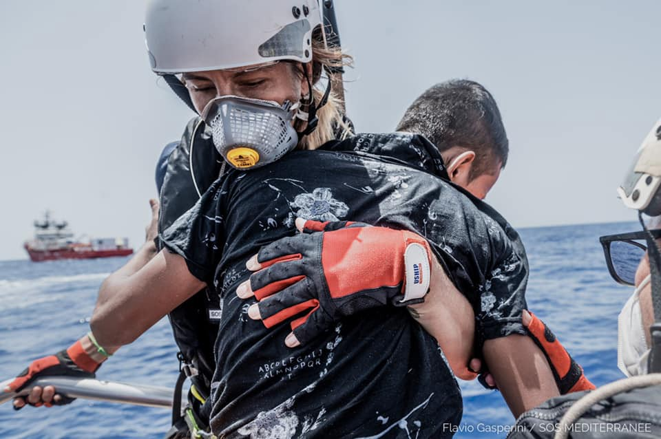
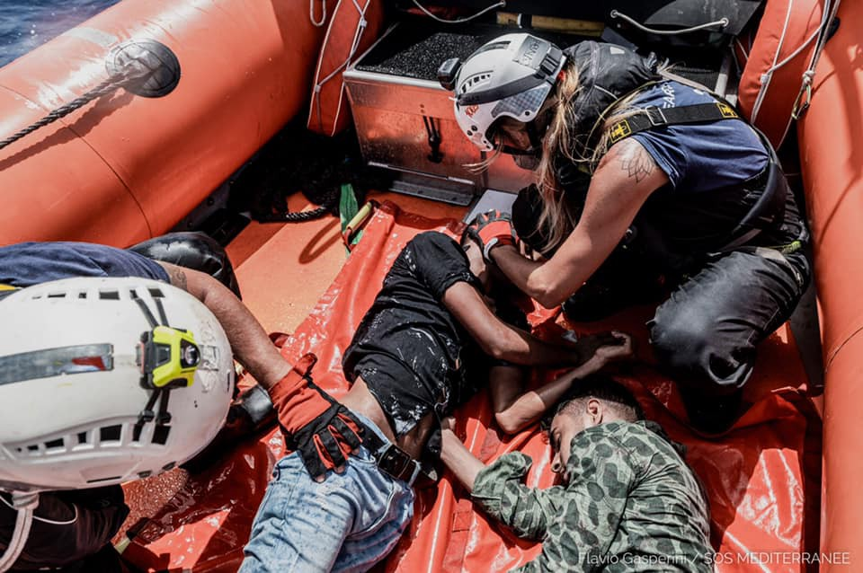

### AYS Weekend Digest 3–4/7/21 Ocean Viking rescues 138 people on Sunday

_Update on Samos with news of closed camp // state of emergency issued in Lithuania // evictions in France // and more…_
### FEATURE: Ocean Viking rescues 138 people on Sunday after eventful few days

](assets/51d598d173a0/1*pbIgAplR7EjEaJlI9Gl6Rw.jpeg)

Photos by [SOS MEDITERRANEE](https://www.facebook.com/infoforrefugees/posts/4204035946342713)

[Refugees — info for and about refugees](https://www.facebook.com/infoforrefugees/posts/4204035946342713) — provided this thorough timeline of events for the Ocean Viking over the last couple of days:

“Last update: 4/07/2021 at 19:48 \(All times in UTC \+ 2 hours/CEST\)”

→ “ **On June 27** , the Ocean Viking leaves the port of Marseille, France\.
 → **On July 1st** , the Ocean Viking rescues 44 persons from two wooden boats in distress, in two separate operations, in the Maltese Search and Rescue Region: 30 persons are rescued in the first operation; 14 persons in the second\. The Ocean Viking also spots an empty blue wooden boat adrift in the Maltese Search and Rescue Region\.
 → **On July 2nd** , the Ocean Viking searches for two wooden boats in distress in the Maltese Search & Rescue Region\. The Ocean Viking witnesses both empty boats set in fire following their interceptions by the Libyan Coast Guard\.
 → **On July 2nd** , the Ocean Viking requests a Place of Safety for the 44 survivors onboard\.
 → **On July 3rd** , the Ocean Viking rescues 21 persons from a fibreglass boat in distress in the Libyan Search and Rescue Region\. The Ocean Viking also spots two empty boats in the Libyan Search and Rescue Region\. The Seabird aircraft from Sea\-Watch confirms that one has been intercepted by the Libyan Coast Guard\. The Ocean Viking investigates one of them, a double\-deck wooden boat and finds personal belongings\.
 → **On July 4th** , the Ocean Viking performs two rescue operations in the Maltese Search and Rescue Region: 67 persons are rescued from a wooden boat in distress in the first operation; 71 others are also rescued from a wooden boat in distress in the second operation\.”
#### SEA

Shipwrecks \+ distress calls \+ arrival reports = average weekend when there is still no coordinated rescue mission in the Mediterranean:

■■■■■■■■■■■■■■ 
> **[Safa Msehli](https://twitter.com/msehlisafa) @ Twitter Says:** 

> > More remains wash ashore in Zawya #Libya.

The bodies of 14 people, including a child and a woman have so far been retrieved.

The daily horrific reality in the Central Mediterranean. https://t.co/Rz4Wg5cSgD 

> **Tweeted at [2021-07-03 09:08:37](https://twitter.com/msehlisafa/status/1411250516412280835).** 

■■■■■■■■■■■■■■ 

■■■■■■■■■■■■■■ 
> **[Alarm Phone](https://twitter.com/alarm_phone) @ Twitter Says:** 

> > 🆘! Boat in need near Sardinia!

Alarm Phone is in contact with 13 people in distress near #Sardinia. Their engine is broken and they have been drifting off the island for about 11 hours. MRCC Rome and the authorities in Sardinia refuse to start a search and rescue operation! 

> **Tweeted at [2021-07-04 15:10:51](https://twitter.com/alarm_phone/status/1411704062215659523).** 

■■■■■■■■■■■■■■ 

■■■■■■■■■■■■■■ 
> **[Alarm Phone](https://twitter.com/alarm_phone) @ Twitter Says:** 

> > UPDATE: Relatives informed us about the arrival of the 10 people in #Spain! We are relieved that the people are safe now. 
#WelcomeToEurope 

> **Tweeted at [2021-07-04 20:15:19](https://twitter.com/alarm_phone/status/1411780686684508162).** 

■■■■■■■■■■■■■■ 

#### GREECE

■■■■■■■■■■■■■■ 
> **[@rainyclouds@mastodon.lol](https://twitter.com/PHupfen) @ Twitter Says:** 

> > #SamosSunday
The situation on #Samos at the moment:
Many people have left either with official transfers or illegally. Numbers in the camp are around 1200. You can sense that suddenly there is a political motivation to empty the camp.
(1/4) 

> **Tweeted at [2021-07-04 08:01:13](https://twitter.com/phupfen/status/1411595942705389568).** 

■■■■■■■■■■■■■■ 

Samos update [continues](https://twitter.com/PHupfen/status/1411595949609304068) :

> “For those who can’t leave, the situation is mostly very hopeless\. It is hard to understand why some people are allowed to leave while others are not\. This adds to the frustration of the remaining refugees\. I wouldn’t be surprised to see rising tensions in the next weeks\. 

> Last week two groups of new arrivals were reported\. It is quite unusual to see new arrivals on Samos nowadays, the majority of those seeking protection are pushbacked, violating their right to claim asylum\. 

> A message was sent to all camp residents announcing the moving of the camp for the next weeks\. Many say they will refuse to go there as the camp is isolated & resembles a prison\. If they are being moved after many months / years here, they want to be moved to the mainland\.” 

17 people most likely deported back to Turkey from Chios, when they arrived to the island Sunday morning\. EFSYN reports “ _According to the testimonies of locals, the boat, which as it turned out, finally transported 21 people, approached the shores of the island, shortly after nine in the morning and while in the sea area, the port patrols and a military helicopter had made their appearance\. The villagers then saw a police cage transporting the refugees through the village streets, but then their traces disappeared once again\._ ” More [here](https://www.efsyn.gr/ellada/koinonia/301086_exafanisan-17-prosfyges-xehasan-toys-tesseris-sti-hio) \.

■■■■■■■■■■■■■■ 
> **[Lena K.](https://twitter.com/lk2015r) @ Twitter Says:** 

> > Report that about 60 pple were apprehended in Ormenio, #Evros, stripped off their clothes. 🇹🇷 language site Azınlıkça reports (no link, photo with visible faces) they crossed from 🇹🇷 to🇧🇬 to 🇬🇷. Unclear where the stripping occured, but it seems a common practice in the area. 

> **Tweeted at [2021-07-04 10:34:35](https://twitter.com/lk2015r/status/1411634539089346561).** 

■■■■■■■■■■■■■■ 

#### ITALY

More analyses are coming out after Friday’s news that four Libyan footballers were sentenced for 30 years for people smuggling and murder\. NGO Borderline Europe released the statement:

> “We are deeply disappointed in today’s decision, for the four young men and their families in Libya who have not seen them for years\. We have followed many similar cases before in which authorities arrest people who seek safety and have themselves paid for the trip across the sea as the ‘smugglers’\. Like this, people with limited resources to defend themselves in court are presented as ‘culprits’ and held responsible for migrant boat disasters, while the real culprits are European governments who close borders and force people into dangerous situations\.” 

Alarm Phone also released a very thorough timeline of the trial, which has been going on since 2015\. Read it in full [here\.](https://alarmphone.org/en/2021/07/03/inside-italys-show-trial-against-libyan-boat-drivers/?fbclid=IwAR00mS-3nu31U3AdgMbx0k4EKvR-olpa4K_Qc-MCKIrEOrpFXo9QVqf23S8)
#### BOSNIA AND HERZEGOVINA

](assets/51d598d173a0/0*SB9zxbp1WJuUwJ3z)

“During this time 30 but also 40 boys a day in almost extreme conditions\. They are survivors of the vicious Balkan route\. Linea d’Ombra ODV continues to provide for the most elementary needs: food, clothes, intimate, health care\. We need your support\. We need few things but aim: t\-shirt SIZE M, sweatpants locked in ankle size M\. Supporting us is very simple through the WWMIH group — “We Will Make It Happen “— just go to the link\.” Photo and Info by [Linea d’Ombra ODV](https://www.facebook.com/lorena.fornasir/posts/4056580201125713)
#### LITHUANIA

State of Emergency issued, reports [AP](https://www.thestar.com/news/world/europe/2021/07/03/lithuania-declares-emergency-due-to-migration-from-belarus.html?fbclid=IwAR2UKGhc8kKxovz8a93FnN_ZX8_lrG8ouGbiY0jFcZmnadcA1IkORrw0ZCQ) :

> “ **Lithuania has declared a state of emergency due to an influx of migrants in the last few days from neighboring Belarus** , as tensions between the European Union and Belarus escalate\. Lithuania’s Interior Minister Agle Bilotaite said late Friday that the decision, proposed by the State Border Guard Service, was necessary not because of an increased threat to the country of 2\.8 million people but to put a more robust system into place to handle migrants coming in\. 

> “It’s very important to have a legal system and instruments … to be able to swiftly make decisions in response to arising challenges,” Bilotaite said during a government meeting Friday evening, according to the Baltic News Service\. 

> Belarus’ authoritarian President Alexander Lukashenko has warned that his country would retaliate against the latest EU sanctions on his regime by loosening border controls for undocumented migrants\. The bloc tightened sanctions against Belarus after Lukashenko’s government forced a passenger plane to divert and land and arrested a prominent journalist on the flight\.” 

#### FRANCE

■■■■■■■■■■■■■■ 
> **[Human Rights Observers](https://twitter.com/HumanRightsObs) @ Twitter Says:** 

> > Ce matin à #Calais les personnes #exilées se font expulser sous la #pluie. Leurs tentes et bâches ont toutes été #saisies par les #FDO.
La violence d'Etat à la frontière franco-britannique dénoncée depuis des années, n'ont toujours pas cessé.
@[GDarmanin](https://twitter.com/GDarmanin)
@[Prefet62](https://twitter.com/Prefet62)
#StopExpulsion https://t.co/mcIk8Ew1vT 

> **Tweeted at [2021-07-04 20:36:18](https://twitter.com/humanrightsobs/status/1411785963949465600).** 

■■■■■■■■■■■■■■ 

Update from Mobile Refugee Support:

> “It has been a particularly tough few weeks for displaced people living in the Dunkirk area with at least two police evictions per week, and rapid & extreme fluctuations in weather\. With huge amounts of rain over the last few days, vast areas of the camp have become covered in thick mud reminiscent of the conditions of the previous site last winter\. 

> Regardless of these extremely testing circumstances, the communities remain positive and upbeat\. On sunnier days, while our various services are running, our volunteers have time to sit, converse and spend time with people\. Our close relationship and the trust shared with the communities here is something we hold very dearly, while also being of invaluable assistance to our work\. 

> Being on\-site so regularly results in people becoming very familiar with our procedures that often they will assist us in setting up and explaining these procedures to new arrivals\. Over the last two weeks, we have seen on average 25–30 new arrivals per day, and we expect this number to only increase over the coming months\. 

> We are in desperate need of tents and have recently launched a new fundraiser to enable us to purchase a bulk amount directly from the manufacturer\. 

> Donating via this fundraiser will increase your donation by 25% via gift\-aid, thanks to our incredible partners at Donate4Refugees\. The current price for a 2\-man tent from our supplier is just £8\. To donate, please follow the link below\. If you are unable to donate, please share this post so it may reach as far as possible\. Thank you all for your continued support\.” 

[Donate here\.](https://www.totalgiving.co.uk/mypage/mrs_summerappeal)
#### UK

2 important articles from the Independent:
- “‘We’ve skipped meals’: Thousands of asylum seekers still without cash cards five weeks after botched contract transfer\.” About 7% are still without working Aspen cards\. Human rights advocates are calling on investigations\. Read [here](https://www.independent.co.uk/news/uk/home-news/asylum-seekers-aspen-card-home-office-b1875552.html?fbclid=IwAR3CNm0ldzVU6FDy1QONolg6dMeFD3yHTrkf8bK2Tk5JKDGeP1OtOdXjQoc) \.
- “Priti Patel announces harsher sentences for migrants in bid to deter Channel crossings\.” They could face up to 4 years in prison\. Read [here](https://www.independent.co.uk/news/uk/home-news/priti-patel-illegal-channel-crossing-b1877753.html?fbclid=IwAR2BBD8Rozd5FCH3IFqn7IPXhntThmrJ9D-Wx0XTbi8pJ60JmTc2hoGtuqo) \.

#### WORTH READING
- GERMANY [“Why did they have to go? The deportation of a well\-integrated Georgian family causes the CDU in Saxony in particular to find it difficult to explain\.”](https://www.zeit.de/2021/27/abschiebung-pirna-georgische-familie-cdu-sachsen?fbclid=IwAR1JsQSXkERjenQq3OqwFwU7QKLgqxlJY-4O9IKpfqb3vqyKNpYEafwe5KI&utm_referrer=https%3A%2F%2Fl.facebook.com%2F)

### Find daily updates and special reports on our [Medium page](https://medium.com/are-you-syrious) \.

**If you wish to contribute, either by writing a report or a story, or by joining the info gathering team, please let us know\.**

**We strive to echo correct news from the ground through collaboration and fairness\. Every effort has been made to credit organisations and individuals with regard to the supply of information, video, and photo material \(in cases where the source wanted to be accredited\) \. Please notify us regarding corrections\.**

**If there’s anything you want to share or comment, contact us through Facebook, Twitter or write to: areyousyrious@gmail\.com**

_Converted [Medium Post](https://medium.com/are-you-syrious/ays-weekend-digest-3-4-7-21-ocean-viking-rescues-138-people-on-sunday-51d598d173a0) by [ZMediumToMarkdown](https://github.com/ZhgChgLi/ZMediumToMarkdown)._
