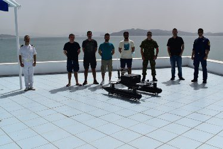

### AYS Daily Digest 5/7/21: Court confirmed the systemic chain pushbacks
#### New report on the consequences of the EU\-Turkey statement for Syrian asylum seekers in Greek hotspots / 212 people were intercepted by UK vessels on Sunday, ahead of the UK Government’s announcement of harsh measures for people arriving by boats to seek protection / recommended reads & more

](assets/b8e0749604ad/1*tv7SNxHyoR-ZvHV-otdJhQ.jpeg)

Photo: [Push\-Back Alarm Austria](https://www.facebook.com/PushBackAlarmAustria/?__cft__[0]=AZUV_mNIOb1Xx_XmHZNwOkCHTEyCa7IdkYWAm_dih1HMwyOQMSY3RObT8ACGj_sMy1jpleJEhnqqSrXxyFj2h-ErFUy8-ZlZu9Vl4ysxkzhIFpBPS6DANA8vh0QpQtF0isokcdMKEbIKk7mpNSK49GH_&__tn__=-UC*F)
#### FEATURED — Court confirms systematic human rights violations by Austrian police

_Regional Administrative Court of Styria confirmed the practice of chain puchbacks and found the Austrian police guilty of violating the right to human dignity and the right of documentation_

On 28th of September 2020 eight people were pushed back after being chased and humiliated by Austrian police\. Their repeated verbal demand for asylum had been ignored, and no interpreter was involved, as our friends from the initiative „Push Back Alarm Austria“ documented, as we reported earlier on, and later pressed charges in the one case of Ayoub N\.

Now, the court confirmed the methodical practice of chain pushbacks and for the first time the existence of a chain pushback route from Austria or Italy crossing Slovenia and Croatia to Bosnia, including the collaboration of the police in different countries\.

> The actions of the police officers who intervened were purposefully aimed at the rejection of the complainant and there is no room for any other interpretation 

In synopsis of the entire official act, the court concludes that there was an obvious bias of the officers against the complainant, since the physical search was disproportionate, no food was provided, and the involvement of an interpreter was omitted despite obvious language difficulties and the use of the word “asylum”, [the verdict states](http://asyl.at/de/info/presseaussendungen/push-back-routevonoesterreichbisbosnien/?s=pushbacks) \.

The joint press release of Push\-Alarm Austria & Asylkoordination notes that, despite a court finding that his rights were disregarded, due to a legal loophole, the complainant Ayoub N\. will not be allowed to enter the country\. “I was confident that we would win the case\. After returning to Bosnia, I felt like shattered glass\. At the moment, I am trying to sort out my life and move forward,” he said\.

> “We are talking about systematic human rights violations, inhumane treatment and ignoring the principles of the rule of law by police in Austria\. It is completely unimaginable that this is happening without the knowledge and against the expressed will of the Minister of the Interior and his officials\. If someone questions the Geneva Refugee Convention, one of the greatest lessons of the Shoah, and at the same time does not take consistent action against systematic human rights violations by the police, the only thing left to do is to resign\!” 

> Lawyer Clemens Lahner sees the finding as a clear warning to the Ministry of the Interior to put an end to the systematic disregard for the rule of law as soon as possible: “Not everyone who applies for asylum in Austria automatically will receive a substantive asylum procedure or be granted protection\. But these questions are to be examined and decided by the competent authorities or courts,” the lawyer clarifies\. “If the police presume to decide who will get an asylum procedure at all, this is clearly illegal\. The Ministry of the Interior has now been put on written notice, in the name of the Republic\.” 

> Klaudia Wieser of Push\-Back Alarm Austria said\. “This case shows the necessity of our initiative to prevent systematic breaches of the law at Austrian borders\. Austrian push\-backs frequently constitute the first step of chain push\-backs beyond the EU’s external borders\. Sebastian Kurz is the spiritus rector of systematic human rights violations along the push\-back route to Bosnia\.” 

The finding from Graz also puts the Slovenian government which has just taken over the EU Presidency under considerable pressure\. For the first time, it is possible to prove in a court case what human rights organisations such as ours and particularly everyone within the Border Violence Monitoring Network have been documenting since 2016: a continuous pushback route via Austria or Italy via Slovenia and Croatia to Bosnia\.

**“If someone questions the Geneva Refugee Convention, one of the greatest lessons of the Shoah, and at the same time does not take consistent action against systematic human rights violations by the police, the only thing left to do is to resign\!** ” — University Professor Dr\. Benedek of the Institute of International Law and International Relations from the University of Graz said\.

However, as in other such cases in countries along the so called Balkan Route, no higher responsibility has so far been established by a court or other instance deemed valid by the states, so we expect to see more tacit acceptance of the anti\-people and anti\-human rights commands by those on the top\.
#### SEARCH AND RESCUE AT SEA

People fleeing the African continent are being consistently returned to Libya and other countries that are occasionally reporting sea rescues and returns\. This time, the Moroccan navy [reports](https://l.facebook.com/l.php?u=https%3A%2F%2Fwww.daijiworld.com%2Fnews%2FnewsDisplay%3FnewsID%3D849966%26fbclid%3DIwAR2TgTSp7r1BBIgW95Pe5R6AqHFfgL941jpK4tcnL_76xNGi5KaQjZDzzek&h=AT0Z8YhKMJCglLX2pDuUB4fXqUIxCAeDY7nn6vB5snxBX7KwRlUnAtj03VXjyjJKiSr-HYZbcHHNnOdmCcP99iZuJ3FDl1OG-gEh1q5nUI8BWa7aiQHIg1WdO70yreb3nFCE5snxDh6KMQ&__tn__=R]-R&c[0]=AT3E5iRpuauT2RWaUnjbKlhB7tyKWSIAEZIY-7IMmzYxQHg-QdGdFjvjKijQAioSupm4ZCSz_1e2dbZjtDT_T3jgt4G43EYraNvhObu1zsncsFAJy3gBl0VPT5mw-Orcm4AdGEbn0iwlkZI7erOd_D4SOrCrhm6Evhg-bcipig1yaXGhdmYWAPFOXH-615GYrwD5jD0Ro_s) they “rescued 244 Spain\-bound migrants in the past two days”\.

Overnight, the team of SOS MEDITERRANEE performed a rescue operation of a large wooden boat in the Libyan Search and Rescue Region\. 369 people have been safely brought onboard after over 5 hours of operation, with a boat at high risk of capsizing at all times\.

572 survivors are now onboard Ocean Viking\.

■■■■■■■■■■■■■■ 
> **[SOS MEDITERRANEE](https://twitter.com/SOSMedIntl) @ Twitter Says:** 

> > Overnight, the @[SOSMedIntl](https://twitter.com/SOSMedIntl) team performed a rescue operation of a large wooden boat in the Libyan SRR. 

369 people have been safely evacuated after over 5 hours of operation, with a boat at high risk of capsizing at all times.

572 survivors are now onboard #OceanViking. https://t.co/8znO6ToISg 

> **Tweeted at [2021-07-05 05:40:45](https://twitter.com/sosmedintl/status/1411922979500531715).** 

■■■■■■■■■■■■■■ 

> Tonight we performed the sixth rescue in five days\.
 

> A big wooden boat with 369 people on board fleeing from Libya\. The operation took more than 5 hours\.
 

> Now on Ocean Viking there are 572 survivors\. Among them, children, babies, unaccompanied minors, pregnant women, men\. 

> Mediterranean Sea is the deadliest migration route, crossed everyday by people fleeing in search for a better life\. 

> In the meanwhile, thousands of people are illegally pushed back to Libya\.
 

> No justice, no peace\.
 

> We need a Port of Safety\. — _F [ulvia Conte](https://www.facebook.com/fulvia.conte?__cft__[0]=AZVf7ppJu7y_aQscNhirp-EeQ9HHxHkZEQGqZqduT133t5Ro2WV-OaWaPObBSrHl37FdGPUPKuojXx5RGq4xNaFHhuOjyqV0i0xH8BEtvjhSi3Hh7BAz3cfM7ylZTS3f8kQ&__tn__=-UC%2CP-R)_ 

](assets/b8e0749604ad/1*6fLg8hOleULNYf1YNhrAAQ.jpeg)

Photos: Flavio Gasperini / SOS Mediteranee, via [Fulvia Conte](https://www.facebook.com/fulvia.conte?__cft__[0]=AZVf7ppJu7y_aQscNhirp-EeQ9HHxHkZEQGqZqduT133t5Ro2WV-OaWaPObBSrHl37FdGPUPKuojXx5RGq4xNaFHhuOjyqV0i0xH8BEtvjhSi3Hh7BAz3cfM7ylZTS3f8kQ&__tn__=-UC%2CP-R)

It was reported that a boat with 24 people arrived on Monday, July 5, while the day before 9 arrivals were documented, with a total of 207 people who landed on board the boats\. By the evening, there were 337 people in the so called hotspot on Lampedusa\. The media have also [reported](https://itonijesve.com/) that a boat with 24 people of Tunisian origin on board was intercepted in the waters off the coast of Lampedusa\.

“At first glance, not every border materializes through a wall\. Here, the visible and invisible powers that impinge on relations between Europe and Africa\.”
 Lampedusa, Central Mediterranean, July 2021
 The Southern Gate to Fortress Europe\. — Photo: Sara Creta

Meanwhile, MSF urges Italian authorities to release their rescue ship, aware that the authorities use this type of inspection to pursue political objectives under the guise of administrative procedures\.

> Doctors Without Borders has been running Geo Barents since May\. The ship is fully certified for search and rescue activities and has recently been refitted and always complies with the applicable rules and regulations of the relevant maritime authorities\. 

Here is their statement, in [German](https://www.aerzte-ohne-grenzen.de/italien-freigabe-geobarents-gefordert?fbclid=IwAR30REzsf6snQkKO6YwT7dvky5pc5BbxwsM8xOozLQZnRkT-QWJ993IF8Ds) \.
#### GREECE
### Arrivals

While only 27 ppl arrived on Samos in 2021, **612 were pushed back to Turkey\.** The number of boats arriving in the Aegean is at a historic low thanks to systematic pushbacks, deterrence practices and other human rights violations executed by border forces and Frontex, [Mare Liberum](https://twitter.com/teammareliberum) reports\.

■■■■■■■■■■■■■■ 
> **[Mare Liberum e.V.](https://twitter.com/teammareliberum) @ Twitter Says:** 

> > Meanwhile a ship from the Frontex fleet appears to be in full holiday mode on the island Samos. The German ships crew appears to be celebrating, while activists advocate and mourn the victims of Europe's deadly border policies. (2/3) https://t.co/op9A1E50Jp 

> **Tweeted at [2021-07-05 15:59:25](https://twitter.com/teammareliberum/status/1412078673692442628).** 

■■■■■■■■■■■■■■ 

### Consequences of the EU\-Turkey deal for Syrian asylum seekers in Greek hotspots: a mass rejection policy

Between January 2020 and June 2021, in the framework of our legal representation work on the islands of Chios and Kos, we have increasingly been confronted with the desperation and disillusionment of Syrian asylum seekers who arrived on these islands\. A mass rejection policy in which the assumption of safety of Turkey is de facto unrebuttable has reyuted in their asylum applications rejected at a 100% rate\. More and more frustrated and hopeless about the procedure they undergo at the Greek borders, these people are now the subject of a report that aims “not only to depict the inherent dysfunctionalities of this system, but also to warn about the foreseeable implications of the implementation of the June 7th Joint Ministerial Decision\.”

**Report on Consequences of the EU\-Turkey Statement — The Situation of Asylum Seekers in the EU Hotspots on the Greek Islands:**

[Find the full report here\.](https://equal-rights.org/site/assets/files/1300/210705-consequences_of_the_eu-turkey_statement_equalrights.pdf) 
[Find a press release here\.](https://equal-rights.org/site/assets/files/1300/210705_pressrelease_syrian-report_equalrights-1.pdf)
### EU finances tests of submarines as a tool against migration in Greece

After the exercise, boasting with their expensive tools that the citizens of the EU paid for, the team [reported](https://roborder.eu/2021/07/05/demonstration-of-roborder-in-greece/) the goal was to practice and establish their “readiness towards the early detection of unauthorized sea border crossing, the immediate briefing and dispatch of the directly\-involved units and the surveillance of specific areas in order to detect and analyse incidents of illegal vessel movements\.”

The EU\-funded “risk\-based”, partially automated border control technology was also recently tested [T](https://www.facebook.com/hashtag/tresspass?__eep__=6&__cft__[0]=AZVyQolj3JuVCYuLWolA2p1EQRJkq02_klL91WWwRoFb6BdC3gFRX9tXtS1XGNslqVpNEhpvhVD20i9IN4_0dPd2FLOjQSJ-n1AN6m_3eQakihGh-upJdxRgJxLBkP4yQzPdKTzwNQ0zLlGzGRikf0vcKNDyhZlQs7KC1SKzAMhGyodaoJutDQ9-LvF5zw2ZGKI&__tn__=R]-R) resspass on the Polish border too, as Matthias Monroy noted — This was done by local border troops and the military university\. It was [aimed at](https://l.facebook.com/l.php?u=https%3A%2F%2Ftresspass.eu%2FBorder-pilot-tests-in-Terespol-Poland%3Ffbclid%3DIwAR3p7FS6CGwP5gwbKN4AECIzcy1pa9XNlxG_vrNM1T2pUX6GwLGWcWpOi54&h=AT1KlvCxk0s-nGd8qo8d4K0yUK6PWylt4QYKN1J-wWBbMT0eHfp8CO9EHwfHhhQb3aD7s2UCDBjffg8tt5jiE_y2CmGvn4akN8vYvcekloXdnFHKRG4QStNiq-SG0YF_5MABh5_L2b6slA&__tn__=R]-R&c[0]=AT3QC-3iQ2S3kjn5uXxXtKVZdPZXmY4KT9jEFkGf1GFfSbfx3BzQacsVAKsr4IHNxF6QU2ntRDlRnFNaIkJGeQ74mF_BPLrPDtLFIC_yfqLIKJOY8j7uQ9KQiH8JryXGkeBbN6jaMBNiaF9tP19hFy2IWwlUpR-8t9_ndQ9N6RrXPWRc-E4EkzXqYjxEgSgC24O6tFEGVs9dEseArg) “demonstrating how the developed system can support the work of border guard officers working in the specific conditions of the land border crossing point\.”

In the meantime, linking on the topic of Belarus, bizarre news from **Lithuania** — the authorities there have [declared a state of emergency](https://www.schengenvisainfo.com/news/lithuania-declares-state-of-emergency-due-to-influx-of-migrants-from-belarus/?fbclid=IwAR2GkbCN0LlYQn9Udi1LcmvoRXt4cnDfTx3OoGyROMHse2lhrOx-yyY84II) , after nearly 150 people attempting to reach Lithuania from Belarus on Friday\. Lithuanian border controls had recently been tightened as the nation received border guard teams deployed by Frontex\.
The Lituanian authorities are justifying these policies as a reaction to more people leaving Belarus, resulting from the tensions betweens the European Union and Belarus and the re\-election of their president Lukashenko\.
Over 400 people reportedly attempted to enter Lithuania from Belarus last month\.
#### NORWAY
### EU Securitisation from beyond the EU borders continues

Norway‘s largest Opposition Party, the Labour Party, [suggested sending people](https://www.aftenposten.no/norge/politikk/i/aPX86L/ap-aapner-for-aa-sende-asylsoekere-til-afrika?fbclid=IwAR3sAUiIy0Dlyge_8sJhR_1fqbtlBapj-6P1efgqFTyb-fILfoher3cKI5k) who apply for asylum to so\-called reception centres in Africa\. A prerequisite is that the person in question has already been to the country before\. The Labour Party is thereby following the Danmark‘s Social Democrat government that earlier this year passed a law allowing the country’s asylum process to be moved from Europe\. As a result, Rwanda agreed to enter a closer cooperation to harbour asylum camps outside Europe\.
#### GENERAL

On 7 July, the Council of the EU’s Working Party on Terrorism will [discuss whether the EU should launch a specific initiative](https://l.facebook.com/l.php?u=https%3A%2F%2Fwww.statewatch.org%2Fnews%2F2021%2Fjuly%2Feu-specific-eu-action-against-violent-left-wing-and-anarchist-extremism-and-terrorism-on-the-agenda%2F%3Ffbclid%3DIwAR29Qroaq3qbsin2Sww-YGdrikfU_KLHRxm8DNm6i15mYK6THvNfiVXf7LY&h=AT1A0AV8PuV0656gDQzxd1fKIFZKtfef6rul-0eYJv9q-gtNpJBYv7EkEIni0mN6YRJMPAgEbRS48hlCggRvFJVXvVO98azosB7Nx5B4bgWKejE9-SGRQkj13RzM1gpSKcHvryUh3wncdA&__tn__=R]-R&c[0]=AT3QC-3iQ2S3kjn5uXxXtKVZdPZXmY4KT9jEFkGf1GFfSbfx3BzQacsVAKsr4IHNxF6QU2ntRDlRnFNaIkJGeQ74mF_BPLrPDtLFIC_yfqLIKJOY8j7uQ9KQiH8JryXGkeBbN6jaMBNiaF9tP19hFy2IWwlUpR-8t9_ndQ9N6RrXPWRc-E4EkzXqYjxEgSgC24O6tFEGVs9dEseArg) to counter “violent left\-wing and anarchist extremism and terrorism,” with a background paper from the Counter\-Terrorism Coordinator providing a menu of possible activities that the member states and EU institutions could undertake\.
### Events

BVMN’s InfoKolpa organised a webinar in the face of the coming EU presidency of Slovenia that reopens the same or similar issues regarding borders and migration as did the Croatian one\. 
You can re\-watch it [here](https://www.facebook.com/watch/live/?v=320537736280852&ref=watch_permalink) \.

Virtual Panel Discussion on the report by the UN Special Rapporteur on the human rights of migrants, focussing on the human rights impact of pushbacks across the world “means to address the human rights impact of pushbacks of migrants on land and at sea”\.

The event will include interventions by representatives from Amnesty International, ENNHRI and Seawatch\.

on Wednesday 7 July, 13:30–15:00 \(GVA\) \. For more info: migrant@ohchr\.org
#### UK

Nearly 250 people on the move were turned back by the French authorities and 212 were intercepted by UK vessels on Sunday, it is [reported](https://l.facebook.com/l.php?u=https%3A%2F%2Finews.co.uk%2Fnews%2Fuk%2Fsmall-boats-migrants-calais-home-office-1087322%3Ffbclid%3DIwAR3oBTyEUUNRJuhxBPX0fhIFiS30geWiEyhY7-Hqfy21tiGDIxoO2vfHaMI&h=AT0XTo6OQ0m_c23s21RgmPwxmAhxWXImNcLXWS0zNLjDjcelX5HM-IyapM0grmA0_m9-D_k84lne-7D4FHKjPFYQyQdgaBAeSXJDNTMYwiPex9KEJg3-8_2xfkc6xi5yDGWnTql9yX_gbA&__tn__=R]-R&c[0]=AT1kQz88j2qVlknxLDoOUzgPQVOXHXC2luvNmhNMDH9Tw9ZA5Q3fXxboDf908ezI4GkHfixMDAf06UZb3RPZ4wXoB2rLssMqr-DWYTZqRn0bc3xEbH7aF0Li-CQzAySA2SJ2E2ZUqPb3jN59qfjV798C_0_U0Pu8vpA4GDbj0BaR1-5rgoP3N9f5bRRd1whhKavevi4uH2g) \. UK sees fewer asylum applications than its neighboring countries like France and Germany\. In spite the fact that the support UK asylum\-seekers receive is minimal, the government is working on s [hrinking the space](https://l.facebook.com/l.php?u=https%3A%2F%2Fwww.dailymail.co.uk%2Fnews%2Farticle-9754377%2Famp%2FMigrants-cross-Channel-small-boats-face-arrest.html%3Ffbclid%3DIwAR2wcNnvaTRavnvULIaLHgal-cCRxrx3VPFzaVeotuspFkMU1M_ACJL-kBI&h=AT1J_61odQOuK0kX5JcQs5U3epcUvYR7cgZTA1fx--6SN9hRymM-FlffuyR8pYAwAXP8jt6Pl7a3_6WHjEg8-Cn4Hw7tpxApCMXcQBBI7ZiDPcvT_9L2j5wiUhnkIDfh1VIpqwtKsJaXhQ&__tn__=R]-R&c[0]=AT14jewQn8HE_aw2F6pY14_95_HhwDv7L2y0WH_WxHP_nO58yFyP5MnlEySjz6yOJxW5dvB5PFVIhaaQVnClv5h7iikMxPkalriH6OqtE7F686QnGdqfsYOclhyWrokMtZZcPCE6Rxa46fURz2G2Bay-TE0hLfMoiin09n5imOF8d4j0j2TFJcsArs6wAH5XaVcZv9BXNPA) for people in search of international protection, even more\.
Now, as we wrote earlier, those asylum\-seekers trying to come to the UK on small boats [will face heavier prison sentence](https://l.facebook.com/l.php?u=https%3A%2F%2Fwww.thecanary.co%2Fuk%2Fanalysis%2F2021%2F07%2F05%2Fpriti-patel-wants-to-imprison-refugees-for-following-international-law%2F%3Ffbclid%3DIwAR2MIlbBM7-Y0j4ri6jengAnImPSM-LNdEGzqPnIs_qP5QIDCbJnCzkiwXY&h=AT1-1Jj9cmZ4TTfGpw7liO62QEpYvrjb9QpZ_b1R-QVQ_RrqQlPVu5yKvAXNl-qd3WdVPFpJCg_MrhZEfGiHiQ5ZjRSgY3E0n8kpdPfFQZElZM9tiYxaTb78xCnx-Z8D3wqOOH77JS_Tlg&__tn__=R]-R&c[0]=AT14jewQn8HE_aw2F6pY14_95_HhwDv7L2y0WH_WxHP_nO58yFyP5MnlEySjz6yOJxW5dvB5PFVIhaaQVnClv5h7iikMxPkalriH6OqtE7F686QnGdqfsYOclhyWrokMtZZcPCE6Rxa46fURz2G2Bay-TE0hLfMoiin09n5imOF8d4j0j2TFJcsArs6wAH5XaVcZv9BXNPA) s in a bid to prevent “asylum shopping”, as the Home Office put it\. We will write about it more in tomorrow’s News Digest\.

■■■■■■■■■■■■■■ 
> **[Choose Love](https://twitter.com/chooselove) @ Twitter Says:** 

> > Refugees are not a threat. Seeking asylum is not a crime.⁣
⁣
Tomorrow the gov's new plan for immigration will be presented to parliament.⁣
⁣
We're braced for headline-grabbing but inhumane, ineffective and potentially unlawful plans.⁣
1/2
⁣ https://t.co/by2bOLPsrv 

> **Tweeted at [2021-07-05 14:31:00](https://twitter.com/chooselove/status/1412056422314135555).** 

■■■■■■■■■■■■■■ 

If you’re anywhere near Leeds or Manchester, join the protests\!

■■■■■■■■■■■■■■ 
> **[These Walls Must Fall](https://twitter.com/wallsmustfall) @ Twitter Says:** 

> > Join us in Leeds! We'll be sending the message right that day We have Campaign fliers to give to people who are signing
Leaflets from Migrants Organise on challenging your reporting condition
A letter to hand in to the reporting centre management @[EndHassockfield](https://twitter.com/EndHassockfield)
@[JCWI_UK](https://twitter.com/JCWI_UK) https://t.co/vg5OyaLYtq 

> **Tweeted at [2021-07-05 18:58:27](https://twitter.com/wallsmustfall/status/1412123727538569217).** 

■■■■■■■■■■■■■■ 

■■■■■■■■■■■■■■ 
> **[These Walls Must Fall](https://twitter.com/wallsmustfall) @ Twitter Says:** 

> > Join us in Manchester!We'll be sending the message right that day We have Campaign fliers to give to people who are signing
Leaflets from Migrants Organise on challenging your reporting condition
A letter to hand in to the reporting centre @[EndHassockfield](https://twitter.com/EndHassockfield) @[migrantsorg](https://twitter.com/migrantsorg) @[JCWI_UK](https://twitter.com/JCWI_UK) https://t.co/iksl9cuC4k 

> **Tweeted at [2021-07-05 18:52:42](https://twitter.com/wallsmustfall/status/1412122279308365826).** 

■■■■■■■■■■■■■■ 

#### WORTH READING
- Why did the European Council devote only 11 minutes to migration?

- The unending migrant crisis and mounting death toll in European waters presents the continent with its greatest test… one it is failing badly:

[](https://l.facebook.com/l.php?u=https%3A%2F%2Fwww.theneweuropean.co.uk%2Fbrexit-news%2Feurope-and-the-migrant-crisis-8009024%3Ffbclid%3DIwAR2l9VBFIUV7qP-s0roEGwtEvPYC8UajwfB3lTfd84gphWHcfIJ0lStu6Cs&h=AT13Px6XQz7aqjsvIS00b1AKTsQExW0OtguMG5Fa7NExQmgkbgw4H5fV-CFtqINQ2-UnxLiFkpveALKI_WESyqA6zv0L4Hf5O6elicCviM3mUQO-y9dEbx_CED9JiVoZB2Hj4fIfFrUsHQ&__tn__=R]-R&c[0]=AT3QC-3iQ2S3kjn5uXxXtKVZdPZXmY4KT9jEFkGf1GFfSbfx3BzQacsVAKsr4IHNxF6QU2ntRDlRnFNaIkJGeQ74mF_BPLrPDtLFIC_yfqLIKJOY8j7uQ9KQiH8JryXGkeBbN6jaMBNiaF9tP19hFy2IWwlUpR-8t9_ndQ9N6RrXPWRc-E4EkzXqYjxEgSgC24O6tFEGVs9dEseArg)

- on exploitation of people for strawberry industry in Huelva \(Spanish\):

[](https://l.facebook.com/l.php?u=https%3A%2F%2Fwww.carrodecombate.com%2F2021%2F06%2F28%2Fla-explotacion-que-sustenta-la-rentabilidad-de-la-fresa-i-las-condiciones-de-las-trabajadoras-que-recogen-los-frutos-rojos-en-huelva%2F%3Ffbclid%3DIwAR1ixr_tJZJtYtiPH8n7N2wywU9wZnZHBHFd--9kKPCnB5oaAo-iCtwqp-Y&h=AT3jg5laP5u4YMqKSkB2q04RdVzdKLQOzZnND_8HscOazRc6ocqDw9iMedob_gs3s--_4S1RQ5etC7DqhUvK0fSVkdQ9yI3jAKwtJkWErnwoDPt2ndBi0ita1bfTdE0Yg9l4THYzjwua4A&__tn__=R]-R&c[0]=AT0XGtKvCUF1wI8RTqwyGilfTaV60NbNsZCkBupNcm5akSBwCUAnNU4_flG9oCLz5uhHYTulgJemdP_FlPgyqr0gGAGn-Pc81YRKeOzzWGZDgot3eyJATOaMj1kYxi2vnrejcGUbOWV1pqmkbJw7C58yWCMpcpgDAIND5rORTDv49lj6T-1xG2vg1CNFFHQWsGixwBjgnDE)

**Find daily updates and special reports on our [Medium page](https://medium.com/are-you-syrious) \.**

**If you wish to contribute, either by writing a report or a story, or by joining the info gathering team, please let us know\.**

**We strive to echo correct news from the ground through collaboration and fairness\. Every effort has been made to credit organisations and individuals with regard to the supply of information, video, and photo material \(in cases where the source wanted to be accredited\) \. Please notify us regarding corrections\.**

**If there’s anything you want to share or comment, contact us through Facebook, Twitter or write to: areyousyrious@gmail\.com**

_Converted [Medium Post](https://medium.com/are-you-syrious/ays-daily-digest-5-7-21-court-confirmed-the-systemic-chain-pushbacks-b8e0749604ad) by [ZMediumToMarkdown](https://github.com/ZhgChgLi/ZMediumToMarkdown)._
