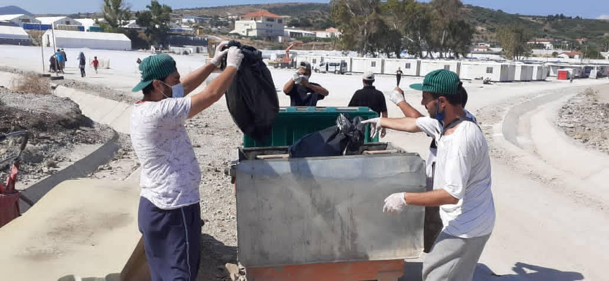
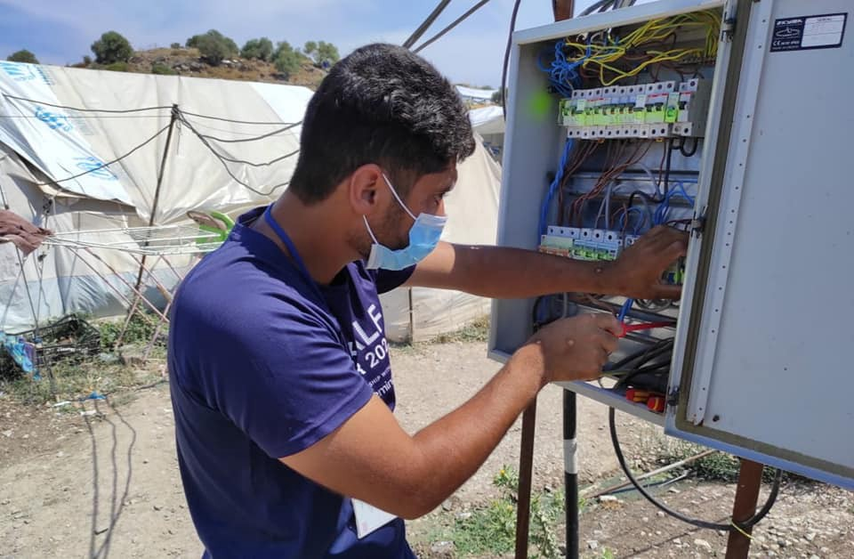

### AYS Daily Digest 07/07/21 — Rescues and arrivals at Sea: The context behind the numbers
#### HRW: Frontex **f** ailed to safeguard people against serious human rights violations / Protesting Lufthansa / Volunteers in France wanted / Updates from the ground / Critiques keep on coming over UK’s proposed law

](assets/c6495c53a576/1*-kZuFyJ0zIOfJ1RnDFij9A.jpeg)

Photo: [SOS MEDITERRANEE](https://www.facebook.com/SOSMEDITERRANEE/?__cft__[0]=AZUZP1eccnTGFoXYYaP7UV3rCUcC9RslCiKlkg6SuBbBke9KxYLZGLw_G-P-g3SaQPSx7Kd-ALmHghYCQMc3qH4rnLV-GU46d98Q8dwY1o-vQeJSvJTP5ouElFAA-iCwq27I4tayoPMO3Mma-bUd6r8x&__tn__=-UC*F)
#### FEATURE
#### Rescues and arrivals at sea—The stories behind the numbers

A boat in distress here\. Another group pushed back here\. Hundreds more arrivals in Lampedusa, the Canary Islands, Greece \(those that were not pushed back\) \.

These phrases could be taken from any headline and almost any digest written by AYS\. It is easy to get lost in the individual stories, but every arrival and every shipwreck is part of a larger story, the story of a European border policy that allows people to wreck themselves on its walls\.

Here are a few incidents from the sea and bordering states that illustrate the scope of the situation Europe has created\.

On the Italian island of Lampedusa, [552 people](https://www.ansamed.info/ansamed/en/news/sections/generalnews/2021/07/07/migrants-552-land-on-lampedusa-overnight_e92c5a4f-a754-48fc-bbad-51f8ea77a8d2.html?fbclid=IwAR0QchHm2dfTkMJJeCeKu0wqh13pDWRLH5PHDle5fU-yU4hlWJRMoPyfJJQ) arrived Tuesday night into Wednesday\. Arrivals temporarily paused earlier this week due to strong winds\.

Every time there is a story about a larger group of arrivals, many media reach for the cliche of a “flood” of new people\. However, Italy is nowhere near its period of most arrivals, which occurred during the last decade\. The reception system is also at [60% less capacity](http://www.vita.it/it/article/2021/07/07/le-migrazioni-nel-2021-il-fact-cheking-di-ispi/159924/?platform=hootsuite&fbclid=IwAR1uqz6gS6ETpJdstNlbUSag8EwzDkXZaUZKXMK0lkkpzBDhVcFAAszsZAM) than it was at its peak\. That does not mean that the situation is all fine and dandy, as many people are still trapped in CAS which are supposed to be temporary measures\. If the reception system is under pressure, that is because of a lack of political will to create sustainable solutions that also respect the rights of people on the move, not because Europe has no space\.

The 500\-odd people that made it to Lampedusa are among the lucky ones, as many more are pushed back at sea or captured by the European\-aided Libyan Coast Guard\. [This story](https://timesofmalta.com/articles/view/libya-the-eus-gordian-knot.884698?fbclid=IwAR0Bob_YjTQIPe0SwQTJYsyj44wPYHabUi7C3mh2_LGGX1gcF51Kut_xDCE) examining Malta’s complicity in the Libyan situation, including the government’s refusal to punish the Libyan Coast Guard for human rights abuses that occurred within its own SAR zone, explains the situation\.

Others die\. In Tunisia, [49 corpses](https://www.plenglish.com/index.php?o=rn&id=69178&SEO=tunisia-rescues-49-corpses-of-undocumented-migrants-in-eight-days&fbclid=IwAR0jpn4syVM1l5W1vsTQHvZbXROpq-wHuswE9KE4Q2RzLkUrN04J0Nm35BY) of people who drowned at sea were rescued over the past week\.

Meanwhile, [572 people](https://www.facebook.com/NewsfromtheMed/posts/1250647718722155) are still stranded on board the Ocean Viking, which is waiting for instructions on where its ship can safely dock\. They only have enough food rations to last [until Friday](https://euobserver.com/migration/152372?fbclid=IwAR2TYZM5pxYCdmMexqO3IjEVGYM7kHFM4N1MsyfDrDO80fRvKz9i65BaFuA) \. European policy not only leaves people to die but stops them from docking once others rescue them\. Some of the people are from a [complicated rescue operation](https://twitter.com/SOSMedIntl/status/1412701821886517257?fbclid=IwAR1DMa8OF6BGI1QEjhdaJqN-IbeXi4746JZqO-aldL6QGaFHMU_kPGrL99c) Sunday night, when the crew from SOS Mediterranee [rescued 369 people](https://sosmediterranee.com/log/when-we-got-closer-and-used-our-torch-towards-them-from-a-little-light-it-suddenly-became-a-nightmare/?fbclid=IwAR0xKr-DW6JfDewBYy37GNO8kuXq_CrVzsFtySljT67K86a0nZsqNa2P-Os) from the Libyan SAR zone\.

> After two hours, it felt like the wooden boat was still as overcrowded as people kept coming up on deck from the bilge\. Each time we would come back to the wooden boat, everyone was shouting so that we would take the babies and children, but we could not reach them at the beginning\. 

As Jakob, a sea rescuer that served aboard the [Sea\-Watch 3](https://www.facebook.com/seawatchprojekt/posts/2861248267426569) says, “The fact that people move and die is not an accident — it’s the consequence of Europe’s past and present politics\. Therefore, Search and Rescue is not only about saving peoples’ lives, but also about challenging an ongoing imperialism\.”

Every arrival number, every pushback number, is part of wider European policy\.
#### AFGHANISTAN
### Taliban Attacks Provincial Capital As Deportations Continue

For the first time since the beginning of the withdrawal of US troops, the Taliban attacked [a provincial capital](https://www.tagesschau.de/ausland/asien/taliban-greifen-provinzhauptstadt-an-101.html?fbclid=IwAR0uElcPbBKYfPIt4xG4rTJEOAvDbCZanyOnkoZiOVbUyuZHpE2-JClkbko) \. The group captured several police stations and intelligence bases in the northwestern city of Kala\-i\-Naw\. This is the latest escalation in fierce fighting that has been going on since May, when the withdrawals first started\.

Even amid the deteriorating security situation, European states have continued deportations to Afghanistan, a country that they claim is safe for returnees\. [27 people](https://twitter.com/AmasoOrg/status/1412693583614943233?fbclid=IwAR3f6s0vfw2ZB8-j8h8Yjj4NcClfiRWa_g03SGNd3uUtU9SNfO19XpnRGBk) arrived there this morning after a deportation from Germany\.

The ongoing dangerous situation for civilians will probably lead to more people trying to reach Europe\. Already people are [lining up](https://moderndiplomacy.eu/2021/07/07/is-europe-ready-to-handle-afghan-refugees/?fbclid=IwAR1vviGIdcrQX0LZwDS3NS1CvNqw8YzrPaZlm4bnrHyaJJeLOi5ln-xuxwU) at the remaining embassies in Kabul\. If Europe is not showing the political will to protect the people already in its borders, what will it do to those still desperate to reach safety?
#### CYPRUS
### Increased UK military presence on Cyprus

Existing British military bases on the island country of Cyprus are looking to expand their presence by adding [24 customs officers](https://www.infomigrants.net/en/post/33442/uk-military-base-to-stop-smugglers-as-more-migrants-reach-eu-via-northern-cyprus?fbclid=IwAR3KgvWa6JVPKkxg-jAxYJ9YtFi5lX05OD02jHip6b9WauPuzriY9bxZSpw) and four new SUVs complete with thermal imaging\. They are increasing their presence to contribute to pushbacks of people on the move\. Cyprus is becoming an increasingly popular route due to its proximity to Turkey\. Many cross over by boat or cross the Green Line into the South\.
#### GREECE
### Haunting and heartbreaking story on the fate of those unidentified

■■■■■■■■■■■■■■ 
> **[Solomon](https://twitter.com/we_are_solomon) @ Twitter Says:** 

> > As of June 2021, 25 unidentified bodies were in the container, most of them young men of Pakistani origin.

📸 @[IPapangeli](https://twitter.com/IPapangeli) https://t.co/k3BwdEFCiu 

> **Tweeted at [2021-07-07 09:54:04](https://twitter.com/we_are_solomon/status/1412711505498361858).** 

■■■■■■■■■■■■■■ 

As of June 2021, 25 unidentified bodies were in the container, most of them young men of Pakistani origin, [Solomon](https://twitter.com/we_are_solomon) reports\. Most people die of drowning, while others die from hypothermia during the winter, or from pathological causes\.

> A smaller proportion dies trying to cross railway lines\. Until 2008, when Greece signed the Ottawa Treaty on anti\-personnel mines, the second cause of death was from anti\-personnel mines near the river\. 

### New immigration law draws critique

The Migration Ministry’s new law on the “reformation of deportation and return procedures” has drawn ire for its r [estriction of the right to asylum](https://g2red.org/the-comments-of-generation-2-0-red-in-the-public-consultation-on-the-draft-law-of-the-ministry-of-migration-and-asylum/?fbclid=IwAR0RCfhzbF5EhiC_qCLTNJzGrtVDGFZnDF8dqTRaAfijtSzcotiGtaQpT5E) \. For example, the law now entitles the authorities to deliver notices by e\-mail without actually checking if people are able to receive them or not\. It also limits the time people have to appeal a decision to one month and has a high fee of 50 euros\.

Another concerning aspect of the new law is that it wants to eliminate the category of granting a residence permit for humanitarian reasons\. This will deny legal status to [thousands of people](https://twitter.com/maledictus/status/1412700830051020800?fbclid=IwAR2F6pty88xxJL1c49Fq6kzAmP0fDuLTuuWi8eD8j03hBjjNlxSiWEAWclY) who may not be able to seek asylum under internationally established reasons but have valid reasons to fear persecution in their home country\.
### Updates from the Aegean Islands

As temperatures rise in Greece, the [Moria White Helmets](https://www.facebook.com/MoriaWhiteHelmets/posts/356269429349456) are continuing to support people in the camp and clean up the situation\.

](assets/c6495c53a576/1*wUHDphRbQ2w08a7SwudeNQ.jpeg)

Photos: [Moria White Helmets](https://www.facebook.com/MoriaWhiteHelmets/?__tn__=-UC*F)

About [35 people](https://twitter.com/PDimitras/status/1412742645424832515?fbclid=IwAR2BS6fkHFKB9xxpzdl7QNvmHufYLtI1WZC4o9FxSTbUnvkc8O4qMEYywJc) landed on Samos\. Initially they fled to the woods and contacted [Aegean Boat Repor](https://www.facebook.com/285298881993223/posts/1117472125442557/?sfnsn=mo) t for help\. Since then, ABR lost contact with the people although most were taken to the quarantine camp\.
### Updates from Evros

In Alexandropoulis, there is a container for the [unidentified bodies](https://twitter.com/we_are_solomon/status/1412711285461078016?fbclid=IwAR0cWArHz6hccpg6focvBc8PI7O04t55RCwlrU5Qj9I5JDzJUenalb5TuvA) of people who die trying to cross the land border at Evros\. Most wind up buried in the village of Sidiro\.
#### SERBIA
### Daily pushbacks by Croatian police continue

Hamid, a [16\-year\-old](https://twitter.com/APC_CZA/status/1412682014675849216?fbclid=IwAR3XLUWruNpv3ZBIu2jhuA8r2Vp8ttFY8EbQH0sFHbDFek2dD7_5zdkD_QU) from Afghanistan, testified that Croatian police beat him on the head with a stick, then beat his father as well before pushing them back into Serbia near Šid\. Indiscriminate beatings, robbery, and even pepper spray are daily practices by the Croatian police\.
#### FRANCE
### Call for volunteers\!

If you’re reading and following what’s going on in the **north of France** and if you’d like to join the groups helping people on the move find out about the rights and options they have while providing the immediate assistance to those lodged around the **Grande Synthe area** , the [Utopia 56 Grande\-Synthe](https://www.facebook.com/utopia56grandesynthe/?__cft__[0]=AZXO60DAC9wPGqoRpPuJeQReefA6mSuqyXp8D2eNcjy2eBthdXi0J9HteY4H8r4rf90HmenfIgQIUuv2ZKWrFXkCosIH7AbWonxghUSGqIgIkWo7vrpJaym3vl9fNBLmVfkD-yce3W-HOfky0SganrSu&__tn__=-UC%2CP-R) team invites you to join them in the field\!
As long as you are over 18 years old, available for at least three weeks, with some knowledge of English, they would be happy to have you on board\!
For all info, contact: utopia56gs\.benevolat@gmail\.com

At the same time, [Solidarité migrants Wilson](https://www.facebook.com/Solidarit%C3%A9-migrants-Wilson-598228360377940/?__cft__[0]=AZUQaehN1F8LPzfz3SuJmp7pqJvNjLA2ED3UiNml-Rm1w7W9RPmTG7Z2F59wdxB7bu-s-U5nYO3JINY4lXxVnwsDz9Y0cAqs9f9jLJbMrsyL2c2h-tB4-3u2LAzYljbDqFO1S5LIyod9R3TptvdSEAX_&__tn__=-UC%2CP-R) distributing meals from friendly restaurants are looking for drivers to fetch the food from a few particular places in the city\. If you are **in Paris** , have a car and are willing to help, don’t wait for the food to get \(c\)old\! Reach out to the team for more info\.
#### GERMANY
### Call for protest against Lufthansa’s profitable participation in deportations

Through an [upcoming demonstration](https://www.bpb.de/gesellschaft/migration/flucht/zahlen-zu-asyl/265765/abschiebungen governmental source of deportations since 2014 in German) , the autonomous No Border Assembly group in Berlin is raising awareness of one of many profiteers of the harsh deportation policy, which included thousands of citizens of countries as Syria, Afghanistan and Pakistan\.

In 2019 alone, Lufthansa and its subsidiaries verifiably carried out the deportation of 5,885 people\. That was more than 25% of all deportations from Germany this year\.

Since then, Germany has been covering up airlines and other involved actors being used to realize deportations, while there has been no statement from Lufthansa\.
#### UK
### More reactions to Tuesdays’ proposed asylum policy shift

The now already infamous „Nationality and Borders Bill“ that Priti Patel introduced to the House of Commons just two days ago, as reported in our last News Digests, still sparks concern and reactions are still arriving from many sides\. Until the government publishes its response to the proposals, this will remain a hot topic even at a European level: As Denmark plans to, the UK would move to an offshore asylum processing, leaving people outsourced in countries outside Europe, in exchange for developmental support\. Rwanda just started to join the discussion about reception centers\. The law would include people who are already in their application process in the UK\.

> “What you could end up with is the majority of people fleeing persecution, being detained or housed in developing countries that don’t have the infrastructure\. That really undermines our global refugee protection system and the principle of responsibility sharing\.” — _Hewett, Refugee Council_ 

Rights advocates [state](https://www-nytimes-com.cdn.ampproject.org/c/s/www.nytimes.com/2021/07/06/world/europe/uk- migration-priti-patel.amp.html? fbclid=IwAR0iZ39ChFA1psJrZRyHcf7RkiAxANw1Ga_psgnvEJ16OmrYWF2WLzuZQ5I) that the proposals are, additionally to unconscionable, basically contradicting international law: According to the UN Refugee Convention of 1951, any policy involving the expulsion of asylum seekers would be illegal\. The Bill would be yet another act of the current Conservative Party to attract voters and „institutionalizing inhumanity“, especially regarding the fact that UK’s [migration levels have been falling again](https://refugeecouncil.org.uk/latest/news/thousands-seeking-asylum-face-cruel-wait-of-years-for- asylum-decision-fresh-research-shows/) since 2016 and backlog / failing organisation to examine asylum processes in shorter than a year in the UK up to now\.

**The bill also includes proposals to punish illegal entry into the UK with imprisonment of up to four years instead of six months\.** This would facilitate arrests and “to remove someone to a safe country while their asylum claim is processed”, as Patel says\.

Another cause for concern is that the planned **law changes will make it harder for UASC to appeal** decisions and **to be identified as a victim of human trafficking** \. Age assessments will become tougher, under the legislation which will make it harder for children to prove their age\.

> “There is nothing in this legislation that increases protection, despite ministers pledging to create new routes to safety” — Hilton, “Refugee Action” 

> [**The _Refugee Council_ is calling on UK residents to contact their MPs**](https://act.refugeecouncil.org.uk/campaign/urgent-ask-your-mp-speak-out-refugees) and demand they stand against what they describe as an “anti\-refugee” Bill, and a new coalition, [**_Together With Refugees_**](https://togetherwithrefugees.org.uk/) , has been set up to oppose the plans\. 

#### FRONTEX
### HRW’s clear demands regarding the Agency’s implications in human rights violations

As Frontex releases their a [nnual risk analysis for 2020](https://bit.ly/3dKoWbH) , and as they expand their border work to the “pre\-frontier area” funded, bizarrely enough, through pre\-accession aid, without much problem, their work does not go unnoticed by everyone, and questions are raised, critique is clear and demands are out\.

■■■■■■■■■■■■■■ 
> **[Matthias Monroy (@Mastodon)](https://twitter.com/matthimon) @ Twitter Says:** 

> > Das Stichwort heißt hier "Grenzvorfeld" ("pre-frontier area"). Gemeint ist der Vorhof der #FestungEuropa, der jetzt an das Überwachungssystem #EUROSUR angeschlossen wird. Nach dem #Westbalkan könnte #Nordafrika folgen. Perfide, dass Finanzierung über "Heranführungshilfe" erfolgt. 

> **Tweeted at [2021-07-07 11:08:51](https://twitter.com/matthimon/status/1412730324585418752).** 

■■■■■■■■■■■■■■ 

Citing Border Violence Monitoring Network’s work, the Human Rights Watch reminds us that the EU border guard agency’s oversight mechanisms have **failed to safeguard people against serious human rights violations** at the EU’s external borders\.

Although under Article 46 of the Frontex Regulation, the agency also has a duty to suspend or terminate operations in case of serious abuses, but has only done so once, in Hungary, after a European court ruling\.

Running the role play of Hungary as the only “bad guy” in the Union, many human rights abuses and misuse of funds by other Member States go practically unnoticed or continue with impunity\. One such example is Croatia\. In Croatia **,** Frontex maintains its presence despite credible and consistent reports by Human Rights Watch and others of pushbacks, often violent, of migrants and asylum seekers into Bosnia and Herzegovina and Serbia since 2016, HRW says\.

**Find their clear recommendations directed at Frontex and its Management Board, The European Commission, the European Parliament, and the Council of the EU, as well as the EU member states participating in Frontex activities:**

#### GENERAL

Online event — Wednesday, 8 September 2021–5:00am to 8:30am

The Evolution of the Principle of Non\-Refoulement in International Law: What Role for New Types of International Law\-Making?

[](https://l.facebook.com/l.php?u=https%3A%2F%2Fwww.asil.org%2Fevent%2Fevolution-principle-non-refoulement-international-law-what-role-new-types-international-law%3Ffbclid%3DIwAR0WMNn2di6qrre6IaJCEs1W6ucoDoyPl5Rp8C8l_E1rHX_S3QtVWdY9EsE&h=AT35ue4IiJru-1ZLFyQuqWrI5cYaiKE9w0bjbW07_Kv8k7jYPW_kPcVUrpPKIN59tb0N6PNQ5io92OyQ8MR1jmDZSAwTnn9uvIlme29T-Ux6mqBppKF8ASbAJJ-yHJVXMD_qmbTYa96F6g&__tn__=R]-R&c[0]=AT20uPXZtxWiSLkL-4UqwA75J6chSjBIwz5x9EXc7QT_iDLV5CD5SLthCkbb_wL3JSkOw_td-UnMvUFWm0maSfX-43QZuJ9pXXUvaq0WPz-UXl1cifKVOy5jZD9IGQzPvpB47Ojfv0sutWnlYD-dNujiqN6AwXL2J6uGhVKcuAVXi5PqFUdlfvHlV6uZ-0ozIyKMx0nLBKGlliGniQ)

#### Find daily updates and special reports on our [Medium page](https://medium.com/are-you-syrious) \.

**If you wish to contribute, either by writing a report or a story, or by joining the info gathering team, please let us know\.**

**We strive to echo correct news from the ground through collaboration and fairness\. Every effort has been made to credit organisations and individuals with regard to the supply of information, video, and photo material \(in cases where the source wanted to be accredited\) \. Please notify us regarding corrections\.**

**If there’s anything you want to share or comment, contact us through Facebook, Twitter or write to: areyousyrious@gmail\.com**

_Converted [Medium Post](https://medium.com/are-you-syrious/ays-daily-digest-07-07-21-rescues-and-arrivals-at-sea-the-context-behind-the-numbers-c6495c53a576) by [ZMediumToMarkdown](https://github.com/ZhgChgLi/ZMediumToMarkdown)._
