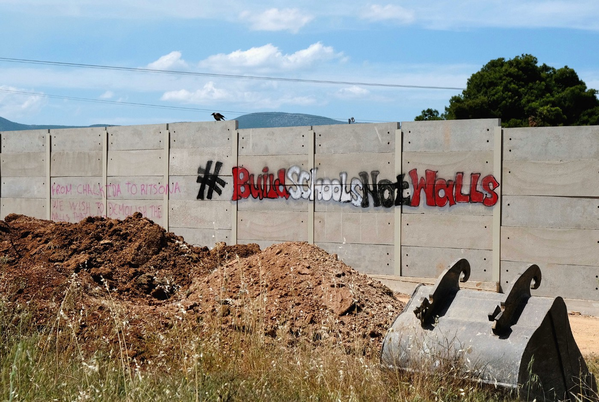

### AYS Daily Digest 9/7/21 Denmark: EU Court Rules Against 3 Years of Waiting for Family Reunification

[Are You Syrious?](?source=post_page-----9fd9095c3e43--------------------------------)

[Jul 10](ays-daily-digest-9-7-21-denmark-eu-court-rules-against-3-years-waiting-for-family-reunification-9fd9095c3e43?source=post_page-----9fd9095c3e43--------------------------------) · 7 min read

Deportations and alerts in Germany and Denmark\. Recordings of LCG activities hidden by EUNAVFOR MED? Fire in Samos\.

\(“These walls are deeply distressing to asylum seekers, who are grappling with growing challenges\. In addition to the psychological ramifications, walls are also a barrier to integration, severing connections between camps and the outside world\. Such policies represent a threat to the well\-being, safety, and human rights of refugees and asylum seekers across Greece\.” Read more and Photo Credit: [Lighthouse Relief](https://www.facebook.com/lighthouserelief/photos/a.773703872752156/4082468421875668/) \)
### FEATURED — EU Court rules against Denmark’s three years waiting time for family reunification

The European Court of Human Rights [ruled](https://www.echr.coe.int/pages/home.aspx?p=home) on Friday that Denmark violates human rights when refugees who come to the country and receive temporary protection status have to wait three years for the right to family reunification\.

The case [started](https://nyheder.tv2.dk/politik/2021-07-09-danmark-taber-sag-om-familiesammenfoering-til-syrisk-flygtning) in 2015, when a Syrian man who was granted temporary protection \(since then renewed every year\), applied for family reunification, but was rejected due to a newly\-passed law that set a waiting time of three years for requesting family reunification\. When the law was passed, Danish politicians, such as the then immigration minister Stojberg, were well aware that it was likely to be overruled by EU courts, but also that it would take years to reach any verdict\. Nonetheless, they described the law as a victory for the country\.

The Syrian man’s lawyer has now argued that the EU ruling is a clear sign that the law should to be changed\.

LIBYA/ITALY/EU
### Recordings of LCG activities at sea hidden by EUNAVFOR MED?

Italian media [reveal](https://www.avvenire.it/attualita/pagine/i-video-degli-abusi-dei-guardacoste-chiusi-sotto-chiave-dall-ue) that, following the agreement between Italy and Libya in 2017 and the funding and support for the activities of the so\-called Libyan coast guard, which was pivotal to the declaration of the Libyan Rescue Zone, EUNAVFOR MED gave Libyan authorities sets of cameras to record their activities at sea\. This was part of a sharing of information system between the EU and the north African country\. As of now, no footage has been published or viewed from such cameras\. Footages are reportedly owned by EUNAVFOR MED\.

SEA
### Pushback report

[Mare Liberum have published a report](https://mare-liberum.org/en/pushback-quarterly-april-juni-2021/?fbclid=IwAR2zojEz2F_B-hX8-6dCU370Wn41unAs9av7qEM0RCML803oznfQ3eyekUY) covering pushbacks from April to June 2021\.

> _Mare Liberum counted 119 pushbacks in the Aegean Sea, in which at least 3289 people were illegally prevented from reaching the EU\. At the same time, it is clear that the practice of systematic pushbacks continues to ensure that very few people reach the Greek islands\._ 

According to UNHCR, only 400 people have arrived on the Aegean islands during this time period\.
### Boat in distress off Rhodes

GREECE
### Fire in Samos hotspot

On Friday [yet another fire](https://www.keeptalkinggreece.com/2021/07/09/samos-fire-camp-detentions-migrants) raged in Samos hotspot destroying a 30 metre square area\. No one is reported as being hurt\. Two people have been taken into custody\.
### Another pushback?

[According to local media](https://astraparis.gr/nea-afixi-prosfygon-sta-nenita-10-entopisthikan-oloi-exafanisthikan/?fbclid=IwAR3rtXOLI9lmWhYuvypcD86vsqBR79KzfVl1D7BsD0_shMHMAaLetor4tpQ) , 20 people landed on Chios on 8th July\. Ten were later picked up by the police\. Since then, none of them have been heard of and the authorities deny all knowledge of the arrival ever happening\.
### Ritsona visit

[Parwana Amiri reported](https://twitter.com/parwana_amiri/status/1413552176455114757) on the official visit to Ritsona which took place on Friday\.

> _MEPs visited the camp, with this visit and the direct conversation with inhabitants, three issues were highlighted, Problems with 1\)School and Education 2\)Transportation and Integration system 3\)Turkey as “safe” country and i\-legal deportations\._ 

GERMANY
### The brutal face of deportation

A young man was [detained](https://www.infomigrants.net/en/post/33496/young-afghan-man-deported-as-he-prepares-to-marry-german-fiance) on Friday 2nd July while at the Kelheim district office in Bavaria to pick up documents for his wedding\. By Tuesday 6th, he had already been deported to Afghanistan\. Said was about to get married, has finished his studies, speaks fluent German and has a contract for a job in a nursing home starting in September 2021\. He was detained and deported due to two \(paid\) traffic fines and an inhumane immigration policy\.
### National demonstrations in August

“On the occasion of the federal elections in September 2021, we call for people to take to the streets on 08/07/21 for sea rescue\. The dying continues as European states prevent civilian sea rescue organisations from rescuing people in distress at sea\.”

BELGIUM
### Hunger strike carries on

It has now been more than 40 days since dozens of people on the move in Belgium [started](https://twitter.com/CaroRackete/status/1413521050437050373) a hunger strike to demand that their rights be respected\. Authorities have so far refused to meet any of the demands of the hunger strikers, although local activists and medics have reported that people are starting to suffer from cardiac arrest and neurological damage

DENMARK
### More deportations to Afghanistan planned for Monday

A detainee in the exit centre at Ellebæk has warned AYS that a forced deportation to Afghanistan is planned for Monday\. This is happening despite the extremely dangerous situation in the country and only one week after the Afghan government called for a halt to deportations due to the widespread violence and the strengthened Taliban activity in the country\.

EU
### Accompanied, unaccompanied and separated children

[Relief Web have published an overview](https://reliefweb.int/report/world/refugee-and-migrant-children-europe-accompanied-unaccompanied-and-separated-overview-5?fbclid=IwAR1GCdREVMxi5-bS-oH3tzTqAP3-fSSgObkRnf63hOVF5B9sgoUW-oryvkw) of trends for young people on the move from January to December 2020\.

> _In 2020, **16,750** children arrived in Greece, Italy, Spain, Bulgaria, Cyprus and Malta\. Of these, **10,343** \(62%\) were unaccompanied or separated children \(UASC\) \. Child arrivals decreased by **50%** in 2020 compared to 2019 \( **33,200** \) \._ 

### Frontex mandate expanded again

Frontex is now giving out information and advice to other actors on arms trafficking, tactics and equipment to be used during border checks\.

> _Frontex, the European Border and Coast Guard Agency, decided to help national border guard and customs authorities to fight arms\-related crime and created the Handbook on Firearms for Border Guards and Customs Officers in cooperation with the border guard and customs community, as well as EU and international partners\._ 

UK
### People steering small boats to the UK not to be prosecuted, CPS says, while new Bill aims at expanding criminalisation

The Crown Prosecution Service \(CPS\) is a British agency that oversees criminal prosecutions in the country\. Following a successful appeal won in June by a man who had been sentenced to 11 months of imprisonment for having steered a small boat to the UK, the CPS [released](https://www.independent.co.uk/news/uk/home-news/migrants-english-channel-crossing-asylum-b1880421.html) new guidance which states that people who steer dinghies across the [English Channel](https://www.independent.co.uk/topic/english-channel) with the sole intention of claiming asylum in port will no longer be prosecuted\.

This is at odds with the multiple claims by Home Secretary Priti Patel, who vowed to further criminalise everyone who arrived illegally in the UK\. The Home Office has indeed responded to the CPS guidance, saying that people could be prosecuted under a different law which has not yet been used in such cases — the offence of helping an asylum seeker to enter the UK\.

Also, the newly presented Nationalities and Borders Bill, if approved, will introduce new ways to criminalise people seeking refuge\. The bill has been severely [criticised](https://www.thelondoneconomic.com/politics/un-refugee-agency-hits-out-at-neo-colonial-uk-asylum-reforms-280509/) by UNHCR, which has described it as “almost neo\-colonial” and is urging the UK to:

> _\- Drop plans to create this lower class of refugee_ 
 

> _\- Work with \[UNHCR\] on reforms to build a fair, humane and efficient asylum system_ 
 

> _\- Continue action against criminals and smuggling gangs_ 
 

> _\- Redouble efforts to cooperate with Europe on asylum\.”_ 

Read two interesting analyses of the bills:
- [Border Criminologies](https://www.law.ox.ac.uk/research-subject-groups/centre-criminology/centreborder-criminologies/blog/2021/07/nationality-and) unpack the bill, dividing the empty and unfeasible threats from the actually dangerous elements of the bill
- [Refugee Law Initiative](https://rli.blogs.sas.ac.uk/2021/07/09/enforcement-and-returns-the-forlorn-hope-of-home-secretaries-down-the-years-revived-in-the-new-plan-for-immigration/) set the bill within a long history of criminalisation and enforcement of repressive immigration laws\.

NORWAY
### Exhibition from Kara Tepe camp, Lesvos in Oslo

This summer, at Ekeberg Park, in Oslo, several artworks by artists living in Kara Tepe refugee camp \(Moria 2\.0\) in Lesvos, Greece, together with works by Norwegian artists, are [being exhibited](https://www.facebook.com/permalink.php?story_fbid=10157640129327563&id=548632562) thanks to the The Hope Project\.

WORTH READING
- The CGT union of the Spanish rescue agency published a long [**report on the years 2019–2020,**](http://salvamentomaritimo.org/wp-content/uploads/2021/07/Dossier_Prensa-2019-2020.pdf) in which they detail the government’s policy to decrease the funding and to downsize the personnel of the rescue agency, leaving the agency unable to respond to emergencies at sea\. This is not an incident, but a clear way to divert budget from search and rescue\. The report also highlights the externalisation of SAR activities to Moroccan navy, despite its history of violence and abuse towards people on the move\.
- [**Kurdish writer Meral Şimşek tortured with strip search by police in Greece**](https://m.bianet.org/english/migration/246938-kurdish-writer-meral-simsek-tortured-with-strip-search-by-police-in-greece?fbclid=IwAR3EDlefluzhYXj9YmPZ0vLpdQkxjLe5UbQJ-5sOIYRHJyMsS15Z6PdEQiI) **—** _According to Şimşek, she was battered for hours even though she said that she is facing charges in Turkey for “terror propaganda” and “organization membership” and that she is a member of the PEN\._
- [**Strengthening human rights protection at borders**](https://fra.europa.eu/en/news/2021/strengthening-human-rights-protection-borders?fbclid=IwAR3_hHUS3V7vnBn14XP986gqsppFIB3bD7uUgMU_PiwKYd-aVEYYZ6iIbLc) **By FRA —** _The [note](https://fra.europa.eu/en/publication/2021/legal-remedies-borders) focuses on effective remedies for human rights violations at the European borders\. It also provides detailed information on complaints mechanisms and the duty to carry out investigations into alleged violations at borders\._
- [**Resettlement Needs, Complementary Pathways, and Key Priorities For 2022 — Summary of UNHCR Recommendations to the European Union \(July 2021\)**](https://reliefweb.int/report/world/resettlement-needs-complementary-pathways-and-key-priorities-2022-summary-unhcr?fbclid=IwAR0NuKkjsZepmlpgyx9icBNoYb9llyLf_E2xS8bInQh6wYqmELZqB4ZAn7s)
- [**ELENA weekly legal update is out\!**](https://mailchi.mp/ecre/elena-weekly-legal-update-09-july-2021?e=1fd2db1ebf)

WORTH ATTENDING
- [**Criminalisation in the Humanitarian Sector**](https://www.facebook.com/insightcollaborative/posts/4121798174555579) **—** _Do join us next week on Wednesday 14th July at 4pm UTC for a discussion of criminalization in the humanitarian sector\. We have a fantastic panel with a great deal of experience\._
- [**Refugees excluded in Greece: Designation of Turkey as a “safe third country”**](https://www.facebook.com/events/323911112558834/) **— Online conference hosted by RSA on July 14th 12 PM UTC\+03\.** _The implementation of this decision leaves no room for misinterpretation\. It has already resulted in asylum seekers being denied protection within barely a few days of their arrival, following asylum interviews of just a few minutes, without any assessment of their vulnerabilities and with no access to information and legal representation\._

**Find daily updates and special reports on our [Medium page](https://medium.com/are-you-syrious) \.**

**If you wish to contribute, either by writing a report or a story, or by joining the info gathering team, please let us know\.**

**We strive to echo correct news from the ground through collaboration and fairness\. Every effort has been made to credit organisations and individuals with regard to the supply of information, video, and photo material \(in cases where the source wanted to be accredited\) \. Please notify us regarding corrections\.**

**If there’s anything you want to share or comment, contact us through Facebook, Twitter or write to: areyousyrious@gmail\.com**

_Converted [Medium Post](https://medium.com/are-you-syrious/ays-daily-digest-9-7-21-denmark-eu-court-rules-against-3-years-of-waiting-for-family-reunification-6754cd63e230) by [ZMediumToMarkdown](https://github.com/ZhgChgLi/ZMediumToMarkdown)._
