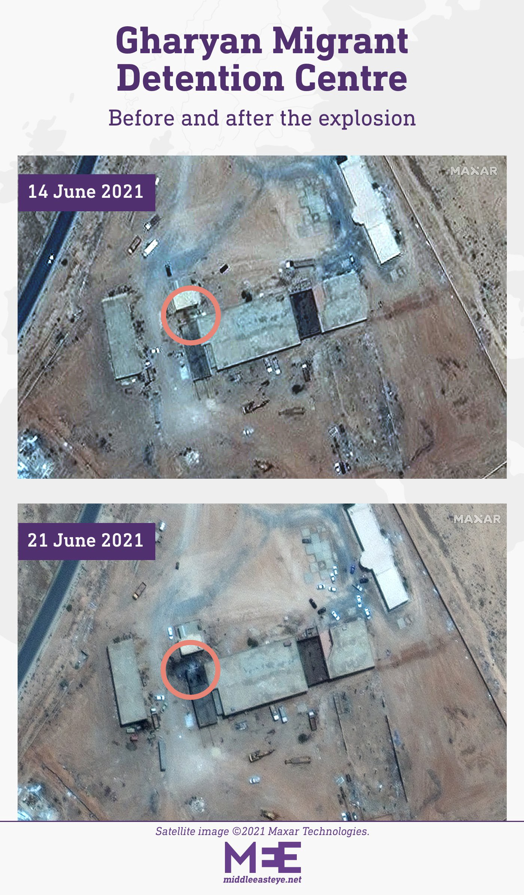
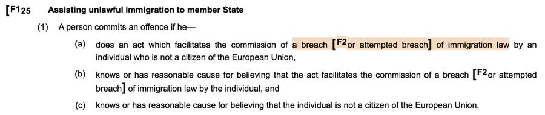

### AYS Weekend Digest 10–11/7/21: Afghanistan has requested Europe to stop deportation to Afghanistan
#### A man takes his life in the Greek Schisto camp / SAR at sea / Volunteers wanted in Paris / How the UK’s play on semantics affect victims becoming criminals — a commentary / What the EU plans to spend on enforcing borders through Frontex / recommended reads & more

Awarded illustration by Iranian artist Saman Torabi
#### FEATURED

Due to the current political situation and the ongoing [battle between the Taliban](https://l.facebook.com/l.php?u=https%3A%2F%2Fkabulnow.af%2F2021%2F06%2Ftaliban-launch-attacks-on-ghazni-city%2F%3Ffbclid%3DIwAR3_TC9MTJWkNe852F9at_S6vSzFMLqxvF1Mt8aP7ERTCgNjFo0HHd8UoWE&h=AT18pDUR86kA76GnTomJLbq2uOrsg8YzwvodWcivxAWB9aX6DAwHhYzdz1MfG08vXjB60Rkt8GYiAwJCozn3VtPJq2STKMtjf8QZ2mlPUOgUL7AwwEDLwOdabHG2IG6Z9Q&__tn__=%2CmH-R&c[0]=AT1E8y-pJfBNIkSofhAr2L7ldf0ejarc6MXjgniUbac1RyJTnTA4rDGsi5GuZYENQyCnSEDPqOTrdg4k7q6L4y6W4OOy_AZsMceBdvCdPNAJt6x8KIxqePTY0YzDgP_sRNi5XC_MrykdAGDpXhHHo0gxdRDqyTtU1Q4sMyarrXBYhSw) and Afghan security forces all around Afghanistan, the Afghan Ministry of Refugees and Repatriation \(MORR\) appealed to European countries to stop deportations to the country\.

> In the letter, the MORR has requested MOFA to forward the letter to the European mission in Afghanistan and request all the European countries that deport Afghans to temporarily halt deportation to Afghanistan due to the growing violence and deteriorating security situation in the country\. 

Pre\-existing humanitarian needs are further exacerbated and people are in great need of help and support to overcome the many and different life threatening problems every day\.

The European countries particularly requested to halt deportation are: Germany, Norway, Holland, France, Finland, Denmark, Switzerland, Austria and the UK\.

> Afghans make up a sizeable share of EU asylum seekers, with 44,190 first\-time applications last year, out of a total of 416,600, according to Eurostat, the EU’s statistics agency\. 

We have been extensively reporting about the dangers of deportations to Afghanistan, currently left on their own to try and bring about any change in the ongoing fights and hostilities\. According to the UNHCR, Afghans are the second\-largest refugee population in the world\. In spite of the regions where people are deported being under the control of the Taliban and people having witnessed attacks from the Taliban, the decisions to deport people to that country have not been halted yet, while negative answers to people’s applications for international protection in some countries remain very high\.

■■■■■■■■■■■■■■ 
> **[Isabel Schayani](https://twitter.com/isabelschayani) @ Twitter Says:** 

> > Ankunft von #Ortskräften aus #Afghanistan in Düsseldorf vor 2 Tagen. Gedreht von meinem Kollegen @[besmaili](https://twitter.com/besmaili) 
Täglich kommen neue Menschen. Mal werden sie versorgt, mal schlafen sie am Flughafen, weil es nichts gibt. 
Seit Juni wurden 2400 Visa ausgestellt. https://t.co/g5KBTIaZQL 

> **Tweeted at [2021-07-11 06:41:08](https://twitter.com/isabelschayani/status/1414112503253151745).** 

■■■■■■■■■■■■■■ 

#### LIBYA
### The toll of deadly detainment practice

Survivors say a spark in the ammunition depot caused the blast at the centre in Gharyan and that there were several injuries, as well as possible death\.

> Satellite images of the site taken before and after the blast, along with witness statements, show the explosion that took place on 20 June in Abu Rashada, a detention centre in Gharyan, 100km southwest of the capital Tripoli, in the Nafusa mountain region, _the media [report](https://www.middleeasteye.net/news/libya-detention-centre-blast-exposes-dangerous-conditions-refugees?fbclid=IwAR0asPbBX0h00kozEnzWwa3KoeyD-smA0IfmmIE3Sb4acOUJVH_Tg7hwnbo) \._ 

They show a military compound with armoured vehicles in the vicinity\. According to the testimonies of those who survived, welding caused a spark to hit the ammunition depot, and then a fire to start\. As the grew, according to several people, the explosion took place\.

With militia reportedly involved in trafficking in the desert and running the detention centres, it is impossible to know how many people are there, how many were affected by the explosion and what happened to them\. 
These are the kind of places people end up in when you read they were “saved by the Libyan coast guard” trying to escape hell\.
#### SEARCH AND RESCUE AT SEA

Shortly before midnight this Sunday emergency services received a call from people requesting help from a boat\. Following the call, the fast boat ‘Salvamar’ from Salvamento Marítimo headed towards the area and shortly before 2am located the boat, and afterwards the 10 people were transferred to the Spanish port of Algeciras where they were reportedly disembarked\.
#### GREECE
### Suicide in the face of being sent back to “safe Turkey”

Hamid took his own life\. A 22\-year old man from Afghanistan committed suicide at Schistou Camp, in fear of deportation after getting three rejections, but it seems that it caused no media interest\.

Also, no change in the treatment of people, lack of respect even when faced with the decisions and opinion of the European Court of Human Rights:

■■■■■■■■■■■■■■ 
> **[Vassilis Tsarnas](https://twitter.com/VassilisTsarnas) @ Twitter Says:** 

> > #Greece reluctant to send individual written apologies to law enforcement officers violence victims who won #ECtHR cases. Greek Helsinki Monitor communication on execution of Makaratzis &amp; others v.🇬🇷&amp; Greek authorities' response.
#PoliceBrutality #Torture
[greekhelsinki.wordpress.com/2021/07/09/1-5…](https://greekhelsinki.wordpress.com/2021/07/09/1-521/) 

> **Tweeted at [2021-07-11 14:21:42](https://twitter.com/vassilistsarnas/status/1414228407244689416).** 

■■■■■■■■■■■■■■ 

On that note, the RSA is inviting everyone to their online press conference that takes place this Wednesday:

■■■■■■■■■■■■■■ 
> **[RSA](https://twitter.com/rspaegean) @ Twitter Says:** 

> > 📢Online Press Conference
Refugees excluded in 🇬🇷: Designation of Turkey as a “safe third country”. 
Wed 14 July 12:00 EEST TIME
Get a reminder on YouTube here: [youtu.be/pEenDUFJIEU](https://youtu.be/pEenDUFJIEU)
Facebook Event: [fb.me/e/1yTuN4tY0](https://fb.me/e/1yTuN4tY0)
With @[GCRefugees](https://twitter.com/GCRefugees) @[Hellenic_League](https://twitter.com/Hellenic_League) @[Refugeegr](https://twitter.com/Refugeegr) https://t.co/FLNolNFLTB 

> **Tweeted at [2021-07-11 15:05:00](https://twitter.com/rspaegean/status/1414239304407207943).** 

■■■■■■■■■■■■■■ 

#### FRANCE
### Volunteers wanted

](assets/7837c7b2cf0d/0*fgvCq0pWCcCfkZ4p)

[Solidarité migrants Wilson](https://web.facebook.com/Solidarit%C3%A9-migrants-Wilson-598228360377940/?__cft__[0]=AZVoUpZD2HnMWQbiv782IUxtXzCMxyzZSIVqJ9eI6BbdunXxQIvnC31G3LhT1yGm8ofhfnqXH0U6zXI5J75OnzVysZdQxf2Hb7RGEpAIO6qn1v19aBeBzuIKEvy4eoy3Q9vJzxvr_kOba1vRyGNdV_m9bPxLZe55TLWY_1suj3nmelgxGskUfGdsR21CIoAmVv2QwBCMNEdsqrOuyGw5p-IG&__tn__=-UC%2CP-y-R)

This week [Solidarité migrants Wilson](https://web.facebook.com/Solidarit%C3%A9-migrants-Wilson-598228360377940/?__cft__[0]=AZVoUpZD2HnMWQbiv782IUxtXzCMxyzZSIVqJ9eI6BbdunXxQIvnC31G3LhT1yGm8ofhfnqXH0U6zXI5J75OnzVysZdQxf2Hb7RGEpAIO6qn1v19aBeBzuIKEvy4eoy3Q9vJzxvr_kOba1vRyGNdV_m9bPxLZe55TLWY_1suj3nmelgxGskUfGdsR21CIoAmVv2QwBCMNEdsqrOuyGw5p-IG&__tn__=-UC%2CP-y-R) is looking for people to help with cooking, food distribution \(on bikes, motorcycles, in cars and other vehicles, but also on foot\), arranging and cleaning the kitchen and filling the stock\.

To help out, reach out to the group with your info \(name, phone number, day and time of the distribution/work you can take over and means of transport\) \. For the activities you will also need some documents, but nothing complicated :\)
#### UK
### A Commentary — why the government is OK with breaking international law and how they plan to get away with it

A number of extremely clever lawyers have been puzzling over why the new immigration bill seems to criminalise organisations like the RNLI who might rescue asylum seekers at sea, when the Home Office claims it doesn’t want to do that\. There’s a simple but awful explanation, says Chai Patel, a human rights lawyer working in immigration law and policy, whose comment published as a thread on social media we bring in full:

> Since last year Priti Patel’s been crowing about ‘people smugglers’ she takes credit for jailing\. But many of them were actually refugees trying to cross the channel who at some point in the journey took control of the boat and were [filmed by drone](https://t.co/tqzCXIYdvc?amp=1) \. Those prosecutions aren’t brought by the Home Office though\. They are brought by the CPS\. There is a suspicion that Ministers or their aides put considerable pressure on the CPS or some part of the CPS to find a way to prosecute migrants crossing the channel last year\. The trouble for them was that UK law and international law protects asylum seekers from punishment if they cross a national border in order to claim asylum, for obvious reasons\. They can’t just prosecute people for entering without permission\. So they cast about for a solution\. They found s\. 25 of the Immigration Act 1971 which criminalises ‘facilitation’ of breaches of immigration law, and is designed to target people smugglers\. The trouble is that on a cursory look the wording is quite broad\. 

> So they decided that an asylum seeker who steers the boat on which other asylum seekers are trying to cross the channel ‘facilitates’ the others\. And they prosecuted them\. Often people would be in court just days after landing, being advised to plead guilty\. They would not have had time to speak to an immigration lawyer, or received advice on their asylum claim\. Many did so\. If you have the stomach to look at the Home Secretary’s twitter feed you can see her gloating about it\. Now there are a number of legal problems with this approach to prosecution — too many for this thread to address, but let’s take the big one\. for s\. 25 to apply there needs to be a breach or attempted breach of immigration law\. And it has been settled law in the UK for decades that **if someone gets to or tries to get to a port of entry in the UK, with the aim of claiming asylum, there is no such breach** \. Now boat crossings complicate this a bit, because it’s harder to work out where someone was going\. It’s not like getting on a plane, or a lorry, or trying to cross the channel tunnel\. You’re not guaranteed to land at Dover\. But any sensible prosecutorial authority would have looked at this, and looked at additional obligations under the refugee convention & seen a big red flag\. The CPS didn’t\. And because the nexus between immigration law and criminal is extremely difficult and complicated nor did many of those advising those being prosecuted\. So it seems **a number of people may have pleaded or been found guilty of an offence where a basic element of that offence** \(a breach of immigration law\) **was not in fact made out** \. Last year we raised a number of problems with the CPS about their approach and since then we have threatened legal action\. They reviewed their guidance, and have now recognised that this offence cannot be charged where those on the boat aimed to claim asylum\. This creates a big problem for the Home Secretary, who would likely have known about this impending change of approach for a while\. Even if the CPS didn’t tell her, any competent expert she consulted would have told her her approach was legally untenable\. Conveniently this says nothing about breaches of immigration law\. You just have to facilitate the arrival of an asylum seeker to the UK\. Steering a boat might well be enough\. But the problem here is that has to be ‘for gain’\. Because it’s designed to catch [PEOPLE SMUGGLERS](https://l.facebook.com/l.php?u=https%3A%2F%2Fwww.theguardian.com%2Fglobal-development%2F2021%2Fmay%2F10%2Fcalais-smuggler-gangs-channel-migrants-uk-security%3FCMP%3DShare_AndroidApp_Other%26fbclid%3DIwAR0AUMEcfeF9ahQY1CgRjlRLMU_pLKNuZAW2tyNLxsvJRHkyxJE6tzz8bDE&h=AT0B1cGuSy_reNOa2yYhy3FSiONCsDwu_FMeWh__un2xC5xDnEB570WeXzHdZhmmWLWeLOm6hzT7OHc8lrU5J0V64QAwmbhPPGqYfDxskqPGbbshn1fPIxznG4r9AK5oHw&__tn__=%2CmH-R&c[0]=AT1XgYg1mxV3pHMKN_X41vCULefVbOSJbD7oh65-NepRPwKuKYn4w-3Pq3pN-XvL3mcKmbnNMeZmH-JT2L4oxSYzLzGem5kOS8LpYKVB-3CQBKVPGsk7VU2Uq7W4k1StK-PY1WolfM4tY_A7TU-iAaMv8PDoxbbmPqwrfxKCXqGZaM21uY3s_op6ByJOfATWitDG6MfcW3fYBv4azKs) \. Now you might try to say that a refugee who got a reduced fee \(i\.e\. got shaken down for less money by violent thugs than the next person\) did it ‘for gain’ but that’s pretty shaky, and I would hope that many English juries would say **a big fuck you to anyone making that argument** \. So what’s a Home Secretary who’s staked her reputation on her ability to put refugees in jail to do? Well you could remove the words ‘for gain’ from that provision\. Then any refugee helping another refugee would be goner\. Doesn’t get rid of the **Refugee Convention’s prohibition on punishing refugees for their method of entry** \. But this government is ok with breaking international law in limited and specific ways\. 

> And that’s why we are all now scratching our heads and wondering why the fuck the Home Office is trying to sue the Lifeboat people\. 

[](https://l.facebook.com/l.php?u=https%3A%2F%2Fwww.theguardian.com%2Fuk-news%2F2021%2Fjul%2F11%2Fchannel-patrol-priti-patels-harsh-regime-is-answer-to-a-crisis-that-doesnt-exist%3Ffbclid%3DIwAR07ZnzAZdRfgr-0Qgo596pkaqyAViW-FIH-FW-t_lsWTzIQdCVk9sJIe9A&h=AT1piYRBxeqA5S4o7cc5Mi16zuu-MwPWEM8aZrAav7FTSl50VlTDgmuKnzscFp_-DSTLThDW6v_eHqOGFWn3f1Al_PjcaHQKlJfUBfVJjeDHEpzIkqu2EqSH6ZhOxmdWM85A9PGiOMBcKg&__tn__=R]-R&c[0]=AT1XgYg1mxV3pHMKN_X41vCULefVbOSJbD7oh65-NepRPwKuKYn4w-3Pq3pN-XvL3mcKmbnNMeZmH-JT2L4oxSYzLzGem5kOS8LpYKVB-3CQBKVPGsk7VU2Uq7W4k1StK-PY1WolfM4tY_A7TU-iAaMv8PDoxbbmPqwrfxKCXqGZaM21uY3s_op6ByJOfATWitDG6MfcW3fYBv4azKs)

In the meantime, people who are being held in detention suffer being locked up:

#### WORTH READING
- a personal story — “Eight years after fleeing from Hama to Lebanon, Youssef was desperate to leave by any route possible, even if that route took him back under the bombing he had fled\. His wife has a chronic heart condition that requires her to take medication they could no longer afford\. In 2016, the family was cut off from the monthly aid they used to receive from the United Nations, and now Youssef was out of work too\. Wanted by the authorities in Syria, returning home was not an option…”

- we have previously written about the exploitation of people in the Spanish region of La Huelva’s strawberry fields\. The media are now catching on to the story, stressing the horrors some of the women there go through… Are you aware of how migrant workers and people on the move are treated in the place where you live? Let us know\!

- another summary of the EU’s securitisation spasm realised through dodgy Frontex operations across the continent, and not at a small price, too:

**Find daily updates and special reports on our [Medium page](https://medium.com/are-you-syrious) \.**

**If you wish to contribute, either by writing a report or a story, or by joining the info gathering team, please let us know\.**

**We strive to echo correct news from the ground through collaboration and fairness\. Every effort has been made to credit organisations and individuals with regard to the supply of information, video, and photo material \(in cases where the source wanted to be accredited\) \. Please notify us regarding corrections\.**

**If there’s anything you want to share or comment, contact us through Facebook, Twitter or write to: areyousyrious@gmail\.com**

_Converted [Medium Post](https://medium.com/are-you-syrious/ays-weekend-digest-10-11-7-21-afghanistan-has-requested-europe-to-stop-deportation-to-afghanistan-7837c7b2cf0d) by [ZMediumToMarkdown](https://github.com/ZhgChgLi/ZMediumToMarkdown)._
