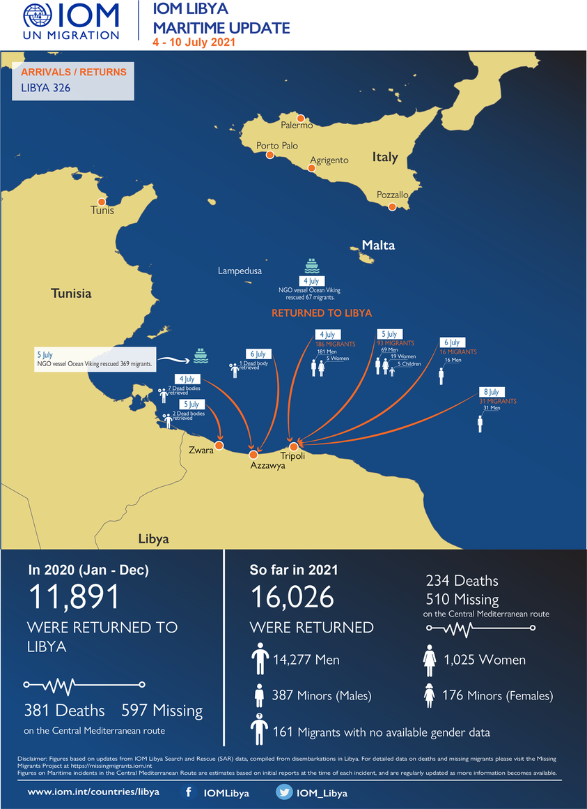
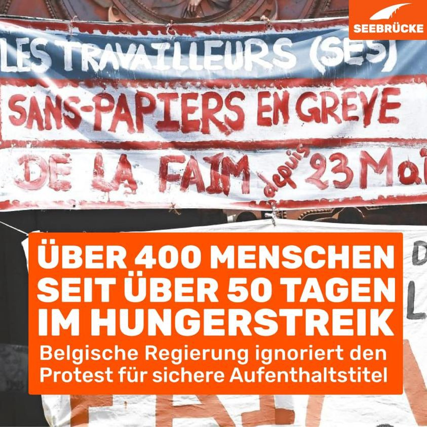

### AYS Daily Digest 12/7/21: People in Schistou Camp denied protesting after the recent suicide
#### Deadly weekend at the Mediterranean / Luxemburg to take in some people from the Ocean Viking / international protests & calls for action / Dublin returns to Serbia / recommended reads and more

](assets/f0d79e2727ae/0*uQES4BphOvP864_k)

By: [**Parwana Amiri**](https://twitter.com/parwana_amiri)
#### **FEATURED**

Regarding the suicide of the 22\-year\-old Hamid at Schistou Camp in Athens last weekend that we reported about in [yesterday’s Digest](ays-weekend-digest-10-11-7-21-afghanistan-has-requested-europe-to-stop-deportation-to-afghanistan-7837c7b2cf0d) , people at the camp [reportedly](https://twitter.com/parwana_amiri/status/1414541618582065154?s=19&fbclid=IwAR3L2CVUr4isIubLrhCS_z8lThenpZm0zYiZ-huGOSaamp2eZORN9nbE88s) tried to protest but were stopped by the authorities of the camp\.

Hamid committed suicide in fear of deportation back to Turkey after getting three rejections\. Parwana Amiri, a human rights activist and teacher currently in the camp [reported](https://twitter.com/parwana_amiri/status/1414649730773266450?fbclid=IwAR0k11CLocdTZk9Nf8aIs5wx9LTzzDapigx2HzMMq7c94f26_uZocPQ1_BQ) that people in Schistou Camp wanted to protest today at 10 am for a fair asylum procedure, but were not allowed to\.

They are still building up pressure on the commander on the structure\.

The case did not seem to catch media interest, although the living conditions in Greek camps are repeatedly reported to lead to mental health issues, such as depression, post\-traumatic stress disorder and self\-harm\. Already in December 2020 the International Rescue Committee found that one in five people being assisted in their [mental health](https://www.theguardian.com/global-development/2020/dec/17/thousands-refugees-mental-crisis-years-greek-islands) program reported attempts to take their lives, while one in three reported suicidal thoughts\.

Since 2018 [MSF](https://www.msf.org/greece-mental-health-distress-among-asylum-seekers) has been reporting increasing numbers of suicidal thoughts and attempts even among children in camps\.

> “We continue to see hopelessness, despair, depressive symptoms and some extreme cases of reactive psychosis, self\-harm and suicidal ideation,” 

— said Thanasis Chirvatidis in 2020, MSF child psychologist working on Lesbos island\.

> “In group mental health activities for children \(aged between six and 18 years\) between February and June this year, MSF teams observed that nearly a quarter of the children \(18 out of 74\) had self\-harmed, attempted suicide or had thought about committing suicide\. Other child patients suffer from panic attacks, anxiety, aggressive outbursts, constant nightmares or voluntarily become mute\.“ 

Earlier this year [a case](https://www.theguardian.com/world/2021/feb/26/woman-who-set-herself-on-fire-in-lesbos-refugee-camp-may-face-arson-charges) gained media interest when a pregnant woman on Lesbos attempted suicide after being denied a flight to Germany\. She later was formally charged with arson and the destruction of public property\. One month later, a protest arose in a Pre\-removal Detention Facility near Athens after the death of a 24\-year\-old\. A Kurdish man who applied for asylum [took his life](https://www.infomigrants.net/en/post/31169/protests-over-kurdish-migrant-s-death-in-greek-detention-camp) after his detention was extended\.

It is no news to authorities that living under camp conditions causes mental health crises that may result in suicide\. Although people are still forced to live under inhumane conditions as their protest is prevented by them responsibly for the misery of camp life\.
#### TURKEY
### **Challenges for poeple to get vaccinated**

For people applying for asylum the access to vaccinations is limited: Language barriers as well as the availability of phones and internet, but also the capabiltiy to read and write, may be obstacles for those heading up to get the vaccination\.

Complementary, health institutions are not open to everyone:

> “In the hospital, the form is only provided in Turkish\. Many people are reluctant to go to hospital because of legal problems or previous experiences of discrimination\.” 

Another problem is, that many refugees who have been treated in hospital for a coronavirus infection would have been sent large bills which they are often unable to pay\. “This has happened to us many times\. They forced someone I know to sign a loan agreement, and today he still has to pay off his bill for 33,000 Turkish liras to the hospital\.”

As legal registration is required for vaccination, unregistered people remain out of the option to get vaccinated\.

Moreover, a [major problem is](https://www.infomigrants.net/en/post/33529/are-refugees-in-turkey-being-vaccinated?fbclid=IwAR2kHN_YF3h6fCJTCemU8QdVZBmP3aFxaf9DzrZgwWEOzoCT87VcU8i_rPw) that uncertainty surrounding vaccination is common among people applying for asylum\.
#### SEARCH AND RESCUE AT SEA
### **This weekend, at least 20 people died in shipwrecks**

On the coast of Tunisia and Lybia at least 20 people lost their life when two precarious boats had been shipwrecked\.

Tunisian coastwatch reported having salvaged eigth bodies and rescueing 43 persons\. The people were brought back to Tunisia for first aid, but were later handed over to the authorities\. On the same day, Tunisian navy arrested 16 people accusing them of allegedly being involved in human trafficking\.
Meanwhile, Lybian security forces reported the deaths of at least twelve people on Sunday, when an inflatable boat sank at the coast near Tripoli\.

#### EU
### **European Court of Human Rights found Polish and Hungarian autorities guilty of tortue and collective expulsion**

The Polish authorities were found to have [violated the prohibition on torture and inhuman or degrading treatment](https://www.statewatch.org/news/2021/july/polish-and-hungarian-pushbacks-violated-human-rights-court-rules/?fbclid=IwAR0k11CLocdTZk9Nf8aIs5wx9LTzzDapigx2HzMMq7c94f26_uZocPQ1_BQ) , the prohibition on collective expulsions, the right to an effective remedy and the right of individuals to make an application to the court\.

The ruling reflects [**a submission made by the UNHCR**](https://www.statewatch.org/media/2577/echr-pushbacks-da-others-v-poland-unhcr-intervention-5-2-18.pdf) , which argued that:

> “…the practice by Polish Border Guards of arbitrarily rejecting asylum\-seekers at the Terespol land border and depriving them of access to a fair and efficient asylum procedure exposes them to a real risk of refoulement, direct and/or indirect, without any effective remedy, in violation of the relevant standards of international and European refugee and human rights law\.” 

The case “Shahzad v\. Hungary” concerned a man from Pakistan, who was pusehd back from Hungary to Serbia, in violaton of the prohibition on collective expulsion and the right to an effective remedy\. His trial was supported by the Hungarian Helsinki Committee\.

Barbara Pohárnoki, the lawyer who acted for Mr Shahzad in the case, [**said**](https://helsinki.hu/en/european-court-of-human-rights-hungarian-push-backs-in-breach-of-prohibition-of-collective-expulsions/) :

> “Khurram Shahzad was the first asylum seeker to decide not to simply just let go of the violations committed against him\. We have been fighting together with him for 5 years to pronounce the injustice he has suffered\. Justice has been partly delivered with today’s judgment\. We expect a judgment soon in his case about the inadequacy of the investigation into his ill\-treatment\. Today’s decision, however, is not only significant for Khurram, as to this very day, masses of people seeking protection are arbitrarily pushed back in a similar manner to Serbia by the Hungarian authorities\. This judgment and our client’s perseverance shall give hope to them too\. This ruling and the forthcoming ones in similar cases will help us finally put an end to this shameful and unlawful practice\. We continue to work towards this\.” 

> **European Parlamentary Research Service found the EU and its Member States to increasingly use atrificial intelligence technologies at EU borders, including increased processing of biometric data** 

In the paper the thinkthank published on 8th july the authors indentified four major types of AI applications in the context of border control:

“1\) biometric identification \(automated fingerprint and face recognition\); 
2\) emotion detection; 
3\) algorithmic risk assessment; and

4\) AI tools for migration monitoring, analysis and forecasting\.“

Automated fingerprint identification is already used in several information systems, automated face recognation is not yet used in any EU information system, but all systems except one are expected to process facial images in the near future for the purpose of verification and/or identification\.

> „Emotion detection technologies constitute one of the most controversial applications of AI at borders and elsewhere\. Whereas there are currently no emotion\-detection systems deployed at EU borders, a number of EU\-funded projects and initiatives have explored and piloted such technologies for the purpose of enhancing border control\.“ 

**With the use of AI technologies in border control, several [risks are to come](https://epthinktank.eu/2021/07/08/artificial-intelligence-at-eu-borders-overview-of-applications-and-key-issues/?fbclid=IwAR2a5AUMUX9Kx3pRwpyxvUyNsNu2x3ykvtwSMJy0TYL_YMRoyV_9VjT4pEw) :**

„The reliability of face recognition technologies in ‘real world’ settings is highly dependent on the quality of the images captured and on the quality of the algorithms used for biometric matching\. The quality of the algorithms depends, in turn, on the quality of the training datasets \(including the quality, completeness and relevance of training images\) and the various optimisation techniques\. Serious doubts exist about the scientific basis and reliability of emotion\-detection algorithms\. Concerns about data accuracy have been raised with regard to many EU information systems and information exchange frameworks for borders and security\.“
#### GREECE
### Lesvos kindergarden providing lessons for children from the camp

Every day, from July to August, children are supported in the kindergarten programs, “where Greek teachers provide lessons to 4–6 year old children from the camp, — and the children love it\!”
[Find out more](https://www.facebook.com/SBMLesvos/posts/904106873515669)
#### SERBIA
### **First deportations from Austria to Serbia**

Info Park reported about a case of rejected asylum seekers from Austria who have been deported to Serbia\. Two persons from Afghanistan, a man and a boy, told Info Park’s team they had first arrived in Serbia in 2019 and only managed to reach Austria in the beginning of 2021 where they had applied for asylum\. They stayed there for four months; however, their asylum request was denied, and they were threatened by deportation to Afghanistan\. Fearing deportation, the man and the boy explained the Austrian authorities that they were in Serbia previously and showed them their ID cards from Serbian reception centers, after which the authorities agreed to deport them to Serbia\. If their statement is correct, then this case shows the existence of an inter\-state agreement between Serbia and Austria on Serbia’s admission of irregular migrants and declined asylum seekers at Austria’s request, Info Park writes\.

> This agreement was prominent in media last year when far right anti\-migrant groups spread unconfirmed information about it and used it to fuel rage against migrants\. On the other hand, deportations of rejected asylum seekers from Austria to EU countries which were their first point of entrance, such as Bulgaria and Greece, have been a regular procedure since 2016, in accordance with the Dublin agreement\. 

#### LITHUANIA
### **Frontex to launch rapid border intervention at Lithuania’s border with Belarus**

On Sunday evening four additional patrol cars arrived in Lithuania\.
Also, Frontex is sending additional border guars as well as investigation officers\. The agency is gaining more and more freedom, influence and less accountability, if we look at what is happening in other areas\.

■■■■■■■■■■■■■■ 
> **[Frontex](https://twitter.com/Frontex) @ Twitter Says:** 

> > The Executive Director of #Frontex has agreed to launch a rapid border intervention at Lithuania’s border with Belarus to assist with the growing migration pressure 
[bit.ly/3hzOGKc](https://bit.ly/3hzOGKc) https://t.co/MVW9dSSYdn 

> **Tweeted at [2021-07-12 06:54:57](https://twitter.com/frontex/status/1414478367345217542).** 

■■■■■■■■■■■■■■ 

#### ITALY
### **Call for donations**

Our friends from NNK are passing through Italy and looking to top up their donations: Sneakers size 40 to 43, T\-Shirts small and medium, trousers \(shorts and lights\), boxers and socks, backpacks and sleeping bags as well as phones and powerbanks\.

People who are near Vicenza and like to donate can [contact the team](https://twitter.com/NoNameKitchen1/status/1414647858322546694?fbclid=IwAR2LIVyZMvPf_c__mJuDeP6g4UnrApK5kVSsPzZ7nIDn4V-Pxvw1ZnuH9V4) via facebook or instagram\.
#### LUXEMBURG
### **Luxemburg agrees to take uncertain number of people rescued by the “Ocean Viking”**

After 573 peope were rescued in the Mediterranean, they landed in the port of Augusta in Sicily last Sunday\. On Monday a spokesman for the EU Commission announced that the Luxembourg government [agreed to take some of them](https://www.vol.at/luxemburg-uebernimmt-teil-der-von-ocean-viking-geretteten/7054742?fbclid=IwAR3WVtbeHEj1dcPffTk50WHF290-fcWKd4UJt6Scml4q3jLk_ZIbS9f-7ZU) , leaving initially vague the number of how many exactly they were to take\.
#### BELGIUM
### **Hunger strike in Brussels ongoing for more than 50 days**

As we have been reporting, more than 400 people are still in hunger strike for more than 50 days by now, demanding a secure stay permit\.

The german NGO Seebrücke, which intitiated a demonstration supporting the _sans papiers_ in strike, states:

> “They have been living in Belgium for a long time and have worked for the lowest wages\. Due to the panemic, many have lost their jobs andnow lack any source of income\. Before the hunger strike, they had already made their struggle visible with demonstrations and by occupying symbolic places\. The government ignored the Sans Papiers for several months — that’s why the activists went on hunger strike\.” 

Kiran Adhikeri from Nepal worked as a cook in a restaurant until it had to close because of the pandemic and says: “I am 37 years old, I love this society, its people, but I have no legal existence\.”

### **Citizen Hosting and Support Platform**

In a current facebook post, the belgien NGO Europe Must Act highlights their alternativ to camps: The Belgium not\-for\-profit Citizen Support Platform for Refugees \(BXLRefugees\), that enables hosting by a citizen and volunteering platform\.

Besides, it provides legal support and advocacity, activism and lobbying\.

“Established in 2015 in response to the poor reception management in Belgium, it has defined itself as a leader in coordinating individual and collective initiatives on migration and asylum\.

Through their Host Refugees platform, families have hosted refugees from the Parc Maximillen, with some having shared their stories on the website Perles D’Accueil\.

The NGO states:

> Despite such examples of humane, workable, and viable alternatives to refugee camps, the construction of five new closed camps, called Multi\-Purpose Reception and Identification Centres \(MPRICs\) on the Aegean islands is ongoing\. 

#### GERMANY
### **Family who got recognised asylum status in Greece was forced to live in camps in Germany**

Germany sents people who lived in Moria for years and came to Germany now, as they got a recognised asylum status, from camp to camp instead of granting them asylum\.

After coming from Greece to Germany, they are expected to apply for asylum once again in Germany\. Acording the Dublin regulation, one person can be granted asylum in only one european country\. On the other hand, deportations of people arriving from Greece are not allowed in Germany scince some court decisions\. More than 20\.000 such cases the BAMF set aside\.

One family from Afghanistan that lived in Moria for two years and has recently arrived in Germany is now living in the 6th camp after beeing in Germany for only four weeks\.

Their attempt to travel inner europe had been comlicated by border controls lasting hours, for they have freedom of travel inner europe not before five years\. Afghanistan Migrants Advice and Support Organization emphasizes on that to an uncertain future and the current insecurity political instability of the country\.

#### UK
### **Nationality and Borders Bill targets people who apply for asylum as well as their supporters**

As it has been widely reported, the British Home Secretary passed a law that allows “differential treatment of refugees” based on if they entered the country via unconventional means or if they’d traveld via ordinary routes\. Also, it involves passing through safe countries and entering the UK without “leave”, or permission, to do so\.

Furthermore, the new bill adresses people who help with entering the country and other supporters with a simple [change in the wording](https://www.thejusticegap.com/even-by-the-standards-of-this-government-the-borders-bill-is-devastatingly-cruel/?fbclid=IwAR0F8E67QjEMYDDYutPdfXFudl-8IZ__OOcYJVZF5ScSsKhoV68MRx3HiLg) , as we previously pointed out:

> “It will come as no great shock to discover that it is already a crime to help an asylum seekers enter the country ‘for gain’, but it may come as a shock to discover that the new bill removes this qualification, meaning that for some charities, like the RNLI, helping refugees floundering in the Channel could open them up to prosecution\.” 

> “Even by the standards of Johnson’s government, this bill is devastatingly cruel\. It persecutes some of the most vulnerable people on the planet” 

#### GENERAL
### **International Protest \#SyriaNotSafe**

On friday 16th July the Irish Syria Solidarity Movement calls to protest against Denmark removing protection from Syrian refugees\. The initiative names that step “setting dangerous precedents for all refugees in Europe”\. The protest will be located in front of the Danish ambassady\.

Among others, protests will also take place in **Amsterdam, Copenhagen, Berlin, New York, Oslo, Stockholm, Dublin, Rome, Vienne and Lisbon** \.

Syria is not a safe country, as several initiatives state over and over again, e\.g\. the campain “Syria not safe”:

### **European Pariament approved new buzzes**

On Wednesday, the European Parliament [approved €16 billion in funding for migration management through 2027](https://www.infomigrants.net/en/post/33502/eu-to-spend-16-billion-on-asylum-migration-and-border-management) , comprising just under €10 billion to the Asylum, Migration, and Integration Fund; and just over €6 billion for the Border Management Fund\.

### FFVT Fellowship programme: Call for Applications

The Network for Forced Migration and Refugee Studies \(FFVT\) is waiting for their applications for global fellowship programme\.

> “FFVT fellowships are granted to researchers or academics from abroad or with a refugee background working in the field of forced migration and refugee studies to support guest stays at \(mainly\) one of the collaborative partners of FFVT\.“ 

Topics may include:

„Im/mobilities, global standards of refugee protection, post\-colonial perspectives, data production, refugee voices, biases and distortions in refugee and forced migration research, research ethics, categorisations, global governance and externalisation, climate change and flight, effects and after\-effects of the Covid\-19 pandemic\.“

„Fellowships are provided for stays of 2–6 months between October 1, 2021 and December 31, 2022\.

Fellowship allowances include amonthly scholarship \(1\.550€/2\.050€/3\.000€ per month depending on experience level\) and travel costs \(1 international return travel, national travel costs\) \.“

#### WORTH READING
- A recent report of the World Food Program \(WFP\) states the organisation to have assited 2 million people mostly from Syria in the region of Lebanon and Jordan\. The impact of the COVID\-19 pandemic remains affecting their limited livelihood opportunities, threatening their food security and resulting in negative coping strategies\.

> “The situation is further exacerbated by economic crisis in host nations and the dire resourcing outlook, as the situations in Jordan and Lebanon show\.“ 

- Article invenstigating the effective and impact of desinformation campaigns recording humanitarians:

On 8th july a paper considering “The Critical Risk of Disinformation for Humanitarians — The Case of the MV Aquarius” was published by the Manchester University\.

Sean Healy and Victoria Russel are examining false claims that the non\-government organisations conducting “search and rescue of refugees, asylum seekers and migrants on the Mediterranean” are actively ‘colluding’ with people smugglers to ferry people into Europe\. In the article, the authors classify those claims as far\-right conspiracy theories and discuss the risks that may follow up for humanitarian organisations\.

**Find daily updates and special reports on our [Medium page](https://medium.com/are-you-syrious) \.**

**If you wish to contribute, either by writing a report or a story, or by joining the info gathering team, please let us know\.**

**We strive to echo correct news from the ground through collaboration and fairness\. Every effort has been made to credit organisations and individuals with regard to the supply of information, video, and photo material \(in cases where the source wanted to be accredited\) \. Please notify us regarding corrections\.**

**If there’s anything you want to share or comment, contact us through Facebook, Twitter or write to: areyousyrious@gmail\.com**

_Converted [Medium Post](https://medium.com/are-you-syrious/ays-daily-digest-12-7-21-people-in-schistou-camp-denied-protesting-after-the-recent-suicide-f0d79e2727ae) by [ZMediumToMarkdown](https://github.com/ZhgChgLi/ZMediumToMarkdown)._
