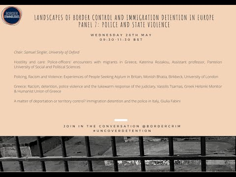

### AYS Daily Digest 14/07/21: A Political Battle on the Lithuanian\-Belarussian Border
#### More people flee Afghanistan as Taliban gains traction // 1,146 drowned in Med this year // BBC investigates pushbacks in Aegean // Austria repeals bad labour law // Belgian hunger strike finds ally in trade unions // Protests planned in Spain, Denmark, UK & elsewhere
### FEATURE — In political war, Lithuania and Belarus use people on the move as pawns

 \)](assets/d3b15a1b19c0/1*_267NT2s_8jJUEBPFLfXGg.jpeg)

Lithuania has erected a 550\-kilometer razor wire on its Belarussian border to keep people from entering the country\. \(Source: [Reuters](https://www.rferl.org/a/lithuania-migrants-detention-belarus/31356663.html?fbclid=IwAR33ze6cOa9GqVd-8pIuTtpd4_vnZlgkwGl_Ucj_vkSt1LlQonnoHVWHPq8) \)

In the midst of a political spat with its neighbor Belarus, the parliament of the Baltic state of Lithuania [has passed](https://www.rferl.org/a/lithuania-migrants-detention-belarus/31356663.html?fbclid=IwAR1iZS89UyzhqpbdoQS6pGbfExvgQ50QfjLqvVonxFXEu1BrtXpeKfTVyo4) a draconian law allowing for the mass detention of people on the move in the country\. Over the past week, hundreds of people from the Middle East and Asia have entered Lithuania from Belarus\.

We have seen this terrible tactic played out time and time again over the years: in critical moments of tension, two countries with histories of animosities using human bodies as pawns to exert political pressure on one another\. Back in March 2020, for example, Turkey announced it was ‘opening the borders’ to Greece, causing thousands of people on the move to head to the Turkey\-Greece land border\. The border, it turned out, was not opened, and many people remained stuck for days in a no\-man’s\-land area, their lives uprooted and their dreams quashed once again\.

Now, a somewhat similar situation is playing out in an entirely different part of Europe, and not along a well\-trodden transit route\. Over the past week, as we reported in a [recent digest](ays-daily-digest-12-7-21-people-in-schistou-camp-denied-protesting-after-the-recent-suicide-f0d79e2727ae) , hundreds of people seeking safety in Western Europe have come through an unlikely entry: the Lithuanian\-Belarussian border\. While there certainly have been people on the move transiting through this area for quite some time, it is relatively rare to speak to someone who has made it to the West through this route\.

What seems to be happening along this border now boils down to politics\. Lithuania is accusing Belarus of flying people to its capital, Minsk, and arranging for their journeys to Lithuania, an accusation Belarus denies, according to [media reports](https://www.infomigrants.net/en/post/33596/lithuania-passes-new-asylum-laws-to-deter-migrants?fbclid=IwAR1yvj2lgJo2GxjelH3VZ0s1hiljhA4Q71nb3qWSwnWMInEAGDtxyYAfqzw) \.

Belarus has come under increasing criticism from the international community following massive protests last year following the re\-election of Alexander Lukashenko in what is widely agreed upon to be a rigged vote\. Since then, the regime of ‘Europe’s last dictatorship’ has been cracking down on civil society in the country, jailing journalists, activists and ordinary protestors\. Lithuania is one of Belarus’ chief critics\.

Regardless of the surrounding politics, in the last week or so, hundreds of people have crossed from Belarus into Lithuania, and the latter country was quick to react harshly\. However, as recent events have shown, those at the receiving end of Lithuania’s clampdown are the people on the move themselves\.

Lithuania has begun to build a border fence along its border with Belarus\. But it gets worse, actually\. On Tuesday, July 13, the Lithuanian parliament [voted in favor](https://www.rferl.org/a/lithuania-migrants-detention-belarus/31356663.html?fbclid=IwAR2WijM5rmw7f1gDys6gaT0-RsngqbxL87shFw9Rc0kfm7T1X36Ft0A5kfI) of a new law that will allow for the mass detention of people on the move in the country\. Some 84 members of the 141\-seat Parliament said ‘yes’ to the legislation that will prevent the release of any person on the move from detention for six months after their arrival in Lithuania\. _Six months_ \.

The law will also severely restrict the right of appeal for those whose asylum claims have been rejected, and says that people can be deported _while_ their appeals are being reviewed\.

“The law is a potential human rights violation, and it does not correspond to EU directives,” Lithuanian Red Cross program director Egle Samuchovaite told media\.

“It enshrines the current bad situation in Lithuania’s detention centers in law and leaves vulnerable people in an even more vulnerable situation\.”

In Brussels, Lithuania’s foreign minister, Gabrielius Landsbergis had a meeting with EU foreign policy chief Josep Borrell in which they agreed that Belarus was using people on the move as a “weapon”\.

“When refugees are used as a political weapon…I will talk to my colleagues in order for the European Union to have a common strategy,” Landsbergis said in Brussels\.

Landsbergis is correct that people should absolutely not be used as political weapons, but the response of the Lithuanian parliament is deeply, deeply disturbing and should be a troubling sign for all EU nations\.

The law was passed extremely quickly and comes off as a knee\-jerk reaction to a ‘crisis’ situation\. Furthermore, we should add that not only was this decision made in the face of vehement objections of organizations such as the Red Cross and other NGOs, but the law most certainly violates international human rights law on a number of counts\.

We will continue to follow the disturbing developments in Lithuania\-Belarus in the coming weeks\.
### SYRIA
#### Body of an Iraqi man found in Syrian camp

The body of a 25\-year\-old man from Iraq was found in a section of the al\-Haql camp in northern Syria, close to the Syria\-Iraq border, [media reported](https://news.sn4hr.org/2021/07/14/iraqi-refugees-body-discovered-in-al-hawl-idp-camp-in-e-hasaka-on-july-12/?fbclid=IwAR2WzSK_pHKIMLBGNqa67L_T_O1cK-JV2DtMCEvqtTU_-EUd9mC8LoddsC0) \.

Authorities say Hussein Hasan al Ashour’s body, which they located on July 12, bore signs of gunshot wounds\. The al\-Hawl camp is controlled by Syrian Democratic Forces \(SDF\) and hosts those fleeing ISIS in Syria and Iraq\. Some 60,000 people live in the camp\.

According to media, the SDF has not yet launched an investigation into the killing\.
### AFGHANISTAN
#### More people flee Afghanistan in recent days in the wake of Taliban gains

As the United States pulls out its soldiers and personnel from Afghanistan as the Western nation winds down its longest war, the Taliban is making startling gains in certain key areas of the country\. With the Taliban resurging rapidly, more and more Afghan citizens are fleeing the country, heading for Pakistan, Iran, Turkey and likely Europe\.

There has been an alleged spike in border crossings into Turkey, according to [media](https://www.al-monitor.com/originals/2021/07/stream-afghan-asylum-seekers-reported-eastern-turkey?fbclid=IwAR2URLrHIz6YsoNOz7cedv9S1POMCc6XvK9j6DYYihR_WRJq8Cwh6Hx2tr0#ixzz70cJmGvtF) , who referenced videos posted on social media of people entering Turkey from Iran\.

“It is too early to talk about a mass influx, but there is an increase in the number of arrivals and there are unconfirmed news stories about an accumulation of people on the Iranian side” seeking to cross into Turkey, Metin Corabatir, president of the Ankara\-based Research Center on Asylum and Migration, told media\.

“We have to observe what will happen in Afghanistan to see what comes next,” he added\.

Meanwhile, the Taliban have claimed a strategic crossing in southern Afghanistan on the border with Pakistan, [media reported](https://www.theguardian.com/world/2021/jul/14/taliban-claim-afghan-border-crossing-with-pakistan-in-major-gain?fbclid=IwAR33ze6cOa9GqVd-8pIuTtpd4_vnZlgkwGl_Ucj_vkSt1LlQonnoHVWHPq8) \. In the early hours of Wednesday morning this week, the Taliban took full control of the city of Spin Boldak and the Afghan side of the Spin Boldak\-Chaman border crossing into Pakistan, a crucial trading juncture connecting landlocked Afghanistan with Pakistan’s ports\.

The Taliban reportedly removed the Afghan flag from the border crossing, which is known as Friendship Gate, and replaced it with its own flag\.

A spokesperson for the UN Refugee Agency [warned](https://morningstaronline.co.uk/article/w/afghanistan-brink-humanitarian-disaster-un-refugee-agency-warns?fbclid=IwAR0uZo-AyZ1RIEbvmjw8Lqpt9ZmYHQ2xYQN8-7A3bxpcnxz69C0E6oGTNAw) that Afghanistan is “on the brink of another humanitarian crisis\. This can be avoided\. This should be avoided,” Babar Baloch said\.

“A failure to reach a peace agreement in Afghanistan and stem the current violence will lead to further displacement within the country, as well as to neighboring countries and beyond,” Baloch added, urging the international community to “step up support” to Afghanistan in this critical time\.
### LIBYA
#### Photo: Detention center in Libya

■■■■■■■■■■■■■■ 
> **[Amera Markous](https://twitter.com/MarkousAmera) @ Twitter Says:** 

> > This is Al-sikka detention centre, minutes away from my home, located in a big wide street next to fancy government buildings.
It makes my heart ache whenever I pass by, knowing they are right infront of me, with no access to the life I have 💔 #Tripoli 📸 @[saracreta](https://twitter.com/saracreta)

#migrants https://t.co/osGdOGDGSq 

> **Tweeted at [2021-07-14 19:24:57](https://twitter.com/markousamera/status/1415391888442544133).** 

■■■■■■■■■■■■■■ 

### SEA
#### 1,146\+ died in the Med in the first six months of 2021

■■■■■■■■■■■■■■ 
> **[Missing Migrants Project](https://twitter.com/MissingMigrants) @ Twitter Says:** 

> > 📢At least 1,146 people died attempting to reach Europe by sea in the first six months of 2021❗️

Today we present a new analysis briefing, explaining what we know about some of the most dangerous maritime migration routes worldwide.

 ➡️ [bit.ly/MedDeaths2021](http://bit.ly/MedDeaths2021) https://t.co/DUT2ZacRf4 

> **Tweeted at [2021-07-14 08:51:49](https://twitter.com/missingmigrants/status/1415232556056842241).** 

■■■■■■■■■■■■■■ 

IOM’s Missing Migrants project has released a new analysis briefing of the latest available data on the deaths of those who brave the Mediterranean crossing\.

Deaths have more than doubled in the first five months of the year 2021, compared to the same period in the previous year\.

Many more deaths are probably unreported, the analysis notes, explaining that “every one of these people has left behind a family who may never know what has happened to their lost loved ones\.”

The analysis also noted that interceptions at sea by the Libyan coast guard and others have increased in 2021 as well\. Over 15,300 people were pushed back to war\-torn Libya between January to June, a figure almost three times the total for the same period of last year \(5,476\) \.

“This is particularly worrying, given that migrants who are intercepted at sea and returned to Libya are subjected to arbitrary detention, extortion, disappearance and torture,” the report says\.

The full analysis can be accessed [here](https://missingmigrants.iom.int/sites/mmp/files/Mediterranean-deaths-Jan-Jun_2021.pdf) \. You can also check out [Civil Fleet’s post](https://thecivilfleet.wordpress.com/2021/07/14/over-1100-people-have-died-on-sea-routes-to-europe-so-far-this-year-double-the-numbers-of-this-time-last-year/?fbclid=IwAR0YvQitaa4nRnB1PBR4_dyVjypYp1-7U5qA-cuEL7sxehTAKdJ7UDSMfE8) about the report, which summarizes nicely much of the key information\.
#### EU ‘values’ from the deck of the Ocean Viking

EU Observer’s Nikolaj Nielsen penned an [emotional article](https://euobserver.com/migration/152434?fbclid=IwAR33ze6cOa9GqVd-8pIuTtpd4_vnZlgkwGl_Ucj_vkSt1LlQonnoHVWHPq8) about his time aboard the Ocean Viking search and rescue ship, which last month rescued more than 570 people during a single mission\.

He writes movingly about the dignity of the people he spoke to aboard the ship, from an Egyptian car mechanic to a young 14\-year\-old boy\.

As the Ocean Viking filled with people, Malta, Nielsen writes, refused to engage in a rescue of another boat in distress, leaving the fate of those aboard, including 15 children, two of them disabled, the responsibility of the NGO ship\.

EU ‘values’ on full display in the Central Mediterranean\.
### GREECE
#### BBC investigates pushbacks at sea

The BBC has released a [5\-minute video](https://www.bbc.com/news/av/world-europe-57813513?fbclid=IwAR2WzSK_pHKIMLBGNqa67L_T_O1cK-JV2DtMCEvqtTU_-EUd9mC8LoddsC0) on pushbacks in the Aegean, its journalist reporting on the ground on Lesvos\. People who experienced pushbacks were interviewed for the report, as well as an employee of Legal Centre Lesvos\.

While pushbacks from Greece have been widely reported on by other mainstream news outlets, the BBC does have a very wide reach, and it is commendable that they produced this detailed report\.

The BBC interviewed Ylva Johansson, EU Commissioner for Home Affairs, for the report\. Johansson called pushbacks “violations of our fundamental European values\.”

“When we are protecting our borders, we are protecting our values\. And it cannot be a contradiction between that,” Johansson stated\.

The reporter could have pushed Johansson much harder here — a real missed opportunity\. After all, if the EU did actually disapprove of Greece’s behavior at sea, it surely has the power to influence the country’s approach\. In reality, of course, these pushbacks are happening with the full support of the EU\. But that cannot be said to the camera\.
#### Amnesty: Greece using Covid to curb right to protest

A new press release from [Amnesty International](https://www.amnesty.org/en/latest/news/2021/07/greece-authorities-abusing-power-to-trample-on-right-to-protest/?fbclid=IwAR0uZo-AyZ1RIEbvmjw8Lqpt9ZmYHQ2xYQN8-7A3bxpcnxz69C0E6oGTNAw) found that Greek authorities have abused the Covid\-19 pandemic to trample on citizens’ right to protest\.

The report focuses on protests that occurred between November 2020 and March 2021, a time when Greeks were protesting police abuse, gender\-based violence and the Greek public health system\.

“Greek authorities justified blanket bans on protest and other rights violations by citing the threat posed by the Covid\-19 pandemic,” the report says\. “Ironically, they then implemented these bans by detaining protestors in enclosed spaces, putting them at much higher risk of transmission\.”
#### Burial of the deceased man in Schistou

■■■■■■■■■■■■■■ 
> **[Parwana Amiri پروانه اميري](https://twitter.com/parwana_amiri) @ Twitter Says:** 

> > Καμία ιδέα για να βοηθήσουμε να θαφτεί ο νεαρός που αυτοκτόνησε στη #ΔομήΣχιστού; Η μητέρα του δεν γνωρίζει ακόμα για τον γιο της, ενώ ο αδερφός του ξέρει και ζητάει την ταφή του, αλλά δεν έχει εισακουστεί ακόμα.
Καμία αξιοπρέπεια ακόμη και μετά το θάνατό του….
#ChangeSystemEu https://t.co/lSm7k2rYa9 

> **Tweeted at [2021-07-14 09:03:20](https://twitter.com/parwana_amiri/status/1415235452798373893).** 

■■■■■■■■■■■■■■ 

Activist Parwana Amiri has taken to Twitter to ask about the plans for the burial of the young man who recently committed suicide in Schistou camp\.

“His mother does not yet know about her son, while his brother knows and asks for his burial, but has not yet been heard,” the young woman writes\.
#### Mare Liberum arrives on Samos for reporting trip

■■■■■■■■■■■■■■ 
> **[Mare Liberum e.V.](https://twitter.com/teammareliberum) @ Twitter Says:** 

> > Today our crew arrived on #Samos: 1 of 5 Greek islands hosting #hotspots for people on the move. Hotspots are a system by the EU to simplify deportation and imprisonment of protection seekers.

We'll be reporting more from the island during the coming days - stay tuned! https://t.co/fnMyQBB6HS 

> **Tweeted at [2021-07-14 16:53:13](https://twitter.com/teammareliberum/status/1415353703847108608).** 

■■■■■■■■■■■■■■ 

#### Reporting on migration: time, and shared cups of tea

■■■■■■■■■■■■■■ 
> **[Franziska Grillmeier](https://twitter.com/f_grillmeier) @ Twitter Says:** 

> > THREAD: It is simple: there is no other way to report about the life of people you write about than to be with them. Without time pressure. You need to sit and talk, be in a safe space, share difficult situations together as well as moments of silence, laughter or confusion. /1 https://t.co/KlAoQl6CBE 

> **Tweeted at [2021-07-14 14:22:21](https://twitter.com/f_grillmeier/status/1415315735363178496).** 

■■■■■■■■■■■■■■ 

Journalist Franziska Grillmeier wrote a long Twitter thread about her thoughts on how best to report from the ground on issues of migration\.

“There is no other way to report about the life of people you write about than to be with them\. Without time pressure,” the journalist writes\.

She then discusses how it has become more difficult in recent months to access people living in camps as the government has tightened restrictions for NGOs and journalists alike who wish to enter facilities where people are held\.

“In Greece, \#refugeesgr are becoming more and more invisible while most camps become isolated and sealed off,” Grillmeier writes\. “Many have turned into black boxes, in which human rights violations remain disclosed from public & journalists can only enter in organized tours through police escort\.”
### ITALY
#### Military agreements with Libya go to vote on July 15

■■■■■■■■■■■■■■ 
> **[borderline-europe](https://twitter.com/BorderlineEurop) @ Twitter Says:** 

> > Tomorrow, on 15th July, Italian parliament will vote on the renewal of military agreements with Libya, incl further assistance to the so-called ‘Libyan Coast Guard’, increasing the budget from 3,6 million in 2017 to 10,5 million in 2021.
#nienteaccordiconlalibia #nonsonodaccordo https://t.co/hXnK0B1tjm 

> **Tweeted at [2021-07-14 15:24:17](https://twitter.com/borderlineeurop/status/1415331323087044611).** 

■■■■■■■■■■■■■■ 

There are ongoing protests around Italy to advocate for the country to suspend its partnership with Libya\.

■■■■■■■■■■■■■■ 
> **[DinamoPress](https://twitter.com/DinamoPress) @ Twitter Says:** 

> > In centinaia a #roma davanti al parlamento per dire NO al rinnovo degli accordi con la #libia, NO alla complicità con un regime che tortura e rinchiude in lager i migranti subsahariani. #NONSONODACCORDO https://t.co/iT9CdMV8n2 

> **Tweeted at [2021-07-14 16:28:19](https://twitter.com/dinamopress/status/1415347437800132611).** 

■■■■■■■■■■■■■■ 

#### Thirty\-four people arrive in Italy from Lesvos through corridor

Nearly three dozen recognized refugees arrived on Tuesday at the Rome airport from the Greek island of Lesvos through a humanitarian corridor, [media reported](https://www.infomigrants.net/en/post/33601/humanitarian-corridor-brings-34-refugees-from-lesbos-to-italy?fbclid=IwAR0fk5ioy6hn3qVH0g0ib8SlR7LwZrp3oa-iW18vGXpsK8ZjhC_ZkEh8N3A) \.

The people hailed from 13 different countries, including Afghanistan, Mali, Congo, Somalia and Syria\.

The Community of St\. Egidio, which sponsored the corridor, told media that the minors “will be accommodated with families of the Papa Giovanni XXII Community Association and family\-type facilities in some Tuscan communities \(Livorno, Pisa, Scandicci\), which together with the network of voluntary legal guardians in Tuscany, without availing themselves of any state funding, offered their availability\.”
### MALTA
#### Maltese rescue force finds three dead in the Med

The Armed Forces of Malta rescued 81 people at sea in their search and rescue zone on Tuesday evening, including three people who were found dead, [local media reported](https://timesofmalta.com/articles/view/three-people-found-dead-as-afm-rescues-84-migrants-at-sea.886564.amp?__twitter_impression=true&fbclid=IwAR2UK6OQamu7gQLtRc00lwTuRDslTRNI_9uueLRRjAZ964JmnNGHycCQjAA) \.

The operation, which took place on the eastern side of Tunisia, began late Tuesday evening and lasted until Wednesday morning\. The people are believed to have left from Libya\.

Sea Watch has accused Malta of “criminal behavior” surrounding the week’s rescue\. The NGO says that although it had located three ships near the boat in distress, Malta ordered at least one of the ships not to intervene and to wait for further instructions\.

■■■■■■■■■■■■■■ 
> **[Sea-Watch International](https://twitter.com/seawatch_intl) @ Twitter Says:** 

> > #Moonbird found 3 ships in the vicinity of the 80 people in distress, but #Malta ordered at least one not to rescue &amp; to wait - likely for a #pullback to Libya or Tunisia. Malta has to stop its criminal behavior &amp; people have to be brought to safety without further delay. https://t.co/I0tYTHUE2B 

> **Tweeted at [2021-07-13 15:34:18](https://twitter.com/seawatch_intl/status/1414971453901086728).** 

■■■■■■■■■■■■■■ 

Alarm Phone said that the rescue took place only after the people aboard had spent “several hours in distress,” according to media\.

“We had informed authorities about their critical health situation since the morning but the rescue was delayed\!,” the organisation said\.
### SPAIN
#### In a U\-turn, Morocco now accepting its nationals back from Spain

Morocco is now accepting voluntary returns of its national back from Spain, a pivot from its behavior in previous months, when it did not allow Moroccans to come back home, [media reported](https://elforodeceuta.es/marruecos-ya-acepta-devoluciones-de-sus-nacionales-tras-la-crisis-migratoria-a-traves-de-la-frontera-con-ceuta/?fbclid=IwAR2FPlXtg_0YhNdK3tZJKvcZmldpHnWfK_eW3RloQSgFYQmXK_cMVLYEHyw) \.

Morocco confirmed on Wednesday that it will allow its citizens who have a return file open to re\-enter the country\.

A Moroccan government delegate, Salvador Mateos, said specifically that “immigrants who have tried to jump on a boat or who have had problems in the city” are being returned\.

According to media, about 20 to 30 people on average return on a daily basis, and 3,000 people have returned thus far\.
#### 43 people arrive on Canaries

Forty\-three men, including five minors, arrived on El Hierro, one of the Canary Islands, on Tuesday afternoon, [media reported](https://www.eldiario.es/canariasahora/migraciones/cayuco-43-migrantes-cinco-menores-llega-puerto-restinga-hierro_1_8133377.html?fbclid=IwAR1BDOfUdO0V3uBK0bwLy7_MJcNFccJthk9jx2Ug-ofYzjK5oeV-n14bzAk) \.

The group arrived by their own means in a cayuco, a long fishing canoe, in the port of La Restinga, in the south of El Hierro, the second smallest of the Canary Islands\. The people were treated by the Red Cross and the local health service and no transfers to hospital were necessary, media reported\.

The people said they had left five days before from Nouakchott, Mauritania\. They hail from Mali, Gambia, Guinea Bissau and elsewhere\.
#### Protests planned to advocate for those stranded in Ceuta

No Name Kitchen, Maakum and Elin are planning protests across Spanish cities on **Saturday, July 17** to protest the situation of those who arrived on Ceuta and remain in administrative limbo\.

The protests will take place in Ceuta, Madrid, Bilbao, Jaén, Málaga, Canarias and Melilla\.

■■■■■■■■■■■■■■ 
> **[NoNameKitchen](https://twitter.com/NoNameKitchen1) @ Twitter Says:** 

> > 📣 El próximo sábado, 17 de julio por iniciativa de las personas migrantes que están en un limbo administrativo y asistencial en la ciudad de Ceuta, se hará una concentración en Ceuta y en otras ciudades de la península. Junto con Asociación Elín y @[Maakumceuta](https://twitter.com/Maakumceuta) 📷Cristina Corral https://t.co/sNe7L49vYX 

> **Tweeted at [2021-07-14 11:43:28](https://twitter.com/nonamekitchen1/status/1415275750794698757).** 

■■■■■■■■■■■■■■ 

### BOSNIA AND HERZEGOVINA
#### Evicted in Bihać forcibly resettled in Lipa camp

More than 200 people who were staying in an abandoned metal factory on the outskirts of Bihać, the capital of Bosnia’s Una Sana canton, were forcibly removed in recent days to Lipa camp, an inhumane facility without proper running water or consistent electricity\.

Volunteers on the ground in Una Sana have noticed a sharp increase in evictions in recent months, both of families and single men\. Families are now usually brought to Borići camp, in Bihać, and single men to Lipa, some 25km outside the city in a remote, barren grassland\.
### AUSTRIA
#### Groundbreaking verdict to remove bans on access to labour for asylum\-seekers

Austria’s Constitutional Court \(VfGH\) has taken a groundbreaking decision on July 14 to annull two decrees restricting the labor market for asylum\-seekers in the country, [media reported](https://kurier.at/politik/inland/bekommen-asylwerber-durch-vfgh-entscheid-ein-recht-auf-arbeit/401442901?fbclid=IwAR26MBl4oMwTiLMMqCTjUoRUoX6R-UrfN0b3Z4zgF5Kkzmkkbn_ru3LzpEU) \.

The two decrees, from 2004 and 2018, have restricted the employment of asylum\-seekers, and are now illegal, the VfGH explains\.

As soon as the repeal is official, asylum\-seekers will be eligible for employment in all fields of labour, not just as harvesters and seasonal workers\.
### BELGIUM
#### European Trade Union supports work permits for undocumented people involved in hunger strike

The European Trade Union Confederation \(ETUC\) has come out in support of granting work permits to undocumented people in Belgium, [according to media](https://www.lesoir.be/383883/article/2021-07-14/la-confederation-europeenne-des-syndicats-soutient-la-demande-de-permis-de) \. Some 400 people remain on hunger strike to advocate for their regularization in the country, where many have worked for years in the underground economy\.

“The hunger strike in Brussels is primarily about human rights, undocumented workers who seek respect\. They have lived here for years and sometimes decades, their children are in schools with ours, but they live in fear of being detained and expelled and work for three to five euros an hour,” Ludovic Voet, Secretary of the ETUC, said in a statement\.

“The Belgian government must show a minimum of humanity and work with trade unions and employers on the practical solutions proposed before someone dies\. Across Europe, we need a fundamental change in migration policy that prevents dishonest employers from using vulnerable people as cheap labour by creating legal routes to live and work,” the Secretary continued\.

The ETUC represents 89 trade union organizations in 39 European countries, for a total of 45 million members\.
### GERMANY
#### Two\-thirds of Syrians in Germany cannot make a decent living

New unemployment figures show that nearly two\-thirds \(65%\) of Syrian living in Germany rely either entirely or partially on public benefits, [media reported](https://www.infomigrants.net/en/post/33597/germany-two-thirds-of-syrian-refugees-unable-to-support-themselves?fbclid=IwAR2DLDCoyzfchnK1_oxAg1_l2PMqbNa8W-uk3YFyKDa3iL8FzVkSK4Mu2X0) \.

While Syrians are the main beneficiaries of refugee protection in Germany, they are much more likely than other foreign\-born populations to receive so\-called Hartz IV benefits\. By contrast, 37% of Somalians and 44% of Afghans are on welfare\.
### DENMARK
#### Worldwide demonstrations against Syrian deportations from Denmark

This Friday, July 16, demonstrations will be held across the world to come out in support of Syrians in Denmark facing deportation\.

Syrianotsafe wrote on Facebook:

> The Danish government want to cancel the residencies of and issue deportation notices to hundreds of Syrian refugees\. This action just had been announced after the Danish Government declared, that Rif Dimashq Governorate of Syria, including Damascus, is “Safe”\. 

> We say \#SyriaNotSafe\. 

> Even, if there are no bombs falling everywhere in Syria, that doesn’t mean that Syria is safe\. The machinery of torture and the repressive state are still there\. As long as the Assad regime stays in power, Syria will not be safe\. 

> This action from Danish government is an action based on a false assessment of the situation in Syria, and is in breach of international law and the principle of non\-refoulement, which guarantees that no one should be returned to a country where they would face torture, cruel inhuman or degrading treatment or punishment and other irreparable harm\. 

> Syrian refugees cannot „go home“\. Returning to Syria means incarceration and in most cases death\. 

More information about the locations and times of the scheduled protests can be found at the event’s [Facebook link](https://www.facebook.com/events/247745656794660) \.
### UNITED KINGDOM
#### July 19 rally in London to support the undocumented

A solidarity rally will be held on July 19, 5–7pm at 10 Downing Street in London in support of undocumented immigrants\.

■■■■■■■■■■■■■■ 
> **[Regularise](https://twitter.com/RegulariseUK) @ Twitter Says:** 

> > 📢 SOLIDARITY RALLY📢
19 July, 5-7pm @ 10 Downing St
On Monday MPs will debate the regularisation of undocumented migrants. We call on the @[GOVUK](https://twitter.com/GOVUK) &amp; public to #StandUp4Migrants by supporting a safe route to regularisation, not a punitive one that prolongs precarity.
#Rights4Undocs https://t.co/dSuKVvbyrl 

> **Tweeted at [2021-07-14 15:16:59](https://twitter.com/regulariseuk/status/1415329485235314689).** 

■■■■■■■■■■■■■■ 

### EU \+ FRONTEX
#### New report on Frontex released

New research has been released concerning the EU border agency Frontex and its role in deportations, data surveillance, and border management\.

“The report traces exit governance from the way in which the political institutions, and with them Frontex, are seeking to transform not just the operational understanding of exit policies, but also the very knowledge environment through which exit is understood by Member States and non\-state actors,” the introduction reads\.

The paper “details the central and rapidly expanding role of the Frontex Agency in the institutional structure and political dynamics underpinning EU exit policies, and how the Agency interacts with a range of non\-state actors, ranging from commercial for\-profit companies to International Organizatons \(IOs\) and civil society organizations, such as NGOs,” the introduction continues\.

“Frontex and Exit Governance: Dataveillence, Civil Society and Markets for Border Control”, authored by Martin Lemberg\-Pedersen & Oliver Joel Halpern, can be accessed at [this link](http://admigov.eu/upload/Deliverable_23_Frontex_and_Exit_Governance_Lemberg-Pedersen_Halpern.pdf) \.
### GENERAL
#### Traveling puppet festival raises awareness of plight of Syrians

[“The Walk”](https://www.walkwithamal.org/) is an ambitious project: a four\-month long traveling festival beginning in Gaziantep, on the Syrian\-Turkish border, and ending in Manchester, UK\. From July 27 to November 3, little Amal, a 9\-year\-old Syrian puppet girl will ‘walk’ 8,000 km and pass through 65 cities on her journey to Europe\.

Amal, which means ‘hope’ in Arabic, is a 3\.5\-meter puppet made of carbon fiber and bamboo canes produced by the Handspring Puppet Company\. As Amal makes her way west, she will host many cultural events and public shows for adults and children especially\.

The project is produced by British film director and producer Stephen Daldry, known for _Billy Elliot_ , _The Hours_ , and _The Reader_ , film producer Tracey Seaward, and more\.
#### Border Criminologies panel on police and state violence

If you missed it, you can watch on YouTube Panel 7 of Border Criminologies, which focuses on police and state violence, which ran from May 24–6\.

“Landscapes of Border Control and Immigration Detention in Europe” featured the insights of Monish Bhatia and Vassilis Tsarnas, among others working on the issue in Greece, Italy and the UK\.

### WORTH READING/WATCHING
#### Refugees excluded in Greece: Designation of Turkey as a ‘safe third country’

Refugee Support Aegean hosted a panel discussion today on the tightening policy of exclusion of refugees fleeing to Greece, following the latest decision of the Greek government to designate Turkey a ‘safe third country\.’

The panel, which included speakers from ECRE, Pro Asyl, RSA, the Greek Forum of Refugees, and others, can be viewed at [this link](https://www.youtube.com/watch?v=pEenDUFJIEU) \.
#### An underreported topic: Drownings in Balkan rivers

A long read, on the ground report from Al Jazeera about an important and underreported topic: people on the move who lose their lives in the Balkan rivers while en route to Western Europe\.

“While the plight of refugees drowning in the Central Mediterranean and the eastern Aegean is well documented, little attention is paid to these deaths in the Balkan rivers\. Non\-governmental [search\-and\-rescue ships patrol the waters](https://interactive.aljazeera.com/aje/2019/onboard-the-ocean-viking/index.html) off the Libyan coast in the Mediterranean and several international hotlines such as Alarm Phone and Aegean Boat Report operate continuously to receive distress calls in both the major seas,” the article reads\.

The article features the voices and experiences of four people on the move who have experienced trauma related to water crossings or are themselves preparing to make a river crossing\.
#### Daniel Trilling on how Priti Patel’s borders bill won’t solve any problems

A proposed bill in the UK will allow the home secretary to expand the camp\-style accommodation established last year, and to send asylum\-seekers overseas while their claims are being processed \(even if no country has agreed to receive them\) \. Additionally, prison sentences for ‘illegal entry’ to the UK will be increased\.

Trilling unpacks this new proposed legislation and how it won’t actually solve any of the problems Patel says it will\.

“The idea that tough deterrent measures are not only necessary to keep anxious voters happy but are ultimately in the best interest of refugees themselves is one that politicians in many parts of the rich world find appealing,” Trilling writes\.

**Find daily updates and special reports on our [Medium page](https://medium.com/are-you-syrious) \.**

**If you wish to contribute, either by writing a report or a story, or by joining the info gathering team, please let us know\.**

**We strive to echo correct news from the ground through collaboration and fairness\. Every effort has been made to credit organisations and individuals with regard to the supply of information, video, and photo material \(in cases where the source wanted to be accredited\) \. Please notify us regarding corrections\.**

**If there’s anything you want to share or comment, contact us through Facebook, Twitter or write to: areyousyrious@gmail\.com**

_Converted [Medium Post](https://medium.com/are-you-syrious/ays-daily-digest-14-07-21-a-political-battle-on-the-lithuanian-belarussian-border-d3b15a1b19c0) by [ZMediumToMarkdown](https://github.com/ZhgChgLi/ZMediumToMarkdown)._
