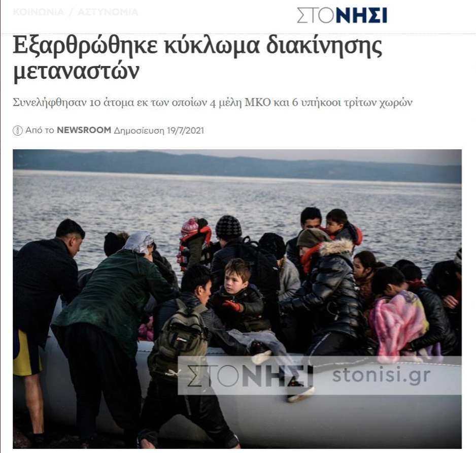

### AYS Daily Digest 19/07/21: In Blow to Solidarity Efforts, Human Smuggling Case Opened on Lesvos
### Rescue off Spain // Frontex in Evros // Hunger striker in bad health in Belgium // Racist attack in Germany // Ylva Johansson responds to NGOs’ concerns

[Are You Syrious?](?source=post_page-----c0ae54b4deb1--------------------------------)

[Jul 20](ays-daily-digest-19-07-21-in-blow-to-solidarity-efforts-human-smuggling-case-opened-on-lesvos-c0ae54b4deb1?source=post_page-----c0ae54b4deb1--------------------------------) · 10 min read
### FEATURE — 10 people, including 4 NGO workers, are caught up in legal case designed to criminalize their work on Lesvos

Two Greek\-language news sites announced yesterday that the government had “dismantled a trafficking ring \[a smuggling ring\] which involves 4 NGO members & 6 ‘third country nationals\.’” The individuals are said to be from Norway, the UK and other European countries, as well as from Syria and Afghanistan, but their identities have not yet been disclosed to the public\.

We will remind you that the criminalization of solidarity work in Greece has a [long, sordid history](https://www.aljazeera.com/news/2018/9/16/refugee-advocates-blast-arrests-of-rescue-workers-in-greece?fbclid=IwAR1Q4ssYKByu6e0YYiKDP7JxrlXATM1-VUotpfk75RuvZj0UKtTHB2Gezag) stretching back to 2015\. [The arrest of Sarah Mardini](https://www.thenewhumanitarian.org/feature/2019/05/02/refugee-volunteer-prisoner-sarah-mardini-and-europe-s-hardening-line-migration) , the Syrian swimmer who returned as an aid worker to Lesvos, is perhaps the most high\-profile case\.

Back last fall, the Greek government [announced](https://www.infomigrants.net/en/post/27620/greek-government-accuse-foreign-aid-workers-of-migrant-smuggling-and-spying?fbclid=IwAR1-FMdhQ7wYOFndBu1OuI-lh_EpIVLa4hnv14iEMcvy3QvzrXJvY5oXgUA) they were accusing a total of 35 aid workers of four NGOs in Greece of migrant smuggling and spying\. Authorities at the time said the alleged ‘crimes’ dated back to June 2019, with a special focus on the period of high arrivals on Lesvos in August of that year\.

[Alarm Phone](https://alarmphone.org/en/2020/10/01/the-real-crimes-are-push-backs-and-human-rights-violations-by-the-greek-government/?fbclid=IwAR380CqxRIayqgWK13ZBByjJsjCQ7qEp10FmHvx_cqN8LahLdlpu74gcqas) wrote in a press release last October on the announcement that

> _Even though the press statement does not name the NGOs or the individuals, there were several media reports stating that the Alarm Phone is among the groups that are targeted\. For the time being, we refrain from publicly commenting on the ongoing investigation\. Instead, we want to point out the real crimes which are ongoing\!_ 

The group noted their relationship with the Hellenic Coast Guard “has never been as complicated as it is right now”, and continued:

> _Human rights violations reached a new level in the Aegean Sea since the beginning of March\. This escalation in violations went along with acts of repression against NGOs and all sorts of solidarity structures for refugees and migrants\. Obviously, the Greek state wants to eliminate witnesses of the crimes against humanity they commit on a daily basis\._ 

Now it seems these accusations are beginning to bear fruit\.

One of the news outlets which reported on the ‘trafficking ring’ this week, [Politischios\.gr](https://www.politischios.gr/astinomika/lesbos-exarthrotheke-10meles-kukloma-diakineses-metanaston?fbclid=IwAR3XiY7CkZf4yQa4ocOsmd7r5YFuZYRGjAsuUAUbgkne5Jp2yBTpzXc0QNc) , wrote that the investigation was carried out with the cooperation of the country’s counter\-terrorism service, called the [Directorate for the Prevention of Special Crimes of Violence](https://el.wikipedia.org/wiki/Αντιτρομοκρατική_Υπηρεσία_(Ελλάδα)) \.

After “many months of research,” Politischios wrote, authorities determined that the individuals were “active in facilitating the illegal entry of foreigners into Greek territory, through the islands of the Northeast Aegean\.”

“The criminal case file of the Mytilene Security Sub\-Directorate includes the offenses of facilitating the illegal entry of foreigners into Greek territory, espionage, as well as violations of the Immigration Code,” the article continues\.

The article in Stonisi\.gr, the other news outlet which reported on this case, erroneously stated that the suspects had already been arrested\. However, the article has since been changed\. We should note it would be difficult to believe that the arrests had already taken place, as the accused are from several different countries and many are likely no longer in Greece\.

[Kathimerini](https://www.kathimerini.gr/society/561438406/metanasteytiko-nea-epicheirisi-alkmini-gia-mko-sti-lesvo/?fbclid=IwAR0GCd9F0SxmqYlJLM_SLUueTSRY6-4qdeCYe5LTWqgsquXCzEvZAXewuag) , one of the largest newspapers in Greece, also published a short article on the case, lending some credibility to the reporting of the local outlets\. Additionally, the police published a [press release](http://www.astynomia.gr/index.php?option=ozo_content&lang=%27..%27&perform=view&id=103779&Itemid=2662&lang=) on the matter, in Greek, from which the Politischios article is copy\-pasted\.

All of this comes in the wake of increased media attention on pushbacks from Greece\. The BBC released a [video](https://www.youtube.com/watch?v=g4WZGxxDd50) last week openly naming pushbacks as pushbacks, and the New York Times published an [article](https://www.nytimes.com/2021/07/18/world/europe/greece-migrants.html) on pushbacks as a reporter joined a Turkish Coast Guard vessel ferrying pushed\-back people from the sea to the Turkish shore\. Additionally, the Frontex Scrutiny Working Group within the European Parliament delivered its final “ [Report on the fact\-finding investigation on Frontex concerning alleged fundamental rights violations”](https://www.europarl.europa.eu/meetdocs/2014_2019/plmrep/COMMITTEES/LIBE/DV/2021/07-14/14072021FinalReportFSWG_EN.pdf) on Thursday, July 15\.
### SEA
### Rescue off Spanish island

The Spanish Civil Guard has rescued 14 people aboard a boat off the coast of Formentera, the smallest of Spain’s Balearic islands, just south of Ibiza, [media reported](https://www.europapress.es/illes-balears/noticia-rescatan-patera-14-personas-bordo-formentera-20210719210543.html?fbclid=IwAR3ArdppQRyvDqzNnT0MhZOnmkpwPdrQ5MhrO1eirkYX9z9im-yF1eEuFp0) \. The people are said to be in good health\. No information was given in that article about their nationality or where they were moved\.
### Open Arms sets sail

Fair weather\!
### IOM figures for Central Med
### GREECE
### Frontex surveillance over Evros region

For more information, check out the Evros news article [here](https://www.evros-news.gr/2021/07/19/αλεξανδρούπολη-ξεκίνησε-την-επιτήρη/) \.
### Footage of new camp on Samos
### No Border Kitchen on the Vial 15 and the difficult summer ahead on Lesvos

> _The trial of the vial 15 ended on a much more positive note than we could have hoped for in recent circumstances\. With none of the defendants convicted for a felony offense, and a 4 year suspended sentence means that nobody will serve more time in prison then they already did during their pre\-trail detention\. Still, people where convicted for misdemeanors that had little or no evidence to back up the accusations\. But the fact that people still got convicted in a case that hinged on the fact that one police officer picked the portraits of the accused out of a police database with “known suspects” after the fact, is absurd\. Combined with the fact that people served 14 months in pre\-trail detention while already being subject to local restrictions, it is still business as usual\. It is indeed more then we could hope for, but what we hope for on Lesbos and in Greece in general is not much\._ 

Read the full post [here](https://www.facebook.com/plugins/post.php?href=https%3A%2F%2Fwww.facebook.com%2FNBKLesvos%2Fposts%2F2087216668084778&show_text=true&width=500) , and [more](https://www.facebook.com/NBKLesvos/posts/2100740466732398) on the designation of Turkey as a ‘safe country’ from NBK\.
### Good thread on pushbacks
### Athens\-based Khora needs your help to run their kitchen\!

> _Because of ongoing lack of funding, our Social Kitchen is running reduced opening hours\._ 

> _We are open Monday, Wednesday and Friday 1pm for takeaway meals, and a sit in dinner on Tuesday evenings for 30 people each time\._ 

To support Khora and their great work, you can donate via Paypal or direct transfer at [this link](https://www.khora-athens.org/donate?fbclid=IwAR1zu77lZmt30CQpKU56M8s2T8BatusMRmzUZmcRVPpp-pHtGEz9PXEfTI4) \.
### SLOVENIA / BALKANS
### Info Kolpa event on July 24

The NGO Info Kolpa and partners are hosting an event on Saturday, July 24 entitled “The Balkan Route and the right to migrate\.”

The group will discuss the role of the Slovenian police in carrying out collective deportations on the Slovenian\-Croatian border and share experiences of life on the Balkan route and in the Slovenian asylum system\.
### BELGIUM
### Hunger strikers in bad health

We are saddened to report that one of the hunger strikers in Belgium has been taken to hospital with kidney and liver failure\. The people have now been on hunger strike for 56 days\.
### GERMANY
### Racist attack in Saxony

A 20\-year\-old Somali man was injured in a racist attack in Saxony, Germany on Saturday, [media reported](https://www.mdr.de/nachrichten/sachsen/chemnitz/annaberg-aue-schwarzenberg/rassitischer-angriff-bad-schlema-100.html?fbclid=IwAR3X0dl1JrgjNkhz8o0fAMynilglDYuHhBWFqamcwbpApusdr1YsDPfqcFo) \. Eight men are said to have assaulted the man aboard a bus in Aue\-Bad Schlema, a town in Saxony south of the city of Chemnitz\.

At least two of the men were reported to have pushed the young man to the ground and kicked him\. The bus driver subsequently called the police and an investigation has been opened, according to media\.
### Demo against Lufthansa

No Border Assembly Berlin held a demonstration against the airline Lufthansa and its role in deportations from Germany\.
### UNITED KINGDOM
### Nationality and Borders Bill debated in UK this week

Check out this thread from the UNHCR for more info\.
### UK NGOs speak out against suicides of young asylum seekers

Forty\-six charities have written to UK health minister Nadine Dorries to raise the alarm about suicides of teenage asylum seekers in the country, [media reported](https://www.theguardian.com/uk-news/2021/jul/19/charities-raise-alarm-suicides-young-asylum-seekers-uk?fbclid=IwAR2XgNzMqYiflwma4oShaiuxL5BpF7MrBj-v1tk9dWegUlXQwioIng9xNb4) \.

“We are deeply saddened by the tragic deaths by suicide of young people arriving in the UK, seeking asylum,” one NGO coordinator told media\.

“Without publicly available data, we cannot know how many other young people coming to the UK seeking sanctuary have gone on to take their own lives\. Without change we fear more young people will lose hope,” he continued\.

The letter advocates for more attention on the issue and a requirement for coroners to record nationality and immigration status\. The groups also called for an independent inquiry into deaths in the UK’s asylum system\.
### EU \+ FRONTEX
### Ylva Johansson responds to Greek NGOs

European Commissioner for Home Affairs Ylva Johansson [has responded in a letter](https://www.humanrights360.org/wp-content/uploads/2021/07/Johanson-reply-8-July-2021.pdf?fbclid=IwAR0CgLMU9KsPhUc3SCjWNsRPx5OF85iTluhucmKBt_j5av16Lo1a15Vzugg) to five Greek NGOs who had raised concerns over pushbacks, deportations and the role of Frontex at Greece’s borders\. The organizations are Refugee Support Aegean, the Greek Council for Refugees, HIAS Greece, HumanRights360 and the Hellenic League for Human Rights\.

In typical fashion, Johansson began her letter by reiterating her opinion that allegations of pushbacks from Greece are “highly concerning” and called again for investigations by Greek authorities into such allegations\.

In general, throughout the letter, Johansson refrained from commenting on specific allegations made by the groups, instead opting to paraphrase EU law\.

For example, she said: “Concerning your assertions regarding the number of people rescued, brought ashore, having reached Greece, or prevented from unauthorised crossing of the external borders, **the Commission is not in a position to confirm the figures nor the alleged reasons for their apparent discrepancies\.** \[bolding added\]”

Johansson also said that “\[t\]he inquiry of the ad hoc Working Group on Fundamental Rights, Legal and Operational Aspects established by the Management Board of Frontex did not find evidence linking Frontex units to possible breaches of the principle of non\-refoulement\.”

Speaking on the topic of border surveillance, Johansson pointed out that the Schengen Borders Code states that external borders may only be crossed at official border crossings, and that “the prevention of unauthorised crossing of the external borders is an obligation for the Member States, and is the main purpose of border surveillance\.” She noted that no provisions of EU law, “including the asylum acquis, aim to encourage authorised crossings of the external borders\.”

What Johansson failed to acknowledge in this section is that the vast, vast majority of people are not able to cross at official border crossings\. Requests for asylum at the gates of the European Union will be laughed off by border guards\. People cross into the EU by boat and through the ‘green border’ of the forests not because it is easier for them; in fact, it is much more difficult, not to mention life\-endangering\. They cross this way because they have no legal means to access the asylum system in the EU\.

In response to Johansson’s letter, [HumanRights360](https://www.humanrights360.org/el/apantisi-tis-epitropoy-esoterikon-tis-eyropaikis-epitropis-ilva-giochanson-gia-tis-paranomes-epanaproothiseis/?fbclid=IwAR0GCd9F0SxmqYlJLM_SLUueTSRY6-4qdeCYe5LTWqgsquXCzEvZAXewuag) wrote on its website the following excerpt:

> _For our part, we reiterate that deportations are an unacceptable practice under international law that exposes refugees to life\-threatening and deportation to a place where they are at risk of death or deprivation of liberty\. A benevolent state that respects human rights, the international conventions that protect them, and the rule of law must completely abstain from such illegal practices\._ 

### GENERAL
### Mixed Migration Update July 12–19

Check out the latest [Mixed Migration Update](https://mixedmigration.substack.com/p/july-12-19-2021-mixed-migration-update?fbclid=IwAR3eW9x_3YlJdz-rRImzUkLYBvAYWZNmyNe5rgUVib9npM4hkmc5YjTMdqk) , a Substack newsletter from Joel Hernàndez\. We are big fans\!
### Statewatch workshops: calls for interest

Statewatch is putting out calls for interest for two workshops on policing and migration databases this autumn, and is reaching out to groups involved with refugees, asylum\-seekers, young people, lawyers’ associations, police monitoring groups, etc\., to participate\.

For more information, check out [this link](https://www.statewatch.org/projects/biometric-europe-civil-society-workshops/call-for-expressions-of-interest-state-databases-biometrics-policing-and-migration-control/) \. The deadline to express interest is August 1\.
### WORTH READING
### Facial recognition software in Canada

The Canadian federal government secretly tested facial recognition technology on millions of travellers at a Toronto airport in 2016, a six\-month initiative meant to identify people the country’s border services agency suspected may try to enter Canada using false papers\. The existence of this program was discovered by reporters from the Globe and Mail through a freedom of information request\.
### [Ottawa tested facial recognition on millions of travellers at Toronto’s Pearson airport in 2016](https://www.theglobeandmail.com/canada/article-ottawa-tested-facial-recognition-on-millions-of-travellers-at-torontos/?fbclid=IwAR1FXuuAtXKM-SrPwyYEyRSTYmJi3W_z8IbpNVOHOfOgkpARUH5N1UVonHU)
### [In an effort to identify potential deportees, the federal government quietly tested facial recognition technologyon…](https://www.theglobeandmail.com/canada/article-ottawa-tested-facial-recognition-on-millions-of-travellers-at-torontos/?fbclid=IwAR1FXuuAtXKM-SrPwyYEyRSTYmJi3W_z8IbpNVOHOfOgkpARUH5N1UVonHU)

[www\.theglobeandmail\.com](https://www.theglobeandmail.com/canada/article-ottawa-tested-facial-recognition-on-millions-of-travellers-at-torontos/?fbclid=IwAR1FXuuAtXKM-SrPwyYEyRSTYmJi3W_z8IbpNVOHOfOgkpARUH5N1UVonHU)
### UK’s Nationality and Borders Bill

Part 4 of the Nationality and Borders Bill addresses modern slavery and human trafficking\. Here is a summary of each key change that Part 4 of the Bill introduces\.
### [Briefing: the Nationality and Borders Bill, Part 4 \(modern slavery\) \| Free Movement](https://www.freemovement.org.uk/briefing-the-nationality-and-borders-bill-part-4-modern-slavery-human-trafficking/?fbclid=IwAR39xyWHb2Us54bm-g3YBTUH8qq2ymNR8hI4EYLqBRSsimvKAZa7PgFz2uM)
### [Part 4 of the Nationality and Borders Bill addresses modern slavery and human trafficking\. The Home Office’s goals for…](https://www.freemovement.org.uk/briefing-the-nationality-and-borders-bill-part-4-modern-slavery-human-trafficking/?fbclid=IwAR39xyWHb2Us54bm-g3YBTUH8qq2ymNR8hI4EYLqBRSsimvKAZa7PgFz2uM)

[www\.freemovement\.org\.uk](https://www.freemovement.org.uk/briefing-the-nationality-and-borders-bill-part-4-modern-slavery-human-trafficking/?fbclid=IwAR39xyWHb2Us54bm-g3YBTUH8qq2ymNR8hI4EYLqBRSsimvKAZa7PgFz2uM)
### EUObserver: EU plans military mission to Libya

The EU is firming up plans for a military mission to Libya in order to compete for influence with foreign powers there, according to a leaked paper seen by EUobserver\.
### [\[Exclusive\] EU firms up plans for Libya military mission](https://euobserver.com/world/152474)
### [The EU is firming up plans for a military mission to Libya in order to compete for influence with foreign powers there…](https://euobserver.com/world/152474)

[euobserver\.com](https://euobserver.com/world/152474)
### Statewatch: An interview with Julien Jeandesboz, border control expert

“European border control degrades migrants by ruining their life expectations”, says Julien Jeandesboz in an interview about the nature of “zoopolitics”, changes to the Eurodac biometric database, the development of the European Travel Information and Authorisation System, and vaccination passports\.
### [Statewatch \| “European border control degrades migrants by ruining their life expectations”](https://www.statewatch.org/news/2021/july/interview-european-border-control-degrades-migrants-by-ruining-their-life-expectations/?fbclid=IwAR3ArdppQRyvDqzNnT0MhZOnmkpwPdrQ5MhrO1eirkYX9z9im-yF1eEuFp0)
### [An interview with Julien Jeandesboz, expert on border control, about the nature of “zoopolitics”, changes to the…](https://www.statewatch.org/news/2021/july/interview-european-border-control-degrades-migrants-by-ruining-their-life-expectations/?fbclid=IwAR3ArdppQRyvDqzNnT0MhZOnmkpwPdrQ5MhrO1eirkYX9z9im-yF1eEuFp0)

[www\.statewatch\.org](https://www.statewatch.org/news/2021/july/interview-european-border-control-degrades-migrants-by-ruining-their-life-expectations/?fbclid=IwAR3ArdppQRyvDqzNnT0MhZOnmkpwPdrQ5MhrO1eirkYX9z9im-yF1eEuFp0)

**Find daily updates and special reports on our [Medium page](https://medium.com/are-you-syrious) \.**

**If you wish to contribute, either by writing a report or a story, or by joining the info gathering team, please let us know\.**

**We strive to echo correct news from the ground through collaboration and fairness\. Every effort has been made to credit organisations and individuals with regard to the supply of information, video, and photo material \(in cases where the source wanted to be accredited\) \. Please notify us regarding corrections\.**

**If there’s anything you want to share or comment, contact us through Facebook, Twitter or write to: areyousyrious@gmail\.com**

_Converted [Medium Post](https://medium.com/are-you-syrious/ays-daily-digest-19-07-21-in-blow-to-solidarity-efforts-human-smuggling-case-opened-on-lesvos-aedfc3a063f9) by [ZMediumToMarkdown](https://github.com/ZhgChgLi/ZMediumToMarkdown)._
