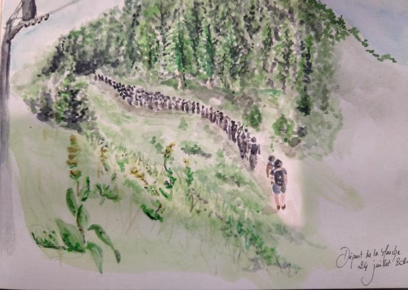

### AYS Weekend Digest 24–25/7/21: New walls at EU’s borders\.
#### Walls and armoured vehicles between Belarus and Lithuania // Busy weekend in the central Med // Tunisia on the brink of authoritarianism // More from Greece, Italy, Ceuta, France and the UK\.

From Thursday 22 the resistant camp & caravan ‘Por la vida’ in the French\-Italian Western Alps is taking place\. Six days of camping, talks, events and discussions\. A 2\-day march crossed the border with more than 300 people passing through Alpine paths, reaching Briancon and Gap in France\. \(Credit: [Vallées en lutte](https://valleesenlutte.org/spip.php?article141) \),
### Featured: More walls and military at the EU’s border

On Sunday the Lithuanian government thanked the EU for the support given to the country facing the new ‘crisis’ at the EU’s external border\. Funding has been pledged by various EU countries through the ECHO \(European Civil protection and Humanitarian Operations\) programme\.

The EU commission pledged €10m to reinforce the country’s border\.

Austrian interior minister [announced](https://orf.at/stories/3221970) over the weekend the country is sending 13 special units \(called COBRA\) and one armoured vehicle to support the Lithuanian border police, in a deployment that will last for several weeks\. He also asked the EU Commission to support Lithuanian authorities in their plan to build a 680\-km fence on their border with Belarus\.

On July 10, Frontex had announced the increase of its support at the EU external border in Lithuania, deploying 60 officers\.

> _“European standing corps teams already help the country with border control and surveillance\. The operation, which started with the deployment of a dozen officers and patrol cars, will more than double in size next week\._ 

> _Frontex will also provide Lithuania with experts who will assist national authorities with gathering data on illegal border crossings and support the exchange of operational information\.”_ 

EASO will also send 50 ‘experts’\.

These suggestions of Manos Moschopoulos remain unheard\. Among many things, the deployment of an armoured vehicle in the context of people seeking safety from the authoritarian rule and repression of Lukashenko in Belarus seems paradoxical\. It is not; it fits perfectly within the policies of securitisation and militarisation of the Union’s borders\. All those EU institutions and national governments, which were very vocal in criticising the Belarusian government, are now rushing to build a new wall to stop people fleeing from it\.

SEA
### Busy weekend in the Central Mediterranean

While everyone talks about Ahmed Afnaoui, the Tunisian swimmer who surprised the world winning the gold medal at Tokyo’s Olympics, the Tunisian president has suspended the country’s parliament, dismissed the prime minister, and taken control over the executive\. This follows days of demonstrations for the country’s social, economic and health situation\. This is the same president with whom Italy and the EU have signed agreement on externalisations and deportations, forcibly defining Tunisian people in Europe as ‘economic migrants’\.

A lot happened over the last few days \(22–25 July\) at sea as well: as reported by Italian journalist Sergio Scandura, more than 1500 people [reached](https://twitter.com/scandura/status/1419310684911935491?fbclid=IwAR1OqwH4l7PtrEy0mN24evd0RXqU-TzCaAQXbs9QcU_8N75tnobN0NlDRTY) Lampedusa, with more than 60 disembarkments\. The hotspot on the island, which is in a permanent state of ‘emergency’, is not fit to host such large numbers\. Around 300 people have been transferred on Sunday on the Azzurra quarantine ship\.

At least another 1500 people have been [taken back](https://twitter.com/msehlisafa/status/1418612557078794241) to Tripoli by the Libyan coastguard\.

Astral [spotted and supported](https://www.facebook.com/proactivaservice/posts/4412542558776561) a group of 17 people in international waters while waiting for the Italian coastguard to rescue them and bring them to safety\.

On Sunday evening, Alarm Phone [reported](https://www.facebook.com/proactivaservice/posts/4412542558776561) of one boat with 50 people in distress in Maltese waters with no food, water or fuel after two days at sea\. There are no updates on their condition yet\.

Reporting on the Central Mediterranean is always difficult, especially due to the minimal co\-operation of European and European\-funded coastguard in providing details on arrivals and on their operations\. What’s left is the issue of responsibility:

GREECE
### Sea rescuer excluded from presidential award

Iasonas Apostolopoulos, the Greek sea rescuer who has spent years onboard Aquarius, as a member of SOS Mediterranee, was to be awarded by the Greek President of the Republic Katerina Sakellaropoulou for his humanitarian work during the upcoming celebrations for the 47th anniversary of the restoration of the Republic\.

However, only a few hours before the ceremony, a Neo Demokratia MP [stated](https://thepressproject.gr/exeftelistiki-akyrosi-vravefsis-epithetikou-epikriti-tis-kyvernisis-apo-tin-ptd-stin-epeteio-tis-dimokratias) that Apostolopoulos’ aggressive criticism of the “political defence of the borders of the Hellenic Republic and the Security Forces as a whole, will NOT be honoured tomorrow by president, as originally announced”\. Apostolopoulos was reached by phone by the Foreign Affair ministry, which informed him of the cancellation of the award\.

We express our solidarity with Iasonas, who does not need any award from the institutions of a country which is routinely carrying out racist, violent and criminal policies against people on the move at its border and within its territory\.
### Am I allowed to travel outside Greece? What documents and visas are required? — Mobile Info Team answers\.

Mobile Info Team have published a multilingual response to questions relative to the right to leave Greece for asylum seekers and recognised refugees\. Find it [here](https://www.facebook.com/mobileinfoteam/posts/3110689019159806) \.
### Evictions by NGOs in Athens

Solidarity with Migrants [published](https://twitter.com/MigrantsSoli/status/1418978365617446920) a letter by a woman — single mother of two — who has resisted several attempted evictions by Praksis, the Greek NGO which is responsible for her housing\.

This is not an isolated case: over the past months, other NGOs, such as Nostos, Goodwill Caravan and Arsis have proceeded with evictions or attempted evictions of their beneficiaries, in some case resorting to police violence\. In a city with widespread homelessness, the right to decent housing needs to be reasserted and not limited\.

ITALY
### Judge confirms charges against Trieste solidarians

On Sunday, the accusations against Gian Andrea Franchi and Lorena Fornasir were [confirmed](https://www.facebook.com/gianfranchi/posts/4320816217941627) by the judiciary\. Gian Andrea and Lorena have been active in Trieste for the past years, together with many other groups and individuals, part of that solidarity backbone which support people on the move through Europe despite EU’s policies\. They were also part of the international caravan which in July reached the Croatian/Bosnian border from Italy\. Months ago, together with other activists, they were victims of a police operation which framed them as traffickers\.

Initial charges included aiding and abetting irregular migration, trafficking and the usage of false IDs\. The judiciary confirmed all charges and included Lorena among the accused\. A date for the trial has not been set yet\.

SPAIN
### Demonstration in Ceuta

17 July 2021, Ceuta \(Photo by [No Name Kitchen](https://www.facebook.com/NoNameKitchenBelgrade/posts/1283032818761666) \)

On the 17th of July, around 200 young Moroccans [rallied](https://www.facebook.com/NoNameKitchenBelgrade/posts/1283032818761666) in Ceuta, denouncing the situation they have been in for more than two months, No Name Kitchen report\. It was the result of weeks of work by a “group of street boys, who took the initiative to organize this event\.” NNK and Maakum supported the initiative: “It’s been a pleasure to have been able to share this moment where the boys have stood up, raised their voice and been heard\.”

> _Since the entry of thousands of people on May 17, many of them continue to be forcibly returned to Morocco\. They continue to be arbitrarily detained on the street, so they live in a state of constant alarm\. The reception resources offered are neither worthy nor in accordance with their rights, so the most basic needs remain unmet\._ 

FRANCE
### Volunteers needed in Paris

Solidarity Migrants Wilson is in need of volunteers on Tuesday 27th, Thursday 29th and Saturday 31st of July for cooking and distributing meals across town\. Check [HERE](https://www.facebook.com/permalink.php?story_fbid=1773352542865510&id=598228360377940) for more details\.

UK
### 50 people died in asylum accommodations in the last 5 years

Media report that more than 50 people have died in Home Office asylum seeker accommodation in the last five years, with the number increasing steeply over the past 18 months\. Among them, the cause of death of 31 people remain unconfirmed\. Read more [HERE](https://www.theguardian.com/uk-news/2021/jul/25/more-than-50-died-in-home-office-asylum-seeker-accommodation-in-last-five-years) \.
### Little support for Home Office new immigration bill

In March, the Home Office launched an online questionnaire to [survey](https://www.thelondoneconomic.com/politics/most-people-are-against-priti-patels-asylum-reforms-home-office-finds-282740/) the public opinion regarding Priti Patel’s new immigration plans\. 8,590 people responded, including 7,399 people who identified themselves as members of the public and 1,191 who identified themselves as “stakeholders”\.

> _“The consultation has shown that there is some support for these broad ambitions, more so from members of the public\. However, the responses sent into the government consultation also show that **around three quarters of those who responded said they opposed many of the policies set out in the New Plan for Immigration** \. A similar view was also taken by those with direct experience of the asylum system,” the document said\._ 

WORTH READING
- [**Arancini, Identity and the refugee debate in Sicily\.**](https://journals.tplondon.com/ml/article/view/1386) Starting from the contrasting demonstrations of pro\-migrants and nationalists at the time of the Diciotti case in 2018, Enzo Zaccardelli and Jeffrey H\. Cohen shift the focus towards the host population and how it contests the meanings of such important local symbols — the arancini — capturing the complexities of reception and debates over how natives perceive and receive migrants\.

**Find daily updates and special reports on our [Medium page](https://medium.com/are-you-syrious) \.**

**If you wish to contribute, either by writing a report or a story, or by joining the info gathering team, please let us know\.**

**We strive to echo correct news from the ground through collaboration and fairness\. Every effort has been made to credit organisations and individuals with regard to the supply of information, video, and photo material \(in cases where the source wanted to be accredited\) \. Please notify us regarding corrections\.**

**If there’s anything you want to share or comment, contact us through Facebook, Twitter or write to: areyousyrious@gmail\.com**

_Converted [Medium Post](https://medium.com/are-you-syrious/ays-weekend-digest-24-25-7-21-new-walls-at-eus-borders-1ce8eabf74c8) by [ZMediumToMarkdown](https://github.com/ZhgChgLi/ZMediumToMarkdown)._
