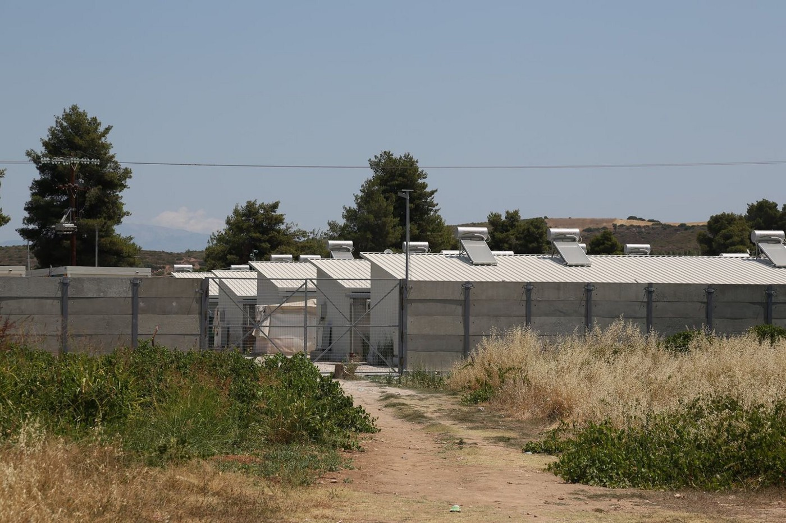
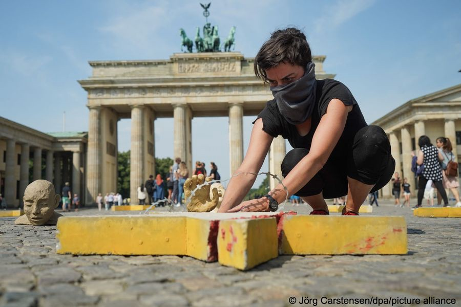
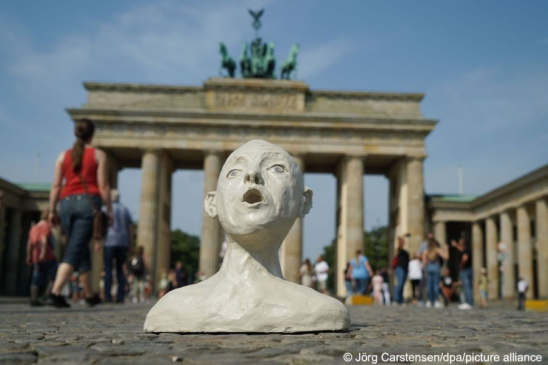

### AYS Daily Digest 27/7/21: A shocking complaint of an asylum seeker mistreated upon arrival to Greece
#### **Concrete wall around Ritsona completed//** European ombudsperson decided all EU\-mission have to provide transparency rules// SAR updates// Protests in Lithuania// Recommended reads and more news

](assets/6c8cb8762049/0*nnoW5xFG22vOCVgs)

Photo: [ROSA](https://www.facebook.com/RosaProgressive/?__cft__[0]=AZVy4NPTxX_WI07Y-8krJIADc8cORf6q8dyyi1UrXGNpE350khVG9ji3PHs4ZXfiObmmxerhwVBUrWwAGsiiCNDtdq_dGStS14dm8SGQ3QjUImUookvtOxHbBehhYcN2rIbz59H8BP_NEjOjHAoBUTZM&__tn__=-UC%2CP-R)
#### FEATURED

As the Greek investigation group Rosa has reported, a disabled transgender woman named only as T\. has tragically only experienced more trauma, after reaching Greek territory from Turkey:

> “The men in uniform who found her on the Greek side of the border, instead of following the procedures provided for by European legislation and the country’s commitments to international treaties, kidnapped her and hid her in the back of a truck…” 

The initiative \#Justice\_For\_T is calling for official answers from the responsible authorities, and demands justice for what has happened to her\.

#### AFGHANISTAN
### **UN report on civilian casulties rate in 2021**

A new report by UNAMA documented record levels of civilian casualties in the first half of 2021, including a particularly sharp increase in killings and injuries since May of this year, when international military forces began their withdrawal and the fighting intensified following the Taliban’s offensive\.

The UN warns that without a significant de\-escalation in violence, Afghanistan is on course for 2021 to witness the highest ever number of documented civilian casualties in a single year since UNAMA records began\.

[**UNAMA**](https://unama.unmissions.org/civilian-casualties-set-hit-unprecedented-highs-2021-unless-urgent-action-stem-violence-%E2%80%93-un-report?fbclid=IwAR1EK6JEoGBTbZW9k9UL_5RTLVNYDoCofaY_Q1eDqW9-ggIsnlxgwFtw1MA) **’s [Afghanistan Protection of Civilians in Armed Conflict Midyear Update 2021](https://unama.unmissions.org/sites/default/files/unama_poc_midyear_report_2021_26_july.pdf) documents 5,183 civilian casualties \(1,659 killed and 3,524 injured\), a 47 percent increase compared with the same period in 2020\.**

Much of the battlefield action during the most deadly months of May and June took place outside cities, in areas with comparatively low population levels\. The UN is gravely concerned that if intensive military action is undertaken in urban areas with high population densities, the consequences for Afghan civilians could be catastrophic\.

> “The pursuit of a military solution will only increase the suffering of the Afghan people,” the report says\. 

Since the US and NATO began their withdrawal from the country, the Taliban has moved quickly to consolidate battlefield victories, overtake rural districts, and secure strategic border crossings\.

While the Taliban have said they do not want to monopolize power, they have also said there will be no peace until the current government and Afghan President Ashraf Ghani are unseated\.

### **Germany is putting pressure on Afghanistan to accept upcoming deportation**

Meanwhile, Germany is putting pressure on the Afghan Ministry of Refugees and Repatriation to accept the upcoming deportation planned for 10th of August\.

_Weeks before_ national elections, the German ambassador met with the MORR authorities and pleaded with the Minister to allow the deportation to go ahead\. This follows a letter sent by the Afghan Ministry of Refugees and Repatriation to the European Union urging them to halt all deportations for at least 3 months given the deteriorating security situation and the resurgence of Covid\-19\.

> In contrast to Sweden, Finland and Norway, German and Austrian authorities are pushing ahead with deportations\. 

In the light of the horrifying UNAMA report, this news is particularly alarming\.
#### EU
### **Transparency now\!**

After last years’ complaint about the EU mission operation Sophia not providing information after being asked by the German invenstigation group FragDenStaat, the European ombudsperson has decided that all EU missions have to provide transparency rules\.

By now, most missions have implemented some kind of rules\. Those internal transparency rules are based on the [EU Freedom of Information Act](https://de.wikipedia.org/wiki/Verordnung_(EG)_1049/2001) \. The information that has to be published on a regular basis includes, for example, administrative concepts and training documents — although this [does not seem to work well](https://fragdenstaat.de/en/request/training-of-libyan-coastguard/#message-616317) in practice, FragDenStaat reports\.

_FragDenStaat is a German non\-profit organisation focusing on the right of freedom of information, providing investigations, lawsuits and a platform that is dedicated to provide an overview on and access to German and European authority landscape\. In the platform it is possible to submit requests to several authorities\._
#### SEARCH AND RESCUE

On Monday night, a boat left Libya with around 46 people onboard, and soon after called for help due to engine problems and supply issues\. Later the boat lost contact with the distress hotline organisation Alarm Phone\. Several civilian rescue ships were sent to find the boat\.

The Ocean Viking, a rescue ship operated by European charity [SOS Mediterranee](https://thecivilfleet.wordpress.com/tag/SOS-Mediterranee/) , searched all night and into the morning for the boat\. German NGO [Sea\-Watch](https://thecivilfleet.wordpress.com/tag/sea-watch/) also sent its reconnaissance plane Seabird to help find the boat\.

In the morning, the boat entered Malta’s SAR zone without the knowledge of the people searching for the boat\.

It wasn’t until this afternoon when Maltese media began publishing reports about the rescue that Alarm Phone, SOS Mediterranee and Sea\-Watch learnt the 46 were finally safe\.

“We don’t know exactly when the people were rescued,” Deanna of Alarm Phone said, “but AFM, as usual, didn’t inform anyone about a rescue operation\.”

This lack of communication by AFM \(Armed Forces of Malta\) is unacceptable\. It keeps the relatives in a state of stress, thinking that the worst has happened, and wastes unnecessary resources while other organisations and agencies continue to search for a boat that has already been rescued\.

> AFM does everything it can to sabotage civil fleet operations\. It would have taken nothing for them to just send an email to the Ocean Viking, to Seabird, and us\. This is clearly a political move and not just a small mistake or a lack of coordination\. It shows their willingness to hinder our work both by their actions and inaction\.” 

Shortly after leaving Burriania Port for Central Mediterranean, the Sea3 crew was threatened with arrest by the Libyan coastguard, as we reported yesterday\.

In [a recorded conversation between Sea Watch 3’s captain and the Libyans](https://twitter.com/seawatch_intl/status/1420001290374074371) , the ship was ordered to leave — or the coastguards will “take every available means to force you to leave… and you will be arrested\.”

[Sea\-Watch](https://thecivilfleet.wordpress.com/2021/02/19/sea-watch-3-finally-released-after-being-held-for-seven-months-for-absurd-reasons/) , the German organisation that operates the ship, insists it was in international waters and had every right to be there\. “They falsely claim to have jurisdiction over the Libyan search\-and rescue \(SAR\) zone, although it is just their area of responsibility to save lives,” the charity said

The Libyan coastguard is also currently supported by EU funds\. Earlier this month, Amnesty International added its vioce to the long list of organisations calling on the EU to end its support for the Libyan coastguards\.
#### GREECE
### Building with the purpose of fencing and detaining

**Concrete wall around Ritsona completed**

The construction of the three\-meter\-high concrete walls around Ritsona has been completed\. The wall is equipped with security cameras at the entry and exit points\.

More and more reception centres are being transformed into closed facilities under the guise of so called “moderization”\.

**How is the building of the new camp going?** 
Voila:

■■■■■■■■■■■■■■ 
> **[Franziska Grillmeier](https://twitter.com/f_grillmeier) @ Twitter Says:** 

> > There is nothing, but volcanic rocks, horses &amp; a fenced waste dump on the designated area where the new MPRIC (Multi-a purpose-Camp) on #Lesvos is supposed to be built by @[EU_Commission](https://twitter.com/EU_Commission) &amp; Greek authorities until March 2022. /1 https://t.co/SVCTW8q2zY 

> **Tweeted at [2021-07-27 12:55:18](https://twitter.com/f_grillmeier/status/1420004871252676642).** 

■■■■■■■■■■■■■■ 

In the familiar manner of criminalizing those who ask for help and refuge as well as those who are actually helping them, Greek police has launched a human\-trafficking [prosecution against non\-profits](https://www.pbs.org/newshour/show/greek-authorities-crackdown-on-critical-nonprofits-amid-backlash-for-refugee-pushback?fbclid=IwAR1f9zFSorDSWxIAh_4aNnxi9m0bidcFi-EAhdfhMAQPE1jDqcaqAIqsBVQ) that assist people trying to avoid pushbacks to Turkey\.

Currently, Greek authorities are pushing back people not only across the sea border, but also on the Evros River, a militarized zone dividing Greece from Turkey\.

Huda, a woman pushed back together with her family three times across the Evros river, reports:

> “They pushed us back in a very aggressive way\. On the way back to Turkey, we were ordered into a vote meant for just for three or four people\. They put 32 people in altogether with some Syrians that work with\. They put us all in the river and sent us back\. 

> They told us, two days before, someone fell in the water and died\. They said: “If you return here, you will have the same fate\.” 

Spyros Oikonomou of the Greek Council for Refugees states:

> “It’s the most blatant violation of international human rights law\. It actively places in danger, people’s lives and their rights\. I don’t really see anything being more dreadful\. And, in all honesty, it’s an international shame\.” 

Rather than responding to these shocking claims of rights violations, Greece is continuing the erection of a wall along the land border in the Evros region\.

Also in the familiar way, Greek Migration Minister Notis Mitarachi has recently justified these measures in an official [video](https://twitter.com/migrationgovgr/status/1414974809386233861?s=20) , citing a crackdown on “smuggling networks” that would use Greece as the “gateway to Europe”\.
#### ITALY
### **_115_ people _from the Lampedusa hotspot boarded the scheduled ferry_ to _Porto Empedocle_**

The initial reception centre on Lampedusa has a capacity of 250 people — at present, the camp hosts 555 people\. Yesterday, 150 people embarked on the quarantine ship Adriatico\. The [transfers continued](https://agrigento.gds.it/articoli/cronaca/2021/07/27/migranti-continuano-i-trasferimenti-da-lampedusa-ancora-555-allhotspot-8e5b7354-cc40-4a2f-a8cb-7f84b1531161/?fbclid=IwAR2jwvsQLe18AwT5jEm2HhQcwzaKJa6AJr6hb5nUHD_yslqvXymT_vo24KM) on the quarantine ship Azzurra in order to take off some of the pressure from the initial reception centre\.
#### FRANCE
### **Call for volunteers**

Between Utopia 56 Calais and Utopia 56 Grande\-Synthe, the teams are mobilised 24/7\.

The teams provide emergency aid to the thousands surviving on the French\-British border\. They are constantly looking for volunteers for a period of three weeks or more, reach out to them for more info: utopia56\.com
#### GERMANY
### Berlin wants to welcome

**Berlin wants to welcome 500 vulnerable people over the next five years, mainly Syrians and Iraqis, who have previously sought refuge in Lebanon**

On Monday, Berlin’s senat announced the “state federal reception decree Lebanon”\. According to the press release, the Berlin House of Representatives had already decided in late 2018 to develop a reception program that would provide humanitarian assistance to particularly vulnerable groups\. The program will take place outside the otherwise common asylum process, so the beneficiaries, selected prior to the transfer, will not have to apply for asylum in Germany after arrival\.

The selection process, which is currently being prepared, will be conducted by UNHCR in accordance with its [Refugee Status Determination](https://www.unhcr.org/refugee-status-determination.html) \(RSD\) rules\. Berlin’s state police will then conduct a security check with support from federal security agencies\. The first families are expected to arrive in Berlin later this year\.

Due to the people still located outside the European Union, transferring them would not interfere with the rules of the Dublin Regulation, it was reported\. The current situation in Lebanon is seeing many people driven into poverty and destitution, with the aftermath of the explosion in Beirut’s port last year, and the local currency losing about 90 percent of its value\.

In March, Amnesty International said that Lebanese security forces have committed [“shocking violations”](https://www.infomigrants.net/en/post/31079/syrian-refugees-tortured-by-lebanese-security-forces-amnesty) , including torture, against some Syrian refugees in Lebanon over the past 10 years\. Additionally, an arson attack at a Syrian refugee camp last December led to the [arrests of two Lebanese and six Syrian nationals](https://www.infomigrants.net/en/post/29329/eight-people-arrested-after-fire-at-lebanon-refugee-camp) \.

In April, Human Rights Watch accused the Lebanese government of [leaving refugees and migrants behind](https://www.infomigrants.net/en/post/31382/refugees-and-migrants-risk-being-left-behind-in-lebanon-vaccination-plan) in its coronavirus vaccination strategy\.

Last weekend, the installation “In\-Humanity\-EU” by Insa Pohlenga was on display in front of the Brandenburg gate in Berlin\. Twelve Concrete stars represented the EU borders, while twelve heads symbolized the suffering and the dying of people on the borders of EU, stated the artist\.

#### _LITHUANIA_
### **Protest against plans for a new camp**

Residents of the village of Rudnininkai in Lithuania protested on Monday against government plans to set up a new camp to accommodate up to 1,500 people on the move\. Several dozen people tried to block the road to prevent trucks carrying items for the camp from passing through\.

This happens in the context of more people arriving in Lithuania via Belarus\.

As Lithuania holds an external EU border, they want to amplify the border security, while the European Commission stated to be helping European countries to send support through the European Civil Protection Mechanism\.

Already 12 countries have offered support such as tents, beds and generators \(Croatia, the country with the longest land border with non EU countries, being among them\) \. The Commission coordinates the delivery and finances up to 75% of the costs for transporting the assistance\.

> “The authoritarian regime in Belarus is exploiting human beings for political reasons: this is completely unacceptable” — _EU Commissioner for Home Affairs Ylva Johansson\._ 

#### UK
### **Drone pictures of dinghies reveal the number of\- those who resorted to crossing the Channel**

More than 100 small dinghies have been shown in pictures taken by a drone, piled up in rows in a fenced\-off\-compound in the UK\. The images are evidence of perhaps thousands of people arriving in the UK in 2021\.

Despite the pledge from the Home Office to make the route across the Channel “unviable”, this year has seen record numbers of people on the move crossing into the UK\. At least 430 people crossed in a single day last week\. In July so far, it is estimated that more than 3,300 people have arrived in the UK in a new record for a single month, according to data analysis by the PA news agency\. Border Force was active in the Dover Strait again on Tuesday, but higher winds were set to make crossings difficult\.
#### GENERAL
### **Amnesty International demands that recently arrested Uyghur Idris Hasan must not be deported to China**

Idris Hasan, who was arrested after flying into Morocco from Turkey, where he has a permanent residency permit, has not been heard from since Friday\. Amnesty International [now demands](https://www.amnesty.org/en/latest/news/2021/07/morocco-authorities-must-not-deport-detained-uyghur-to-china/?fbclid=IwAR0EzuW_KAKxkagKBIEFcYQnLshgtnBkXDjh5tkbop1t3az1R7dVM5YMnLE) that he must not be deported to China\. The Chinese government reportedly considers Hasan a “terrorist”, because of the work he did for Uyghur organizations\.

Chinese law defines “terrorism” and “extremism” in an overly broad and vague manner, which has been used to crack down on Uyghurs and other ethnic minorities\.

Last month, Amnesty International published a report revealing how hundreds of thousands of Muslim men and women in China’s Xinjiang Uyghur Autonomous Region are being subjected to arbitrary mass detention, indoctrination, and torture\.

> “The Moroccan authorities must ensure Idris Hasan has immediate access to a lawyer, the ability to challenge any removal orders, and allow his family to contact him to ensure his safety,” _said Joanne Mariner, Amnesty International’s Crisis Response Programme Director_ \. 

> “Deporting Idris Hasan to China, where Uyghurs and other ethnic minorities are facing a horrifying campaign of mass internment, persecution and torture, would violate international law\. 

#### WORTH READING
- Our friends from the Centre for Peace Studies \(CMS\) published a pocket guide for courageous people\. It is a guide for human rights defenders who could lose sight of their own mental health while being focused on daily struggles\.

> “This guide is intended for you, and for us, the ones reacting; for you and for us who do not remain silent; for you and for us who take action in the moments when we feel social injustice\.” 

- This article tells the story of a young woman trying to reach Europe, having to stand the odyssey through Libyan detension centres, abuse, violence and ignorance:

- About the separation of families at the EU borders:

- Caoimhe Buttlery, a human rights campaigner, reports of the different situations of people fleeing wars and violence, on the occasion of the discovery of a ship that sank off the coast of Lampedusa in 2013\.

- The Migration and \(Im\)mobility Magazine “Routed” has published a list of books, films, series and a playlist about migration and mobility\.

_Converted [Medium Post](https://medium.com/are-you-syrious/ays-daily-digest-27-7-21-a-shocking-complaint-of-an-asylum-seeker-mistreated-upon-arrival-to-6c8cb8762049) by [ZMediumToMarkdown](https://github.com/ZhgChgLi/ZMediumToMarkdown)._
