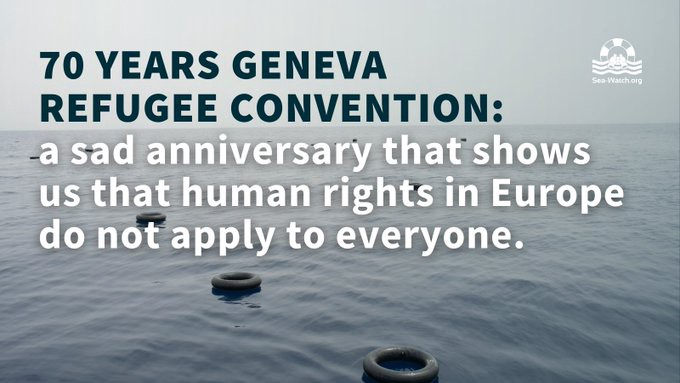
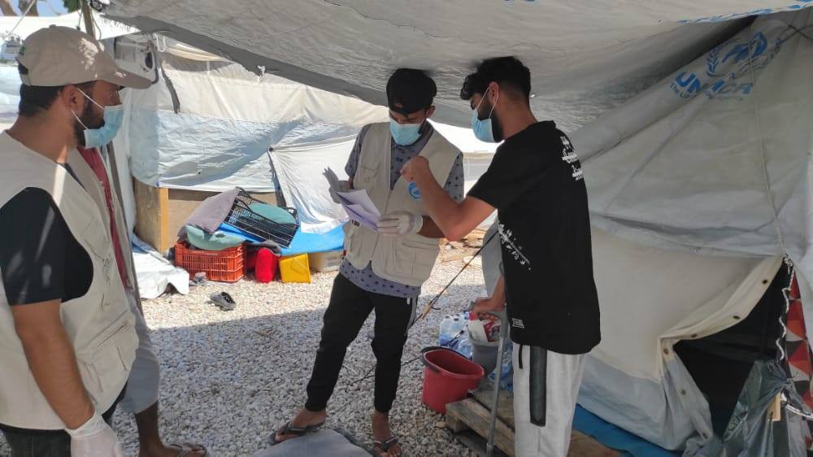
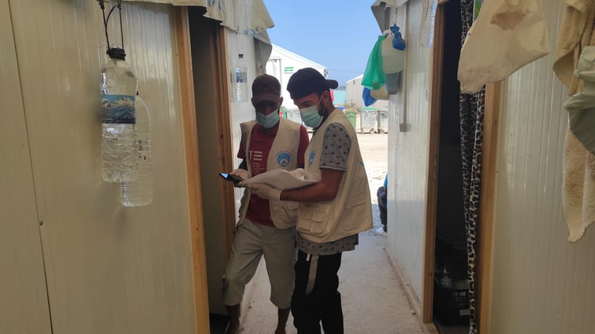

### AYS Daily Digest 28/07/2021: No happy Anniversary for the Geneva Refugee Convention

Copyright: Sea Watch International

70 years ago, on the 28th of July in 1951, the [Geneva Refugee Convention was written and implemented](https://www.unhcr.org/uk/about-us/background/4ec262df9/1951-convention-relating-status-refugees-its-1967-protocol.html) \. In the years after the Second World War, the world was quite aware about the pain and despair closed borders mean for people who flee their homes\. Aware, that in many cases, closed borders mean certain death\. Aware that no prejudice or hate or racism in the world should justify to deny a person the right to find safety\. 

That is why the Geneva Refugee Convention spells out the key obligations of states towards refugees\. It defines who is a refugee and which legal and social rights that person has\. The Convention and the amending Protocol from 1967 have been signed by 143\. While the convention initially aimed mainly at protecting refugees within Europe after WWII, the Protocol from 1967 lifted all temporary and geographical restrictions\. However, not all signatories signed both treaties — Turkey for example still holds on to the geographical restrictions of only protecting people who flee events occurring in Europe \( [but has other laws in place for people from other parts of the world](https://asylumineurope.org/reports/country/turkey/introduction-asylum-context-turkey/) \) \.

There is probably a lot to criticise about the Convention itself\. It surely does not account for newer reasons of why people have to flee their country, as for example caused by climate change\. It does not account enough for the specific ways of discrimination especially non\-white people face when fleeing their homes\. And in the end it sticks to the idea of national states and separates people into refugees and migrants and grants protection only for refugees\. 
And yet it is the best international treaty we have in this field, and not even this is being respected in today’s Europe\.

Let’s just look into two specific rights: 
The key element of the convention is the **non\-refoulement principle** , which states that a refugee should not be returned to a country where he or she faces serious threats to his or her life or freedom \(Article 33\) \. 
Not only are pushbacks a daily practice in Europe these days\. By declaring certain countries as so\-called “safe countries”, European states routinely circumvent the obligation to insure this right\. Countries like Germany and Austria also still conduct deportations to Afghanistan, a country that has been labelled the least save country in the world 2021, [according to the Global Peace Index\.](https://www.visionofhumanity.org/maps/#/) 

Another right is the one not to be punished for illegal entry into the territory of a contracting State \(Article 31\) \.

Just these days, the [new migration bill is being implemented in the UK](https://www.voanews.com/europe/illegal-migrants-people-smugglers-face-tougher-new-penalties-britain) \. It will provide for punishment of up to four years for people who enter the country illegally\. Also Greece has a history of punishing people for illegal entry\. [A woman who arrived to Greece in March 2020 was sentenced to a four\-years term\.](https://balkaninsight.com/2021/07/28/death-by-a-thousand-derogations-the-geneva-refugee-convention-and-the-eu/?fbclid=IwAR2suqijmmiWMiYqRK7DGL3c5l1r3-hl4PleJF_bBo9QLDy4EfqO32bg1MI)

We could probably find broad scale violations for each right ensured in the Convention, but that would burst the bounds of the feature\. We will instead just name the most important rights:

• The right to work \(Articles 17 to 19\);
• The right to housing \(Article 21\);
• The right to education \(Article 22\);
• The right to public relief and assistance \(Article 23\);
• The right to freedom of religion \(Article 4\);
• The right to access the courts \(Article 16\);
• The right to freedom of movement within the territory \(Article 26\); and
• The right to be issued identity and travel documents \(Articles 27 and 28\)

Further Readings:

### ETHIOPIA

The UN World Food Programme chief is calling for supply trucks to be allowed to deliver food to thousands of refugees in Tigray, saying current rations will run out on Friday\.

### TURKEY
#### Number of arrivals remains high

The number of people who are fleeing the arriving Taliban forces in Afghanistan is rising\. Many of them try to make their way into Turkey via Iran\. While the governor of Turkey’s eastern Van province said the region would reinforce its eastern border with Iran with a wall, the mayor of the city of Bolu threatened to implement discriminatory laws against refugees in order to prevent them from coming to the city\. [Investigations have been launched by the cities Prosecutor’s office](https://stockholmcf.org/investigation-launched-into-turkish-mayor-for-targeting-refugees/?fbclid=IwAR1pAxNtBfe7dSJ6Px2q9EbN9WJ3cfz6aDaNEQ4xTsAacFCqGaHhmZLuAtk) \.

For more on the situation, see:

### GREECE

What Notis Mitarachi, Greek Minister for Migration and Asylum has to say on the 70th Anniversary of the Geneva Refugee Convention:

■■■■■■■■■■■■■■ 
> **[Νότης Μηταράκης - Notis Mitarachi](https://twitter.com/nmitarakis) @ Twitter Says:** 

> > #Greece🇬🇷 has this morning asked #Turkey🇹🇷,through the #EU,to accept the return of 1908 illegal migrants in accordance with the EU-Turkey Joint Declaration of 2016.We expect Turkey to honour its obligations,which it has regrettably ignored for the last 17 months. @[EU_Commission](https://twitter.com/EU_Commission) 

> **Tweeted at [2021-07-28 12:46:58](https://twitter.com/nmitarakis/status/1420365160426901507).** 

■■■■■■■■■■■■■■ 

#### Heat wave to come to Greece

While thousands of people live in tents or containers in camps throughout Greece, a new heat wave is expected to reach the country in the next days\.

■■■■■■■■■■■■■■ 
> **[Franziska Grillmeier](https://twitter.com/f_grillmeier) @ Twitter Says:** 

> > Auf #Lesbos herrscht zurzeit eine der längsten Hitzewellen der letzten 35 Jahre. Bürger:innen wird empfohlen, im Schatten zu bleiben &amp; Klimaanlagen zu benutzen. 
Die 4,200 Geflüchteten in #Mavrovouni bleiben durch ~ 320 Polizist:innen kontrolliert, in aufgeheizten Zelten zurück. 

> **Tweeted at [2021-07-28 08:56:40](https://twitter.com/f_grillmeier/status/1420307205149048839).** 

■■■■■■■■■■■■■■ 

#### Moria White Helmets help with vaccination campaign

The Moria White Helmets help the camp management in Moria 2\.0 with the vaccination campaing by visiting people and informing them about their appointment\.

Copyright: White Helmets Moria
#### Audio\-Weapons in Evros region

This long\-read speaks about the history of audio weapons, as they are now being tested for use in the Evros border region:

#### SERBIA

NoNameKitchen started a funding campaign that includes informative and touching videos of the situation on the ground\. Check out the campaign here and see the [videos on their facebook page](https://www.facebook.com/NoNameKitchenBelgrade/posts/1285828045148810) \!
#### ITALY

The right wing League Party in Italy proposed the construction of a detention and repatriation center in Ventimiglia, on the border with France\. People try to cross from Italy to France in this area and often experience violent pushbacks\.
Apparently the mayor of Ventimiglia agreed to the idea\. 
For more information, see:

### SEA

Maltese military rescued 37 people on Wednesday morning, [according to media\.](https://www.nau.ch/news/europa/maltas-militar-rettet-bootsmigranten-aus-seenot-65972466?fbclid=IwAR0Y7lASDB8Vrvpqk8sYfvPl7bdzuCuB80BfgGe14lL88A9Vok8eXcIiDBE)

> At least 94 people have disappeared in the central Mediterranean these past two weeks 

According to SOS Mediterranee\. In their news update, they inform about the rescue ships on mission, conducted rescues, interceptions of Libyan Coast Guards and criminalization strategies against NGOs by the EU\. 
See here:

#### NETHERLANDS

According to a ruling by the Council of State in the Netherlands, people who apply for asylum even though they already have residence permits for Greece cannot easily be send back, as the conditions they might end up in Greece are often degrading\.

### RECOMMENDED READING

■■■■■■■■■■■■■■ 
> **[Transnational Institute](https://twitter.com/TNInstitute) @ Twitter Says:** 

> > 🚨70 years after the UN 1951 Refugee Convention was adopted, Europe now looks to profit from the displaced. Our new research reveals how the highly lucrative arms trade is fuelling displacement and migration. 
👉Read the full report: [tni.org/smokingguns](http://tni.org/smokingguns) https://t.co/fEXqnbZcAN 

> **Tweeted at [2021-07-28 07:28:20](https://twitter.com/tninstitute/status/1420284976398995456).** 

■■■■■■■■■■■■■■ 

The transnational institute conducted a research on the connection of European arm export and the situation of refugees\. Find the key findings here:

**Find daily updates and special reports on our [Medium page](https://medium.com/are-you-syrious) \.**

**If you wish to contribute, either by writing a report or a story, or by joining the info gathering team, please let us know\.**

**We strive to echo correct news from the ground through collaboration and fairness\. Every effort has been made to credit organisations and individuals with regard to the supply of information, video, and photo material \(in cases where the source wanted to be accredited\) \. Please notify us regarding corrections\.**

**If there’s anything you want to share or comment, contact us through Facebook, Twitter or write to: areyousyrious@gmail\.com**

_Converted [Medium Post](https://medium.com/are-you-syrious/ays-daily-digest-28-07-2021-no-happy-anniversary-for-the-geneva-refugee-convention-89977904d3b0) by [ZMediumToMarkdown](https://github.com/ZhgChgLi/ZMediumToMarkdown)._
