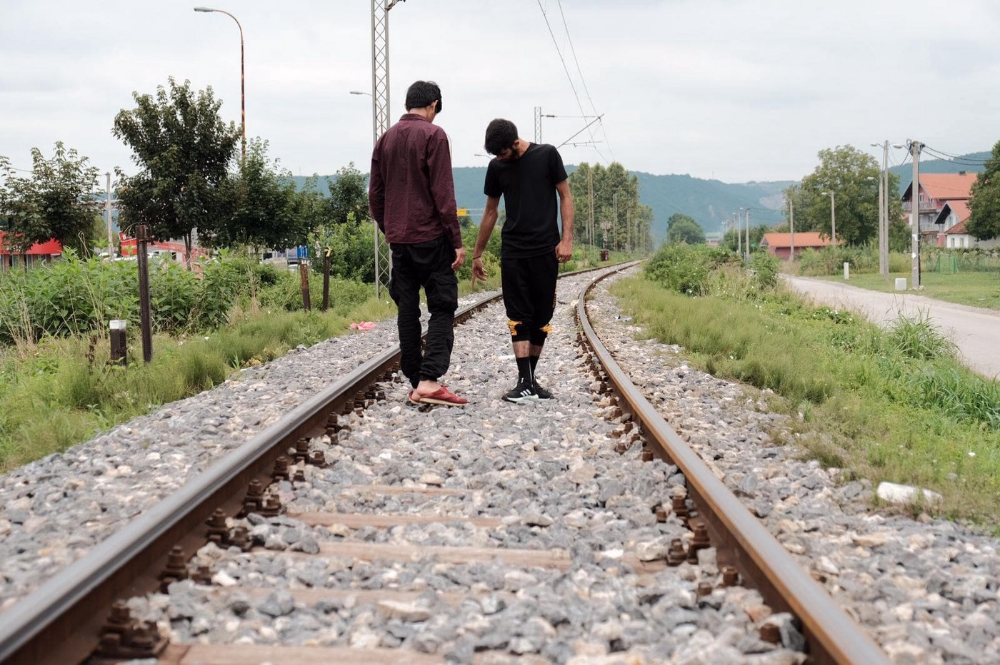
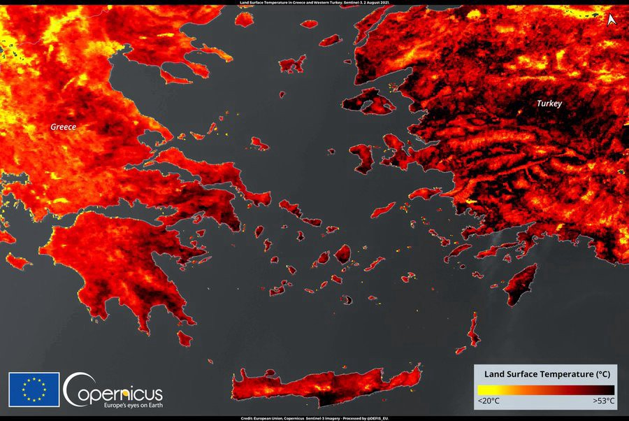
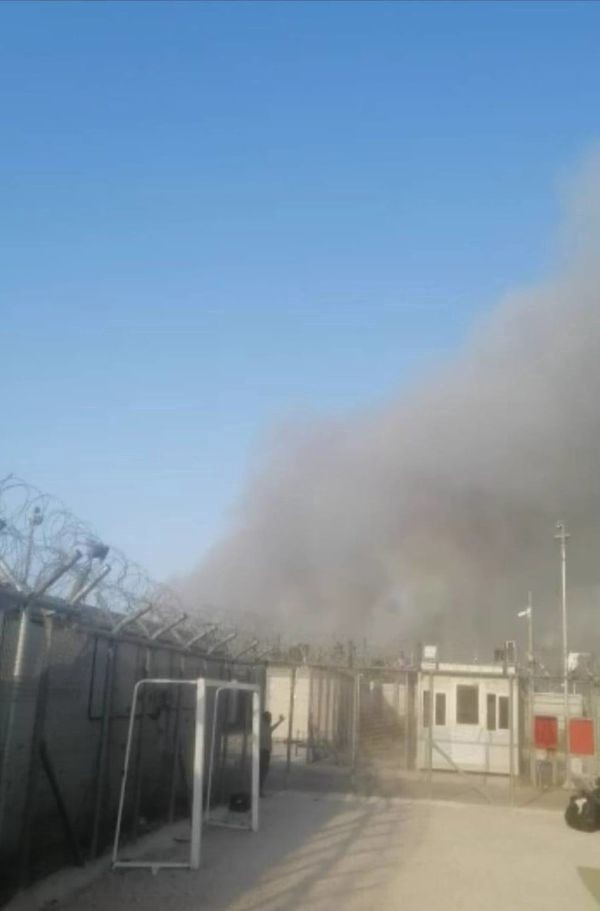
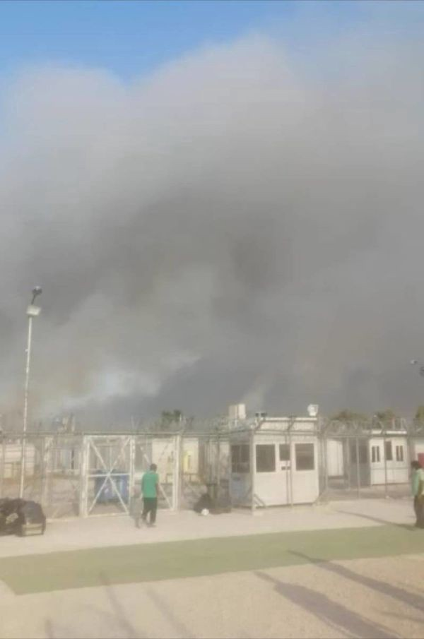
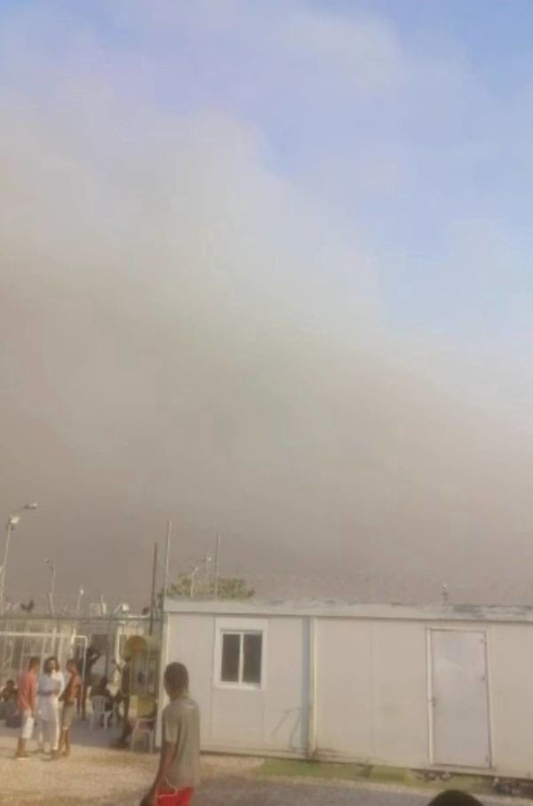
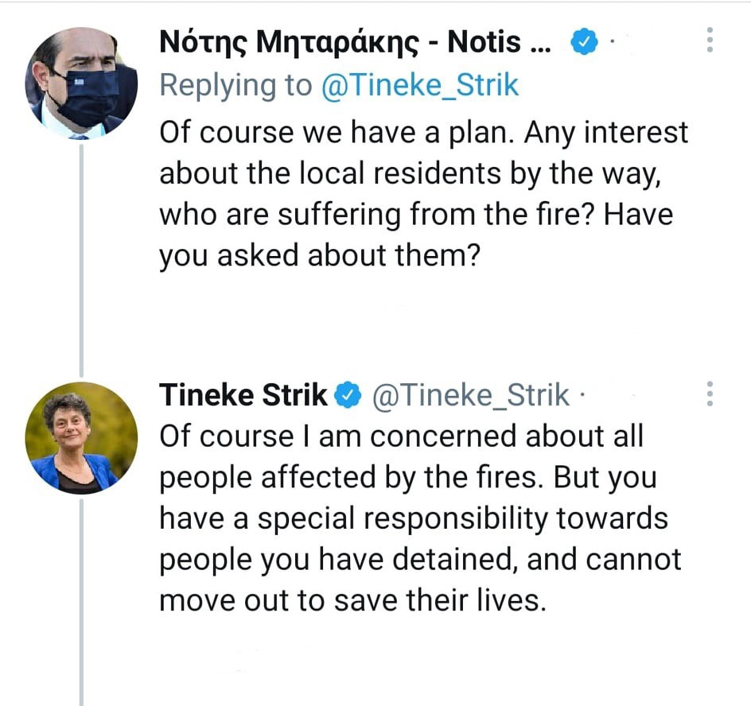

### AYS Daily Digest 3/8/21: Croatia’s planned border monitoring falls short of the standards needed to ensure its effectiveness and success
### Effective mechanism needed: independent, broad mandate, adequate resources / Greek ombudsman calls for release of 19 persons who are unlawfully detained in the pre\-removal detention centre on Kos / News from the Mediterranean / Press statement on Denmark’s Alien Act provision to externalize asylum procedures to third countries / Wildfires threaten lives — what will happen to people in detention centres / News and calls for support

[Are You Syrious?](?source=post_page-----98c76d31fcba--------------------------------)

[Aug 4](ays-daily-digest-3-8-21-croatias-planned-border-monitoring-falls-short-of-the-standards-needed-to-98c76d31fcba?source=post_page-----98c76d31fcba--------------------------------) · 12 min read

### FEATURE

Croatia’s recently announced border monitoring mechanism, meant to provide for independent human rights monitoring of border operations, appears to fall short of the standards needed to ensure its effectiveness and success, eight human rights and humanitarian aid organizations said today\.

Any border monitoring mechanism should be independent in law and practice and have sufficient resources and a robust mandate to monitor border\-related operations anywhere on the territory of a state\. It should be capable of ensuring that all documented human rights violations are promptly and thoroughly investigated and of effectively pursuing accountability for those responsible for violations and access to justice for anyone whose rights are violated\.

Official statements about the newly established border monitoring mechanism in Croatia raise serious concerns, particularly with respect to the mandate, effectiveness, and independence of the body\. The Croatian government announced that the negotiations on the mechanism have concluded, but **has not publicly disclosed further details about its structure or functioning\.**

The mechanism’s mandate would be limited to police stations around the border, border crossing points, and detention centers\. As the vast majority of documented unlawful practices take place outside Croatia’s official border crossings, police facilities, or formal procedures, and deep inside the country’s territory, any geographic or procedural limitations on border monitoring would create blind spots and enable violations to continue\.

**Recent guidance from the Council of Europe’s Committee for the Prevention of Torture makes clear that effective human rights border monitoring requires unfettered access to border areas without notice, to relevant documentation, and to alleged victims of violations\. It also requires the authority to engage directly with prosecutors’ offices and others with information relevant to its investigations, including international organizations, civil society, and the media\.**

Investigating violations of fundamental rights by police, border guards, or other government actors is politically sensitive\. To ensure that the mechanism is credible and effective, it needs to involve independent institutions or organizations that have monitoring experience — such as civil society organizations, United Nations agencies, and national human rights institutions — that are not financially dependent on the government\.

> _Any agreement on a national mechanism in Croatia that does not align with this standard and best practices would set a negative precedent for future border monitoring mechanisms and seriously undermine the commitment of the European Commission to put an end to violations on its external borders\._ 

Given the serious abuses at the Croatian border widely documented by human rights organizations and the media, and the precedent the Croatian border monitoring mechanism could set for other European Union member states, it is critical that the European Commission ensures that it can truly serve as a model for respecing human rights at national borders\. The commisison should actively **review and assess the mechanism** to ensure that Croatian authorities put in place a system that can credibly monitor compliance with EU law in border operations and should provide political and financial support only to a system that meets the above standards\.

Furthermore, Croatian authorities should without delay release the relevant parts of the cooperation agreement containing the details about the structure and the functioning of the independent monitoring mechanism and **allow the necessary public debate on this important process** \.

The commission should also press Croatia to end its violations of fundamental rights at its borders, and provide **solid evidence of thorough investigations** of allegations of collective returns and violence against migrants and asylum seekers at its borders\.

The UN special rapporteur on the human rights of migrants, the Fundamental Rights Agency, the Council of Europe commissioner for human rights, and the Parliamentary Assembly of the Council of Europe have all raised concerns about the situation at the border between Croatia and Bosnia and Herzegovina\. Croatian authorities have denied allegations of violent pushbacks and failed to take credible steps to halt the practice\.

The European Commission first called on Croatia to establish a border monitoring mechanism in 2018\. In October 2020, the European Commission proposed as part of its Pact on Migration and Asylum the establishment of independent border monitoring mechanisms \(IBMM\) by EU member states to investigate allegations of fundamental rights violations at borders\.

Signatories:

Amnesty International

Are You Syrious

Centre for Peace Studies \(CMS\)

Danish Refugee Council

Human Rights Watch

International Rescue Committee

Refugee Rights Europe

Save the Children
### WEATHER WARNING
### Eastern Mediterranean in an intense heatwave

Greece is facing the most extreme temperatures since 1987 and Turkey is affected by severe and so far deadly wildfires\.
The Land Surface Temperature shows peaks at 53°C\.

Temperatures are expected to remain high for most of the week and it is essential that all people on the move are aware of the severity of the situation, the wide area that is affected by the temperatures and their possible consequences\.

As hot weather edged southward, Italy and Croatia were experiencing storms as well as wildfires\. A small tornado in Istria, on Croatia’s northern Adriatic coast, toppled trees that destroyed several cars, hours before a large wildfire erupted outside the nearby resort of Trogir, threatening homes and the local power supply, AP r [eported](https://apnews.com/article/europe-middle-east-environment-and-nature-4063e18f2dabe137b09a5727e28005aa?fbclid=IwAR2IMt-G_qRMuOpnNW18IVdmmGW7UcB9CTGhvNjd9zAvN73pANJ8VXZvxiY) \.
### THE MEDITERRANEAN

The [Malta\-based charity rescue ship _Nadir_](https://timesofmalta.com/articles/view/ngo-crew-sets-up-base-in-gozo.882652) provided over 700 people with first aid over the last 72 hours of the SAR action, it is [reported](https://timesofmalta.com/articles/view/boat-of-asylum-seekers-two-seriously-ill-migrants-brought-to-malta.891076?fbclid=IwAR1z937GQTfVzKpqqgqYqV-OakXT7yU4omGYXYW2c_gF0O7UGNFDuKjl-VU) \. The condition of some of the people they had encountered was critical\.

> _Hundreds of people were left alone\. The European authorities, including the Maltese authorities did nothing\. We contacted them for hours and got no support, people were just left there_ 

### Port of safety urgently needed for the exhausted, injured and traumatized people

MSF’s vessel Geo Barents is once again patrolling the waters of the central Mediterranean after the Italian coastguard released the vessel from the Sicilian port of Augusta\.

In the meantime, people continue finding ways to leave for the EU\. 
The Moroccan Authorities have intercepted more groups of people trying to reach Ceuta by swimming, while others have reportedly arrived on the Spanish coast from Souani Beach by jet ski\.

The Spanish SAR team of Open Arms will be back:
### EU
### Non\-EU citizens traveling to the Schengen area will have to obtain an authorisation before traveling

New rules on the European Travel Information and Authorisation System \(ETIAS\), which will become operational in 2022, enter into force today:
### GREECE
### Greek ombudsman calls for release of 19 persons who are unlawfully detained in the pre\-removal detention centre on Kos

> _The island of Kos hosts the last pre\-removal detention centre on the Aegean Islands\. Almost all persons arriving on Kos will be detained\. Many for more than one year\. Most of the persons — at the moment — are detained to “prepare their removal”\. However, a removal will not take place — Turkey has not taken anyone back for 17 months\. The Greek ombudsman has now confirmed in 19 cases that this detention is without any legal basis and hence unlawful\. The Greek government is now asked to reassess the detention orders and the persons concerned must be released\._ 

[Find the full Press Release here\.](https://equal-rights.org/site/assets/files/1304/210804_press_release_kos_ombudsman-2.pdf) 
[Find the full Opinion of the Greek Ombudsman here\.](https://equal-rights.org/site/assets/files/1304/210730_ombudsman_detention_kos-anonym.pdf)
### Criminalization of migration

While Greece says [Turkey endangered people on the move in the Aegean accident](https://l.facebook.com/l.php?u=http%3A%2F%2Fdlvr.it%2FS4ygHZ%3Ffbclid%3DIwAR3n_U-L57Tr6dlmXUZuCO-6O6GorWEVhM2-hx6RAwr6N_hnPrPD_Balexk&h=AT1imIuEK2CTgw6zU_0izojRyscOq5YLMgmL2qb83gvJDL-_pv9PJxz4jV2iQeCTuVNVyXsiGFVDNt5wHV-Ipr6kVYA5Ec8pfFe2XRf4DdFzl6zMQRj29wHMypL2k7g-mFs0JEodOr4KdIQ_ww3VlqpjPjw9wA&__tn__=R]-R&c[0]=AT2K9mImE3XR2qCHK0_2qX6ZyowXbh6gMaS4PdbTNuj8TJKqWu4juhnZjqQbWZssdYwCJF3e3BIX67dTcHhzbNhC1D0qc062I-_qt2E9odbZ7Wj1u7c7lbEJBGh0SsSsrb21puAYTgi2IH7EYOZhff4aTsCx_GLi_mByM3utxYyzqg885NV3jgehF_f4Y89zltZ3hddc5iw) , MEPs submitted a [written question](https://www.europarl.europa.eu/doceo/document/E-9-2021-003513_EN.pdf) to the EU Commission regarding the verdict of Mohamad H\. and the criminalisation of migrants:

> _On 25 June 2021, The New York Times published an article entitled ‘He Saved 31 People at Sea\. Then Got a 142\-Year Prison Sentence’\. It described how Hanad Abdi Mohammad took the wheel of a boat with 33 people crossing from Turkey to Greece and steered it to safety\. For this, he received a 142\-year sentence for people smuggling, of which he will serve 20 years, the maximum allowed under Greece’s criminal code\. The article reports the growing trend in Greece towards convicting asylum seekers who take the wheel after people smugglers abandon the boat, as a deterrence and intimidation strategy\. The NGO Border Monitoring has identified at least 48 such cases in Chios and Lesbos alone\. This has been compounded by the criminalisation of irregular entry in 2020, when dozens of migrants at the GreekTurkish land border received prison terms instead of being taken to reception centres for identification\. Convicting refugees as people smugglers contravenes EU legislation on asylum, which grants refugees the right to seek asylum\. How will the Commission ensure Greece’s compliance with EU and international law in such cases?_ 

### Wildfires: what will happen to the people in detention centres and camps?

Photos: [Viktoria Solidarity](https://www.facebook.com/ViktoriaSolidarity/?__cft__[0]=AZUS-s5RHI6ThH2gcMPR1MfsccwQ5ffR5vXo_9UyqK0R83SUrasme2G-0qJpkrd5m07RrQCDjOdrfiAiOaLrLbyJS4Hm_lTN2Q23meBcw0Is6pwF6OPsiP57RbgzJhnmMp7RfAVfWtbTQBfSB5iDamph&__tn__=-UC%2CP-R)

The situation has gotten worse throughout the evening and whilst residential houses in the area are being evacuated, in the prison of Amydgaleza no similar procedure has started yet, activists reported earlier in the day and afterwards, in the late afternoon, it was reported that things have calmed down\. Reportedly, homes in the area were being evacuated, but no evacuation had been started in the centre\.

An answer that needs no comment came from Greece’s Minister for Migration and Asylum as a reaction to concerns over what will happen to people deprived of free movement, particularly the question coming from MEP Tineke Strik:

In the meantime, across other camps, people are also suffering under these conditions, especially given the poor infrastructure and insufficient support\. [Seebrücke International](https://twitter.com/Seebruecke_intl) team wrote about the conditions on Lesvos:

> _In the refugee camps on the mainland and the islands in the Aegean Sea, the heat is becoming a danger to life for many\. The nylon tents sometimes heat up to more than 50° C and can no longer be entered as early as in the morning\._ 
 

> _Outside, however, there is little shade, especially in KaraTepe, & the supply of drinking water remains inadequate\. Whether heavy rain, storms, heat or freezing temperatures, refugees forced to live in the EU camps are often almost defenceless against the weather\. The catastrophic medical care & the precarious infrastructure increase the danger that the camps become death traps\. This situation has been pointed out for years and the people affected protest vehemently\. The EU and its member states, however, react as usual with indifference\._ 

Frontex remains present in the Aegean:

Greece and the EU are currently building new refugee camps on five islands, located on the border with Turkey\. In Leros, NGOs and local authorities are denouncing the construction of a new prison, for 26 Mil\. Euro, media [report](https://t.co/zLyik17PJu?amp=1) \.
### Declining social welfare and care for children from vulnerable groups

There are currently many families whose parents are unemployed or unable to work \(many of them single parents\) who have little or no state support\. All relevant services are understaffed and aid does not reach those who need it most\. Raising children who are homeless, malnourished, left without care and education\. The situation is tragic, especially for people who do not speak Greek\. In the “doom” that is happening now, we need to prioritize the support of children and their families\. Some of the parents who are under international protection in Greece, with asylum, have been waiting for more than a year to receive social welfare support\.

> _I am currently talking to moms with babies who have a great need to work and who need to be supported until they stand up straight \(Athens, Ioannina, Chios\) \. If anyone wants to help either by offering a job or money, food or some other way, they can contact me with a message, writes [Georgia Fragaki](https://www.facebook.com/groups/1508309029486384/user/100001655583324/) \._ 

### SERBIA
### Injuries that tell the truth

There are more injuries reported during attempts to cross the border fence with Hungary, and due to the violence of the Hungarian police and army forces\. A Syrian with whom APC spoke in the Subotica area described how he had fallen off a fence, was then beaten and kicked by the police, only to finally be pushed back to Serbia with multiple fractures and contusions, the team reported\.
### FRANCE
### Donations for medical teams urgently needed in the north

[First Aid Support Team — FAST](https://www.facebook.com/FASTFirstAidSupportTeam/?__cft__[0]=AZUIIkQW4GHwQJXrERNL6V3PnKbxSIbCCXcJIVT1-04vXGnRzrKJ9fHRrqhnaW4Nfaqfwz6FaWZX3V-F3v647d1ICLovNZYyW6BZeWZhXHmldARorU2uJer6Q-weZSGhhfP0JbptP1FpKzvslEdsdDLwmQ6mRe4HS-l3idwrss7OkA&__tn__=kC%2CP-y-R) is asking for donations:

> _We do not have enough money to buy first aid supplies to meet this new increase\. We FIRMLY believe that EVERYONE has the RIGHT to ACCESS HEALTHCARE\. Please help us continue to support displaced people in Northern France\. We would be grateful if you could donate whatever you can and to share this appeal with as many people as possible\._ 
 

> _To donate please click on the link on this post or visit our website_ 

> [_https://www\.f\-a\-s\-t\.eu/donate\-fast/_](https://www.f-a-s-t.eu/donate-fast/?fbclid=IwAR0O2UibkWSjEbB_e7fn8D-m-4F4mpKHr3w2UvYV1PO2EhI5KmL-dAH_wFk) 

### GERMANY
### Cancelled deportation to Afghanistan

As we reported in yesterday’s [News Digest](ays-daily-digest-2-8-21-european-court-for-human-rights-decides-against-austrias-deportation-to-117acc7bd16c) , the ECfHR decided to stop a deportation from Austria to Afghanistan\. Afterwards, the initially joint deportation charter flight to Afghanistan from Munich to Kabul was also cancelled\. At the time of writing this, the [official reasons for the cancellation were not yet clear,](https://l.facebook.com/l.php?u=https%3A%2F%2Fwww.rnd.de%2Fpolitik%2Fafghanistan-abschiebung-ueberraschend-abgesagt-was-ist-der-grund-GOWAXF7ILDEJJ5YSZSAPSBRYQU.html%3Ffbclid%3DIwAR3KuemUI-uUWWW0JZYx_kfvWk-X9l168pLVEjsfioEuCJicGLy6knbAvw4&h=AT3Fr5MOwwFq0eS_fxeBL1Gzl_4OYQSdsS9SnLyxcvugocp8cbJ6P_WF2ry7yySCwK0x_tCr9qO0Imlidp3M5jI1RRliE32AbXsa3fGpTYdxdKiP1GrQcVbViAX31llck7s-90MIQZPppA&__tn__=R]-R&c[0]=AT2PXpd7INH5st_LG_N3_3w_ZCiH46J97zqssQ-LpkkIFX65vmcl5BoxTwZr7aegqDMn7BrsRTjUkrCnfMh3cVy7QPr8HQWhrdVj2N7_LDEImIhP_lJAdse_3J57q2uyI9O8dJ0x7_y5i7uacnYQNP0IYVe6N3tueN9JG12CKxESXLTUZmrrYPQzkvUqU73M73ORV1OfEg0) although explosions in the capital Kabul were reported on Tuesday and the Taliban are bringing ever larger parts of the country under their control\. That, however, did not stop the two countries, Germany and Austria, from continuing deportations up until now\. It is also important to recall that the temporary injunction in the above\-mentioned case does not constitute a complete ban on deportations to Afghanistan, but perhaps it has opened up a different view on the matter also with the German officials\.
### DENMARK
### The African Union condemns in the strongest terms possible, Denmark’s Aliens Act

Claiming that the law effectively externalizes and exports the asylum process beyond the borders of Demark, The African Union has condemned Denmark’s Aliens Act\. In their [press release](https://au.int/en/pressreleases/20210802/press-statement-denmarks-alien-act-provision-externalize-asylum-procedures?fbclid=IwAR3vbXkEimHb2xlZyKpoaK0__fzyQyGq3iC8YI2HACPGHRY6GOd2HtqK69U) , they state that Denmark’s decision to send applications for international protection outside its borders amounts to responsibility and burden shifting\.

> _The African Union views this law with the gravest of concerns and wishes to remind Denmark of its responsibility towards international protection for persons in need of that protection as provided for in the 1951 UN Convention on refugees, to which Denmark is a state party\._ 

> _Africa has a lot to show to the world as it continues to generously shoulder the burden of the world’s 85% of the refugees, often in protracted situations, whereas only 15% are hosted by developed countries\._ 
 

> _In addition, the African Union notes with great concern attempts and proposals to establish similar arrangements in Africa through bilateral arrangements, which is worrying and unacceptable\. The African Union perceives such attempts as an extension of the borders of such countries and an extension of their control to the African shores\. Such attempts to stem out migration from Africa to Europe is xenophobic and completely unacceptable\._ 

> _We call on all State Parties to the 1951 UN Convention to remain true and faithful to their commitment and obligations to the international asylum system and encourage them to protect the asylum space and stop intolerance and shunning of responsibility especially over migrants and asylum seekers from outside Europe\._ 

### WORTH READING
- A reminder — Guilty of Solidarity: the Iuventa Case

### [Guilty of Solidarity \|The Iuventa Case](https://www.amnesty.org/en/latest/campaigns/2021/08/iuventa/)
### [If it’s a crime to rescue people from distress, then I plead guilty\. Guilty of solidarity\. Dariush In just one week in…](https://www.amnesty.org/en/latest/campaigns/2021/08/iuventa/)

[www\.amnesty\.org](https://www.amnesty.org/en/latest/campaigns/2021/08/iuventa/)
- The US says it will take on thousands more refugees as the security situation continues to deteriorate in Afghanistan\.

### [US expands eligibility criteria for Afghan refugees](https://www.infomigrants.net/en/post/34070/us-expands-eligibility-criteria-for-afghan-refugees)
### [The US says it will take on thousands more refugees as the security situation continues to deteriorate in Afghanistan…](https://www.infomigrants.net/en/post/34070/us-expands-eligibility-criteria-for-afghan-refugees)

[www\.infomigrants\.net](https://www.infomigrants.net/en/post/34070/us-expands-eligibility-criteria-for-afghan-refugees)

**Find daily updates and special reports on our [Medium page](https://medium.com/are-you-syrious) \.**

**If you wish to contribute, either by writing a report or a story, or by joining the info gathering team, please let us know\.**

**We strive to echo correct news from the ground through collaboration and fairness\. Every effort has been made to credit organisations and individuals with regard to the supply of information, video, and photo material \(in cases where the source wanted to be accredited\) \. Please notify us regarding corrections\.**

**If there’s anything you want to share or comment, contact us through Facebook, Twitter or write to: areyousyrious@gmail\.com**

_Converted [Medium Post](https://medium.com/are-you-syrious/ays-daily-digest-3-8-21-croatias-planned-border-monitoring-falls-short-of-the-standards-needed-to-2521e3b878e2) by [ZMediumToMarkdown](https://github.com/ZhgChgLi/ZMediumToMarkdown)._
