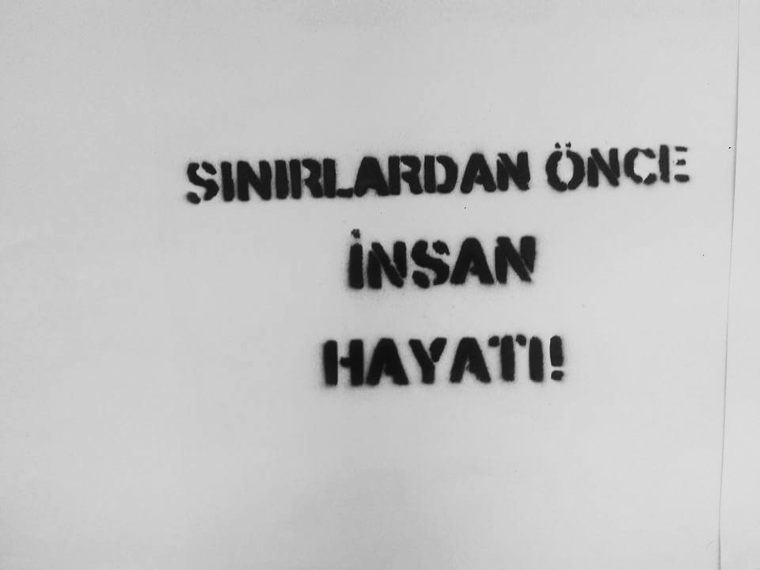
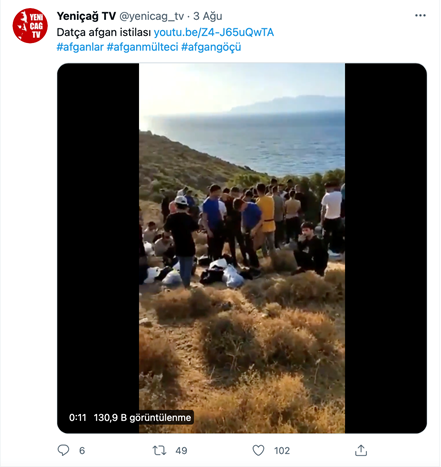
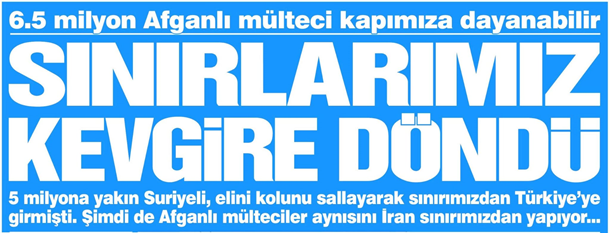

### **AYS Special from Turkey: Increasing Hate Speech Towards Refugees**

_Immigration, which has been on Turkey’s agenda since 2011, is being discussed once again with the withdrawal of US soldiers from Afghanistan leading to the arrival of people fleeing from the Taliban to Turkey\. Unfortunately, this discussion is being carried out with a discourse that focuses on hatred and discrimination\._

\(“People Before Borders”\)

Today’s hatred and xenophobia is the manifestation of discriminatory policies against Kurds, Armenians, Jews, Greeks and other ethnic groups since the first years of the Turkish state\. The polarizing and divisive language used by the government only exacerbates this\.

In terms of refugees and immigration, an atmosphere of hate speech and discrimination has been observed for many years\. The population of Syrians, who entered the country during Turkey’s open door policy, currently make up [nearly 4 million people](https://www.theguardian.com/world/2021/mar/17/what-happened-to-the-syrian-refugees-who-got-stuck-in-turkey) \. The government insisted on not implementing a policy of harmonization and integration, with the idea that “they will return anyway” within a 10\-year period\.

However, in part due to the EU\-Turkey Deal in 2016, Syrians living in Turkey are often unable to leave and reach the EU\. It has also became a destination country for people fleeing conflicts and poverty in countries such as Afghanistan, Iran, Iraq and Somalia\.

Increasingly, refugees have been blamed for wider societal problems such as deepening poverty, hopelessness about the state of the country and rising unemployment\.
#### **LACK OF CONTEXT IN THE MEDIA**

The most important tool in the spread of hate speech in Turkey [is the media](https://www.turkishminute.com/2021/07/23/hatespeechagainst-refugees-increases-on-turkish-social-media-as-a-new-wave-of-afghan-migrants-arrive/) \. Since more people began arriving from Afghanistan, the lack of context provided by traditional and social media has only furthered tension\.

> From a basic human rights perspective, everyone has the right to seek asylum and being a refugee is a basic human right\. 

The main discourse regarding refugees in the media and by politicians is not based on why people have to come to Turkey or whether there is a safe country to which they can return\. Instead, an attempt is made to create a perception that everyone who crosses the border is almost without exception a terrorist, that those who live here stay for arbitrary reasons and that they can return home if they wish with no fear of persecution\.

\(“Afghan invasion in Datca City\.”\)

On the other hand, those who try to build a foundation of shared knowledge based on the facts are told they display an aggressive attitude because they are refugee lobbyists, because they are on the side of refugees, because they receive funding, and even because they are simply humanitarians\. In general, a culture of fear is created on all sides and arrivals are discussed using the language of invasion\.

\(“6\.5 million Afghans may come to Turkey\! Our borders have collapsed\! Around 5 million Syrians came to Turkey very easily\. Now, Afghans are doing the same from the Iranian border\.”\)
#### **UNREALISTIC PROMISES AND FORTHCOMİNG CONFLICTS**

With the opposition’s entry into the election campaign process, the most common discourse is that refugees are the main reason for unemployment, insecurity and the deterioration of the demographic structure\. The current social situation allows for this as after years of failed policies both domestically and abroad, and with the coming of the Covid\-19 pandemic, Turkey has been dragged into an economic crisis\.

At the same time, with the effect of conservative and Neo\-Ottoman _ist_ policies that have been operating for years, Turkey has become a country that is gradually moving away from secularism\. Yet the rhetoric remains firmly focussed on refugees\.

The promises made are that the refugees will be sent back to their countries without explaining the process, the laws, or the dangers they may face\. Even putting aside the non\-refoulement rule in international conventions, many people have now been in Turkey for up to 10 years, whether they have a place to return to or whether there are still existing security threats in their home country, their stay should be regularised\. No tangible plan has yet been seen on how to safely send millions of people to a partially devastated country where conflict continues, because it is an impossible and immoral task\. Yet the existence of this rhetoric will lead to inevitable conflicts between refugees and local people\.

 , leader of the CHP, “Republican People’s Party”, and has been Leader of the Main Opposition in Turkey since 2010\)](assets/5793753d9c8/1*Vsa0yZ-2vagWyre2QVTbxA.png)

\(“In our government, we will say goodbye to our Syrian guests and bid them farewell to their hometowns in two years\. This is one of the five most important priorities of our government\. Our plans and programs are ready\. I wanted this video to stay here as well\.” — [Kemal Kılıçdaroğlu](https://l.facebook.com/l.php?u=https%3A%2F%2Ftwitter.com%2Fkilicdarogluk%3Ffbclid%3DIwAR3V1Zg8V7IobN2xyP-wkADPt-6InuJ3p-wx2KPc7AbkJAJZtBpGQAiPlDw&h=AT0rmpoE7tk3ygjlCV3yA37jmrHmx06sRfeWn3Qr32j7HiYMAis32UoXd8PULUaopdbgK-FQX0LIVgze2fHKu7YCrjY_Skyzn90newudWzMi8I_w7__d668kcIs1f7vUWXc) , leader of the CHP, “Republican People’s Party”, and has been Leader of the Main Opposition in Turkey since 2010\)

After the leader of the main opposition party, Kemal Kılıçdaroğlu, shared a video in which he said that he will send refugees back, hate speech and attacks on refugees increased in the country with key public figures amplifying the message of hate speech\.

 , Turkish fashion designer and influencer\)](assets/5793753d9c8/1*e1lVkXYMRTdGRT7MaCZCXQ.png)

\(“I don’t want refugees in my country stop the silent invasion It is said that those who go to their country for the holiday have security of life\. \. Then it should stay there\.” — [Arzu Sabancı](https://www.instagram.com/arzusabanci/) , Turkish fashion designer and influencer\)
#### **THE MAGNITUDE OF RACISM AND HATRED IN TURKEY**

Just 2 weeks ago, a Kurdish family of 7 people in Turkey was murdered in Konya by a racist group who have said they will not let any Kurds live there\. The same group had previously attacked the same family and killed the family soon after they were released from jail\. In the media, [this atrocity has been blamed on the Turkish Government’s hate speech towards Kurds](https://bianet.org/english/human-rights/247964-seven-people-from-kurdish-family-shot-dead-at-home-in-racist-assault) \. Every year, there are attacks on Kurds who go to work in the cities as seasonal agricultural workers\.

We have to ask the questions — what will people who see a minority they have lived with for centuries as terrorists and will not hesitate to kill them do to new arrivals? Will the European Union continue to close it’s eyes as violence escalates?

**_Article by Dilan Taşdemir, General Coordinator of Media and Migration Association_**

**Find daily updates and special reports on our [Medium page](https://medium.com/are-you-syrious) \.**

**If you wish to contribute, either by writing a report or a story, or by joining the info gathering team, please let us know\.**

**We strive to echo correct news from the ground through collaboration and fairness\. Every effort has been made to credit organisations and individuals with regard to the supply of information, video, and photo material \(in cases where the source wanted to be accredited\) \. Please notify us regarding corrections\.**

**If there’s anything you want to share or comment, contact us through Facebook, Twitter or write to: areyousyrious@gmail\.com**

_Converted [Medium Post](https://medium.com/are-you-syrious/ays-special-from-turkey-increasing-hate-speech-towards-refugees-5793753d9c8) by [ZMediumToMarkdown](https://github.com/ZhgChgLi/ZMediumToMarkdown)._
