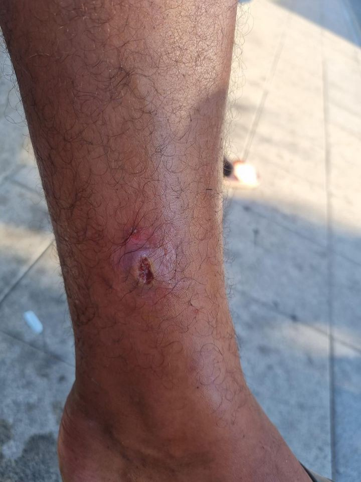

### AYS Daily Digest 09/08/21: Afghanis Abandoned To Their Fate By The EU

_Info, News and Updates from Greece, Spain, Croatia, Poland, France, Ireland and the UK\._

 in Pozzallo for the 550 survivors on board of Ocean Viking\. At the time of writing this digest, the third day was ongoing, with 200 people still on board\.](assets/e8defd746a5/1*t64MhJfke7-wdBc6Ol2Osw.jpeg)

Monday was the [second day of disembarkation](https://twitter.com/SOSMedIntl/status/1424715672127410178/photo/1) in Pozzallo for the 550 survivors on board of Ocean Viking\. At the time of writing this digest, the third day was ongoing, with 200 people still on board\.

FEATURED

**AFGHANIS ABANDONED TO THEIR FATE BY EU**

> We, the Home Affairs / Migration Ministers /State Secretaries of Austria, Denmark, Belgium, The Netherlands, Greece and Germany would like to take the opportunity to express our concerns about the current developments regarding irregular migration from Afghanistan\. 

On the days during which the Taliban are taking over regional capitals in Afghanistan and extending their control over the country, this is what the ministries of 6 EU countries are ‘concerned’ about\.

This letter, sent on the 5th of August to the EU Commission, is a response to the decision of the Afghan authorities to stop forced returns for a period of 3 months, communicated to the European institutions on the 8th of July\.

The ministers insist:

> We would like to highlight the urgent need to perform returns, both voluntary and non\-voluntary, to Afghanistan … Furthermore, stopping returns sends the wrong signal and is likely to motivate even more Afghan citizens to leave their home for the EU\. 

■■■■■■■■■■■■■■ 
> **[Srdjan Cvijic](https://twitter.com/srdjancvijic) @ Twitter Says:** 

> > What an incredible exercise in hypocrisy 👇🏻 it’s the Taliban advances that “motivate even more 🇦🇫 citizens to leave their homes” not stopping returns in Europe. Continuing with the forced returns in present circumstances is a crime 

> **Tweeted at [2021-08-09 11:45:50](https://twitter.com/srdjancvijic/status/1424698430857912326).** 

■■■■■■■■■■■■■■ 

As the ministers [write](https://thecivilfleet.wordpress.com/2021/08/09/keep-sending-migrants-back-to-afghanistan-six-european-countries-tell-eu-commission/) that they “fully recognise the sensitive situation in Afghanistan in light of the foreseen withdrawal of international troops”, but they don’t “foresee any cause to stop or suspend returns\.”

In the last 72 hours, as UNICEF [report](https://news.un.org/en/story/2021/08/1097392) , 27 children were killed and 136 injured in the Kandahar, Khost and Paktia provinces\. Over the last month alone, more than 1,000 people have been killed or injured due to indiscriminate attacks against civilians in Hilmand, Kandahar and Hirat provinces\. The EU ambassador to Afghanistan, Andreas Von Brandt, demanded the member states to temporarily suspend forced returns due to the increasing violence in Afghanistan\.

It is unlikely that the ministers are unaware of these facts and opinions from on the ground, as well as of the hundreds of other reports on the worsening situation in the country\. The fact that most of the EU countries supported and participated in the 20\-year\-long US\-lead occupation of the country also keeps going unnoticed\. Media report that instead the EU is [weighing](https://www.ekathimerini.com/news/1165025/as-war-rages-eu-weighs-more-funds-to-limit-afghans-fleeing-to-bloc/) up a new package of financial aid to Afghanistan and its neighbours to help limit the flow of refugees from the country\. Migration management and border security have obscured any other humanitarian and justice\-related consideration, in a union which is sinking under the weight of its walls\.

In Munich, Germany this Tuesday there is a [protest](https://twitter.com/BFR_089/status/1424714984437817345?fbclid=IwAR33GtqzN8O7t9tsHoHHF4Y4LtQi6VAwahrkhaiiAl3LqGuCu80IkkQWd_o) being held against the deportations of Afghans\.

Listen to the latest episode of Latitude Adjustment Podcast, by our friend Eric Maddox: [**Will We Just Forget Afghanistan?**](https://www.latitudeadjustmentpod.com/podcast/2021/8/8/87-will-we-just-forget-afghanistan)

GREECE
#### 86% of children in camps did not attend school in 2021

According to [ACAPS](https://www.acaps.org/country/greece/crisis/mixed-migration) , 86% of more than 10,000 school\-aged asylum seekers were not attending school in the camps on the mainland and on the Aegean islands of Greece in early 2021\. Lack of transportation, shortage of teachers, discriminatory practices, and lack of internet connectivity are limiting asylum seekers’ access to education\.
#### Athens: Solidarity banner with people on the move detained in Amygdaleza

 \)](assets/e8defd746a5/1*pEF61WIJz7l2TYVLK61xtw.jpeg)

Solidarity Banner \( [Indymedia](https://athens.indymedia.org/post/1613836/) \)

> “The fires in Attica also affected the detainees–immigrants of Amygdaleza\. For 5 days, while the whole area had been evacuated, the prisoners of the Greek state, inhaled smoke and ashes and their every move to communicate with people outside was suppressed \(seizure of mobile phones and thrashings\) \.” \[On Saturday,\] men were transferred to the inferno of Petrou Ralli and the women, to the respective inferno of Aspropyrgos, have now been transferred\. The conditions in both of these detention centers complement the torture of these individuals\.” \( [Indymedia](https://athens.indymedia.org/post/1613836/) \) 

SPAIN
#### 9 People Rescued

[Local media report](https://www.europasur.es/campo-de-gibraltar/salvamento-maritimo-nueve-migrantes-estrecho_0_1600040175.html) that Salvamento Marítimo rescued 9 people on Monday morning from the Strait of Gibraltar\. They were taken to the Port of Algeciras and attended to by medics\.
#### NNK Ceuta Update

 \)](assets/e8defd746a5/1*zP44ggSkiPbdfGibpnrZZg.jpeg)

\(Photo Credit: [Vicente Chaves, NNK](https://www.facebook.com/NoNameKitchenBelgrade/posts/1293489314382683) \)

NNK Volunteer, Amaia Ochoa, [reports](https://www.facebook.com/NoNameKitchenBelgrade/posts/1293489314382683) that they have met many people, especially children, taking more dangerous migration routes including hiding under trucks and climbing the port fence to sneak onto boats\. They refer to this as doing the “risky\.”

> Many kids are injured by the blades of the port fence or by the police waiting for them on the other side\. The violence suffered by the people who try to do “risky” at the hands of the police is a reality\. Several youngsters have told us how once in the port, if the police catch you “they hit you with the truncheon” and forcefully take you out of the trucks\. In addition, the kids have begun to normalize this violence as the aggressions they endure from the police have become part of their daily lives\. 

> In Ceuta the days pass slowly and doing “risky” has become a routine for many young people and minors who, desperate, only want to reach the peninsula to look for work and reunite with their families\. 

CROATIA
#### Kidnapping and pushback of two families in Zagreb

[Reports from the ground](https://www.facebook.com/selma.banich/posts/10159343253928116) state that on the 5th of August, two families disappeared from the asylum seeking community in Zagreb, having spent two night in a shelter\. They are two married couples, including a women who is five months pregnant\.

The police came for them using the excuse that they had to go to the 6 Remetinec police station to talk\. Before leaving, they were asked to bring all personal belongings\. They waited at the station for 7 hours\. Police took all their documents and phones\. Then, in a special vehicle, they were taken to another address, 10 minutes away from the station\. Another group of people also boarded the vehicle there\.

They were transported from Zagreb together and left on the green border with BiH without any documents or explanations\.

> Is Victory Day in Croatia celebrated with new kidnappings? 

Pushbacks and state disappearances are and remain illegal under international and national laws\.

POLAND
#### More people arriving at Belarus border

[InfoMigrants reports](https://www.infomigrants.net/en/post/34188/poland-reports-record-number-of-migrants-at-belarus-border?fbclid=IwAR1jkRPhRVuEHdE_bglxKWm-kH5ZiydoOwFyUsZpk5HF5CnTbY3EFkICx4s) that record numbers of people are crossing the Polish Border with Belarus\. This has lead to accusations that Minsk is deliberately sending migrants across the border to put pressure on the EU in order to force them to reverse sanctions on the country\. This year, 871 people have been detained at the Belarus border compared to 122 people in all of 2020\. Many of them are thought to be coming from Afghanistan and Iraq\. [Iraq has now suspended flights from Baghdad to Minsk\.](https://www.bignewsnetwork.com/news/270660384/eu-welcomes-suspension-of-iraqi-flights-to-belarus-amid-migrant-surge) Will it stop people leaving? Doubtful\. It will just take them longer and be more dangerous\.

FRANCE
#### More evictions in Calais

■■■■■■■■■■■■■■ 
> **[Human Rights Observers](https://twitter.com/HumanRightsObs) @ Twitter Says:** 

> > À #Calais ce matin, 6 expulsions de lieux de vie informels ont eu lieu sous la pluie.

↪️Durant celles-ci, au moins 73 tentes, des bâches et des effets personnels ont été pris aux personnes #exilées par les #FDO et par l'équipe de nettoyage mandatée par l'Etat.

#StopExpulsion https://t.co/YyJrDyy33a 

> **Tweeted at [2021-08-09 16:31:06](https://twitter.com/humanrightsobs/status/1424770223610208256).** 

■■■■■■■■■■■■■■ 

IRELAND
#### More than two years waiting time for asylum applications

Irish Media [report](https://www.thejournal.ie/dismay-as-asylum-application-times-increase-by-over-four-months-5515160-Aug2021/) that the latest figures from the Irish Department of Justice show that protection applicants are waiting \[on average\] almost 27 months for a decision on their application\. Priority cases are currently waiting 19\.5 months\. This comes after the Irish Refugee Council last month called for a “drastic reset” of the country’s asylum system which “remains fraught with administrative delays and substantial backlog”\.

The White Paper calls for ending Ireland’s Direct Provision system committed to reducing decision times down to nine months and then cut it further to no longer than six months by 2024\.

EU
#### Humanity Before Nationality Petition

A petition directed towards Ursula Von der Leyen has been organised by Voices4Refugees\. You can sign it [HERE](https://www.openpetition.eu/petition/online/humanity-before-nationality?fbclid=IwAR00uIDGr2l4yf8ZJKO5glBPFyzq3Ena2OeXrLivn9HMBiXEo7M1BB0iTKs) \.

> **We demand the following for Refugees in Refugee Camps** 

> Shut down the refugee camps\. 

> Give the refugees a proper home\. 

> Offer them legal advice in their asylum process\. 

> Offer them health and mental care\. 

> **We demand the following for Refugees in European Countries** 

> We demand more rights for asylum seekers and refugees in education, employment, residence, and integration\. A regular income and a proper residence permit reduce crime, poverty, sham / forced marriages\. Asylum seekers and refugees in European countries should get a faster and more transparent asylum process\. 

UK
#### Rise of racist attacks against people on the move

Unsurprisingly for a country currently fuelled by extreme anti\-immigration rhetoric there has been a rise of racist attacks by far\-right groups on people living in accommodation structures provided by the Home Office, including hotels in London and other cities and camps such as Napier barracks\. Between 1st of January 2020 until the 13th of July this year there have been [70 reported incidents](https://www.theguardian.com/uk-news/2021/aug/08/home-office-records-70-racist-incidents-far-right-asylum-accommodation) \. Campaign groups believe the number of actual incidents is much higher\. This is one of the many ugly faces of Priti Patel’s Hostile Environment policy\.

Germany
#### WORTH READING
- [**Borriana, the port where rescue ships moor\.**](https://www.elsaltodiario.com/refugiados/borriana-el-puerto-donde-amarran-los-buques-de-rescate) Open Arms, Aita Mari, Rescue People and Louise Michel are moored in Borriana, near Valencia, Spain\. A port where, in addition to obtaining permission to dock long stays and a dry dock where they can carry out maintenance tasks, they find human support in the L’Aurora association\. \(In Spanish\)
- [**Joel Hernandez’s August 2–9, 2021 Mixed Migration Update**](https://mixedmigration.substack.com/p/august-2-9-2021-mixed-migration-update)
- [**Malta: The teenagers pulled from the sea and accused of terrorism**](https://www.bbc.com/news/world-57988934) by Jean Mackenzie for the BBC\. In 2019, 3 teenagers were accused of hijacking a ship\. The court case is ongoing\. Despite there being over 100 people on board, only the crew and captain were questioned\.
- [**Samos, Greece: What does Europe Want to Achieve? That we will all commit suicide one day?**](https://wearesolomon.com/mag/on-the-move/what-does-europe-want-to-achieve-that-we-will-all-commit-suicide-one-day/?fbclid=IwAR1zdvlwxGBa6sVCBhcjdkQVD14_j59ZSw5N_dGvR2jaF10voUV8BrgZwgY) 
Ula Idzikowska interviews current residents in Vathi Camp as well as NGO workers and volunteers on Samos island\. They share insights and their fears regarding the new, more isolated ‘closed/controlled’ camp, which people are set to be moved to in Septmeber\.

**Find daily updates and special reports on our [Medium page](https://medium.com/are-you-syrious) \.**

**If you wish to contribute, either by writing a report or a story, or by joining the info gathering team, please let us know\.**

**We strive to echo correct news from the ground through collaboration and fairness\. Every effort has been made to credit organisations and individuals with regard to the supply of information, video, and photo material \(in cases where the source wanted to be accredited\) \. Please notify us regarding corrections\.**

**If there’s anything you want to share or comment, contact us through Facebook, Twitter or write to: areyousyrious@gmail\.com**

_Converted [Medium Post](https://medium.com/are-you-syrious/ays-daily-digest-9-8-21-afghanis-abandoned-to-their-fate-by-eu-e8defd746a5) by [ZMediumToMarkdown](https://github.com/ZhgChgLi/ZMediumToMarkdown)._
