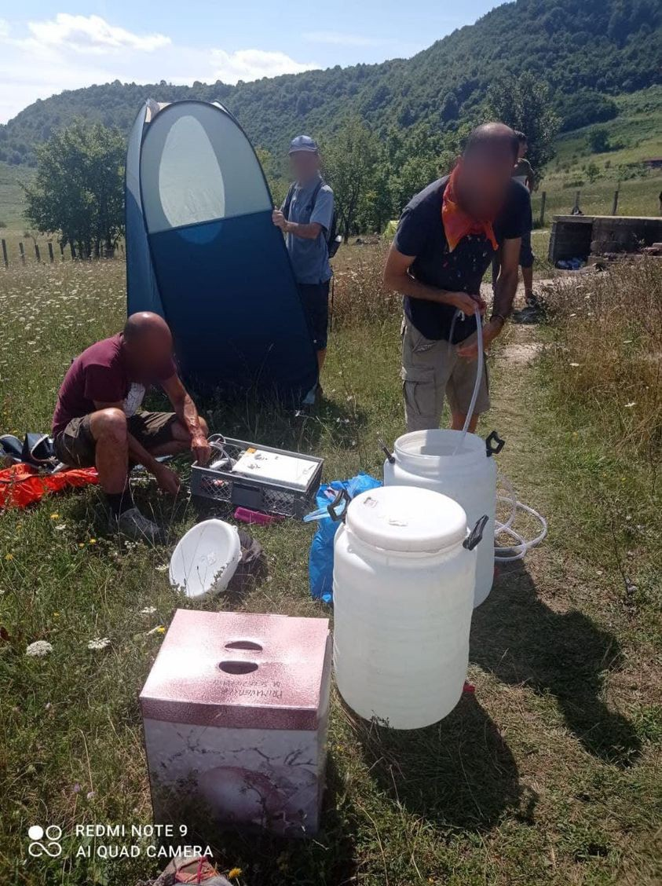

### AYS Daily Digest 13/8/21: Anyone carrying a cell phone in the Med may soon be under surveillance by Frontex \(and the Libyan Coast Guard\)
#### All the ways Frontex acts against people / News from the Mediterranean / Paris: systemic state violence and police harassment towards people on the move / Denmark stops deportations to Afghanistan and announces closure of their Afghan embassy / Important recommended reads and calls for support

](assets/aac4a7447991/0*pk0oW1B-PN_mj6-O)

by: [Care4Calais](https://web.facebook.com/care4calais/?__cft__[0]=AZXiwfmtfDd8xMneQ9tmh3VSJp01a5UBi6scZHh0aCYfSRVSZOWlAqERVrXZA1D2O97IN-Eplgmjibcr9rmKsRPcpyZh-qeMEC59jpcJoyQ29AquwWru3RJ5DTzZb6c09jDAG9FRlTGctbcC_k87tu8suWoZ0F1-pYzm6CldZfkfW7Xjj5Ui6rfyU3-n7B6TuoWAj0r28dvi1Eyarie23lP0&__tn__=-UC%2CP-y-R)
#### FEATURE — Frontex accountability — implications for its legal responsibility for fundamental rights violations

The \(so called\) Libyan Coast Guard operates with valuable information that comes directly from the sky\. The unstoppable flow of data, images and coordinates entering the Eurosur Fusion Service platform, a system managed by Frontex, capable of generating intelligence reports, is now turned against humans\.

> Large companies specializing in intelligence have found a gold mine in the management of data to be provided to states committed to locking down borders, _Mediterranea writes\._ 

As we have been reporting, Frontex is extensively using the benefits of technological and AI developments for their securitisation that ultimately ends up with people losing lives at the EU borders and not that many solutions for a humane approach in sight\. The plan, as announced earlier, is the selling of data collected by spying from space\. Data would be sold not only to states, but also to private individuals if they are willing to pay\. It involves “the interception of radio waves emitted by maritime radars, Ais transponders, satellite phones and, potentially, of other assets, with geolocation of the equipment\.” Even though the Agency says it is only in a “pilot project” phase and that they “are not intercepting any communications,” the entire project is allegedly subject to secrecy constraints\.

**All devices that emit waves can be monitored\.**

As [Mediterranea team explains](https://mediterranearescue.org/en/news-en/this-is-how-frontex-will-monitor-migrants-from-space/?fbclid=IwAR1qTTD_m9ORq1P0A0eL8l1z5g2KzEKSqC8bkBWYMyfGihzTjcJTJmyClNQ) — aid for Libya’s efforts to push back migrants now comes directly from space\.

Meanwhile, in the other part of the Med, a balloon system equipped with cameras is now being tested at Alexandroupolis airport near the Greek\-Turkish land border in northeastern Greece and on the island of Limnos, with the aim of giving border officials a clearer view of approaching boats, media have [reported](https://www.ekathimerini.com/news/1166242/eu-border-agency-trials-high-tech-controls-as-afghan-fighting-spreads/?fbclid=IwAR0HXfG_Zevv3tCcicNnP_OCfU9KX3Edk-7VfA9C-w9ijKo8IqPCzO56eHY) \.

> The integrated mix of cameras and thermovision sensors with links to ship transponders and satellite communications gives officials a real\-time view of a 60 km \(40 miles\) circle of sea, covering 40,000 square km \(15,000 square miles\) \. 

At the same time, it has been confirmed that in the incident leading to the drowning of at least 130 people, which occurred on 21 and 22 April, operations were coordinated by a Frontex FASS airplane, the official answer of the EU Commissioner Ylva Johansson on behalf of the European Commission states\.

> The shipwreck in question occurred on 21–22 April 2021, the Libyan, Italian and Maltese Rescue Coordination Centres were informed by a European Border and Coast Guard Agency \(Frontex\) plane about a boat in distress and the Libyan Coast Guard assumed the coordination of the rescue operation and searched for it in the area of sighting, _the document reads:_ 

The Scrutiny Group has established that Frontex knew and ignored internal serious incident reports, repetitive opinions and recommendations of the Consultative Forum and the Fundamental Rights Officer, as well as publicly available information from credible sources\.

> Frontex has been aware of a violation or willfully ignored it, it may incur indirect responsibility for assisting in that violation by financial, operational and practical means or by failing to exercise its positive obligations to prevent it\. 

Given all the developments regarding Frontex, it begs the question:

■■■■■■■■■■■■■■ 
> **[Matthias Monroy (@Mastodon)](https://twitter.com/matthimon) @ Twitter Says:** 

> > In einer "Gemeinsamen Erklärung" versprachen EU-Kommission, Rat und Parlament 2012, einen (#Frontex-)Agenturdirektor bereits bei "unzulänglicher Leistung" und nicht erst bei schwerwiegendem Fehlverhalten abzusetzen:
[europa.eu/european-union…](https://europa.eu/european-union/sites/default/files/docs/body/joint_statement_and_common_approach_2012_de.pdf)
Wann also wird Fabrice Leggeri gefeuert? https://t.co/79mrwpBHlT 

> **Tweeted at [2021-08-13 10:01:12](https://twitter.com/matthimon/status/1426121652849582080).** 

■■■■■■■■■■■■■■ 

#### SEARCH AND RESCUE AT SEA

ResQ People witnessed an [interception by the Libyan Coast Guard](https://fb.watch/7mp6W-WoP6/) in the Maltese SAR area\.

> A Libyan Coast Guard patrol boat arrived on the scene and proceeded to intercept the boats, carrying approximately 40 people\. The master of the ResQ People radioed the Libyan patrol boat, pointing out that we were in the Maltese SAR area\. ResQ People had no choice but to witness and document this act\. 

The team departed from the port of Burriana on Saturday, August 7, for its first search and rescue mission in the central Mediterranean\. On board were 20 crew members from six countries\. They reported having rescued [85 people today](https://l.facebook.com/l.php?u=https%3A%2F%2Fthecivilfleet.wordpress.com%2F2021%2F08%2F13%2F85-refugees-saved-a-day-after-rescuers-witness-an-illegal-pushback-in-maltas-waters%2F%3Ffbclid%3DIwAR1upK__qBupzkJKMjmhd5UlCELhc9vRm1GxftRlBXKgqv804HTlX9fUcsg&h=AT1xPBwtscIcOZuUJgbSbm8CzJaSr0x8Qj1J_ieq7afWRp5NTU_jXMgfl0wRHWjfZUnYFtiqfgJx9KqU_OLO2Vjq3ZPDEkA3rBZhKIC_ft7b6QmS_5PnZ0bhvF0_pkJFZEE__h5sSKhtjw&__tn__=R]-R&c[0]=AT19D8mYUMagG9qBZcYS4WTI7VGdL69Ta21NC7NYZ7ptltU796I2HsWD3v7IHdlvwPlXt8-a6bYD1S4Lmz5IHo8jTurjsIklmpook0LjhB5Hq9HwbTcAPozFzJuVijQV-Psl2TYDwKV9Sjhz6gxhPuMGpLb1YXcnOo6VxL0hgwa4HVy2CSopH1V-tJPmLkdIFUv3-n5eoEu1SGYIN1Y) \.
#### Two boats rescued in the north of Lanzarote

Maritime Rescue has [reportedly](https://www.europapress.es/islas-canarias/noticia-rescatan-dos-pateras-49-personas-bordo-norte-lanzarote-20210813113608.html?fbclid=IwAR3Ok-Hr1-yRYFTn_rVHUOTOx0_tD_7EtwuVMZTYLCrAnoFC96-lN4AAZgA) rescued two boats with 49 people on board early in the morning of this Friday when they were north of the island of Lanzarote\.

**_Gino Strada, the founder of [EMERGENCY](https://web.facebook.com/emergency.ong/?__cft__[0]=AZUPScBPG7yQI2H6o0oIhDwpzHT0rGOF1RHMY7-XFjkNW5TOz7AEoe63vA-Eh0ovGWyuKFLdRhxFl_NrR-w5Vl2NzGn5RSKuNNLbrD2ZQm73xAVxFOhegisvtFKTV07wlfXcIGjT3h18mZvNI6eUfR-I&__tn__=kK-R) , died today at the age of 73\._**

](assets/aac4a7447991/0*Qw_uT_JN-f1SF0MZ)

via [Mediterranea Berlin e\.V\.](https://web.facebook.com/mediterraneaberlinev/?__cft__[0]=AZUPScBPG7yQI2H6o0oIhDwpzHT0rGOF1RHMY7-XFjkNW5TOz7AEoe63vA-Eh0ovGWyuKFLdRhxFl_NrR-w5Vl2NzGn5RSKuNNLbrD2ZQm73xAVxFOhegisvtFKTV07wlfXcIGjT3h18mZvNI6eUfR-I&__tn__=-UC%2CP-R)

The association he founded in Milan in 1994 operates in 19 countries, building hospitals, surgical centres, rehabilitation centres, paediatric centres, first aid posts, health centres, outpatient clinics and polyclinics, mobile clinics, a maternity centre and a cardiac surgery centre\. At the instigation of local authorities and other organisations, they also helped to renovate and equip existing health facilities\.
Since the end of August 2020, they have also been working in the central Mediterranean with a team, consisting of a doctor, a nurse and a cultural mediator, on the [Proactiva Open Arms](https://web.facebook.com/proactivaservice/?__cft__[0]=AZUPScBPG7yQI2H6o0oIhDwpzHT0rGOF1RHMY7-XFjkNW5TOz7AEoe63vA-Eh0ovGWyuKFLdRhxFl_NrR-w5Vl2NzGn5RSKuNNLbrD2ZQm73xAVxFOhegisvtFKTV07wlfXcIGjT3h18mZvNI6eUfR-I&__tn__=kK-R) ship, to ensure medical assistance on board\.
#### GREECE

_Recently, a man from the Amygdaleza detention center who was diagnosed with Covid\-19, was transferred back to the container he shares with others, as, as uniformed people who transported him stated, “there is no isolation in Amygdaleza”,_ Solomon reports\.

> Amygdaleza is one of the PROKEKA, in which people who are not recognized the right to stay in the country are placed in administrative detention, until they are deported, or more often receive a document calling them to leave Greece within a month\. 

Read the entire story [here\.](https://wearesolomon.com/mag/on-the-move-el/antimetwph-me-ekrhksh-krousmatwn-h-amygdaleza/?lang=el&fbclid=IwAR3ZNz9RDPJtfj2Ty_BvTXaYN2ItBwkaWuLIae_VHPToEKs1VN7iuSSCjLo)
#### BOSNIA AND HERZEGOVINA

Project update ′′ portable showers ′′ in cooperation with Colletivo Sulla Rotta Balkanica — Alto Vicentino\.

The NNK team in BiH is now providing up to 30 showers a day using three portable showers and doing what they can at the moment to help those outside reception facilities receive showers and some friendly attention\.

> After the shower, each person receives a towel to dry himself and, in case they also need treatment to eliminate scabies, we provide them with specific soap, clean underwear and clothes\. 

> At the moment, it’s only possible to clean the towels every day to reuse them next time\. Unfortunately, we cannot take the clothes to the washing machine because the space is limited and, at the moment, we only count with one washing machine\. 

> For that reason, the shower\-backpack team with NNK health team have been working together to find industrial washing machines in [\#Bihac](https://web.facebook.com/hashtag/bihac?__eep__=6&__cft__[0]=AZVPCkl44xtK1GgAn-5UatQhsAPEu5mF1swaxVB5-Mmw5wNn5Illsjl3dlbV5_ZJakpQPRROmmPG4apWXJRj3-YG9hw961ntRdMGbXPniLpeSxLpu-U91_t25hf3IOMQ-5ACzSbfml7cZuGhY7RjYE1cqKuuEQokMPF_1ofxQYqJoMDYM_kOyk68c-p3lVtZlD78UVcNl_3bleQ0ctQMNBgG&__tn__=*NK-y-R) with the consent of using them to treat scabies\. In order to provide them with a short\-term solution, we give them soap to clean their clothes, to make sure the treatment is going to be effective\. 

If you want to donate to support the project: [https://donorbox\.org/emergency\-in\-northern\-bosnia](https://donorbox.org/emergency-in-northern-bosnia?fbclid=IwAR32xSeuKooD-AUDFggXx7uTjBgN9cQhTGV6_uBmYiojo5bmv4cduG7CVRU)

[](https://l.facebook.com/l.php?u=https%3A%2F%2Fwww.infomigrants.net%2Fen%2Fpost%2F34314%2Fmigrants-entering-eu-via-the-balkan-route-up-90-on-2020%3Ffbclid%3DIwAR0p3COPOYaqG7yHbhFCKX6mwjeIbugebGogs445uVe1_cu3-dIA08_d9RA&h=AT3HdzDeuXPvtm90O7rUs_T_IpmGHGnQ7qYgE07kRcXSqyyWoEYnPn5iQkAiXM3UhMuswW0LJfaJ_iSPdc7ITQbLGUkST4vSJ6HUocFgB4NpKXLxtWoJB9zWb3yRMnolm32JqnIih6qP4w&__tn__=R]-R&c[0]=AT2cCb75OGO5BQC0d5kVRw3-RhVvHVdBN_3bTZT5is-P-KMPV9jHH7BlWZ6IRReF8mIBNs1BTJQt7m6RB4cyr5AkeKxt52OzlrUnb3KjyUjJqFlCq3nD5N26dmbmJbp37HGVWE2Ug5r7Axyh7E1RaZZidZ-T8jJn_ltL3PIFzm9F169XLid1iMqSnWYacnoobCsb_iIrCLFO2_LSmNU)

#### FRANCE
### [Solidarity Border](https://web.facebook.com/SolidarityBorder/?__cft__[0]=AZUsOgnOrjuV2JZElkWevclt2t4me_FEkW6BtRcU2JJc77XcgxX4Qb4KBP0imuug7beYxY64imtxPv5Ru6JJzgGbXNBLqyvGBZCMSpBbs9ycQwmeQKReh57rc6r0RqF2dUyOIrlENDAwyBci0SHXurlB&__tn__=-UC%2CP-R) invites everyone to a gathering this Sunday

> Many of you probably already know that two days ago [a person was killed again on this Franco\-British border\.](https://l.facebook.com/l.php?u=https%3A%2F%2Fwww.infomigrants.net%2Fen%2Fpost%2F34305%2Fone-dead-and-120-migrants-rescued-in-channel%3Ffbclid%3DIwAR3y49v5KkaUsaCI0D_2KN8FpXwVBF0JwHPKams1KXZMuscg0rDZv6hv7Xk&h=AT2OPCJzZw6cz1SHE0im8qSEN6o4VEacu0yWHmY7qdzsaRR8CrV0Ag-7L1E2ivdD3bFtkmHz6RaplTWBXlaUNBVXubYcc2dCjLWagoQ2TiHl-W9-J6aEIf632eeRzAHNXyhBMDfckgDekA&__tn__=R]-R&c[0]=AT3qi_RgxvRogm5KZ1KfjYEADJy4_i8y0o0jGuxbz75j-k6nBCqMgIwssQD8JUo6l2gMo4BOucadQHf0NBMRbKj5l_Hzjt3ha8Z4xt2Imd-1zBCsOJN-c_8Va99ET4pncny4LsREjjFQLmz-cNnELveRcNjAUqRUoTZYst64tRsjYbFV7yweWPMH8jhr5hspvSnfwHlSTO3bxLdfZMIgdsLH0k48Ovrm0L5xCVwaHME) 

> Another person too many\. 

> In order to come together, to pay tribute to those who died at the border, and to say no to this murderous border policy, we are organizing **a rally on the human rights square in Dunkirk this Sunday, August 15 at 5 p\.m\.** 

> **This gathering will be a peaceful, apolitical commemoration or anyone who wishes to be able to speak\.** 

> We also envision each person coming with a candle\. 

> We are counting on your presence 

> Thank you\. 

### Paris

Utopia 56 reports from the French capital:

> In northern Paris, more systemic state violence and police harassment towards exiled and homeless people\. 

> Last Sunday evening, 55 people were lacerated their tents and confiscated their blankets and food by police, near the Porte de la Villette\. Police continued to maintain their presence at the scene the following day and days to prevent people from returning to settle under the bridge\. 

> So at least 55 people found themselves scattered in the streets of Paris without anything\. ′′ It’s very cold and boys don’t have tents to sleep says one of the men in France for 5 years already and still on the street\. 

#### SPAIN

■■■■■■■■■■■■■■ 
> **[Alarm Phone](https://twitter.com/alarm_phone) @ Twitter Says:** 

> > The re-established relations between #Spain &amp; #Morocco have resulted in the deportation of 800 minors who arrived in #Ceuta in May back to Morocco. We condemn these violations of the rights of minors and their freedom of movement. 

> **Tweeted at [2021-08-13 18:11:04](https://twitter.com/alarm_phone/status/1426244932780576771).** 

■■■■■■■■■■■■■■ 

Among the organisations active in the area is also the NNK team reporting on the illegal pushback of minors:

■■■■■■■■■■■■■■ 
> **[NoNameKitchen](https://twitter.com/NoNameKitchen1) @ Twitter Says:** 

> > Right now, in #Ceuta, some police vans are being transferred from the shelters to the border post/checkpoint. Inside them  are minors who were hosted in these shelter centres. Most likely, they will be returned to Morocco against their own free will. This procedure is illegal. 

> **Tweeted at [2021-08-13 13:26:06](https://twitter.com/nonamekitchen1/status/1426173217970982913).** 

■■■■■■■■■■■■■■ 

#### DENMARK

Denmark today announced the evacuation of the Danish embassy in Kabul\. At the same time, the country will suspend deportations of rejected Afghan asylum seekers to Afghanistan until October 8, following a request from the Kabul government amid increased conflict in the country, the Danish immigration ministry said on Thursday\.
#### ETHIOPIA
### “I don’t know if they realized I was a person”: rape and sexual violence in the conflict in Tigray

> During the conflict that began on 4 November 2020 in Tigray — Ethiopia’s northernmost region — troops fighting in support of the federal government have committed widespread rape against ethnic Tigrayan women and girls\. The perpetrators include members of the Eritrean Defense Forces \(EDF\), the Ethiopian National Defense Force \(ENDF\), the Amhara Regional Police Special Forces \(ASF\), and Fano, an informal Amhara militia group\. Given the context, scale, and gravity of the sexual violence committed against women and girls in Tigray, the violations amount to war crimes and may amount to crimes against humanity\. 

Find Amnesty International’s Report in English [here](https://www.amnesty.org/download/Documents/AFR2545692021ENGLISH.PDF) , and see “Worth reading” section for more insights into the horrors of sexual violence in Tigray\.
#### Events

Training Seminar on EU advocacy — 4 and 5 November 2021 in Brussels, Belgium:

[](https://l.facebook.com/l.php?u=https%3A%2F%2Fecre.org%2Ftraining-seminar-on-eu-advocacy%2F%3Ffbclid%3DIwAR1pGG1CpXeVZgPyKTpWJd98mO3QKG-w8ZXii2rjM2KsOM7Q0kPFxGqiOGw&h=AT0O7Ndfu_Aht2PBlFq4qkYFRVRdwVMu7UtxsLzZH-rJ2EvKr2sO8JEFtgZFeVPdNkP0440ddPHP_f5nGAZkKtdD1ascFfeV4ZJaT5DQwUrXJ6bC2cV5msEOTdH-y8vVgt3Alz029sgYrA&__tn__=R]-R&c[0]=AT2cCb75OGO5BQC0d5kVRw3-RhVvHVdBN_3bTZT5is-P-KMPV9jHH7BlWZ6IRReF8mIBNs1BTJQt7m6RB4cyr5AkeKxt52OzlrUnb3KjyUjJqFlCq3nD5N26dmbmJbp37HGVWE2Ug5r7Axyh7E1RaZZidZ-T8jJn_ltL3PIFzm9F169XLid1iMqSnWYacnoobCsb_iIrCLFO2_LSmNU)

#### WORTH READING
- “What ‘Rape as a Weapon of War’ in Tigray Really Means” 
WARNING — This report is most distressing\. It includes accounts of rape camps as known from Srebrenica\. The sexual violence described is shocking even to those who know about other incidents of weaponised and systematic rape

[](https://l.facebook.com/l.php?u=https%3A%2F%2Fsites.tufts.edu%2Freinventingpeace%2F2021%2F08%2F10%2Fwhat-rape-as-a-weapon-of-war-in-tigray-really-means%2F%3Ffbclid%3DIwAR1CXdeqIQs-OTLA9H-ZslgrRfJitwOTCQM9MgMsb33AUKTLGsLjWaKTeXA&h=AT0wrFQnJEnn3fkWf6igB0s3pPzl7qUJ76TA8GHY27_y3JIHWwDT_QzEW1KA1qOgiMiuH1yz7Bn2kpr7vIswMN3FuhLKBpJlFl5spcmzyeseD3_eDhZd5iDjx8GyRkasaw&__tn__=H-R&c[0]=AT0i57inbHDmfTFbzvkMiCfgaIIM0frzROlTBciJZCLIsbQxdz5UdPgMlztZmJ9pbhszoE7QfMpkt_FuCUUuRWO-5bvYcGkAGwdGmNCmQBQ-ZcXBnlwiQtQlLxp5wNeT19ez3-5dWnAonYYiW1dRof0h2TvtqXluUV64lRJ_HOxUVbbJxUW9Hk0ZSpIpkZcUj92ZYuSCQrEiXZJInM0)

- Landscapes of Solidarity with people on the move in BiH: An overview of border activism in times of Covid\-19

■■■■■■■■■■■■■■ 
> **[Jean-David Ott](https://twitter.com/JD_Ott) @ Twitter Says:** 

> > The @[EP_ThinkTank](https://twitter.com/EP_ThinkTank)'s impact assessment on the New Pact is out. It highlights several negative consequences for MS &amp; local communities, and points to inadequate solutions for the protection of migrants and asylum seekers' fundamental rights.

[bit.ly/3ABagob](https://bit.ly/3ABagob) https://t.co/Tp0CjW0UNZ 

> **Tweeted at [2021-08-13 09:42:36](https://twitter.com/jd_ott/status/1426116969149906949).** 

■■■■■■■■■■■■■■ 

- What Syrian returnees face:

**Find daily updates and special reports on our [Medium page](https://medium.com/are-you-syrious) \.**

**If you wish to contribute, either by writing a report or a story, or by joining the info gathering team, please let us know\.**

**We strive to echo correct news from the ground through collaboration and fairness\. Every effort has been made to credit organisations and individuals with regard to the supply of information, video, and photo material \(in cases where the source wanted to be accredited\) \. Please notify us regarding corrections\.**

**If there’s anything you want to share or comment, contact us through Facebook, Twitter or write to: areyousyrious@gmail\.com**

_Converted [Medium Post](https://medium.com/are-you-syrious/ays-daily-digest-13-8-21-anyone-carrying-a-cell-phone-in-the-med-may-soon-be-under-surveillance-of-aac4a7447991) by [ZMediumToMarkdown](https://github.com/ZhgChgLi/ZMediumToMarkdown)._
