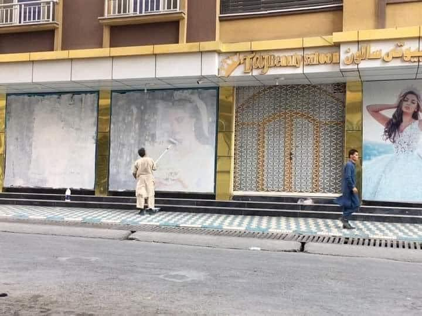
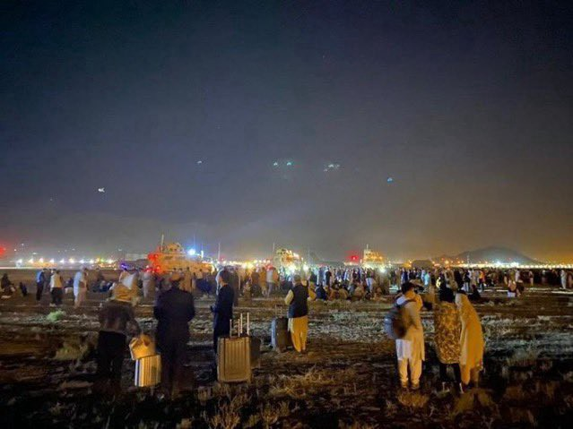
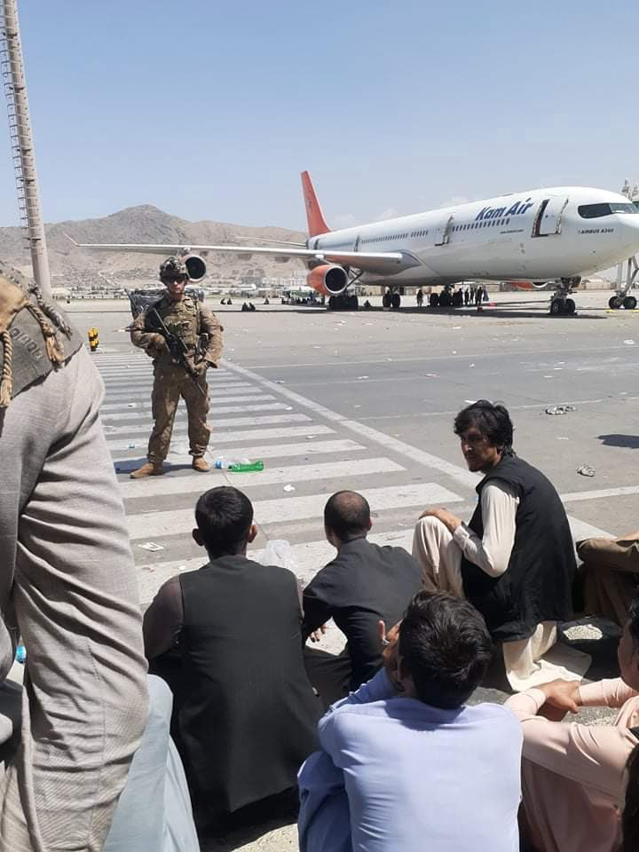

### AYS Weekend Digest 14–15/8/21: For Afghanistan

[Are You Syrious?](?source=post_page-----8df34415cf4c--------------------------------)

[Aug 16](ays-weekend-digest-14-15-8-21-for-afghanistan-8df34415cf4c?source=post_page-----8df34415cf4c--------------------------------) · 7 min read

Central Med: more than 350 people rescued by MSF and ResQ / Pushback attempt on Samos / Racist attack on Crete / new ‘reception’ centre planned in UK and more …

Kabul, Monday 16 August 2021 \(Credit: [Lotfullah Najafizada](https://twitter.com/LNajafizada/status/1426852794175270915) \)
### FEATURED — For Afghanistan

Over the last hours, all major media have been [reporting live](https://www.theguardian.com/world/live/2021/aug/16/afghanistan-taliban-kabul-evacuation-live-news-updates) on the situation in Afghanistan, with the Taliban entering first Kabul and then the presidential palace, western embassies rushing out of the country, and Afghan president Ghani leaving the country to a so\-far\-unknown location\. Reports from Kandahar and Herat point to violent actions against [Hazara minority political leaders](https://twitter.com/asranarshism/status/1427151042920157185) , activists and [journalists](https://twitter.com/SonaliDhawan_/status/1426635174167580682) \(especially [women journalists](https://twitter.com/asranarshism/status/1427051004957126656) \) \.

PHOTO1: Kabul Airport, civilians hoping to be able to board flights \(Credit: [Aisha Ahmad](https://twitter.com/AishaTaIks/status/1427072003463331842) \)

At the time of writing, most recent reports describe a chaotic situation at Kabul airport with at least [five people killed](https://www.theguardian.com/world/live/2021/aug/16/afghanistan-taliban-kabul-evacuation-live-news-updates?page=with:block-611a12f68f08d30d15502dee#block-611a12f68f08d30d15502dee) \.

The [Afghan\-American Women’s Association](https://twitter.com/aawa_us/status/1426958501994237952) and [Dunya Collective](https://twitter.com/DunyaCollective/status/1427170320583114755) report that US soldiers have taken control of Hamid Kazai international airport in Kabul and blocked all non\-military flights from landing and departing, preventing hundreds of people from leaving the country\.

US soldier preventing civilians to board planes to leave Afghanistan at Kabul airport \(credit: [Sowaibah Hanifie](https://twitter.com/SowaibahH) \)

The prioritisation of western lives is clearly shown by the [slowness](https://morningstaronline.co.uk/article/b/home-office-obstructing-safe-exit-afghan-refugees-reports-claim) of the procedures for allowing people who worked with western armies, media or NGOs out of the country\. A German defence ministry spokesperson [commented](https://twitter.com/matt_meeta/status/1426855637254873096) : “It’s not like we forced them to cooperate with us\.” In the UK, senior military sources pointed the finger at the Home Office over the failure to evacuate key personnel, stating that Priti Patel’s department was reluctant to offer asylum due to the message it would send to refugees, media [report](https://www.thenational.scot/news/19514795.home-office-fears-message-refugees-afghan-allies-given-asylum/) \.

In Europe, media and politicians are already rebranding this as a forthcoming European migration crisis\. The informal group of Mediterranean countries Med5 \(Greece, Italy, Spain, Malta, and Cyprus\) are [pushing](https://twitter.com/dgatopoulos/status/1426997216842063874) for prioritising talks on the Afghan crisis in the next EU emergency council of ministers of home affairs, planned for Wednesday 18\. The group is especially interested in discussing the impact on migration to Europe\.

Journalist Andrew Connelly explained how these ‘lazy’ discourses on migration crises tend to hide the reality that the vast majority of Afghan people on the move are seeking protection in neighbouring countries and do not intend coming to Europe — Read the whole thread [HERE](https://twitter.com/connellyandrew/status/1426549893569646593) \.

International media are also praising [Albania](https://www.dw.com/en/albania-ready-to-accept-afghan-refugees-says-pm-rama/a-58870238) and [Kosovo](https://www.metro.us/albania-kosovo-say-ready/) for accepting a request from US authorities to host Afghan support staff and political asylum seekers who have the US as their final destination\. Out of the ‘emergency’ framework in which such news are discussed, this is one more step towards the externalisation of the entire asylum process, in which the richest country in the world outsources the ‘risks’ of people not qualifying for ever\-stricter protection statuses to third countries in the Balkans\.

Read More:
- [**Looking for ways to support Afghanistan and Afghan people? Here’s a list of actions that you can take and avoid\.**](https://twitter.com/Bushra_Ebadi/status/1426668485153890304) A thread by Bushra Ebadi\.
- Zahra Ali reflects on the [**lack of accountability for 20 years of War on Terror**](https://twitter.com/ZahraSociology/status/1426956396994629638) and its effects on the current situation\.
- Check out and donate to these **campaigns to support local [journalists](https://www.mediasupport.org/donate/) and [activists](https://asranarshism.com/donation/) \.**
- This [**Guide to delete your digital history**](https://www.humanrightsfirst.org/sites/default/files/How%20to%20delete%20your%20history_updated.pdf) can be useful for anyone with contacts inside Afghanistan right now\.

SEA
### Central Med

Between Friday and Sunday, ResQ\-People Saving People [rescued](https://twitter.com/resqpeople/status/1426934175509188609) 165 people from four boats, one on Friday and three on Sunday\.

On Sunday night, MSF’s Geo Barents [rescued](https://twitter.com/MSF_Sea/status/1427037674414690306) 189 people from an overcrowded, double decked wooden boat\. There was limited oxygen on the lower deck\. Everyone is now safe on board the Geo Barents, which now has 214 people on board\.

They are all in need of a safe port\.

GREECE
### Pushback attempt on Samos

A group of 30 people arrived on Samos over the weekend\. Their pushback was ultimately prevented only by the intervention of the UNHCR, while other actors were threatened\.

At the time of writing it is only known that the majority of the group were taken to quarantine but [three women and a baby are unaccounted for](https://twitter.com/DIMITRIOSCHOUL1/status/1426571413343940609) \.
### Update on Ikaria pushback

[Racist Crimes Watch](https://racistcrimeswatch.wordpress.com/2021/08/12/1-1221/) report on a criminal complaint lodged with the Samos police regarding the pushback on August 5\.

> _We submit to you another indictment, according to article 42 of the CPC, within the framework of the program of the [**Observatory of Racist Crimes**](https://racistcrimeswatch-wordpress-com.translate.goog/?_x_tr_sl=auto&_x_tr_tl=en&_x_tr_hl=el&_x_tr_pto=ajax,elem) **,** regarding the illegal deportation of asylum seekers from **Ikaria\.**_ 

> _On the morning of August 5, 2021, the Aegean Boat Report reported \(see below with photo documentation\) the arrival of 24 foreigners with the intention of seeking asylum at Iero Beach in Ikaria\. The next day, August 6, 2021, the Municipality of Ikaria announced \(see below using a photo by the Aegean Boat Report\) that 12 migrants who had been forwarded to Samos had arrived\. On the evening of the same day, August 6, 2021, the Turkish Coast Guard announced that on the night of August 5, 2021, it had collected 14 foreigners who had been abandoned by the Greek authorities in Turkish territorial waters in the Didim Aydin area opposite Ikaria and Samos\. It is estimated that the survivors from the Turkish Coast Guard were part of the 26\-member team that had landed in Ikaria\._ 

### Racist Attack on Crete

[Local media report](https://www.efsyn.gr/efkriti/koinonia/306466_taytopoiithikan-oi-drastes-tis-ratsistikis-epithesis-sto-oropedio-lasithioy) that seven men have been identified by the police as perpetrators of the racist attack that took place in the village of Agios Georgios in the Municipality of Lassithi Plateau, Crete\.

T [he attack occurred in the afternoon hours of Wednesday, August 11th\.](https://www.efsyn.gr/efkriti/koinonia/306419_ratsismos-kai-bia-sto-oropedio-lasithioy) The assailants attacked two houses, where a total of thirteen foreign workers lived\. It is reported that in the attack crowbars and knives were used, gunshots were heard, and mobile phones and money was stolen\. Fifteen people were taken to the local health centre with severe injuries while two of them remain hospitalized in a serious condition\.
### Racist Twitter account removed

The Twitter account of the President of the [Hellenic Solution Kyriakos Velopoulos](https://racistcrimeswatch.wordpress.com/2021/08/15/1-1222/?fbclid=IwAR2es0Xmp-XhFjSvgTBQ1121avQN7OSI88ZqSVxKv-LHS36uLgUsgSAZTEQ) was suspended on Sunday 15th due to his extreme xenophobia after a prolonged campaign by the Greek Hellsinki Monitor\. His posts began being flagged in March 2021\.
### Woman’s body found in Evros

[The body of a woman was found](https://www.evros-news.gr/2021/08/15/%cf%83%ce%bf%cf%85%cf%86%ce%bb%ce%af-%cf%80%cf%84%cf%8e%ce%bc%ce%b1-%ce%b3%cf%85%ce%bd%ce%b1%ce%af%ce%ba%ce%b1%cf%82-%ce%b2%cf%81%ce%ad%ce%b8%ce%b7%ce%ba%ce%b5-%ce%b1%ce%bd%ce%ac%ce%bc%ce%b5%cf%83/) this weekend between the villages of Mavroklisi and Protokklisi soufli\. The cause of death will be established after an autopsy at the University General Hospital of Alexandroupolis\. She is thought to have been dead for several days and to have crossed the border from Turkey\. We hope that her identity can be discovered and her family informed\. At least one cause of her death is already known: the EU border policy\.
### Welcome to Evros…

[Local media have applied](https://www.evros-news.gr/2021/08/14/%cf%80%cf%81%ce%bf%cf%82-%cf%85%cf%80%ce%bf%cf%85%cf%81%ce%b3%cf%8c-%ce%bc-%cf%87%cf%81%cf%85%cf%83%ce%bf%cf%87%ce%bf%ce%af%ce%b4%ce%b7-%cf%86%ce%ad%cf%81%cf%84%ce%b5-%cf%84%ce%bf%cf%85%cf%82-%ce%bd/) to Civil Protection Minister M\. Chrysochoidis to have the latest Frontex recruits trained at Didymoteicho Police Academy in the Evros Region\. Why? So that Frontex can pay to do up the Academy and recruits can spend their 4000\-Euro\-a\-month salary in the area\. Oh, and it’s a handy place for pushback training…

BELARUS/LITHUANIAN BORDER
### Five people trapped in no\-man’s\-land and deported to Iraq

Since 6th August, Alarm Phone have [been in touch](https://twitter.com/alarm_phone/status/1423571387025920003) with a group of five people trapped in the no\-man’s\-land between Belarus and Lithuania\. Border guards from both countries were only metres away but refused to provide any help, leaving the group stranded, with no water, food, or ways to keep warm\. Alarm Phone lost contact with the group on 9th August\. Only on Saturday 14th was it [discovered](https://twitter.com/alarm_phone/status/1426484469054251012) that the group had been returned from Belarus to Iraq\.

UK
### Plans to build large reception centre for asylum seekers revealed

Media [report](https://www.thetimes.co.uk/article/simple-reception-centres-to-house-up-to-8-000-asylum-seekers-home-office-documents-reveal-9krdrl7hw#Echobox=1628870871) that the UK government has started the bidding process to outsource the construction of a reception centre for asylum seekers with a capacity of up to 8,000 people\. This is part of Home Secretary Priti Patel’s series of reforms to the immigration system of the country\.

> _Asylum accommodation at Napier was so bad it was ruled unlawful, Penally barracks was shut down — and now govt want to expand the asylum camp estate? — [Joint Council for the Welfare of Immigrants \(JCWI\)](https://twitter.com/JCWI_UK/status/1426822468568817664)_ 

- Read more on [**the consequences of hostile immigration rules during the pandemic and of the closure of EU Settlement Scheme**](https://inews.co.uk/news/uk-immigration-rules-eu-settlement-scheme-undocumented-migrants-1093842?fbclid=IwAR1RbsaGjwbudBxGxvjiTZPL7kOtB6hfaDVAJtrgcMuROhJdfBogsTgUrcE) \. Thousands more undocumented people — including children — will live in fear, unable to work or live a normal life\.

WORTH READING
- [**Djibouti’s refoulement: Sending Tigrayan refugees to their death\.**](https://omnatigray.org/djiboutis-refoulement-sending-tigrayan-refugees-to-their-death/) An article on the history and the present of Ethiopia\-Djibouti relationship, and the blind eye turned by Djibouti authorities on the systematic violence against Tigray people\.
- [**Greece: Abandoned to the flames on Evia**](https://www.dw.com/en/greece-abandoned-to-the-flames-on-evia/a-58860740?fbclid=IwAR08DRInfK1AOhchaaggduG4FE-bogkJppdcLlYd4NxbobXafWZXcxHigIs) — “After the devastating fires that have ravaged Greece’s second\-largest island, many of its residents are angry with their government\. They believe the disaster could have been prevented\.”

**Find daily updates and special reports on our [Medium page](https://medium.com/are-you-syrious) \.**

**If you wish to contribute, either by writing a report or a story, or by joining the info gathering team, please let us know\.**

**We strive to echo correct news from the ground through collaboration and fairness\. Every effort has been made to credit organisations and individuals with regard to the supply of information, video, and photo material \(in cases where the source wanted to be accredited\) \. Please notify us regarding corrections\.**

**If there’s anything you want to share or comment, contact us through Facebook, Twitter or write to: areyousyrious@gmail\.com**

_Converted [Medium Post](https://medium.com/are-you-syrious/ays-weekend-digest-14-15-8-21-for-afghanistan-4c7a0d30c755) by [ZMediumToMarkdown](https://github.com/ZhgChgLi/ZMediumToMarkdown)._
