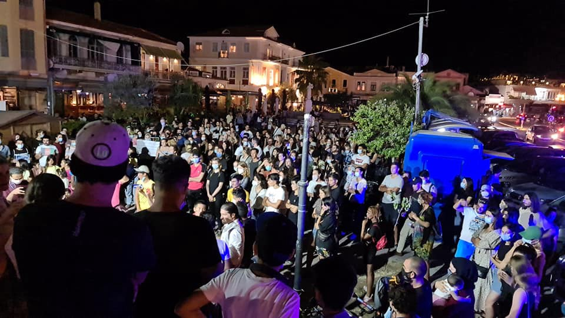

### AYS Daily Digest 16/08/21: Reactions to Afghanistan in Europe, Country by Country
#### Resources and petitions for Afghanistan // 2 rescues by MSF // Multiple landings in Lampedusa // Call for volunteers in Paris
### FEATURE — Afghanistan: Reactions in Europe, And What You Can Do to Make Your Voice Heard

News agencies and social media platforms have been blowing up over the past few days with updates, takes, photos, personal reflections and petitions surrounding the developments in Afghanistan\. For those struggling to keep up with the crazy 24\-hour news cycle, Are You Syrious has made an effort to consolidate the different reactions of European countries in the wake of the Taliban takeover\. We’ve also compiled a list of what we hope are helpful resources and petitions for those who want to show their support and put pressure on their governments to take in those fleeing the country\. By the time this digest is published, some of this information may have changed, but we will continue to post updates and try our best to find the best and most accurate information out there\. Here goes\.
#### RESOURCES & PETITIONS
- Here is a list of Google Forms organized by Truman National Security Project, No One Left Behind, Human Rights First, and other US\-based nonprofits on how to help Afghans get out of the country: [Passport holder evacuation form](https://docs.google.com/forms/d/e/1FAIpQLSc5hi-em8I7XBf6Sgr0BXNNScrNK8p6KwW6GsP9OIjm9r3M6Q/viewform?fbclid=IwAR2FBFiW9vqijaCzM67YfUzAK3F7XOP94WLT04TqVbCZfNucsk-glwOhetk) ; [Pledges to support Afghan airlift](https://docs.google.com/forms/d/e/1FAIpQLSfitym3vRQKDjEMNaK3j5D7SCYVbIhBruIMClUaK0DkP9uO-g/viewform?fbclid=IwAR2pwIS36zUKMmr79hO8IGqBDeZ0cWP7xZ90jVNLDTZAK021me-oN5MzuZA) ; [Information on how to delete your digital history](https://www.humanrightsfirst.org/sites/default/files/How%20to%20delete%20your%20history_updated.pdf?fbclid=IwAR2h0twwVBrYbAw2SFpvQhy1rg8LMM7Ls8ndG7U_pDCfpJ4uu2EpsX7MUnM) \.
- For **US citizens** : [Here is a call script](https://docs.google.com/document/d/1-VGm2oAZqVckFvzi2UiV00rtbK2AgawrhTd1QS1x-mE/edit) you can use to call officials in Washington \(senators, representatives, committees, etc\. \) and demand speedy evacuations\.
- For **Canadian citizens** : Information on [resettlement in Canada](https://www.canada.ca/en/immigration-refugees-citizenship/services/refugees/afghanistan/how.html?fbclid=IwAR3Iv0ccdRXJyrmS0tDptOL79yC7rHmP8m7jsLnexYdw5PaQay6k48AJkdc) \.
- Here is a list of organizations you can donate to on the ground in Afghanistan\. Some are local associations, some are international\. [Rukhshana media](https://chuffed.org/project/reporting-on-issues-that-affect-afghan-women-is-expensive-rukhshana-media-needs-your-help?fbclid=IwAR23uag2Ymd2g-BLQhFqh3vcBV2M9BBCadKCanG_wGc6XIC6msjGLd6jOxs) \(Afghan female journalists\); [orphanages in Kabul](https://enabledchildren.org/?fbclid=IwAR3xJHwxcJCZUf_xJafmNKJo8QMWCrpLa44QHuV4aUE7JLkgzB7v1Tth5tg) working with children with disabilities; [Women for women](https://support.womenforwomen.org/donate/afghanistan-emergency-2x-match?fbclid=IwAR16QID6yiWi3WbiROC8oDKxFPmRkY6kFGH2wbf3ViB0tNkbFe7R440fZy8) \(NGO supporting women affected by war with a team in Kabul\); [medical association](https://en.emergency.it/donate/?fbclid=IwAR1sIG_eKoY4D1SWHLV3JTNfBI9TE4ZSkrU2ZXGh7BMWSkGCY3ateOlWbHc) with teams in Afghanistan since 1999\.
- A [Change\.org petition](https://www.change.org/p/create-safe-passages-from-afghanistan-kabul-taliban?fbclid=IwAR0NXbgEgiNaC5TsUEUL3dAZ8oB2xYz0CR8sndfOsjYcsaBqtRtHanHUlV4) advocating for safe passage to Europe for Afghans\.
- A [list of demonstrations](https://www.facebook.com/SeebrueckeSchafftsichereHaefen/posts/1453843314987847) over the next few days in Germany\.
- Information about a [protest on 19/08 on Syntagma Square](https://twitter.com/parwana_amiri/status/1427370065939378181) in Athens\.
- A document with [information on immigration relief](https://docs.google.com/document/d/1fOLFOxD6DWs2JrBb1hqf2EXMbC5imN1Bm5LOXnSkfks/edit) for Afghans still in the country\.

And now, we’ll go country by country for their reactions to the news of the Taliban takeover\. Before that, it’s worth checking out this article from the [Guardian](https://www.theguardian.com/world/2021/aug/16/expected-afghan-influx-reopens-divisions-over-refugees-europe?fbclid=IwAR1SKLCFU3QL4DI-hej6nKXbvHMk3aqiZRYisjdTak_Bqz0rfgrAckEYnZI) about how the fall of Kabul is set to “reopen divisions over immigration in European countries”\. In an emergency meeting of the UN Security Council, UN chief Antonio Guterres “urge\[d\] all countries to receive Afghan refugees, and refrain for any deportations\.”
#### GERMANY: “Do Not Repeat the 2015 Mistake”

Armin Laschet, a candidate for chancellor of Germany, [spoke out](https://www.rnd.de/politik/afghanistan-fluechtlinge-laschet-lehnt-zusage-fuer-aufnahme-ab-7CSIFUACUOJ3RISLT7JH7Q3CTU.html?fbclid=IwAR0f-f-sS__Wq87pqJ8mRsSVqXu6t-yPSBfcThU93I4ER2DbMM1V4ND2KQc) against proposals to take Afghan refugees, saying that the “mistake” of 2015, when Germany took in nearly a million refugees, could not be repeated\.

“I believe that we shouldn’t send out the signal now that Germany can virtually take in everyone who is now in need,” the CDU chairman said in Berlin on Monday\.
#### AUSTRIA: Proposal to Set Up Deportation Centers

Austria, which wants to continue deporting people to Afghanistan, [has now said](https://www.reuters.com/world/asia-pacific/austria-calls-deportation-centres-host-afghans-near-afghanistan-2021-08-16/?fbclid=IwAR0NXbgEgiNaC5TsUEUL3dAZ8oB2xYz0CR8sndfOsjYcsaBqtRtHanHUlV4) it plans to open up deportation centers in nearby countries\.

“If deportations are no longer possible because of the restrictions imposed on us by the European Convention on Human Rights, alternatives must be considered,” Austrian Interior Minister Karl Nehammer said in a joint statement\.

This, of course, as one commentator pointed out, flies in the face of both international and EU law:

■■■■■■■■■■■■■■ 
> **[Magdalena Majkowska-Tomkin](https://twitter.com/magda_majkowska) @ Twitter Says:** 

> > "If deportations are no longer possible because of the restrictions imposed on us by the European Convention on Human Rights, alternatives must be considered". This is a blatant disregard of the international and EU law, not to mention founding values of the EU. 

> **Tweeted at [2021-08-16 13:58:24](https://twitter.com/magda_majkowska/status/1427268507499122697).** 

■■■■■■■■■■■■■■ 

#### FRANCE: We Must Protect Ourselves Against “Irregular Migratory Flows”

[Macron himself](https://twitter.com/GuillaumeDaret/status/1427331609913708548?fbclid=IwAR3YxCOAEhKZt_GPnuRoVqgTSQzfrL1Pr8kdrdpv4_7AOYx1ZnXG07_oOSo) :

“We must anticipate and protect ourselves against significant irregular migratory flows that would endanger those who use them, and feed trafficking of all kinds\.”

■■■■■■■■■■■■■■ 
> **[Guillaume Daret](https://twitter.com/GuillaumeDaret) @ Twitter Says:** 

> > 🔴 Emmanuel #Macron: « Nous devons anticiper et nous protéger contre des flux migratoires irréguliers importants qui mettraient en danger ceux qui les empruntent, et nourrissent les trafics de toute nature. » #Afghanistan https://t.co/EqGo7LVng0 

> **Tweeted at [2021-08-16 18:09:08](https://twitter.com/guillaumedaret/status/1427331609913708548).** 

■■■■■■■■■■■■■■ 

#### BELGIUM: No Forced Repatriations

Belgium’s federal secretary of state [has made it clear](https://www.vrt.be/vrtnws/en/2021/08/16/forced-repatriations-of-failed-afghan-asylum-seekers-off-the-age/?fbclid=IwAR3Iv0ccdRXJyrmS0tDptOL79yC7rHmP8m7jsLnexYdw5PaQay6k48AJkdc) that the country will not participate in forced repatriations of Afghan nationals\.

“When each case is assessed individually, today it is clear that the situation in Afghanistan is terrible and that you can’t decently sent someone back to somewhere where he or she would end up in a region where they don’t feel safe”, Sammy Mahdi told media\.
#### DENMARK: Reviewing Asylum Rejections to Avoid Deportation

Somewhat surprisingly, Denmark, which has come under fire in recent months for its plan to deport recognized refugees back to Syria, [now says](https://fln.dk/da/Nyheder/Nyhedsarkiv/2021/16082021?fbclid=IwAR2EiH5JYHMfvlP6eSLrD-KriBH-q5iYXZj0dT1Nzh4yVk0PU4B1K8R0PvI) it is suspending asylum applications to devote its attention to reviewing rejections of Afghans who may be at risk of deportation\.
#### ICELAND: Afghan Urges Adopted Country to Step Up

In Iceland, one Afghan man who came to the country as a refugee in 2018 is now [urging his adopted country](https://grapevine.is/news/2021/08/16/refugee-urges-iceland-to-save-afghan-people/?fbclid=IwAR2DL_kGYL9M-YwMqycwtB6NkOl1p6LglZ6gfNWpU38_ScEJBtzoJWnhvLU) to take in more refugees from his homeland\.

“If Iceland can receive even just 20 families, then it is possible to secure a future for those people,” 20 year old Sayed Khanoghli said\.
#### HUNGARY: Won’t Take Afghans, Pay for US’ Mistakes

Hungary [put it bluntly](https://hungarytoday.hu/hungary-afghanistan-migrants-afghan-refugees/) : it won’t pay for the US’ mistakes, so no, it won’t take in any refugees\.
#### GREECE: Won’t Be a “Gateway” For a “New Wave”

Confusing messages out of Greece: although the country signed a letter in favor of safe passage, now the migration minister says he won’t allow the country to become a gateway for a “new wave” of migration\.

■■■■■■■■■■■■■■ 
> **[Katy Fallon](https://twitter.com/katymfallon) @ Twitter Says:** 

> > Some very contradictory statements coming from Greece concerning refugees from Afghanistan. Having signed a letter demanding "safe passage," for those wanting to leave Afghanistan the Greek migration minister says the country will not become a "gateway." [ekathimerini.com/news/1166292/g…](https://www.ekathimerini.com/news/1166292/greece-among-66-countries-demanding-safe-passage-out-of-afghanistan/) 

> **Tweeted at [2021-08-16 07:49:24](https://twitter.com/katymfallon/status/1427175645487026177).** 

■■■■■■■■■■■■■■ 

#### PORTUGAL: We Will Accept Refugees

Portugal has [stepped up to the plate](https://www.theportugalnews.com/news/2021-08-16/portugal-will-accept-afghan-refugees/61757?fbclid=IwAR2AUQYO8ZHrRrkKW3pxXptbJfwchL7Dk-81hvrbJhCrvKTA8tFqWo7VLlY) and said it will accept refugees from Afghanistan\.

“Our immediate objective is to support, create conditions so that the officials who worked for NATO, or the EU, or with the United Nations can leave the country safely and, in this matter, Portugal will obviously participate in a collective effort that is now taking place,” said the country’s defense minister\.

There are some 243 Afghans and their families who worked with Portuguese forces who will need to leave the country\.
#### REFLECTIONS

We’re sharing here some links to reflections of those who have worked on the ground with Afghan refugees for years\. Activists in France and Slovenia shared personal stories of witnessing late night evictions and the aftermaths of pushbacks of Afghans\. Here is [Utopia 56](http://www.utopia56.com/fr/actualite/pour-demandeurs-dasile-dafghanistan-dailleurs-laccueil-deplorable-france-doit-changer?fbclid=IwAR3rDW_eet9KtNmjckEe2M1MLj91Stqnucch64cVSh4FNN1XoNoPLP3GqTc) and [Ambasada Rog](https://www.facebook.com/ambasadarog/posts/1532707653730532) \.

We’ll just drop here that according to Open Democracy, **in 2021 alone** , the UK rejected [at least 76 asylum requests](https://www.opendemocracy.net/en/opendemocracyuk/uk-government-rejected-more-32000-afghan-asylum-seekers/?fbclid=IwAR2EiH5JYHMfvlP6eSLrD-KriBH-q5iYXZj0dT1Nzh4yVk0PU4B1K8R0PvI) from Afghans, including ten women and a girl\. In total, the UK has rejected more than 32,000 Afghans’ appeals for asylum\.
### SEA
#### Rescues by MSF’s Geo Barents

MSF reported on Twitter it has rescued two separate groups within 24 hours in the Central Med\. The [first rescue](https://twitter.com/MSF_Sea/status/1427037674414690306) was 189 people in total, and the [second](https://twitter.com/MSF_Sea/status/1427318600826822661) , on Monday afternoon, was of 46 people\. There are currently 259 people aboard the Geo Barents\.
### GREECE
#### Demonstration in Ritsona over deportations to Turkey

A demonstration was held in Ritsona camp on Monday by members of the Kurdish community over fears of deportation to Turkey\.

■■■■■■■■■■■■■■ 
> **[Parwana Amiri پروانه اميري](https://twitter.com/parwana_amiri) @ Twitter Says:** 

> > Demonstration in #RitsonaCamp.
Stop taking interviews about Turkey.

Many are worry that after being deported to Turkey, they will be back to their country, recent condition of #Afghanistan is called dangerous.

Demonstration was stated by #Kurdish community. https://t.co/qdxIJkX3So 

> **Tweeted at [2021-08-16 12:05:11](https://twitter.com/parwana_amiri/status/1427240018016411648).** 

■■■■■■■■■■■■■■ 

#### On Lesvos’ Sapphos Square

People gathered on the central square in Mytilene, Lesvos today to stand in solidarity with the Afghan people and united against hate and fear\.

](assets/7184c809a4fc/1*FiNCXxxzRk4i0_KGc8dqWQ.jpeg)

Photo credit: [Pikpa](https://www.facebook.com/pikpalesvos/posts/3016529735289104)
### SPAIN
#### What’s going on in Ceuta? Deportations of unaccompanied children

Watch this short video from No Name Kitchen on the ground in Ceuta, as they report on the illegal deportations of unaccompanied minors from the Spanish enclave to Morocco\. For more context, [read here](https://www.infomigrants.net/en/post/34351/spain-stands-by-return-of-unaccompanied-children-to-morocco?fbclid=IwAR36jRLCpWkAh9cDwJk4PRVoWRRpqq7NoeFeG38xIWRUUO-F2oZdL0R8IfA) \.
### ITALY
#### Landings in Lampedusa

Five boats landed in Lampedusa since midnight on Sunday\. Media [reports](https://tg24.sky.it/palermo/2021/08/16/migranti-lampedusa-news?fbclid=IwAR36jRLCpWkAh9cDwJk4PRVoWRRpqq7NoeFeG38xIWRUUO-F2oZdL0R8IfA) that 67 Tunisians, men, women and children, arrived on the island\.
#### Bringing Nigerian children to Italy

UNHCR has launched a new program to bring children from Nigeria to Italy to continue their studies, [media reported](https://www.infomigrants.net/en/post/34332/italy-unhcr-launches-school-report-card-to-relocate-refugee-children?fbclid=IwAR28MqMtVxC1nVpt9wXNVLUuXCmCVaK2KglREn2MHcDlkxA-jscNX5CIGto) \.

The first five unaccompanied minors will arrive in September to Turin, Italy, where they will be hosted by local families\. The project is called “Pagella in tasca — Canali di studio per minori rifugiati” \(report cards in their pocket — channels of study for refugee minors\) \.
### LITHUANIA
#### Arrivals slow down, but Lithuania faces challenges to process claims

While arrivals from Belarus to Lithuania have slowed significantly in recent weeks, officials in Lithuania now face the challenge of assessing people’s claims for international protection, a significant administrative task\. Read more [here](https://www.infomigrants.net/en/post/34328/migrant-situation-in-lithuania-enters-new-phase-as-arrivals-slow-down?fbclid=IwAR2AUQYO8ZHrRrkKW3pxXptbJfwchL7Dk-81hvrbJhCrvKTA8tFqWo7VLlY) \.
### FRANCE
#### Call for volunteers

Volunteers are needed by Solidarité migrants Wilson around Paris to prepare and distribute 2,000 meals this week\. Specific information at [this link](https://www.facebook.com/permalink.php?story_fbid=1789644411236323&id=598228360377940) \.

### EU \+ FRONTEX
#### Frontex in space?

We reported the other day on surveillance of cell phones in the Mediterranean, and Matthias Monroy is circling back with some work on high\-flying drones Frontex wants to deploy to…\.space\. Read more [here](https://digit.site36.net/2021/08/16/frontex-closes-surveillance-gaps-in-the-air-and-in-space/?fbclid=IwAR1DhuMyVXc7qHW4bcXshSsSV5MlMLtagF2u1yVGzE3eKM990jpsj0mdkrg) \.

**Find daily updates and special reports on our [Medium page](https://medium.com/are-you-syrious) \.**

**If you wish to contribute, either by writing a report or a story, or by joining the info gathering team, please let us know\.**

**We strive to echo correct news from the ground through collaboration and fairness\. Every effort has been made to credit organisations and individuals with regard to the supply of information, video, and photo material \(in cases where the source wanted to be accredited\) \. Please notify us regarding corrections\.**

**If there’s anything you want to share or comment, contact us through Facebook, Twitter or write to: areyousyrious@gmail\.com**

_Converted [Medium Post](https://medium.com/are-you-syrious/ays-daily-digest-16-8-21-reactions-to-afghanistan-in-europe-country-by-country-7184c809a4fc) by [ZMediumToMarkdown](https://github.com/ZhgChgLi/ZMediumToMarkdown)._
