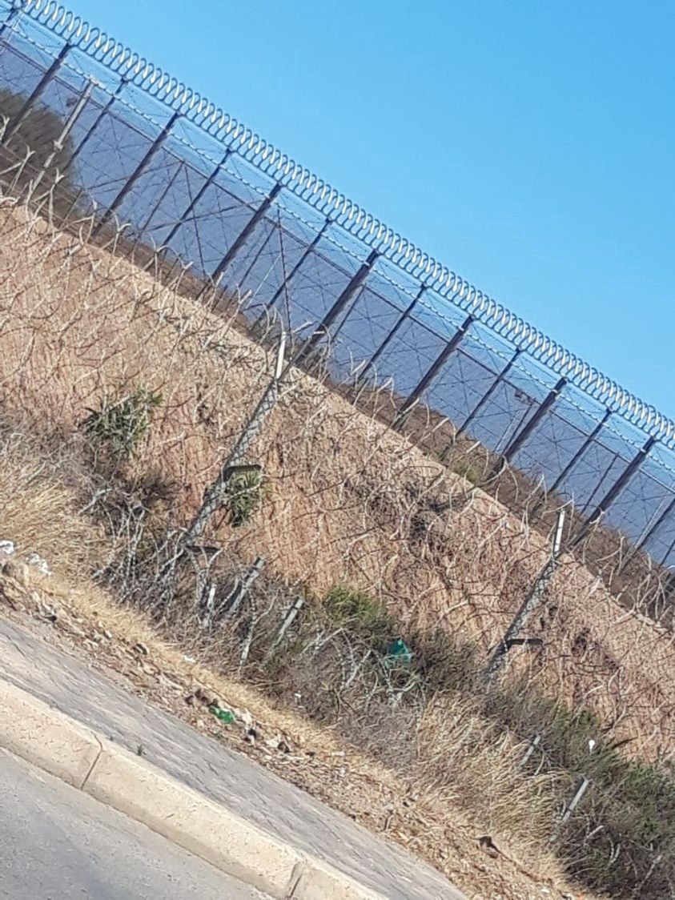

### AYS Weekend Digest 21–22/8/21: The crisis of solidarity at the Polish\-Belarusian border
### On walls and fences across the borders of Turkey and Greece / Countering deportations to Afghanistan — Italian national body for monitoring forced repatriation recalls the international protection obligations to which Italy is bound / Britain insisting on using offshore processing centers to accommodate \(imprison\) Afghans / & more news and updates

[Are You Syrious?](?source=post_page-----9f8670aaf441--------------------------------)

[Aug 23](ays-weekend-digest-21-22-8-21-the-crisis-of-solidarity-at-the-polish-belarusian-border-9f8670aaf441?source=post_page-----9f8670aaf441--------------------------------) · 10 min read

All rights reserved — Photo by: Jakub Kaminski, used via [InfoMigrants](https://www.facebook.com/InfoMigrants/?__cft__[0]=AZUm4Tyq4C1Ce8HPq5wEY_yaqRhmftLsFjyoV8MARdI0pi197_7YcEAhoaIjYQB13kb-B_Zx3cqPN-ZAOcKQFmhRaccHJ_TMJFdYVDRS04Hxxd51kl-JA2fICUJQ2M2QFBz4nXt3dCW3L--fck2hGrA3&__tn__=-UC*F) — border guards from Belarus preventing people from returning and Polish border guards not letting them into Poland\.
### FEATURE

**A group of 32 people from Afghanistan has been stuck in the no man’s land between Poland and Belarus for at least 13 days\.**

Polish border police do not allow them to enter the country and the Belarusian soldiers standing just behind them do not allow them to go back\. The refugees trapped on the border have asked not to be brought food, water or other things\. They want to cross the border and apply for asylum in Poland\. However, the border police have denied them their right to do that\. They are also preventing independent translators, lawyers, doctors and journalists from coming close to the group\. This morning, on Saturday, the border police pushed everybody offering solidarity and support 300m away from the border\. Now, the refugees are out of sight, the question is **what actions the police are trying to hide\.** According to the Polish ministry of the interior, since the beginning of August 1,342 people have been prevented from crossing the border\. What has happened with these people? Are they also trapped somewhere on the border between the Polish and Belarusian forces? Moreover, also since the beginning of August, 758 [people on the move](https://l.facebook.com/l.php?u=https%3A%2F%2Fnews.sky.com%2Fstory%2Fmigrants-stuck-in-no-mans-land-between-belarus-and-latvia-make-desperate-plea-for-help-we-are-broken-12387594%3Ffbclid%3DIwAR14wgm0Py1O_hdgSKYZVtSN2Kaf5ZowMnZuNAG9aeznNHQ1aEJYvn_pH3o&h=AT1KCEw6oGntR7Qf3XfpZdAuOuEjuX_pMqTPDQcdg9rQtlQpEiulf0uji1CQml0rxAS1YuQqZkARDj4HH1fpVmJLS8V_dwrzbYdDi9p_qlWeVr8Z79yFKRsSoVrdQY1lyZruqp7R-FselQ&__tn__=R]-R&c[0]=AT3_ObTGIMJqRQptcfdiKdvs1kUX9sESKHINItyRMmVBpELrq4HxUnmMNwL7hJkmATphZvdCTfPlk7l-Oi6RWlhl3fotqIyXlnci6DTfyfXTW0iSESnAAlpja8u8r0kjw3-_tK0DgChuwmUBKcyuhlU7USqE3ehOaxhicVFPNjpKCSKQWwKCfoxFT8ACyd1Gtmv3m79_ubfV) have been stopped and detained\. The government has artificially doubled the capacity of the detention centres by halving the space designated for one person from 4 to 2 m2 \. The government has sent 1,000 army troops to the border to “support” the border police, and 100 km of concertina wire has been put up along the border\. Legislative changes are being prepared to make push\-backs legal and criminalise irregular border crossing\. The right\-wing government is justifying these measures by representing the asylum seekers as a “threat” to national security\. 
However, **the local community has not given in to the hate propaganda of the government\.** Many have expressed empathy and solidarity with the people on the move, but they are scared to openly help them, afraid of the consequences from the border police\. Some people have also expressed anxiety about the increased military presence in the region\.

The increase in the movement across the Lithuanian, Latvian and Polish borders with Belarus came after Belarusian dictator, president Aleksandr Lukashenko, decided to oppose sanctions imposed on him by the EU\. He organised flights to Minsk for people seeking ways to reach EU countries\. From the Belarusian capital, they are simply brought to the borders\. Using the people on the move as pawns in his political game, Lukashenko wants to put pressure on the EU\.

So far, the answer of the EU member states that share a border with Belarus proves that they have a similar, or even smaller, amount of respect for the rights of the people\-on\-the\-move than the Belarusian dictator, Jakub Bieniasz of the Salam Lab writes\.
### AFGHANISTAN

While some EU countries calculate whether to formally receive 10 or 20 people from Afghanistan, out of millions in need of safety, Ugandan officials have confirmed the country will be receiving 145 evacuees from Afghanistan on Sunday, but it seems the country will be used as \(another\) transit point before the people are allegedly taken to the United States\.

Unless European states proactively work to negotiate a safe corridor out of the country, the majority of Afghan citizens will be left stranded, especially given the lack of political will for anything other than dispersion of responsibility, as we can witness in the media\.

Spain is now [offering itself as a hub for Afghans](https://amp.theguardian.com/world/2021/aug/20/spain-offers-itself-as-hub-for-eus-afghans?__twitter_impression=true&fbclid=IwAR3nlN9ZPcKxoR8QgbaFEszqXVGIK1-h7EIx5GrghAnQAVP94lhBX9Odn3o) who collaborated with the EU, as a port that will receive people who will then be sent out to other member states\. The first 36 will eventually be settled in Denmark, Germany, Poland and Lithuania, according to Spanish officials\.

In the meantime, while many Afghans have been struggling to be accepted as people worthy of the right to international protection, [across the so called Balkan Route](https://l.facebook.com/l.php?u=https%3A%2F%2Fwww.6yka.com%2Fnovosti%2Fne-mozemo-ljude-iz-afganistana-lansirati-na-mjesec-ko-ih-u-eu-zeli-primiti%3Ffbclid%3DIwAR14wgm0Py1O_hdgSKYZVtSN2Kaf5ZowMnZuNAG9aeznNHQ1aEJYvn_pH3o&h=AT1y7NBQ4D0VJFiZBU-qJuQjnROpKXJ5WsvduhwaBYXwzZwBBxetlhlhv9TWK-VLMw2NXVMKE7kdFbXpDaNEyPVmyFsnUmOSDUSdeMXCYVHiebhPv-598OPab_kRnvcVLgrzSSifngaH26OljDaAfjW1IR8jzg&__tn__=R]-R&c[0]=AT0Rmm3aKMi4H7dWIyMGYaXxPPic8z5eLvr5Zx-YkvDJ_Nx6hN32lShT7Lyaq8M9PSXzN6QHDmtu8Hx27d_UeuXJkJBcGB8_ZCT5eQAsNfN8YxuMaSpN4w7_kG-ZDfrSDvuKWnXy3-bsejEsXQ5OVYr31BzfCF8qjFxb1b4-t7dAAF-a2ojk8NPzoUlEElYpGGd9NZJPcLGL) , thousands are stranded and left on their own, while at the same time people reading the papers swear they want to help the Afghan people stranded in their country\.
### [Afghanistan \| VOICE — Amplifying Women And Girls In Crises](https://l.facebook.com/l.php?u=https%3A%2F%2Fvoiceamplified.org%2Fafghanistan%2F%3Ffbclid%3DIwAR3NGXax9qCKIWzxV2Xq715gwsfWv_bCpbG_vRrWyYzDSdrezlWW4bKjYYM&h=AT2KTg9tVgWdzADeik1HJjF1siQ5Zf19dox9Z5k9iPW4I1iOG7cjx_T8b0rvYAumq7DhHDugQB5Ph4mlpQ7gBVy96F2hlXAuJrJdd_29DkUZhYMxUYr0lM2wUkn_gntDp8NMsAN2kgu4eg&__tn__=R]-R&c[0]=AT0Rmm3aKMi4H7dWIyMGYaXxPPic8z5eLvr5Zx-YkvDJ_Nx6hN32lShT7Lyaq8M9PSXzN6QHDmtu8Hx27d_UeuXJkJBcGB8_ZCT5eQAsNfN8YxuMaSpN4w7_kG-ZDfrSDvuKWnXy3-bsejEsXQ5OVYr31BzfCF8qjFxb1b4-t7dAAF-a2ojk8NPzoUlEElYpGGd9NZJPcLGL)
### [We cannot turn our backs on Afghan women and girls Through decades of war, fundamentalist and patriarchal violence…](https://l.facebook.com/l.php?u=https%3A%2F%2Fvoiceamplified.org%2Fafghanistan%2F%3Ffbclid%3DIwAR3NGXax9qCKIWzxV2Xq715gwsfWv_bCpbG_vRrWyYzDSdrezlWW4bKjYYM&h=AT2KTg9tVgWdzADeik1HJjF1siQ5Zf19dox9Z5k9iPW4I1iOG7cjx_T8b0rvYAumq7DhHDugQB5Ph4mlpQ7gBVy96F2hlXAuJrJdd_29DkUZhYMxUYr0lM2wUkn_gntDp8NMsAN2kgu4eg&__tn__=R]-R&c[0]=AT0Rmm3aKMi4H7dWIyMGYaXxPPic8z5eLvr5Zx-YkvDJ_Nx6hN32lShT7Lyaq8M9PSXzN6QHDmtu8Hx27d_UeuXJkJBcGB8_ZCT5eQAsNfN8YxuMaSpN4w7_kG-ZDfrSDvuKWnXy3-bsejEsXQ5OVYr31BzfCF8qjFxb1b4-t7dAAF-a2ojk8NPzoUlEElYpGGd9NZJPcLGL)

[l\.facebook\.com](https://l.facebook.com/l.php?u=https%3A%2F%2Fvoiceamplified.org%2Fafghanistan%2F%3Ffbclid%3DIwAR3NGXax9qCKIWzxV2Xq715gwsfWv_bCpbG_vRrWyYzDSdrezlWW4bKjYYM&h=AT2KTg9tVgWdzADeik1HJjF1siQ5Zf19dox9Z5k9iPW4I1iOG7cjx_T8b0rvYAumq7DhHDugQB5Ph4mlpQ7gBVy96F2hlXAuJrJdd_29DkUZhYMxUYr0lM2wUkn_gntDp8NMsAN2kgu4eg&__tn__=R]-R&c[0]=AT0Rmm3aKMi4H7dWIyMGYaXxPPic8z5eLvr5Zx-YkvDJ_Nx6hN32lShT7Lyaq8M9PSXzN6QHDmtu8Hx27d_UeuXJkJBcGB8_ZCT5eQAsNfN8YxuMaSpN4w7_kG-ZDfrSDvuKWnXy3-bsejEsXQ5OVYr31BzfCF8qjFxb1b4-t7dAAF-a2ojk8NPzoUlEElYpGGd9NZJPcLGL)

> _“Any comprehensive approach to the current humanitarian and refugee crises must include the assurances that Afghans arriving in the EU will not be confined to hotspots or subjected to policies that compel their return to Turkey to seek asylum, a country from which they risk being forcibly deported to Afghanistan\. Currently, even unaccompanied Afghan children arriving in Greece from Turkey may be denied the right to seek asylum in Greece under the flawed premise that Turkey is safe for them\.” — [Kids in Need of Defense \(KIND\)](https://www.facebook.com/supportkind/?__cft__[0]=AZWe29hnLaSIIeLN1AJRZ9fk6dC9YNDCJWkucT8U1OugUiFeBtp5n_m--q4XDte7fVsh0xTmfia6lCn0oT8nN2aEveSgprfx0qH2k6uPViyNZIQjlVM1jJJ02bc_FSdNFo9CIoZ3FBGdS_d8zw7w6Q84&__tn__=kK-R)_ 

Afghans in Thessaloniki held a protest calling for support:
### TURKEY
### Closing up with more walls

A 243\-kilometre \(151\-mile\) concrete wall, topped with barbed wire and surrounded by trenches, is being erected along its 534\-kilometre frontier with Iran\. Turkish officials said 156 kilometres have already been built

_“We are resolutely implementing the measures we have taken to prevent irregular migration flows, together with 54 elements comprising security guards, commandos, and internal security teams just behind the border units,_ ” Deputy Commander of the Provincial Gendarmerie told reporters\.
### THE MEDITERRANEAN

The civilian aerial mission of Sea Watch, Moonbird, is back in action\.

> _With our two monitoring aircraft we can cover a large sea area, where we document human rights violations and report distress cases\._ 

Out of the 95 minors on board, 82 are unaccompanied\. Five of the children are under five years of age, and one is only two weeks old\. No child should experience this and wait longer in such circumstances\.

The crew is providing first aid, but the Nadir is not a rescue ship\. Therefore we ask MRCC Rome and RCC Malta to send a ship immediately\.
### Shipwrecked in front of the island of Lèvanzo

The body of a man was recovered at sea after a shipwreck close to Levanzi\. 
There were 22 people on the boat\. The patrol boats found five people, including the victim\. One of them, in severe hypothermia, needed to be transferred to the hospital in Trapani\. The others were tracked ashore by the carabinieri\.
### GREECE
### More walls and fences…

There are 11 cameras which can see 15km into Turkish territory, and of course, drones to deter people from crossing\. These are just some details of the infamous 25–27 km fence, [fiercely defended](https://www.theguardian.com/world/video/2021/aug/21/greek-minister-defends-wall-on-border-with-turkey-during-afghan-crisis-video?fbclid=IwAR2eQe2RoYdiH6hbYeefaMRCYjBjtYvZGV1IKFp9_WkvgWF-9SAsbrTuZFY) by the officials, described in detail through six [points](https://www.ethnos.gr/politiki/128955_froyrio-me-6-kiniseis-o-ebros-frahtis-ihobolistika-tethorakismena-paratiritiria) by the Greek media\.

Delay in issuing and renewing residence permits \(ID cards\)

MIT reports they have recently received many messages about the long delay in issuing and renewing residence permits\.

Unfortunately right now, after you print it takes 6 months to receive a residence permit, depending on which passport office \(police department responsible for issuing residence permits or travel papers\) you have printed your fingerprints\. Especially if you have received a side support status \(social acceptance\), you should try to provide your fingerprints for a residence permit as soon as possible, because your residence permit will only be valid for one year\.

MDM’s useful information material regarding COVID\-19 vaccination as well as the way to issue a valid vaccination certificate in Greek, English, French, Albanian, Farsi, Arabic and Urdu are available [**here**](https://mdmgreece.gr/emvoliasmos-covid19-enimerotiko-iliko/) \.

Prevented pushbacks

10prevented deportations, via their announcement to all competent authorities, of 109 asylum seekers by the Greek Helsinki Monitor \(1 together w the Greek Council of Refugees\) have been documented since March ’21, Racist crime watch reports:
### [10 αποτροπές απέλασης και αναγγελία στις αρχές 109 αιτούντων άσυλο από ΕΠΣΕ \(1 μαζί με ΕΣΠ\)…](https://racistcrimeswatch.wordpress.com/2021/08/21/1-1233/?fbclid=IwAR2lB8-f7ozuXDfoFOLk_d44eiPXUjPQtwU5sLl4q18WeAcRKx0x0F0IgaM)
### [20/08/2021: Αποτροπή απέλασης και αναγγελία σε αρχές 37 Κούρδων αιτούντων άσυλο από ΕΠΣΕ \(Λάρος\) 19/08/2021: Αποτροπή…](https://racistcrimeswatch.wordpress.com/2021/08/21/1-1233/?fbclid=IwAR2lB8-f7ozuXDfoFOLk_d44eiPXUjPQtwU5sLl4q18WeAcRKx0x0F0IgaM)

[racistcrimeswatch\.wordpress\.com](https://racistcrimeswatch.wordpress.com/2021/08/21/1-1233/?fbclid=IwAR2lB8-f7ozuXDfoFOLk_d44eiPXUjPQtwU5sLl4q18WeAcRKx0x0F0IgaM)

ITALY

Disembarkation in Lampedusa

Landings continue on Lampedusa, where 167 migrants from the sub\-Saharan region, Egypt and Bangladesh landed on board three boats, the Italian [media reported](http://www.rainews.it/dl/rainews/articoli/Naufraga-barchino-davanti-Isola-di-Levanzo-un-morto-1a25c12b-7296-4445-b84e-d99ee14382da.html) \.

The two groups, disembarked on the Favaloro pier, were taken to the hotspot where there are 625 people against 250 seats available\. The first boat, carrying 57 people from the sub\-Saharan area, was rescued about 2 miles from the port\. The second, about 10 meters long, was blocked by a patrol boat of the Guardia di Finanza at 6 miles: on board were 55 men from Bangladesh and Egypt\. Another boat, then, with 55 migrants on board, was rescued 4 miles southeast of the island\. The Pv9 patrol boat of the Guardia di Finanza blocked the 10\-meter boat, transhipping the men who said they came from Bangladesh\. Yesterday there were three landings for a total of 56 migrants\.

Ventimiglia continues being an example of the brutality of the migratory policies implemented by the EU states

In the border city, many people continue to suffer severe limitations of their personal freedom, being, on the one hand, subject to rejections all along the border and, on the other, living in extremely precarious and marginal conditions\.

In the face of this situation, the solidarity movement is trying every day to support people on the move, including through the distribution of clothes, essential goods and phone charging, [Progetto20k](https://www.facebook.com/progetto20k/?__cft__[0]=AZWvrynV-IRWiT4VGMplN3KPLEYAq_FZvVn96T70Efwr66yopQxuxU8YQgKyKPoI2sGqfSgWTdvKLaFglsgyhtDNJ_ncFWF08jzIONmCIxsIKF1w5EVNVPfeMWPcyQ3h0qVRKJ0n1wFQ8h97UyX5yfvD&__tn__=-UC%2CP-R) reports\.

We need the help of everyone to collect material necessary to carry on our daily activities\.

For donations: IBAN: IT 48R0 501 81110000001 671 69461 6946
Also wanted are: Shirts, Shorts, Sweatshirts, Hats, Panties, Shoes, Socks, Backpacks, Mountain technical material, Soaps / soaps, Toothbrushes and toothpaste, Shaving foam and razors, Masks, Sleeping bags, K\-way, Phones and chargers\. Contact [Progetto20k](https://www.facebook.com/progetto20k/?__cft__[0]=AZWvrynV-IRWiT4VGMplN3KPLEYAq_FZvVn96T70Efwr66yopQxuxU8YQgKyKPoI2sGqfSgWTdvKLaFglsgyhtDNJ_ncFWF08jzIONmCIxsIKF1w5EVNVPfeMWPcyQ3h0qVRKJ0n1wFQ8h97UyX5yfvD&__tn__=-UC%2CP-R) for more info\.

Recalling the international protection obligations

In 2020, a forced repatriation of an Afghan citizen was carried out in Italy, seven people were turned back at the border to Afghanistan and 327, including four women, were readmitted to Slovenia\. Five passed through the CPR system\.

There is an urgent need for an urgent rethinking of border control activities for Afghan citizens and an overall reorganization of reception policies also at European level, especially as regards the so\-called Balkan route\.

SPAIN

41people have disembarked on the Isla de Tierra, an islet of Spanish sovereignty off the coast of Al Hoceima, after leaving Morocco in a boat with the intention of reaching Spain\. Among the stranded people there are 20 women, three of them pregnant and six children, two of them babies less than one year old\. Many of the migrants are from Burkina Faso, Mali or the Democratic Republic of the Congo, it is [reported](https://cadenaser.com/ser/2021/08/21/sociedad/1629570968_230275.html?ssm=tw&fbclid=IwAR2vD0GwP6fdj3atkuD1P0b6dzG2imNgih-MFt5-mZqkO0y8sACEVH6hoko) \. AMDH said these people were forced back from Spanish soil to Morocco — without any asylum procedure, without lawyers, without translators & without respecting the will and the right of the people to apply for asylum\.

A large mobilization of the Moroccan gendarmerie was seen in the area, AMDH reports\. They also noted that there is big media pressure to create an impression that there is an imminent threat at the Melilla crossing, while there are no big groups as in the previous years\.

Photos: [Association Marocaine des Droits Humains — Section Nador](https://www.facebook.com/AmdhNador/?__cft__[0]=AZVY0jGyZuxrMbyMDZaCWxVfdmKzAMbzosKtN8F_LnXc2aGvRP5KV2oqulpFx7WfGGIY5zvEmJoogOUZgltffZIKMF2sgJkuoYAYMJXNFEHgoCY1z5Fh_Ror4pasGI8aLRUAIMFod1J6DXUcIY57D9ap&__tn__=-UC%2CP-R)

Sufian, a 14\-year\-old Moroccan minor in Ceuta, explains why he would rather live on the street than be mistreated in a CETI:
### [Sufian: “Prefiero vivir en la calle que estar en un centro de Menores”](https://l.facebook.com/l.php?u=https%3A%2F%2Felforodeceuta.es%2Fsufian-prefiero-vivir-en-la-calle-que-estar-en-un-centro-de-menores%2F%3Ffbclid%3DIwAR0QvWNIfvj7GZb4VMlhILr-2obPTY21eqai_ZtHJl5OiJ8g6Rs52vu1XBA&h=AT0ATu_we5ZrGQ220ME20zDK89U34ZoLLBvT3EYe8r9Ec_JRVfbq2_4kWlJ4N5TgR_QWMj7Ylpp7gvGP_X1Uz-YMIUur6eLXBtILdklUgm05ML-yMztDfr6lSg0AEaEungGIGlm_FqFJ8ggsA2K7Yb8EGOj4FQ&__tn__=R]-R&c[0]=AT0wuZC8DZTZvIxArsn94lIz65TKtyxU9CpCNvBBHGz5mB85CoUuH3XbKQzrFj4nFbAntlebTQRatKht83Yva5ZiRkFRY6Q7N5KL1N75vMcbxnd6p5e-l292i5dvoYNa2jZ33tI45SXVtZDbbLfvrdnneWRTjxRbEqM9wpwZoEE8YZUWsf_TGgJ0XiqurAQpDoa6ZKJ_jpLY)
### [Se llama Sufian y a sus 14 años ya tiene claro que su vida no está en Marruecos\. Echa de menos a su madre\. Algún día…](https://l.facebook.com/l.php?u=https%3A%2F%2Felforodeceuta.es%2Fsufian-prefiero-vivir-en-la-calle-que-estar-en-un-centro-de-menores%2F%3Ffbclid%3DIwAR0QvWNIfvj7GZb4VMlhILr-2obPTY21eqai_ZtHJl5OiJ8g6Rs52vu1XBA&h=AT0ATu_we5ZrGQ220ME20zDK89U34ZoLLBvT3EYe8r9Ec_JRVfbq2_4kWlJ4N5TgR_QWMj7Ylpp7gvGP_X1Uz-YMIUur6eLXBtILdklUgm05ML-yMztDfr6lSg0AEaEungGIGlm_FqFJ8ggsA2K7Yb8EGOj4FQ&__tn__=R]-R&c[0]=AT0wuZC8DZTZvIxArsn94lIz65TKtyxU9CpCNvBBHGz5mB85CoUuH3XbKQzrFj4nFbAntlebTQRatKht83Yva5ZiRkFRY6Q7N5KL1N75vMcbxnd6p5e-l292i5dvoYNa2jZ33tI45SXVtZDbbLfvrdnneWRTjxRbEqM9wpwZoEE8YZUWsf_TGgJ0XiqurAQpDoa6ZKJ_jpLY)

[l\.facebook\.com](https://l.facebook.com/l.php?u=https%3A%2F%2Felforodeceuta.es%2Fsufian-prefiero-vivir-en-la-calle-que-estar-en-un-centro-de-menores%2F%3Ffbclid%3DIwAR0QvWNIfvj7GZb4VMlhILr-2obPTY21eqai_ZtHJl5OiJ8g6Rs52vu1XBA&h=AT0ATu_we5ZrGQ220ME20zDK89U34ZoLLBvT3EYe8r9Ec_JRVfbq2_4kWlJ4N5TgR_QWMj7Ylpp7gvGP_X1Uz-YMIUur6eLXBtILdklUgm05ML-yMztDfr6lSg0AEaEungGIGlm_FqFJ8ggsA2K7Yb8EGOj4FQ&__tn__=R]-R&c[0]=AT0wuZC8DZTZvIxArsn94lIz65TKtyxU9CpCNvBBHGz5mB85CoUuH3XbKQzrFj4nFbAntlebTQRatKht83Yva5ZiRkFRY6Q7N5KL1N75vMcbxnd6p5e-l292i5dvoYNa2jZ33tI45SXVtZDbbLfvrdnneWRTjxRbEqM9wpwZoEE8YZUWsf_TGgJ0XiqurAQpDoa6ZKJ_jpLY)

UK

**Britain is insisting on using offshore processing centres to accommodate \(imprison\) Afghan refugees it “has an obligation to”, as is reported\.**

Pakistan and Turkey is where Britain plans to establish offshore asylum centres for those Afghans UK **“has an obligation to”** , as the defence secretary said\. However, Turkey said it had not been approached and would reject any approach that was made\.

British officials already acknowledge that it is virtually impossible to evacuate people coming from outside Kabul, although Afghans with a claim have told charity workers they would risk crossing the country if they knew they had a flight\.

[Britain has also agreed to take 20,000 Afghan refugees](https://www.theguardian.com/world/2021/aug/17/uk-to-take-20000-afghan-refugees-over-five-years-under-resettlement-plan) in a separate scheme announced on Tuesday, 5,000 of whom will be in the first year\. Priority will be given to groups who are most at risk of human rights abuses, such as women, girls and those from religious minorities, The Guardian [reported\.](https://www.theguardian.com/uk-news/2021/aug/22/uk-plans-offshore-asylum-centres-in-pakistan-and-turkey-for-afghans?fbclid=IwAR039mD8Pqb9CnFsePMcehe7XMS6HhF15wOivPnFqP6-66L9ne36M6GjC4I)

“Why has the Home Secretary still not granted immediate recognition of refugee status to the 3,000 or so Afghans who are waiting for a decision in our asylum system right now?

What could possibly be the hold up?” — J\. Crisp asks on Twitter

Upcoming protest against deportation flights on 28th August:
### WORTH READING
- The recent history of the British political landscape has been characterised by a series of decisions that have contributed to widening socio\-economic divisions and inequality\. The Nationality and Borders Bill is no exception and has been brought in under the repeated ‘take back control’ mantra\. Under the Brexit hangover, and still attempting to prove to the public that borders are the primary answer to the ills of the British people, the Conservative government has committed to the biggest overhaul of the immigration system in its history\. Needless to say, this overhaul shows blatant disregard for the rights of people crossing borders and is dedicated instead to finding underhand routes around international human rights legislation\. 
_Read our latest AYS Special, a piece by [No Borders Manchester](https://nobordersmcr.com/) :_

### [AYS Special from the UK: The British Nationality and Borders Bill](ays-special-from-the-uk-the-british-nationality-and-borders-bill-4c2e8d637451)
### [The recent history of the British political landscape has been characterised by a series of decisions that have…](ays-special-from-the-uk-the-british-nationality-and-borders-bill-4c2e8d637451)

[medium\.com](ays-special-from-the-uk-the-british-nationality-and-borders-bill-4c2e8d637451)
- The EU\-Afghanistan Cooperation and a New Afghan Exodus:

### [The EU\-Afghanistan Cooperation and a New Afghan Exodus](https://blog.fluchtforschung.net/the-eu-afghanistan-cooperation-and-a-new-afghan-exodus/?fbclid=IwAR23IlDktXth8kET4QSzP13vZYjuml1pvjvdaeBQJVibFp-HxzzZNLs0Nzw)
### [The swift collapse of the Afghan government and the Taliban’s military takeover came as a surprise for many in the…](https://blog.fluchtforschung.net/the-eu-afghanistan-cooperation-and-a-new-afghan-exodus/?fbclid=IwAR23IlDktXth8kET4QSzP13vZYjuml1pvjvdaeBQJVibFp-HxzzZNLs0Nzw)

[blog\.fluchtforschung\.net](https://blog.fluchtforschung.net/the-eu-afghanistan-cooperation-and-a-new-afghan-exodus/?fbclid=IwAR23IlDktXth8kET4QSzP13vZYjuml1pvjvdaeBQJVibFp-HxzzZNLs0Nzw)

**Find daily updates and special reports on our [Medium page](https://medium.com/are-you-syrious) \.**

**If you wish to contribute, either by writing a report or a story, or by joining the info gathering team, please let us know\.**

**We strive to echo correct news from the ground through collaboration and fairness\. Every effort has been made to credit organisations and individuals with regard to the supply of information, video, and photo material \(in cases where the source wanted to be accredited\) \. Please notify us regarding corrections\.**

**If there’s anything you want to share or comment, contact us through Facebook, Twitter or write to: areyousyrious@gmail\.com**

_Converted [Medium Post](https://medium.com/are-you-syrious/ays-weekend-digest-21-22-8-21-the-crisis-of-solidarity-at-the-polish-belarusian-border-cb2f9d162a68) by [ZMediumToMarkdown](https://github.com/ZhgChgLi/ZMediumToMarkdown)._
