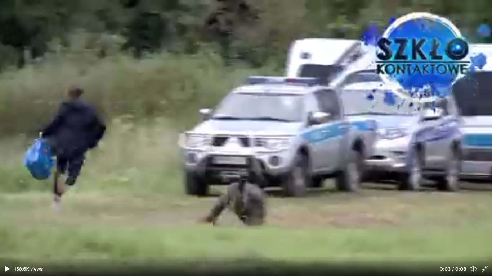

### AYS Daily Digest 25/08/2021: Still no support for people stuck at the Polish border
#### For two weeks now, a group of 30 people has been stuck in no\-mans\-land at the border between Poland and Belarus // Interim measures ordered against Poland and Latvia by ECHR // Afghanistan: Chaos and despair at the airport as evacuation flights end // New attacks in northeast Syria // Defund Frontex campaign started // Alarm Phone wins human rights award // Updates from the sea // Greece: refugees fined €5,000 for not bringing COVID tests // Various groups in fear of pushback

Screenshot of Polish MP trying to break police barrier to support people stuck at the border
### FEATURE Poland: People still stuck at the border without protection, while installation of fence is announced

Poland is the latest European country to join the club of the border\-fence building countries who are preventing people from entering and effectively using their right to apply for asylum\. [The Polish Defence Minister announced that a 2\.4 meter high wall will be installed at the border with Belarus](https://euobserver.com/world/152711?fbclid=IwAR07GPOjNPtdDh7-BSfwFEGtgttrdrD4ndBGJ5eUcdNVfToSdZxe68Qxyk4) , following the model of the Hungarian fence built in 2015\. In a press conference on 23 August, the Minister used war\-like and racist rhetorics when speaking about refugees\. A 100\-km razor\-wire barrier has already been erected in recent weeks\.

[Meanwhile there is still no change for the group of about 30 people who are stuck inbetween the Polish and the Belarusian borders at Usnarz Górny\.](https://www.dw.com/en/afghan-migrants-trapped-at-the-border-between-poland-and-belarus/a-58973715?maca=en-Twitter-sharing) While the Polish police won’t allow them entrance, Belarusian military won’t allow them to go back\. The situation has been unchanged for two weeks now, even though they clearly stated their intention of claiming asylum in Poland\. They are completely without protection from rain and cold, while the Polish police is preventing doctors, journalists, lawyers and activists from getting through to them to provide support\. [The UNCHR representative in Poland called on the country](https://www.unhcr.org/pl/13303-unhcr-apeluje-o-zakonczenie-impasu-na-granicy-polsko-bialoruskiej.html) , asking them to:

> provide these people with access to the territory, immediate medical care, legal aid, and psychological and social support\. Access to territory and asylum should be granted in accordance with the obligations arising from the Constitution of the Republic of Poland and national and international law\. 

■■■■■■■■■■■■■■ 
> **[Claudia Ciobanu](https://twitter.com/Claudia_Warsaw) @ Twitter Says:** 

> > At the border with Belarus, in Usnarz Gorny, we are witnessing 2 parliamentarians trying to bring medicines to 32 migrants stuck on the border for over 2 weeks. It's very cold already, 5 of the migrants are sick, they drink water from the nearby river. https://t.co/QdA5m9kqco 

> **Tweeted at [2021-08-24 18:35:48](https://twitter.com/claudia_warsaw/status/1430237421489229832).** 

■■■■■■■■■■■■■■ 

While the situation remains intractable, Polish Member of Parliament Franek Sterczewski took action himself by trying to break through the police barrier to provide the group with urgently needed supplies\.

■■■■■■■■■■■■■■ 
> **[Daphne Tolis](https://twitter.com/daphnetoli) @ Twitter Says:** 

> > Polish MP @[f_sterczewski](https://twitter.com/f_sterczewski) reportedly broke through a cordon of border and police forces in order to provide water, medicine and food supplies to migrants caught in a standoff at the Polish-Belarusian border. https://t.co/5ACxEh1ZN3 

> **Tweeted at [2021-08-25 06:27:26](https://twitter.com/daphnetoli/status/1430416508342185984).** 

■■■■■■■■■■■■■■ 

At the same time, Polish Prime Minister Mateusz Morawiecki thanked the Polish border guards for their action, and claimed they were in full compliance with the EU Commission\.

The European Court for Human Rights however had a different stance on this\. In a interim measures decision published on Wednesday, the Court ordered Polish and Latvian authorities to “provide all the applicants with food, water, clothing, adequate medical care and, if possible, temporary shelter\.” However the Court further stated that this must not be understood as “requiring that Poland or Latvia let the applicants enter their territories\.” The Court also
noted that this decision was taken in accordance with the fact that the “Contracting States have the right, as a matter of well\-established international law and subject to their treaty obligations, including the Convention, to control the entry, residence and expulsion of aliens\.”

This final notion sparks fears that the Court could once again follow a line of argument that in fact enforces borders and weakens the rights of refugees, as it has earlier in other cases\.

■■■■■■■■■■■■■■ 
> **[ECHR CEDH](https://twitter.com/ECHR_CEDH) @ Twitter Says:** 

> > Interim measures Poland-Latvia-Belarus border
[hudoc.echr.coe.int/app/conversion…](https://hudoc.echr.coe.int/app/conversion/pdf/?library=ECHR&id=003-7100942-9612632&filename=Interim%20measures%20Poland-Latvia-Belarus%20border.pdf)
#ECHR #CEDH #ECHRpress 

> **Tweeted at [2021-08-25 15:50:01](https://twitter.com/echr_cedh/status/1430558089464500235).** 

■■■■■■■■■■■■■■ 

For more information on the situation along the Belarusian border, see:

### AFGHANISTAN
#### Chaos and despair at Kabul airport

Never has the word “deadline” had such a bitter meaning: With the US\-troops withdrawal scheduled for 31 August, the chances for people trying to leave Afghanistan are slimmer by the hour\. Belgium has already ended its evacuation mission, Germany will probably do so on Thursday, 26 August, France will follow on Friday\. The security situation at the airport is disastrous, various countries are issuing warnings of terrorist attacks\. However, as this is the only way out, people continue to arrive\.

■■■■■■■■■■■■■■ 
> **[Ian Pannell](https://twitter.com/IanPannell) @ Twitter Says:** 

> > Devastating scenes at Kabul airport. Knee deep in sewage, waving their papers, begging to be let in. @[ABC](https://twitter.com/ABC) #Kabul #Taliban #Afghanistancrisis https://t.co/BZccCe1vu8 

> **Tweeted at [2021-08-25 08:20:07](https://twitter.com/ianpannell/status/1430444866216005633).** 

■■■■■■■■■■■■■■ 

Meanwhile, some of the people who were evacuated by US\-troops have been brought to Ramstein US Air Base in Germany, which has been called the “heart of US drone warfare”, as it hosts the centre from which the drone attacks over Afghanistan were conducted\. According to journalist Emran Feroz, thousands of Afghans were killed in drone strikes directed from this base during the US intervention:

■■■■■■■■■■■■■■ 
> **[Emran Feroz](https://twitter.com/Emran_Feroz) @ Twitter Says:** 

> > Indeed, great news. A note: Ramstein Air Base is also the "heart of US drone warfare" (~Daniel Hale). 1.000s of Afghan babies and parents have been murdered through it during the last 20y. Drone attacks fueled extremism and militantism in many parts of Afghanistan. 

> **Tweeted at [2021-08-24 14:46:14](https://twitter.com/emran_feroz/status/1430179647707402240).** 

■■■■■■■■■■■■■■ 

[This article explains the legal background](https://www.proasyl.de/news/die-wichtigsten-fakten-zur-aufnahme-aus-afghanistan-nach-%c2%a7-22-satz-2-aufenthg/?fbclid=IwAR3LuwNEV00lBFMQRFeXi4yJJjvVFwKKbuQyF--ufmmX-wmXPTB-styOKRU) for former employees of international troops or NGOs as well as other persons at high risk to be evacuated to Germany\. [This article sets out how](https://taz.de/Familiennachzug-aus-Afghanistan/!5791409/) almost impossible it is for people to get family reunification in Germany, with German bureaucracy endangering lives\.
### SYRIA

While all eyes are on Afghanistan, Turkish President Erdoğan is attacking Kurdish areas in northeast Syria\. Kongra Star, the Kurdish women’s liberation organisation, sent a letter to the United Nation asking for the prevention of attacks and hostilities, the creation of a no\-fly zone, investigation of crimes committed by the Turkish occupation and an end to the occupation\.

■■■■■■■■■■■■■■ 
> **[Kongra Star Women's Movement Rojava](https://twitter.com/starrcongress) @ Twitter Says:** 

> > We wrote an Letter to @[UN](https://twitter.com/UN) calling for urgent action against #TurkishWarCrimes in NESyria. 
We call on all democratic forces to raise their voices.

▪️Prevent of attacks &amp; hostilities
▪️No-fly zone
▪️Investigation of crimes committed by🇹🇷
▪️End of Turkish occupation https://t.co/0aWdXd9V93 

> **Tweeted at [2021-08-23 06:00:00](https://twitter.com/starrcongress/status/1429684831722430468).** 

■■■■■■■■■■■■■■ 

### SEA
#### Defund Frontex — build civilian rescue\!

> “Over 18,709 people have drowned in the Mediterranean Sea since 2015\. Their fundamental right to life was denied to them by the EU and its Member States, whose conscious, deliberate and carefully planned policies continue to condemn innocent lives at sea to date\.” 

This statement is from the new [Defund Frontex campaign](https://sea-watch.org/wp-content/uploads/2021/08/DefundFrontex_briefingpaper.pdf?fbclid=IwAR1l0HzbPuirDT-lAQV6MROtfJmEi0cKuClBQnLJI56ITcvh3NfaVsrEDg8) that is supported by various groups, among them the Border Violence Monitoring Network of which AYS is a member\.

■■■■■■■■■■■■■■ 
> **[Border Violence Monitoring Network](https://twitter.com/Border_Violence) @ Twitter Says:** 

> > 1/#DefundFrontex, Build a European 
Search and Rescue programme. 
By defunding the Frontex operational branch, currently the border agency’s main instrument to enforce and promote violence and death at sea, the EU and its Member States can and must choose to protect life instead. https://t.co/LrCkV1ZOuv 

> **Tweeted at [2021-08-24 15:14:34](https://twitter.com/border_violence/status/1430186779693432834).** 

■■■■■■■■■■■■■■ 

Frontex is currently the EU’s most powerful agency, with a €5\.6 billion budget and it will have its own army of 10,000 border guards by 2027\.

However, Frontex has a clear mandate to “protect” borders instead of saving the lives of humans\. \#DefundFrontex calls to use the resources available to Frontex instead to create a state\-funded search and rescue operation for the Mediterranean Sea\. It further calls for a stop to cooperation with the so\-called Libyan Coast Guard and an end to criminalization of civilian rescue operations and human rights defenders\.
#### Alarm Phone wins human rights award

We regularly present important information gathered by Alarm Phone in the Daily Digests\. The group has now been awarded the German NGO Pro Asyl’s human rights award\.

> „The human rights award honours three people who consistently defend the right to life\. The work of the Alarm Phone is of outstanding importance, because the EU and its member states are applying anti\-refugee measures in the Mediterranean and a policy of letting people die,“ 

says Karl Kopp, board member of the foundation and head of the European department of PRO ASYL\.

The network was founded seven years ago\. By now it has about 200 active members on both sides of the Mediterranean Sea\. Since 2014, the team has been in contact with 3,700 boats\. Alarm Phone does not operate its own rescue ships — whenever they receive a call from a boat at sea, they send alerts to all relevant actors in the area such as coast guards, civilian rescue ships or cargo ships\. They keep in contact with the people on the boats as well as possible, send geodata, offer hope\. But this is not always enough\. In many cases, communications break down at one point and only later does the team learn that yet another shipwreck has taken place\. Often, they are contacted by relatives asking for the whereabouts of their loved ones\.

The award will be conferred by Tineke Strik on 28 August\. [Live straming will be available here\.](https://www.youtube.com/watch?v=tXpNL8NSP_4)
#### Rescues and pullbacks

Pilotes Volontaires reported on two boats carrying 60 people on board that were rescued thanks to help from the NGO ship Nadir\. Another boat was intercepted by the so\-called Libyan Coast Guard\. The people were returned to Libya\.

■■■■■■■■■■■■■■ 
> **[Pilotes Volontaires](https://twitter.com/PVolontaires) @ Twitter Says:** 

> > 🔴Des tentatives de traversées toujours nombreuses. 
➡️Hier, 60 personnes (2 bateaux) ont été secourues, notamment grâce au voilier #Nadir ONG @RESQSHIP .
➡️Aujourd'hui, nous avons assisté à l'interception d'une embarcation par les garde-côtes libyens.
👉 [pilotes-volontaires.org/.../formulaire…](https://www.pilotes-volontaires.org/.../formulaire-de-don-1/) https://t.co/BWVH8zvIU0 

> **Tweeted at [2021-08-25 16:15:21](https://twitter.com/pvolontaires/status/1430564463510532104).** 

■■■■■■■■■■■■■■ 

The Sea\-Watch aerial reconnaissance meanwhile spotted 11 boats with people on board as well as six empty boats\.

■■■■■■■■■■■■■■ 
> **[Sea-Watch International](https://twitter.com/seawatch_intl) @ Twitter Says:** 

> > 11 boats with countless people on board were spotted by our #Moonbird yesterday - many of them were illegally pulled back to #Libya. In addition, our crew sighted 6 empty boats, of which we currently do not know what happened to the people who were on board. https://t.co/JqfuDJnFrX 

> **Tweeted at [2021-08-24 15:34:48](https://twitter.com/seawatch_intl/status/1430191871415005186).** 

■■■■■■■■■■■■■■ 

### GREECE
#### Refugees fined €5,000 for not bringing a COVID test

Its hard to find words for how racist and cruel European countries get in trying to harass people on the move\.

According to the n [ewspaper Efsyn](https://www.efsyn.gr/ellada/koinonia/307513_katatregmenoi-kai-xerizomenoi-min-xehasete-na-kanete-test) , authorities in Chios have now fined refugees arriving to the island by boat with €5,000 fines for not bringing COVID tests or vaccination certificates\. In total, 25 refugees who landed on Chios 20 days ago were fined €125,000 by the Chios Police Department\.

According to Efsyn, “ _these fines will be deducted from the allowance available by European Union funds for people seeking asylum to cover basic needs of their daily lives_ \.”
#### Man tries to set himself on fire

On Wednesday afternoon, an Afghan man tried to set himself on fire in front of the U\.S\. Embassy in Athens, according to [newspapers\.](https://www.ekathimerini.com/news/1166851/afghan-attempts-to-set-himself-alight-outside-us-embassy-in-athens/?utm_source=dlvr.it&utm_medium=twitter) The man poured liquid over himself but was immobilised by security forces before being able to set himself on fire\. He has been taken into custody\.
#### People arrived and are now in danger of a pushback

Vasilis Tsarnas, member of the Greek Helsinki Monitor, gave updates about two groups of people who arrived in Greece and fear a pushback\.

The first case concerns two Kurdish people from Turkey who arrived via the Evros river\. Various actors were informed in order to prevent a pushback, amongst them the Greek Helsinki Monitor, the UN Hight Commissioner for Refugees and the Greek Ombudsman\. The two people were active with the leftist and Kurdish dominated HDP party and even brought reference letters from colleagues, proving the critical situation and their reasons to flee\.

**Update: According to an [article published today in the early morning](https://www.efsyn.gr/ellada/dikaiomata/307721_hthes-zitisan-asylo-simera-agnooyntai) \(26 August\), the whereabouts of these two people are not clear\.** All communication has been lost, they are not answering their phones and the police won’t give out any information\. Their last known location was Kyprinos Police Station on Tuesday morning\. According to what is known, they were then taken to Border Guard Department in Heimonio instead of the Reception & Identification Center\. Apparently a case has been filed against them for illegal entry, but they do not have access to a lawyer\.

In the second case, 22 people arrived on Farmakonisi, an uninhabited island, on Tuesday morning\. In this case too, the Greek Helsinki Monitor informed the UNCHR, amongst others, in order to prevent them from being pushed back\. They were later transferred to the Reception & Identification Center on Leros\.

■■■■■■■■■■■■■■ 
> **[Vassilis Tsarnas](https://twitter.com/VassilisTsarnas) @ Twitter Says:** 

> > #Greece
"The 22 immigrants of African origin, who disembarked &amp; were found trapped yesterday morning in Farmakonisi, are being transported to the Reception &amp; Identification Center of Leros"
We had informed the authorities concerning 9 of them 🔽#RefugeesGr
[ertnews.gr/perifereiakoi-…](https://www.ertnews.gr/perifereiakoi-stathmoi/notio_aigaio/sti-lero-metaferontai-oi-22-metanastes-poy-egklovistikan-sto-farmakonisi/) 

> **Tweeted at [2021-08-25 12:21:01](https://twitter.com/vassilistsarnas/status/1430505493576003588).** 

■■■■■■■■■■■■■■ 

### BALKANS
#### BVMN monthly report for July is out

The Border Violence Monitoring Network published its latest Monthly Report, with a special focus on pushback trends from Bulgaria and the way rivers become a life\-threatening bottleneck for people on the move\. In July, a five\-year old boy from Afghanistan drowned in the Una river running between Bosnia and Herzegovina and Croatia when his family tried to cross the river in an attempt t avoid o apprehension and pushback by police at other entry points\.

### LITHUANIA
#### Commissioner for Human Rights calls on Lithuania to ensure rights of people on the move

[The Council of Europe Commissioner for Human Rights, Dunja Mijatović, send a letter to Lithuania’s Prime Minister, Ingrida Šimonytė](https://rm.coe.int/letter-to-ms-ingrida-simonyte-prime-minister-of-lithuania-by-dunja-mij/1680a37aae) , calling for the country’s responses to the rising number of refugees to be fully compliant with the country’s human rights obligations, in particular by ensuring fair asylum procedures and preventing summary returns without adequate safeguards\.

The Commissioner expresses her concern about newly adopted amendments to the Law on the Legal Status of Aliens and accompanying legislation, including the removal, in emergency situations, of significant safeguards in the asylum procedure, which would pose a threat to upholding the principle of non\-refoulement and the right to an effective remedy, as well as affecting the position of vulnerable persons\. The Commissioner also notes that the way newly arrived asylum seekers and migrants are accommodated runs the risk of becoming de facto detention\. Furthermore, she highlights reported instances of summary returns to Belarus of persons who have attempted to enter Lithuania in an irregular manner\.

> “I recall that Lithuania remains bound to ensure that its actions continue to comply with the international instruments to which it is a party, in particular the ECHR” 

### UK
#### Protests to demand TUI to stop cooperation in deportations with Home Office

■■■■■■■■■■■■■■ 
> **[SOAS Detainee Support (SDS)](https://twitter.com/sdetsup) @ Twitter Says:** 

> > 🚨5 DAYS TO GO🚨
On August 28th we will come together across the country to demand that @[TUIUK](https://twitter.com/TUIUK) end their violent collaboration with the Home Office. 
✊Find your local action on the map and join us! #TUIDropDeportations https://t.co/QlWo0QQGk0 

> **Tweeted at [2021-08-23 17:05:28](https://twitter.com/sdetsup/status/1429852300550545416).** 

■■■■■■■■■■■■■■ 

**Find daily updates and special reports on our [Medium page](https://medium.com/are-you-syrious) \.**

**If you wish to contribute, either by writing a report or a story, or by joining the info gathering team, please let us know\.**

**We strive to echo correct news from the ground through collaboration and fairness\. Every effort has been made to credit organisations and individuals with regard to the supply of information, video, and photo material \(in cases where the source wanted to be accredited\) \. Please notify us regarding corrections\.**

**If there’s anything you want to share or comment, contact us through Facebook, Twitter or write to: areyousyrious@gmail\.com**

_Converted [Medium Post](https://medium.com/are-you-syrious/ays-daily-digest-25-08-2021-still-no-support-for-people-stuck-at-the-polish-border-fc4e2f34dd01) by [ZMediumToMarkdown](https://github.com/ZhgChgLi/ZMediumToMarkdown)._
