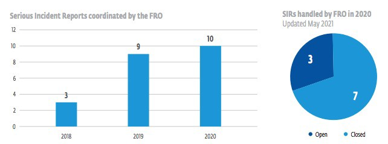

### AYS SPECIAL: The First Frontex Fundamental Rights Report, only 10 years late

 \)](assets/e96ac201c64d/1*A-nVyqGWPs6irEMNVfbirA.jpeg)

\(Photo Credit: [@baphometx](https://twitter.com/baphometx) \)

Originally introduced by [Regulation 1168/2011](https://zenodo.org/record/3967784#.YSpeqEvisdV) , Frontex has finally managed to hire a Fundamental Rights Officer and keep them in post long enough to [write a report](https://frontex.europa.eu/assets/Key_Documents/FRO_reports/FRO_Annual_Report_2020.pdf) \. To make the topic clear, and show that they have understood that Frontex should be doing something about Fundamental Rights, they’ve used the phrase 249 in a 28 page document, despite the fact they have also listed and explained associated acronyms such as ‘Fundamental Rights Officer’ or FRO\. In case that’s still not clear, here’s their explanation:

> The report presents an overview of fundamental rights\-related activities and the role of the Fundamental Rights Officer, describing the structures and instruments put in place as well as actions taken to contribute to ensure compliance with fundamental rights, to translate fundamental rights into concrete measures and promote an environment conducive to respect for and promotion of fundamental rights\. 

Got it? So actually the Fundamental Rights Officer is essentially going to tell us what their job is\. And in case that’s still not clear, let’s go over it again:

> this report provides unique insights into the role of the Fundamental Rights Officer and the work of the Fundamental Rights Office 

#### The Serious Stuff

The report, unsurprisingly, refers directly to the EU Charter of Fundamental Rights, a few of the [articles of the charter](https://fra.europa.eu/en/eu-charter/article/18-right-asylum) are particularly relevant:

> Article 4 — Prohibition of torture and inhuman or degrading treatment or punishment — No one shall be subjected to torture or to inhuman or degrading treatment or punishment\. 

> Article 18 — Right to asylum — The right to asylum shall be guaranteed with due respect for the rules of the Geneva Convention of 28 July 1951 and the Protocol of 31 January 1967 relating to the status of refugees and in accordance with the Treaty on European Union and the Treaty on the Functioning of the European Union \(hereinafter referred to as ‘the Treaties’\) \. 

> Article 19 — Protection in the event of removal, expulsion or extradition — 1\. Collective expulsions are prohibited\. 2\. No one may be removed, expelled or extradited to a State where there is a serious risk that he or she would be subjected to the death penalty, torture or other inhuman or degrading treatment or punishment\. 

Frontex do specifically state that they understand the concept of non\-refoulement:

> Frontex, in the performance of their roles related to European Border and Coast Guard,5 shall guarantee the protection of fundamental rights, as enshrined in the Charter of Fundamental Rights of the European Union, the European Convention on Human Rights and international law instruments, including the 1951 Convention relating to the Status of Refugees, the 1967 Protocol thereto and obligations relating to access to international protection, respecting in particular the principle of non\-refoulement 

Which luckily they’ve managed to rephrase as “attempted arrivals”, “prevention of entry” and “unprocessed returns” at other places in the report\. Most people use the catch all, illegal pushback\.

Yet in October 2020, [a joint investigation](https://www.bellingcat.com/news/2020/10/23/frontex-at-fault-european-border-force-complicit-in-illegal-pushbacks/) by Bellingcat, Lighthouse Reports, Der Spiegel, ARD and TV Asahi found that vessels from Frontex had been complicit in maritime “pushback” operations to prevent people from attempting to enter the European Union via Greek waters\. Strange\.

Particularly concerning is their use of language; the report states that “the entry into force of the \[2019\] EBCG Regulation has substantially … broadened \[Frontex’s\] impact on fundamental rights\.”

> **One question, in what way does Frontex intend to impact upon fundamental rights which are enshrined in law\. It could uphold them \(it doesn’t\), violate them \(it does\), question them \(it tries\) \. So what do they mean?** 

Maybe this will help\. In reference to the border situation at Evros in March 2020 they state that Greece enacted the “immediate return to the countries of origin of those who entered Greece illegally, where possible without registration or individual risk assessment\.” What they mean is they will impact our fundamental rights by renaming everything so nothing is illegal as long as it’s supported by Frontex, which means it’s supported by the EU, even though the Fundamental Rights Charter was written by the EU in the first place\. Which means that what it actually means, is that these rights are not for everyone\. It means racism\.

By page 6, we learn that having admitted that there were fundamental rights violations at this time and “alleged pushbacks” may or may not have taken place, the FRO was invited to a meeting and as a result is now developing “a fundamental rights due diligence procedure,” which we are all looking forward to\.

They have also recognised the need for further training for border officers in child protection, gender\-based persecution, and international protection but as COVID\-19 has been a very difficult time in September 2020 the FRO participated in a Pilot Simulation Exercise organised by the Frontex Vulnerability Assessment Unit instead, which was no doubt be very helpful…

But don’t worry because:

> Respect for, protection and promotion of fundamental rights are mandatory elements throughout the planning, implementation and evaluation of activities by the Agency\. 

To check it all they use multiple sources and through this process of information collection magically prevent rights violations and specifically pushbacks:

> In 2020 the FRO expressed the need to enhance the quality and comprehensiveness of the assessments of the situation in third countries, including their content and the methodology to be followed by the Member States as well as by the Agency\. The FRO called for regular updates and use of a wide range of sources to ensure that the information collected to assess the situation served the purpose of preventing violations of the principle of non\-refoulement\. Accordingly, the FRO has further recommended enhancing the general assessments of fundamental rights situation in third countries\. 

In all fairness, the FRO did address some strong opinions to both the Management Board and the Executive Director regarding the Rapid Border Intervention \(RBI\) in both the Evros and the Aegean\.

> In this opinion, the FRO stressed that the engagement in RBI Evros 2020 could lead to fundamental rights risks of a serious nature, including with regard to undermining international protection and the right of non\-refoulement\. The FRO thus recommended the Executive Director to reconsider the terms of the deployments, referring to Article 46\(4\) and \(5\) of the EBCG Regulation 

And nothing happened, and the paragraph ends\. But luckily all ‘use of force’ shall also be reported to the FRO who will report it to the Executive Director and the Consultative forum\.

> In this framework, any incidents involving the use of force by statutory staff shall be immediately reported through the chain of command to the coordination structure for each operation, and consequently to the Fundamental Rights Officer and the Executive Director\. The FRO is tasked with ensuring that incidents related to the use of force and use of weapons, ammunition and equipment are thoroughly investigated and reported without delay to the Executive Director \[and\] such investigations shall be transmitted to the Consultative Forum\. 

However, the [Consultative Forum](https://www.statewatch.org/media/documents/news/2019/mar/eu-frontex-consultative-forum-annual-report-2018.pdf) is indeed consultative and “does not have a mandate under the European Border and Coast Guard Regulation or the capacity to monitor or systematically assess fundamental rights compliance in Frontex activities”

Furthermore, the report continues by saying:

> Serious concerns were raised by the FRO in the MB meeting in November 2020 about SIR handling and follow up\. The number of SIRs, various media reports and the subsequent FRaLO inquiry into the incidents resulted in a request for SIR procedure reform, as was recommended by the FRO and the Consultative Forum in previous years, to be in place by early 2021, assigning greater involvement and responsibility to the FRO\. 

Again, the paragraph ends, and nothing happens\.

At least they have a code of conduct and a fire arms training manual that the FRO got to edit \(this is essentially what it says\) \. After learning to fire a gun they are also informed that fundamental rights exist:

> Staff members also receive theoretical and practical training on the use of force, weapons, ammunition and equipment as well as on fundamental rights safeguards 

In 2020 there have apparently only been 7 Admissible Complaints against Frontex\. These made up 29% of all complaints\! 3 were regarding readmission \(to learn more about readmission read this [redacted document](https://www.statewatch.org/media/documents/docbin/eu-frontex-deportations-readmission-activities-gr-tu.pdf) …\), 2 were children wrongly registered as adults \(why are Frontex completing age assessments?\), 1 was a family trying to claim asylum in Poland at the Belarus border \(see [recent events](https://www.euronews.com/2021/08/25/migrant-stuck-at-poland-belarus-border-will-soon-die-says-ngo) \), the last was a European couple discriminated against at a border crossing in Bulgaria\.
#### Back to the job description

A FRO is permitted to form an opinion, express this opinion to the director and suggest an action plan\. They can also ‘handle’ Serious Incident Reports \(SIRs\) \. Scary stuff\.

\(Yes, they made a graph for this… Of the 10 incidents reported 3 are closed, 7 are still pending as of May 2021\)

The FRO has taken the following action:

> Throughout 2020, the FRO has continued to address the competent authorities regularly for updates, final conclusions and findings, and produced a report on possible fundamental rights implications for the Agency’s activities containing a summary of its SIR\-related activities, which will be further updated in 2021 to contain the results of all pending cases submitted the previous year\. 

Regardless of their findings, the final say, course of action and all power still rest with the Executive Director, Fabrice Leggeri, not known for harshly condemning his own baby –we mean Frontex– and who is now in charge of his very own police force with uniforms and everything\.

To date the agency has only halted operations in one country, Hungary\. Having ignored evidence of violations for five years, its hand was forced by EU judges telling Hungary to stop pushing asylum seekers back into Serbia\. However, despite there also being evidence of violations in Greece, Frontex is unlikely to halt operations regardless of the opinions offered by their FRO:

> To do so would require acknowledging that illegal pushbacks are taking place — something the Greek authorities have repeatedly denied, in the face of multiple well\-documented instances of such acts — and in any case, Greece has political backing from the highest levels\. As Commission President Ursula von der Leyen said during a visit to the country last year, Greece is the “shield” of the EU, a point on which she was supported by the presidents of the Council and the Parliament\. — [_Journalist Nikolaj Nielsen for Statewatch_](https://www.statewatch.org/statewatch-database/despite-clear-evidence-of-human-rights-violations-frontex-will-not-back-out-of-greece/) 

So the main role of FROs will continue to be writing reports which make little sense and serve no purpose while hoping for greater powers in the future\. By the 5th of December 2020 \(slight delay due to ‘managerial issues’\) they should have employed 40 Fundamental Rights Monitors \(FROMs\) \. It’s August 2021 and it hasn’t happened yet\. But we’re sure they will be super helpful, despite being managed by the FROs who, as we have seen, have no power to change anything to date\.
#### To Conclude

Despite the fact that their powers remain limited, and that Frontex border procedures have been [linked to 2000 deaths](https://www.theguardian.com/global-development/2021/may/05/revealed-2000-refugee-deaths-linked-to-eu-pushbacks) during the pandemic alone, in the imaginations of FROs the sky’s the limit and thus the report closes by praising the reorganisation of their office:

> With its expanded mandate, an enhanced office structure and the establishment of the Fundamental Rights Monitors, **the Fundamental Rights Office will continue to swiftly and effectively address fundamental rights concerns** \. In line with the EU New Pact on Migration and Asylum setting out a comprehensive approach to migration management and border protection across the EU, joint practical efforts and more coherence are crucial to ensure the effective respect for, protection and fulfilment of the fundamental rights of those who seek to cross the EU borders 

Well, don’t know about you, but we feel very reassured\.

_By AYS Info Team_

**Find daily updates and special reports on our [Medium page](https://medium.com/are-you-syrious) \.**

**If you wish to contribute, either by writing a report or a story, or by joining the info gathering team, please let us know\.**

**We strive to echo correct news from the ground through collaboration and fairness\. Every effort has been made to credit organisations and individuals with regard to the supply of information, video, and photo material \(in cases where the source wanted to be accredited\) \. Please notify us regarding corrections\.**

**If there’s anything you want to share or comment, contact us through Facebook, Twitter or write to: areyousyrious@gmail\.com**

_Converted [Medium Post](https://medium.com/are-you-syrious/ays-special-the-first-frontex-fundamental-rights-report-only-10-years-late-e96ac201c64d) by [ZMediumToMarkdown](https://github.com/ZhgChgLi/ZMediumToMarkdown)._
