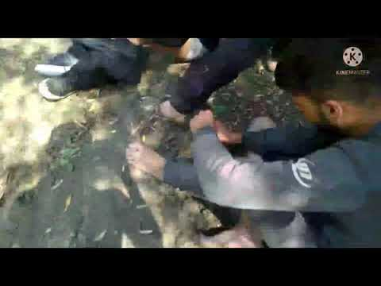

### AYS Weekend Digest 28\-29/8/21: Port authorities ‘order’ media to remove a video showing refugees boarding a Coast Guard boat
#### Following the recent arrest of journalists at the Greek border, the media comes under new pressure from the Coast Guard / 50 people stranded on an island in Evros / A lawyer specializing in refugee law and a member of the National Commission for Human Rights answers some of the questions on asylum in Greece/EU / Lawyers attempting to have the decisions regarding Afghan interpreters overturned in the UK / & more updates

_](assets/3deaa77162ef/0*tcjwMcsUZ-nZVvLn)

_Kythira, August 28, 2021: The boarding of the Kurdish refugees in a boat of the Greek Navy, via [Efsyn](https://www.efsyn.gr/ellada/dikaiomata/308079_omi-logokrisia-apo-limeniko-afaireste-ta-binteo-me-entoles-anoteron?amp&__twitter_impression=true)_
#### FEATURE

The Greek media station [Radio Adelin FM](http://www.adelinfm.gr/) Kythera was put under pressure by the Port Authority of Kythera, who called them and “ordered” the journalists to remove a video that was posted on the station’s website, showing the boarding of a group of Kurdish refugees on the Coast Guard’s boat LS\-143, it is reported\. [Reportedly,](https://www.efsyn.gr/ellada/dikaiomata/308079_omi-logokrisia-apo-limeniko-afaireste-ta-binteo-me-entoles-anoteron?amp&__twitter_impression=true) a Port Authority official asked the station to take down the videos from the website, with “senior orders”, otherwise a note saying that the “file footage” was falsified would be inserted, which of course does not correspond to reality\.

The story is that 58 Kurdish refugees — of which 43 people are unaccompanied minors — boarded the Greek Navy boat late on Saturday night\. They arrived in the early hours of Saturday on the shores of Kythera, in the area of ​​Avlemonas\.

■■■■■■■■■■■■■■ 
> **[Vassilis Tsarnas](https://twitter.com/VassilisTsarnas) @ Twitter Says:** 

> > #Greece: The @[HCoastGuard](https://twitter.com/HCoastGuard) is trying to avoid launching even a "Greek" (aka fake) investigation on its officers' attempt to censor @[ADELINFM](https://twitter.com/ADELINFM)'s site in #Kythera from publishing videos showing 72 #RefugeesGr picked by them. But the attempt to illegally deport them failed and 1/2 

> **Tweeted at [2021-08-29 15:37:30](https://twitter.com/vassilistsarnas/status/1432004489591115777).** 

■■■■■■■■■■■■■■ 

Although for a while the whereabouts of the people were unknown, thanks to the media who did speak up and the advocacy work of GHM, they are now reportedly in the camp of Leros\.
#### TURKEY
### **Lawyers from the group ÖHD to file a complaint against the Turkish and Greek border authorities**

Istanbul lawyer Çelik of Özgürlük için Hukukçular Derneği \(ÖHD\) is alleging that “Turkey and Greece violated the Geneva Conventions and the security forces of both countries worked together\.”

This [follows](https://anfenglishmobile.com/human-rights/lawyer-Celik-refugees-face-death-at-turkish-greek-border-54475?fbclid=IwAR3hQPnJNccSFMQSk1k2m395A-NdRKhpg2OnLKnDxhn1UIZ-4O3vZSWGlJg) the testimony of an asylum seeker who reports being part of a group of **150 people from Afghanistan and Syria who were illegally pushed back from Greece to Edirne in western Turkey** \. The incident, which took place on 24th August 2021 and has been confirmed by four other victims, involved women and children being separated from the larger group whilst the remaining 45–50 men and boys were thrown into the river which marks the border\. It was reported that three people drowned\.

Mr Çelik of ÖHD said that people fleeing the war are “going to hell”\. He further commented on the incident, and other similar reports: “According to these statements, we are facing murder and attempted murder\.”
#### SEARCH AND RESCUE AT SEA

31 people from sub\-Saharan Africa were rescued from a boat and transferred to the port of Arguineguín on Las Palmas de Gran Canaria, 112 Canarias reported [via Twitter](https://twitter.com/112canarias) this Saturday\. 
Upon arrival, 4 passengers were already deceased\. 
A female passenger suffered a cardiac arrest at the port and, despite resuscitation attempts, also died\. 
Of the 13 men, 12 women and 1 minor, a further 4 people were taken to hospital and are receiving treatment\.

> “They spent one day waiting for the arrival of the rescue boat and another day traveling to the Canary Islands\. Would the authorities have acted in the same way if it had been a European sailing boat that had been adrift for several days? We think not\.” — Alarm Phone 

This is in addition to reports of a boat capsized 35 km off the coast of Senegal\. Approximately 48 people are currently missing, with 11 reported survivors and 1 fatality\.

A further group of approximately 58 people was reported, somewhere between Laayoune, Morocco & the Canary Islands\. Despite searches by the Spanish Authorities, the vessel remains at sea for the third consecutive night\.

28 people were rescued 18 km from Gran Canaria on the afternoon of Sunday 29th August\. According to the official [reports](https://www.efe.com/efe/espana/sociedad/rescatan-a-28-inmigrantes-rumbo-gran-canaria-18-kilometros-de-tierra/10004-4617985?fbclid=IwAR2Nsof2jg6dxZVAHf2cfLp1Q8i4H3XlJm65JT6NOiWQ5952trOfcUknvss) , the passengers were 23 men and 5 women and of Maghreb origin, who were rescued within an hour of detection\.

Another boat contained a single survivor\.

■■■■■■■■■■■■■■ 
> **[Helena Maleno Garzón](https://twitter.com/HelenaMaleno) @ Twitter Says:** 

> > Solo una niña, de las ocho que viajaban en la patera, sobrevive en la última tragedia de Canarias. Los veintiséis náufragos vieron morir a veintinueve compañeros durante los doce agónicos días perdidos en el océano. 

> **Tweeted at [2021-08-29 19:59:29](https://twitter.com/helenamaleno/status/1432070421583704075).** 

■■■■■■■■■■■■■■ 

Another shipwreck was reported by Sea Watch International\. Their SeaBird plane detected the vessel on Friday 27th August and alerted Asso rescue vessels\. They report that “an overloaded patrol boat of the so\-called Libyan Coast Guard approached the scene” and that at least one fatality was observed\.

■■■■■■■■■■■■■■ 
> **[Sea-Watch International](https://twitter.com/seawatch_intl) @ Twitter Says:** 

> > Update: #Seabird could not establish contact with the two Asso vessels. A few minutes ago, an overloaded patrol boat of the so-called Libyan Coast Guard approached the scene and people are now swimming towards it. Meanwhile, we continue to search for survivors. 

> **Tweeted at [2021-08-27 14:22:04](https://twitter.com/seawatch_intl/status/1431260730146308108).** 

■■■■■■■■■■■■■■ 

539 people arrived via sea to the island of Lampedusa on 28th August\. They traveled in an extremely overcrowded wooden boat\. [In addition to this](https://twitter.com/campsoscar/status/1431575268003614724?s=20&fbclid=IwAR36cgf7Oel352HNcc5gAzjZvNiQbV5LrNfiU_NgGgUebeyEBmrx5kRmsjE) , 58 people were rescued from another vessel\. This group included 6 women, 10 children and a 4\-month old baby\.

](assets/3deaa77162ef/1*raQRuY-gFHYWBKWLXl2lpw.jpeg)

539 people arrive in Lampedusa, Italy on 28th August 2021\. [https://twitter\.com/campsoscar/status/1431575268003614724?s=20&fbclid=IwAR36cgf7Oel352HNcc5gAzjZvNiQbV5LrNfiU\_NgGgUebeyEBmrx5kRmsjE](https://twitter.com/campsoscar/status/1431575268003614724?s=20&fbclid=IwAR36cgf7Oel352HNcc5gAzjZvNiQbV5LrNfiU_NgGgUebeyEBmrx5kRmsjE)
#### GREECE
### 50 people stranded on an island in Evros

Calling on the Greek authorities to immediately evacuate people from the island and grant them their right to claim asylum, Josoor [continues reporting](https://www.josoor.net/post/breaking-another-group-of-50-people-stranded-on-an-island-in-evros-meric-river) on the Greek pushbacks\.
Footage sent from the island a few hours ago shows all group members without shoes, most without proper clothing and many of the group members severely injured with bruises and wounds, they write\.
In the most recent update, they say: “2 minors from the group contacted us from Istanbul\. Last night they were able to cross the river swimming undetected by TR border guards\. 2 severely injured ppl and one unable to swim plus 11 of their relatives remain stuck on the island\!”

On Wednesday, Greece made a new request to the EU Commission and Frontex for the immediate return to Turkey of 1,908 rejected asylum seekers living on the Aegean islands\. Athens says Turkey has been blocking the return of people not eligible for asylum for the past 17 months, according to this media [report](https://www.euractiv.com/section/politics/short_news/greece-says-turkey-continues-to-block-returns-of-illegal-migrants/?fbclid=IwAR14xC1ZVv2nst2pkuD4_kO5Jy_H0PVySvTI8D8AgGDvNALdxDkof7wDa7c) \.

Don’t miss out on our latest Frontex AYS Special:

### A take on the most relevant legal concerns when it comes to asylum seekers arriving in Greece

A lawyer specializing in refugee law and a member of the National Commission for Human Rights answers some of the questions and doubts regarding the possibility of refugees, particularly Afghan refugees, applying for international protection in Greece in light of recent developments\.

Are they obliged to apply first in a “safe third country” outside the European Union, along the route they passed through while reaching EU/Greece, or not?

[He published](https://www.facebook.com/story.php?story_fbid=351308926720586&id=100055244437446) the following:

> 1\) The concept of a “safe third country” \(for applications for the international protection of foreign countries outside the European Union\) exists in Community law, but is not provided for in international refugee law \(Geneva Convention etc\) \. In order for a third country to be safe, among the criteria mentioned in Community law, it must provide international protection “according to the Geneva Convention”\. The Geneva Convention, in the letter of Community legislation, means the BOTH the Geneva Convention of 1951 AND the 1967 New York Protocol, which does what? It extends the possibility of seeking international protection to refugees from OUT OF Europe \(as the 1951 Convention was only about refugees INSIDE Europe due to the preceding World War II\) \. 

> E\.g\. In relation to Afghans, NO neighbouring country \(not even Turkey\) fulfils this condition, as they have either not signed the 1951 Convention or, like Turkey, they have signed the 1967 Protocol but applies its geographical limitation to the 1951 Convention, i\.e\. it ONLY accepts refugees from Europe under this Convention\. 

> So even if Afghans \(and any other refugees\) want to, they CANNOT submit asylum applications from within their own country to Iran or Pakistan, or other neighboring countries, under international law\. 

> 2\) Greece and other European Union Member States are obliged to allow access to their territory to ALL international protection applicants who want to request it\. This is why reposts, deterrents from entering \(or whatever they want to name them\) of these people are banned and illegal\. Foreigners of third countries should be allowed to submit their requests, including the application for international protection\. 

> 3\) You may wonder why Greece \(and, in essence but informally, the whole European Union\) officially calls Turkey a safe third country? In order to serve the EU’s purpose of externalising the possibility of applications for international protection in EU countries to third countries, they found the term “EQUIVALENT” protection under the Geneva Convention instead of according to the Geneva Convention, as stated in Community law\. What’s more, they gave and want to continue giving some billion euros to Turkey to maintain refugees on its territory\. Turkey has made an internal law, which, in my opinion, provides inferior protection to Syrian and other refugees \(unfortunately I cannot analyze here for space reasons why Turkey’s protection is inferior to international protection\) \. 

> 4\) The Member States of the European Union have made the Geneva Convention and the New York Protocol a Community law\. Also, on other continents, there are other regional contracts that apply to countries that have signed and ratified them\. Therefore Afghans, Pakistanis, Moroccans and other refugees and immigrants cannot WITHOUT conditions seek international protection ANYWHERE they want, but only where the country is bound by a relevant international convention \(e\.g\. in Europe — the Geneva Convention\) \. We said above that, for example, NO Asian country between Afghanistan and Greece qualifies to accept international protection applicants\. 

> 5\) Also potential international protection applicants CANNOT apply DIRECTLY for international protection in a “safe third country” because that country does NOT provide for such procesess, given that the process itself is a European invention\. They must FIRST submit applications to a Member State of the European Union, be deemed to have PASSED through that country, be deemed that they are safe, be rejected as inadmissable on the grounds that their application will be examined by that “safe third country” and ACCEPT this country \(e\.g\. Turkey\) \. However, in practice Turkey has stopped accepting such returns since March 2020, so rejected applicants from Greece can NOT even go to Turkey and have their request re\-examined under Turkish law\. 

#### POLAND
### Stuck at the border with Belarus for 2 weeks

32 people from Afghanistan have been stuck at the border between Poland and Belarus for two weeks\. German media [reports](https://www.sueddeutsche.de/politik/polen-belarus-fluechtlinge-1.5393105?fbclid=IwAR1GZD9FGzGBVMo35Lnl0AcgyOQX_g7vwxZw6URG8R0EWTrQci4BnBhaN6E) that Polish border guards are in front of them, and Belarusian border guards behind them\.

> They have neither enough food nor clean drinking water, and many of them urgently need medication or a doctor\. 

This incident is connected to accusations that Belarusian leader Alexander Lukashenko is encouraging and helping people from Afghanistan, Iraq and other countries to arrive in Minsk by plane, before subsequently assisting them in reaching the border of the European Union\. Multiple pushbacks from Lithuania and Poland to Belarus have been reported in the past weeks\.
#### UK
### As government fails, citizens’ support initiatives continue

Efforts to provide support to arrivals from Afghanistan continue\. Care4Calais provides [this guide](https://care4calais.org/thedropoffmap/?fbclid=IwAR0HFPeFuGa2Gy8nSra7vsqkJK7CvsEdhvtjaEwkJi6hOTZ3mVFQ083yOdA) to locations to take donations\.

The efforts of [Channel Rescue](https://channelrescue.wordpress.com/) , a rescue and solidarity organisation based in the south of England, are discussed in the latest issue of [The Civil Fleet Podcast](https://podcasts.apple.com/gb/podcast/episode-11-the-humanitarian-crisis-in-the-channel/id1574079272?i=1000533372396&fbclid=IwAR0Wx8NeseAoYRtfcSL9cFc7pgSavuAI28SGT0maiz2rUquuqi6WdOm-YoI) \.

The UK government has failed to strike any return deals with European Union countries\. As revealed by [The Independent](https://www.independent.co.uk/news/uk/home-news/asylum-afghan-priti-patel-brexit-b1910327.html?fbclid=IwAR0glXpIWM_VpAePMpzhm_3VaOJ3D9_VadAMkssc0HFkN-R_M976rYAYevw) , thousands of asylum seekers have been considered for removal to EU nations “causing delay and cost”, despite the lack of any agreements\.

4500 people have had their cases halted as a result of this\.

Dozens of Afghan interpreters having been denied access to the UK after the withdrawal of troops\. The people in question were approved for removal from Kabul to the UK by the Ministry of Defence, but they and their families later received letters from the Home Office stating that they are a [“danger to \[national\] security\.](https://www.independent.co.uk/asia/south-asia/afghanistan-interpreters-taliban-home-office-b1910410.html?fbclid=IwAR3XeqWWcTPilefjHFtrYrzqJatmOLfIS0iEgBTurgI81Uuw5iHbjm4faiY) ” Lawyers are attempting to have the decision overturned\.

Also in the UK, the Scottish city of Glasgow **is providing a platform for refugees and asylum seekers to connect via music** \. [Musicians in Exile](https://www.bigissue.com/culture/music/musicians-in-exile-the-group-uniting-refugees-via-song/?fbclid=IwAR1w7Af2h42i2aI2hepripqMUSiqSajWjE2ZrFyEW0gGDettkz7qwBrLs74) have released their first song, entitled _Always on the Move\._
#### WORTH READING
- The EU and the German government are increasingly focusing on “voluntary” return — a journalistic team asked experts and people concerned about Afghanistan, Morocco, Tunisia, Egypt, Mali, Northern Iraq and Iraq, Syria and Germany: Is assisted return more humane than deportation? Answers to these and other questions can now be found on their trilingual website: German: [freiwillige\-rueckkehr\.de](http://freiwillige-rueckkehr.de/) / English: [return\-watch\.org](http://return-watch.org/) / French: [return\-watch\.org/fr](http://return-watch.org/fr)

**Find daily updates and special reports on our [Medium page](https://medium.com/are-you-syrious) \.**

**If you wish to contribute, either by writing a report or a story, or by joining the info gathering team, please let us know\.**

**We strive to echo correct news from the ground through collaboration and fairness\. Every effort has been made to credit organisations and individuals with regard to the supply of information, video, and photo material \(in cases where the source wanted to be accredited\) \. Please notify us regarding corrections\.**

**If there’s anything you want to share or comment, contact us through Facebook, Twitter or write to: areyousyrious@gmail\.com**

_Converted [Medium Post](https://medium.com/are-you-syrious/ays-weekend-digest-28-29-8-21-port-authorities-order-media-to-remove-a-video-showing-refugees-3deaa77162ef) by [ZMediumToMarkdown](https://github.com/ZhgChgLi/ZMediumToMarkdown)._
