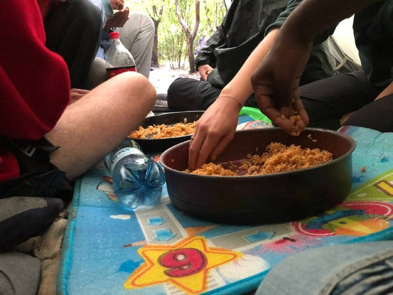
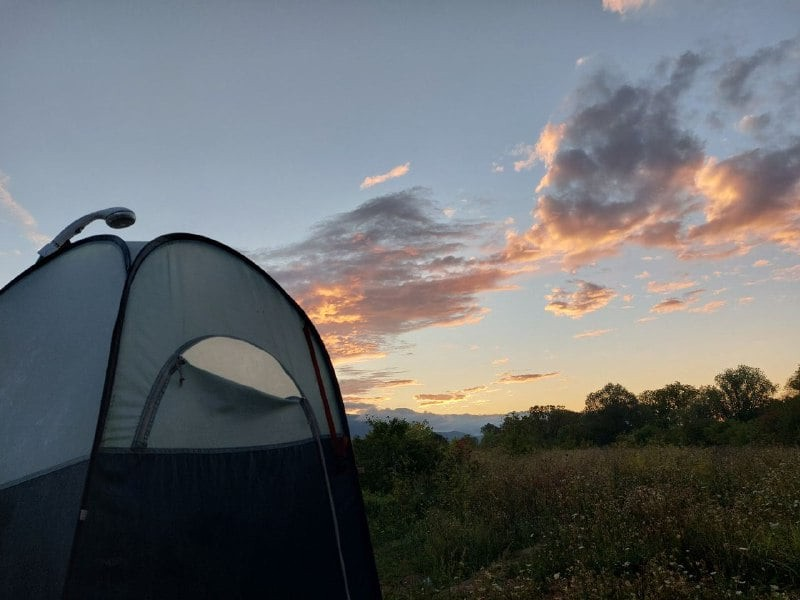
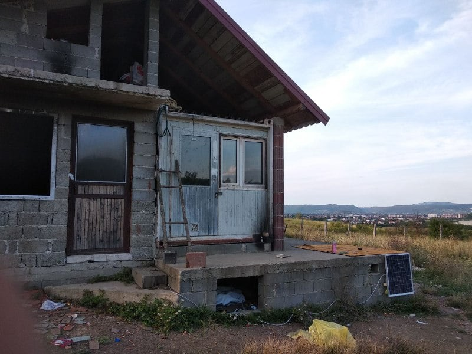
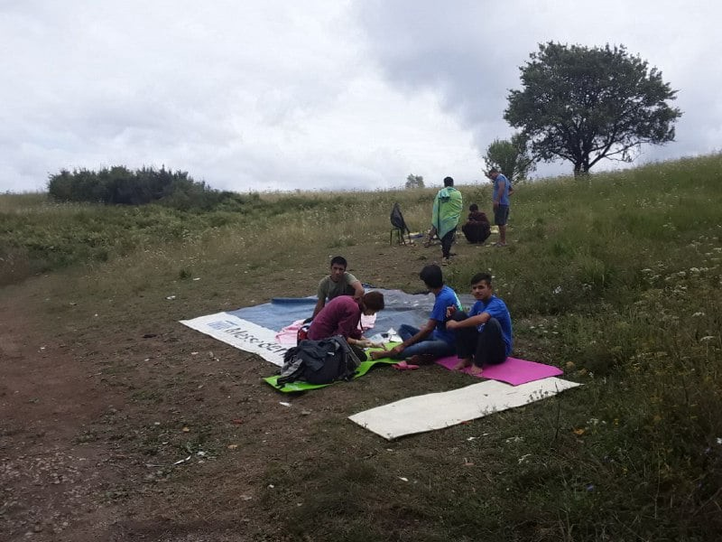

### AYS Special from Bihac: “A handshake, a hug, and they are gone\.”

_The [Collettivo Rotte Balcaniche Alto Vicentino](https://www.facebook.com/Collettivo-Rotte-Balcaniche-Alto-Vicentino-106502621137969) is a small group of solidarians innorth\-eastern Italy, focusing on supporting people on the move at European borders\. They provide concrete help and establish relationships with other grass\-root groups in order to create an underground railroad able to break through the borders of Fortress Europe\. Furthermore, together with the comrades of the [Lesvoscalling Campaign](https://www.facebook.com/lesvoscalling) , they mobilise our territories against EU’s criminal policies and for freedom of movement\. In July and August, members of the collective have been active in the area surrounding Bihac, on the Bosnian/Croatian border\._

This summer, for the past month and a half, we have been in Bihac, in Bosnia and Herzegovina\. We collaborate with [No Name Kitchen \(NNK\)](https://www.facebook.com/NoNameKitchenBelgrade) , after having supported their activities from afar since 2018\. We built a number of mobile showers, with hot water, that can be used by up to thirty people per day in the _squats_ \(encampments in abandoned buildings\) and in the _jungles_ \(makeshift camps in the woods\) in the area at the border with Croatia\. We have brought sulphur soap and lenitive cream to soothe the symptoms of scabies, and some basic drugs to treat wounds, as much as we can\. Scabies is indeed endemic and it is impossible to eradicate it altogether with our limited means\.

Where we can, together with NNK and [Frachkollektiv](https://www.facebook.com/frachkollektiv) , we have helped bring 500 litres of drinking water per day into the many _jungles_ in the area _\._ Together with our showers, we give out a change of clothes \(t\-shirts and underwear\), while we distribute other items of clothing like trousers and jackets only in case of a specific requests\. For example, this happened when we met a group that had no way to contact the distribution network of NNK, because the Croatian police had destroyed all their phones, as they do systematically\. We act in a similar way with our food distribution\.

Despite the efforts, not even the very basic needs can be cared for by grass\-root groups on the ground\. In August, we fitted three solar panels in key points of the main _jungle_ near the town of Bihac, so that people could charge their phones and have some light after dark\.

Beyond the improvement of hygienic conditions, bringing our mobile showers allows us to spend our time together with people on the move\. We spend time together, have chapati and potatoes for lunch, drink tea, people tell their stories and we tell ours\. We come back to each place every week, to maintain those ties which are necessary to build political and caring relationships\. Without those, our activity would risk turning into an impersonal provision of services\. All camps and squats are precarious and volatile, because everyone tries _the_ _game_ \. Even so, some faces are now familiar\. On the 30th of August, when members of our collective were in Trieste on their way back home, we met those faces again\. We also try to collect information on pushbacks and on police activity, to understand how to denounce the many abuses that take place along the routes\.

We try to show our solidarity, our rage, and our “closeness”, for what it’s worth\. We want to tell to people on the move that there are people, from the other side of the border, who don’t cover their faces like the Croatian police do, and who are there to help them cross the border, and to apologise for what is happening to them\. “You are struggling with us,” is one of the nicest things we have been told\. Life and beatings shape people: during the last week of August, while building a ladder to help access a squat surrounded by a 2\-mt high wall, a 19\-year\-old young man told us that it was not necessary, as he had already climbed over a 4\-mt high fence in Hungary\. People’s resistance is extraordinary, but the border regime is nonetheless brutal\.

Over the last days it rained a lot\. At night, temperatures drop below 10 degrees, and life in the _jungles_ is even harder\. Police carry on evicting people and pushing them away from tourists’ sight, with mass deportations to Lipa camp, which on September 6 should be “inaugurated” with its new containers \(instead of tents\) and a capacity of 1500 people\. This camp, isolated on an upland 30 km from Bihac, is a crucial element of the segregation policy of Bosnian authorities and the externalisation of borders carried out by the EU\. However, it is likely that this inauguration will be postponed, as IOM doesn’t want it to happen before electricity and water are connected\. As of today, they are not\. In truth, no one wants to be in Lipa, because of the lack of services and the distance from both town centres and the border\.

The need to reach Italy and central Europe is becoming a desperate urgency, with winter approaching\. In the coldest months, temperatures drop to around \-10 degrees, and it’s better not to be in the woods\. Some are going to Serbia, others to Sarajevo to spend the winter\. After winter, most people will carry on with their journey\. Croatian special forces, called Billa — those wearing black balaclavas — use batons, dogs, and guns, which they often use to shoot in the air to scare people off\. They also are equipped with an ever more sophisticated technological apparatus: thermal scanners, sound detectors and drones\. Also the Slovenian police are growing in numbers and in equipment\. 50 km more of barbed wire was recently built on the border with Croatia, and joint patrols with Italian police have started again\.

In the evenings, we see groups of people with backpacks heading to the mountains marking the border with Croatia\. They know what expects them and we do too, as much as we know that we need to do something for this to end\. “Good luck my friend”, “See you in Italy”, “Inshallah”\. A handshake, a hug, and they’re gone\.

**By [Collettivo Rotte Balcaniche Alto Vicentino](https://www.facebook.com/Collettivo-Rotte-Balcaniche-Alto-Vicentino-106502621137969) \(text and photos\)**

**Find daily updates and special reports on our [Medium page](https://medium.com/are-you-syrious) \.**

**If you wish to contribute, either by writing a report or a story, or by joining the info gathering team, please let us know\.**

**We strive to echo correct news from the ground through collaboration and fairness\. Every effort has been made to credit organisations and individuals with regard to the supply of information, video, and photo material \(in cases where the source wanted to be accredited\) \. Please notify us regarding corrections\.**

**If there’s anything you want to share or comment, contact us through Facebook, Twitter or write to: areyousyrious@gmail\.com**

_Converted [Medium Post](https://medium.com/are-you-syrious/ays-special-from-bihac-a-handshake-a-hug-and-they-are-gone-431cfc08a29f) by [ZMediumToMarkdown](https://github.com/ZhgChgLi/ZMediumToMarkdown)._
