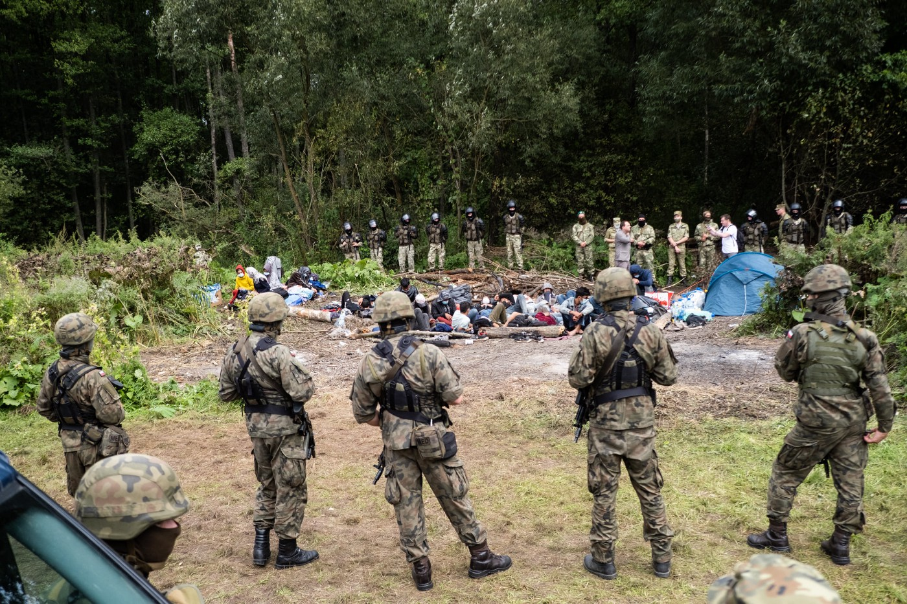
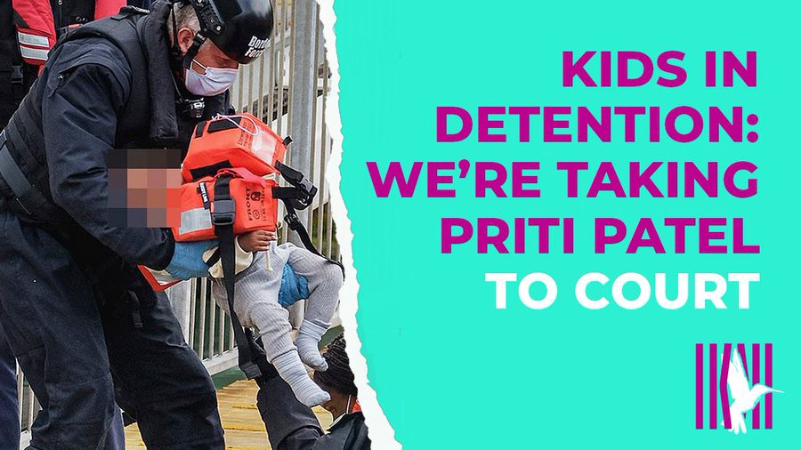
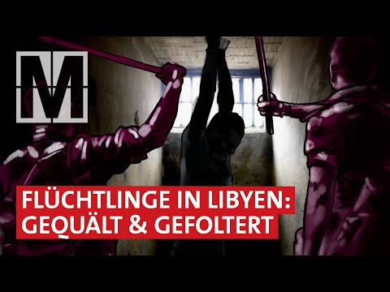

### AYS Daily Digest 7/9/21: Polish activists organize against pushbacks
#### UK: Taking Priti Patel to court / Police raids in Serbia less frequent, but more violent / France: forced displacement and at least 10 people locked up in administrative detention centres / Grenoble solidarity gathering / recommended reads

](assets/45a48716442a/1*uOKCa0b_vKTuwi_5-QpTqw.jpeg)

Apprehension near the forest at the Polish site of the border\. Photo: [Mikołaj Kiembłowski](https://www.facebook.com/FotoMikolajKiemblowski?__cft__[0]=AZX4fLH8eCd5lV49M5Fg2V5YBtOiqs_BSQqrTIis5YpJkj1BNvjdY17L3GpvXNY78ng-u3blnk-fdpxvDZcvbOSApyXkHJ9YQ3dKwY-KrorNucPkeIsQ07aKZIEtZ1SIN6VU-3tJOHH8JiKVxpZv15jwnbwXkniJDZPg3opuMw6ZKQ&__tn__=-]K-y-R)
#### FEATURE
#### Dozens illegally expelled from Poland every day, the state ignoring orders of the European Court for Human Rights

Refugees are once again used as human ammo in a political standoff between two countries at the external borders of the European Union\. In a situation that resembles the border between Greece and Turkey, hundreds of refugees are being pushed back and forth between Belarus and Poland in the past weeks\. According to local activists and lawyers, dozens of potential asylum seekers are entering Poland over the green borders every day, only to be apprehended and pushed back by Polish authorities\. There is a large population of Afghans among the victims, including many families with children and elderly people\. Despite their condition and potential asylum claim, Polish authorities are forcing them to walk through inaccessible and potentially dangerous dense forest areas, back to Belarus from where they are often tossed back to the Polish side of the border\.

](assets/45a48716442a/1*uRkJs2hlB2macb_dAM5M4w.jpeg)

Sick and elderly are not spared from the ill\-treatment\. Photo: [Mikołaj Kiembłowski](https://www.facebook.com/FotoMikolajKiemblowski?__cft__[0]=AZX4fLH8eCd5lV49M5Fg2V5YBtOiqs_BSQqrTIis5YpJkj1BNvjdY17L3GpvXNY78ng-u3blnk-fdpxvDZcvbOSApyXkHJ9YQ3dKwY-KrorNucPkeIsQ07aKZIEtZ1SIN6VU-3tJOHH8JiKVxpZv15jwnbwXkniJDZPg3opuMw6ZKQ&__tn__=-]K-y-R)

This situation is different from systematic denials of access to asylum at Polish borders, which so far affected refugees coming to the Belarus\-Poland border by trains\. That trend peaked in 2016, when numerous people from Chechnya, but also from Tajikistan and Georgia, have been trying to apply for asylum\. When they would arrive at the border station by train from the Belarus city of Brest, Polish border guards would ignore their asylum claims and would return them to Belarus the same day\.
#### 32 Afghans pinned between borders for a month

This time, refugees from the Middle East and other troubled areas are crossing the border irregularly, and allegedly with the assistance of the Belarussian regime\. The situation is especially dire for 32 Afghans trapped in a no man’s land between Belarus and Poland for almost a month\. While Belarus is not accepting them back, Polish authorities are preventing them from entering Poland to exercise their right to seek asylum and denying them access to food and medicine\. The European Court for Human Rights issued an interim measure, ordering Poland to grant them access to basic provisions \(but not to the territory\! \), but authorities are so far ignoring the court order\.

32 Afghans have been pinned for nearly a month between two borders\. Photo: Maciej Moskwa

> For several days we have been observing a political game, the effect of which is felt directly by 32 people imprisoned in the border zone between Poland and Belarus in the town of Usnarz Górny\. At the same time, every day, dozens of other people cross the border looking for shelter and asylum\. It’s happening away from the media attention — along the green border\. Refugees are subjected to brutal and illegal push\-backs, thrown to the Belarusian side and deprived of their dignity\. Only a few, after interventions on lawyers, incl\. The Association for Legal Intervention, CHLEBEM I SOLĄ and the Ocalenie Foundation have managed to enter the procedures for applying for international protection, activists from [Rozbrat](https://www.facebook.com/rozbrat/?__xts__%5B0%5D=68.ARCQrahy5Px3G8sB_RtjBAk2-f-76KcCYsJ2nZ1WihvjDxj2tgziXBPkMPNOcPtSgmHvzVOHzzhjLggS1K1wKFhL8XvylIWdczXEN2vzEI2RZezoTgFKkXPkrCKzcGylFzyta6Wx_EQofKhgE9hnsYsJzxVHirrbPDWP8EMDGNzWLG2Quc7Jt26HEbfA0nsb5R0QyouvVbH2GXBnRrMqJOIMyDEVh_1nTtL5vyQpTgkfQYrLti2apgkHlqAcfhAyWC2vtQrDuoGyywRWSyAKbVkf4UVhv5zotWlFKAJTNlrZ) collective explained\. 

#### State of emergency preventing access to victims

In the first weeks of the crisis, teams of lawyers, activists, and documentarists were approaching the newcomers with prepared powers of attorney, in order to secure legal representation in Poland before they are apprehended by the police\. Even then, the lawyers often had trouble finding their clients in police stations, only to learn they were pushed back\.

Access to victims is even harder since Poland imposed a state of emergency, cutting off a large strip of the border area\. Journalists and activists are not allowed to enter a 30\-km wide border zone, and the locals have very little information about what’s happening\. The activists have organized an outreach program, explaining the basics of fundamental rights, including access to international protection, to those who live in the area and might find themselves in a position to help the refugees\.

[")](https://www.youtube.com/watch?v=xhteTIFBm0k)

#### New legislation violates international and EU law

Activists are currently coordinating and regrouping to ensure direct support, information sharing, and legal follow\-up of the cases\. A big point of concern is the Polish attempt to legalize pushbacks: legislation leading to this was passed two weeks ago, and the new proposal is being tabled in the parliament, to prevent access to the asylum system for those who have crossed the borders illegally\. This is a direct violation of the EU law and the lawyers are exploring the way to challenge the new legislation at the EU level\.

Groups that are engaged in the border area include Fundacja Ocalenie, Helsinki Committee for Human Rights, Poznańska Garażówka, Rozbrat Collecive, No Borders Katowice, No Borders Poznań, Balkan Solidarity Network, Nomada Stowarzyszenie, Stowarzyszenie Interwencji Prawnej, Homo Faber, Polskie Forum Migracyjne, Salam Lab, Dom Otwarty, Centrum Pomocy Prawnej im\. Haliny Nieć, CHLEBEM I SOLĄ and uchodźcy\.info, as well as numerious individual activists who are supporting the goal\. Are You Syrious is in contact with activists on the field and is putting our expertise and resources at their disposal\. Striking similarities between what’s happening in Poland today and what’s been unfolding at the Balkan route since 2016 only prove pushbacks are an EU\-wide trend, and responsibility needs to be sought not only in national authorities, but also in Brussels, Geneva and Warsaw\.
#### SEA

23350 men and women intercepted by the Libyan Coast Guard since the beginning of 2021\. The numbers are known but nothing of their fate\. Indeed it is known: the intercepted are destined for arbitrary detention, torture etc\. But for Europe this is not the point\. — N\. Porosia
#### GREECE

A year after the Moria fire, many are remembering the tragic event, reminding the public not much has changed, and that urgent politicians’ flights to the Aegean islands, a well as “no more Morias” political slogans remained only that\.

> On September 8, 2020, the Moria slum camp burned down on Lesbos\. But instead of finally accommodating the people properly, Moria 2\.0 was set up in no time and the isolation was intensified\. Unfortunately successful: Today hardly anyone speaks of the fate of the refugees who are stuck in Greece\. [A chronicle of oblivion\.](https://l.facebook.com/l.php?u=https%3A%2F%2Fwww.proasyl.de%2Fnews%2Fvergessenes-elend-ein-jahr-nach-dem-brand-in-moria%3Ffbclid%3DIwAR1oWbpEaiAf7j5-jJNJ2d2qndNleo2Eq28vfTXZYLTfj82xSqz099tP9ZY&h=AT0tDM933-pe6mRvJwjaQLwYH4Au-6dEYhM-uee_l1jXyHqSAmVeAeQjpJe9jXQjFtL9BpeHI3HONKfpBLxJ_xNGRllTf64D3PVnFbLvdLw5v8HhxJH8Q9qt8MP97y-S_OV05wwS8T5gBezm9Dqk2xaab6Ku5Q&__tn__=R]-R&c[0]=AT3tQK9La9sO7Z4lhaVrb07z-12iTAqvfsJ1Mb41BQSdy3qYzs0G_SPr1YTwjuj3IIclDJDwlNx3PzxGsEFeXh8gWfxr8Ng3rXAikC7qC1m0p7YxCdnzMLNdsCd3lL5PSdax0O3--xXb92prlCy6WeZx8k_EQGRE5_Euimgl1k1F_6D4Qy9hLwo7NTDxRHzzzZCUmPdWF8A3EMziq30) 

■■■■■■■■■■■■■■ 
> **[Parwana Amiri پروانه اميري](https://twitter.com/parwana_amiri) @ Twitter Says:** 

> > Exactly a year ago,after the fire in #MoriaCamp many politicians were saying “No More Morias”, but the current system and the condition of #GreekCamps is even worse!!

We needs a sustainable change in system!! 

#ChangeSystemEU #EuropeMustAct  #AfterFireInMoria #RitsonaCamp https://t.co/RwztNtJmGz 

> **Tweeted at [2021-09-07 18:27:40](https://twitter.com/parwana_amiri/status/1435308806376992769).** 

■■■■■■■■■■■■■■ 

Important decision was made — The previous decision rejecting a vulnerable Afghan Family’s asylum application, based on the JMD designating Turkey as a safe third country, was annulled by Appeals Committees after an appeal supported by HIAS Greece\.

■■■■■■■■■■■■■■ 
> **[HIASGreece](https://twitter.com/HIASGreece) @ Twitter Says:** 

> > 1/2 A Lesvos RAO decision rejecting an extremely vulnerable Afghan Family's asylum application, based on the JMD designating 🇹🇷 as a safe 3rd country, was annulled by Appeals Committees after an appeal supported by HIAS Greece. [kathimerini.gr/society/561485…](https://www.kathimerini.gr/society/561485947/prosfygiko-anatreptiki-apofasi-gia-afganoys/) 

> **Tweeted at [2021-09-06 07:44:17](https://twitter.com/hiasgreece/status/1434784503403270144).** 

■■■■■■■■■■■■■■ 

#### SERBIA

4254 people are accommodated in 13 asylum and reception centers across the country, according to Serbian Commissariat for Refugees and Migration \(SCRM\), making that a rise in the number comparing to previous years\. Among those people, there are 358 children, out of which 288 are with their families, while 70 are unaccompanied and separated children\. On 1 September, another school year started, 79 children from asylum center in Krnjača were signed into schools in Belgrade as well as seven children in Bosilegrad, InfoPark reports in their latest Newsletter\. 
They report that based on rumors that Greek authorities deports Afghans who were rejected asylum to Turkey urge more and more people to leave Greece and attempt seeking asylum in other European countries\. The rumors about Turkish officials further pushing people back towards border with Iran discourage people from seeking legal options to stay in Greece, and pressure them to travel irregularly or turn to smugglers, Info Park’s team members found out while talking to young people in Belgrade parks\.
Another worrying fact is —

> Police raids became less frequent, however more violent\. 

#### FRANCE
### Support \(for\) the Briançon 7

The Briançon Seven are appealing against prison sentences handed down against them for migrant smuggling, after they took part in a demonstration in solidarity with migrants and against the far\-right group Génération Identitaire\.

Now, Amnesty International France, Anafé, La Cimade, Médecins du Monde, Tous Migrants and the Briançon 3\+4 Support Committee call on France to **commit to the protection of human rights defenders and not to criminalise, through its legislation and practice, the help given to respect the rights and health of exiled people\.**

> A support rally is planned from 1\.30 pm on 9 September in front of the Court of Appeal in Grenoble\. 

Find out more in their latest common [press release\.](https://www.statewatch.org/news/2021/september/france-judgment-in-the-appeal-of-the-briancon-seven-see-you-on-9-september-in-grenoble/?fbclid=IwAR32HeWuZ7sZrDICg0hTWsDZ-0GW72-F6rTxKoU2oZ0nDzRpTWkeU_8Trxg)
#### Evacuation of 1\.210 people at André\-Citro ën Park: forced displacement and at least 10 people locked up in administrative detention centres — Utopia [reports\.](https://l.facebook.com/l.php?u=http%3A%2F%2Fwww.utopia56.com%2Ffr%2Factualite%2Fevacuation-parc-andre-citroen-deplacements-forces-10-personnes-placees-centre-retention%3Ffbclid%3DIwAR132xFG0u56uLhr77ydxnpxk34Nch032ti4v_zlQqBXCWUNV3jaNsJah2Q&h=AT2j0vV8tWld9ZT0AAL0XF05jGBFA0Lqrgm0lTBdwMhP9T04_yg1Eba-tHAzBHb0axbEw-0c-HAkMMVkeBzhhTB3983GxIU7D2qJzosllU0F8H-_PhykQxwsSiAj-_s8Zbn08iwLkzAGRWIWwQ&__tn__=H-R&c[0]=AT0rk1owPYjV1Wk29b7bHqC4epJQa5SfdLPjfm6khmgKPJ7vbX93YitXadsQk1R2AJ6FElXtrfDl27nhgFqvG400joTP3aXPMivNxlTeIzuBnPbLXII6I1D1QPQYJ716dSnd-xX1ftfHiPayJnOzSexiBe4RSo23bw8AjkjBZm9X8-s)
#### GERMANY

**The council of the municipality of Rhauderfehn in Lower Saxony is willing to take in refugees in addition to the quota\!**

In addition, the council appeals to the federal government to increase its efforts to address the causes of flight\. The rescue of people in the Mediterranean should also become more efficient, [Seebrücke — Schafft sichere Häfen](https://www.facebook.com/SeebrueckeSchafftsichereHaefen/?__cft__[0]=AZVxoGJRRHceohc-JKmJ4xs7C-4GAxW_au2LNob9SCMFrisYvKIkzY6CqmsWIM7jmDYZAjygTgrZk89avx7DpE_d4LqcBAitcXbn-LSahIs6in1S7IX7yDmppReWIrLPW4KhwG7qNpxdNSB6DoHvBaqRgcEHQsfIYF_MSIeRwQRGLJUyXzOwOLkOYpSxs6CppDbEevC1y1CKT1rzZQceI5oE&__tn__=-UC%2CP-y-R) reports\.

> Make your city a safe harbour, too\! 

You can find out how to do this on their homepage\.
#### UK
### Tightening the French\-British collaboration on stopping people on the move

After the British home secretary blamed the French for “failing to curb the number of migrants sailing across the channel”, France called on the British government to “be cautious about the announced use of procedures to fight against attempted sea crossings which would not only be dangerous for men, women and children onboard these boats, but contrary to international law” as the [conservative MPs urged Priti Patel](https://www.theguardian.com/uk-news/2021/sep/07/tory-mps-urges-priti-patel-to-return-migrants-to-france?fbclid=IwAR137oH6HljFOlTPJOvgWqiYl1V3l22delR3YN5fVGAjH1NSAUYOsegRGok) to immediately “send back anyone who joins an illegal crossing of the Channel from France”\.
### No child detention in the UK campaign

Unaccompanied child asylum seekers arriving in the UK have for a long time been taken in by the local council in the area they first enter, which is generally Kent for those who have crossed the Channel, but later that practice changed and they were held at the Kent Intake Unit \(KIU\), at the Port of Dover, until a placement with social services elsewhere in the country could be arranged\. Sometimes, that meant for 10 days\.

[Reportedly](https://www.independent.co.uk/news/uk/home-news/children-refugees-home-office-kent-council-b1915066.html?fbclid=IwAR2pqGwpuZtnaKoMUpQBJzrsfrVrHdWepkAwEjVpgeNfxB1Yeq1IiaeID1o) , they were required to share rooms with adults they did not know, and sleep on makeshift camp beds and thin mattresses on the floor in overcrowded conditions with no Covid\-19 safety measures in place\.

The Home Office and Kent County Council are now facing a legal charges over the unlawful and discriminatory treatment of children\.

> The system for protecting vulnerable refugee children has collapsed again\. Kent County Council is now refusing to support children arriving alone at our borders\. **And this Government’s answer is to lock up children instead\.** 

> We’re taking Priti Patel and Kent County Council to court to stop this terrible practice in its tracks, but we need your help 

Follow [**Detention Action**](https://twitter.com/DetentionAction) for more information and support the action\!

In the meantime, it seems only Pakistan is refusing UK’s deportees\.

■■■■■■■■■■■■■■ 
> **[BARAC](https://twitter.com/BARACUK) @ Twitter Says:** 

> > GOOD NEWS Pakistan have refused to allow deportation flight to land so it has been cancelled. 
The final of the  Home Office  summer set  of deportation flights was due to be to Pakistan tonight following 2 x Zimbabwe,  1 x Jamaica, 1 x Vietnam,1 x Nigeria/ Ghana. 

> **Tweeted at [2021-09-07 13:52:38](https://twitter.com/baracuk/status/1435239589732659207).** 

■■■■■■■■■■■■■■ 

Direct solidarity continues across the country:

](assets/45a48716442a/0*HvfZRXM6HGJ6YLFv)

[Newcastle Unites](https://www.facebook.com/NewcastleUnites/?__cft__[0]=AZVJBkNuLasnVGoen8OCjY7wSiOj3eGM-ibCLYNMFIRoKC7aGhG1c5himBi83lX0jejteN7_QhF7sz4WIN3JBoGQDEywovxOaT6eUJIVCA74tRoeDP-FzUTbc4aosLLARFTi2MDpgMqbt9EZNmD_xggzOTlaNd4Xzca-JH9JggzXX3iUmeK5YxCNHIDr0aUQWsDfAmBPfNAIHp0ruzDm4HYd&__tn__=-UC%2CP-y-R)
#### GENERAL

Syrian security forces have subjected Syrians who returned home after seeking refuge abroad to detention, disappearance and torture, including sexual violence, Amnesty International reported\.

> Any government claiming Syria is now safe is wilfully ignoring the horrific reality on the ground, leaving refugees once again fearing for their lives\. We are urging European governments to grant refugee status to people from Syria, and immediately halt any practice directly or indirectly forcing people to return to Syria\. 

### Event

Legal Seminar Series — How to Ensure Labour Rights of Undocumented Migrant Workers in a Changing Economy, by PICUM

#### WORTH READING
- Border Externalization to West Africa: Three Logics of Border Security Technologies:

- After deprivation of citizenship comes months or years in limbo:

- media report on Libya —

> For years the so\-called “Libyan Coast Guard” has been intercepting refugees on their way to Europe and bringing them back to Libya\. A coast guard that the EU helped build and finance\. The people then end up in closed camps, where serious human rights violations are the norm\. Now the number of returns has risen dramatically and new camps have been placed under the care of the Libyan government\. The conditions there should be better\. An illusion, as refugees and human rights organizations report\. What exactly is happening to them there? Who will benefit from this brutal system? And what is the EU doing to protect people from abuse? 

**Find daily updates and special reports on our [Medium page](https://medium.com/are-you-syrious) \.**

**If you wish to contribute, either by writing a report or a story, or by joining the info gathering team, please let us know\.**

**We strive to echo correct news from the ground through collaboration and fairness\. Every effort has been made to credit organisations and individuals with regard to the supply of information, video, and photo material \(in cases where the source wanted to be accredited\) \. Please notify us regarding corrections\.**

**If there’s anything you want to share or comment, contact us through Facebook, Twitter or write to: areyousyrious@gmail\.com**

_Converted [Medium Post](https://medium.com/are-you-syrious/ays-daily-digest-7-9-21-polish-activists-organize-against-pushbacks-45a48716442a) by [ZMediumToMarkdown](https://github.com/ZhgChgLi/ZMediumToMarkdown)._
