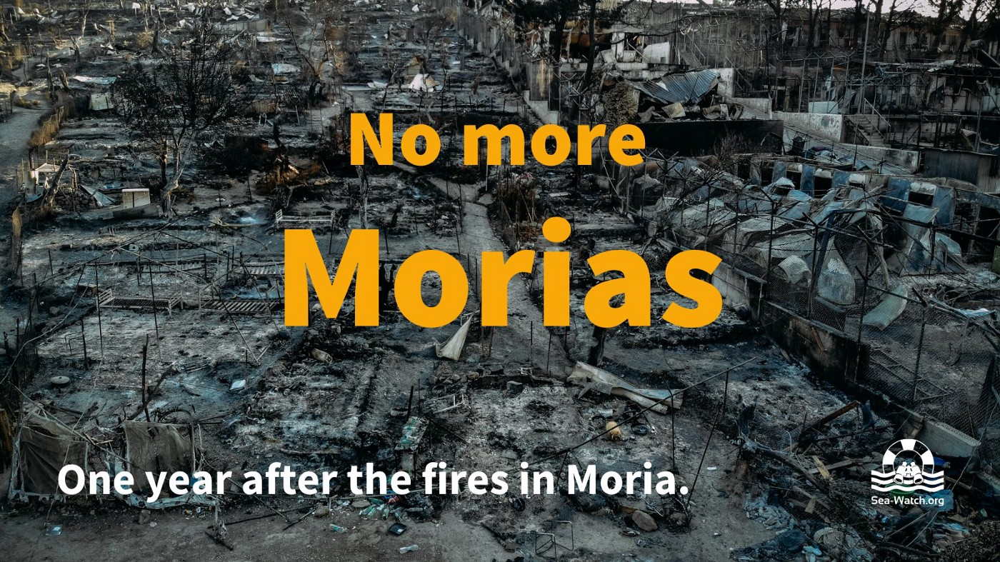

### AYS Daily Digest 08/09/2021: Amid the humanitarian crisis in Afghanistan, Europe makes sure “2015 won’t happen again”
#### Protest against new plans for EURODAC // Report on political economy of the border industrial complex published // Greece one year after the fire in Moria // Complaint filed against Samos authorities for pushback // New deportation and return bill implemented in Greece, despite criticism // Updates from the Sea // New outrageous anti\-migrant law in Denmark

One year ago today, Moria camp burned down\. See below\. Copyright: Sea Watch
### FEATURE: Border enforcement amid humanitarian crisis in Afghanistan

Just one day after Kabul fell to the Taliban, German chancellor hopeful Laschet claimed “2015 cannot be repeated”\. What happened in 2015 has been interpreted in various ways\. However, what happened afterwards is more important\. While, in the late summer of 2015, we witnessed a brief moment of actually existing legal entrance routes for people trying to apply for asylum in Europe, the access to these routes from autumn on became more restricted every day\. First only specific nationalities where allowed to pass, then the number of individuals who could pass was reduced each day — until finally around 13,000 people were stranded in Idomeni in Northern Greece in a massive, chaotic camp in March 2016\. The borders were sealed, Fortress Europe re\-erected, all legal routes denied\. Since then, the EU has not only not provided any legal entrance routes, but has enforced borders and surveillance and criminalized irregular migration in order to make it impossible for people to succeed in overcoming the system\.

Now, with a new humanitarian crisis in Afghanistan, there won’t be another 2015, because the EU and Frontex are far better prepared than they were in 2015\. In an [interview given to Reuters, Frontex CEO Leggeri said](https://www.ekathimerini.com/news/1167601/frontex-preparing-for-afghans-already-abroad-to-try-to-reach-europe/?fbclid=IwAR0-8AnfW5NpoklqCGR5jqZ2NWNG26EenFY9oCFHRoIQsXnIXkaVr8tt5bg) that the agency is closely surveilling what is going on not only in Afghanistan but also in neighbouring countries\. He said the EU is much better now at returning people as well as assessing the nationality of people who might claim to be Afghans\.

Meanwhile, human rights activists are following the rhetoric of the EU towards the Taliban regime with great concern\. Instead of the EU providing safe and legal entrance routes, many fear that it is only a question of time before the issue of deportations to Afghanistan will be on the table again\. In the last decade, 70,000 people were deported from the EU to Afghanistan\.

[Nick Buxton, a researcher at the Transnational Institute has said:](https://www.middleeastmonitor.com/20210907-eu-should-work-to-save-lives-not-punish-asylum-seekers-think-tanks-say/?fbclid=IwAR2MQk3eyX6ntl2nMxkWG4p7-Zyiu8wp8VZr48YtxqA1WpL2d7p4ONSi2tQ)

> “Whether it is member states pushing to continue deporting Afghans or EU statements about working with the Taliban to prevent migration flows, the EU perpetuates its policies of denying safe legal routes to desperate people, knowing that this will lead to many lost lives\.” 

Border fences are a normality again in Europe — although invisible for people with European passports\. [According to this article, 13 EU member states have erected fences along their borders, also between neighbouring member states\.](https://www.stuttgarter-zeitung.de/inhalt.festung-europa-wie-eu-laender-ihre-grenzen-gegen-migration-befestigen.a8e94b3f-39f8-4d1e-86eb-1d6eaeb922d3.html?fbclid=IwAR0rDhNKQxhAZqtnLb2YCvXClpWsogo4DXg7yvjIP9Xdx1NNCyYPKd-ElEo)

However, it is not only the borders of EU country through which the EU tries to deny people access to the asylum system\. A huge part of the border work is done by other countries, financed by EU money and framed as state\-building, development, or humanitarian action\. [This article speaks about border externalisation to West Africa\.](https://www.law.ox.ac.uk/research-subject-groups/centre-criminology/centreborder-criminologies/blog/2021/09/border?fbclid=IwAR21RyDlu2dgbO_AR62KZSiauOkUFsUoZ8m4ZyliasouIPQ0rdQxwu51y3s)
#### EURODAC to be turned into a tool of mass surveillance, NGOs fear

Meanwhile, 31 NGOs send an open letter to members of the European Parliament working on new rules for the Eurodac database\. The database was established in 2000 and collects the finger prints of people who are apprehended in the context of irregular border crossings\. The database forms the backbone of the Dublin system, as matches in Eurodac are used as evidence for determining which country is responsible to lodge the asylum process under the ‘first entry rule’ of the Dublin regulation\.

According to the plans, new types of data will be collected in Eurodac, including facial images and biometric data, as well as data about children who are six year’s of age and older\. Also the group of people from which data will be collected is to be expanded and should now include irregular migrants, people disembarked following search and rescue operations and people eligible for resettlement within the EU\. The letter send to the MEPs calls upon them to implement a delay in the legislative process in order to give time for the consideration of the implications for fundamental rights \.

For more info, see:

and here:

#### Who is profiting from Fortress Europe?

The ‘Advancing Alternative Migration Governance’ project published a report that looks into which private and commercial actors are involved in the implementation of current border control systems and how, through their assumed expertise, they shape and influence policies on what border control systems looks like\.

■■■■■■■■■■■■■■ 
> **[Matthias Monroy (@Mastodon)](https://twitter.com/matthimon) @ Twitter Says:** 

> > Beeindruckende Studie zu den Profiteuren der virtuellen #FestungEuropa. 
Hier abgebildet zum Beispiel Firmen, die Aufträge für die großen Datenbanken SIS II, Eurodac, VIS und EES erhielten: 
[admigov.eu/upload/Deliver…](http://admigov.eu/upload/Deliverable_D13_Lemberg-Pedersen_The_Political_Economy_of_Entry_Governance.pdf)
#SmartBorders https://t.co/O0iqWz61wJ 

> **Tweeted at [2021-09-07 07:53:38](https://twitter.com/matthimon/status/1435149243333873668).** 

■■■■■■■■■■■■■■ 

[From the report:](http://admigov.eu/upload/Deliverable_D13_Lemberg-Pedersen_The_Political_Economy_of_Entry_Governance.pdf)

> **Introduction** : “The assumption that border control systems constitute neutral technological fixes disregards not just that they constitute interventions against inherently political problems, but also that the systems themselves are produced through political and economic processes\. Consequently, this deliverable is founded on the outlook that any careful analysis of EU entry governance needs to take into account the political economy of border control practices, and how they can be shaped by concerns other than about migration, and by other actors than the public bodies and institutions of the EU or its Member States\. This report details how private and commercial actors also yield a crucial influence on the development, adoption and implementation of EU measures related to immigration\.” 

> **Conclusion** : “Accordingly, their \[market actors\] capture and co\-shaping of 
 

> the priorities for EU’s border infrastructures has served to accelerate the securitization and militarization of the associated European border control\. The result is that the entry governance of the EU is increasingly evolving into a market for border control along premises set by the largest market actors themselves\. They both position themselves, and are being positioned, as unrivalled experts\. But this connects entry governance and border control to industrial ambitions of widening and standardized future markets, of fighting market fragmentation, and of fusing civil and military purposes\.” 

### GREECE
#### One year ago today, Moria burned down

For a short moment in time, the hellish conditions in which people on the islands’ camps live reached the public attention, when pictures of the burning Moria camp went around the world\.

This timeline from our friends from BVMN helps to recall the events:

■■■■■■■■■■■■■■ 
> **[DunyaCollective](https://twitter.com/DunyaCollective) @ Twitter Says:** 

> > 1/2 One year ago we publish this video after the fire of #Moria. The message is still relevant. Even if much less refugees live in #Moria2 today, the conditions are not humane. There has been a tightening of the law to make access to asylum more difficult.

#LeaveNoOneBehind 

> **Tweeted at [2021-09-08 15:09:33](https://twitter.com/dunyacollective/status/1435621334952914951).** 

■■■■■■■■■■■■■■ 

But all the crocodile tears were shed for nothing\. Over this last year, Greece further undermined the system of refugee reception\.

The conditions in Moria 2\.0 are horrendous, access is denied for journalists\.

■■■■■■■■■■■■■■ 
> **[MSF Sea](https://twitter.com/MSF_Sea) @ Twitter Says:** 

> > “There is no difference between the old #Moria &amp; #KaraTepe camp. The procedures are the same. It is the same system. The #EU knows what’s going on in this shameful camp, nobody can feel us" says Ali, a survivor of torture from #Syria who is still on #Lesbos for more than a year. https://t.co/UDbKWEgy4f 

> **Tweeted at [2021-09-08 11:09:13](https://twitter.com/msf_sea/status/1435560852753686529).** 

■■■■■■■■■■■■■■ 

One year after the fire, the new enclosed camp facility on Samos is almost ready to start operating, while the one on Lesvos is not even under construction yet\. [Forty\-five civil society organisations are urging EU institutions and national governments to change their approach towards the processing of migrating people:](https://www.humanrights360.org/one-year-after-the-moria-fire-few-lessons-learned-as-greece-expands-barriers-to-refugees-protection/?fbclid=IwAR1ZsNqEVBka6pjSZRqsgVL1fY0VEWK6BF24jxwFTchu4YUqYAPy0d8nixY)

> “With financial and technical support from the European Commission, Greek authorities are constructing fences and concrete walls around existing camps, building closed camps in remote locations on the Aegean islands, and introducing legislation to further restrict the freedom of movement in and access to camps\. These walls are a physical manifestation of containment policies adopted by the EU and its Member States to isolate asylum seekers away from local communities\. By reinforcing such policies, they seriously risk impeding the effective identification and protection of vulnerable people; limiting access to services and assistance for asylum seekers; hindering independent monitoring of conditions inside facilities; and exacerbating the harmful effects of displacement and containment on individuals’ mental health\.” 

This article collects the voices of people in camps and speaks about their hopes and fears concerning the new facilities:

#### Pushback criminal complaint filed by Congolese couple

A couple from Congo filed a criminal complaint against Samos authorities\. The couple arrived to the island for the first time on 21 April, but was pushed back into the Aegean within 24 hours after their arrival\. The police operation included extreme violence and sexual harassment\. The couple made it back to Samos in July and was able to submit an asylum application\. The couple initially arrived together with 32 other people —27 of them were pushed back without any individual assessment\. Dimitris Houlis, the lawyer of the couple, said this is the first time such a complaint has been filed in a Greek court\. In many cases it is very hard to provide evidence for pushbacks, as authorities simply deny all allegation and often destroy the mobile phones of people on the move or force them to delete footage\. However, hundreds of testimonies have been collected by independent actors, showing a practice in line with the one in the complaint\.

For more information on the case, see here:

#### Greece’s Deportations and Returns Law enters into effect despite criticism

According to the T [urkish news agency](https://www.aa.com.tr/en/europe/greece-s-deportations-and-returns-law-comes-into-effect-despite-criticism/2358953) , Greece implemented the highly contested Deportation and Returns Bill\. The new bill reduces the grace period for voluntary deportations, makes it more difficult for people to appeal a deportation order with a stricter definition to what can be regarded as “humanitarian grounds” and reduces the period in which they can take legal action against such a decision\.

It also introduces fines for NGOs live\-saving activities conducted without permission of the Coast Guards\. For a discussion of the actual scope of this aspect, see this thread:

■■■■■■■■■■■■■■ 
> **[Daphne Tolis](https://twitter.com/daphnetoli) @ Twitter Says:** 

> > Will monitoring groups like @[ABoatReport](https://twitter.com/ABoatReport) be restricted? Civil society organisations are “instrumental in protecting the rights of refugees, asylum seekers &amp; migrants, and play a major role in reporting and documenting pushbacks or other human rights violations.” @[Dunja_Mijatovic](https://twitter.com/Dunja_Mijatovic) 

> **Tweeted at [2021-09-04 11:58:52](https://twitter.com/daphnetoli/status/1434123796450091011).** 

■■■■■■■■■■■■■■ 

Dunja Mijatović, Council of Europe Commissioner for Human Rights, strongly criticised the bill and urged Greek legislators to reject the restrictions envisaged in Article 40 concerning the work of NGOs\.

For more info, see:

### SEA
#### Most deadly route to Europe

According to the Spanish NGO Caminando Fronteras, at least 509 people died in August when trying to cross to the Canary Islands\. On this most dangerous route to Europe it is often not shipwrecks but dehydration that causes the death of many people\. Many boats do not make it to the islands but get lost somewhere in the Atlantic Ocean\.

The new ship Astral from ProActiva Open Arms NGO conducted its first rescue operation of 70 persons\.

Forty people were rescued close to Cádiz by the Spanish sea rescue organization Salvamento Marítimo\.

Thirty\-three persons were rescued by Salvamento Marítimo south of Gran Canaria\.
### ITALY
#### Arrivals

Lampedusa: 94 people arrived on two boats ‘A total of 94 migrants arrived in Lampedusa on two different boats and were taken to the hotspot, where there are currently around 280 people\.’
### AUSTRIA
#### Pushbacks from Austria investigated by NGOs

Push\-Back Alarm Austria and asylkoordination österreich are investigating a dozen cases of alleged pushbacks from Austria to Slovenia\. According to [their press release](http://www.asyl.at/de/info/presseaussendungen/systematicbreachoflawattheborderconfirmed/?fbclid=IwAR0291AShqT6YiDEhxZ6LUIeatzUgp1BIW4l0IFR3MRYH8A-FlyZzDN0jqg) , the Regional Administrative Court of Styria had already found at the beginning of July 2021 that the asylum application of a protection seeker had been “overheard” and that he had been illegally returned to Slovenia: “Based on the described course of proceedings \(…\) the court comes to the conclusion that _pushbacks_ are methodically applied to some extent in Austria\.”

The NGOs are currently working on the case of an underaged boy who was pushed back on 25 July 2021\.
### FRANCE
#### L’auberge des Migrants is looking for Volunteers

“We need volunteers\! With the end of the summer, several volunteers left us, for their studies or their work\. If you want to give us a hand, you are welcome in Calais\. The tasks: preparing meals, distributing food, sorting clothing donations, and \(as of October\) cutting and bagging wood for the exiles for heating and cooking; field distributions for volunteers staying for several weeks\. The midday meal is taken together, the atmosphere is good\. It’s your turn \! contact@laubergedesmigrants\.fr”
### SWITZERLAND
#### Demonstration on Friday to abolish Frontex

■■■■■■■■■■■■■■ 
> **[Abolish Frontex](https://twitter.com/abolishfrontex) @ Twitter Says:** 

> > [ACTION]: #Zürich will take the streets this Friday to protest against @[Frontex](https://twitter.com/Frontex) and the migration regime that comes with it. 

Share and come!  

Friday, 10.09.2021, 19:00 at Landesmuseum in Zürich! 

#Abolish[Frontex](https://twitter.com/Frontex)
#FightTheCampSystem
#StopDeportations https://t.co/eyi9vSil2X 

> **Tweeted at [2021-09-08 14:05:46](https://twitter.com/abolishfrontex/status/1435605284068728836).** 

■■■■■■■■■■■■■■ 

### DENMARK

Denmark is taking yet another step on its way to a totalitarian racist asylum system\. The Danish government plans to make migrants work at full\-time jobs if they are to receive state benefits\.

“We want to introduce a new work logic where people have a duty to contribute and be useful, and if they can’t find a regular job, they have to work for their allowance,” Prime Minister Mette Frederiksen told reporters\.

Frederiksen should be reminded of the fact that human rights and refugee rights do not apply only to people who are “useful”\. This logic is extremely dangerous and racist, paving the way to totalitarianism\.

The current government already declared its Zero Asylum Seekers aim and is inclined to open reception centres outside of the country\.

### READING RECOMMENDATIONS

The latest Mixed Migration Update by Joel Hernàndez is out\.

**Find daily updates and special reports on our [Medium page](https://medium.com/are-you-syrious) \.**

**If you wish to contribute, either by writing a report or a story, or by joining the info gathering team, please let us know\.**

**We strive to echo correct news from the ground through collaboration and fairness\. Every effort has been made to credit organisations and individuals with regard to the supply of information, video, and photo material \(in cases where the source wanted to be accredited\) \. Please notify us regarding corrections\.**

**If there’s anything you want to share or comment, contact us through Facebook, Twitter or write to: areyousyrious@gmail\.com**

_Converted [Medium Post](https://medium.com/are-you-syrious/ays-daily-digest-08-09-2021-amid-the-humanitarian-crisis-in-afghanistan-europe-makes-sure-2015-a149c7b077d6) by [ZMediumToMarkdown](https://github.com/ZhgChgLi/ZMediumToMarkdown)._
